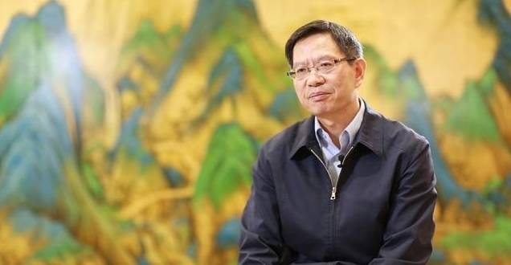
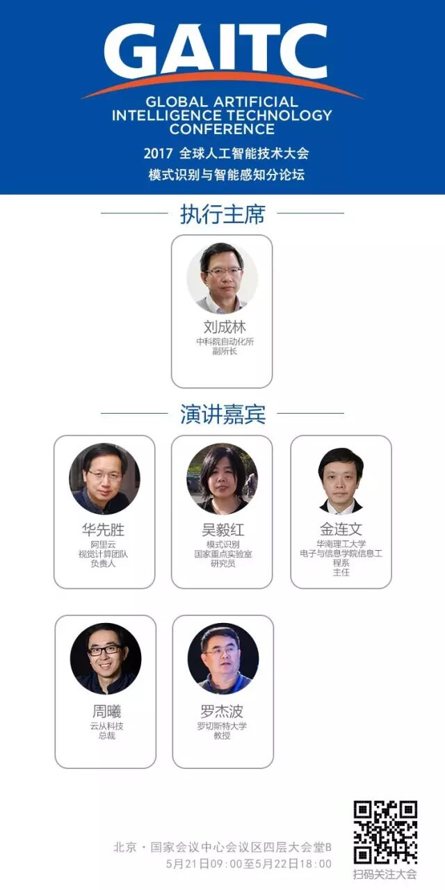
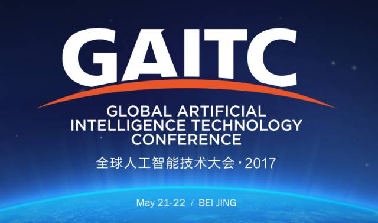

# 2017GAITC丨刘成林：技术融合是趋势，人工智能的边界在扩大

原创 自动化学报 2017-05-05 10:17 北京

> 原文地址: [https://mp.weixin.qq.com/s/UiWmhV13As269aT6sZfvbw](https://mp.weixin.qq.com/s/UiWmhV13As269aT6sZfvbw)

  

> 2017年5月21日，由中国人工智能学会、中国中文信息学会主办，亿欧公司、CSDN和小象学院联合承办的**“2017全球人工智能技术大会”**将在北京国家会议中心拉开序幕。  
> 
> 本次大会为中国人工智能权威大会，以**“交叉、融合、相生、共赢”**为主题，将汇聚全球人工智能学术界和产业界著名学者、顶级专家和业界精英。

  

为了探寻这次国际顶尖AI大会的风采，我们走访了本次大会**“模式识别与智能感知分论坛”的执行主席、CAAI模式识别专业委员会主任、中科院自动化研究所副所长刘成林研究员**，他对于智能感知与类脑研究、模式识别的应用场景以及人工智能的社会认知、发展前景等话题给出了独特见解，以下是他分享的主要观点。

  

 刘成林研究员

中科院自动化研究所副所长，中国人工智能学会（CAAI）常务理事，中国人工智能学会模式识别专业委员会主任，模式识别国家重点实验室主任，IEEE Fellow, IAPR Fellow。 研究领域：模式识别、图像处理、机器学习、文字识别、文档分析。 

      

  

  

**社会对AI的发展盲目乐观**

  

  

  

现在社会各个层次对人工智能格外热衷，大家都在谈论AI，好像AI可以解决所有问题，将来可能会在所有的领域取代人，甚至成为人类社会的威胁。

  

**我觉得这样的观点有些盲目乐观**。AI其实并没有我们想象的强大，它有很多弱点，而AI是否会对社会造成威胁，其实要看你怎么使用它。即使未来出现很强的人工智能，只要用好了也可以被人类完全掌控。

  

在这方面需要媒体和专业人士进行合理的舆论引导。

  

首先是新闻媒体的职责。为了让AI专业人士与大众之间更好地交流，或者让社会更好地了解人工智能技术的特点，我觉得新闻媒体尤其要少一些误导性的宣传。有些误导性的信息是因为媒体有些人对专业技术了解不深，按照他自己的理解去进行演绎。

  

其次专业研究者对于科普性宣传也是有义务的。比方说写一些科普性的文章，到社会上做一些科普性的讲座，多跟社会大众进行接触和交流。

  

  

  

**不要把眼光局限在深度学习上，它有它的局限**

  

  

  

一般来说，人工智能的方法可以概括成三个主义，也就是所谓的符号主义、联结主义和行为主义。

  

符号主义是人工智能早期的主流，从50年代到80年代，大多数人认为符号主义以外的东西不是人工智能；神经网络的方法从80年代中期到90年代火了一阵，到2006年又开始火起来，这就是联结主义；行为主义主要是指人工智能模仿人的某种行为、动作的方式。

  

目前深度学习特别火，但是人工智能不能局限在深度学习这一个方向，不同的方法各有各的优势，相互之间是互补的。

  

**深度学习跟统计学习比较起来，它的结构化理解能力比较弱，可解释性差。**比如要判断一个小学生写的字对不对，笔画层级的细微错误深度学习基本发现不了。有时候深度学习做物体识别错的很离谱，但对结果却还很自信。它的正确率可能很高，但是它一旦出错的话，错误可能是莫名其妙的，而且没法解释。

  

**要克服深度学习的不足，就要引入知识和结构，提高它的可解释性和鲁棒性**。从另一个方面讲，人可以从少量的样本学习到知识，进行可靠的识别，主要是因为在学习过程中利用了很多结构知识和上下文。比如人只看了几个苹果，就能把苹果的一些根本的特征都掌握，但是人工神经网络主要是在大量样本训练基础上建立一些特征的统计性联系。

  

  

  

**技术融合是趋势，人工智能的边界在扩大**

  

  

  

我1992年到中科院自动化所读博士，领域是模式识别。那个时候模式识别跟人工智能还在不同的圈子里，大家互不搭界。文字识别作为一个典型的模式识别问题，早起主要是研究单个字符的识别；后来单字识别精度到了一定程度之后，就要对一句话、一段话来进行识别，也就是文本行识别。到现在，模式识别也算是人工智能领域一个主要的分支。

  

**随着技术的发展，很多技术越来越趋于一种融合的趋势。**比如从文字识别到NLP（自然语言理解），过去就是分开做的，文字识别是把图像转化成电子文本，NLP做电子文本的内容分析。这两个领域发展到一定程度，进入到实用阶段后，二者就要结合起来，正如语音识别与NLP的结合一样。

  

**同时，人工智能的边界也在扩大。**目前人工智能没有一个统一的定义，有些技术有人认为是人工智能，有人认为不是。按照我的理解，界限就是这个功能是不是用到了“脑子”。纯计算不能算是智能，除此以外，凡是跟脑力活动相关的计算模拟基本上都可以算智能。比如扫地机器人虽然是纯体力的，但是它如果有感知功能，能够对环境和物体进行判断，基于感知对动作进行控制，就相当于它是有智能的。

  

  

  

**未来10到20年AI在社会层面的运用会越来越多**

  

  

  

**一些比较低级和重复性的劳动，肯定会逐渐被AI所取代。**像文字识别，例如快递单的识别，大量的古籍、文档的数字化，再过十年可能都会得到比较好的解决。在服务行业，一些比较简单的劳动（如业务流程的自动处理和咨询）都会被机器人所取代。

  

**未来在家用行业，服务机器人会用得越来越多。**比方说扫地机器人的感知能力会更强，它可能会感知附近的人和物体会发生什么情况，也许它还会跟你进行一些对话，进行更多交互。中国老龄化社会很快就来了，机器人会跟在家的老人进行人性化的交互，如语音对话，来解除人的寂寞，并可以监控家里的安全状况和人的健康状况。

  

简单地说，人工智能未来的趋势就是让智能机器和人相互帮助，和睦相处，让智能机器成为人的帮手，但是不能完全代替人。

  

**模式识别与智能感知分论坛信息**

5月22日，13:30 - 17:00

活动详情页面：**2017GAITC.caai.cn**

活动时间：2017年5月21日09:00至5月22日18:00

活动地点：国家会议中心会议区四层大会堂B

活动议程：

2017年5月21日 

-   上午： 主论坛报告+尖峰对话
    
-   下午 ：主论坛报告+尖峰对话
    

2017年5月22日 精彩分论坛

-   智能驾驶分论坛
    
-   模式识别与智能感知分论坛
    
-   AI变革时代的智能系统测评分论坛 
    
-   深度学习分论坛
    
-   智能金融分论坛
    
-   人工智能女科技工作者分论坛
    
-   自然语言理解分论坛
    
-   智能投资分论坛
    
-   脑科学与人工智能分论坛
    
-   智能体训分论坛
    
-   未来已来-人工智能的技术应用分论坛
    
-   智能机器人分论坛 · 人工智能前沿讲习班特别活动
    

  

JAS《自动化学报》（英文版）

  

自动化学报订阅号

自动化学报服务号