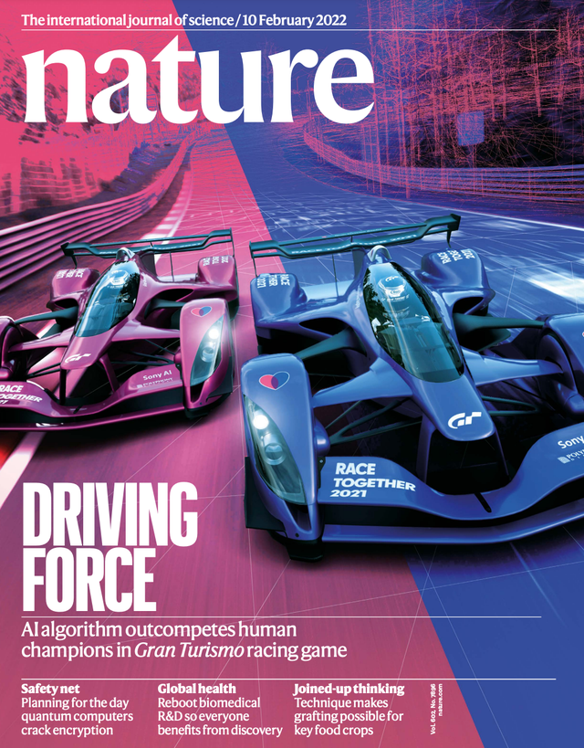
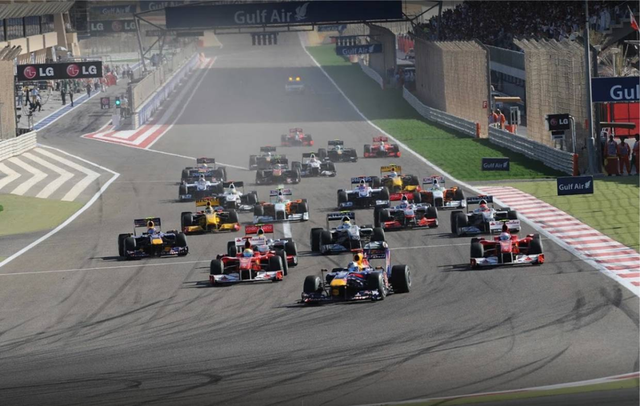
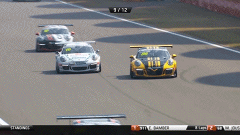
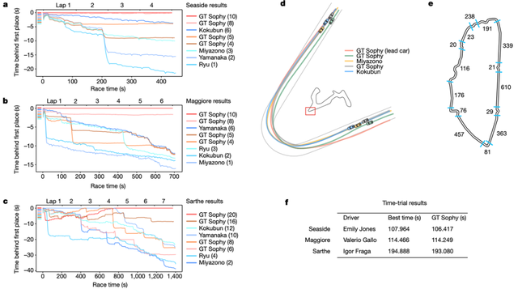
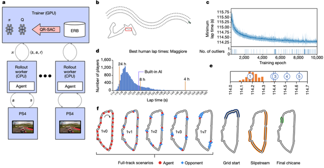
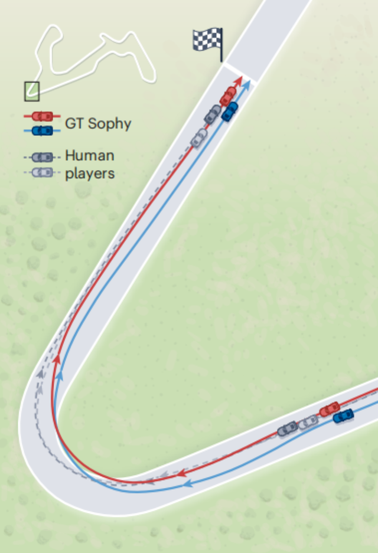
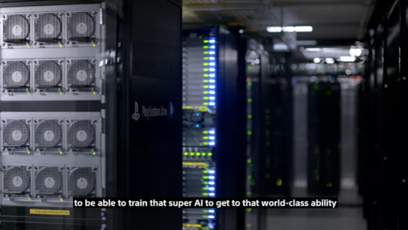
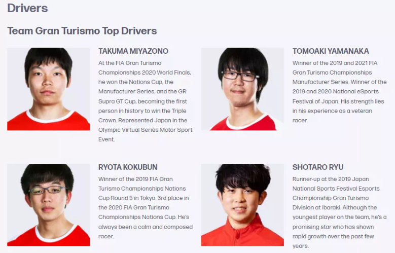
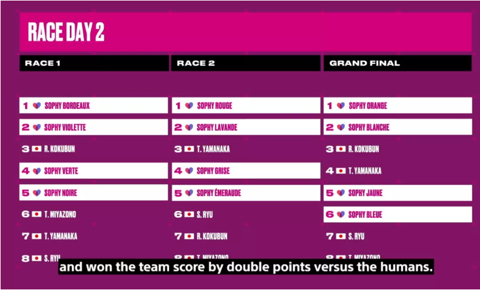
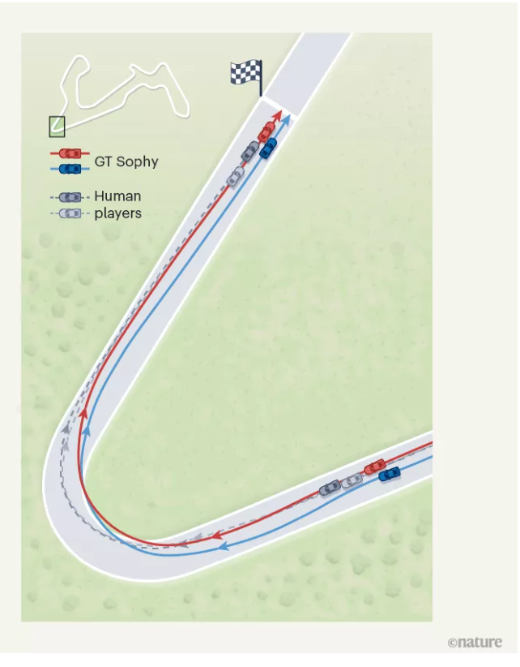

# Nature封面：人类又输给了AI，赛车AI击败人类顶级车手！

原创 自动化学报 自动化学报 2022-02-14 17:14 北京

> 原文地址: [https://mp.weixin.qq.com/s/NM8XedH3v30NCgo1dQCGcw](https://mp.weixin.qq.com/s/NM8XedH3v30NCgo1dQCGcw)

点击蓝字

关注我们

  

**Nature封面：人类又输给了AI，这次是玩《GT赛车》游戏**

  

作者 | 库珀  出处 | 学术头条

  

人工智能（AI）的很多潜在应用，涉及与人类交互时做出更优化的实时决策，而竞技或者博弈类游戏，便是最佳的展示舞台。

  

近期，发表在《自然》杂志上的封面文章报告称，AI 在赛车对战游戏 Gran Turismo（GT赛车）中战胜了世界冠军级人类玩家。这个 AI 程序名为“Gran Turismo（GT）Sophy”，是一种神经网络驱动程序，**它在遵守赛车规则的同时，展现出了超凡的行驶速度、操控能力和驾驶策略。**

  

（来源：Nature）

  

完成这项 AI 程序研发的核心团队来自索尼 AI 事业部（Sony AI），《GT赛车》系列游戏是日本 Polyphony Digital 公司开发，忠实再现了真实赛车的非线性控制挑战，封装了复杂的多智能体交互，该游戏在索尼 PlayStation 及 PSP 等游戏主机平台上皆有发行，是一款极具拟真感操纵体验的热门赛车游戏。

  

**假如有此 AI 程序的加持，人类玩家估计再也跑不过加强版的单机程序了吧？**

  

图｜游戏截图（来源：GT赛车）

  

研究人员认为，此项成果或让赛车游戏变得更有意思，并能提供用来训练职业赛车手和发现新赛车技巧的高水平比赛。这种方法还有望应用在真实世界的系统中，比如机器人、无人机和自动驾驶汽车等。

  

**赛道里的速度与激情**

  

图｜F1方程式赛车比赛（来源：GNEWS）

  

赛车比赛的目标很简单：如果你比竞争对手在更短的时间内跑完赛道，你就赢了。然而，实现这一目标需要极其复杂的物理战，驰骋赛道需要小心使用轮胎和道路之间的摩擦力，而这种摩擦力是有限的。

  

为了赢得比赛，车手必须选择让汽车保持在不断变化的摩擦极限内的轨迹上。转弯时刹车太早，你的车就会慢下来，浪费时间。刹车太晚，当你接近转弯最紧的部分时，你将没有足够的转弯力来保持你想要的路线轨迹。刹车太猛，可能会导致车体旋转。

  

  

因此，职业赛车手非常擅长在整个比赛中一圈接一圈地发现并保持赛车的极限。

  

尽管赛车的操纵极限很复杂，但它们在物理上可以得到很好的描述，因此，它们可以被计算或学习是理所当然的。

  

  

图｜游戏比赛数据对比（来源：Nature）

  

近年来，利用全尺寸、大规模和模拟车辆，自主赛车的研究不断加速。一种常见的方法是预先计算轨迹，并使用模型预测控制来执行这些轨迹。然而，当在摩擦的绝对极限下行驶时，微小的建模误差可能是灾难性的。

  

**“AI赛车手”的炼成**

  

在 GT Sophy 的开发过程中，研究人员探索了各种使用机器学习来避免建模复杂性的方法，包括使用监督学习来建模车辆动力学，以及使用模仿学习、进化方法或强化学习来学习驾驶策略。

  

为了取得成功，赛车手必须在四个方面具备高度技能：（1）赛车控制，（2）赛车战术，（3）赛车礼仪和（4）赛车策略。

  

为了控制汽车，车手们对他们的车辆动力学和赛道的特性有详细的了解。在此基础上，驾驶者建立所需的战术技能，通过防守对手，执行精确的演习。同时，驾驶员必须遵守高度精炼但不精确的体育道德规则，最后，车手在模拟对手、决定何时以及如何尝试超车时，会运用战略思维。

  

  

图｜GT Sophy 的训练（来源：Nature）

  

值得注意的是，GT Sophy 在短短几个小时内就学会了绕道而行，并超过了数据集中 95% 的人类选手，它又训练了九天时间，累计驾驶时间超过了 45000 小时，跑圈时间减少了十分之一秒，直到圈速停止改善。

  

为了评估 GT Sophy，研究人员在两项赛事中让 GT Sophy 与顶级 GT 车手进行了较量，GT Sophy 在所测试的三条赛道上都取得了超人的计时表现，它能够执行几种类型的转弯，有效地利用漂移，扰乱后面车辆，拦截对手并执行其他紧急操纵。

  

图｜AI 车手超越人类玩家（来源：Nature）

  

来自斯坦福大学机械工程系教授 J.Christian Gerdes 认为，GT Sophy 研究所带来的影响也许能远远超出电子游戏范畴，随着许多公司致力于完善运送货物或乘客的全自动车辆，关于软件中有多少应该使用神经网络，以及有多少应该仅基于物理，值得进一步去探索。

  

总的来说，在感知和识别周围环境中的物体时，神经网络是无可争议的冠军。然而，轨迹规划仍然是物理和优化领域，GT Sophy 在游戏赛道上的成功表明，神经网络有一天可能会在自动化车辆的软件中发挥比今天更大的作用。

  

**参考资料：**

https://www.nature.com/articles/s41586-021-04357-7  

https://www.nature.com/articles/d41586-022-00304-2

  

  

  

**登上《自然》封面的索尼赛车AI，是如何击败人类顶级车手的？**

  

作者 | Aria X  出处 | 游戏研究社

  

作为这个世代中为数不多的拟真赛车游戏，《GT赛车Sport》的玩家们可能从来没有想过，自己玩的游戏，有天会登上世界顶级科学期刊《自然》（Nature）的封面。

  

在昨天，索尼公布了一款由其旗下AI部门开发的人工智能技术，同时它也相应地成为了本周《自然》的“封面人物”，而这个人工智能的成就，是在《GT赛车Sport》中击败了全球一流赛车游戏选手们。

  

Nautre第7896期封面

  

或者，用“征服”这个词来形容更为合适。在索尼演示的四位AI车手与四名职业赛车玩家的对决中，冠军AI的最高圈速比人类中的最优者快了两秒有余。对一条3.5英里长度的赛道而言，这个优势一如AlphaGo征服围棋。

  

在近五年的研发时间里，这个由索尼AI部门、SIE还有PDI工作室（也就是《GT赛车》开发商）共同研发的AI完成了这个目标。

  

索尼为这个AI起名为GT Sophy。“索菲”是个常见的人名，源自希腊语σοφία，意为“知识与智慧”。

  

**Sophy和一般的游戏AI有什么区别？**

  

对过往赛车游戏里的AI而言，尽管呈现形式都是游戏中非玩家控制的“智能体”，但传统意义上的AI车手通常只是一套预设的行为脚本，并不具备真正意义上的智能。

  

传统AI的难度设计一般也是依赖“非公平”的方式达成的，比如在赛车游戏中，系统会尽可能削弱甚至消除AI车的物理模拟，让AI车需要处理的环境参数远比玩家简单。

  

而要塑造更难以击败的AI敌人，也不过是像RTS游戏中的AI通过暗中作弊的方式偷经济暴兵一样，让AI车在不被注意的时刻悄悄加速。

  

而Sophy则是和AlphaGo一样，通过深度学习算法，逐渐在模拟人类的行为过程中达到变强：学会开车，适应规则，战胜对手。

  

这种AI带给玩家的，完全是“在公平竞争中被击败”的体验。在被Sophy击败后，一位人类车手给出了这样的评价：“（Sophy）当然很快，但我更觉得这个AI有点超乎了机器的范畴……它像是具备人性，还做出了一些人类玩家从未见过的行为。”

  

这难免再次让人联想到重新改写了人类对围棋理解的AlphaGo。

  

相对于围棋这种信息透明的高度抽象游戏，玩法维度更多、计算复杂度更高的电子游戏，在加入深度学习AI之后，其实一直很难确保“公平竞技”的概念。

  

在专业赛车玩家的眼中，路线、速度、方向，这些最基本的赛车运动要素都可以拆解为无数细小的反应和感受，车辆的重量、轮胎的滑移、路感的反馈……每条弯道的每次过弯，都可能存在一个绝佳的油门开度，只有最顶级的车手可以触摸到那一缕“掌控”的感觉。

  

在某种意义上来讲，这些“操纵的极限”当然能够被物理学解释，AI能掌握的范围显然要大于人类。所以，Sophy的反应速度被限制在人类的同一水平，索尼为它分别设置了100毫秒、200毫秒和250毫秒的反应时间——而人类运动员在经过练习后对特定刺激的反应速度可以做到150毫秒左右。

  

**Sophy学会了什么**

  

和Sophy为数众多的AI前辈一样，它也是利用神经网络等深度学习算法来进行驾驶技巧的训练。

  

Sophy在训练环境中会因为不同的行为遭受相应奖励或者惩罚——高速前进是好的，超越前车则更好；相应地，出界或者过弯时候撞墙就是“坏行为”，AI会收获负反馈。

  

在上千台串联起的PS4组成的矩阵中，Sophy经受了无数次模拟驾驶训练，在上述学习里更新自己对《GT赛车Sport》的认知。从一个不会驾驶的“婴儿”到开上赛道，Sophy花费了数个小时的时间；一两天后，从基础的“外内外”行车线开始，Sophy已经几乎学会了所有常见的赛车运动技巧，超越了95%的人类玩家。

  

索尼AI部门为Sophy搭建的“训练场”

  

到了10月，Sophy已经可以在正式的同场比赛中击败最顶级的人类选手。

  

  

比如第一场在Dragon Trail（龙之径）上进行的比赛。作为《GT赛车Sport》的驾驶学校尾关，每个GTS玩家应该都相当熟悉这条赛道（以及DLC中的“汉密尔顿挑战”）。在数万个小时的训练过后，排名第一的Sophy车手已经可以踩着绝对的最优路线保持全程第一。

  

  

而在四个Sophy与四位人类车手角逐的第二个比赛日中，AI们的优势进一步扩大了——几乎达成了对顶级人类玩家的碾压。

  

  

如果只是在路线的选择和判断上强过人类，用更稳定的过弯来积累圈速优势，这可能还没什么大不了的。

  

但研究者们认为，Sophy几乎没有利用在用圈速上的绝对优势来甩开对手（也就是AI身为非人类在“硬实力”上更强的部分），反而在对比赛的理解上也超过了人类玩家，比如预判对手路线的情况下进行相应的对抗。

  

在《自然》论文所举的案例中，两名人类车手试图通过合法阻挡来干扰两个Sophy的首选路线，然而Sophy成功找到了两条不同的轨迹实现了超越，使得人类的阻挡策略无疾而终，Sophy甚至还能想出有效的方式来扰乱后方车辆的超车意图。

  

  

曾经取得三次GT锦标赛世界冠军的车手宫园拓真在与AI的对抗中落败后说，“Sophy采取了一些人类驾驶员永远不会想到的赛车路线……我认为很多关于驾驶技巧的教科书都会被改写。”

  

**“为了更好地了解人类”**

  

区别于以往出现在电子游戏中的先进AI们（比如AlphaStar），Sophy的研究显然具备更广义、更直接的现实意义。

  

参与《自然》上这篇论文撰写的斯坦福大学教授J.Christian Gerdes就指出，Sophy的成功说明神经网络在自动驾驶软件中的作用可能比现在更大，在未来，这个基于《GT赛车》而生的AI想染会在自动驾驶领域提供更多的帮助。

  

索尼AI部门的CEO北野宏明也在声明中表示，这项AI研究会给高速运作机器人的研发以及自律型驾驶技术带来更多的新机会。

  

当Sophy能够更加了解赛场上的环境和条件，判断其他车手的水平，一个这样智能又具备风度的AI，就能够在与人类比赛时，为玩家提供更多真实的快乐。

  

就像山内一典对Sophy项目的评论， “我们不是为了打败人类而制造人工智能——我们追求人工智能，是为了最终更好地了解人类。”

  

https://mp.weixin.qq.com/s/HDcZPIeQE73kpkxZOd12ww

  

  

**期刊目录**

[2022年第01期](http://mp.weixin.qq.com/s?__biz=MzI2NjA3MzM5MA==&mid=2649961423&idx=1&sn=3b65958faa7c7f94c247f46dd72bd71e&chksm=f294378ec5e3be9825f860d132c36c97f3e877089449cb1fe85a6d1e7da9bd0e24795336bc54&scene=21#wechat_redirect)

[《自动化学报》2021年全年合集](http://mp.weixin.qq.com/s?__biz=MzAwMzAzMDgxOA==&mid=2651072770&idx=1&sn=7c531f7fa3bc390558fab15b339ce86e&chksm=8131e34fb6466a59ed079448fddda0fc9f97066460bff8f6835288003a1fba2812de383813c1&scene=21#wechat_redirect)

[《自动化学报》2020年全年合集](http://mp.weixin.qq.com/s?__biz=MzI2NjA3MzM5MA==&mid=2649957972&idx=1&sn=1951847aacbcb7d22bdd2a46a79af871&chksm=f2942215c5e3ab03d070d8e52b8764b38036897c97b6a26c7a1f918c806b28edbe6c0fbf7ea9&scene=21#wechat_redirect)

[2020年第10期 工业人工智能专题](http://mp.weixin.qq.com/s?__biz=MzI2NjA3MzM5MA==&mid=2649957201&idx=1&sn=ab82a767bd716ab67fdf2942500d8b61&chksm=f2942710c5e3ae06b27f9e63a5e329a1123d90b051164e6b6123c500230541b1ed12d92abbfb&scene=21#wechat_redirect)

[2020年第09期 分布式信息能源系统理论与应用专题](http://mp.weixin.qq.com/s?__biz=MzI2NjA3MzM5MA==&mid=2649956412&idx=1&sn=8ebc13d63fd333ad85dbb8b5825df248&chksm=f294247dc5e3ad6ba297857a5b957e97cf499266c50318791fa8abd9432ecf1d9c3d9b287e36&scene=21#wechat_redirect)

  

**热点文章**

[《自动化学报》2021年热点文章回顾](http://mp.weixin.qq.com/s?__biz=MzAwMzAzMDgxOA==&mid=2651072577&idx=1&sn=4e6be077d7371c7d29d9a371d8defe19&chksm=8131e20cb6466b1aec2f3b8b1063d3be11725ca9a0c15785c3b42a638170e732acd0d8d345e0&scene=21#wechat_redirect)

[国家自然科学基金论文精选](http://mp.weixin.qq.com/s?__biz=MzI2NjA3MzM5MA==&mid=2649960308&idx=1&sn=1634c999f22588333537f13393403f9c&chksm=f2942b35c5e3a2232e86b51c2b7c8f37a4d3d7f858d370d76d5afd00567d7da6e9543476d120&scene=21#wechat_redirect)

[国家重点研发计划论文精选](http://mp.weixin.qq.com/s?__biz=MzI2NjA3MzM5MA==&mid=2649960255&idx=1&sn=f48435928fd924134cb72014860b9d00&chksm=f2942b7ec5e3a26869da68a1419b3b40ca1e6cb98abf2e380d78a49ffb99c85991d76cc346b0&scene=21#wechat_redirect)

[中国科学院自动化研究所高层次人才招聘启事 | 长期有效](http://mp.weixin.qq.com/s?__biz=MzI2NjA3MzM5MA==&mid=2649959451&idx=1&sn=657b7e4aeeaa88114d5189641c5409dc&chksm=f294285ac5e3a14cd230a2b9678c32ba9bf92e8ffc9d61d506c5ffea2df793456dd37c2c6fb1&scene=21#wechat_redirect)

  

**期刊动态**

[《自动化学报》致谢审稿人](http://mp.weixin.qq.com/s?__biz=MzAwMzAzMDgxOA==&mid=2651072581&idx=1&sn=0015285a83a86dcc192171d7086a4411&chksm=8131e208b6466b1edc1882937de90bdd6ad081ae2635c48648c488d0e61c3adba04bd21f5e50&scene=21#wechat_redirect)

[自动化学报多篇论文入选中国百篇最具影响国内论文和中国精品期刊顶尖论文](http://mp.weixin.qq.com/s?__biz=MzI2NjA3MzM5MA==&mid=2649961152&idx=1&sn=4a5e9e4b84879f4cde4e13a0ef97272c&chksm=f2943681c5e3bf97d7770c9623dac869b283b3ea83f3d320017974033e361d8b999134a8bdff&scene=21#wechat_redirect)

[自动化学报各项主要指标蝉联第1，再获百种中国杰出期刊称号](http://mp.weixin.qq.com/s?__biz=MzAwMzAzMDgxOA==&mid=2651072451&idx=1&sn=4ec5101a4eef20c2fa0fe7303813f2b0&chksm=8131ed8eb6466498039e33d8fb1b621366c7fb8470e2ad9e46f875f06301ef8bc3691b903e96&scene=21#wechat_redirect)

[《自动化学报》发表文章入选第六届中国科协优秀科技论文](http://mp.weixin.qq.com/s?__biz=MzI2NjA3MzM5MA==&mid=2649960313&idx=1&sn=01b5a9defe9664ba4a0b8d7322e115d0&chksm=f2942b38c5e3a22e2c57edaa8667a27368ccfb595e6a372dfa85ff2a61329788870d77957a2f&scene=21#wechat_redirect)

[自动化学报（英文版）首届青年编委招募](http://mp.weixin.qq.com/s?__biz=MzI2NjA3MzM5MA==&mid=2649959475&idx=1&sn=e28ce2b8fa27ee4fb6a5c0c17e25dd25&chksm=f2942872c5e3a16438dbf45fd8091b643cd2bf50f0bab7092a6c5103d06cd4a16ebceb4db40a&scene=21#wechat_redirect)

  

  

**长按二维码｜关注我们**

**IEEE/CAA Journal of Automatica Sinica (JAS)**

**长按二维码｜关注我们**

**《自动化学报》服务号**

**长按二维码｜关注我们**

**《自动化学报》订阅号**  

  

**联系我们**

**网站:** 

http://www.aas.net.cn

http://www.ieee-jas.net

**投稿:** 

https://mc03.manuscriptcentral.com/aas-cn   

https://mc03.manuscriptcentral.com/ieee-jas 

**电话:**  010-82544653（日常咨询和稿件处理） 

           010-82544677（录用后稿件处理）

**邮箱:**  aas@ia.ac.cn（日常咨询和稿件处理）  

           aas\_editor@ia.ac.cn（录用后稿件处理）

**博客:** 

http://blog.sina.com.cn/aaseditor