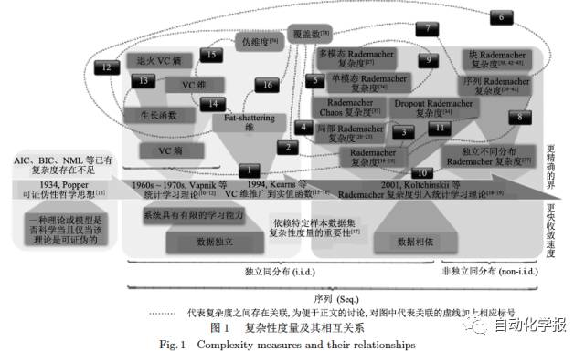
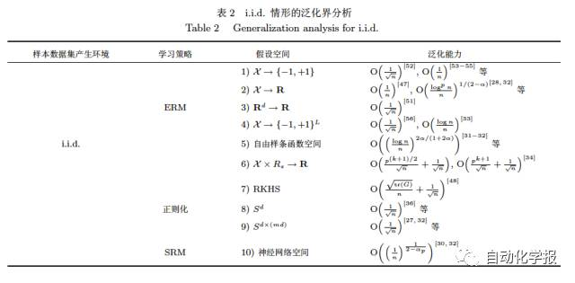
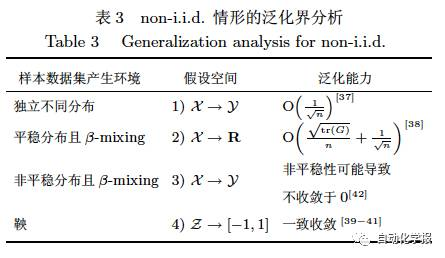

# Rademacher复杂度在统计学习理论中的研究

原创 自动化学报 2017-01-19 17:49 北京

> 原文地址: [https://mp.weixin.qq.com/s/6m4lwMdBfbW-1fcCt3cgcA](https://mp.weixin.qq.com/s/6m4lwMdBfbW-1fcCt3cgcA)

假设空间复杂性是统计学习理论中用于分析学习模型泛化能力的关键因素. 与数据无关的复杂度不同, Rademacher 复杂度是与数据分布相关的, 因而通常能得到比传统复杂度更紧致的泛化界表达. 近年来, Rademacher 复杂度在统计学习理论泛化能力分析的应用发展中起到了重要的作用. 

鉴于其重要性, 本文梳理了已有学者所提出的各种形式 Rademacher 复杂度：依赖于具体学习问题样本数据集(分布)的经典 Rademacher 复杂度; 注意到在统计学习理论中对学习模型泛化性能起决定性作用的, 不是全局的假设函数空间, 而是那些具有较小方差的函数所构成的假设空间的子空间, 从而给出的局部 Rademacher 复杂度；为考察多核学习对应假设空间的复杂性而引入的 Rademacher Chaos 复杂度; 为分析度量学习的泛化性能，而提出的单模态 Rademacher 复杂度; 为研究多模态度量学习的泛化性能, 而提出的多模态Rademacher 复杂度；为研究深度神经网络模型 Dropout 的泛化界而提出的 Dropout Rademacher 复杂度; 为研究样本数据集产生环境为平稳β-mixing情形的学习模型泛化能力, 而提出的块Rademacher 复杂度; 为了研究样本数据集产生环境为独立不同分布情形的学习模型泛化能力, 而提出的独立不同分布Rademacher 复杂度; 为研究样本数据集产生环境为鞅情形的学习模型泛化能力, 而提出的序列Rademacher 复杂度. 同时, 探讨了基于Rademacher 复杂度进行学习模型泛化能力分析的基本技巧。进一步地，还分析了Rademacher复杂度之间及其与传统复杂度 (如， VC 熵, 退火VC 熵, 生长函数, VC 维, 覆盖数, 伪维度, Fat-shattering 维等) 之间的关联性，相关的讨论分析总结为如下图1.

然后，考虑样本数据的独立同分布产生环境, 按照对假设空间的不同假定(如, 径向基神经网络，自由节点样条, 采用了 Dropout 技术的深度神经网络, 等等)，总结并分析了Rademacher 复杂度在泛化能力分析方面的研究现状. 总结为如下表2

接着，考虑到现实应用中存在的大量数据, 本质上具有相依性或时间相关性. 因此，又进一步按照对样本数据的非独立同分布产生环境, 以及假设空间的一些不同假定，总结并分析了Rademacher 复杂度在泛化能力分析方面的研究现状. 总结为如下表3.

最后，展望了当前Rademacher复杂度在非监督框架与非序列环境等方面研究的不足, 及其进一步应用与发展.

引用格式

吴新星, 张军平. Rademacher复杂度在统计学习理论中的研究. 自动化学报, 2017, 43(1): 20-39

作者简介

吴新星 复旦大学访问学者, 上海电子信息职业技术学院计算机应用系副教授. 主要研究方向为统计学习理论与形式化方法. 

E-mail: xinxingwu@yeah.net

张军平 复旦大学计算机科学技术学院教授. 主要研究方向为机器学习, 智能交通, 生物认证与图像处理. 本文通信作者. 

E-mail: jpzhang@fudan.edu.cn

欢迎扫描二维码、长按图片识别关注《自动化学报》中文版订阅号aas1963，服务号自动化学报和英文版服务号！

