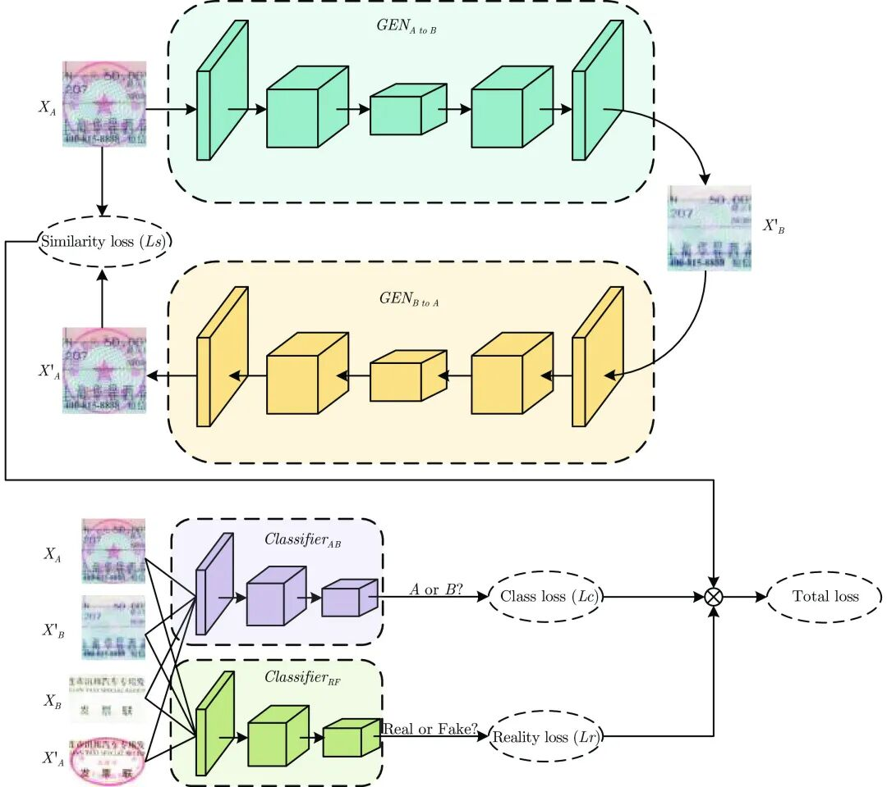
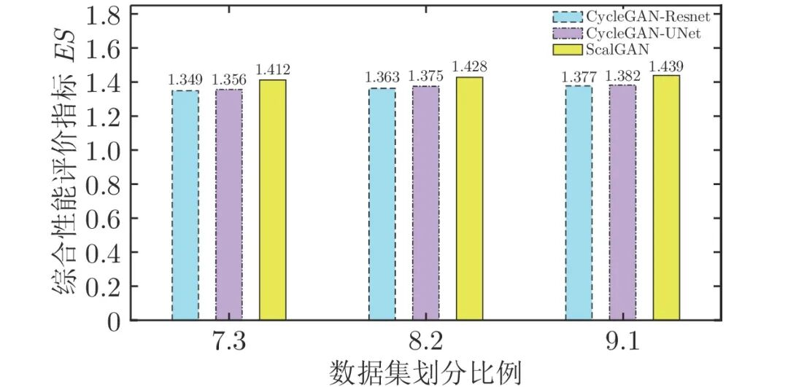
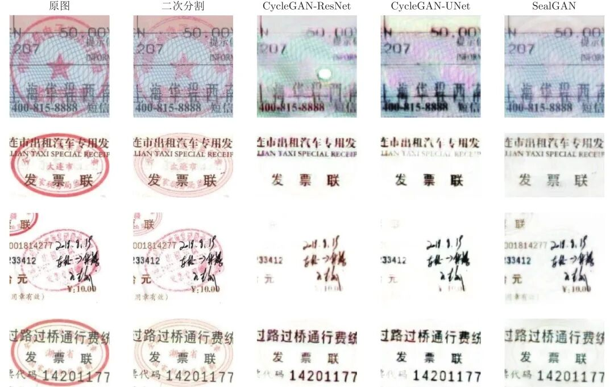
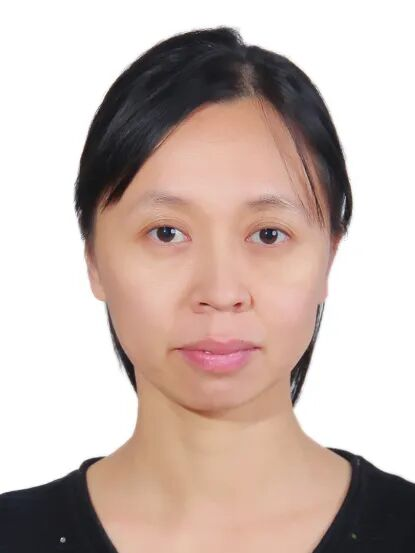
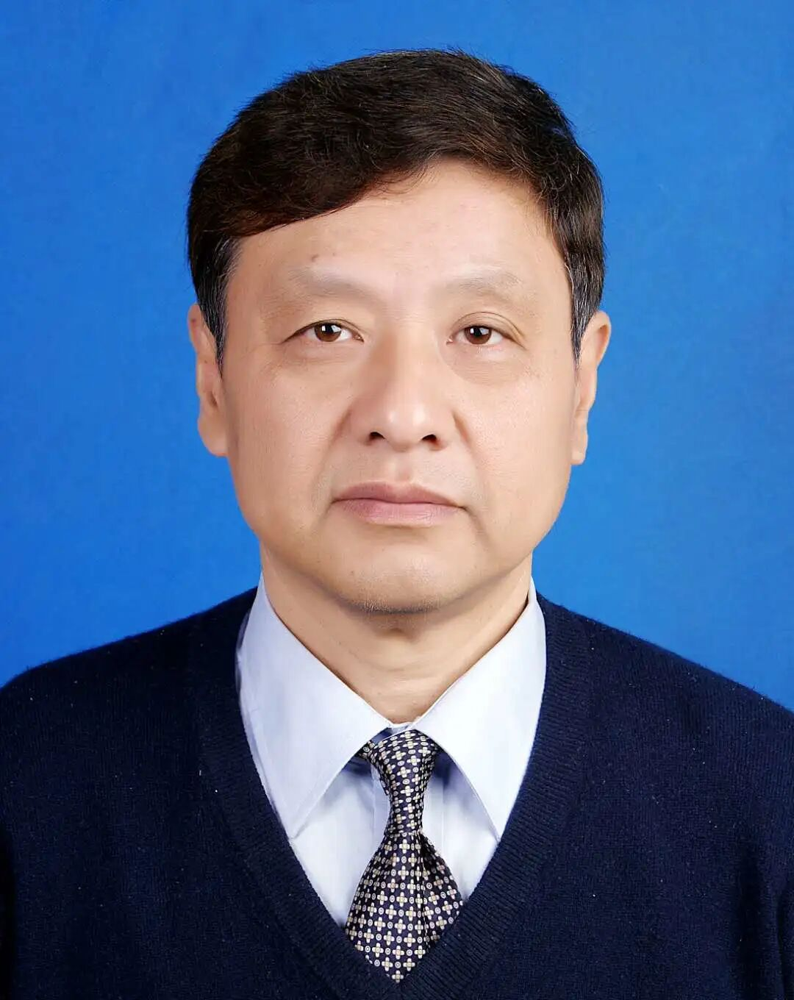

# SealGAN: 基于生成式对抗网络的印章消除研究

原创 自动化学报 自动化学报 2022-06-07 15:56 北京

> 原文地址: [https://mp.weixin.qq.com/s/rO-x5g5wiRSDbMltab\_ujg](https://mp.weixin.qq.com/s/rO-x5g5wiRSDbMltab_ujg)

  

**点击蓝字|关注我们**

  

**引用本文**

  

李新利, 邹昌铭, 杨国田, 刘禾. SealGAN: 基于生成式对抗网络的印章消除研究. 自动化学报, 2021, 47(11): 2614−2622 doi: 10.16383/j.aas.c190459

Li Xin-Li, Zou Chang-Ming, Yang Guo-Tian, Liu He. SealGAN: Research on the seal elimination based on generative adversarial network. Acta Automatica Sinica, 2021, 47(11): 2614−2622 doi: 10.16383/j.aas.c190459

http://www.aas.net.cn/cn/article/doi/10.16383/j.aas.c190459?viewType=HTML

  

**文章简介**

  

**关键词**

  

印章消除, 生成式对抗网络, SealGAN, CycleGAN, 评价指标

  

**摘   要**

  

发票是财务系统的重要组成部分. 随着计算机视觉和人工智能技术的发展, 出现了各种发票自动识别系统, 但是发票上的印章严重影响了识别准确率. 本文提出了一种用于自动消除发票印章的SealGAN网络. SealGAN网络是基于生成式对抗网络CycleGAN的改进, 采用两个独立的分类器来取代原本的判别网络, 从而降低单个分类器的分类要求, 提高分类器的学习性能, 并且结合ResNet和Unet两种结构构建下采样−精炼−上采样的生成网络, 生成更加清晰的发票图像. 同时提出了基于风格评价和内容评价的综合评价指标对SealGAN网络进行性能评价. 实验结果表明, 与CycleGAN-ResNet和CycleGAN-Unet网络相比较, Seal GAN网络不仅能实现自动消除印章, 而且还能更加清晰地保留印章下的发票内容, 网络性能评价指标较高.

  

**引   言**

  

发票是财务系统的重要组成部分, 发票的识别和处理是财务人员的首要工作. 人工智能已被广泛应用在人脸识别、车辆识别、物体检测等各个领域, 而基于人工智能的发票识别, 可为财务人员节省大量的时间. 目前发票自动识别根据使用场景不同, 可分为移动客户端、云端和本地客户端. 移动端客户端发票识别是通过手机端的离线SDK, 集成到公司财务系统的APP内, 自动检测发票的边线并拍照识别, 提取发票上的关键信息; 云端发票识别是通过调用云平台的API接口, 将拍照或者扫描的发票图像传送到云平台上进行识别; 而本地客户端识别是识别软件与扫描仪硬件配合使用进行识别. 三种方式本质都是基于识别软件进行的. 由于发票种类繁多, 格式不固定, 有的发票存在手写的内容, 且不同人手写字的风格不一, 因此基于传统数字图像处理的识别软件, 相应识别准确率较低. 随着卷积神经网络的兴起, 包括表格线定位、手写文字识别等问题得到很好的解决. 文献\[1\]采用卷积神经网络实现增值税发票批量识别, 通过对发票图像进行采集、预处理、字符切割, 基于CNN神经网络进行字符识别, 同时融入人工修改, 提高识别率. 但是发票上的印章对发票识别准确率依旧具有一定影响, 且印章是每张发票必不可少的, 因此如何消除印章也是现在OCR (Optical character recognition)领域的研究热点. 目前大多数研究者对于发票印章的研究主要是印章识别与验证. 针对发票印章的去除问题, 若通过印章定位, 而后直接挖除印章则会丢失印章下的发票内容; 若采用过滤颜色的方式来消除, 会导致发票中与印章颜色相近的文字变得模糊不清, 而且不同发票的印章颜色不同. 文献\[5\]提出一种基于彩色图像的二次分割算法来去除印章, 但是对于发票的要求较高, 需要保证印章的颜色为红色或者蓝色, 票据不能出现明显的扭曲和变形, 字体还需要求是黑色或灰色, 其实用性较差. 文献\[6\]针对印章覆盖、发票折痕等干扰因素影响发票号码分割的问题, 采用基于数字结构特征的识别算法, 通过对噪声粘连区域进行修复, 解决干扰因素对数字分割的影响, 实现发票号码识别. 但是如何判断噪声区域最小连通面积的阈值是算法关键, 当发票数量增多, 印章颜色深度和位置不统一时, 消除印章干扰则很困难.

  

各种图像处理软件也可用在印章消除上, 如PhotoShop, 但需要基于软件进行手动处理, 大量发票的印章消除则会新增大量工作量, 反倒得不偿失. 因此研究如何自动消除发票印章, 对提高发票识别准确率具有重要意义. 生成式对抗网络GAN (Generative adversarial network)是Goodfellow等在2014年提出的一种生成式网络. 在GAN提出之前, 常见的生成式网络有最大似然估计法、近似法、马尔科夫链法等. 这些方法的基本步骤是, 先对样本数据进行分布假设, 然后利用数据样本直接对假设分布的参数进行拟合, 这会导致学习到的生成式模型受到限制. 而GAN不同于上述的生成网络, 该方法采用对抗学习方式, 先通过判别器学习生成分布和真实分布之间的差异, 再驱使生成器去缩小差异. GAN相比于其他的生成网络, 对数据的分布不做显性的限制, 从而避免了人工设计网络分布. GAN目前常用于实现图像的风格迁移以及超分辨图像的生成. 本文基于生成对抗网络提出用于消除印章的SealGAN网络. SealGAN借鉴了CycleGAN网络的循环结构, 采用两个独立的分类器来取代判别网络, 并针对印章的特点去设计生成网络, 实现发票图像的带印章到不带印章的风格迁移, 从而达到消除发票印章的效果.

  

图 3  SealGAN网络结构

  

图 7  三种网络在不同数据集划分比例下的性能指标

  

图 8  基于二次分割、CycleGAN-ResNet、CycleGAN-UNet和SealGAN的印章消除对比  

  

请点击左下角“**阅读原文**”了解更多！

  

**作者简介**

**李新利**

华北电力大学控制与计算机工程学院副教授. 主要研究方向为模式识别与智能系统, 图像处理, 燃烧过程检测技术. 本文通信作者.

E-mail: lixinli@ncepu.edu.cn

**邹昌铭**

华北电力大学控制与计算机工程学院硕士研究生. 主要研究方向为深度学习, 图像处理.

E-mail: 1172227195@ncepu.edu.cn

**杨国田**

华北电力大学控制与计算机工程学院教授. 主要研究方向为智能机器人, 计算机视觉, 火力发电精细化燃烧与优化控制.

E-mail: ygt@ncepu.edu.cn

**刘   禾**

华北电力大学控制与计算机工程学院教授. 主要研究方向为图像处理, 计算机视觉, 模式识别.

E-mail: lh@ncepu.edu.cn

  

**相关文章**

**（请向上滑动阅读）**

  

\[1\]  陈善雄, 朱世宇, 熊海灵, 赵富佳, 王定旺, 刘云. 一种双判别器GAN的古彝文字符修复方法. 自动化学报, 2022, 48(3): 853-864. doi: 10.16383/j.aas.c190752

http://www.aas.net.cn/cn/article/doi/10.16383/j.aas.c190752?viewType=HTML

  

\[2\]  武文亮, 周兴社, 沈博, 赵月. 集群机器人系统特性评价研究综述. 自动化学报, 2022, 48(5): 1153-1172. doi: 10.16383/j.aas.c200964

http://www.aas.net.cn/cn/article/doi/10.16383/j.aas.c200964?viewType=HTML

  

\[3\]  何江红, 李军华, 周日贵. 参考点自适应调整下评价指标驱动的高维多目标进化算法. 自动化学报, 2022, 48(6): 1569-1589. doi: 10.16383/j.aas.c200975

http://www.aas.net.cn/cn/article/doi/10.16383/j.aas.c200975?viewType=HTML

  

\[4\]  杜鹏, 宋永红, 张鑫瑶. 基于自注意力模态融合网络的跨模态行人再识别方法研究. 自动化学报, 2022, 48(6): 1457-1468. doi: 10.16383/j.aas.c190340

http://www.aas.net.cn/cn/article/doi/10.16383/j.aas.c190340?viewType=HTML

  

\[5\]  张洋, 江铭虎. 作者识别研究综述. 自动化学报, 2021, 47(11): 2501-2520. doi: 10.16383/j.aas.c200654

http://www.aas.net.cn/cn/article/doi/10.16383/j.aas.c200654?viewType=HTML

  

\[6\]  李庆忠, 白文秀, 牛炯. 基于改进CycleGAN的水下图像颜色校正与增强. 自动化学报. doi: 10.16383/j.aas.c200510

http://www.aas.net.cn/cn/article/doi/10.16383/j.aas.c200510?viewType=HTML

  

\[7\]  孔锐, 蔡佳纯, 黄钢. 基于生成对抗网络的对抗攻击防御模型. 自动化学报. doi: 10.16383/j.aas.2020.c200033

http://www.aas.net.cn/cn/article/doi/10.16383/j.aas.2020.c200033?viewType=HTML

  

\[8\]  陈泓佑, 陈帆, 和红杰, 朱翌明. 基于样本特征解码约束的GANs. 自动化学报. doi: 10.16383/j.aas.c190496

http://www.aas.net.cn/cn/article/doi/10.16383/j.aas.c190496?viewType=HTML

  

\[9\]  孔锐, 黄钢. 基于条件约束的胶囊生成对抗网络. 自动化学报, 2020, 46(1): 94-107. doi: 10.16383/j.aas.c180590

http://www.aas.net.cn/cn/article/doi/10.16383/j.aas.c180590?viewType=HTML

  

\[10\]  赵树阳, 李建武. 基于生成对抗网络的低秩图像生成方法. 自动化学报, 2018, 44(5): 829-839. doi: 10.16383/j.aas.2018.c170473

http://www.aas.net.cn/cn/article/doi/10.16383/j.aas.2018.c170473?viewType=HTML

  

\[11\]  卢倩雯, 陶青川, 赵娅琳, 刘蔓霄. 基于生成对抗网络的漫画草稿图简化. 自动化学报, 2018, 44(5): 840-854. doi: 10.16383/j.aas.2018.c170486

http://www.aas.net.cn/cn/article/doi/10.16383/j.aas.2018.c170486?viewType=HTML

  

\[12\]  王坤峰, 左旺孟, 谭营, 秦涛, 李力, 王飞跃. 生成式对抗网络:从生成数据到创造智能. 自动化学报, 2018, 44(5): 769-774. doi: 10.16383/j.aas.2018.y000001

http://www.aas.net.cn/cn/article/doi/10.16383/j.aas.2018.y000001?viewType=HTML

  

\[13\]  张龙, 赵杰煜, 叶绪伦, 董伟. 协作式生成对抗网络. 自动化学报, 2018, 44(5): 804-810. doi: 10.16383/j.aas.2018.c170483

http://www.aas.net.cn/cn/article/doi/10.16383/j.aas.2018.c170483?viewType=HTML

  

\[14\]  孙秋野, 胡旌伟, 杨凌霄, 张化光. 基于GAN技术的自能源混合建模与参数辨识方法. 自动化学报, 2018, 44(5): 901-914. doi: 10.16383/j.aas.2018.c170487

http://www.aas.net.cn/cn/article/doi/10.16383/j.aas.2018.c170487?viewType=HTML

  

\[15\]  冯冲, 康丽琪, 石戈, 黄河燕. 融合对抗学习的因果关系抽取. 自动化学报, 2018, 44(5): 811-818. doi: 10.16383/j.aas.2018.c170481

http://www.aas.net.cn/cn/article/doi/10.16383/j.aas.2018.c170481?viewType=HTML

  

\[16\]  姚乃明, 郭清沛, 乔逢春, 陈辉, 王宏安. 基于生成式对抗网络的鲁棒人脸表情识别. 自动化学报, 2018, 44(5): 865-877. doi: 10.16383/j.aas.2018.c170477

http://www.aas.net.cn/cn/article/doi/10.16383/j.aas.2018.c170477?viewType=HTML

  

\[17\]  王功明, 乔俊飞, 王磊. 一种能量函数意义下的生成式对抗网络. 自动化学报, 2018, 44(5): 793-803. doi: 10.16383/j.aas.2018.c170600

http://www.aas.net.cn/cn/article/doi/10.16383/j.aas.2018.c170600?viewType=HTML

  

\[18\]  林懿伦, 戴星原, 李力, 王晓, 王飞跃. 人工智能研究的新前线：生成式对抗网络. 自动化学报, 2018, 44(5): 775-792. doi: 10.16383/j.aas.2018.y000002

http://www.aas.net.cn/cn/article/doi/10.16383/j.aas.2018.y000002?viewType=HTML

  

\[19\]  王坤峰, 苟超, 段艳杰, 林懿伦, 郑心湖, 王飞跃. 生成式对抗网络GAN的研究进展与展望. 自动化学报, 2017, 43(3): 321-332. doi: 10.16383/j.aas.2017.y000003

http://www.aas.net.cn/cn/article/doi/10.16383/j.aas.2017.y000003?viewType=HTML

  

\[20\]  马儒宁, 涂小坡, 丁军娣, 杨静宇. 视觉显著性凸显目标的评价. 自动化学报, 2012, 38(5): 870-876. doi: 10.3724/SP.J.1004.2012.00870

http://www.aas.net.cn/cn/article/doi/10.3724/SP.J.1004.2012.00870?viewType=HTML

  

  

**近期文章**

[基于轮胎状态刚度预测的极限工况路径跟踪控制研究](http://mp.weixin.qq.com/s?__biz=MzAwMzAzMDgxOA==&mid=2651078406&idx=1&sn=8b5e13ba1fbc860b2d6d92007d179345&chksm=8131f54bb6467c5d558d1ebbb4284a903eea029458b76e3e041773b42465284ab401d28e694e&scene=21#wechat_redirect)

[基于多参数灵敏度分析与遗传优化的铁水质量无模型自适应控制](http://mp.weixin.qq.com/s?__biz=MzAwMzAzMDgxOA==&mid=2651078406&idx=2&sn=919e0ff02f38f7bca086867466a39225&chksm=8131f54bb6467c5d789d8bf33edd281094acde67c5c035df91a8d655c03c3e9f096b3a1c6d2e&scene=21#wechat_redirect)

[串行生产线中机器维修工人的任务分配问题研究](http://mp.weixin.qq.com/s?__biz=MzAwMzAzMDgxOA==&mid=2651078261&idx=1&sn=af3614da8d72cbe2e4f01ddebad97732&chksm=8131f438b6467d2e30070c37bdd4ca82a6fa414a2b26588dc0d0bfec42efea2b2729becd1fc0&scene=21#wechat_redirect)  

[参考点自适应调整下评价指标驱动的高维多目标进化算法](http://mp.weixin.qq.com/s?__biz=MzAwMzAzMDgxOA==&mid=2651078261&idx=2&sn=725096e30b6fa219dcadacd45e6ded10&chksm=8131f438b6467d2e16f74d001605e31d4ec852905a2f39385130867dd12d5f031bc836b611cf&scene=21#wechat_redirect)

[基于改进YOLOv3算法的公路车道线检测方法](http://mp.weixin.qq.com/s?__biz=MzAwMzAzMDgxOA==&mid=2651078200&idx=1&sn=4044a26db179fbfb3781438fc7d9057d&chksm=8131f475b6467d63cf97cea2ea58db3bdc8f9d6958896d95b9a9b3a44828946362c7d6891418&scene=21#wechat_redirect)  

[直播预告‖自动化前沿热点讲堂之第十七讲](http://mp.weixin.qq.com/s?__biz=MzAwMzAzMDgxOA==&mid=2651078200&idx=2&sn=27f5d791ac740f87f0bcf7854c03f466&chksm=8131f475b6467d6366df12dbeb2d11b026a233143ed5d6fd80e3174be2ca86878ec8b56d302c&scene=21#wechat_redirect)

[一种基于改进AOD-Net的航拍图像去雾算法](http://mp.weixin.qq.com/s?__biz=MzAwMzAzMDgxOA==&mid=2651078165&idx=1&sn=092f00bc0dba34c5fd7c160e233ee480&chksm=8131f458b6467d4e9899392d597abb82989303551eae58bd4b9ef5580623abe046b273fbdbb3&scene=21#wechat_redirect)

[基于多级动态主元分析的电熔镁炉异常工况诊断](http://mp.weixin.qq.com/s?__biz=MzAwMzAzMDgxOA==&mid=2651078165&idx=2&sn=8d9a1a97361f5aea0655ef0bad114d5d&chksm=8131f458b6467d4e7b8185944175b5670bf21736d9ace23f32c73febef9b17de59f87795ad2d&scene=21#wechat_redirect)

[一种针对德州扑克AI的对手建模与策略集成框架【视频】](http://mp.weixin.qq.com/s?__biz=MzAwMzAzMDgxOA==&mid=2651078084&idx=1&sn=66f75170f77cdae1de9f7957ab6211be&chksm=8131f789b6467e9ff292811301f7aa59da264c1ebe9d3e805181b338cd4a41fe839759bf9d7b&scene=21#wechat_redirect)

[量子线性卷积及其在图像处理中的应用](http://mp.weixin.qq.com/s?__biz=MzAwMzAzMDgxOA==&mid=2651078077&idx=1&sn=0f8e5cc62e1a4648057f27b196fb3de5&chksm=8131f7f0b6467ee681a9542faea153769e16a0ff1a0f59b513f32a8f3ca3f360b045ca89615d&scene=21#wechat_redirect)

[基于非线性干扰观测器的飞机全电刹车系统滑模控制设计](http://mp.weixin.qq.com/s?__biz=MzAwMzAzMDgxOA==&mid=2651078038&idx=1&sn=e5b2617763076b22acf9042cd66265c6&chksm=8131f7dbb6467ecd0c2f64516f6ec7bf689fa3108d330d2f7c99144380c33c5a21dcf835f48c&scene=21#wechat_redirect)

[基于多源数据的电网一次调频能力平行计算研究](http://mp.weixin.qq.com/s?__biz=MzAwMzAzMDgxOA==&mid=2651078038&idx=2&sn=045ef6ad8cbe1556d93b98b8d89b3c5f&chksm=8131f7dbb6467ecd07a70dd79508b11ee9328f05b029eccc17bf47bf9ae9ac8be75d3f0988e3&scene=21#wechat_redirect)

[作者识别研究综述](http://mp.weixin.qq.com/s?__biz=MzAwMzAzMDgxOA==&mid=2651077968&idx=1&sn=707a66d03d8fac053431dd0efb42ba5f&chksm=8131f71db6467e0b021bdcd1807f03d5cb334157f63461fedcc1bddf23947af1ca995f1987f3&scene=21#wechat_redirect)

[基于FPSO的电力巡检机器人的广义二型模糊逻辑控制](http://mp.weixin.qq.com/s?__biz=MzAwMzAzMDgxOA==&mid=2651077968&idx=2&sn=8f03d20c1eb55d908b0d625b5aee029f&chksm=8131f71db6467e0b9c1a043856fd0cd82d69fd878c95c2afe8fb14cda9ec4d2e06fa1cc4dd6c&scene=21#wechat_redirect)

[污水处理过程出水水质稀疏鲁棒建模](http://mp.weixin.qq.com/s?__biz=MzAwMzAzMDgxOA==&mid=2651077888&idx=1&sn=00ac4a402538e7d00e1e7728d3b91449&chksm=8131f74db6467e5bdc3b24d484092e79541739d5093d0913e2f430a0410d3305c80baf1059f7&scene=21#wechat_redirect)

[一类p规范型非线性系统预设性能有限时间H∞跟踪控制](http://mp.weixin.qq.com/s?__biz=MzAwMzAzMDgxOA==&mid=2651077888&idx=2&sn=86079f3d558330183997baa3fb6e40d8&chksm=8131f74db6467e5b532977ab27c179528aeebfe2c5956ae2ab2d3a291af9661c8b87f9dc2a1e&scene=21#wechat_redirect)

[基于自注意力模态融合网络的跨模态行人再识别方法研究](http://mp.weixin.qq.com/s?__biz=MzAwMzAzMDgxOA==&mid=2651077831&idx=1&sn=6a76db27f4c8f0f1b96e5b8c6771abeb&chksm=8131f68ab6467f9cd2a0f82cc7756e0501991992475ef16d1eadb77b3fb27ff72ec26342d4ae&scene=21#wechat_redirect)

[基于多相关HMT模型的DT CWT域数字水印算法](http://mp.weixin.qq.com/s?__biz=MzAwMzAzMDgxOA==&mid=2651077831&idx=2&sn=2c167c0a7155779ce961509e8dbedc79&chksm=8131f68ab6467f9cedcba9c6fce9d8d2fd00a89ec6f06c26b258aec8e9d98086ebd5d4d4ab14&scene=21#wechat_redirect)

[基于多阶运动参量的四旋翼无人机识别方法](http://mp.weixin.qq.com/s?__biz=MzAwMzAzMDgxOA==&mid=2651077767&idx=1&sn=587115a6ffee6f33a5113a392bafd18e&chksm=8131f6cab6467fdc113dfc124638e9f0c73bfc2cc606025b4bc5c630bd6c5569b8948c3a2bad&scene=21#wechat_redirect)

  

**热点文章**

[基于改进YOLOv3算法的公路车道线检测方法](http://mp.weixin.qq.com/s?__biz=MzAwMzAzMDgxOA==&mid=2651078200&idx=1&sn=4044a26db179fbfb3781438fc7d9057d&chksm=8131f475b6467d63cf97cea2ea58db3bdc8f9d6958896d95b9a9b3a44828946362c7d6891418&scene=21#wechat_redirect)

[通信延时环境下异质网联车辆队列非线性纵向控制](http://mp.weixin.qq.com/s?__biz=MzAwMzAzMDgxOA==&mid=2651077767&idx=2&sn=d497bd4b45545cdc7584e9c9568ef4e0&chksm=8131f6cab6467fdc01f675bd4ea8b4823af1ff46862041b55d3b58ce8903265b6efd60bbc281&scene=21#wechat_redirect)

[图像异常检测研究现状综述](http://mp.weixin.qq.com/s?__biz=MzAwMzAzMDgxOA==&mid=2651077688&idx=1&sn=2535d4c0961f79a4e6e28fcec08d2fed&chksm=8131f675b6467f63e42dec407492be9cccdbf245e71dd2cd84b1d4af8072250b8b9f0f01329c&scene=21#wechat_redirect)

[迭代学习模型预测控制研究现状与挑战](http://mp.weixin.qq.com/s?__biz=MzAwMzAzMDgxOA==&mid=2651077623&idx=1&sn=1d8a9d2a39cab773fd8b49e8e73c55fd&chksm=8131f1bab64678ac33f4512961aa95fe90d40e9dbd6c4e13cad77295f4940b6aef050700caac&scene=21#wechat_redirect)

[2022年第05期](http://mp.weixin.qq.com/s?__biz=MzAwMzAzMDgxOA==&mid=2651077579&idx=1&sn=d2cf8dfd19e4104f5958b4ad6356239d&chksm=8131f186b6467890faae7fb5e1bdb23ca54b21a631ce9c32c47dc615ff926149628b9bf9b64b&scene=21#wechat_redirect)

[基于凸近似的避障原理及无人驾驶车辆路径规划模型预测算法](http://mp.weixin.qq.com/s?__biz=MzAwMzAzMDgxOA==&mid=2651077442&idx=1&sn=432dd266dbf5c99ca845248bb09df5c1&chksm=8131f10fb646781977984ae605369c8004b7c57f61747a28c49813698802554d4a11047abea0&scene=21#wechat_redirect)

[通信受限的多智能体系统二分实用一致性](http://mp.weixin.qq.com/s?__biz=MzAwMzAzMDgxOA==&mid=2651077321&idx=1&sn=02d81030a428cbb4275f4ff076068f08&chksm=8131f084b646799235c36b924d470f26f4e4da762c08d57e951613e4f74a57febdc8c03777c9&scene=21#wechat_redirect)

[【热点专题】多目标优化](http://mp.weixin.qq.com/s?__biz=MzI2NjA3MzM5MA==&mid=2649962438&idx=1&sn=83b21f7b6a63fc4e01c2f4718b2aae92&chksm=f2943387c5e3ba91ce32286c06f215a989233f55bbbd5c7d436a43c40615bb5ae208d0f0f228&scene=21#wechat_redirect)

[一种基于深度迁移学习的滚动轴承早期故障在线检测方法](http://mp.weixin.qq.com/s?__biz=MzAwMzAzMDgxOA==&mid=2651076931&idx=2&sn=128b1673843353529d8b130f372bb46f&chksm=8131f30eb6467a18e0f645b207ada16cd601b791297b32b1caccf72daa50b55063074ec4fdc3&scene=21#wechat_redirect)

[基于多智能体强化学习的乳腺癌致病基因预测](http://mp.weixin.qq.com/s?__biz=MzAwMzAzMDgxOA==&mid=2651076931&idx=1&sn=a62942cd056156ad5a885d6350e8b373&chksm=8131f30eb6467a18ffbee77b25fb9b0417b08918d3625d04c89a3a9bcb1490eece239c5fda25&scene=21#wechat_redirect)

[基于事件触发的离散MIMO系统自适应评判容错控制](http://mp.weixin.qq.com/s?__biz=MzAwMzAzMDgxOA==&mid=2651076863&idx=1&sn=aec9cf55a1b0b8eae741999601a8c6df&chksm=8131f2b2b6467ba4c20d388390d4ac191555e5d00d77f510f72af77359d18bdca5230ea52df0&scene=21#wechat_redirect)

[水下多机器人系统综述](http://mp.weixin.qq.com/s?__biz=MzAwMzAzMDgxOA==&mid=2651076668&idx=1&sn=b50e43710be8208fd711cd45943e95c0&chksm=8131f271b6467b675083610c925ce0d329e201ddab5c8e935eb266fbf41418395459fdd0618d&scene=21#wechat_redirect)

[基于事件触发二阶多智能体系统的固定时间比例一致性](http://mp.weixin.qq.com/s?__biz=MzAwMzAzMDgxOA==&mid=2651076637&idx=2&sn=fcf40a44a926c9034593207d6a614e95&chksm=8131f250b6467b46e70d4ef5f10226fbed60a0d12e327f83c793d86e7815ff00e4fcafcac295&scene=21#wechat_redirect)

[基于事件触发的分布式优化算法](http://mp.weixin.qq.com/s?__biz=MzAwMzAzMDgxOA==&mid=2651076142&idx=2&sn=b074793ec4be44ea08efb78617dcdcc0&chksm=8131fc63b6467575b7f6d698909e56be16089f8f56ca415294483ff6f40902c7546417f82531&scene=21#wechat_redirect)

  

**期刊动态**

[《自动化学报》多名作者入选爱思唯尔2021中国高被引学者](http://mp.weixin.qq.com/s?__biz=MzAwMzAzMDgxOA==&mid=2651076637&idx=1&sn=ee78f108cf0551024cb95c33241a5f1d&chksm=8131f250b6467b46c8d4af1bd63381328a80c65ade97a6daa97e3bb4538b39c6f761da238066&scene=21#wechat_redirect)

[自动化学报（英文版）和自动化学报入选计算领域高质量科技期刊T1类](http://mp.weixin.qq.com/s?__biz=MzAwMzAzMDgxOA==&mid=2651073859&idx=2&sn=7a9192717637dcf6cddb39ed961e8c3b&chksm=8131e70eb6466e188a123c504bdeba80c75681de4762f8685b3bf584bc33eb12362c70613b4e&scene=21#wechat_redirect)

[《自动化学报》编辑部防诈骗公告](http://mp.weixin.qq.com/s?__biz=MzAwMzAzMDgxOA==&mid=2651073517&idx=1&sn=c52de7c685e546af9faffc0cefab1c85&chksm=8131e1a0b64668b63ebaa68ea81cbaec3b94dc52ea8360821a0a49e67ae7e4b428a25d0f19c5&scene=21#wechat_redirect)

[《自动化学报》致谢审稿人](http://mp.weixin.qq.com/s?__biz=MzI2NjA3MzM5MA==&mid=2649961201&idx=1&sn=3142842d75c441ae860c1ecb313c7657&chksm=f29436b0c5e3bfa6c679210f60513eb1a7205dc20fe028f482bb593eac60427e4e56fba12493&scene=21#wechat_redirect)

[自动化学报多篇论文入选中国百篇最具影响国内论文和中国精品期刊顶尖论文](http://mp.weixin.qq.com/s?__biz=MzI2NjA3MzM5MA==&mid=2649961152&idx=1&sn=4a5e9e4b84879f4cde4e13a0ef97272c&chksm=f2943681c5e3bf97d7770c9623dac869b283b3ea83f3d320017974033e361d8b999134a8bdff&scene=21#wechat_redirect)

[自动化学报各项主要指标蝉联第1，再获百种中国杰出期刊称号](http://mp.weixin.qq.com/s?__biz=MzI2NjA3MzM5MA==&mid=2649960903&idx=1&sn=7da8b8a0167e16bcbaa1f00fbfb69782&chksm=f2943586c5e3bc9014f6d4fff7147b998ae42b4da452907e641e8029f296fd2413b4f17aef62&scene=21#wechat_redirect)

  

**期刊目录**

[2022年第05期](http://mp.weixin.qq.com/s?__biz=MzI2NjA3MzM5MA==&mid=2649962842&idx=1&sn=b91e3ab1206e29fdb9287ebbf7b07638&chksm=f2943d1bc5e3b40d9447d720203aca6ca2ae6662b85e3d9d5768c2da45df90cc31e49f895255&scene=21#wechat_redirect)

[2022年第04期](http://mp.weixin.qq.com/s?__biz=MzI2NjA3MzM5MA==&mid=2649962369&idx=1&sn=ae2c4584f8904be917b600e67005ae03&chksm=f29433c0c5e3bad6d78382b3c09015aadb09e040b8fc8c319c4f554fd592fe677797000340cd&scene=21#wechat_redirect)

[2022年第03期](http://mp.weixin.qq.com/s?__biz=MzAwMzAzMDgxOA==&mid=2651075527&idx=1&sn=bc020c5fd09080243f7527610b003507&chksm=8131f98ab646709c2f485852b526989a3b9af5cc93e8afb508d9239b78176f49caa9807d6a8d&scene=21#wechat_redirect)

[2022年第02期](http://mp.weixin.qq.com/s?__biz=MzI2NjA3MzM5MA==&mid=2649961838&idx=1&sn=29334896aa0f372b70312250c75b6b20&chksm=f294312fc5e3b8392ffd49100eaba435bf48fa9234c5019fe7b16ed1e4ebef70be58691f3fb3&scene=21#wechat_redirect)

[2022年第01期](http://mp.weixin.qq.com/s?__biz=MzI2NjA3MzM5MA==&mid=2649961423&idx=1&sn=3b65958faa7c7f94c247f46dd72bd71e&chksm=f294378ec5e3be9825f860d132c36c97f3e877089449cb1fe85a6d1e7da9bd0e24795336bc54&scene=21#wechat_redirect)

[《自动化学报》2021年全年合集](http://mp.weixin.qq.com/s?__biz=MzAwMzAzMDgxOA==&mid=2651072770&idx=1&sn=7c531f7fa3bc390558fab15b339ce86e&chksm=8131e34fb6466a59ed079448fddda0fc9f97066460bff8f6835288003a1fba2812de383813c1&scene=21#wechat_redirect)

[《自动化学报》2020年全年合集](http://mp.weixin.qq.com/s?__biz=MzI2NjA3MzM5MA==&mid=2649957972&idx=1&sn=1951847aacbcb7d22bdd2a46a79af871&chksm=f2942215c5e3ab03d070d8e52b8764b38036897c97b6a26c7a1f918c806b28edbe6c0fbf7ea9&scene=21#wechat_redirect)

[2020年第10期 工业人工智能专题](http://mp.weixin.qq.com/s?__biz=MzI2NjA3MzM5MA==&mid=2649957201&idx=1&sn=ab82a767bd716ab67fdf2942500d8b61&chksm=f2942710c5e3ae06b27f9e63a5e329a1123d90b051164e6b6123c500230541b1ed12d92abbfb&scene=21#wechat_redirect)

[2020年第09期 分布式信息能源系统理论与应用专题](http://mp.weixin.qq.com/s?__biz=MzI2NjA3MzM5MA==&mid=2649956412&idx=1&sn=8ebc13d63fd333ad85dbb8b5825df248&chksm=f294247dc5e3ad6ba297857a5b957e97cf499266c50318791fa8abd9432ecf1d9c3d9b287e36&scene=21#wechat_redirect)

  

  

**长按二维码｜关注我们**

**IEEE/CAA Journal of Automatica Sinica (JAS)**

**长按二维码｜关注我们**

**《自动化学报》服务号**

**长按二维码｜关注我们**

**《自动化学报》订阅号**  

  

**联系我们**

**网站:** 

http://www.aas.net.cn

http://www.ieee-jas.net

**投稿:** 

https://mc03.manuscriptcentral.com/aas-cn   

https://mc03.manuscriptcentral.com/ieee-jas 

**电话:**

010-82544653（日常咨询和稿件处理）           

010-82544677（录用后稿件处理）

**邮箱:** 

aas@ia.ac.cn（日常咨询和稿件处理）

aas\_editor@ia.ac.cn（录用后稿件处理）

**博客:** 

http://blog.sina.com.cn/aaseditor 

  

**点击****阅读原文** **了解更多**