# 【北大AI公开课13讲全链接+最强干货盘点】中国AI +，群星闪耀时

原创 自动化学报 2017-06-28 14:04 北京

> 原文地址: [https://mp.weixin.qq.com/s/RSrEqz9psbm5K7hYSY7Y9Q](https://mp.weixin.qq.com/s/RSrEqz9psbm5K7hYSY7Y9Q)

  
新智元

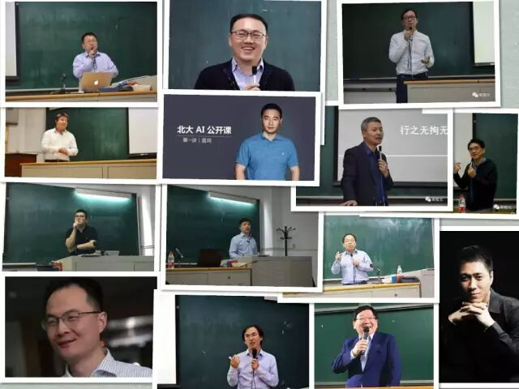

  

  

  

  **新智元推荐**  

  

  

整理：张易 胡祥杰

**【新智元导读】**本文盘点了刚刚结束的北大 AI 公开课的精彩干货，附全部的文字实录链接和视频链接，是全景式地了解中国 AI 产业发展现状和趋势极为珍贵的资料。

  

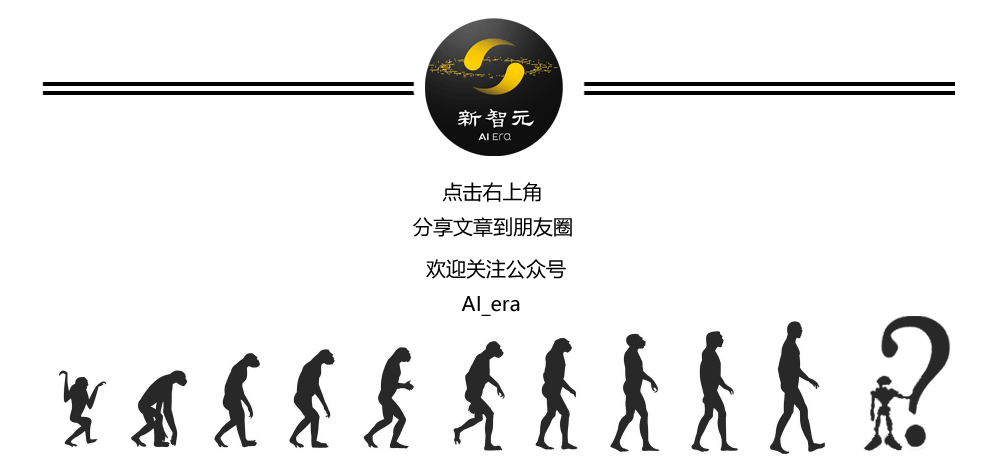

  

首先告诉大家，这篇文章盘点了刚刚结束的北大 AI 公开课的精彩干货，附全部的文字实录链接和视频链接，是全景式地了解中国 AI 产业发展现状和趋势极为珍贵的资料。

  

同时，本文摘录了来自10多个行业、13位顶级人工智能产业专家在公开课上讲解的重点内容，本身就值得收藏。

  

刚刚结束的北大 AI 公开课，由北大人工智能创新中心主任雷鸣组织，以把听者培养为“懂产业的 AI 人才”为主旨，邀请了13位顶级人工智能产业专家，分别从智能驾驶、智能医疗、智能金融、智能家居、硬件等10多个 AI+ 行业，向学生和从业者全面介绍了 AI 如何与产业结合，以及 AI 在各行业应用的现状、趋势、机遇与挑战。选课前关于此课的讨论贴就成为北大BBS校园热点第一条，课程满意度评价在10分制中达到了9.5，甚至有北大校友从天津坐高铁过来上课。课程产生巨大的社会影响力，课程视频、文章浏览量累计120万次。

  

这门课程，正是由新智元全程首发报道，将课堂精彩内容第一时间传递给万千读者的。如今公开课暂落帷幕，当我们回顾这 13 堂课，13 位嘉宾，AI 群星闪耀的一幕幕仍在脑海中流转。  

  

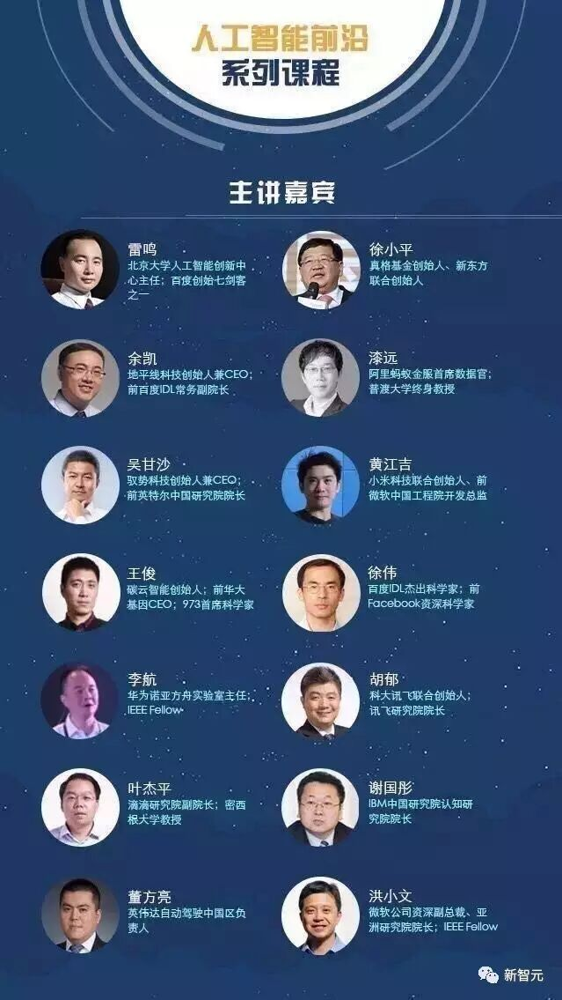

  

在每次长达 2 小时的课堂上，总是先由嘉宾进行 1 个小时干货满满的主题演讲；再进行嘉宾和雷鸣老师的对话环节。

  

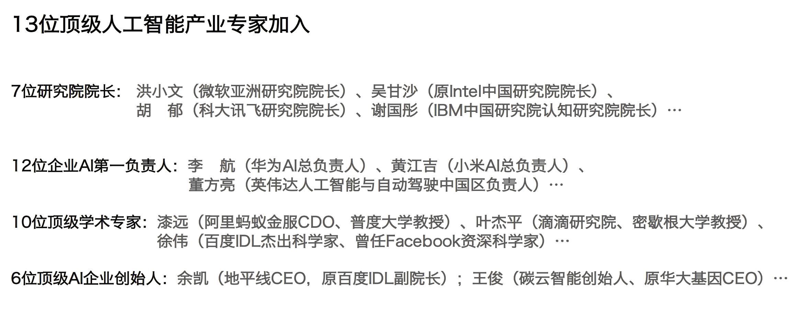

**无论是在课堂上——**  

  

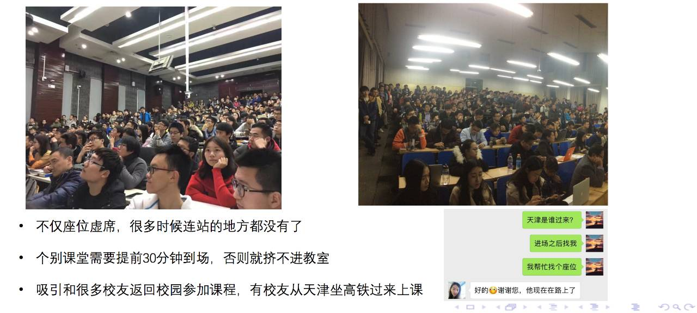

**还是线上——**

  

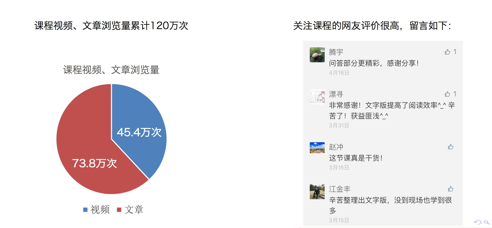

  

课程的受欢迎程度都非常高。

  

单是新智元整理的这门课程的文字稿，累计就超过了 20 万字。

  

好了，不说这些了。当我们的人工智能产业、学术专家们开始讲话，当璀璨的 AI 群星在新智元星空色的背景下发出光芒，发出声音，让我们静静聆听。

  

  

  

北大雷鸣：让学生成为“懂行业的 AI 人才”

  

  

  

文字实录链接：北大AI公开课第一讲：雷鸣评人工智能前沿与行业结合点

视频链接：http://www.iqiyi.com/l\_19rrf6l46v.html

  

**"如果我们进入到某种称为智能社会的社会，那么可能基于技能的重复性工作会被大量替代。创新有一定的失败率，但是投入其中的人越多，基数越大，社会发展就会越快。"**

**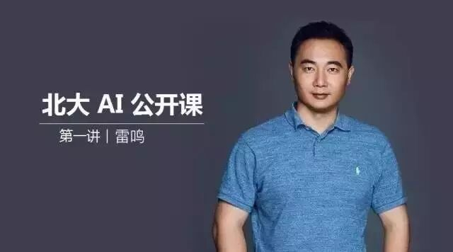**

  

**"农业社会，工作对象是自然，比如我弄个庄稼什么的，就是天天跟自然打交道；工业社会，工作对象是自然界里被你改造过的东西。而到了智能时代，这些东西我们都不用管它了，因为有机器人在那里替你做。我们所做的可能就是处理信息。我们设计公式就可以了，机器人把它执行出来，然后为我们所用。这会对社会造成非常深远的影响。"**

  

**"我们希望，学生能够成为懂行业的 AI 人才......上完这个课之后，大家可能对于每个行业都能有所了解，然后决定你喜欢哪个行业。因为我们毕业后不可能参与所有的行业，你早点知道自己喜欢哪个行业，你早点去了解将来的话，你就会更明确目标。创业也好，加入公司也好，都能做得更好。"**

  

雷鸣，北大人工智能创新中心主任，百度创始七剑客之一。作为课程的组织者，他为大家带来了备受瞩目的第一讲《人工智能前沿与产业趋势》。内容涵盖了人工智能的发展、意义、驱动力以及和行业的结合点。  

  

  

  

真格基金徐小平：技术、市场缺一不可，找到最合适的中国合伙人

  

  

  

文字实录链接：徐小平对话雷鸣——AI 创业仅有科学家是万万不行的

视频链接：http://www.iqiyi.com/l\_19rrf6l46v.html

  

**“（AI+ 现在涌现出的机会）相当于十几年前的互联网时代，几乎所有的行业都有崭新的需求。”**

**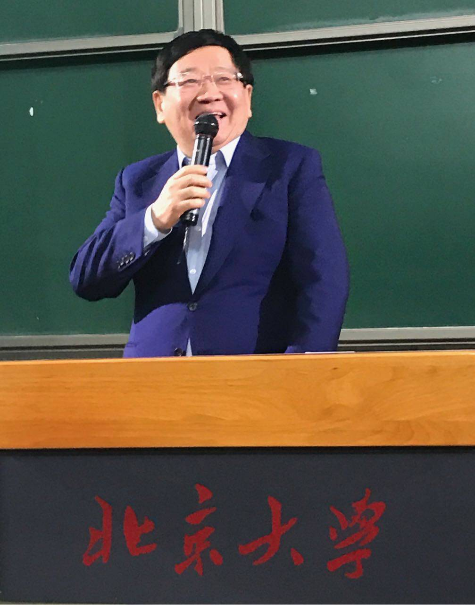**

  

**“对VC来说，最痛的痛点，就是拿着矫揉造作的痛点、伪需求去创业的......真正的需求不是想出来的。”**

  

**"我们投资最痛苦的经历，就是投了一个没有商业意识的科学家。投资创业是商业，如果你有一个idea一个技术，怎么卖掉，征服市场。我们投过很多世界级的科学家，但是他招人、开人、整人、管人、教育人的能力欠缺，最后伟大的梦想全部破灭。**

**完美的情况是，这个技术牛人同时具有商业能力。但是更多的情况是，做技术的可能只想做技术，你就要找一个商业专家、一个管理专家。我很看重一个创业团队，几个“中国合伙人”，一个管技术，一个管市场、一个管供应链。所以中国的技术人员和科学家整体跟美国的比起来，综合能力相对弱。**

**我不是针对搞技术的，我认为大家读书的时候都要培养深入社会的能力和爱的能力。要加入创业公司，去打杂、哪怕倒开水、做前台、当司机……锻炼自己的商业感觉和与人打交道的能力。"**

**创业公司要有这样一种文化，**既能够相互拍桌子，又能够相互妥协**，这样才能做起来。**没有公司不在战斗中成长，都是打打闹闹、哭哭啼啼的**，才能成长。**

  

徐小平，真格基金创始人、新东方联合创始人。他一上讲台，就表示能生活在这个 AI 时代，感觉很“燃”！他还调侃自己，虽然只有“人工”没有“智能”，但是依然投了很多成功的 AI 公司。这堂课正是他经验的分享。

  

  

  

地平线余凯：嵌入式人工智能是从边缘开始的革命

  

  

  

文字实录链接：北大 AI 公开课第2讲实录-雷鸣&余凯漫谈嵌入式AI（超级完整版）

视频链接：http://www.iqiyi.com/w\_19rtza2dh9.html

  

**“我认为从现在开始，我们会看到从边缘开始的一种革命，正如从2012开始深度学习所引起的革命，一般来说，革命都是从边缘开始的。2012年4月我在西安一次会议上作了一个关于深度学习的讲座，那时深度学习还是一个处于边缘的课题，而如今已发展为风暴的中心。当今人工智能的计算大多数都在 BAT 的数据中心，在云上面，但我们会发现，有一个巨大的机会远离数据中心，在互联网的边缘。”**

**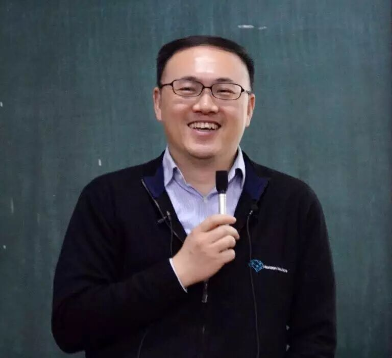**

  

**“未来的5到10年，最具颠覆性的产业机会是什么？我跟大家分享一下我的思考。通常来讲，产业机会分成两个阶段，通常的话，我们会看到，首先是一波2B的机会。2B的机会，就是 Enabling Technology，公司就是做 technology 本身的。它是提供枪炮弹药的，给谁提供呢？给第二波的机会提供。第二波的机会是什么呢？就是 Technology-enabled Business。当然这些都是2C的。2B就是给 Enterprise 提供服务。这些 Enterprise 再去捕捉 consumer-orient 的机会。这个 pattern确实在历史上反复发生。举一个例子，当年 PC 互联网刚出现的时候，时间是在90年代末，那时没有一家互联网公司是挣钱的，大家都看到了这里面存在机会，但在这个阶段，首先要做的工作是把架构、网络给做起来吧？  所以 CISCO 这样的公司会表现得更好。另外也会有一些2B的培训师等等，这个阶段整体上属于为B端造枪造炮提供弹药的阶段，这算是一种曲线救国吧。然后才有2C的大的互联网公司的出现，比如 Google。再比如移动互联网，首先要有 CDMA 这样的软件算法，放在芯片里面，使每个移动设备 stay connected。然后才是 Apple 这样的公司的崛起。中国的大部分投资者、创业者和企业家，他们看重的就是这样一波机会。”**

**“人工智能改变世界，真正改变人工智能，改变世界的是人才。人工智能目前最缺的就是人才。”**

**“我们对于增量性的创新没有兴趣，我们要做的是颠覆性的创新。”**

  

余凯，前 IDL 创始人、现地平线创始人兼CEO。本讲围绕的主题是嵌入式人工智能，涉及了嵌入式人工智能的本质特征、软硬件结合联合优化、应由场景及未来的发展机会等等。

  

  

  

蚂蚁金服漆远：人工智能驱动的金融生活

  

  

  

文字实录链接：北大 AI 公开课第3讲：蚂蚁金服漆远 人工智能驱动的金融生活服务（27 PPT）

视频链接：http://www.iqiyi.com/l\_19rrfk4wof.html

  

**“一个常识：做 AI 离不开场景。”**

**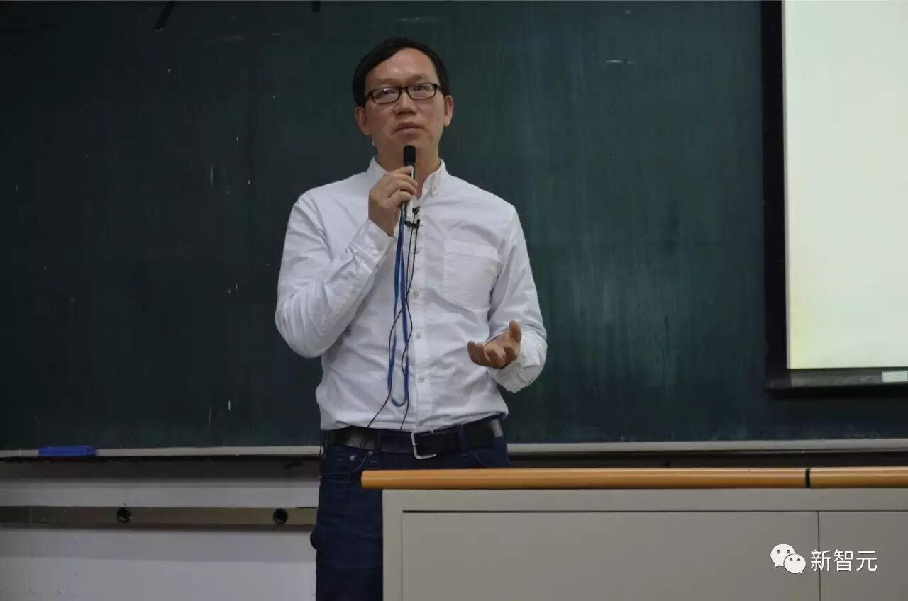**

  

**“今天给大家讲了很多例子。从开始讲移动互联网，讲mobile first。其实很多公司今天都正在，或者已经完成国内互联网领域的上半场。之后，大家开始真正竞争的是云计算的能力，比如阿里，比如蚂蚁金服云，比如Microsoft他发明的云计算能力，还有Amazon，背后其实就是数据。谁的场景数据本身有价值。而这背后的话呢？其实阿里的网有一个比喻，数据是土壤，土壤上要盖出楼，产生价值，那靠算法，靠人工智能。要真正能把价值能体现出来，而不是坐在金山上吃馒头。这个背后，我们就要通过人工智能，让用户包含的社会数据产生价值，并将有价值的服务带给用户。”**

**“（有一点）非常关键，技术、产品和运营真正的融合，如果这个中间有个重大的隔阂或切断，其实非常危险。对公司，对这个团队，都是非常危险的事情。这是经典的互联网公司的一个笑话了：产品经理都很恨工程师。工程师经常说，产品经理忍不住地笑工程师出事了；而工程师，比较痛恨产品经理。但是这其实双方应该有一个度，如果大家离开学校到工业、互联网公司会发现，真正的融合是非常关键的。最起码要on the same page，大家能够讨论这个问题，真正能想到未来的出路，要把技术的力量发展出来，把商业通过产品形式真正落地下来，这个也是非常关键的。”**  

漆远，蚂蚁金服 VP、首席科学家、普渡大学终身教授。他以人工智能驱动金融生活服务为切入点，描述了 AI 在特定领域的实现和应用，对AI技术落地的经验进行了总结和反思。

  

  

  

驭势科技吴甘沙：中国的Mobileye在哪里

  

  

  

文字实录链接：北大AI公开课 | 吴甘沙：智能驾驶，有多少AI可以重来（新智元专访：中国Mobileye何在）

视频链接：http://www.iqiyi.com/l\_19rrfdi1kv.html

  

**“PC时代过后是移动时代，这两个时代都已经接近尾声，而人工智能时代大幕将启，芯片厂商们谁也不想失去未来。”**

**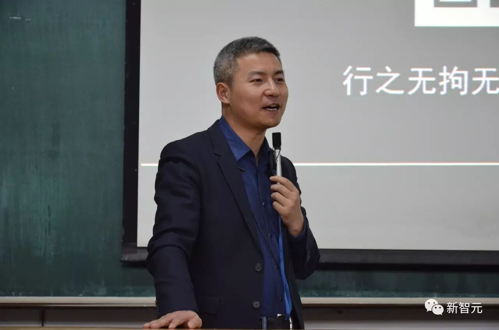**

  

**“芯片厂商，在自动驾驶领域有几种不同的商业模式：一种是卖芯片，第二种是卖系统，再往上就是算法。假如把系统卖给谷歌，谷歌在上面可以做自己的算法。把系统卖给车厂，而车厂做不了算法，芯片公司可以把带算法的系统卖给它。”**

**“（有一点）非常关键，技术、产品和运营真正的融合，如果这个中间有个重大的隔阂或切断，其实非常危险。对公司，对这个团队，都是非常危险的事情。这是经典的互联网公司的一个笑话了：产品经理都很恨工程师。工程师经常说，产品经理忍不住地笑工程师出事了；而工程师，比较痛恨产品经理。但是这其实双方应该有一个度，如果大家离开学校到工业、互联网公司会发现，真正的融合是非常关键的。最起码要on the same page，大家能够讨论这个问题，真正能想到未来的出路，要把技术的力量发展出来，把商业通过产品形式真正落地下来，这个也是非常关键的。”**  

**“汽车零部件会越来越少，零部件组合化越来越明显，供应商的兼并已成趋势，去年已经有多起，今年这是第一起，但绝对不会是最后一起。**

  

**汽车处理器从控制（Control）进入计算（Computing）时代，新三家（英特尔，英伟达，高通）崛起后面是汽车智能化和网联化的必然，老五家（德州仪器，瑞萨，意法，英飞凌，恩智浦（已被高通吃下））必须改变几年一代产品的节奏，同时也可以期待他们发起并购，在计算上补课。**

**Mobileye原来是软件硬件化的封闭体系，英特尔向来是可编程、做生态的开放体系（英伟达也是），下面会走向开放吗？还缺一套语言和开发工具。”**

**“过去十多年，智能驾驶已经发展出来了一套AI体系，而现在，我们觉得可以把其中的一些东西推翻重来。”**

吴甘沙，驭势科技联合创始人&CEO、原英特尔中国研究院院长、英特尔首席工程师。他在课上就智能驾驶的前景、社会意义、技术应用、重点难点等问题展开了宣讲。课程结束后，吴甘沙接受了新智元专访。

  

  

  

小米黄江吉：一定要把技术做到产品和服务里面

  

  

  

文字实录链接：北大 AI 公开课第5讲：小米黄江吉 产品化引领人工智能硬件发展（13 PPT）

视频链接：http://www.iqiyi.com/l\_19rrfgd203.html

  

**“两年前IoT很火爆。当浪潮退去，很多IoT公司跟我们说， IoT是不是被吹出来的，不过只是一个个泡沫。我肯定是第一个不同意的......我们的产品全部都是2C的，所以只要产品做得好，用户的活跃度是相当高的。”**

**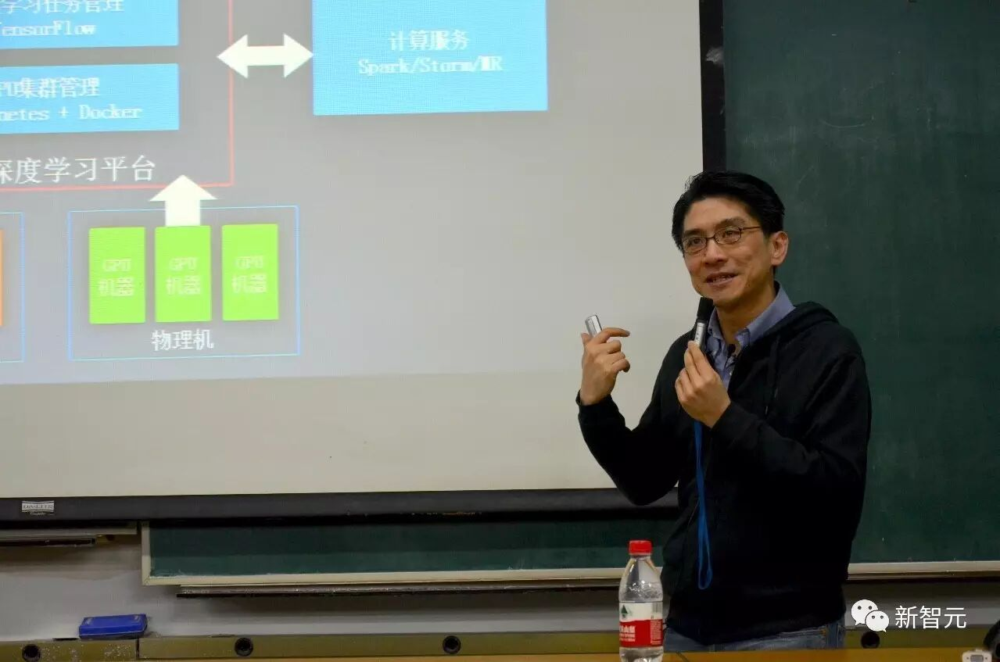**

  

**"之前我意识到，我们把人工智能落实到可以摸得着、用的好、买得到的设备，才可以说把人工智能带给用户。其实做人工智能技术的公司很多。今年越来越多的人工智能技术将落实到产品上。"**

**"我认为今后大家会看见真正懂你的灯，而且懂你一个人。因为每个人开灯、关灯的习惯千差万别。如果要找全世界最强的工程师把它做出来的话，十万个规则都做不好。而且这个代码量惊人。正确的做法是，通过灯的维度，知道你的特征，通过家里全部的智能硬件来掌握你的特征，比如家里wifi与你手机的状态，家里电视的状态，音箱的状态，客厅净化器的状态，房间的净化器的状态，可能要上百个特征。就根据过去一个月的使用历史进行分析，知道在这些特征成立下，你会开灯，你会关灯，这样才有可能做出一个真的是懂你的灯......当你家里的设备越来越多，他们的状态全部都可以被分析，被记录，我只要跟随一个礼拜，就可以理解你的习惯。我认为他会比任何一个工程师可以做的10万个规则都更符合你想要的。"**

**"一定要把技术做到产品里面，做到服务里面，它的价值才可以最大化地发挥出来。我在这里建议同学们，你们在做各种各样的探索研究，最重要的就是永远要想如何可以最大化得突破这些技术。如果可以把它用在用户真的需求里面，才有可能把人工智能或者其他研究做好，真正影响到我们的生活。我甚至认为，因为我们高度关注产品，贴近用户，用户往往会告诉你，我们下一步的方向是什么，他真正的需求是什么，然后我们再研究产品、工程方向，往往才能够取得更直接的突破。"**

黄江吉，小米科技联合创始人，圈内人亲切地称他为“KK”。课堂上，KK 老师反复强调了产品化对于AI技术特别是深度学习发展的意义，认为产品的数据搜集效用可以和云端的机器学习一道，形成一个良性循环，同时认为只要2C的产品做得好，用户活跃度会相当高。

  

  

  

碳云智能王俊：生命本身就是AI的学习程序

  

  

  

文字实录链接：北大AI公开课第六讲王俊：DNA是生命数字化的过程，AI改变生命科学

视频链接：http://www.iqiyi.com/w\_19rtwp8egp.html?list=19rrkd4ogy

  

**“生命本身是一个人工智能的学习程序。学习的核心是DNA。DNA程序蕴藏着所有的program和环境互动的结果，每一代都选择最优的程序往下迭代。所以，我们身体里的DNA可以追溯到生命的开始。DNA程序蕴藏过去的历史，也蕴藏着未来，因为未来环境还在变，这套程序已经是一个learning system。”**

****

  

**“举个例子，这是在计算机里，我给瓢虫写的程序。这个程序是硅基的。现实中，生命是以碳为基础，碳基DNA程序也在运行，稍后我们讲怎么打穿这两者的界限。如果程序在计算机里进行迭代，告诉它选择最好的，生命也是一样的，checkpoint是看它能不能够活下来，并且扩张，能不能够把基因传下去，把这套程序传下去，这是唯一的一个选择标准。所以，DNA本身就是生命数字化的过程。”**

  

**“上帝已经将这个学习程序编码好，就像计算机程序一样。我们身体有个程序，若想读懂它，碳基程序是迄今为止最高效的存储介质，全世界所有的信息可以存在一公斤的DNA里面。甚至可以储存百万年，但是计算机存储介质无法达到。”**

  

**“当你已经掌握了可以去改变基因和合成生命的能力的时候，你突然发现其实生命没有被真正理解过。你可以读出基因，但是你并不看得懂。”**

  

**“生命本身是一个旅程，基因只是起点，不是终点。在这个过程中，你是你自己的选择，所以你要根据你的数字化生命的模型做出最好的选择，希望每一个人都不做越来越坏的选择，能够理性地做越来越好的选择，让身体更健康。我认为能回答这个问题的核心点，什么是生命的核心点，在于learning system，如果我们能做出一个 digital human of allhumans , 那套系统就像我当初做的那个那个瓢虫的捕食行为一样，一个 learning system ，也许那时才能够真正理解生命本身。它不是一个简单的 equation ，它是一个learning system 。所以碳云智能基于了三个基本假设：生命是可以数字化的；生命是可以被计算的；生命也是可以被网络化的。”**

王俊，碳云智能创始人兼CEO、原华大基因CEO。对于人工智能和基因技术，王俊老师做了极为精彩的分享。

  

  

  

百度徐伟：AGI在我们有生之年实现的可能性比得老年痴呆和车祸要高

  

  

  

文字实录链接：【北大AI公开课】百度徐伟：AGI 2050年前实现可能性

视频链接：http://www.iqiyi.com/l\_19rrbkb3az.html

  

**“近些年，人工智能主要在特定领域内有很大的飞跃，包括语音识别、人脸识别。通用人工智能则有所不同，主要强调具备人一样的多重智能行为，包括感知、决策、推理与规划，以及交流和沟通。其中，我认为最重要的是学习能力。目前，很多人工智能的学习能力可能还不如两三岁的小孩。重要的学习能力主要包括：渐进学习、自主学习和交互式学习。渐进学习是指，在不断地学习新知识时，可以将老知识应用到新知识的学习中；自主学习是指，人从小所受的监督学习较少，更多的是与环境接触之后，不断自主学习；交互式学习是指，通过交流来学习。目前，这一些学习能力都是深度学习所欠缺的。”**

**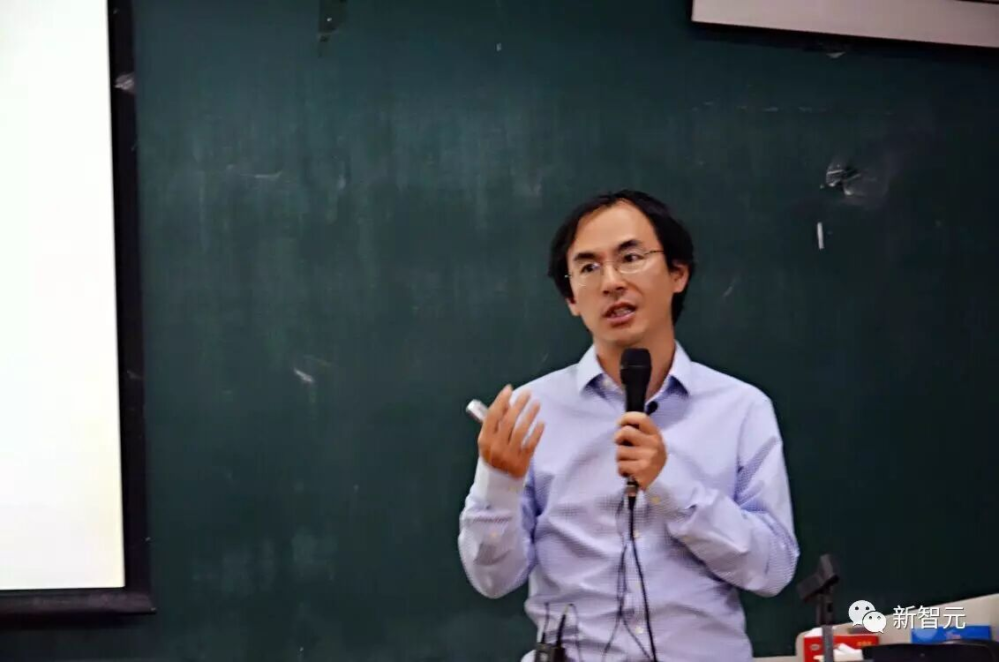**

  

**“机器的一大局限就是缺乏常识。如刚才提到的无人驾驶，机器往往缺乏常识。现在，机器在控制方面能够用做的很好，但缺乏对于常识的判断。比如，前面有人招手，若机器没有见过这个场景，不知道怎么做。”**

**“人为什么会有常识？首先，人在生活中经历颇多，比如物体识别，人从小根据常识知道物体不会凭空消失。但是，繁多的常识若想灌输给机器难度很大。因此，早期的 AI  ，图灵提出机器需要放在 physical world 里学习。那时，由于技术条件的限制，很难实现，目前这一问题仍然没有解决。但是，我们可以看到，如果把机器放在 physical world 里面学习，可能解决 common sense 的问题。退而求其次，就是把图像、语言等用 embody 的做法输入，可以更接近。基于此，我们开展图像和语言的联合学习，也希望机器能够真正在环境里学习。”**

**“我觉得到2050年，通用智能达到人类智能的可能性比我得老年痴呆的可能性大一些。”**

  

徐伟，百度 IDL 杰出科学家。他在本讲就通用人工智能的现状与展望进行了深入的讨论和交流，主要涵盖通用人工智能、自主学习、体验智能、语言获取等内容。

  

  

  

华为李航：NLP 有 5 个基本问题，深度学习有4个做得很好

  

  

  

文字实录链接：华为李航：NLP 有 5 个基本问题，深度学习有4个做得很好 （PPT）| 北大AI公开课

视频链接：http://www.iqiyi.com/l\_19rrcceoer.html

  

**“为什么自然语言理解很难？其本质原因是语言是一种复杂的现象。自然语言有5个重要特点，使得计算机实现自然语言处理很困难：（1）语言是不完全有规律的，规律是错综复杂的。有一定的规律，也有很多例外。因为语言是经过上万年的时间发明的，这一过程类似于建立维基百科。因此，一定会出现功能冗余、逻辑不一致等现象。但是语言依旧有一定的规律，若不遵循一定的规范，交流会比较困难；（2）语言是可以组合的。语言的重要特点是能够将词语组合起来形成句子，能够组成复杂的语言表达；（3）语言是一个开放的集合。我们可以任意地发明创造一些新的表达。比如，微信中“潜水”的表达就是一种比喻。一旦形成之后，大家都会使用，形成固定说法。语言本质的发明创造就是通过比喻扩展出来的；（4）语言需要联系到实践知识；（5）语言的使用要基于环境。在人与人之间的互动中被使用。如果在外语的语言环境里去学习外语，人们就会学习得非常快，理解得非常深。”**

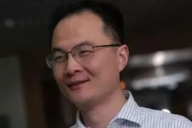

  

**“如果想让计算机像人一样使用语言，原理上需要完全不同的、与人脑更接近的计算机体系架构。”**

  

**“自然语言处理做的第一件事情就是把问题简化。”**

  

**“自然语言处理领域发展的60多年中，总结出一个经验，就是目前最好的方法是机器学习，包括深度学习。也就是，基于机器学习，并在一定程度上把人的知识加进来，并参考人脑的机理，从而构建更好的机器学习办法。在短期内，自然语言处理很难突破这个框架。我们希望未来能够有更大的突破，人工智能能够完全超出目前基于机器学习的方法去做自然语言处理甚至自然语言理解。但是，目前的其他的路径都非常困难。”**

  

**“现在，无论是自然语言处理，还是人工智能的其他领域，都形成了一个闭环机制。比如，开始有一个系统，然后有用户产生大量的数据，之后基于数据，开发好的算法，提高系统的性能。如果能够闭环跑起来，就可以去收集更多的数据，可以开发出更好的机器学习算法，使得人工智能系统的性能能够不断提升。这个人工智能闭环是现代人工智能技术范式里最本质的一个现象，对于自然语言处理也不是例外。我们可以通过闭环，不断去开发新的算法，提高自然语言处理系统的性能。”**

  

**“自然语言处理，在一定程度上需要考虑技术上界和性能下界的关系。现在的自然语言处理，最本质是用数据驱动的方法去模拟人，通过人工智能闭环去逼近人的语言使用能力。”**

  

**“自然语言理解很难，自然语言处理现在用数据驱动的办法去做，有五个最基本的问题，即分类、匹配、翻译、结构预测和马尔可夫决策过程。在具体的问题上，有了数据就可以跑AI的闭环，就可以不断提高系统的性能、算法的能力。深度学习在我刚说的五个大任务里的前四个都能做得很好，特别是运用seq toseq的翻译和语音识别。单论对话也能做的越来越好，但是多轮对话需要去研究和解决。”**

李航，华为诺亚方舟实验室主任。他综述性地为大家介绍了 NLP 的任务、特点、最新技术以及发展趋势。李航老师精辟地总结道：“给今天的讲座大概做一个总结，自然语言理解很难，自然语言处理现在用数据驱动的办法去做，有五个最基本的问题，即分类、匹配、翻译、结构预测和马尔可夫决策过程。在具体的问题上，有了数据就可以跑 AI 的闭环，就可以不断提高系统的性能、算法的能力。深度学习在我刚说的五个大任务里的前四个都能做得很好，特别是运用 seq to seq 的翻译和语音识别。单论对话也能做的越来越好，但是多轮对话需要去研究和解决。”

  

  

  

科大讯飞胡郁：谁将弄潮人工智能时代？

  

  

  

文字实录链接：科大讯飞胡郁：涟漪效应补足智能动力学，脑机融合感觉就像连体婴儿（北大AI课No.10）

视频链接：http://www.iqiyi.com/l\_19rrct99br.html

  

**“1956年，美国达特茅斯会议提出“人工智能”的概念，自然宇宙中产生人类智能，数字宇宙中产生人工智能。这一会议有两个重要的遗产：提出AI这一名词，以及参加人工智能的那群人。后来，这一群人中，产生4个图灵奖得主，1个诺贝尔奖得主。这一群人在2016年之前，基本都已经去世。有意思的是，在60年后，也就是2016年，人工智能在产业上得到了真正的发展。”**

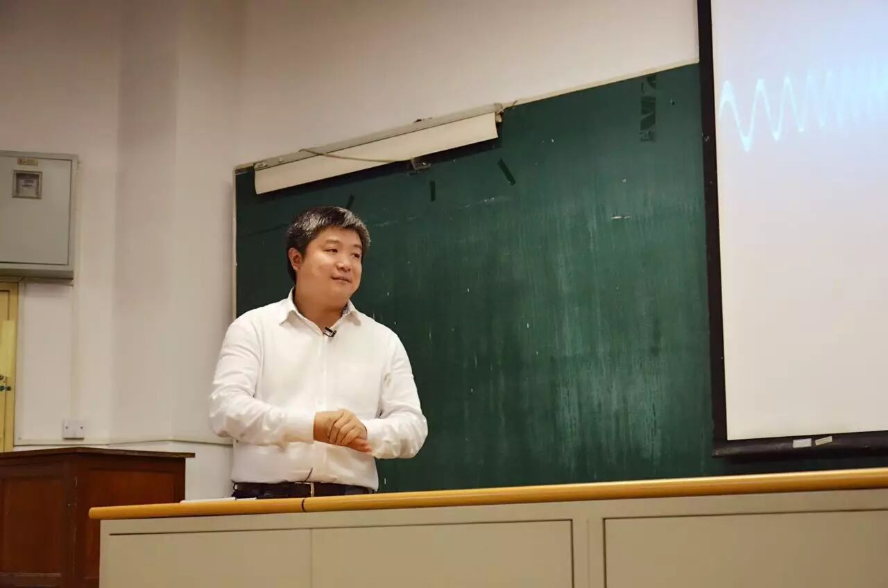

  

**“60年来，人工智能虽然输出很多理论，但是实际进展并不大。因为，我们并不清楚人脑是怎么运作的。计算机领域做应用的人认为的人工智能是希望用计算机的方法模拟人的智能的某一方面，比如下围棋。但是，完成这个系统并不能做决策，驾驶汽车等。目前，弱人工智能被普遍用到工业界中。因此，你会看到不同形态的机器人可以完成人的一项任务，或者一项任务中的一个步骤。2015年，当时华为2012诺亚方舟实验室主任，现任港科大计算机系系主任杨强老师说，计算机的真正可以思维的强人工智能是想实现从0到1的突破。而我们现在工业界（计算机应用界）做的人工智能只是让计算机的行为表现得像人工智能一样，即内部的工作原理是否与人一样，大家并不关心，他称为从1到n。”**

**“我在过去两年也提到，将来我们可能做出智能与人类一样，但是没有自我意识的智能体。在自然宇宙中，智能与自我意识是共存的，且两者之间强相关。比如，动物的智能越强，自我意识就越强。在数字宇宙中，智能体可能很聪明，但不一定有自我意识。如果将来能够把两者分开，一个没有意识的智能体还能灭绝人类吗？我们还不如担忧另一个问题，机器人是否会取代人类的工作，这是一个值得严肃考虑的问题。”**

**“如果我们能够研究智能动力学（intelligence dynamics），我们可以将智能和意识分开。因为两者产生的机理可能不同。若搞清楚，我们可以将智能的东西单独剥离出来，做出超脑，不受到自然宇宙中神经连接的物理限制。关键是是否能够将智能动力学搞清楚。”  
**

  

**“另一个很重要的是“涟漪效应”，这是互联网思维在核心技术研究中的应用。为什么现在的实验室，不能提出最好的算法，主要是没有大数据和涟漪效应。在移动互联网下，因为软件免费，用户愿意花时间用这些产品，且不会产生抱怨或反抗。当推出一个不好的人工智能算法（包括图像、语音、自然语言理解）时，就像水滴滴在水面，只有一小部分人才会用到。一旦使用，数据会送到云计算服务器，云计算服务器可以立即学习更新。当水波扩大到更广泛的人群时，系统的性能已经提高。水波的振幅就是系统的误差。当水波扩散，振幅越来越低。当水波纹扩散到第1000万人时，10000001个人是第一次使用这一系统，他会觉得系统很好。利用涟漪效应，可以把不熟的、需要在真实环境中训练出来的系统，真正培养出来。在实验室中，可以做人工智能的算法。”**  

胡郁，科大讯飞联合创始人、执行总裁、消费者事业群总裁。他对人工智能技术及产业最新进展进行了深入的辨析，内容涵盖人工智能是什么、由哪些核心部分组成、核心技术将如何发展、在人类发展历程中人工智能将扮演什么样的角色等等问题。

  

  

  

滴滴出行叶杰平：深度学习在交通领域应用潜力巨大

  

  

  

文字实录链接：滴滴研究院副院长叶杰平：深度学习在交通领域应用潜力巨大【北大AI公开课第9讲】

视频链接：http://www.iqiyi.com/l\_19rrc5qodr.html

  

**“滴滴是12年成立的，先是有出租车，后来到14年有专车，然后15年之后有了快车顺风车公交等等。现在每天订单超过2000万单。所以你要是做人工智能做机器学习，那这个样本量就一天是2000万，这是特别大的数据。现在这个平台上有4亿用户。”**

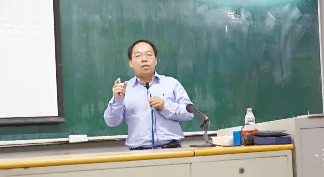

  

**“举几个例子，介绍一下滴滴过去一年半左右在大数据、人工智能方面的探索。这里列了一些核心的项目，第一个是ETA，就是预估出从A到B大概需要多少时间，这其实是滴滴的一个非常核心的功能。因为预估时间是非常重要的，比如你想6:40从家里来这个教室，你得大概预估一下多久能打到车，然后司机过来接你大概需要几分钟，然后你从你家到这里大概需要几分钟，如果能有个预估的话，你就能更精准地做决策。预估时间应该根据历史和实时的一些特征来预测，这是一个机器学习问题。”**

  

**“大家都知道深度学习在很多领域已经有非常成功的应用了，比如说在图像、文本、speech等方向。在交通方面其实还很少，所以大家如果对在深度学习探索新的应用感兴趣的话，我觉得交通是比较有潜力的，因为现在工作还非常少。但是深度学习在交通的数据还是非常有前景的。”**

叶杰平，滴滴出行副总裁、滴滴出行研究院院长。叶老师和大家分享的内容主要包括大数据和人工智能在滴滴出行场景中的应用，智能派单、最优匹配、供需预测等背后的核心技术，以及人工智能如何推动交通行业升级和未来的发展趋势与展望。

  

  

  

微软洪小文：AI+HI是终极智能形态

  

  

  

文字实录链接：微软副总裁洪小文：AI+HI是终极智能形态 | 北大AI公开课第11讲

视频链接：http://v.qq.com/live/p/topic/29553/review.html

洪小文博士近两个小时的演讲+问答是从一本书开始说起的—《Thinking，Fast and Slow》。这本书的作者是一个诺贝尔经济奖的得主，他把人类思考的行为分成两大块，一个是我们不假思索，一个是需要好好想一下的。根据这一理论进一步细分，洪老师提出有关AI 能力的三个问题：

1.   感知：这是猫还是狗？——这是个不假思索的问题（Think Fast）

2.   认知：这是喜剧还是悲剧？——这个要好好想一想（Think a little bit Slow）

3.   决策：微软是否要买下LinkedIn？——重大的决定（Think Slow）

  

**“最近很多人说，微软的硬件做的比苹果的还好。微软的混合现实设备HoloLens马上要在中国上市了。”**

  

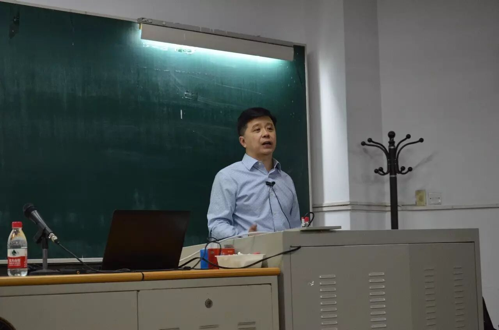

  

关于奇点会不会到？AI是不是可以持续让世界越来越好？洪小文认为**就算有一天做到了强AI，解决了一个难题，这个世界还有很多未解的难题，雷曼猜想、P等不等于NP，甚至宇宙从哪里来，有没有大爆炸，将来宇宙会不会再缩小，总有一个问题可能永远无解。他认为 AI=AugmentedIntelligence，Human+Machine=Superman。人和机器的共生才是终极形态。**

**“人类应当习惯，就像计算能力和记忆力，我们觉得机器比我们强是很正常的。我们其实早就朝着人类智能和人工智能共同进化的路狂奔了。”**

AI+HI 是否会造成人类的分化？无法和 AI 结合的人是否会沉入底层？洪小文认为，**分化一直都有。前几年有数字分化，将来有AI分化，其实本质就是贫富差距。**我们希望人人平等。政府有责任把税收、社会福利系统做好。而微软这种大企业可以在计算资源平等上出力，微软特别拿出10-20亿价值的云资源专门给付不起钱的地区使用。

  

洪小文，微软全球资深副总裁、亚太研发集团主席、微软亚洲研究院院长。他亲临北大 AI 公开课，就 AI 的感知与认知能力、AI (人工智能)与 HI (人类智能)的共进化等问题展开了深入讲解。洪老师指出，黑盒无法承担重大决策，AI+HI是终极智能形态，而且人类已经在朝着 AI+HI 共进化狂奔。

  

  

  

IBM谢国彤：认知医疗，个性化、循症的智慧医疗

  

  

  

文字实录链接：打破深度学习检测视网膜病变世界纪录，IBM认知医疗总监谢国彤北大AI课精彩分享

视频链接：http://www.iqiyi.com/l\_19rrcj6w6v.html

**IBM做****医疗，核心只想解决一个问题——怎么样利用数据挖掘和人工智能的技术，从海量的医疗数据中间去挖掘出证据，利用这些证据给患者提供循症的个性化医疗服务。**

  

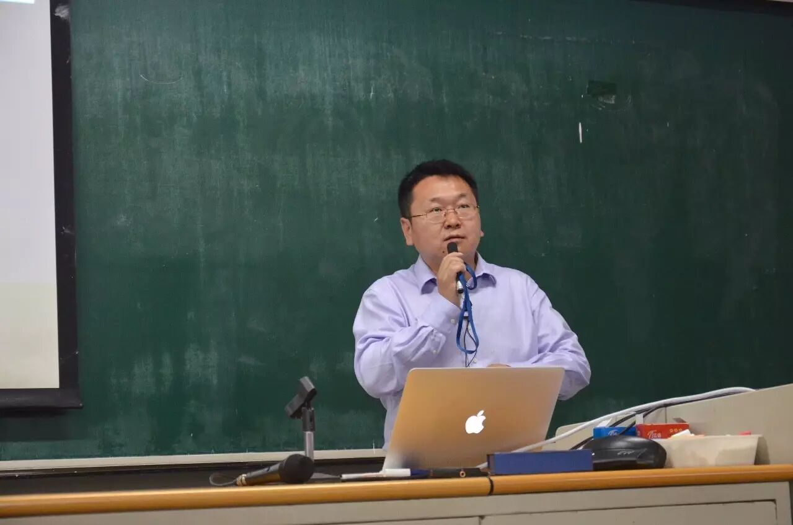

  

**“类脑计算芯片的核心想法就完全突破了以前冯诺依曼通过加法器这样的一套计算框架，而是从神经元的角度做一个芯片。”**

  

**“目前，一个芯片上有上百万个神经元与神经元之间的连接，synapses（神经突触）可以达到两亿五千多万个。这样一个非常复杂的芯片功耗非常低，只有70毫瓦。大概一个智能手机的功耗在五瓦左右，它的能耗是你手机的1%，是笔记本电脑的千分之一。”**

  

“**目前，没有一种单一数据模型能够覆盖多模态的医疗数据，如何有好的云平台去处理多模态医疗数据，这是需要解决的第一个问题。**”  

  

“真实世界证据就是真实世界中数据，包括病历数据、医疗保险数据、疾病数据，输入进来，产出各种模型，比如中风病人的再中风预测模型，或心梗病人的死亡风险预测模型，或某种药物治疗有效性的模型。”  

  

**“我们用传统的医学模型认为是高危的病人，不同中风的发病率，看完这个图之后医生特别激动，发现了第一点，有一群人过度治疗了，这群人传统医学方法认为是高危的，其实并不是高危的，只不过以前的模型无法捕捉到细微的区别。”**  

谢国彤， IBM 中国研究院认知医疗研究总监、IBM 全球研究院医疗信息战略联合领导人，他就 AI 技术在医疗领域的应用展开了深入讲解。内容涵盖：

  

1\. 医疗大数据及Watson健康概述

2\. 医疗文本挖掘和肿瘤辅助治疗案例

3\. 医疗影像分析和皮肤癌辅助诊断案例

4\. 结构化医疗数据分析和真实世界证据案例

5\. 认知决策技术和慢性病诊疗案例

6\. 自然语言问答技术和疾病管理案例

  

  

  

英伟达董方亮：硬件起家的英伟达会不会越来越“软”？

  

  

  

文字实录链接：【北大AI课压轴】GPU是线下训练唯一选择，英伟达胜在生态系统|英伟达董方亮

视频链接：http://www.iqiyi.com/l\_19rrdfaczv.html

**“因为GPU 的发展有一个很重要的技术叫 Pixel Shader（像素着色器），像素着色器是决定了今天能够做gaming、video  等很多呈现在大家面前功能的技术之一。核心的发明人是北大本科 87 级或 88级物理系的一位同学，所以北大人应该非常骄傲。北大对 GPU 的技术发展起到了很关键的作用。”**

  

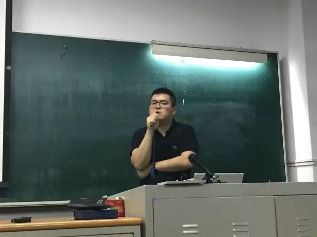

  

**“在各类 framework 不断演进的今天，GPU 与 deep learning紧紧地被绑在了一起。”**

**“**deep learning 还在不断发展，因此需要全新的架构支持，并且需要沿着比摩尔定律更高的计算量趋势发展，才能匹配全新的计算模式，才能在 AI 时代体现良好的计算能力。**”  
**

**“**GPU 时代兴起的原因在于，GPU 提供了与之前 general purpose computing 不同的模式。**”**

**“**AI的机会很多，在单一技术和组合式产品中，都有良好的市场。**”**

  

“它需要这种比较能满足细分市场需求的处理器或者一种解决方案，那么从 GPU 的角度来讲，比如说针对自动驾驶，其实我们自动驾驶不是单独用GPU，我们是用到 SOC 的方案，也就是说我们自己有自己的 CPU 加我们的 GPU，只是说我们会很大程度上依赖于 Deep learing 的这种计算能力。所以来讲，比如说在自动驾驶的这种领域，我们会有自己SOC 的方案，我们 SOC 是我们自己的 CPU 加我们自己的 GPU ，这是一个硬件方案，同时在软件方面也有准备，比如说**我们第一个是底层的 CUDA，第二个是 CUDA 之上加速的库，还有网络的优化，还有上层的应用，从硬件到软件整个构建了自动驾驶的生态系统，这是我们看来自动驾驶比较好的解决方案。”**

  

董方亮，英伟达自动驾驶业务中国区负责人。他就 GPU 的演进历程、 GPU 和深度学习的关系、AI 技术在各产业的应用等问题，进行了深入的讲解。

  

从无人驾驶到智能医疗，从嵌入式系统到通用 AI，通过为期 13 讲的北大 AI 公开课，新智元和读者一起全景式地领略了 AI 对社会生活各方面带来的影响和改变。

  

来自：新智元  

JAS《自动化学报》（英文版）

  

  

自动化学报订阅号

自动化学报服务号