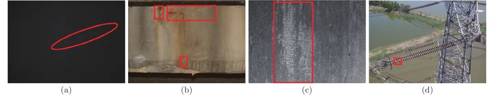
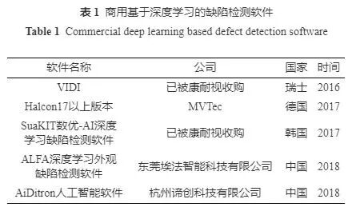
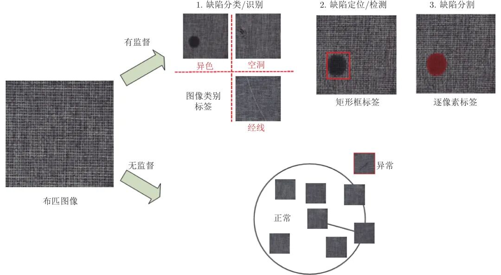
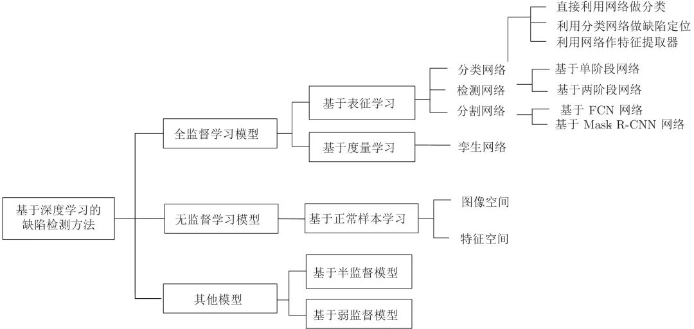
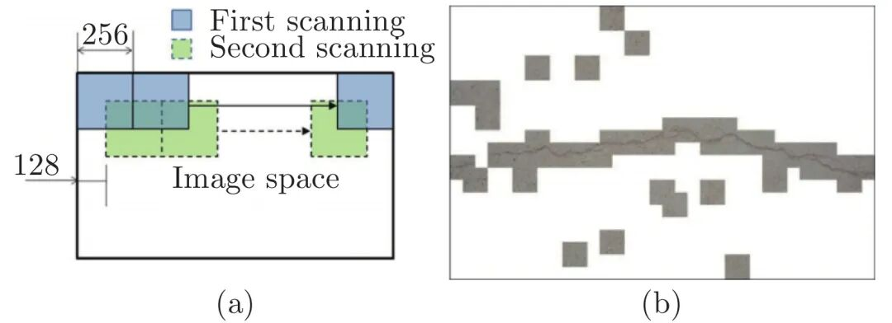
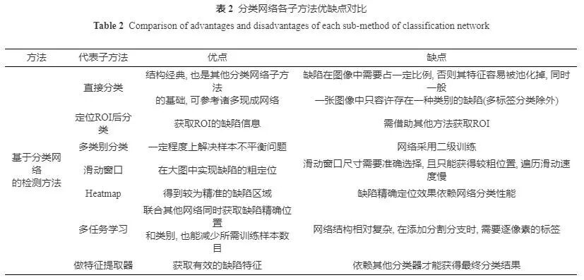
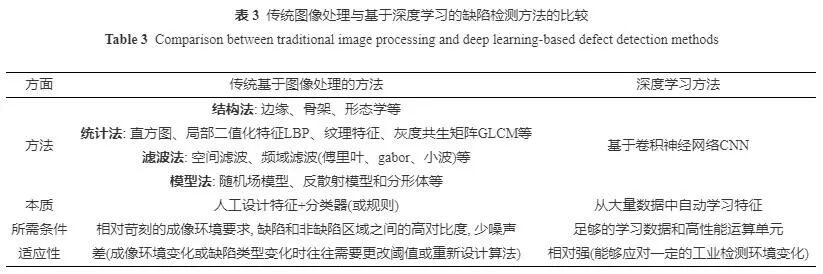
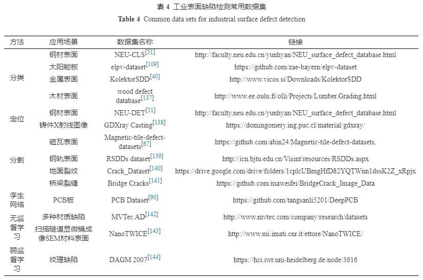
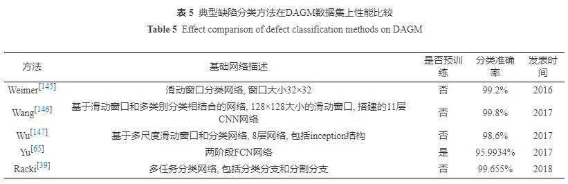
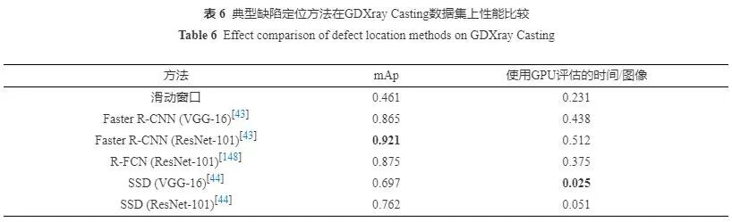

# 【抢先预览】徐德等：基于深度学习的表面缺陷检测方法综述

原创 自动化学报 自动化学报 2021-03-19 16:13 北京

> 原文地址: [https://mp.weixin.qq.com/s/vo8DuOlR3UHdXn3Cj9V-Gw](https://mp.weixin.qq.com/s/vo8DuOlR3UHdXn3Cj9V-Gw)

**点击蓝字**

**关注我们**

  

推荐一篇优先出版文章，3月上线网站，第一时间推送给大家，希望您能喜欢！

  

欢迎已经优先出版的作者给小编提供资料（请您向编辑部索要推送模板aaswkfb@ia.ac.cn），及时发布在我们的公众号上宣传。

  

**近年来, 基于深度学习的表面缺陷检测技术广泛应用在各种工业场景中. 本文对近年来基于深度学习的表面缺陷检测方法进行了梳理, 根据数据标签的不同将其分为全监督学习模型方法、无监督学习模型方法和其他方法三大类, 并对各种典型方法进一步细分归类和对比分析, 总结了每种方法的优缺点和应用场景. 本文探讨了表面缺陷检测中三个关键问题, 介绍了工业表面缺陷常用数据集. 最后, 对表面缺陷检测的未来发展趋势进行了展望.**

  

陶显, 侯伟, 徐德. 基于深度学习的表面缺陷检测方法综述. 自动化学报, 2021, 47(x): x−x

_http://www.aas.net.cn/cn/article/doi/10.16383/j.aas.c190811?viewType=HTML_

  

表面缺陷检测是机器视觉领域中非常重要的一项研究内容, 也被称为AOI (Automated Optical Inspection)或ASI (Automated surface inspection), 它是利用机器视觉设备获取图像来判断采集图像中是否存在缺陷的技术. 目前, 基于机器视觉的表面缺陷装备已经在各工业领域广泛替代人工肉眼检测, 包括3C、汽车、家电、机械制造、半导体及电子、化工、医药、航空航天、轻工等行业. 传统的基于机器视觉的表面缺陷检测方法, 往往采用常规图像处理算法或人工设计特征加分类器方式. 一般来说, 通常利用被检表面或缺陷的不同性质进行成像方案的设计, 合理的成像方案有助于获得光照均匀的图像, 并将物体表面缺陷明显的体现出来. 一种方式是针对被检表面颜色选择光源, 例如文献\[1\]中选择复合白色光源成像彩色布匹表面缺陷. 另一种常见的方式是依据被检测表面反射性质选择不同成像方案, 主要包括明场成像、暗场成像和混合成像等. 例如, Chen\[2\]等人针对金属易拉罐凹凸底部的表面缺陷检测, 设计了两个同心放置的圆锥环形明场光源, 用于同时照亮易拉罐底部的中央和外围区域. Tao\[3\]等人采用了暗场成像对大口径光学元件表面微弱划痕进行检测. 虽然精心构造的成像方案能够大大减轻经典检测算法设计的难度, 但也增加了检测系统的应用成本. 同时在很多开放式的工业环境下(如图1(b)和1(d)所示的自然场景), 期待设计的成像系统完全消除场景或者被检材料等变化对检测系统的影响, 往往不太现实. 在真实复杂的工业环境下, 表面缺陷检测往往面临诸多挑战, 例如存在缺陷成像与背景差异小、对比度低、缺陷尺度变化大且类型多样, 缺陷图像中存在大量噪声, 甚至缺陷在自然环境下成像存在大量干扰等情形, 如图1所示, 此时经典方法往往显得束手无策, 难以取得较好的检测效果.

  

_图1  复杂工业环境下的表面缺陷图像 (a)光学元件暗场成像划痕图像; (b)建筑桥梁表面缺陷; (c)板带钢表面缺陷; (d)无人机航拍绝缘子缺陷_

_Fig.1  Images of surface defects in complex industrial environment (a)Scratch image of dark field image of optical component; (b) Surface defect of building bridge; (c) Strip surface defect; (d) Unmanned aerial vehicle insulator defect_

  

近些年来, 随着以卷积神经网络(CNN)为代表的深度学习模型在诸多计算机视觉(CV, computervision)领域成功应用, 例如人脸识别、行人重识别、场景文字检测、目标跟踪和自动驾驶等, 不少基于深度学习的缺陷检测方法也被广泛应用在各种工业场景中, 甚至国内外一些公司开发出多种基于深度学习的商用工业表面缺陷检测软件, 如表1所示. 全球传统工业视觉及其部件的市场规模在2025年将达到192亿美元\[4\], 其中中国占比约为30%, 并保持14%的年度平均增长率, 这一领域正在逐步被新一代基于深度学习的工业视觉技术替代. 同时我国在《中国制造2025》白皮书中提出“...加快提升产品质量. 实施工业产品质量提升行动计划...推广采用智能化检测设备...使重点实物产品的性能稳定性、质量可靠性、环境适应性、使用寿命等指标达到国际同类产品先进水平...”. 因此, 基于深度学习的表面缺陷检测方法不仅具有重要的学术研究价值, 同时有非常广阔的市场应用前景.

  

  

鉴于目前国内还没有全面细致论述基于深度学习表面缺陷检测方法的综述文献, 本文通过对2014-2019年相关文献进行归纳梳理, 旨在帮助研究人员快速和系统地了解该领域相关方法与技术. 本文内容安排如下: 第1部分给出缺陷检测问题的定义. 第2部分重点对最近几年相关方法进行详细介绍、细分和对比. 第3部分分析基于深度学习的表面缺陷检测中三个关键问题. 第4部分介绍工业领域公开的缺陷检测数据集. 最后, 对未来可能的研究焦点和发展方向进行了展望.

**1. 缺陷检测问题的定义**

  

缺陷的定义: 在机器视觉任务中, 缺陷倾向于是人类经验上的概念, 而不是一个纯粹的数学定义. 对缺陷模式认知的不同, 会导致两种截然不同的检测手段. 以布匹表面缺陷检测为例, 如图2 所示, 第一种有监督的方法体现在利用标记了标签(包括类别、矩形框或逐像素等)的缺陷图像输入到网络中进行训练. 此时“缺陷”意味着标记过的区域或者图像. 因此, 该方法更关注缺陷特征, 例如在训练阶段将包含大片黑色范围的区域或者图像标记为“异色”缺陷用于网络训练. 在测试阶段, 当布匹图像中检测到大片黑色的特征时, 即认为出现了“异色”缺陷. 第二种是无监督的缺陷检测方法, 通常只需要正常无缺陷样本进行网络训练, 也被称为one-class learning. 该方法更关注无缺陷(即正常样本)特征, 当缺陷检测过程中发现没有见过的特征(异常特征)时, 即认为检测出缺陷. 此时“缺陷”意味着异常, 因此该方法也被称作异常检测(Anomaly Detection).

  

_图2  缺陷检测的问题定义_

_Fig.2  Definition of defect detection problem_

  

缺陷检测的定义: 对比计算机视觉中明确的分类、检测和分割任务, 缺陷检测的需求非常笼统. 实际上, 其需求可以划分为三个不同的层次: “缺陷是什么”、“缺陷在哪里”和“缺陷是多少”. 第一阶段“缺陷是什么”对应计算机视觉中的分类任务, 如图2中分类三种缺陷类别: 异色、空洞和经线, 这一阶段的任务可以被称为“缺陷分类”, 仅仅给出图像的类别信息. 第二阶段“缺陷在哪里”对应计算机视觉中的定位任务, 这一阶段的缺陷定位才是严格意义上的检测. 不仅获取图像中存在哪些类型的缺陷, 而且也给出缺陷的具体位置, 如图2中将异色缺陷用矩形框标记出来. 第三阶段“缺陷是多少”对应计算机视觉中的分割任务, 如图2中缺陷分割的区域所示, 将缺陷逐像素从背景中分割出来, 并能进一步得到缺陷的长度、面积、位置等等一系列信息, 这些信息能辅助产品高一级的质量评估, 例如优劣等级的判断. 虽然缺陷检测的三个阶段的功能需求和目标不同, 但实际上三个阶段互相包含且能相互转换. 例如第二阶段“缺陷定位”包含第一阶段“缺陷分类”这一过程, 第三阶段“缺陷分割”同时也能完成第二阶段“缺陷定位”. 第一阶段“缺陷分类”也能通过一些方法实现第二阶段和第三阶段的目标. 因此, 在后文还是按照传统工业习惯统称为缺陷检测, 只是在针对不同网络结构和目标功能时, 才有所区分.

**2.   表面缺陷检测深度学习方法**

  

本节总结概述基于深度学习的表面缺陷检测方法. 如图3所示, 依据数据标签的不同, 将其整体分为全监督学习模型、无监督学习模型和其他方法(半监督学习模型和弱监督学习模型). 在全监督模型中, 依据输入图像方式和损失函数的差异, 分为基于表征学习和度量学习的方法. 在表征学习中, 根据网络结构的不同可以进一步细分为分类网络、检测网络和分割网络. 目前大量的研究工作都是着眼于全监督学习方向, 但无监督学习同样是一个值得研究的方向. 从图3中可以看出, 本文按照每类方法的处理特点又细分为若干种不同的子方法.

  

_图3  缺陷检测方法框架图_

_Fig.3  Framework of defect detection methods_

  

**2.1   表征学习**

  

现阶段大部分基于深度学习的表面缺陷检测是基于有监督的表征学习方法. 表征学习的本质是将缺陷检测问题看作计算机视觉中的分类任务, 包括粗粒度的图像标签分类或区域分类, 以及最精细的像素分类. 由于实现的目标与计算机视觉任务完全一致, 因此基于表征学习的缺陷检测方法可以看作是其相关经典网络在工业领域的一个应用.

  

**2.1.1   分类网络**

  

在真实的工业生产中, 检测对象形状、尺寸、纹理、颜色、背景、布局和成像光照的巨大差异使复杂环境下的缺陷分类成为一项艰巨的任务. 由于CNN强大的特征提取能力, 采用基于CNN的分类网络目前已成为表面缺陷分类中最常用的模式. 通常CNN分类网络的特征提取部分由级联的卷积层+pooling层组成, 后面连接全连接层(或average pooling层)+softmax结构用于分类. 一般来说, 现有表面缺陷分类的网络常常采用计算机视觉中现成的网络结构, 包括AlexNet\[5\], VGG\[6\], GoogLeNet\[7\], ResNet\[8\], DenseNet\[9\], SENet\[10\], ShuffleNet\[11\], MobileNet\[12\]等. 或者针对实际问题搭建简易的网络结构, 通过输入一张测试图像到分类网络中, 网络输出该图像的类别和其类别的置信度. 依据分类网络方法实现任务的差异, 我们将其细分为三个小类: 直接利用网络做分类、利用网络做缺陷定位和利用网络作为特征提取器.

  

**a. 直接利用网络做分类**

  

直接利用分类网络做缺陷的分类任务是CNN最早应用于表面缺陷检测中常用的手段. 根据研究工作的特点, 它进一步可以细分为原图分类、定位ROI(Region Of Interest) 后分类和多类别分类三种. 1)原图分类即直接将收集的完整缺陷图像放入网络进行学习训练. 2014年, 奥地利科技研究所\[13\]最早采集光度立体图像训练CNN网络来实现轨道表面空洞缺陷分类, 整个网络一共包含两个卷积层和池化层以及最后一个全连接层, 在钢轨表面数据集上最终达到的错误识别率为1.108%. Park等\[14\]设计了一种简易CNN分类网络, 用于自动检测表面零件上的污垢、划痕、毛刺和磨损等缺陷. 该方法在实验缺陷数据集上的平均检测正确率为98%, 其检测速度为5 285样本/分钟(图像分辨率为32×32像素). Kyeong\[15\]提出了一种卷积神经网络框架对半导体行业的晶圆仓图WBM中的混合类型缺陷模式进行分类. 文献\[16\]采用修改的VGG19网络用于识别300×300分辨率的太阳能面板图像缺陷, 网络的准确率达到88.42%, 超过多种手工设计特征(包括KAZE\[17\]、SIFT\[18\]、SURF\[19\])和支撑向量机(SVM, Support Vector Machine)方法效果. Liang等人\[20\]提出了一种基于ShuffleNetV2网络分类复杂背景下的瓶子喷墨码缺陷, 所提出的方法在塑料容器行业的在线喷墨码检测设备上获得了99.88%的分类正确率. 直接利用原图分类的方法应用非常广泛, 可用于多个领域的缺陷分类, 例如焊接缺陷分类\[21\]、聚合物锂电池水泡缺陷的分类\[22\]和PCB板缺陷的分类\[23\]等. 2)定位ROI后分类. 它在许多工业应用中较为常见. 通常来说, 针对获取到的整张图像中, 我们常常只关注某个固定区域中是否存在缺陷, 因此往往预先获取到感兴趣的区域(ROI), 然后将ROI输入网络进行缺陷类别的判断. Shang\[24\]等人提出了一种两阶段的铁轨缺陷识别算法, 首先利用canny和直线拟合算法在整个原始图像上对铁轨区域进行裁剪. 然后将裁剪的图像放入Inception V3网络中提取特征以进行轨道图像分类. 文献\[25\]中通过级联的目标检测网络对高铁接触网螺栓区域进行获取, 然后将裁剪的螺栓图像输入到CNN网络中进行缺陷分类. Li\[26\]等人首先利用基于局部二值模式(LBP, Local Binary Pattern)特征的级联目标检测器实现扫描隧道显微镜成像材料待检测区域定位, 然后采用CNN模型来获取表面缺陷的具体类型. 3)多类别分类. 当待分类的缺陷类型超过2类时, 常规的缺陷分类网络与原图分类方法一样, 即网络的输出节点为缺陷类型的数目+1(包括正常类别). 但多类别分类方法往往先采用一个基础网络进行缺陷与正常样本二分类, 然后在同一个网络上共享特征提取部分, 修改或者增加缺陷类别的分类分支. 通过该方式相当于给后续的多目标缺陷分类网络准备了一个预训练权重参数, 这个权重参数是通过正常样本与缺陷样本之间二分类训练得到. Xie等\[27\]首先训练第一个ND(normal-defective) CNN模型进行二分类(正常图像和所有其他缺陷图像), 缓解了数据不平衡的问题. 在训练好NDCNN模型后, 将输出向量更改为6维向量来训练ID(interdefect) CNN模型, 以使其适合于多类缺陷标签问题. 该模型在NDCNN权重的基础上使用缺陷图像进行了微调, 从而减少了样本量需求也节省了训练时间. Fusaomi等\[28\]提出了一种sssnet (Net with SVMs to classify sample images)网络, 该网络有两个分类分支, 第一个二分类分支用来分类正常样本和NG样本, 网络的模型采用AlexNet进行特征提取, 其分类器采用SVM, 网络第二个分支用于7类别的缺陷分类. 多类别分类采用这种二分支结构, 可以充分利用缺陷样本与正常样本数目不均衡的特点, 挖掘两者特征之间的差异.

  

**b. 利用网络做缺陷定位**

  

一般认为, 分类网络只能完成图像标签级别的分类, 实际上结合不同的技巧和方式, 分类网络也可以实现缺陷的定位与逐像素的分类. 根据采用的手段不同, 它进一步可以分为滑动窗口、热力图(heatmap)和多任务学习网络三种形式. 1)滑动窗口是最简单和直观的实现缺陷粗定位的方法. 一般工业表面缺陷检测处理的图像分辨率较大, 通过较小尺寸的窗口在原始图像上进行冗余滑动, 将滑动窗口中的图像输入到分类网络中进行缺陷识别. 最后将所有的滑动窗口进行连接, 即可获得缺陷粗定位的结果. 2017年, Cha\[29\]等人最早采用基于滑动窗口的CNN分类网络实现了裂纹表面缺陷定位, 两种滑动窗口冗余路径结合实现图像全覆盖, 如图4所示, 图4(a)为滑动窗口路径示意图, 图4(b)为裂纹定位的结果图. 文献\[30-32\]采用相同的方法应用于金属表面裂纹、路面表面裂纹和城市建筑物表面缺陷定位. 2)热力图(heatmap)是一种反映图像中各区域重要性程度的图像, 颜色越深代表越重要. 在缺陷检测领域, 热力图中颜色越深的区域代表其属于缺陷的概率越大. 2017年, Ren等人\[33\]采用图像分块和特征迁移方式获取每个分块所对应属于缺陷的置信度, 并将其转换为热力图. 在热力图基础上运用Otsu大津法\[34\]和图割算法进一步得到准确的缺陷轮廓区域. 在计算机视觉领域, 常采用CAM(Class Activation Mapping)\[35\]和Grad-CAM\[36\]方法获得heatmap, 其本质上通过加权特征图, 来确定网络模型是通过哪些像素作为依据判断输入图片所属的类别. Lin\[37\]等人采用CAM获取热力图, 并利用Otsu二值化方法分割热力图, 实现LED灯图像中划痕或线缺陷的定位. Zhou\[38\]等人采用grad-CAM方法获取热力图, 也采用Otsu算法分割得到表面缺陷的准确区域. 3)多任务学习网络. 单纯的分类网络不加其他技巧的话, 一般只能实现图像级别的分类. 因此, 为了精细定位缺陷位置, 往往设计的网络会加上额外的分割分支, 两个分支共享特征提取的backbone结果, 这样网络一般有分类和分割两个输出, 构成多任务学习网络. 它兼顾两个网络特点, 对于分割网络分支, 图像中每个像素都能被当作训练样本来训练网络. 因此, 多任务学习网络不仅利用分割分支输出缺陷具体的分割结果, 而且可以大大减少分类网络对样本的需求. Racki\[39\]等人设计了一个紧凑的一体化多任务CNN结构用于表面缺陷的分割和分类. 所提出的网络在各种表面纹理缺陷数据集DAGM 2007上取得了最好的效果. Tabernik\[40\]等人也提出了一个融合分类和分割分支的多任务缺陷检测网络, 整个网络只用了50张1 408×512分辨率的缺陷图像进行训练, 取得的缺陷准确识别率超过了商业Cognex ViDi Suite软件.

  

_图4  基于滑动窗口的裂纹定位 (a)滑动窗口路径; (b)裂纹定位的结果_

_Fig.4  Crack location based on sliding window (a) Sliding window path; (b) Crack localization results_

  

**c. 利用网络做特征提取器**

  

在早期基于深度学习的缺陷分类方法中, 不少文献利用CNN特征提取的强大功能, 先将图像输入到预训练网络中获取图像表征特征, 再将获取的特征输入到常规的机器学习分类器(例如SVM等)中进行分类. 例如Zhao等人\[41\]等人采用CNN对电力航拍绝缘子图像块进行特征抽取, 将特征输入到SVM中进行二分类, 同时作者还比较了从不同全连接层抽取特征分类效果的差异. Malekzadeh等人\[42\]采用由VGG-DNN中的fc6层的输出作为特征, 输入到SVM中实现飞机表面缺陷分类, 缺陷分类精度到达96%以上.  

  

综上, 基于分类网络的方法在实际应用中非常广泛, 同时, 不同的子方法本身也是有其自身优劣, 具体如表2所示.

  

  

**2.1.2   检测网络**

  

目标定位是计算机视觉领域中最基本的任务之一, 同时它也是和传统意义上缺陷检测最接近的任务, 其目的是获得目标精准的位置和类别信息. 目前, 基于深度学习的目标检测方法层出不穷, 一般来说, 基于深度学习的缺陷检测网络从结构上可以划分为: 以Faster R-CNN\[43\]为代表的两阶段(two stage)网络和以SSD\[44\]或YOLO\[45\]为代表的一阶段(one stage)网络. 两者的主要差异在于两阶段网络需要首先生成可能包含缺陷的候选框(proposal), 然后在进一步进行目标检测. 一阶段网络直接利用网络中提取的特征来预测缺陷的位置和类别.

  

**a. 基于两阶段的缺陷检测网络**

  

两阶段检测网络(Faster R-CNN)的基本流程是首先通过backbone网络获取输入图像的特征图, 然后利用RPN计算锚框(anchor box)置信度, 获取proposal. 然后对proposal区域的特征图进行ROIpooling后输入网络, 通过对初步检测结果进行精细调整, 最终得到缺陷的定位和类别结果. 因此, 针对缺陷检测的特点, 常见方法往往针对backbone结构或其特征图、锚框比例、ROIpooling和损失函数等方面进行改进. 2017年, Cha等人\[46\]最早将Faster R-CNN直接应用在桥梁表面缺陷定位, 其backbone网络被替换成ZF-net, 在包含2366张500×375大小的5类桥梁建筑数据集中, 其mAP值达到87.8%. Zhong等人\[47\]提出了一种基于三阶段PVANET++的部件缺陷定位系统, 用于高速铁路的悬链支撑装置-开口销的松动和缺失检测, PVANET++是一个改进版的Faster R-CNN, 相比于原版Faster R-CNN在最高层特征图进行proposal提取, 其改进点在于将低层两组特征图进行降采样与高层特征图上采样后联结形成新的超特征图用于proposal提取. 另外, 作者采用了54个不同比例的锚框, 而不是原始的9个锚框. 2018年, Tao等人\[48\]设计了一个两阶段的Faster R-CNN网络用于无人机电力巡检中绝缘子缺陷定位, 第一阶段用于自然场景下的绝缘子区域定位, 第二个阶段实现绝缘子区域中的缺陷定位. Xue等人\[49\]等人基于改进的Faster R-CNN实现盾构隧道中衬砌缺陷的检测, 其backbone采用改进的Inception全卷积网络得到特征图, 同时增加两个锚框比例, 使用位置敏感ROIpooling替代传统的ROIpooling, 所提出模型的在每整图像48 ms的测试时间速度下, 实现检测精度超过95%. Ding\[50\]等人提出了一种针对PCB表面缺陷检测网络(TDD-Net), 该方法通过使用k均值聚类设计合理锚框大小, 其次引入多尺度金字塔网络(FPN, feature pyramid networks)到Faster R-CNN中, 加强了来自底层结构信息的融合, 使得网络适应微小的缺陷检测. 最后, 考虑到小数据集和样本不平衡的特点, 在训练阶段采用了在线困难样本挖掘(OHEM, Online Hard Example Mining)技术. 该方法在PCB缺陷数据集上达到了98.90%的mAP. He等人\[51\]等提出的基于Faster R-CNN的带钢表面缺陷检测网络, 该网络改进在于将backbone中多级特征图组合为一个多尺度特征图. 在缺陷检测数据集NEU-DET上, 提出的方法在采用ResNet-50的backbone下实现了82.3%的mAP. 利用Faster R-CNN的检测方法也广泛应用在隧道\[52\]、液晶面板偏振片表面\[53\]、热成像绝缘子缺陷\[54\]、铝型材表面\[55\]和轮胎轮毂\[56\]等缺陷检测领域.

  

**b. 基于单阶段的缺陷检测网络**

  

单阶段检测网络分为SSD和YOLO两种, 两者都是利用整张图作为网络的输入, 直接在输出层回归bounding box(边界框)的位置及其所属的类别. SSD的特点在于引入了特征金字塔检测方式, 从不同尺度的特征图中来预测目标位置与类别. 它使用6个不同特征图检测不同尺度的目标, 一般底层特征图用于预测小目标, 高层特征图预测大目标. Chen等人\[25\]采用改进的SSD网络进行接触网支撑装置上的紧固件缺陷区域定位, 其主要改进部分在于是采用了不同层的特征图用于目标检测. Li\[57\]等人提出了一种基于MobileNet-SSD的灌装生产线容器密封表面缺陷检测方法, 通过MobileNet优化了SSD的backbone结构, 以简化检测模型参数. Liu\[58\]等人同样采用基于MobileNet-SSD网络用于定位高铁接触网支撑组定位, 相比于原始SSD网络, 其改进点在于MobileNet为backbone和只使用4个不同的特征图来加速目标检测, 在测试的数据集上, 其目标达到25 fps检测速度和94.3%mAP. Zhang等人\[59\]采用最新YOLOv3版本应用于桥梁表面缺陷定位, 相比于原始YOLOv3网络, 引入预训练权重、批再规范化(Batch Renormalization)和Focal loss进一步提高缺陷检测率.

随着计算机视觉中目标检测网络的发展, 相信在今后会有越来越多新的检测模型应用在表面缺陷检测中. 综上, 在现阶段追求检测速度的缺陷检测领域, 基于一阶段的模型应用较多, 在强调检测精度的缺陷检测领域, 基于两阶段的模型采用较多.

  

**2.1.3   分割网络**

  

分割网络将表面缺陷检测任务转化为缺陷与正常区域的语义分割甚至实例分割问题, 它不但能精细分割出缺陷区域, 而且可以获取缺陷的位置、类别以及相应的几何属性(包括长度、宽度、面积、轮廓、中心等). 按照分割功能的区别, 其大致可以分为: FCN\[60\] (Fully Convolutional Networks)方法和Mask R-CNN\[61\]方法两种.

  

**a. FCN方法**

  

全卷积神经网络(FCN)是图像语义分割的基础, 目前几乎所有的语义分割模型都是基于FCN. FCN首先利用卷积操作对输入图像进行特征提取和编码, 然后再通过反卷积操作或上采样将特征图逐渐恢复到输入图像尺寸大小. 依据FCN网络结构的差异, 其缺陷分割方法可以进一步细分为常规FCN、Unet\[62\]和SegNet\[63\]三种方法. 1)常规FCN方法. Wang\[64\]等人提出一种基于FCN的轮胎X射线图像缺陷分割方法, 相比于原始FCN方法, 文章通过融合多尺度采样层的特征图来细化分割轮胎图像中的缺陷. Yu等人\[65\]提出了一个基于FCN的两阶段表面缺陷分割模型, 第一阶段采用一个轻量级的FCN快速获取粗略缺陷区域, 然后第一阶段的输出作为第二阶段FCN的输入用于细化缺陷分割结果, 该方法在公共数据集DAGM2007上取得了95.9934%的平均像素准确率. Dung等人\[66\]采用基于VGG16编码器的FCN网络对混凝土表面裂缝进行分割, 其平均像素准确率达到90%. 2) Unet方法. Unet不仅是一种经典的FCN结构, 同时也是典型的编码器-解码器(encoder-decoder)结构. 它的特点在于引入了跳层连接, 将编码阶段的特征图与解码阶段的特征图进行融合, 有利于分割细节的恢复. Huang等人\[67\]提出了一个MCuePush Unet的模型用于磁瓦表面缺陷的显著性检测. 其Unet网络的输入为MCue模块生成三通道图像, 包括一个显著性图像和两个原始图像. Li等人\[68\]提出了一种基于改进Unet网络的混凝土结构表面缺陷分割方法. 在编码器采用Dense Block模块, 同时跳层连接没有采用原始的concat操作, 而是逐像素求和. 该方法在包含2750张图像(504××376像素)4种缺陷的混凝土结构数据库上取得了91.59%的平均像素准确率和84.53%的平均IoU. Liu等人\[69\]提出了一种基于ResNet模块的Unet分割网络, 用于TFT-LCD制造过程中导电颗粒的检测. 3) SegNet方法. 它也是一种经典的编码器-解码器结构. 其特点在于解码器中的上采样操作利用了编码器中最大池化操作的索引. Dong等人\[70\]所提出的FL-SegNet方法将原始的SegNet网络与Focal loss损失函数进行结合应用于分割隧道衬砌中的多种缺陷. Roberts等人\[71\]设计了一种基于SegNet网络, 用于扫描隧道显微镜成像下材料晶体缺陷的语义分割. 在少量高质量的钢缺陷图像上三种缺陷的像素分类正确率为: 位错为91.60±1.77%, 沉淀物为93.39±1.00%, 空隙为98.85±0.56%. Zou等人\[72\]在SegNet的编码器-解码器体系结构上构建DeepCrack网络, 用于地面裂纹检测. 在该模型中, 将分层卷积阶段学习的多尺度深度卷积特征融合在一起, 以捕获精细的裂纹结构. DeepCrack在三个具有挑战性的数据集上平均获得了87%以上的F值.

  

目前, 基于深度学习的分割网络还在不断地被提出, 例如LinkNet\[73\]、DeepLabv3\[74\]、PSPNet\[75\]等等. 很多最新模型中的模块例如空洞卷积\[76, 77\]和金字塔pooling\[78\]也被添加到FCN框架中, 广泛应用于各种场景的缺陷分割. 近几年, 生成对抗网络(Generative Adversarial Network, GAN\[79\])在计算机视觉领域广泛应用, 常常被用来生成图像. GAN由生成器和判别器模型构成. 在结合GAN的缺陷分割方法中, 生成器往往直接采用FCN网络, 判别器通过分类模型来区分生成器的结果和groundtruth, 通过生成器和判别器的不断博弈, 让生成器的输出结果逐渐接近groundtruth. 结合GAN的分割方法已经被用在手机盖板玻璃信号孔缺陷分割\[80\]和道路裂纹缺陷分割\[81\]中.

  

**b. Mask R-CNN方法**

  

Mask R-CNN是目前最常用的图像实例分割方法之一, 可以被看作是一种基于检测和分割网络相结合的多任务学习方法. 当多个同类型缺陷存在粘连或重叠时, 实例分割能将单个缺陷进行分离并进一步统计缺陷数目, 然而语义分割往往将多个同类型缺陷当作整体进行处理. 目前大部分文献都是直接将Mask R-CNN框架应用于缺陷分割, 例如路面缺陷分割\[82\]、工业制造缺陷\[83\]、螺栓紧固件缺陷\[84\]和皮革表面缺陷\[85\].

  

相比分类和检测网络方法, 分割方法在缺陷信息获取上有其优势. 但它与检测网络一样, 需要大量的标注数据, 其标注信息是逐像素, 往往花费大量的标注精力和成本.

  

**2.2   度量学习**

  

度量学习是使用深度学习直接学习输入的相似性度量. 在缺陷分类任务中, 往往采用孪生网络(Siamese network)进行度量学习. 不同于表征学习输入单张图像转化为分类任务, 孪生网络的输入通常为两张或多张成对图像, 通过网络学习出输入图片的相似度, 判断其是否属于同一类. 孪生网络损失函数的核心思想是让相似的输入距离尽可能地小, 不同类别的输入距离尽可能地大.

  

**孪生网络:** 一般原始孪生网络的输入是两张成对的图像, 网络的“连体”是通过共享权值来实现的. Kim等人\[86\]设计了一个基于CNN结构的孪生网络对钢表面缺陷图像进行分类, 首先将两张图像输入到共享权值的CNN中完成特征提取, 然后利用基于相似度函数的对比损失计算两个特征之间的差异程度. 在NEU钢表面缺陷数据集\[51\]上, 文章只通过5张和10张少量样本图像进行网络学习, 在9种缺陷类别上网络的分类准确度分别为85.1%和86.5%. Wu等人\[87\]提出了一种基于孪生网络的相似度度量方法来分类纽扣缺陷. 网络设计了新的损失函数用于自动特征提取和样本的相似性度量, 所提出的方法在包括凹痕、裂纹、污点、孔洞、凹凸不平等多种缺陷的纽扣数据集进行了评估, 达到的分类精度为98%. Liu等人\[88\]基于改进的孪生网络对大型紧固件缺陷进行同时定位和缺陷分类. 其孪生网络后接有两个分支, 第一个分支利用对比损失来实现紧固件定位, 第二个分支采用softmax损失对紧固件缺陷进行分类. 在测试的数据集上, 紧固件定位的平均检测率达到99.36%, 紧固件分类的平均检测率达到92.69%. Staar等人\[89\]将原始的孪生网络扩展为Triplet Networks, 它具有三个输入, 包括两个相同类别和一个不同类别, 其原理与孪生网络一致. 除了缺陷分类, 孪生网络也能被用于缺陷定位与检测. Tang\[90\]等人提出了一个基于深度学习模型的PCB缺陷检测模型, 模型的前端将无缺陷的正常样本和有缺陷的图像对输入到孪生网络后进行特征差分, 将差分结果采用群组金字塔合并模块进行缺陷定位. 在DeepPCB数据集上该方法以62 FPS达到98.6%的mAP. Liu等人\[91\]将孪生网络输出的特征图与其他子网络输出的结果进行特征融合来提高缺陷目标的显著性.

  

度量学习可以近似看作为样本在特征空间进行聚类, 表征学习可以近似看作为学习样本在特征空间的分界面. 相比于表征学习, 度量学习的方法应用在表面缺陷定位中不太多, 目前大部分都是应用在缺陷分类任务中. 在缺陷定位方面, 输入孪生网络的图像对需要具有统一的内容形式, 要求比较严格, 现阶段还无法适应复杂的工业环境.

  

**2.3   正常样本学习**

  

目前最常用于表面缺陷检测的无监督学习模型是基于正常样本学习的方法. 由于只需要正常无缺陷样本进行网络训练, 该方法也常被称为one-class learning. 正常样本学习的网络只接受正常(无缺陷)样本进行训练, 使得其具备强大的正常样本分布的重建和判别能力. 因此, 当网络输入的样本存在缺陷时, 往往会产生与正常样本不同的结果. 相比于有监督学习模型, 它能够检测到偏离预期的模式或没有见过的模式, 这些模式都可以被称为缺陷或者异常. 依据处理空间的不同, 本文将该缺陷检测方法分为基于图像空间和特征空间两种. 通常该方法采用的网络模型为自编码器(autoencoder, AE)和GAN.

  

**2.3.1   基于图像空间**

  

基于图像空间的方法是在图像空间上对缺陷进行检测. 因此, 该方法不仅能实现图像级别的分类和识别, 也可以获取到缺陷的具体位置. 该方法常用的手段有两种：

  

**1) 利用网络实现样本重建与补全.** 其原理类似去噪编码器, 当输入任意样本图像到网络中, 都可以得到其重建后对应的正常(无缺陷)样本, 因此, 网络可以看作具备自动修复或者补全缺陷区域的能力. 用输入图像分别减去这些重建或修复图像可以获得残差图像, 这些残差图像也被称为重建误差. 它能作为判断待检测样本是否异常的指标. 当重建误差过大时, 可以认为输入图像认为存在缺陷, 差异过大的区域即为缺陷区域. 当重建误差很小, 即认为输入图像是正常样本. Mei\[92\]等人通过使用卷积自编码器网络在不同的高斯金字塔等级上重建图像子块, 并合成来自这些不同分辨率通道的重建结果, 其网络的重建误差采用MSE(mean-square error)损失. 该方法在多个数据集上取得了相比传统图像处理方法好的效果. Haselmann\[93\]等人设计了一个基于全卷积的自动编码器网络, 基于正样本图像补全和重建的误差实现装饰性塑料零件表面缺陷检测. Kang等人\[94\]设计了一个深度去噪编码器, 基于其重建误差来检测绝缘子图像中的缺陷, 其重建损失采用L2损失. Youkachen等人\[95\]使用卷积自动编码器(CAE, convolutional autoencoder)用于图像重建, 通过锐化处理重建误差获取最终的热轧带钢表面缺陷分割结果, 其重建误差采用MSE. Zhao等人\[96\]利用GAN和CAE实现表面缺陷图像的重建, 文章将输入图像和重建图像输入到LBP算法处理后再做差. Bergmann等人\[97\]首次将传统图像处理中的SSIM(structural similarity)指标作为重建损失, 引入到基于自动编码器的图像重建中, 实验结果表明相比于传统L2损失, SSIM损失能大幅提高表面缺陷检测的效果. Yang等人\[98\]提出了一种基于无监督多尺度特征聚类的全卷积自动编码器(MS-FCAE)方法, 该方法利用处于不同比例等级的多个FCAE子网来重建若干纹理背景图像. 为了最大程度地提高效率和编码特征图的判别能力, 每个FCAE子网采用全卷积神经网络和特征聚类方法, 所提出的MS-FCAE方法在多个纹理表面检测数据集上进行了评估, 缺陷检测精度达到92.0%.

  

**2) 利用网络实现异常区域分类.** 这类网络通常采用GAN的判别器. 该方法原理是训练生成对抗网络GAN以生成类似于正常表面图像的伪图像, 这意味着训练好的GAN可以在潜在特征空间中很好地学习正常样本图像. 因此, GAN的判别器可以自然地用作分类器, 用于分类缺陷和正常样本. Zhai等人\[99\]采用多尺度融合策略融合GAN鉴别器的三个卷积层的响应, 然后利用Otsu方法分割在融合特征响应图上进一步分割出缺陷位置. 该方法与文献\[33\]的原理类似, 只不过是利用了正常样本进行训练, 且其网络模型是GAN的判别器. Hu等人\[100\]提出了一种基于深度卷积生成对抗网络(DCGAN) 的自动检测织物缺陷的新型无监督方法. 该模型包括两个部分, 第一部分利用模型中GAN的判别器生成了一个缺陷分布似然图, 其中每个像素值都表示该位置出现缺陷的概率. 第二部分通过引入编码器到标准DCGAN, 实现重检测图像的重建. 当从原始图像中减去重建图像时, 可以创建残差图以突出显示潜在的缺陷区域. 联合残差图和似然图以形成增强的融合图. 在融合图上采用阈值分割算法进一步获取准确的缺陷位置, 该方法在各种真实纺织物样品上进行了评估和验证.

  

**2.3.2   基于特征空间**

  

基于特征空间的方法是在特征空间中, 通过正常样本与缺陷样本特征分布之间的差异来进行缺陷检测. 特征之间差异也叫做异常分数, 当异常分数高于某个值, 即可认为出现缺陷. 2017年, Schlegl\[101\]等人最早提出了深度卷积生成对抗网络AnoGAN, 实现检测图像从图像空间到潜在空间的映射, 其异常分数由图像空间中差异和GAN网络中判别器最后一层特征图之间的差异来计算. Lai\[102\]等人基于上述映射方法, 在潜在空间中直接采用Fréchet距离来实现缺陷与正常样本的区分, 在太阳能面板数据集上取得了93.75%的分类正确率. Soukup\[103\]等人采用VAE (Variational Auto-encoder)网络在潜在空间中实现缺陷检测. Liu等人\[104\]设计了一个基于GAN和One-Class Classifier的表面缺陷分类模型, GAN中生成器G采用编码解码器, 其编码得到隐空间的特征输入到SVM分类器中进行缺陷分类, 提出的方法在钢材表面多缺陷数据集上获得了平均分类精度94%. 2019年, Schlegl等人\[105\]针对之前的AnoGAN工作提出了改进f-AnoGAN, 其异常分数由引入编码器模块实现的图像样本重建损失和GAN网络中判别器最后一层特征图之间的差异来计算. Akcay等人\[106\]提出了一种GANomaly用于图像异常检测, 该模型的创新点在于引入了编码解码和再编码模块. 其异常分数由三个部分组成: 图像样本重建差异和GAN网络中判别器最后一层特征图之间的差异, 以及编码器隐空间的特征与再编码后的特征之间差异. 虽然文献\[101, 105, 106\]应用对象不是表面缺陷, 但是其方法完全适用表面缺陷检测. 传统上认为基于特征空间的方法往往只能实现图像级别的分类或识别, 无法获取像素级别的缺陷位置, 实际上, 通过AE和GAN模块也能实现与图像空间检测方法类似的缺陷精确定位.

  

综上, 目前基于正常样本学习方法常用于简单统一的纹理表面缺陷检测, 在复杂的工业检测环境下, 相比于监督学习的方法, 其检测效果还不太理想.

  

**2.4   弱监督与半监督学习**

  

相对于全监督和无监督的方法, 目前弱监督和半监督方法在表面缺陷检测中的应用相对较少.

  

通常基于**弱监督的方法**是指采用图像级别类别标注(弱标签)来获取分割/定位级别的检测效果. Marino等人\[107\]采用一种基于PRM(Peak Response Maps)弱监督学习方法\[108\]来对马铃薯表面缺陷进行分类、定位和分割, 从而实现质量控制任务的自动化. Mayr等人\[109\]等人在原始ResNet-50分类网络上, 通过删除原始全连接的层和平均池化层, 在网络最后添加两个1××1卷积来获取缺陷响应特征图, 实现只用图像标签完成太阳能板上裂纹缺陷初步检测. Niu等人\[110\]提出一种基于GAN的弱监督学习缺陷检测方法. 通过CycleGAN\[111\]实现输入测试图像到其对应无缺陷图像的转化, 比较输入图像和生成的无缺陷图像的差异, 进而实现表面缺陷检测. **半监督学习**通常会使用大量的未标记数据和少部分有标签的数据用于表面缺陷检测模型的训练. Di等人\[112\]提出了一个基于半监督GAN网络的方法\[113\]应用于钢材表面缺陷分类, 在设计的CAE-GAN缺陷检测网络中, 采用一个基于CAE的编码器并馈入softmax层以形成鉴别器. 鉴别器不是直接预测输入图像的真假二分类, 而是预测N+1类, 其中N代表缺陷种类的数量, 额外的类表示输入图像是来自真实数据集还是来自生成器. 该方法在热轧板图像分类上取得了96.5%正确率. He等人\[114\]提出了一种多重训练的半监督学习方应用于钢表面缺陷分类. 该方法使用cDCGAN生成大量未标记的样本. 为了利用未标记的样本, 该模型提出了利用cDCGAN和ResNet-18的多训练融合算法用于未标记样本的类别标签预测. 将预测分配类别标签的样本加入训练集中进一步训练. 重复上述操作来逐步优化模型. 在NEU-CLS缺陷数据集\[51\]上的大量实验表明, 即使原始样本有限, 该方法对于缺陷分类也非常有效. Gao等人\[115\]也提出了一种使用卷积神经网络的半监督学习方法来分类钢表面缺陷, 通过采用伪标签改进了分类CNN的性能. 在钢表面缺陷识别基准数据集上的实验结果表明, 所提出的方法在有限的标记数据下可以实现良好的性能, 达到90.7%的精度. 目前, 基于半监督的方法大部分用于解决缺陷分类或识别任务, 还没有广泛应用到定位与分割任务中.

**3.   关键问题**

  

**3.1   小样本**

  

目前深度学习方法广泛应用在各种计算机视觉任务中, 表面缺陷检测一般被看作是其在工业领域的具体应用. 在传统的认识中, 深度学习方法无法直接应用在表面缺陷检测中的原因是因为在真实的工业环境中, 所能提供的工业缺陷样本太少. 相比于ImageNet数据集中1400多万张样本数据, 表面缺陷检测中面临的最关键的问题是小样本问题, 在很多真实的工业场景下甚至只有几张或几十张缺陷图片. 实际上, 针对于工业表面缺陷检测中关键问题之一的小样本问题, 目前有4种不同的解决方式:

  

**1)** **数据扩增、合成与生成.** 最常用的缺陷图像扩增方法是对原始缺陷样本采用镜像、旋转、平移、扭曲、滤波、对比度调整等多种图像处理操作来获取更多的样本. 例如Tao等人\[116\]、Wei\[117\]和Huang\[67\]等人采用上述方法扩增缺陷数据应用到深孔零件铜丝、纺织物表面和磁瓦缺陷检测中. 另外一种较为常见方法是数据合成, 常常将单独缺陷融合叠加到正常(无缺陷)样本上构成缺陷样本. 文献\[48\]利用分割网络将带缺陷的绝缘子从自然背景中分割出来, 然后通过图像融合将其叠加到正常样本上. Haselmann等人\[118\]采用骨架和纹理生成的方式得到逼真的缺陷并融合到正常样本上, 形成对应的缺陷图像. 最近, 由于GAN在图像生成上强大的能力, 目前不少基于GAN的工作也应用在表面缺陷样本生成上, 如Liu\[119\]、Huang\[120\]、Zhang\[121\]和Chou\[122\].

  

**2) 网络预训练或迁移学习.** 一般来说, 采用小样本来训练深度学习网络很容易导致过拟合, 因此基于预训练网络或迁移学习的方法是目前针对样本中最常用的方法之一. 2017年, Ren\[33\]等人最早将迁移学习应用于表面缺陷检测, 其预训练模型采用ImageNet预训练模型. Yang等人\[123\]、Zhang等人\[124\]、Badmos等人\[125\]和Sun等人\[126\]都采用迁移学习方法分别应用液晶面板Mura缺陷、PCB板缺陷、锂电池电极缺陷和金属零件表面缺陷. Kim等人\[127\]在DAGM缺陷数据集上对比了基于微调(Fine-tuning)的迁移学习和从头开始训练网络的效果对比, 证明基于迁移学习的性能优于从头开始训练.

  

**3) 合理的网络结构设计.** 通过设计合理的网络结构也可以大大减少样本的需求. 例如在文献\[40\]中, Tabernik等人设计了一个融合分类和分割分支的多任务缺陷检测网络, 两个分支共享特征提取的backbone, 在分割网络分支, 图像中每个像素都能被当作训练样本来训练网络. 因此, 该方式大大减少网络对样本的需求. 整个网络仅采用50张缺陷样本训练就能取得很好的效果. Wei等人\[117\]提出了一种将压缩感知与卷积神经网络相结合的缺陷检测方法, 基于压缩采样定理来压缩和扩充小样本数据, 使用CNN直接对压缩采样的数据特征进行分类. 相比于原始的图像输入, 通过对输入进行压缩采样能大大降低网络对样本的需求. 此外, 基于孪生网络的表面缺陷检测方法也可以看作是一种特殊的网络设计, 能够大幅减少样本需求.

  

**4) 采用无监督与半监督模型方法.** 这两种方式都可以减少样本的需求. 在无监督模型中, 只利用正常样本进行训练, 因此不需要缺陷样本. 半监督方法可以利用没有标注的样本来解决小样本情况下的网络训练难题.

  

**3.2   实时性**

  

基于深度学习的缺陷检测方法在工业应用中包括三个主要环节: 数据标注、模型训练与模型推断. 在实际工业应用中的实时性更关注模型推断这一环节. 目前大多数缺陷检测方法都集中在分类或识别的准确性上, 而很少关注模型推断的效率. 有不少方法用于加速模型, 例如模型权重量化\[128\]和模型剪枝\[129\]等. 在文献\[130\]的工作中, 提出了一种端到端的手机屏幕表面缺陷检测模型. 为了提高模型计算过程的效率以满足实际的工业需求, 在建立低精度版本网络而又不损失准确性的前提下, 对提出的模型中的权重执行权重量化, 其缺陷分析的效率提高了16%. 在传统的基于图像处理的表面缺陷检测方法中, FPGA并行加速架构常用于加速图像处理算子. Pan\[131\]等人利用FPGA加速傅里叶重构算子用于纹理表面缺陷分割, 其FPGA并行加速架构比同类服务器CPU快三倍, 从而将整个8.5代LCD面板的扫描检测时间缩短至8.5 s. 文献\[132\]开发了一种实时热轧扁钢双表面检测系统, 提出的算法在FPGA上并行实现, 其并行图像处理技术将轧制速度从5 m/s提升为20 m/s. 虽然现有深度学习模型使用GPU作为通用计算单元, 但随着技术发展, 相信FPGA会成为一个具有吸引力的替代方案.

  

  

**3.3   与传统基于图像处理的缺陷检测方法对比**

  

为了更好的说明基于深度学习的缺陷检测方法的特点, 本小节将基于深度学习的缺陷检测方法与传统基于图像处理的缺陷检测方法进行对比分析, 从方法、本质、所需条件和适应性等四个方面进行比较. 其中传统基于图像处理的缺陷检测中相关方法参考文献\[133\]. 详细对比结果如表3所示.

  

  

**4.   缺陷检测数据集**

  

缺陷检测数据集是开展研究工作的基础, 相比于计算机视觉任务中的ImageNet\[134\]、PASCAL-VOC2007/2012\[135\]和COCO\[136\]等数据集, 缺陷检测并没有一个大量和统一的数据集, 在不同的检测对象和场景下, 研究往往基于不同的缺陷数据集.

  

本节按照缺陷检测方法进行分类, 提供了多种表面缺陷检测数据集的相关链接. 如表4所示, 涵盖多个工业应用领域, 具体包括: 钢材和钢轨表面\[51\]\[139\]、金属表面\[40\]、太阳能板\[109\]、木材表面\[137\]、建筑物和桥梁表面缺陷\[140, 141\]、磁瓦表面\[67\]、铸件X射线图像\[138\]、PCB板\[90\]、DGAM2007纹理缺陷数据集\[144\]以及两个无监督学习的缺陷检测数据集: MVTec AD\[142\]和NanoTWICE\[143\].

  

  

由于目前基于深度学习的表面缺陷检测方法大多数是在特定的数据集上进行应用, 很多数据集没有公开, 难以统一比较. 为了更好的比较一些典型算法在同一缺陷数据上的应用效果, 我们选取了两个非常典型的数据集作为示例数据集: DAGM和GDXray Casting.

  

DAGM为纹理缺陷数据集, 它包含6个类别的图像样本, 大小为512×512像素. 每个类别包括1 000个无缺陷图像和150个有缺陷图像, 常用于缺陷分类的应用场景中. 典型缺陷分类方法在DAGM上的效果对比如表5所示, 表格按照时间顺序进行排序, 可以看出滑动窗口使用较多, 同时基于CNN的方法在纹理缺陷分类上取得很好的性能. 基于滑动窗口和多类别分类相结合的网络已经达到了99.8%的分类准确率, 也是目前基于深度学习的缺陷分类方法在该数据集上的最高水平. Yu\[65\]等人采用的两阶段FCN方法是比较具有代表性的分割方法, 其在DAGM数据集上取得了95.334%像素分类准确率.

  

  

GDXray Casting数据集包含2727个X射线图像, 这些图像主要来自汽车零件, 包括铝制车轮和转向节. 每个图像中的铸件缺陷都用边界框(Bounding Box)标记. 数据集中图像的大小范围为256××256像素到768××572像素. 不同的缺陷定位方法在DAGM上的效果对比如表6所示, 其中一阶段以VGG-16为backbone的SSD网络在单张图像获得了最快的检测速度, 达到了: 单GPU:0.025 s/张, 以ResNet-101为backbone的两阶段网络Faster R-CNN取得了最高的检测正确率.

  

  

**5.   总结与展望**

  

缺陷检测是一个宽泛的应用领域, 具体包括缺陷分类、缺陷定位和缺陷分割等环节, 相比于传统图像处理方法分多个步骤和环节处理缺陷检测任务, 基于深度学习的方法将其统一为端到端的特征提取和分类. 虽然表面缺陷检测技术已经不断地从学术研究走向成熟的工业应用, 但是依然有一些需要解决的问题.

  

1) 网络结构设计: 文章第二部分综述的方法大部分具有不同的网络结构, 这些网络也都是人工进行设计, 从模型包含多少层到每一层的详细结构都是一个漫长设计和调参的过程. 这种网络很难说是最优的, 只能说这些手工设计的网络在当前缺陷检测数据集上大致满足需求. 类似于传统手工设计的缺陷检测特征, 例如文献\[16\]中提到的三种手工特征(KAZE\[17\]、SIFT\[18\]、SURF\[19\]), 相比CNN网络自身学到的特征, 其缺陷分类效果逊色不少. 因此, 随着Auto machine learning和Neural Architecture Search技术的兴起, 相信会有越来越多机器搜寻和自动生成的网络逐步替代人工设计的网络, 这些网络不仅能够大幅度的减少手工设计网络参数, 同时在检测的正确率上也会领先.

  

2) 网络训练学习: 人工在进行工业缺陷的目视检测时, 很难收集到所有缺陷类型的样本, 很多时候只有良品数据(正样本). 然而目前大部分基于深度学习的表面缺陷检测方法是基于大量的缺陷样本的有监督学习. 深度学习的网络学习是一个“黑匣子”, 需要大量标注好的训练样本端到端进行学习, 可解释性差. 因此, 如何利用类脑(受脑启发的)计算与仿人视觉认知模型这些先验知识来指导缺陷检测网络的训练和学习, 也是一个值得思考的方向.

  

3) 异域数据联邦学习: 单个表面缺陷检测数据集往往都很少, 虽然小样本问题可以通过文章第三部分介绍的方法缓解相关问题, 但是实际上不同工业行业和领域中, 真实工业表面缺陷数据是非常多的, 一些缺陷种类也是共同的, 例如划痕广泛存在金属、液晶屏幕、太阳能电池板、玻璃等等一系列材质表面. 同时, 人类也会将统一类型的缺陷进行标记, 并不会因为检测领域的不同而产生差异. 但是由于涉及隐私敏感, 不同检测领域之间数据并没有有效结合和利用. 如何利用不同工业领域的缺陷数据集来进行网络学习, 也是表面缺陷检测的一种重要研究方向. 因此, 基于异域数据的联邦学习将会成为一个趋势, 它能够打破不同应用场景之间的壁垒, 充分学习不同领域之间数据来提升网络性能.

**6.   结论**

  

随着人工智能技术的发展, 目前基于机器视觉的表面缺陷检测的研究焦点已经从经典的图像处理和机器学习方法转移到深度学习方法, 在很多工业场景下解决了以往传统方法无法解决的难题. 本文系统的总结、对比和分析了深度学习算法在表面缺陷检测领域的研究进展, 同时对基于深度学习的表面缺陷检测的研究趋势进行了展望, 以期为相关研究人员提供详实和有效参考.

  

**作者简介**

  

**陶　显**

中国科学院自动化研究所副研究员. 2016 年获得中国科学院自动化研究所博士学位. 主要研究方向为机器视觉, 缺陷检测和深度学习. 本文通信作者.

E-mail: taoxian2013@ia.ac.cn

  

**侯　伟**

中国科学院大学人工智能学院博士研究生. 2009 年和 2014 年分别获得兰州大学学士和硕士学位. 主要研究方向为缺陷检测, 计算机视觉, 图像处理和机器学习.

E-mail: houwei2018@ia.ac.cn

  

**徐　德**

中国科学院自动化研究所研究员. 1985 年和 1990 年分别获得山东工业大学学士和硕士学位. 2001 年获得浙江大学博士学位. 主要研究方向为机器人视觉测量, 视觉控制, 智能控制, 视觉定位, 显微视觉, 微装配.

E-mail: de.xu@ia.ac.cn

  

**期刊目录**

[2021年第02期](http://mp.weixin.qq.com/s?__biz=MzI2NjA3MzM5MA==&mid=2649958305&idx=1&sn=a701b9996478d2c09078a03f5b22d524&chksm=f29423e0c5e3aaf692be51b3905e1cbf4045c6df9664ce7d13459de3c0c61aa284b13eb502b9&scene=21#wechat_redirect)

[2021年第01期](http://mp.weixin.qq.com/s?__biz=MzI2NjA3MzM5MA==&mid=2649958084&idx=1&sn=24c140a6a1957eb7f4164689ed2840a5&chksm=f2942285c5e3ab93c5ed6127ad93e76ded82ae657ca79f7ead390387fbe2a72cb6df0ec6dcd2&scene=21#wechat_redirect)

[《自动化学报》2020年全年合集](http://mp.weixin.qq.com/s?__biz=MzI2NjA3MzM5MA==&mid=2649957972&idx=1&sn=1951847aacbcb7d22bdd2a46a79af871&chksm=f2942215c5e3ab03d070d8e52b8764b38036897c97b6a26c7a1f918c806b28edbe6c0fbf7ea9&scene=21#wechat_redirect)

[2020年第10期 工业人工智能专题](http://mp.weixin.qq.com/s?__biz=MzI2NjA3MzM5MA==&mid=2649957201&idx=1&sn=ab82a767bd716ab67fdf2942500d8b61&chksm=f2942710c5e3ae06b27f9e63a5e329a1123d90b051164e6b6123c500230541b1ed12d92abbfb&scene=21#wechat_redirect)

[2020年第09期 分布式信息能源系统理论与应用专题](http://mp.weixin.qq.com/s?__biz=MzI2NjA3MzM5MA==&mid=2649956412&idx=1&sn=8ebc13d63fd333ad85dbb8b5825df248&chksm=f294247dc5e3ad6ba297857a5b957e97cf499266c50318791fa8abd9432ecf1d9c3d9b287e36&scene=21#wechat_redirect)

[2019年第12期 智能轨道交通系统专刊](http://mp.weixin.qq.com/s?__biz=MzI2NjA3MzM5MA==&mid=2649955524&idx=1&sn=a76b97bf832e984f0155acc0fb367bc7&chksm=f2941885c5e391935c353c88072e806cb0b5b9b78b1f7b23b3c6f4b8c6a2c12f72557f87b56b&scene=21#wechat_redirect)  

[2019年第01期 信息物理融合系统理论与应用专刊](http://mp.weixin.qq.com/s?__biz=MzI2NjA3MzM5MA==&mid=2649955194&idx=2&sn=fb75bc8af9672922fa20efe2d30ff6c9&chksm=f2941f3bc5e3962db43689d03a54a0e40d83cb0e69fb9c48e87c0325b5bdf1b71028ebbbba0a&scene=21#wechat_redirect)

  

**期刊动态**

[《自动化学报》致谢审稿人](http://mp.weixin.qq.com/s?__biz=MzI2NjA3MzM5MA==&mid=2649957872&idx=1&sn=e642c48a6d17dc0f99d2f3879446ecab&chksm=f29421b1c5e3a8a7b4e5cf8564d2f0713d3bcec5186ef4684875caf67dd096659450c96f31ce&scene=21#wechat_redirect)

[自动化学报蝉联百种中国杰出期刊称号，入选中国精品科技期刊](http://mp.weixin.qq.com/s?__biz=MzI2NjA3MzM5MA==&mid=2649957485&idx=1&sn=8af865466cb6f52b05a1e41af8549e71&chksm=f294202cc5e3a93a40b4850e6e0f0bccaf56c89591e049e9d98bfe9a598913f5d25e8ecfcf8d&scene=21#wechat_redirect)

[《自动化学报》挺进世界期刊影响力指数Q1区](http://mp.weixin.qq.com/s?__biz=MzI2NjA3MzM5MA==&mid=2649957452&idx=1&sn=c5fa8ac9c581e4ae3de2e7956e603dca&chksm=f294200dc5e3a91bb250e25fd6f7e47dc1114ad6fdf1762a7bfc440f789a059f1de455584e66&scene=21#wechat_redirect)

[《自动化学报》多名作者入选科睿唯安2020年度高被引科学家](http://mp.weixin.qq.com/s?__biz=MzI2NjA3MzM5MA==&mid=2649957295&idx=1&sn=597189346218d96d9906447a50281084&chksm=f29427eec5e3aef8d0662def8a0afcde2d2f3f828ae8208a52b14fc72169cedc5d81c06185a9&scene=21#wechat_redirect)

[自动化学报排名第一，被评定为中国中文权威期刊](https://mp.weixin.qq.com/s?__biz=MzI2NjA3MzM5MA==&mid=2649956509&idx=1&sn=1e39aaf65dc579606cf36258be8e1744&scene=21#wechat_redirect)

  

**热点文章**

[孙长银, 吴国政, 王志衡等：自动化学科面临的挑战](http://mp.weixin.qq.com/s?__biz=MzAwMzAzMDgxOA==&mid=2651070248&idx=1&sn=a02af679240552bf79b3dd01100be89b&chksm=8131d565b6465c73532b22b11e92c8dd87b72d269f79fe53a2e3050fa996cc8ab1fec676659c&scene=21#wechat_redirect)

[值得收藏！SCI论文中的常用句式全总结](http://mp.weixin.qq.com/s?__biz=MzAwMzAzMDgxOA==&mid=2651069425&idx=1&sn=c945766f5d7f2ada8a217b981dcc734c&chksm=8131d1bcb64658aa80092eb53e1ead905ab02fc7a9f035e798e57d6407472ef688e8f7f0e831&scene=21#wechat_redirect)

[收藏！SCI论文经典词和常用句型汇总](http://mp.weixin.qq.com/s?__biz=MzAwMzAzMDgxOA==&mid=2651069036&idx=1&sn=961c952c84a07355dc70d4bb8291ce25&chksm=8131d021b6465937c80cf41a3118a5ad92a752cb3979f22d5964a741269a1df1987a37185a31&scene=21#wechat_redirect)

[吴国政等：浅析人工智能学科基金项目申请资助情况及展望](http://mp.weixin.qq.com/s?__biz=MzAwMzAzMDgxOA==&mid=2651068994&idx=1&sn=bca1ddc9774ad59ff1459a32883be60f&chksm=8131d00fb646591928654c4880aa609305efa30b538c0c431d8c8138df4401fcc87e80a131e0&scene=21#wechat_redirect)

[段广仁院士：高阶系统方法—Ⅲ. 能观性与观测器设计](http://mp.weixin.qq.com/s?__biz=MzI2NjA3MzM5MA==&mid=2649956510&idx=1&sn=7aa3652a7908ccd9621b47023dc25103&chksm=f29424dfc5e3adc938a51b7b1620a6f47911c974153f94b2c38cfdc37536b750195fbc4be8a4&scene=21#wechat_redirect)

[段广仁院士：高阶系统方法— II. 能控性与全驱性](http://mp.weixin.qq.com/s?__biz=MzI2NjA3MzM5MA==&mid=2649956009&idx=1&sn=d887902e385f28ddea0fcb569208bb86&chksm=f2941ae8c5e393feccb4347c9a3afbe191007f67323747782405b9ca5c754ba6e16017557786&scene=21#wechat_redirect)

[段广仁院士：高阶系统方法— I. 全驱系统与参数化设计](http://mp.weixin.qq.com/s?__biz=MzI2NjA3MzM5MA==&mid=2649955943&idx=1&sn=7d2e161c5d48ea877709b94ef706a3af&chksm=f2941a26c5e3933077b5c9ef2cf38af1087f3f074454251d441433f1c53861ddd85386b7a260&scene=21#wechat_redirect)

[陈虹教授等：智能时代的汽车控制](http://mp.weixin.qq.com/s?__biz=MzAwMzAzMDgxOA==&mid=2651065976&idx=1&sn=d6daa2fafd8e723a0238c5566cf1641c&chksm=8131c435b6464d23449b163afedd37f20a5d7598fe6684c6b011d19554e0ed38ef031fbf2ec9&scene=21#wechat_redirect)

[科研必备！盘点常用文献管理工具](http://mp.weixin.qq.com/s?__biz=MzI2NjA3MzM5MA==&mid=2649956322&idx=1&sn=aa1f98bb307dda70981e073546c973c4&chksm=f2941ba3c5e392b58981c27b2ea1334ef149e0b9eb126ac62453537db789a694cc35f72cac09&scene=21#wechat_redirect)

[吴子牛教授: 浅谈论文写作](http://mp.weixin.qq.com/s?__biz=MzI2NjA3MzM5MA==&mid=2649955566&idx=1&sn=3df5d36d46f533cae96361a987e914db&chksm=f29418afc5e391b97525c9f5193e21d92517dc58041e51509d0e5fb7f25938a7e601e414e46b&scene=21#wechat_redirect)

[刘洋教授: 浅谈研究生学位论文选题方法](http://mp.weixin.qq.com/s?__biz=MzI2NjA3MzM5MA==&mid=2649955575&idx=1&sn=b0cba28d16eb2af6672862064dca2ac8&chksm=f29418b6c5e391a0af6810385fdc25c36fade0562348469a5b28195b9c46309ee1c7b873c280&scene=21#wechat_redirect)

[张军平教授: 论文选题与写作](http://mp.weixin.qq.com/s?__biz=MzI2NjA3MzM5MA==&mid=2649955604&idx=1&sn=1b2dab0efab5528e57ce3b80a69f70e0&chksm=f2941955c5e390434fb1bc78bbd754f6209f2c75ba841c3023aadf8681c4f6b6784cf3f2af84&scene=21#wechat_redirect)

[【热点综述】2019年综述TOP20](http://mp.weixin.qq.com/s?__biz=MzI2NjA3MzM5MA==&mid=2649955584&idx=1&sn=b6460d48b4c365e8062c2b45bbcf8e38&chksm=f2941941c5e390574162e362028c22a441fa00ffbc0634599685c34f8a3a3446eaf90b8c0723&scene=21#wechat_redirect)

[【热点综述】2019年最新文章](http://mp.weixin.qq.com/s?__biz=MzI2NjA3MzM5MA==&mid=2649955359&idx=1&sn=cd768b5f2572472b6465c3f06b21a803&chksm=f294185ec5e3914807e5a5c9ec3143c15eb94a38ae51f5608acbc21b9b16cd20da65649401e0&scene=21#wechat_redirect)

[国家科技重大专项&重点研发计划等资助论文精选](http://mp.weixin.qq.com/s?__biz=MzI2NjA3MzM5MA==&mid=2649955416&idx=1&sn=152515bf1cc9800199a8da3d456f6b54&chksm=f2941819c5e3910ff3f98d74e2aae494046b5dbb6f6096c3d5c0c3d5ba134cf10f5e7af5bb86&scene=21#wechat_redirect)

[国家自然科学基金资助论文精选（二）](http://mp.weixin.qq.com/s?__biz=MzI2NjA3MzM5MA==&mid=2649955406&idx=2&sn=be8a73e34b097480f593ad399d4ce4d1&chksm=f294180fc5e39119440ddd930d887fd848daf3104587519b2295e2e32d97a5cb9cfd7f4e7bc3&scene=21#wechat_redirect)

[国家自然科学基金资助论文精选（一）](http://mp.weixin.qq.com/s?__biz=MzI2NjA3MzM5MA==&mid=2649955406&idx=1&sn=3c905081a57f1deb156b9f6f12b57a56&chksm=f294180fc5e3911966de31a290e784e8d5856902968fb29b3d3242a2e2d26104d526d217c79b&scene=21#wechat_redirect)  

[【前沿速递】机器人领域热点综述](http://mp.weixin.qq.com/s?__biz=MzI2NjA3MzM5MA==&mid=2649955259&idx=1&sn=c6aaf28c985bc4535380e5e774cac040&chksm=f2941ffac5e396ec6562e95c6ab505f84a1ad6f6f3f558a1a13abe94ec0a3db42a984830dec8&scene=21#wechat_redirect)

[【好文推荐】智能交通文集](http://mp.weixin.qq.com/s?__biz=MzI2NjA3MzM5MA==&mid=2649955221&idx=1&sn=9fc1c9e36a890e83da22882421bd8a14&chksm=f2941fd4c5e396c2bd720a9d9e007ffb1e8dd88fde551cfa3b5a41a527458ebc340522a4b669&scene=21#wechat_redirect)

[【热点专题】流程工业自动化](http://mp.weixin.qq.com/s?__biz=MzI2NjA3MzM5MA==&mid=2649955342&idx=1&sn=0301d93b276aaaf27fe36d71ee2c841d&chksm=f294184fc5e391596cf037d93097ab69ee48b5a3c36c5fd5dfdaa14a302c445a9ec4cf9dab11&scene=21#wechat_redirect)[专题](http://mp.weixin.qq.com/s?__biz=MzI2NjA3MzM5MA==&mid=2649955342&idx=1&sn=0301d93b276aaaf27fe36d71ee2c841d&chksm=f294184fc5e391596cf037d93097ab69ee48b5a3c36c5fd5dfdaa14a302c445a9ec4cf9dab11&scene=21#wechat_redirect)  

[【热点专题】数据驱动控制、学习及优化专题](http://mp.weixin.qq.com/s?__biz=MzI2NjA3MzM5MA==&mid=2649955310&idx=1&sn=9565312b88fe3ed17b199d148f22f191&chksm=f2941fafc5e396b93c014d1ab5d33c8f1da2a2d293843bcb814d5131b29677dfd4e38ff5699d&scene=21#wechat_redirect)

[【热点专题】模糊系统专题](https://mp.weixin.qq.com/s?__biz=MzI2NjA3MzM5MA==&mid=2649955382&idx=1&sn=07f211b9dd9d8c222f96d59f9960fd4f&chksm=f2941877c5e3916198db46714ecd96c3273dc248fa10dc75f84212a2531159e31f25f40c73c2&scene=21&token=684109038&lang=zh_CN#wechat_redirect)

  

  

**长按二维码｜关注我们**

**IEEE/CAA Journal of Automatica Sinica (JAS)**

**长按二维码｜关注我们**

**《自动化学报》服务号**

**长按二维码｜关注我们**

**《自动化学报》订阅号**  

  

**联系我们**

**网站:** 

http://www.aas.net.cn

http://www.ieee-jas.org

**投稿:** 

https://mc03.manuscriptcentral.com/aas-cn   

https://mc03.manuscriptcentral.com/ieee-jas 

**电话:**  010-82544653（日常咨询和稿件处理） 

           010-82544677（录用后稿件处理）

**邮箱:**  aas@ia.ac.cn（日常咨询和稿件处理）  

           aas\_editor@ia.ac.cn（录用后稿件处理）

**博客:** 

http://blog.sina.com.cn/aaseditor 

  

**↓ 点击下方 阅读原文 了解更多**