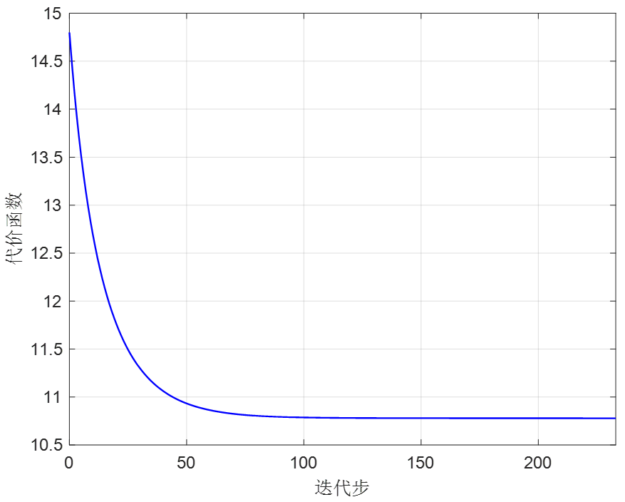
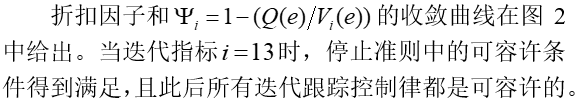
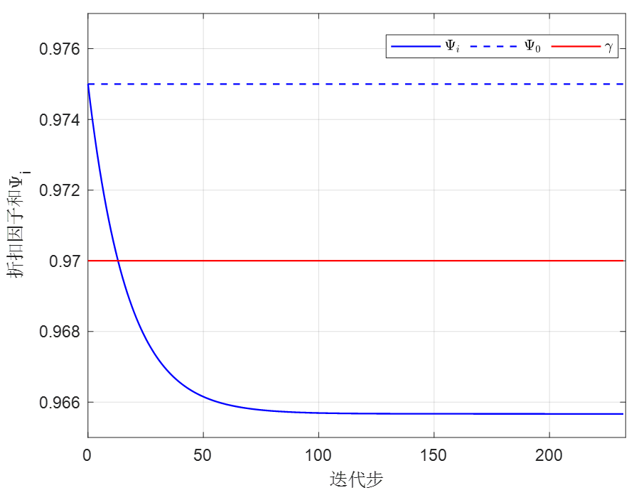
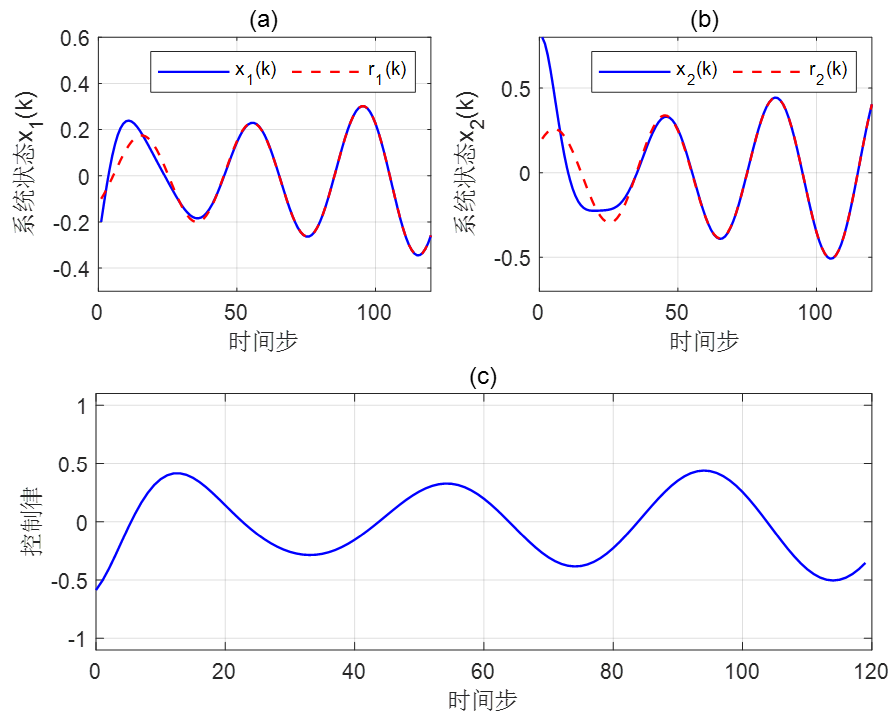
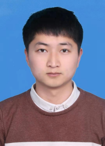
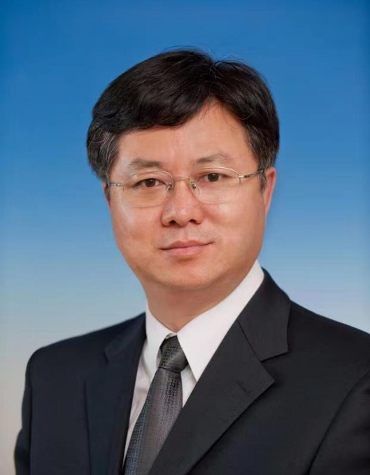

# 【最新出版】基于折扣广义值迭代的智能最优跟踪及应用验证

原创 自动化学报 自动化学报 2022-01-24 15:47 北京

> 原文地址: [https://mp.weixin.qq.com/s/EnoL3EKZmOif5i5ARYWVJg](https://mp.weixin.qq.com/s/EnoL3EKZmOif5i5ARYWVJg)

点击蓝字

关注我们

  

推荐一篇第1期最新文章，希望您能喜欢！欢迎已经优先出版的作者给小编提供资料（请您向编辑部索要推送模板aaswkfb@ia.ac.cn），及时发布在我们的公众号上宣传。

  

王鼎, 赵明明, 哈明鸣, 乔俊飞. 基于折扣广义值迭代的智能最优跟踪及应用验证. 自动化学报, 2022, 48(1): 182−193

(Wang Ding, Zhao Ming-Ming, Ha Ming-Ming, Qiao Jun-Fei. Intelligent optimal tracking with application verifications via discounted generalized value iteration. Acta Automatica Sinica, 2022, 48(1): 182−193)

http://www.aas.net.cn/cn/article/doi/10.16383/j.aas.c210658?viewType=HTML

  

设计一种基于折扣广义值迭代的智能算法，用于解决一类复杂非线性系统的最优跟踪控制问题。通过选取合适的初始值，值迭代过程中的代价函数将以单调递减的形式收敛到最优代价函数。基于单调递减的值迭代算法，在不同折扣因子的作用下，讨论了迭代跟踪控制律的可容许性和误差系统的渐近稳定性。为了促进算法的实现，建立一个数据驱动的模型网络用于学习系统动态信息，同时构造评判网络和执行网络用于近似迭代代价函数和计算迭代跟踪控制律。值得注意的是，我们提出了新颖的停止准则来保证迭代跟踪控制律的有效性。这种停止准则包含两个条件，一个条件用来保证迭代跟踪控制律的可用性，这有利于评估误差系统的渐近稳定性；而另一个条件用来确保跟踪控制律的近似最优性。最后，通过包括污水处理在内的两个应用实例验证了本文提出的近似最优跟踪控制方法的可行性和有效性。

  

针对未知非仿射系统的跟踪控制问题，单调递减的代价函数收敛过程如图1所示。当迭代指标时，条件成立，停止准则中的近似最优性条件得到满足。

  

_图1  代价函数收敛过程_

  

  

_图2  折扣因子和_Ψi_曲线_

  

在运行120个时间步之后，系统状态、参考轨迹和控制律曲线如图3所示。在近似最优跟踪控制策略下，原始系统状态能够快速地跟踪上参考轨迹。

  

_图3  系统状态、参考轨迹和控制律曲线_

  

**作者简介**

**王  鼎**

北京工业大学信息学部教授. 2009年获得东北大学理学硕士学位, 2012年获得中国科学院自动化研究所工学博士学位. 主要研究方向为强化学习与智能控制. 本文通信作者.

E-mail: dingwang@bjut.edu.cn

**赵明明**

北京工业大学硕士研究生. 主要研究方向为强化学习和智能控制.

E-mail: zhaomm@emails.bjut.edu.cn

**哈明鸣**

北京科技大学博士研究生. 2016年获得北京科技大学学士学位, 2019年获得北京科技大学硕士学位. 主要研究方向为最优控制, 自适应动态规划, 强化学习.

E-mail: hamingming\_0705@foxmail.com

**乔俊飞**

北京工业大学信息学部教授. 主要研究方向为污水处理过程智能控制, 神经网络结构设计与优化.

E-mail: adqiao@bjut.edu.cn

  

**期刊动态**

[《自动化学报》致谢审稿人](http://mp.weixin.qq.com/s?__biz=MzAwMzAzMDgxOA==&mid=2651072581&idx=1&sn=0015285a83a86dcc192171d7086a4411&chksm=8131e208b6466b1edc1882937de90bdd6ad081ae2635c48648c488d0e61c3adba04bd21f5e50&scene=21#wechat_redirect)

[自动化学报多篇论文入选中国百篇最具影响国内论文和中国精品期刊顶尖论文](http://mp.weixin.qq.com/s?__biz=MzI2NjA3MzM5MA==&mid=2649961152&idx=1&sn=4a5e9e4b84879f4cde4e13a0ef97272c&chksm=f2943681c5e3bf97d7770c9623dac869b283b3ea83f3d320017974033e361d8b999134a8bdff&scene=21#wechat_redirect)

[自动化学报各项主要指标蝉联第1，再获百种中国杰出期刊称号](http://mp.weixin.qq.com/s?__biz=MzAwMzAzMDgxOA==&mid=2651072451&idx=1&sn=4ec5101a4eef20c2fa0fe7303813f2b0&chksm=8131ed8eb6466498039e33d8fb1b621366c7fb8470e2ad9e46f875f06301ef8bc3691b903e96&scene=21#wechat_redirect)

[《自动化学报》发表文章入选第六届中国科协优秀科技论文](http://mp.weixin.qq.com/s?__biz=MzI2NjA3MzM5MA==&mid=2649960313&idx=1&sn=01b5a9defe9664ba4a0b8d7322e115d0&chksm=f2942b38c5e3a22e2c57edaa8667a27368ccfb595e6a372dfa85ff2a61329788870d77957a2f&scene=21#wechat_redirect)

[自动化学报（英文版）首届青年编委招募](http://mp.weixin.qq.com/s?__biz=MzI2NjA3MzM5MA==&mid=2649959475&idx=1&sn=e28ce2b8fa27ee4fb6a5c0c17e25dd25&chksm=f2942872c5e3a16438dbf45fd8091b643cd2bf50f0bab7092a6c5103d06cd4a16ebceb4db40a&scene=21#wechat_redirect)

[《自动化学报》9篇文章入选2020“领跑者5000”顶尖论文](http://mp.weixin.qq.com/s?__biz=MzI2NjA3MzM5MA==&mid=2649959410&idx=1&sn=e3e8ba749a1d075423a5c46328f812d8&chksm=f2942fb3c5e3a6a5beba9f59644c661a4d2ee623378551fa3a6fcfbce271868529d2cb149ff8&scene=21#wechat_redirect)

[JAS最新影响因子6.171，排名世界第7](http://mp.weixin.qq.com/s?__biz=MzI2NjA3MzM5MA==&mid=2649959382&idx=1&sn=f0ab35e9db7f66b68ccc1e4cca1b9dae&chksm=f2942f97c5e3a6813143ad6bc478369124d0ec36fea79d7af93c021b51ef225616b0ebf339bd&scene=21#wechat_redirect)

[自动化学报编委金耀初教授当选欧洲科学院院士](http://mp.weixin.qq.com/s?__biz=MzAwMzAzMDgxOA==&mid=2651071272&idx=1&sn=41781c579c3615bb9dabb0e76a7993c4&chksm=8131e965b6466073f1a2e1277370ae00938fa60eb98ab400aaaa847aba15c6b91ebe79ecedc0&scene=21#wechat_redirect)

[JAS编委韩清龙教授当选欧洲科学院院士](http://mp.weixin.qq.com/s?__biz=MzI2NjA3MzM5MA==&mid=2649959352&idx=1&sn=dc42494191ad7dcc1b5e705bb204cfeb&chksm=f2942ff9c5e3a6ef3f86e420859dd8fadb7ad3e11625cba02fecab4449d5b1f3e2511472dd55&scene=21#wechat_redirect)

[JAS副主编姜钟平教授当选欧洲科学院院士](http://mp.weixin.qq.com/s?__biz=MzAwMzAzMDgxOA==&mid=2651071275&idx=1&sn=032005e63b6626596afe850f7562fee3&chksm=8131e966b646607008f227c917a6028bc05d62d8c2d1da68b939497fb52b5fcd82d5b2f7e441&scene=21#wechat_redirect)

[JAS副主编刘德荣教授当选为欧洲科学院外籍院士](http://mp.weixin.qq.com/s?__biz=MzI2NjA3MzM5MA==&mid=2649959324&idx=1&sn=bbc81384a97a28c9df3ea612f5b666d2&chksm=f2942fddc5e3a6cb3182c229b8da44cdb07f4ecefa3a95626845625d06c7ff57217da7405b4b&scene=21#wechat_redirect)

  

**热点文章**

[《自动化学报》2021年热点文章回顾](http://mp.weixin.qq.com/s?__biz=MzAwMzAzMDgxOA==&mid=2651072577&idx=1&sn=4e6be077d7371c7d29d9a371d8defe19&chksm=8131e20cb6466b1aec2f3b8b1063d3be11725ca9a0c15785c3b42a638170e732acd0d8d345e0&scene=21#wechat_redirect)

[国家自然科学基金论文精选](http://mp.weixin.qq.com/s?__biz=MzI2NjA3MzM5MA==&mid=2649960308&idx=1&sn=1634c999f22588333537f13393403f9c&chksm=f2942b35c5e3a2232e86b51c2b7c8f37a4d3d7f858d370d76d5afd00567d7da6e9543476d120&scene=21#wechat_redirect)

[国家重点研发计划论文精选](http://mp.weixin.qq.com/s?__biz=MzI2NjA3MzM5MA==&mid=2649960255&idx=1&sn=f48435928fd924134cb72014860b9d00&chksm=f2942b7ec5e3a26869da68a1419b3b40ca1e6cb98abf2e380d78a49ffb99c85991d76cc346b0&scene=21#wechat_redirect)

[中国科学院自动化研究所高层次人才招聘启事 | 长期有效](http://mp.weixin.qq.com/s?__biz=MzI2NjA3MzM5MA==&mid=2649959451&idx=1&sn=657b7e4aeeaa88114d5189641c5409dc&chksm=f294285ac5e3a14cd230a2b9678c32ba9bf92e8ffc9d61d506c5ffea2df793456dd37c2c6fb1&scene=21#wechat_redirect)

[基于平均距离聚类的NSGA-Ⅱ](http://mp.weixin.qq.com/s?__biz=MzAwMzAzMDgxOA==&mid=2651071210&idx=1&sn=4d6b03f3de40972233111d419f661a7f&chksm=8131e8a7b64661b1424c2caf619bf0248ac2a6fc698d537144080a1fc0310efc4fdd92eade30&scene=21#wechat_redirect)

[传感器饱和的非线性网络化系统模糊H∞滤波](http://mp.weixin.qq.com/s?__biz=MzAwMzAzMDgxOA==&mid=2651071175&idx=1&sn=e78285c311fde57d52c77b70d146610f&chksm=8131e88ab646619ca999f197a1aeb6c3f04a6837f2a6df0cd45fe4439799fba5f9612ccd237b&scene=21#wechat_redirect)

[中医舌象分割技术研究进展: 方法、性能与展望](http://mp.weixin.qq.com/s?__biz=MzAwMzAzMDgxOA==&mid=2651071139&idx=1&sn=d00851cb35c6d4aff0b36a75cde68b7f&chksm=8131e8eeb64661f87053a2fabd389cfeab41d7d103502048a00b281f05cde290d27394f39543&scene=21#wechat_redirect)

[基于区块链的数字货币发展现状与展望](http://mp.weixin.qq.com/s?__biz=MzI2NjA3MzM5MA==&mid=2649958456&idx=1&sn=db1e69bbd69e864051158910b599e0a9&chksm=f2942c79c5e3a56f669395da520a1f215c6452cc8a0d40ca6e3b274b85e077c547bf4d85a8e5&scene=21#wechat_redirect)

[基于深度学习的表面缺陷检测方法综述](http://mp.weixin.qq.com/s?__biz=MzAwMzAzMDgxOA==&mid=2651070518&idx=1&sn=8097f7197598117c3b46d7d9dd984c85&chksm=8131ea7bb646636d9444a9d6f73eacacf11a22de2bc054e00941aa5bced3f7b2db0dd6326149&scene=21#wechat_redirect)

[比特驱动的瓦特变革—信息能源系统研究综述](http://mp.weixin.qq.com/s?__biz=MzAwMzAzMDgxOA==&mid=2651070474&idx=1&sn=bbfe03a0e9a8f97f46c87d75f466e7c2&chksm=8131ea47b646635104e90390e9a09f18947b3cd7d1bc9438dd4b4275f17db875abd2ab1a2849&scene=21#wechat_redirect)

[状态转移算法原理与应用](http://mp.weixin.qq.com/s?__biz=MzAwMzAzMDgxOA==&mid=2651069967&idx=1&sn=3fec83278b26be988d7a5fea928a69a9&chksm=8131d442b6465d54d02d3a0ae16b064548d496696b14906b9f6de6043645035ecd25f4f7b39b&scene=21#wechat_redirect)

[绿色能源互补智能电厂云控制系统研究](http://mp.weixin.qq.com/s?__biz=MzAwMzAzMDgxOA==&mid=2651069602&idx=1&sn=b50c1e8d5fd295dc2d98238c1d68ee42&chksm=8131d6efb6465ff9d162c0a8ff5aca0e6faa643e665e071c42484c4f1e61d951dd5851f346f1&scene=21#wechat_redirect)

[智能船舶综合能源系统及其分布式优化调度方法](http://mp.weixin.qq.com/s?__biz=MzAwMzAzMDgxOA==&mid=2651069520&idx=1&sn=8350658b7c26be6fdeab22034106ec66&chksm=8131d61db6465f0b6c2371721e55aec2e5e573eef4539d980fe768f3f0855242d0d4ff6e7d33&scene=21#wechat_redirect)

[值得收藏！SCI论文中的常用句式全总结](http://mp.weixin.qq.com/s?__biz=MzAwMzAzMDgxOA==&mid=2651069425&idx=1&sn=c945766f5d7f2ada8a217b981dcc734c&chksm=8131d1bcb64658aa80092eb53e1ead905ab02fc7a9f035e798e57d6407472ef688e8f7f0e831&scene=21#wechat_redirect)

[收藏！SCI论文经典词和常用句型汇总](http://mp.weixin.qq.com/s?__biz=MzAwMzAzMDgxOA==&mid=2651069036&idx=1&sn=961c952c84a07355dc70d4bb8291ce25&chksm=8131d021b6465937c80cf41a3118a5ad92a752cb3979f22d5964a741269a1df1987a37185a31&scene=21#wechat_redirect)

  

**期刊目录**

[2021年第12期](http://mp.weixin.qq.com/s?__biz=MzAwMzAzMDgxOA==&mid=2651072427&idx=1&sn=460b109a5bad2c51d2de41e961c04e1f&chksm=8131ede6b64664f00fed31c0dc7a90489b2744feb5c3cd0739395ab0fc69eb45eff1de434748&scene=21#wechat_redirect)

[2021年第11期](http://mp.weixin.qq.com/s?__biz=MzI2NjA3MzM5MA==&mid=2649960841&idx=1&sn=8ec7b4ca78c46b260113cfcd915605d3&chksm=f29435c8c5e3bcde9c366239407a93b36993dff64ed0e3109120c9dfe44a4a0cd0d5cf2f0098&scene=21#wechat_redirect)

[2021年第10期](http://mp.weixin.qq.com/s?__biz=MzI2NjA3MzM5MA==&mid=2649960588&idx=1&sn=9e58c5bf64a369da813c199faf7f387f&chksm=f29434cdc5e3bddbe04b9a5ffd5aafa334f03659ed3338a030c43c14f949a3bbd725315b4651&scene=21#wechat_redirect)

[2021年第09期](http://mp.weixin.qq.com/s?__biz=MzI2NjA3MzM5MA==&mid=2649960233&idx=1&sn=a1fcea45b06446be7ededa32a4e1bc32&chksm=f2942b68c5e3a27ea642bb4309323146a5370093d4d22415d5f1d391a40fc7e370df0135aa42&scene=21#wechat_redirect)

[2021年第08期](http://mp.weixin.qq.com/s?__biz=MzI2NjA3MzM5MA==&mid=2649959903&idx=1&sn=6eab97a89ffabbeffc0ff2ef715b2dd1&chksm=f294299ec5e3a0880a5a2c33475d4ebbddee6a1301e001975411aec2234ccf8f88edcadd0e5b&scene=21#wechat_redirect)

[2021年第07期](http://mp.weixin.qq.com/s?__biz=MzI2NjA3MzM5MA==&mid=2649959756&idx=1&sn=7e5985469c10d03031de1d44d2b2c258&chksm=f294290dc5e3a01b626b4300d9f444cb8de1bea7ba390f12e835b4d3373e49c1c23dd11c8959&scene=21#wechat_redirect)

[2021年第06期](http://mp.weixin.qq.com/s?__biz=MzI2NjA3MzM5MA==&mid=2649959156&idx=1&sn=5fbd7f8c73b2ec6e4c21136bff39e716&chksm=f2942eb5c5e3a7a3a94c8be799a10e43dd60f7255a10f8c850d62bd5bdada5bb7d1acc29e1a1&scene=21#wechat_redirect)

[2021年第05期](http://mp.weixin.qq.com/s?__biz=MzI2NjA3MzM5MA==&mid=2649958886&idx=1&sn=ba599bc866e3eb23b0b8de0579956258&chksm=f2942da7c5e3a4b1fd1313e90d4f72354dd0de42cee19281f5c726978a841332622a0681d32c&scene=21#wechat_redirect)

[2021年第04期](http://mp.weixin.qq.com/s?__biz=MzI2NjA3MzM5MA==&mid=2649958569&idx=1&sn=ae33a7dcd6e2d66cae59932a1e99ce5e&chksm=f2942ce8c5e3a5fe7d94f6d809ecc492e83ebe118243f871cc4d82420c403784a01db82a93cb&scene=21#wechat_redirect)

[2021年第03期](http://mp.weixin.qq.com/s?__biz=MzI2NjA3MzM5MA==&mid=2649958419&idx=1&sn=b5d00eb294aa8c61a6fe4a0da8b461b9&chksm=f2942c52c5e3a544ca32e37d63f8ca879a64018d3fa5b25abd6bde1aeb582914f16e1e11182a&scene=21#wechat_redirect)

[2021年第02期](http://mp.weixin.qq.com/s?__biz=MzI2NjA3MzM5MA==&mid=2649958305&idx=1&sn=a701b9996478d2c09078a03f5b22d524&chksm=f29423e0c5e3aaf692be51b3905e1cbf4045c6df9664ce7d13459de3c0c61aa284b13eb502b9&scene=21#wechat_redirect)

[2021年第01期](http://mp.weixin.qq.com/s?__biz=MzI2NjA3MzM5MA==&mid=2649958084&idx=1&sn=24c140a6a1957eb7f4164689ed2840a5&chksm=f2942285c5e3ab93c5ed6127ad93e76ded82ae657ca79f7ead390387fbe2a72cb6df0ec6dcd2&scene=21#wechat_redirect)

[《自动化学报》2020年全年合集](http://mp.weixin.qq.com/s?__biz=MzI2NjA3MzM5MA==&mid=2649957972&idx=1&sn=1951847aacbcb7d22bdd2a46a79af871&chksm=f2942215c5e3ab03d070d8e52b8764b38036897c97b6a26c7a1f918c806b28edbe6c0fbf7ea9&scene=21#wechat_redirect)

[2020年第10期 工业人工智能专题](http://mp.weixin.qq.com/s?__biz=MzI2NjA3MzM5MA==&mid=2649957201&idx=1&sn=ab82a767bd716ab67fdf2942500d8b61&chksm=f2942710c5e3ae06b27f9e63a5e329a1123d90b051164e6b6123c500230541b1ed12d92abbfb&scene=21#wechat_redirect)

[2020年第09期 分布式信息能源系统理论与应用专题](http://mp.weixin.qq.com/s?__biz=MzI2NjA3MzM5MA==&mid=2649956412&idx=1&sn=8ebc13d63fd333ad85dbb8b5825df248&chksm=f294247dc5e3ad6ba297857a5b957e97cf499266c50318791fa8abd9432ecf1d9c3d9b287e36&scene=21#wechat_redirect)

[2019年第12期 智能轨道交通系统专刊](http://mp.weixin.qq.com/s?__biz=MzI2NjA3MzM5MA==&mid=2649955524&idx=1&sn=a76b97bf832e984f0155acc0fb367bc7&chksm=f2941885c5e391935c353c88072e806cb0b5b9b78b1f7b23b3c6f4b8c6a2c12f72557f87b56b&scene=21#wechat_redirect)  

[2019年第01期 信息物理融合系统理论与应用专刊](http://mp.weixin.qq.com/s?__biz=MzI2NjA3MzM5MA==&mid=2649955194&idx=2&sn=fb75bc8af9672922fa20efe2d30ff6c9&chksm=f2941f3bc5e3962db43689d03a54a0e40d83cb0e69fb9c48e87c0325b5bdf1b71028ebbbba0a&scene=21#wechat_redirect)

  

  

**长按二维码｜关注我们**

**IEEE/CAA Journal of Automatica Sinica (JAS)**

**长按二维码｜关注我们**

**《自动化学报》服务号**

**长按二维码｜关注我们**

**《自动化学报》订阅号**  

  

**联系我们**

**网站:** 

http://www.aas.net.cn

http://www.ieee-jas.net

**投稿:** 

https://mc03.manuscriptcentral.com/aas-cn   

https://mc03.manuscriptcentral.com/ieee-jas 

**电话:**  010-82544653（日常咨询和稿件处理） 

           010-82544677（录用后稿件处理）

**邮箱:**  aas@ia.ac.cn（日常咨询和稿件处理）  

           aas\_editor@ia.ac.cn（录用后稿件处理）

**博客:** 

http://blog.sina.com.cn/aaseditor 

  

**↓ 点击下方 阅读原文 了解更多**