# 【精选导读】基于神经网络的对象识别与跟踪

原创 JAS 自动化学报 2022-01-28 16:15 北京

> 原文地址: [https://mp.weixin.qq.com/s/x\_sEHH8exZXRutsEZOrOeQ](https://mp.weixin.qq.com/s/x_sEHH8exZXRutsEZOrOeQ)

  

  

**本期推荐4篇基于****神经网络的对象识别与跟踪****相关好文**

T. H. Zhang, J. H. Xiao, L. Li, C. Wang, and G. M. Xie, **"Toward Coordination Control of Multiple Fish-Like Robots: Real-Time Vision-Based Pose Estimation and Tracking via Deep Neural Networks,"** _IEEE/CAA J. Autom. Sinica_, vol. 8, no. 12, pp. 1964-1976, Dec. 2021.

  

  

  

  

  

I. Ahmed, S. Din, G. Jeon, F. Piccialli, and G. Fortino, **"Towards Collaborative Robotics in Top View Surveillance: A Framework for Multiple Object Tracking by Detection Using Deep Learning,"** _IEEE/CAA J. Autom. Sinica_, vol. 8, no. 7, pp. 1253-1270, July 2021.

  

  

  

  

  

A. A. M. Muzahid, W. G. Wan, F. Sohel, L. Y. Wu, and L. Hou, **"CurveNet: Curvature-Based Multitask Learning Deep Networks for 3D Object Recognition,"** _IEEE/CAA J. Autom. Sinica_, vol. 8, no.6, pp. 1177-1187, June 2021.

  

  

  

  

  

W. J. Zhang, J. C. Wang, and F. P. Lan, **"Dynamic Hand Gesture Recognition Based on Short-Term Sampling Neural Networks,"** _IEEE/CAA J. Autom. Sinica_, vol. 8, no. 1, pp. 110-120, Jan. 2021.

  

  

  

  

  

  

  

  

**面向多个仿鱼机器人的协调控制：基于深度神经网络的实时视觉姿态估计与跟踪**

  

  

**0****1**

研究背景

在过去的十年中，仿鱼机器人作为水下仿生机器人的代表，日渐受到工程师和生物学家的关注。实时鲁棒跟踪多个仿鱼机器人的姿态是一个重点的研究课题。多个体姿态跟踪是个体运动评价、群体运动分析和实时反馈运动控制的基础。然而，对仿鱼机器人的多个体姿态跟踪具有极大的挑战性。一方面，水下机器人周围的水动力学会给机器人的运动带来很大的不确定性。因此，与地面移动机器人相比，姿态估计和跟踪面临着特殊的困难。另一方面，与传统的水下机器人不同，鱼形机器人通常有一个灵活的多关节可变形身体，可以产生生物启发的游泳模式。因此，由于游动过程中的身体变形，再加上水动力因素，使得多个仿鱼机器人在接近时难以识别和跟踪。

针对该问题，IMU和GPS等一些基于非视觉传感器的姿态测量方法不再适用。而基于有标记的视觉系统和无标记的视觉系统因其方便、准确、性能稳定等优点被广泛使用。基于标记的系统通过检测标记来估计和跟踪姿态，但是该方法在单个机器人的情况下精确度较高。无标记系统使用人工经验来处理鱼状目标的姿态估计，但该方法忽略了身体的变形，而这恰好是仿鱼机器人的关键特征。为满足研究多个仿鱼机器人协调控制的需求，未来需要对多类鱼机器人的全局视觉系统进行升级。随着深度学习在计算机视觉方面取得成功，多机器人的视觉系统也得到了发展，例如OpenPose、DeeperCut、DeepLabCut和LEAP。这些基于深度神经网络的进一步刺激了多个多关节仿鱼机器人的无标记姿态跟踪的研究。但是对于协调控制的需要，多个多关节仿鱼机器人的实时精确姿态跟踪仍然是一个挑战。

**0****2**

成果介绍

为了应对不均匀光照、水波纹和碰撞等具有挑战性的极端情况，从而推进仿鱼机器人的研究，北京大学智能仿生设计实验室谢广明教授团队提出了一种新的基于深度神经网络的全局视觉无标记的方法，用于多关节仿鱼机器人的实时精确平面姿态估计和跟踪，研究成果**“Toward Coordination Control of Multiple Fish-Like Robots: Real-Time Vision-Based Pose Estimation and Tracking via Deep Neural Networks”**发表于IEEE/CAA Journal of Automatica Sincia 2021年第12期。DOI: 10.1109/JAS.2021.1004228

此算法被称为TAB-IOL。首先，在姿态估计方面，他们设计了一种新的基于CNN的网络结构，将自顶向下和自下向上的方法结合起来，称为TAB。TAB同时输出目标区域和头部、身体、尾巴等关键点的像素信息，利用关键点像素信息纠正了自顶向下方法在一个区域内存在多个个体的局限性。反过来，目标区域为自下向上的方法提供全局的个体信息。TAB利用了自顶向下和自下向上的方法，在精确度和速度上具有优势。其次，对于姿态跟踪，他们使用LSTM构建了一个新的网络，该网络结合了每种关键点的独立运动特性和关键点之间的整体约束，称为IOL。这样的跟踪网络首先分别提取每种关键点的运动特征，然后融合所有单独的特征，以考虑关键点之间的运动约束对精确跟踪性能的影响。

实验中分别对姿态评估和姿态跟踪进行了消融实验，具体的结果如表1和表2所示。表1是对姿态评估进行对比实验，可发现在同一个Backbone下，TAB算法在精度和训练速度上都优于典型的姿态评估方法。表2是对姿态预测进行了对比实验，可发现IOL在兼顾独立运动特性和整体约束的同时，大大提高了精度，也保持了较高的处理速度。为了量化该系统的性能，作者选择了具有代表性的基于网络的动物姿态跟踪系统作为基线，视频测试集上的姿态估计结果如表3所示，结果表明，与现有的基于网络的动物姿态跟踪系统相比，该系统在精度和速度上都有优势。图1分别显示了该方法和模板匹配方法下五个仿鱼机器人的跟踪轨迹。相比之下，该方法比模板匹配方法更准确，跟踪失败更少，身份交换更少。

  

表1 多关节仿鱼机器人图像测试集的姿态估计消融研究结果

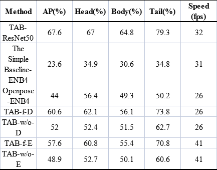

表2 多关节仿鱼机器人视频测试集的姿态跟踪消融研究结果

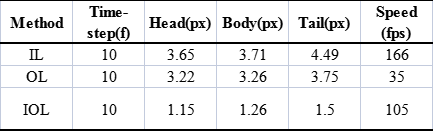

表3 多关节仿鱼机器人视频测试集的姿态估计研究结果

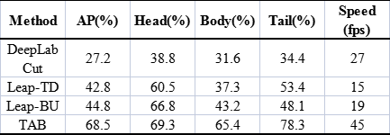

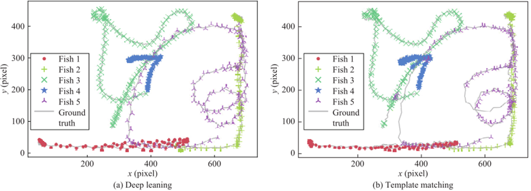

(a) 本文所提方法       (b) 模板匹配方法

图1 5个仿鱼机器人的轨迹跟踪

**0****3**

作者及团队

**张天昊** 北京大学博士研究生，2017年在山东大学控制科学与工程学院获得工学学士学位，目前在北京大学工学院智能仿生设计实验室攻读博士学位。研究兴趣包括图像处理、多智能体强化学习、仿生机器人等。

**Jiuhong Xiao** 美国纽约大学Courant Institute of Mathematical Sciences硕士研究生。2019年在北京科技大学获工学学士学位。2018年-2020年在北京大学工学院交换学习。研究方向主要为计算机视觉、姿态估计和目标检测。

**Liang Li** 德国MaxPlanck Institute of Animal Behavior博士后。2017年在北京大学获一般力学及力学基础专业博士学位。研究兴趣包括生物启发机器人、混合动物-机器人系统的集体行为、鱼群的生物流体动力学和机器人的群体智能。

**王晨** 北京大学软件工程国家工程研究中心助理研究员，2007年-2014年分别获得北京大学一般力学与力学基础理学博士学位和荷兰格罗宁根大学系统与控制博士学位。2014年-2018年在北京大学从事博士后研究。主要从事水下仿生机器人集群智能协同控制理论与技术的研究，发表SCI或EI收录学术论文50余篇，包括系统控制领域顶级期刊IEEE Transactions on Automatic Control、Automatica、机器人领域顶级期刊IEEE Transactions on Robotics，以及相关领域权威国际会议ICML、IEEE CDC、ICRA、IROS、ECCV、IFAC等。Google学术引用680余次。

**谢广明** 北京大学教授，博导，清华大学控制理论与控制工程博士。2001年-2003年北京大学力学系博士后，曾赴加州大学河滨分校访问教授。主持包括重点项目在内的多项国家自然科学基金项目。获得国家自然科学奖二等奖、教育部自然科学奖一等奖等多项奖励。先后担任中国自动化学会机器人竞赛工作委员会副主任，中国系统仿真学会智能物联系统建模与仿真专业委员会委员、中国生产力促进协会服务机器人专业委员会委员等，期刊Mathematical Problems In Engineering主编，Scientific Reports等多个期刊编委。

**北京大学智能仿生设计实验室（Intelligent Biomimetic Design Lab）**立足于智能仿生装备与系统的设计、研发与实际应用，实验室对自然界生物个体机理和机制进行探究，开展生物个体功能的仿生创新，模仿生物的运动、感知、定位、通信等能力，并高度融合人工智能、机器人与创新设计。特别地，实验室还对自然界广泛存在的集群行为进行探究，模拟自组织的群体协作能力并应用到大规模的人工群体中去。实验室积极响应新一代人工智能发展规划和军民融合的国家战略发展需求，将机器人与人工智能技术相结合；也传承并发扬着北京大学“常为新”的精神。代表性研究成果：1）研发出可以实现行进后退、左右转弯以及灵活翻滚等三维运动的仿箱鲀机器鱼。2）设计和开发的多机器鱼协作控制实时仿真系统，是首个以多机器鱼协作为仿真对象的软件系统。3）谢广明教授创立了国际水中机器人大赛，这是首个由中国人创立的国际性机器人赛事。4）2015年，凭借“智能仿生机器人与多机器人协作的关键技术研究”，谢广明教授获得吴文俊人工智能科学技术奖创新奖二等奖；同年获得教育部自然科学奖一等奖，题目是网络化动态系统的分析与控制，在此奖项的基础上，2017年该项目斩获国家自然科学奖二等奖。

  

  

**面向俯视监控中的协作机器人：基于深度学习的多目标检测跟踪框架**

  

  

**0****1**

研究背景

协作机器人是学术界和工业界的热门研究课题之一，并成为工业、制造业、运输业、家庭任务处理、医疗保健服务等不同领域的关键技术，其中最突出的是智能视频监控。大多数监控系统由一个集中监控结构组成。然而，监控多个视频流对于操作员来说可能是一项繁重且乏味的任务。因此，需要使用协作机器人技术提供智能自动化监控系统，该系统可以监控和分析多个视频流。基于协作机器人的监视系统主要通过使用智能相机设备和视觉处理技术来提供有关特定环境或场景中不同活动的有用信息，它提供的信息可能有助于行为分析、事件和活动分析、拥挤环境中的人员管理和保护、运动模式检测和目标跟踪。同样，它在现实生活的应用中也很重要的意义，例如安全分析、自动驾驶车辆、人脸识别、人机交互机器人和定位和导航。对此，它可能会受到多种因素的影响，包括目标外观的变化（大小、身体方向、姿势）、不同的背景、照明条件、杂乱的场景和相机视角、运动的突然变化以及目标的密切交互。

针对此问题，大多数的方法主要基于传统的泛化模型、特征模型、深度模型以及不同的机器学习分类器进行展开研究。而深度学习模型的进展使得目标检测以及目标跟踪在计算速度和准确性方面更加鲁棒和高效。这些模型的主要优点是自动选择目标的最显着特征。一般而言，基于特征或基于深度学习的技术通常是为正常、水平或正面视图目标检测和跟踪而开发的，并未使用协作机器人。因此，研究人员开发了不同的目标跟踪方法，这些方法在目标检测和跟踪上更具有鲁棒性，但仍然遭受目标遮挡的困扰。相比之下，在正面视图中，如果捕捉到类似的目标并从俯视角度观察，则可以减少遮挡问题。同样，使用俯视视图提供更多的场景可见性，并且目标对相机更可见。

**0****2**

成果介绍

为了进一步证明俯视监控的重要性，Gwanggil Jeon教授等提出了一个协作机器人框架，它可以协助检测和跟踪俯视监视中的多个目标。研究成果**"Towards Collaborative Robotics in Top View Surveillance: A Framework for Multiple Object Tracking by Detection Using Deep Learning"**发表于IEEE/CAA Journal of Automatica Sincia 2021年第7期。DOI:10.1109/JAS.2020.1003453

该框架由嵌入视觉处理单元的智能机器人相机组成。引入了俯视图协同监视框架，可以帮助操作者完成多个目标跟踪和检测任务。该结构由一个智能机器人摄像头和一个视觉处理单元组成，该单元使用基于深度学习的预训练目标检测模型。现有的预训练深度学习模型SSD和YOLO已被用于目标检测和定位。检测模型进一步与不同的跟踪算法相结合，包括GOTURN、MEDIAFLOW、TLD、KCF、MIL和BOOSTING。这些算法以及检测模型有助于跟踪和预测检测到的目标的轨迹。采用预训练模型；因此，还通过在各种俯视图数据集序列上测试模型来研究泛化性能。

在实验中，不同的参数用于评估不同的跟踪算法。实验将参数进一步分为以下两类：a) 假检测率(False detection rate, FDR)和真检测率(True detection rate, TDR): 这两个参数用于评估基于深度学习的多顶视图目标检测模型；b) 跟踪精度(Tracking accuracy, TA)用于评价不同的跟踪算法。1) 检测结果：详见表1，可观察到YOLO和SSD模型都有良好的效果。对于俯视视图，两种模型对多目标检测都表现良好。但是，与YOLO模型相比，SSD的整体性能还是略胜一筹。但是相对于速度来说，YOLO性能更好。对于包含人物样本视频帧，YOLO模型实现了92%的TDR，而对于其他目标样本，TDR范围为90%到92%。同样，对于SSD模型，多个俯视视图目标的TDR范围为90%到93%。2) 跟踪结果：描绘了六种不同跟踪算法的性能测量，用于针对每个目标的对称和非对称视图中的室内和室外俯视视图场景。跟踪算法的准确性会随着不同的目标而变化。它表明改变相机视角会明显影响物体的形状和外观。不同跟踪算法也在表2和3中给出。使用YOLO模型，跟踪算法对人的跟踪准确度范围为90%到93%，而SSD模型对人的跟踪准确度范围为90%到94%。与其他跟踪算法相比，GOTURN的性能非常出色，跟踪准确率为94%。

  

表1 使用深度学习模型的俯视图多目标检测结果

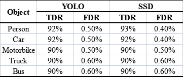

表2 使用YOLO检测模型的不同目标跟踪算法结果

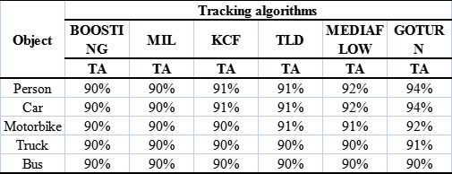

表3 基于SSD检测模型的不同目标跟踪算法结果

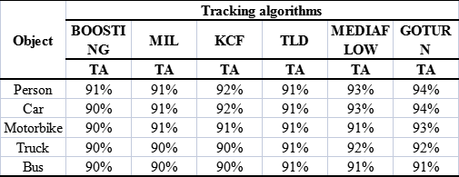

**0****3**

作者及团队

**Imran Ahmed** 巴基斯坦Institute of Management Sciences助理教授，获英国南安普顿大学计算机科学专业博士学位。研究方向包括深度学习、机器学习、数据科学、计算机视觉、特征提取、数字图像和信号处理、医学图像处理、生物度量学、模式识别和数据挖掘。曾担任IEEE Industrial Electronics等期刊审稿人。

**Sadia Din** 韩国Yeungnam University助理教授。2020年获得韩国Kyungpook National University博士学位，同年3月-8月在该校从事博士后研究。研究方向主要包括大数据、5G、物联网和数据科学。曾担任2017年在新加坡举行的IEEE LCN会议主席、Wiley期刊客座编辑等。

**Gwanggil Jeon** 西安电子科技大学和韩国Incheon National University教授，四川大学、新疆大学、西班牙庞培法布拉大学、泰国拉甲邦国王技术学院和法国勃艮第大学的客座教授。2008年获得韩国Hanyang University电子与计算机工程系博士学位。2009年9月-2011年8月在加拿大渥太华大学信息技术与工程学院从事博士后研究。2011年9月-2012年2月在日本新泻大学科学技术研究科担任助理教授。Sustainable Cities and Society、IEEE Access、Real-Time Image Processing、Journal of System Architecture和Remote Sensing的Associate Ediror；2007年IEEE Chester Sall奖和2008年ETRI期刊论文奖获得者。

**Francesco Picciall****i** 意大利University of Naples Federico II (UNINA)数学与应用学系计算机科学助理教授。在该校获计算机科学博士学位。他是M.O.D.A.L.研究小组的创始人和科学总监，该研究小组致力于数据科学和机器学习领域及其新兴应用领域的新方法、应用和服务前沿。在国际会议和顶级期刊(IEEE，Springer，ACM，Elsevier)发表论文90余篇。研究方向主要为机器学习、物联网等。

**Giancarlo Fortino** 意大利University of Calabria (Unical)教授。于2000年获得Unical计算机工程博士学位。现为武汉科技大学、华中农业大学特聘教授、ICAR-CNR研究所高级研究员、SPEME实验室主任等。研究兴趣包括基于代理的计算、无线传感网络和物联网。发表论文450余篇，组织国际会议100余次。IEEE人机系统系列丛书、IEEE THMS、IEEE IoTJ、IEEE SJ、IEEE SMCM等(创办)系列编辑，IEEE SMCS BoG和IEEE Press BoG成员、IEEE SMCS意大利分会主席。

**韩国仁川大学嵌入式系统工程系**成立于2003年，专注于智能系统，包括自动驾驶汽车和无人机，学习系统分析和设计、数据结构、处理器、数字系统和通信系统、操作系统、嵌入式软件设计、传感器和执行器、嵌入式数据库管理系统、信号处理等。

  

  

**CurveNet：用于3D对象识别的基于曲率的多任务学习深度网络**

  

**0****1**

研究背景

在计算机视觉领域，3D物体识别是许多现实世界应用中最重要的任务之一，然而与使用深度学习方法的2D图像分析取得的进展相比，理解三维物体仍然是现代计算机视觉研究的一个开放性研究问题。三维空间中的真实对象提供了更详细的信息。随着低成本3D采集设备的出现，捕获3D对象变得更加容易。3D模型公共存储库的兴起也引起了人们对计算机视觉研究的关注，例如3D对象识别、重建、语义分割和检索。

基于卷积神经网络(CNN)的3D对象识别系统取得了相当大的进步，但3D CNN在识别3D对象方面不如2D CNN成功，尤其是在对象标签预测方面。这背后有几个原因，例如，由于其复杂的几何结构、相对较小的训练数据库以及3D CNN所需的高计算成本，选择3D对象的输入特征至关重要。3D表示是保留3D对象内在特征的唯一方法；因此，需要探索3D对象和高级神经网络的新特征来改进3D视觉任务。基于人工智能的计算机视觉系统是使用先进的机器学习(ML)算法（例如深度学习）开发的。此外，CNN的对象分类精度也受到输入特征的高度影响。

**0****2**

成果介绍

为了提升3D对象识别的准确率，上海大学通信与信息工程学院博士研究生A. A. M. Muzahid和万旺根教授等提出了用于3D对象识别的基于曲率的多任务学习深度网络（CurveNet），研究成果**“CurveNet: Curvature-Based Multitask Learning Deep Networks for 3D Object Recognition”** 发表于IEEE/CAA Journal of Automatica Sinica 2021年第6期。DOI:10.1109/JAS.2020.1003324

该框架采用3D CAD模型的主曲率方向来表示几何特征作为CurveNet的输入，曲率方向结合了3D对象的复杂表面信息，有助于对象识别生成更精确和有辨别力的特征。同时考虑了多任务（标签和姿势）和多尺度学习（在初始模块中）策略，应用网络融合和数据增强方法来提高识别率。

实验在ModelNet40数据集上进行，比较了分别来自体素的表面边界信息和曲率信息来评估模型的性能，如表1所示，归一化的最大曲率方向向量显示出优于体素的分类精度，与使用相同网络的表面边界信息相比，CurveNet框架将分类精度提高1.2%。性能同时优于采用最先进的体积方法3D ShapeNet和VoxNet。这是因为CurveNet框架分别使用曲率信息作为输入特征和通过添加姿势分类进行辅助学习。曲率为CNN提供了可观的深度和感知特征，辅助姿态学习有助于提高目标分类精度，此外，投票方法是提高分类器性能的另一种常用方法。表2给出了姿势学习和投票方法对使用CurveNet提高分类精度的影响。在实验过程中发现，当两个类别之间相关性较高时或导致准确率略有偏差，实验结果如图1所示。

  

表1 CurveNet与ModelNet40分类准确度的比较

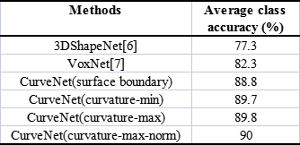

表2 姿势分类和投票方法对ModelNet40上对象标签分类的影响

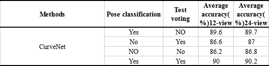

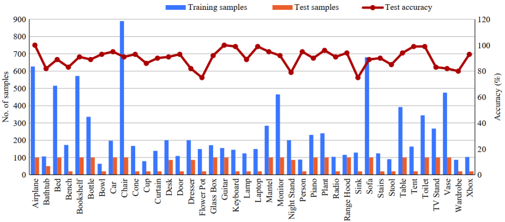

图1 ModelNet40数据集上每类的分类精度

**0****3**

作者及团队

**A. A. M. Muzahid** 上海大学博士研究生。2016年在重庆邮电大学获得硕士学位。目前是上海大学智慧城市研究院成员，领导“计算机视觉与3D虚拟现实”研究团队。研究兴趣包括增强现实、虚拟现实和计算机图形学。

**万旺根** 上海大学通信与信息工程学院教授，博导。1992年在西安电子科技大学获得博士学位，1993年-1995年在西安交通大学信息与控制工程系从事博士后研究。研究兴趣包括计算机图形学、计算机视觉、信号处理和数据挖掘。在国际著名期刊及会议发表学术论文130多篇（其中SCI/EI检索50余篇）；申请和获得专利及软件知识产权10项，出版专著1部。获1996年上海市“启明星”学者称号、1997年上海市高校优秀青年教师称号、1998年上海市“曙光”学者、2000年国家教育部骨干教师称号。担任IEEE CIS（Computational Intelligent Society）上海分会副主席、IET上海分会副主席、中国计算机学会嵌入式专业委员会委员、中国图象图形学学会虚拟现实专业委员会委员。至今已承担或参与各类科研项目15余项。

**Ferdous Sohel** 澳大利亚Murdoch University副教授。在澳大利亚Murdoch University获得博士学位。研究兴趣包括计算机视觉、机器学习、模式识别和数字农业。澳大利亚研究委员会资助的Discovery Early Career Research Award获得者，IEEE Transactions on Multimedia和IEEE Signal Processing Letters的Associate Editor，澳大利亚计算机学会会员、IEEE高级会员。

**Lianyao Wu** 上海大学硕士研究生，上海大学智慧城市研究院成员。2017年在上海大学通信与信息工程学院通信工程专业获学士学位。研究兴趣包括增强现实、虚拟现实和计算机图形学。

**Li Hou** 2017年在上海大学通信与信息系统专业获博士学位。研究兴趣包括计算机视觉、机器学习、视频/图像处理。

**上海大学通信与信息工程学院**是通信、电子、信息领域人才培养和科学研究的重要基地之一**，**由通信工程系、电子信息工程系、上海大学光纤研究所和上海电子物理研究所组成。学院现有教职工172名，其中正高级职称教师56人（中国科学院院士1人、IEEE Fellow2人、国家杰青1人、国家优青3人），拥有4个本科专业、4个学术硕士点、1个专业硕士点、两个一级博士点，设有信息与通信工程和电子科学与技术两个博士后流动站，还拥有上海市特种光纤与光接入网重点实验室、两个卓越工程师教师实习培训基地、三个“国家级工程实践教育中心”。

  

  

**基于短期采样神经网络的动态手势识别**

  

**0****1**

研究背景

手势是人机交互的自然方式，并被广泛的用于代替口语进行交流，如：美国手语是一种基于手势的发达肢体语言。而随着信息技术和计算机科学的飞速发展，非接触式人机交互一直是研究热点，手势识别作为其中重要的一部分也成为研究热点。目前手势识别技术按照输入设备可以分为两类：基于非视觉的和基于视觉的。基于非视觉的通常通过佩戴一些光学或机械传感器将手部运动转化为电信号，但当手部处于禁止状态时不会产生任何信号。而基于视觉的手势识别方法使用单个或多个摄像头或精确的身体运动传感器能够识别禁止和动态状态。

然而，基于视觉的手势识别有着两大难点：1）如何有效地从视频输入中获取空间和时间信息；2）数据集限制问题；因此一种能够有效解决上述问题的手势识别方法十分必要。

**0****2**

成果介绍

为了改善有效从视频输入获取空间信息、时间信息的效果处理数据集限制问题。美国蒙茅斯大学Jiacun Wang教授等提出了一种短期采样神经网络框架（STSSN）和新颖的数据集增强方法，研究成果**“Dynamic Hand Gesture Recognition Based on Short-Term Sampling Neural Networks”** 发表于IEEE/CAA Journal of Automatica Sinica 2021年第1期。DOI: 10.1109/JAS.2020.1003465

该框架首先将RGB视频及其光流分别划分为固定数量的视频帧组。其次，将RGB帧组和相应光流组的两个样本融合为一个样本。然后，通过ConvNet从这些代表性样本中捕获短期空间信息和时间信息。之后，将从ConvNet中学习到的特征输入到LSTM中，以学习远程特征。最后，LSTM根据每个LSTM组件学习到的特征进行手势分类。数据集增强方法通过随机距离缩小原始视频来生成“缩小”数据集。它不仅提供了更多的训练数据样本，而且有助于验证训练模型的鲁棒性。此外，每组中的随机采样和在RGB帧上叠加光流帧也能引入数据多样性，因为来自不同组的不同采样代表可以形成许多不同的输入组合。

在实验过程中，为了解决数据集限制问题，通过“缩放”来构建增强数据集，以防止模型过拟合，提高训练模型的鲁棒性，如图1所示。合适的视频帧组对于识别精度至关重要。因此，如图2所示，分别在原始数据集和增强数据集中将视频划分为若干组，并计算每组的分类精度以选择最佳分组。由实验结果可知，在两个数据集中，最优组数为9，且增强数据集具有更好的鲁棒性和实用性。

  

(a) 原始帧

(b) 缩小帧

图1 原始数据集和增强数据集的对比

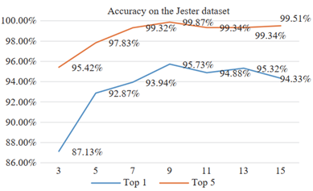

(a) 具有不同组号的Jester数据集的验证集上的结果

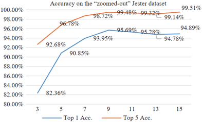

(b)具有不同组号的增强Jester数据集的验证集上的结果

图2

**0****3**

作者及团队

**Wenjin Zhang** 美国蒙茅斯大学兼职教授。2020年获蒙茅斯大学软件工程硕士学位。研究兴趣包括机器学习、深度学习和计算机视觉。

**Jiacun Wang** 美国蒙茅斯大学教授。1991年在南京理工大学计算机工程专业获得博士学位。研究兴趣包括软件工程、离散事件系统、无线网络、实时分布式系统等。在国际著名期刊及会议发表学术论文90多篇，曾担任多个国际会议主席、委员会成员等。

**Fangping Lan** 美国蒙茅斯大学硕士研究生。2019年9月-2020年5月在蒙茅斯大学担任研究助理。研究兴趣包括机器学习和深度学习。

**美国蒙茅斯大学计算机科学与软件工程系**致力于计算机科学、软件工程、信息系统和信息技术领域，包括人工智能、数据挖掘、计算社会科学、网络、数据库、信息检索、智能信息系统、软件需求、软件架构与设计、软件过程建模、实时分布式系统、工作流管理系统等。

**#完整PDF获取**

  

  

**0****1**

**邀您入群**

邀您加入“JAS&自动化学报读者服务交流”微信群，获取更多资源资讯！（识别下方二维码入群）

**0****2**

**留言给我们**

后台留言留下您的邮箱，小编发给您~

**热**

**点**

**文**

**章**

[》](http://mp.weixin.qq.com/s?__biz=MzIxMjA5Njg2Nw==&mid=2649061555&idx=1&sn=cc6073b0fd2a12cc752c197d33dbc725&chksm=8f5a9abfb82d13a95242e0ccbd19943585c49800234990d3821f1efc3df36f0bf41503a17c0e&scene=21#wechat_redirect)[精选导读：抗干扰卡尔曼滤波及其应用](http://mp.weixin.qq.com/s?__biz=MzIxMjA5Njg2Nw==&mid=2649061555&idx=1&sn=cc6073b0fd2a12cc752c197d33dbc725&chksm=8f5a9abfb82d13a95242e0ccbd19943585c49800234990d3821f1efc3df36f0bf41503a17c0e&scene=21#wechat_redirect)

[》](http://mp.weixin.qq.com/s?__biz=MzIxMjA5Njg2Nw==&mid=2649061532&idx=1&sn=6952bfa0615113dcc0bdc0e33f517db1&chksm=8f5a9a90b82d1386d4d2e8aa0795c31800ceba52e01aaff94196acd06ec68deb31b3f77cd83f&scene=21#wechat_redirect)[JAS多名作者入选科睿唯安2021年度高被引科学家](http://mp.weixin.qq.com/s?__biz=MzIxMjA5Njg2Nw==&mid=2649061532&idx=1&sn=6952bfa0615113dcc0bdc0e33f517db1&chksm=8f5a9a90b82d1386d4d2e8aa0795c31800ceba52e01aaff94196acd06ec68deb31b3f77cd83f&scene=21#wechat_redirect)

[》](http://mp.weixin.qq.com/s?__biz=MzIxMjA5Njg2Nw==&mid=2649061537&idx=1&sn=9989a4d8322ee93ea6596d0af67bf38b&chksm=8f5a9aadb82d13bbc675960ee954f5971dbb8a49a43e0d60142356aa600530a8c97c7f53a47c&scene=21#wechat_redirect)[2021年度维纳综述奖获奖名单](http://mp.weixin.qq.com/s?__biz=MzIxMjA5Njg2Nw==&mid=2649061537&idx=1&sn=9989a4d8322ee93ea6596d0af67bf38b&chksm=8f5a9aadb82d13bbc675960ee954f5971dbb8a49a43e0d60142356aa600530a8c97c7f53a47c&scene=21#wechat_redirect)

[》](http://mp.weixin.qq.com/s?__biz=MzIxMjA5Njg2Nw==&mid=2649061458&idx=1&sn=e1475e8916b2818e64703428c34fe9f2&chksm=8f5a9a5eb82d134824c9530c3dda9c50504086535c9ce70c48723da46fa22e7be9643149e8ca&scene=21#wechat_redirect)[精选 ‖ 国家自然科学基金资助论文](http://mp.weixin.qq.com/s?__biz=MzIxMjA5Njg2Nw==&mid=2649061458&idx=1&sn=e1475e8916b2818e64703428c34fe9f2&chksm=8f5a9a5eb82d134824c9530c3dda9c50504086535c9ce70c48723da46fa22e7be9643149e8ca&scene=21#wechat_redirect)

[》](http://mp.weixin.qq.com/s?__biz=MzIxMjA5Njg2Nw==&mid=2649061380&idx=1&sn=f3c9703ab640d68ffe6f76a3d0a636c4&chksm=8f5a9a08b82d131eaab0000a7d72b9b7bd0b94d0eeed8f7a068c7f0675acc0fac2d8d1ddda34&scene=21#wechat_redirect)[欧洲科学院院士王子栋教授：医疗保健中的推荐系统](http://mp.weixin.qq.com/s?__biz=MzIxMjA5Njg2Nw==&mid=2649061380&idx=1&sn=f3c9703ab640d68ffe6f76a3d0a636c4&chksm=8f5a9a08b82d131eaab0000a7d72b9b7bd0b94d0eeed8f7a068c7f0675acc0fac2d8d1ddda34&scene=21#wechat_redirect)  

[》](http://mp.weixin.qq.com/s?__biz=MzIxMjA5Njg2Nw==&mid=2649061474&idx=1&sn=7350d57ffa14817c1b89afde26e71e89&chksm=8f5a9a6eb82d13787afd0eb8e6e3967ac15671de7acecf12ff0145add9f160840f4508d8ace0&scene=21#wechat_redirect)[欧洲科学院院士韩清龙教授等：基于深度学习的CPS网络攻击检测](http://mp.weixin.qq.com/s?__biz=MzIxMjA5Njg2Nw==&mid=2649061474&idx=1&sn=7350d57ffa14817c1b89afde26e71e89&chksm=8f5a9a6eb82d13787afd0eb8e6e3967ac15671de7acecf12ff0145add9f160840f4508d8ace0&scene=21#wechat_redirect)

[》](http://mp.weixin.qq.com/s?__biz=MzIxMjA5Njg2Nw==&mid=2649060659&idx=1&sn=a94a4488ff5ccc1ae810be6f0be92b8e&chksm=8f5a973fb82d1e29ccf2df6ae58b76e5b99ad2f924aca3345d4ca2b2fa53a2d69278d1a3c0bd&scene=21#wechat_redirect)[美国工程院院士Tamer Basar: 遥感系统数据传输规划与解码估算策略研究](http://mp.weixin.qq.com/s?__biz=MzIxMjA5Njg2Nw==&mid=2649059880&idx=1&sn=ddf91bf63c9c4aac5ed83e7858a1954d&chksm=8f5a9024b82d1932f3841282f5410165399893636542a13165d6bbc83779d0be6950085d344c&scene=21#wechat_redirect)

[》欧洲科学院院士Alessandro Astolfi教授：非线性微分代数系统的稳定性](http://mp.weixin.qq.com/s?__biz=MzIxMjA5Njg2Nw==&mid=2649061073&idx=1&sn=41aeb3431b7bb4f5b27b3f3221c64576&chksm=8f5a94ddb82d1dcb888d851f50d6905ce4fdf025203ae40c88c2d9feac30211d094f0678ae7a&scene=21#wechat_redirect)

[》](http://mp.weixin.qq.com/s?__biz=MzIxMjA5Njg2Nw==&mid=2649061344&idx=1&sn=daabf31b91386bb72775635ede623669&chksm=8f5a95ecb82d1cfa17ea7b963321cdb19a4cca380058fd6f7fad498e0d8bb6404273619ea593&scene=21#wechat_redirect)[南京农业大学舒磊教授：智慧农业发展模式、关键技术、安全与隐私对策及挑战](http://mp.weixin.qq.com/s?__biz=MzIxMjA5Njg2Nw==&mid=2649061344&idx=1&sn=daabf31b91386bb72775635ede623669&chksm=8f5a95ecb82d1cfa17ea7b963321cdb19a4cca380058fd6f7fad498e0d8bb6404273619ea593&scene=21#wechat_redirect)

[》](http://mp.weixin.qq.com/s?__biz=MzIxMjA5Njg2Nw==&mid=2649061368&idx=1&sn=1c4f7b7c12e34d06bc2d62c4a9205b90&chksm=8f5a95f4b82d1ce22e321ba53f0c34a7624378897d9d5be8bf2e40ccc63e1a142eab2432883c&scene=21#wechat_redirect)[美国工程院院士Dimitri Bertsekas教授最新综述：多智能体强化学习](http://mp.weixin.qq.com/s?__biz=MzIxMjA5Njg2Nw==&mid=2649061368&idx=1&sn=1c4f7b7c12e34d06bc2d62c4a9205b90&chksm=8f5a95f4b82d1ce22e321ba53f0c34a7624378897d9d5be8bf2e40ccc63e1a142eab2432883c&scene=21#wechat_redirect)

[》](http://mp.weixin.qq.com/s?__biz=MzIxMjA5Njg2Nw==&mid=2649061564&idx=1&sn=64ef05c52a1679f5b5168c21fd245542&chksm=8f5a9ab0b82d13a62be9f396a44db90e6a1b512a0e16b5e029d1e7ead5718ec4f3a9806e9bd9&scene=21#wechat_redirect)[【当期目录】IEEE/CAA JAS 2022年 第9卷第1期](http://mp.weixin.qq.com/s?__biz=MzIxMjA5Njg2Nw==&mid=2649061564&idx=1&sn=64ef05c52a1679f5b5168c21fd245542&chksm=8f5a9ab0b82d13a62be9f396a44db90e6a1b512a0e16b5e029d1e7ead5718ec4f3a9806e9bd9&scene=21#wechat_redirect)

[》](http://mp.weixin.qq.com/s?__biz=MzIxMjA5Njg2Nw==&mid=2649061513&idx=1&sn=2751bc30aaf86ec3ee2de4b9f6960c99&chksm=8f5a9a85b82d1393e354f0532fde969414e1b73aa22bbd9084d2253493d403f1e2c2776c43d4&scene=21#wechat_redirect)[IEEE/CAA J. Autom. Sinica 2021年发文合集](http://mp.weixin.qq.com/s?__biz=MzIxMjA5Njg2Nw==&mid=2649061513&idx=1&sn=2751bc30aaf86ec3ee2de4b9f6960c99&chksm=8f5a9a85b82d1393e354f0532fde969414e1b73aa22bbd9084d2253493d403f1e2c2776c43d4&scene=21#wechat_redirect)

  

  

  

  

**期**

**刊**

**动**

**态**

[》](http://mp.weixin.qq.com/s?__biz=MzIxMjA5Njg2Nw==&mid=2649061579&idx=1&sn=ac6c64b31ed7aa982b1e05495905217e&chksm=8f5a9ac7b82d13d1c8dc273968ea422aaa64b4c023de382e84e240cc57810bee56c26ad5710b&scene=21#wechat_redirect)[JAS入选中国期刊微信传播力百强榜单](http://mp.weixin.qq.com/s?__biz=MzIxMjA5Njg2Nw==&mid=2649061579&idx=1&sn=ac6c64b31ed7aa982b1e05495905217e&chksm=8f5a9ac7b82d13d1c8dc273968ea422aaa64b4c023de382e84e240cc57810bee56c26ad5710b&scene=21#wechat_redirect)

[》](http://mp.weixin.qq.com/s?__biz=MzIxMjA5Njg2Nw==&mid=2649061519&idx=1&sn=68dc9476b2e2496b03a299e8faae1a12&chksm=8f5a9a83b82d13952c0573815bbdfbe348420c14234f9dfeaa064a98250b4cc4d9ae56d05a56&scene=21#wechat_redirect)[中国科协 ‖ 自动化领域高质量科技期刊分级目录](http://mp.weixin.qq.com/s?__biz=MzIxMjA5Njg2Nw==&mid=2649061519&idx=1&sn=68dc9476b2e2496b03a299e8faae1a12&chksm=8f5a9a83b82d13952c0573815bbdfbe348420c14234f9dfeaa064a98250b4cc4d9ae56d05a56&scene=21#wechat_redirect)

[》](http://mp.weixin.qq.com/s?__biz=MzIxMjA5Njg2Nw==&mid=2649061559&idx=1&sn=b1ef249344b8504d8df3fb34435f6119&chksm=8f5a9abbb82d13ad56b735c45c8fd551827c82f73cb01a01f19612f3abdffc1f1988ee1ee4c5&scene=21#wechat_redirect)[JAS进入中科院分区工程技术和计算机科学类1区、Top期刊](http://mp.weixin.qq.com/s?__biz=MzIxMjA5Njg2Nw==&mid=2649061559&idx=1&sn=b1ef249344b8504d8df3fb34435f6119&chksm=8f5a9abbb82d13ad56b735c45c8fd551827c82f73cb01a01f19612f3abdffc1f1988ee1ee4c5&scene=21#wechat_redirect)  

[》](http://mp.weixin.qq.com/s?__biz=MzIxMjA5Njg2Nw==&mid=2649061543&idx=1&sn=f7b9e079232b4b3a1053fd4b9e28f41c&chksm=8f5a9aabb82d13bd8ec4a7bc3b41d6f3152bc2b80e99f64c3f7505a0b038d5ab6925372b3acd&scene=21#wechat_redirect)[JAS蝉联Top5%最具国际影响力期刊称号, 国际影响力指数连续四年排名第1](http://mp.weixin.qq.com/s?__biz=MzIxMjA5Njg2Nw==&mid=2649061543&idx=1&sn=f7b9e079232b4b3a1053fd4b9e28f41c&chksm=8f5a9aabb82d13bd8ec4a7bc3b41d6f3152bc2b80e99f64c3f7505a0b038d5ab6925372b3acd&scene=21#wechat_redirect)

[》](http://mp.weixin.qq.com/s?__biz=MzIxMjA5Njg2Nw==&mid=2649061439&idx=1&sn=37b70ce440748254198645c0a962bccb&chksm=8f5a9a33b82d1325134e2f66383d2ae943621862a6816845901d6420359ba1b23deea59c5f8c&scene=21#wechat_redirect)[JAS最新影响因子6.171，排名世界第7](http://mp.weixin.qq.com/s?__biz=MzIxMjA5Njg2Nw==&mid=2649061415&idx=1&sn=d688446551fe515f357620895ec277d4&chksm=8f5a9a2bb82d133df86e90bce9f891d928d1986d21fc1d8099d43eb58dff6d8710d445212dfd&scene=21#wechat_redirect)  

[》](http://mp.weixin.qq.com/s?__biz=MzIxMjA5Njg2Nw==&mid=2649061415&idx=1&sn=d688446551fe515f357620895ec277d4&chksm=8f5a9a2bb82d133df86e90bce9f891d928d1986d21fc1d8099d43eb58dff6d8710d445212dfd&scene=21#wechat_redirect)[JAS位列自动化学科全球第8！2021谷歌学术出版物影响力榜单发布](http://mp.weixin.qq.com/s?__biz=MzIxMjA5Njg2Nw==&mid=2649061447&idx=1&sn=267cf9ce8234abc5eb106fd96605eed9&chksm=8f5a9a4bb82d135dc114d186dd78ecff4889c6c3d7afa889942226cf4ba70c509e4cb9542906&scene=21#wechat_redirect)  

[》计算机领域TOP1000期刊：JAS居世界前12%、中国第1](http://mp.weixin.qq.com/s?__biz=MzIxMjA5Njg2Nw==&mid=2649061390&idx=1&sn=6319542520b261ce00e1f643a0645e10&chksm=8f5a9a02b82d13147e2095b67b61f6c40157478b41abab753c98975d83e35236839fb7697a97&scene=21#wechat_redirect)

[》JAS最新CiteScore达11.2，位列全球前5%](http://mp.weixin.qq.com/s?__biz=MzIxMjA5Njg2Nw==&mid=2649061394&idx=1&sn=305ed23d0737f9809e149931d4ee18b8&chksm=8f5a9a1eb82d13084dad6037577d02b708378ce4965dd7f858c83ab464b5044b4ab37b3c8fe0&scene=21#wechat_redirect)

[》](http://mp.weixin.qq.com/s?__biz=MzIxMjA5Njg2Nw==&mid=2649061272&idx=1&sn=c60ce01a45c636d0fc8c3fd9edf3dc23&chksm=8f5a9594b82d1c824a86188d8d79f635812eef27858a5b2d305a036f1a25f68095f98339f563&scene=21#wechat_redirect)[JAS入选中国科技核心期刊](http://mp.weixin.qq.com/s?__biz=MzIxMjA5Njg2Nw==&mid=2649061272&idx=1&sn=c60ce01a45c636d0fc8c3fd9edf3dc23&chksm=8f5a9594b82d1c824a86188d8d79f635812eef27858a5b2d305a036f1a25f68095f98339f563&scene=21#wechat_redirect)  

[》](http://mp.weixin.qq.com/s?__biz=MzIxMjA5Njg2Nw==&mid=2649061258&idx=1&sn=91ef9b2accb8711a2a4547a6b8efc297&chksm=8f5a9586b82d1c905b65e8f82edad29a45d4b4d32fa7791159642150acff7b403f033f3c05b7&scene=21#wechat_redirect)[JAS位列世界期刊影响力指数(WJCI)Q1区](http://mp.weixin.qq.com/s?__biz=MzIxMjA5Njg2Nw==&mid=2649061258&idx=1&sn=91ef9b2accb8711a2a4547a6b8efc297&chksm=8f5a9586b82d1c905b65e8f82edad29a45d4b4d32fa7791159642150acff7b403f033f3c05b7&scene=21#wechat_redirect)

[》JAS入选中国科技期刊卓越行动计划世界一流重点建设期刊](http://mp.weixin.qq.com/s?__biz=MzIxMjA5Njg2Nw==&mid=2649060747&idx=1&sn=8c45635990923c2cd41947fbfa4cee94&chksm=8f5a9787b82d1e9142d7d4db7872fa31e9fda11342045a90e2030cbef9df4d886901fb6129eb&scene=21#wechat_redirect)

**学**

**术**

**报**

**告**

[》](http://mp.weixin.qq.com/s?__biz=MzIxMjA5Njg2Nw==&mid=2649061547&idx=1&sn=e4d6c6f73dcf0c1f2eef0354ca4da997&chksm=8f5a9aa7b82d13b1e97c6b03dce8c3c3cc7cd2c0eb4646783cdd10946d5741d5f6d644d67b12&scene=21#wechat_redirect)[2021年研究前沿报告最新发布](http://mp.weixin.qq.com/s?__biz=MzIxMjA5Njg2Nw==&mid=2649061547&idx=1&sn=e4d6c6f73dcf0c1f2eef0354ca4da997&chksm=8f5a9aa7b82d13b1e97c6b03dce8c3c3cc7cd2c0eb4646783cdd10946d5741d5f6d644d67b12&scene=21#wechat_redirect)  

[》](http://mp.weixin.qq.com/s?__biz=MzIxMjA5Njg2Nw==&mid=2649061555&idx=2&sn=08fc67ab99b6211ab395f6bc4d863eff&chksm=8f5a9abfb82d13a9a9c3a1eecb5a0cb9cd00b9c140882b6aaab2cc2799a122274f70932c58e9&scene=21#wechat_redirect)[2021年度全球工程前沿研究报告](http://mp.weixin.qq.com/s?__biz=MzIxMjA5Njg2Nw==&mid=2649061555&idx=2&sn=08fc67ab99b6211ab395f6bc4d863eff&chksm=8f5a9abfb82d13a9a9c3a1eecb5a0cb9cd00b9c140882b6aaab2cc2799a122274f70932c58e9&scene=21#wechat_redirect)  

[》](http://mp.weixin.qq.com/s?__biz=MzIxMjA5Njg2Nw==&mid=2649061180&idx=1&sn=a0b32e8bddc5cc852ddaecbb53450127&chksm=8f5a9530b82d1c26335251b9a2c5292f1a9eef8a41e991a969238b56c46ebf002939a600b431&scene=21#wechat_redirect)[模式识别学科发展报告](http://mp.weixin.qq.com/s?__biz=MzIxMjA5Njg2Nw==&mid=2649061180&idx=1&sn=a0b32e8bddc5cc852ddaecbb53450127&chksm=8f5a9530b82d1c26335251b9a2c5292f1a9eef8a41e991a969238b56c46ebf002939a600b431&scene=21#wechat_redirect)

[》](http://mp.weixin.qq.com/s?__biz=MzIxMjA5Njg2Nw==&mid=2649060901&idx=1&sn=a8a4e31f26852b586004673dc9f1e6f3&chksm=8f5a9429b82d1d3fdcd8edbc9ebc1e4f436bd32ac990028909a916a04f391d219647798d732c&scene=21#wechat_redirect)[美国工程院院士Dimitri P. Bertsekas: 强化学习及最优控制(71页PPT)](http://mp.weixin.qq.com/s?__biz=MzIxMjA5Njg2Nw==&mid=2649060901&idx=1&sn=a8a4e31f26852b586004673dc9f1e6f3&chksm=8f5a9429b82d1d3fdcd8edbc9ebc1e4f436bd32ac990028909a916a04f391d219647798d732c&scene=21#wechat_redirect)

[》MIT系列课程：深度生成模型（75页PPT）](http://mp.weixin.qq.com/s?__biz=MzIxMjA5Njg2Nw==&mid=2649060252&idx=1&sn=1b9a96dc2d6bceaf826e33ef6bf5f1bd&chksm=8f5a9190b82d18862e3010018153521699dc5ef8e7c27d42301ab3415a277a3a403a4810cc9c&scene=21#wechat_redirect)

[》斯坦福全球AI报告](http://mp.weixin.qq.com/s?__biz=MzIxMjA5Njg2Nw==&mid=2649060936&idx=1&sn=f2c55ac0119a4024fe064a40f8f870c6&chksm=8f5a9444b82d1d5285b3cf72d3d37f572a4d3ed9a32c47920f7de5dcb96ac0c6aae6b65a90f6&scene=21#wechat_redirect)

[》](http://mp.weixin.qq.com/s?__biz=MzIxMjA5Njg2Nw==&mid=2649061172&idx=1&sn=ea2d7be91341cc5bca48da5bb19304c8&chksm=8f5a9538b82d1c2e11669f9bf2595261decbaa7f9e849f9bfae9c2269d06fe47a3d06e3e4093&scene=21#wechat_redirect)[剑桥大学2020《AI全景报告》](http://mp.weixin.qq.com/s?__biz=MzIxMjA5Njg2Nw==&mid=2649061172&idx=1&sn=ea2d7be91341cc5bca48da5bb19304c8&chksm=8f5a9538b82d1c2e11669f9bf2595261decbaa7f9e849f9bfae9c2269d06fe47a3d06e3e4093&scene=21#wechat_redirect)

[》](http://mp.weixin.qq.com/s?__biz=MzIxMjA5Njg2Nw==&mid=2649061321&idx=1&sn=5dcb154ee46a81b1c2fd6417e33a3e52&chksm=8f5a95c5b82d1cd30fd1fc0bb23f9c5e4c4b705665bfc9f6c2d3ba06eeaa6c4c8ff884d09d91&scene=21#wechat_redirect)[《人工智能发展报告2020》](http://mp.weixin.qq.com/s?__biz=MzIxMjA5Njg2Nw==&mid=2649061321&idx=1&sn=5dcb154ee46a81b1c2fd6417e33a3e52&chksm=8f5a95c5b82d1cd30fd1fc0bb23f9c5e4c4b705665bfc9f6c2d3ba06eeaa6c4c8ff884d09d91&scene=21#wechat_redirect)

**写**

**作**

**贴**

**士**

[》MIT计算机大牛：如何写好一篇顶会论文](http://mp.weixin.qq.com/s?__biz=MzIxMjA5Njg2Nw==&mid=2649059747&idx=1&sn=33f61a0f00e94325590928233dc3e3bc&chksm=8f5a93afb82d1ab923abb193965332a50749a44076864674d6312ef63a8000ef9cc28c804247&scene=21#wechat_redirect)

[》欧洲科学院院士陈关荣教授：如何写好英文科技论文](http://mp.weixin.qq.com/s?__biz=MzIxMjA5Njg2Nw==&mid=2649061402&idx=1&sn=15b32dcc5654bedc89e17f7f0791e9f9&chksm=8f5a9a16b82d1300f413e6b67210387d12a19cd4131005d74fd7bee1880aaa067f60560bc755&scene=21#wechat_redirect)  

[》](http://mp.weixin.qq.com/s?__biz=MzIxMjA5Njg2Nw==&mid=2649060873&idx=1&sn=9f04ab061f889d71b656b19042721679&chksm=8f5a9405b82d1d13dc75f8d03e0fd4354141c5956c66481d07c823ed435627f3cbed13a40972&scene=21#wechat_redirect)[人工智能领域：如何做优秀研究并写高水平论文？](http://mp.weixin.qq.com/s?__biz=MzIxMjA5Njg2Nw==&mid=2649060873&idx=1&sn=9f04ab061f889d71b656b19042721679&chksm=8f5a9405b82d1d13dc75f8d03e0fd4354141c5956c66481d07c823ed435627f3cbed13a40972&scene=21#wechat_redirect)

[》美国中央华盛顿大学傅平教授：如何撰写高质量期刊文章？](http://mp.weixin.qq.com/s?__biz=MzIxMjA5Njg2Nw==&mid=2649061000&idx=1&sn=7a5be5181a8c8ef1ff0fbf08aa9f77f8&chksm=8f5a9484b82d1d92d977447c25c48c0b6fcc4951c871845a96b27c7d826264b8be95de85f0e9&scene=21#wechat_redirect)  

[》清华大学吴子牛教授：浅谈论文写作（92页PPT）](http://mp.weixin.qq.com/s?__biz=MzIxMjA5Njg2Nw==&mid=2649060004&idx=1&sn=f63f4c8d5588e80ce2fdbc0b5ac29d36&chksm=8f5a90a8b82d19bed809f9e141b67d62f5dab3c3db4e14aa18d8210f7a2fed8d27186eba1611&scene=21#wechat_redirect)  

[》](http://mp.weixin.qq.com/s?__biz=MzIxMjA5Njg2Nw==&mid=2649060933&idx=1&sn=b4b8d82c15e8d8294567fac49ab7ad15&chksm=8f5a9449b82d1d5f0a9d394531c8fd638506a73f14c35efb7da9a3ecde63bf9be7a7dfb1e9e7&scene=21#wechat_redirect)[复旦大学张军平教授：论文选题与写作](http://mp.weixin.qq.com/s?__biz=MzIxMjA5Njg2Nw==&mid=2649060933&idx=1&sn=b4b8d82c15e8d8294567fac49ab7ad15&chksm=8f5a9449b82d1d5f0a9d394531c8fd638506a73f14c35efb7da9a3ecde63bf9be7a7dfb1e9e7&scene=21#wechat_redirect)

[》](http://mp.weixin.qq.com/s?__biz=MzIxMjA5Njg2Nw==&mid=2649061123&idx=1&sn=36b0ebafa28be87d6db00763b6f2cb82&chksm=8f5a950fb82d1c196b42548f24ff421233879556e2c10e1063017de3da441f845f92bfd1c0b3&scene=21#wechat_redirect)[收藏！SCI论文Introduction常用句式超全总结](http://mp.weixin.qq.com/s?__biz=MzIxMjA5Njg2Nw==&mid=2649061123&idx=1&sn=36b0ebafa28be87d6db00763b6f2cb82&chksm=8f5a950fb82d1c196b42548f24ff421233879556e2c10e1063017de3da441f845f92bfd1c0b3&scene=21#wechat_redirect)

[》](http://mp.weixin.qq.com/s?__biz=MzIxMjA5Njg2Nw==&mid=2649061158&idx=1&sn=5f8c47a2fee4f4e54f37cbdfe8d01b45&chksm=8f5a952ab82d1c3c30dd5913ca5952526844e7c88aa50f86890a817f04aab4fa20477770f7da&scene=21#wechat_redirect)[科研必备！盘点常用文献管理工具](http://mp.weixin.qq.com/s?__biz=MzIxMjA5Njg2Nw==&mid=2649061158&idx=1&sn=5f8c47a2fee4f4e54f37cbdfe8d01b45&chksm=8f5a952ab82d1c3c30dd5913ca5952526844e7c88aa50f86890a817f04aab4fa20477770f7da&scene=21#wechat_redirect)

[》](http://mp.weixin.qq.com/s?__biz=MzIxMjA5Njg2Nw==&mid=2649060933&idx=1&sn=b4b8d82c15e8d8294567fac49ab7ad15&chksm=8f5a9449b82d1d5f0a9d394531c8fd638506a73f14c35efb7da9a3ecde63bf9be7a7dfb1e9e7&scene=21#wechat_redirect)[如何撰写一篇优秀的研究论文？这一份68页PPT告诉你](http://mp.weixin.qq.com/s?__biz=MzIxMjA5Njg2Nw==&mid=2649059699&idx=1&sn=8483d237b5c05b29dd04f05cc373f6f5&chksm=8f5a937fb82d1a6939669c48fcbf9cca546b90b89b25822c18bd93fb02a94b269447a6b12724&scene=21#wechat_redirect)

[》高质量国基金申请书的必备要素](http://mp.weixin.qq.com/s?__biz=MzIxMjA5Njg2Nw==&mid=2649061304&idx=1&sn=694eed231e2b0f2b1f4ec4dfaf1bb5b0&chksm=8f5a95b4b82d1ca25353ac976e0f6125deb775b55a08c203c68b59839f9699bfd873c898abb7&scene=21#wechat_redirect)

[》](http://mp.weixin.qq.com/s?__biz=MzIxMjA5Njg2Nw==&mid=2649061334&idx=1&sn=18a435cf687a10ee85e50a3a9e3f2a0f&chksm=8f5a95dab82d1cccda622d7b63fc78f7d4bf0db15f683cb4b0814e3191c11d5111f6b48ec43f&scene=21#wechat_redirect)[收藏！论文的基本框架结构(集成篇)](http://mp.weixin.qq.com/s?__biz=MzIxMjA5Njg2Nw==&mid=2649061334&idx=1&sn=18a435cf687a10ee85e50a3a9e3f2a0f&chksm=8f5a95dab82d1cccda622d7b63fc78f7d4bf0db15f683cb4b0814e3191c11d5111f6b48ec43f&scene=21#wechat_redirect)

**网站**：

https://ieeexplore.ieee.org/xpl/mostRecentIssue.jsp?punumber=6570654

https://www.ieee-jas.net

**微信**：JAS自动化学报英文版

**Blog**: http://blog.sciencenet.cn/?3291369

**Twitter**: IEEE/CAA JAS

**Facebook**: Ieee/Caa Jas

**投稿**：https://mc03.manuscriptcentral.com/ieee-jas

**Email:** jas@ia.ac.cn

**Tel:** 010-82544459