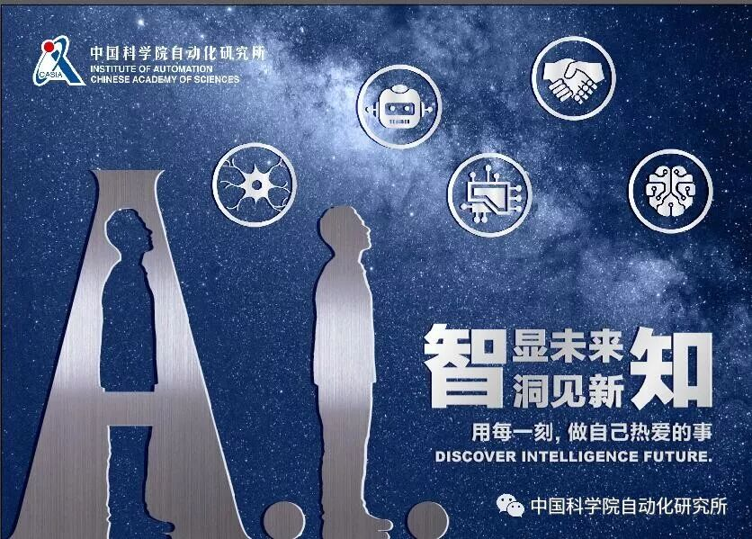
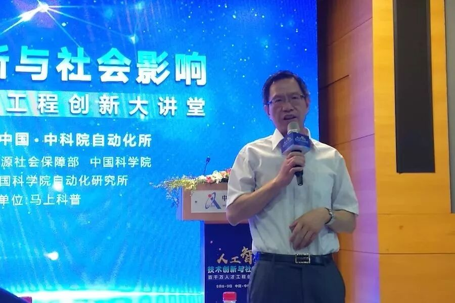

# 【紫冬观点】 刘成林：模式识别背后的人工智能局限

原创 自动化学报 2018-10-09 11:02 北京

> 原文地址: [https://mp.weixin.qq.com/s/8N\_AKuVNo5tnw9h-JKeM3Q](https://mp.weixin.qq.com/s/8N_AKuVNo5tnw9h-JKeM3Q)

**今日聚焦**

  

**中科院自动化所刘成林研究员**详述了人工智能在目前发展阶段，人脸识别、文字识别等典型问题的研究难点和重点。同时，刘成林指出，人脸识别和文字识别作为典型的模式识别问题，**图像清晰度和光照等问题是其共同的难点，**深度学习也有其局限性存在。但他也认为，对于AI未来的发展而言，**深度学习依然会是人工智能研究的主流，但对抗学习、脑科学、认知科学等的理论方法，都会与其进行融合，**共同推进人工智能的发展。

  

众所周知，人工智能目前的快速发展得益于深度学习的兴起，但在具体应用上，深度学习主要在模式识别（感知智能）中获得成功，同时从智能机理研究上， 脑科学也逐渐跟人工智能深度融合。人工智能领域，正在由感知智能的初步成功，慢慢走向百花齐放。

  

本文中，刘成林研究员详述了人工智能方兴未艾之时，人脸识别、文字识别等典型模式识别问题的研究难点和重点。

  

刘成林研究员作报告

**人脸识别、文字识别背后的方法，模式识别是什么？**

模式识别是什么？

**作为人工智能的一个重要方向，模式识别的主要任务是模拟人的感知能力，如通过视觉和听觉信息去识别理解环境，又被称为“机器感知”或“智能感知”****。**

  

人们在观察事物或现象的时候，常常要寻找它与其他事物或现象的不同之处，并根据一定目的把相似、但又细节不同的事物或现象组成一类。字符识别就是一个典型的例子，如数字“4”可以有各种写法，但都属于同一类别。人脑具有很强的模式识别和推广能力，即使对于某种不同写法的“4”，以前虽未见过，也能把它分到“4”所属的这一类别。人脑的这种对模式（事物、现象等）进行归类和分类的能力，就是模式识别，也就是感知能力。

  

随着20世纪40年代电子计算机出现，50年代人工智能兴起，模式识别在20世纪60年代初迅速发展成为一门新学科。**21世纪以来，模式识别又逐渐与深度学习融合。**近年来，深度学习和大数据的出现推动了模式识别的快速发展。

  

对此，刘成林解释道，“模式识别是一个智能任务，是人工智能的一种形式。机器学习，包括深度学习是模式识别背后的基本方法，通过学习（训练）使机器具备识别模式的能力。当前，用深度学习的方法来实现模式识别，能更好的解决问题。”

  

深度学习作为机器学习的一种，是对生物神经网络结构和信息处理机制的简单模拟。**人工神经网络早在上世纪40年代就有人研究，50年代和80年代都曾产生较大的影响。**近年来，随着计算能力的提升，可以训练层数较多的神经网络（称为深度神经网络）来提升数据拟合和识别能力，有的甚至达到了1000多层。深度学习一般就是指利用深度神经网络来进行学习。

  

**复杂条件下，人脸识别的正确率不到50%**

得益于深度学习，目前人脸识别和文字识别都是人工智能领域应用比较成功的方向，可以算是模式识别借助深度学习形成的主要研究成果之一。

  

但刘成林认为，目前人脸识别、文字识别虽然已应用得较为广泛，但还不能算“应用得很好”。人脸识别目前应用得比较成熟的是门禁、通关等领域，原因在于被识别的对象能主动配合，距离摄像头较近，能拍摄到比较清楚的图像。很多厂商在用户配合、光照可控的场景下人脸识别正确率能达到99%以上。**但在更加复杂的情况下，如在室外****光照不均、距离远、人脸视角多变情况下，用监控摄像头进行人脸识别，识别正确率就会明显降低。**

  

目前在计算机前端加入AI模块，只能起辅助作用，复杂条件下的人脸识别依旧难以达到成熟应用的程度。刘成林表示，室外自然光照条件下，“人脸识别正确率还达不到50%”。

  

文字识别领域也是如此。文字识别目前主要应用在书籍和报纸等的数字化上。报纸、金融机构、保险机构以及快递行业的的大量单据，都需要电子化后才能方便检索、管理和进行大数据分析。司法界推行智能法务，办案的文书（有印刷体，也有手写体）需要电子化。医院的病例、教育领域的作业题、考试答卷等，也都有很大的电子化需求。

  

**同人脸识别一样，图像清晰度和光照等问题也是文字识别的一大难点。**平板扫描仪由于光照均匀，对纸质材料扫描得到的图像清晰度高，文字识别率较高。而拍照图片的识别率则会降低，室外自然场景图片中的文字检测和识别更是当今研究的热点和难点问题。

**对抗学习、脑科学并肩，加速AI进程**

要克服人脸识别中低分辨率和光照的问题，深度学习也存在局限，而运用对抗学习的方法来处理图像则能提高其清晰度或生成更多样本。

  

什么是对抗学习？

**对抗学习是一种很新的机器学习方法，由加拿大学者Ian Goodfel****low首先提出。**对抗学习实现的方法，是让两个网络相互竞争对抗，“玩一个游戏”。其中一个是生成器网络，它不断捕捉训练库里真实图片的概率分布，将输入的随机噪声转变成新的样本（也就是假数据）。另一个是判别器网络，它可以同时观察真实和假造的数据，判断这个数据到底是不是真的。通过反复对抗，生成器和判别器的能力都会不断增强，直到达成一个平衡，最后生成器可生成高质量的、以假乱真的图片。

  

文字识别领域要解决的问题，除了上文提到的拍照图片、以及手写笔迹的识别，小样本条件下的文字识别，如古籍的识别也是一大挑战，因为用于训练的标记样本不足，深度学习难以取得较高的识别率。

  

**小样本泛化性、自适应性、可解释性、鲁棒性是当前以深度学习为主的模式识别技术的主要局限所在，而这些恰恰是人脑的长处****。**因此，模式识别可以从脑科学和神经科学上寻找新的借鉴，发展新的类人感知和认知机理的模式识别学习理论与方法。

  

以泛化能力为例，在训练样本较少时，可以设计与人的记忆方式类似的模型进行训练，使机器记住文字的结构和关键特征，如构成文字的笔画、组合和关系。这种模型叫“生成模型”，可以记住每一类模式的关键特征及分布，并能生成数据，如生成满足一类文字基本结构、细节不同的手写字。**生成模型也具有很好的解释性，在识别模式的同时能解释这个模式是由哪几部分构成的，几部分之间是什么关系。**

  

模式识别、深度学习、对抗学习、脑科学……越来越多的人工智能研究路径进入了我们的视野。**而对于人工智能发展的未来，刘成林也认为，深度学习依然会是人工智能研究的主流，但对抗学习、脑科学、认知科学等的理论方法，都会与其进行融合，共同推进人工智能的发展。**

  

**Hebbian Theory-Hebbian学习**：Hebbian学习是一种神经科学理论，它认为突触后细胞敏感度的增加源于突出前细胞对突出后细胞反复或者持续的刺激。这一理论解释了突触的可塑性，即学习过程中大脑神经元的适应性，也对人工神经网络的研究起到了重要的作用。它也可称为Hebb规则或Hebb假设。

**AI爱新词**

  

**更多精彩内容，欢迎关注**  

中科院自动化所官方网站：

http://www.ia.ac.cn

欢迎后台留言、推荐您感兴趣的话题、内容或资讯，小编恭候您的意见和建议！如需转载或投稿，请后台私信。

来源：中国自动化学会  

排版：翁宇琛  

编辑：鲁宁  

  

  

JAS服务号

长按扫码关注我们

《自动化学报》

服务号

长按扫码关注我们

《自动化学报》

订阅号

长按扫码关注我们

  

  

**联系我们**

Tel:  010-82544653（日常咨询和稿件处理） 

        010-82544677（录用后稿件处理）

Fax: 010-82544497

Email: aas@ia.ac.cn（日常咨询和稿件处理）

          aas\_editor@ia.ac.cn（录用后稿件处理）

http://www.aas.net.cn