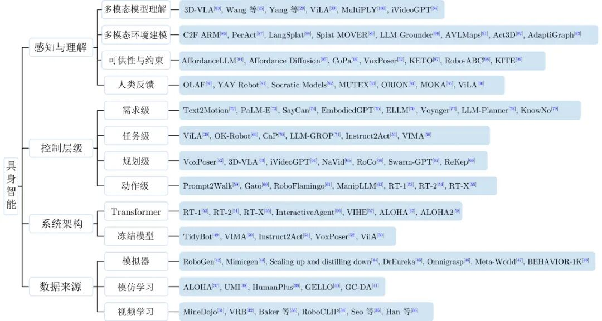

# 【视频专栏】基于大模型的具身智能系统综述

原创 自动化学报 自动化学报 2025-05-08 17:00 北京

> 原文地址: [https://mp.weixin.qq.com/s/3PYK08xXd4c5azewAbbDXA](https://mp.weixin.qq.com/s/3PYK08xXd4c5azewAbbDXA)

点击上方**蓝字**关注我们

  

王文晟, 谭宁, 黄凯, 张雨浓, 郑伟诗, 孙富春. [基于大模型的具身智能系统综述](http://www.aas.net.cn/cn/article/doi/10.16383/j.aas.c240542). 自动化学报, 2025, 51(1): 1-19

1

摘要

     得益于近期具有世界知识的大规模预训练模型的迅速发展, 基于大模型的具身智能在各类任务中取得了良好的效果, 展现出强大的泛化能力与在各领域内广阔的应用前景. 鉴于此, 对基于大模型的具身智能的工作进行了综述, 首先, 介绍大模型在具身智能系统中起到的感知与理解作用; 其次, 对大模型在具身智能中参与的需求级、任务级、规划级和动作级的控制进行了较为全面的总结; 然后, 对不同具身智能系统架构进行介绍, 并总结了目前具身智能模型的数据来源, 包括模拟器、模仿学习以及视频学习; 最后, 对基于大语言模型(Large language model, LLM)的具身智能系统面临的挑战与发展方向进行讨论与总结.

  

2

引言

    具身智能的概念最早可以上溯至1950年图灵在其著名论文“Computing machinery and intelligence”\[1\]中对未来机器发展方向的设想: 一个方向是让机器学会抽象技能, 如下棋; 另一个方向则是为机器人提供足够好的传感器, 使之可以像人类一样学习. 前者的思想出现在后来发展的各类神经网络如多层感知机、卷积神经网络中, 即离身智能; 后者则逐渐发展出了具身智能的概念. 现在, 具身智能一般指拥有物理实体, 且可以与物理环境进行信息、能量交换的智能系统\[2\]. 虽然在过去的几十年间, 离身智能取得了令人瞩目的成就, 但对于解决真实世界的问题来说, “具身”的实现仍然是必要的, 与强调从经验中学习并泛化的离身智能方法相比, 具身智能更强调与环境的交互, 只有拥有物理身体才能与世界进行互动, 更好地解决现实问题\[3\]. 当前, 随着机器人技术和计算机科学的发展, 具身智能受到更多的关注, 逐渐从概念走向实际应用, 而如何利用目前飞速发展的计算能力与人工智能(Artificial intelligence, AI)技术提高具身智能的表现则成为学界与产业界的关注重点. 最近的研究表明, 通过扩大语言模型的规模, 可以显著提高其在少样本学习任务上的表现, 以GPT-3 (Generative pre-trained transformer 3)\[4\]为代表的大语言模型(Large language model, LLM)在没有进行任何参数更新或微调的情况下, 仅通过文本交互来指定任务和少样本示例就能很好地完成各类任务. 在此之后, 具有优秀泛化能力与丰富常识的基础模型在计算机视觉、自然语言处理等领域都展现出令人瞩目的效果.

  

GPT-4\[5\]、LLaMA\[6\]、LLaMA2\[7\]、Gemini\[8\]、Gemini1.5\[9\]等大语言模型能与人类进行流畅的对话, 进行推理任务, 甚至进行诗歌和故事的创作; BLIP (Bootstrapping language-image pre-training)\[10\]、BLIP2\[11\]、GPT4-V\[12\]等视觉−语言大模型则能对图片进行图像分割\[13\]、目标检测\[14\]、视觉问答(Visual question answering, VQA)\[15\]; DINO (Detection transformer with improved denoising anchor boxes)\[16\]、CLIP (Contrastive language-image pre-training)\[17\]、SAM (Segment anything model)\[18\]等视觉基础模型则以低于前两者的模型量级提供跨越图像与文本鸿沟的能力, 为进行实时的开放词汇的视觉检索提供了可能. 这一系列的进展不仅展示了基础模型的强大潜力, 也为其与具身智能的融合提供了新的视角和可能性. 文献\[19\] 将上述在大规模数据集上进行训练并能适应广泛任务的模型统称为基础模型, 意即可作为大量下游任务训练基础的模型(目前一般认为基础模型即大模型, 后文将不对二者作区分). 由于涉及到物理环境, 机器人深度学习模型往往面临数据获取难度大、训练的模型泛化性差的困境, 传统机器人往往仅能处理单一任务, 无法灵活面对复杂的真实环境. 而基础模型用来自互联网的大量文本、图片数据进行预训练, 往往包含各种主题与应用场景, 能学习到丰富的表示与知识, 具有解决各类任务的潜能, 其作为具身智能的“大脑”能显著弥补机器人领域训练数据少且专门化的缺点, 为系统提供强大的感知、理解、决策和行动的能力. 此外, 基础模型的零样本能力使得系统无需调整即能适应各种未见过的任务, 基础模型训练数据的丰富模态也可以满足具身智能对各类传感器信息的处理需求. 无论是视觉信息、听觉信息, 还是其他类型的感知数据, 基础模型都能够为具身智能提供全面和准确的理解. 在实际应用中, 这意味着具身智能能够更好地适应环境变化, 理解各种操作对象, 解决各种复杂问题. 

  

大模型的强大理解能力也能为具身智能带来与人类无障碍沟通的能力, 能更有效且准确地理解用户需求, 而大模型的长对话能力也使其具有处理复杂任务的能力, 并规划长期目标. 这些特点都使得具身智能有别于传统的仅面向单一任务, 或同质任务的传统机器人, 使其具有更强的自主性与适应性. 人形机器人的突出优势就是其通用性, 而大模型带来的认知能力则是形成通用性的关键\[20\]. 近期, 各大机器人企业制造的人形机器人, 如宇树机器人Unitree H1、特斯拉机器人Optimus, 以及Figure AI的Figure 01均使用了基础模型进行赋能, 展现出令人惊讶的理解、判断和行动能力.

  

随着大模型的发展, 近年基于大模型的具身智能工作已经成为研究热点, 各类试图将二者结合的工作层出不穷. 尽管目前有一些以具身智能为主题的综述\[21−23\], 但并未聚焦于大模型. 目前也有综述研究大模型在机器人上的应用\[24−28\], 但不同的是, 本文的内容更倾向于从具身智能的角度介绍二者如何有机结合, 并加入对模型规划层级的分类探讨. 此外, 由于该领域发展迅速, 在上述论文发布后又涌现出了许多重要工作, 本文将补充这些最新进展, 为希望了解该领域的研究人员提供更多的参考 (工作总览见图1\[25, 29−100\]).

  

图 1  基于大模型的具身智能工作概览

Fig. 1  Overview of embodied intelligence work based on large models

  

本文内容安排如下: 第1节对大模型如何帮助具身智能实现对环境的感知与理解进行介绍; 第2节分析大模型分别在需求级、任务级、规划级、动作级这四个控制层级上为具身智能提供的规划; 第3节对各类实现大模型结合具身智能的系统架构进行分类与介绍; 第4节从模拟器、模仿学习和视频学习等方面介绍具身智能训练的数据来源, 探讨大模型如何为机器人训练带来丰富的数据; 最后在第5节对全文进行总结并提出研究方向.

  

3

正文框架

1\. 感知与理解

  1.1 多模态模型理解

  1.2 多模态环境建模

  1.3 可供性与约束

  1.4 人类反馈

2\. 控制层级

  2.1 需求级

  2.2 任务级

  2.3 规划级

  2.4 动作级

3\. 系统架构

  3.1 基于Transformer的架构

  3.2 参数冻结的大模型结合基础模型

4\. 数据来源

  4.1 模拟器

  4.2 模仿学习

  4.3 视频学习

5\. 结束语

  

**部分文献**

  

\[1\] Turing A M. Computing machinery and intelligence. Mind, 1950, 59: 433−460

  

\[2\] Roy N, Posner I, Barfoot T, Beaudoin P, Bengio Y, Bohg J, et al. From machine learning to robotics: Challenges and opportunities for embodied intelligence. arXiv preprint arXiv: 2110.15245, 2021.

Roy N, Posner I, Barfoot T, Beaudoin P, Bengio Y, Bohg J, et al. From machine learning to robotics: Challenges and opportunities for embodied intelligence. arXiv preprint arXiv: 2110.15245, 2021.

  

\[3\] Brooks R A. Intelligence without representation. Artificial Intelligence, 1991, 47(1−3): 139−159 doi: 10.1016/0004-3702(91)90053-M

  

\[4\] Brown T B, Mann B, Ryder N, Subbiah M, Kaplan J, Dhariwal P, et al. Language models are few-shot learners. In: Proceedings of the 34th International Conference on Neural Information Processing Systems. Vancouver, Canada: Curran Associates Inc., 2020.

  

\[5\] Achiam J, Adler S, Agarwal S, Ahmad L, Akkaya I, Aleman F L, et al. GPT-4 technical report. arXiv preprint arXiv: 2303.08774, 2024.

Achiam J, Adler S, Agarwal S, Ahmad L, Akkaya I, Aleman F L, et al. GPT-4 technical report. arXiv preprint arXiv: 2303.08774, 2024.

  

\[6\] Touvron H, Lavril T, Izacard G, Martinet X, Lachaux M A, Lacroix T, et al. LLaMA: Open and efficient foundation language models. arXiv preprint arXiv: 2302.13971, 2023.

Touvron H, Lavril T, Izacard G, Martinet X, Lachaux M A, Lacroix T, et al. LLaMA: Open and efficient foundation language models. arXiv preprint arXiv: 2302.13971, 2023.

  

\[7\] Touvron H, Martin L, Stone K, Albert P, Almahairi A, Babaei Y, et al. Llama 2: Open foundation and fine-tuned chat models. arXiv preprint arXiv: 2307.09288, 2023.

Touvron H, Martin L, Stone K, Albert P, Almahairi A, Babaei Y, et al. Llama 2: Open foundation and fine-tuned chat models. arXiv preprint arXiv: 2307.09288, 2023.

  

\[8\] Anil R, Borgeaud S, Alayrac J B, Yu J H, Soricut R, Schalkwyk J, et al. Gemini: A family of highly capable multimodal models. arXiv preprint arXiv: 2312.11805, 2024.

Anil R, Borgeaud S, Alayrac J B, Yu J H, Soricut R, Schalkwyk J, et al. Gemini: A family of highly capable multimodal models. arXiv preprint arXiv: 2312.11805, 2024.

  

\[9\] Georgiev P, Lei V I, Burnell R, Bai L B, Gulati A, Tanzer G, et al. Gemini 1.5: Unlocking multimodal understanding across millions of tokens of context. arXiv preprint arXiv: 2403.05530, 2024.

Georgiev P, Lei V I, Burnell R, Bai L B, Gulati A, Tanzer G, et al. Gemini 1.5: Unlocking multimodal understanding across millions of tokens of context. arXiv preprint arXiv: 2403.05530, 2024.

  

\[10\] Li J N, Li D X, Xiong C M, Hoi S. BLIP: Bootstrapping language-image pre-training for unified vision-language understanding and generation. arXiv preprint arXiv: 2201.12086, 2022.

Li J N, Li D X, Xiong C M, Hoi S. BLIP: Bootstrapping language-image pre-training for unified vision-language understanding and generation. arXiv preprint arXiv: 2201.12086, 2022.

  

\[11\] Li J N, Li D X, Savarese S, Hoi S C H. BLIP-2: Bootstrapping language-image pre-training with frozen image encoders and large language models. In: Proceedings of the International Conference on Machine Learning. Honolulu, USA: PMLR, 2023. 19730−19742

  

\[12\] Wake N, Kanehira A, Sasabuchi K, Takamatsu J, Ikeuchi K. GPT-4V(ision) for robotics: Multimodal task planning from human demonstration. IEEE Robotics and Automation Letters, 2024, 9(11): 10567−10574 doi: 10.1109/LRA.2024.3477090

  

\[13\] Li B Y, Weinberger K Q, Belongie S J, Koltun V, Ranftl R. Language-driven semantic segmentation. In: Proceedings of the 10th International Conference on Learning Representations. OpenReview.net, 2022.

Li B Y, Weinberger K Q, Belongie S J, Koltun V, Ranftl R. Language-driven semantic segmentation. In: Proceedings of the 10th International Conference on Learning Representations. OpenReview.net, 2022.

  

\[14\] Gu X Y, Lin T Y, Kuo W C, Cui Y. Open-vocabulary object detection via vision and language knowledge distillation. arXiv preprint arXiv: 2104.13921, 2022.

Gu X Y, Lin T Y, Kuo W C, Cui Y. Open-vocabulary object detection via vision and language knowledge distillation. arXiv preprint arXiv: 2104.13921, 2022.

  

\[15\] Antol S, Agrawal A, Lu J S, Mitchell M, Batra D, Zitnick C L, et al. VQA: Visual question answering. In: Proceedings of the IEEE International Conference on Computer Vision (ICCV). Santiago, Chile: IEEE, 2016.

  

\[16\] Caron M, Touvron H, Misra I, Jégou H, Mairal J, Bojanowski P, et al. Emerging properties in self-supervised vision transformers. In: Proceedings of the IEEE/CVF International Conference on Computer Vision (ICCV). Montreal, Canada: IEEE, 2021.

  

\[17\] Radford A, Kim J W, Hallacy C, Ramesh A, Goh G, Agarwal S, et al. Learning transferable visual models from natural language supervision. In: Proceedings of the 38th International Conference on Machine Learning. PMLR, 2021.

Radford A, Kim J W, Hallacy C, Ramesh A, Goh G, Agarwal S, et al. Learning transferable visual models from natural language supervision. In: Proceedings of the 38th International Conference on Machine Learning. PMLR, 2021.

  

\[18\] Kirillov A, Mintun E, Ravi N, Mao H Z, Rolland C, Gustafson L, et al. Segment anything. In: Proceedings of the IEEE/CVF International Conference on Computer Vision (ICCV). Paris, France: IEEE, 2023.

  

\[19\] Bommasani R, Hudson D A, Adeli E, Altman R, Arora S, von Arx S, et al. On the opportunities and risks of foundation models. arXiv preprint arXiv: 2108.07258, 2022.

Bommasani R, Hudson D A, Adeli E, Altman R, Arora S, von Arx S, et al. On the opportunities and risks of foundation models. arXiv preprint arXiv: 2108.07258, 2022.

  

\[20\] 杨雨彤. AI大模型与具身智能终将相遇. 机器人产业, 2024(2): 71−74

Yang Yu-Tong. AI large models and embodied intelligence will eventually meet. Robot Industry, 2024(2): 71−74

  

\[21\] Gupta A, Savarese S, Ganguli S, Fei-Fei L. Embodied intelligence via learning and evolution. Nature Communications, 2021, 12(1): Article No. 5721 doi: 10.1038/s41467-021-25874-z

  

\[22\] 刘华平, 郭迪, 孙富春, 张新钰. 基于形态的具身智能研究: 历史回顾与前沿进展. 自动化学报, 2023, 49(6): 1131−1154

Liu Hua-Ping, Guo Di, Sun Fu-Chun, Zhang Xin-Yu. Morphology-based embodied intelligence: Historical retrospect and research progress. Acta Automatica Sinica, 2023, 49(6): 1131−1154

  

\[23\] 兰沣卜, 赵文博, 朱凯, 张涛. 基于具身智能的移动操作机器人系统发展研究. 中国工程科学, 2024, 26(1): 139−148 doi: 10.15302/J-SSCAE-2024.01.010

Lan Feng-Bo, Zhao Wen-Bo, Zhu Kai, Zhang Tao. Development of mobile manipulator robot system with embodied intelligence. Strategic Study of CAE, 2024, 26(1): 139−148 doi: 10.15302/J-SSCAE-2024.01.010

  

\[24\] Firoozi R, Tucker J, Tian S, Majumdar A, Sun J K, Liu W Y, et al. Foundation models in robotics: Applications, challenges, and the future. arXiv preprint arXiv: 2312.07843v1, 2023.

  

\[25\] Wang J Q, Wu Z H, Li Y W, Jiang H Q, Shu P, Shi E Z, et al. Large language models for robotics: Opportunities, challenges, and perspectives. arXiv preprint arXiv: 2401.04334, 2024.

Wang J Q, Wu Z H, Li Y W, Jiang H Q, Shu P, Shi E Z, et al. Large language models for robotics: Opportunities, challenges, and perspectives. arXiv preprint arXiv: 2401.04334, 2024.

  

\[26\] Kim Y, Kim D, Choi J, Park J, Oh N, Park D. A survey on integration of large language models with intelligent robots. Intelligent Service Robotics, 2024, 17(5): 1091−1107 doi: 10.1007/s11370-024-00550-5

  

\[27\] Hu Y F, Xie Q T, Jain V, Francis J, Patrikar J, Keetha N, et al. Toward general-purpose robots via foundation models: A survey and meta-analysis. arXiv preprint arXiv: 2312.08782, 2023.

Hu Y F, Xie Q T, Jain V, Francis J, Patrikar J, Keetha N, et al. Toward general-purpose robots via foundation models: A survey and meta-analysis. arXiv preprint arXiv: 2312.08782, 2023.

  

\[28\] Liu Y, Chen W X, Bai Y J, Liang X D, Li G B, Gao W, et al. Aligning cyber space with physical world: A comprehensive survey on embodied AI. arXiv preprint arXiv: 2407.06886, 2024.

Liu Y, Chen W X, Bai Y J, Liang X D, Li G B, Gao W, et al. Aligning cyber space with physical world: A comprehensive survey on embodied AI. arXiv preprint arXiv: 2407.06886, 2024.

  

\[29\] Yang Z Y, Li L J, Lin K, Wang J F, Lin C C, Liu Z C, et al. The dawn of LMMs: Preliminary explorations with GPT-4V(ision). arXiv preprint arXiv: 2309.17421, 2023.

Yang Z Y, Li L J, Lin K, Wang J F, Lin C C, Liu Z C, et al. The dawn of LMMs: Preliminary explorations with GPT-4V(ision). arXiv preprint arXiv: 2309.17421, 2023.

  

\[30\] Hu Y D, Lin F Q, Zhang T, Yi L, Gao Y. Look before you leap: Unveiling the power of GPT-4V in robotic vision-language planning. arXiv preprint arXiv: 2311.17842, 2023.

Hu Y D, Lin F Q, Zhang T, Yi L, Gao Y. Look before you leap: Unveiling the power of GPT-4V in robotic vision-language planning. arXiv preprint arXiv: 2311.17842, 2023.

  

\[31\] Fan L X, Wang G Z, Jiang Y F, Mandlekar A, Yang Y C, Zhu H Y, et al. MineDojo: Building open-ended embodied agents with internet-scale knowledge. arXiv preprint arXiv: 2206.08853, 2022.

Fan L X, Wang G Z, Jiang Y F, Mandlekar A, Yang Y C, Zhu H Y, et al. MineDojo: Building open-ended embodied agents with internet-scale knowledge. arXiv preprint arXiv: 2206.08853, 2022.

  

\[32\] Bahl S, Mendonca R, Chen L L, Jain U, Pathak D. Affordances from human videos as a versatile representation for robotics. In: Proceedings of the IEEE/CVF Conference on Computer Vision and Pattern Recognition (CVPR). Vancouver, Canada: IEEE, 2023.

  

\[33\] Baker B, Akkaya I, Zhokhov P, Huizinga J, Tang J, Ecoffet A, et al. Video PreTraining (VPT): Learning to act by watching unlabeled online videos. In: Proceedings of the 36th International Conference on Neural Information Processing Systems. New Orleans, USA: 2022.

Baker B, Akkaya I, Zhokhov P, Huizinga J, Tang J, Ecoffet A, et al. Video PreTraining (VPT): Learning to act by watching unlabeled online videos. In: Proceedings of the 36th International Conference on Neural Information Processing Systems. New Orleans, USA: 2022.

  

\[34\] Sontakke S, Zhang J, Arnold S M R, Pertsch K, Biyik E, Sadigh D, et al. RoboCLIP: One demonstration is enough to learn robot policies. In: Proceedings of the 37th International Conference on Neural Information Processing Systems. New Orleans, USA: 2023.

Sontakke S, Zhang J, Arnold S M R, Pertsch K, Biyik E, Sadigh D, et al. RoboCLIP: One demonstration is enough to learn robot policies. In: Proceedings of the 37th International Conference on Neural Information Processing Systems. New Orleans, USA: 2023.

  

\[35\] Seo Y, Lee K, James S, Abbeel P. Reinforcement learning with action-free pre-training from videos. In: Proceedings of the 39th International Conference on Machine Learning. Baltimore, USA: PMLR, 2022.

  

\[36\] Han L, Zhu Q X, Sheng J P, Zhang C, Li T G, Zhang Y Z, et al. Lifelike agility and play in quadrupedal robots using reinforcement learning and generative pre-trained models. Nature Machine Intelligence, 2024, 6(7): 787−798 doi: 10.1038/s42256-024-00861-3

  

\[37\] Zhao T Z, Kumar V, Levine S, Finn C. Learning fine-grained bimanual manipulation with low-cost hardware. arXiv preprint arXiv: 2304.13705, 2023.

Zhao T Z, Kumar V, Levine S, Finn C. Learning fine-grained bimanual manipulation with low-cost hardware. arXiv preprint arXiv: 2304.13705, 2023.

  

\[38\] Chi C, Xu Z J, Pan C, Cousineau E, Burchfiel B, Feng S Y, et al. Universal manipulation interface: In-the-wild robot teaching without in-the-wild robots. arXiv preprint arXiv: 2402.10329v3, 2024.

Chi C, Xu Z J, Pan C, Cousineau E, Burchfiel B, Feng S Y, et al. Universal manipulation interface: In-the-wild robot teaching without in-the-wild robots. arXiv preprint arXiv: 2402.10329v3, 2024.

  

\[39\] Fu Z P, Zhao Q Q, Wu Q, Wetzstein G, Finn C. HumanPlus: Humanoid shadowing and imitation from humans. arXiv preprint arXiv: 2406.10454, 2024.

Fu Z P, Zhao Q Q, Wu Q, Wetzstein G, Finn C. HumanPlus: Humanoid shadowing and imitation from humans. arXiv preprint arXiv: 2406.10454, 2024.

  

\[40\] Wu P, Shentu Y, Yi Z K, Lin X Y, Abbeel P. GELLO: A general, low-cost, and intuitive teleoperation framework for robot manipulators. arXiv preprint arXiv: 2309.13037, 2023.

Wu P, Shentu Y, Yi Z K, Lin X Y, Abbeel P. GELLO: A general, low-cost, and intuitive teleoperation framework for robot manipulators. arXiv preprint arXiv: 2309.13037, 2023.

  

\[41\] Kim H, Ohmura Y, Kuniyoshi Y. Goal-conditioned dual-action imitation learning for dexterous dual-arm robot manipulation. IEEE Transactions on Robotics, 2024, 40: 2287−2305 doi: 10.1109/TRO.2024.3372778

  

\[42\] Wang Y F, Xian Z, Chen F, Wang T H, Wang Y, Fragkiadaki K, et al. RoboGen: Towards unleashing infinite data for automated robot learning via generative simulation. In: Proceedings of the 41st International Conference on Machine Learning. Vienna, Austria: OpenReview.net, 2024.

  

\[43\] Mandlekar A, Nasiriany S, Wen B W, Akinola I, Narang Y S, Fan L X, et al. MimicGen: A data generation system for scalable robot learning using human demonstrations. In: Proceedings of the 7th Conference on Robot Learning. Atlanta, USA: PMLR, 2023.

  

\[44\] Ha H, Florence P, Song S. Scaling up and distilling down: Language-guided robot skill acquisition. In: Proceedings of the 7th Conference on Robot Learning. Atlanta, USA: PMLR, 2023.

  

\[45\] Ma Y J, Liang W, Wang H J, Wang S, Zhu Y K, Fan L X, et al. DrEureka: Language model guided sim-to-real transfer. arXiv preprint arXiv: 2406.01967, 2024.

Ma Y J, Liang W, Wang H J, Wang S, Zhu Y K, Fan L X, et al. DrEureka: Language model guided sim-to-real transfer. arXiv preprint arXiv: 2406.01967, 2024.

  

\[46\] Luo Z Y, Cao J K, Christen S, Winkler A, Kitani K, Xu W P. Grasping diverse objects with simulated humanoids. arXiv preprint arXiv: 2407.11385, 2024.

Luo Z Y, Cao J K, Christen S, Winkler A, Kitani K, Xu W P. Grasping diverse objects with simulated humanoids. arXiv preprint arXiv: 2407.11385, 2024.

  

\[47\] Yu T H, Quillen D, He Z P, Julian R, Hausman K, Finn C, et al. Meta-world: A benchmark and evaluation for multi-task and meta reinforcement learning. In: Proceedings of the 3rd Annual Conference on Robot Learning. Osaka, Japan: PMLR, 2019.

  

\[48\] Li C S, Zhang R H, Wong J, Gokmen C, Srivastava S, Martín-Martín R, et al. BEHAVIOR-1K: A human-centered, embodied AI benchmark with 1 000 everyday activities and realistic simulation. arXiv preprint arXiv: 2403.09227, 2024.

Li C S, Zhang R H, Wong J, Gokmen C, Srivastava S, Martín-Martín R, et al. BEHAVIOR-1K: A human-centered, embodied AI benchmark with 1 000 everyday activities and realistic simulation. arXiv preprint arXiv: 2403.09227, 2024.

  

\[49\] Wu J, Antonova R, Kan A, Lepert M, Zeng A, Song S R, et al. TidyBot: Personalized robot assistance with large language models. Autonomous Robots, 2023, 47(8): 1087−1102 doi: 10.1007/s10514-023-10139-z

  

\[50\] Jiang Y F, Gupta A, Zhang Z C, Wang G Z, Dou Y Q, Chen Y J, et al. VIMA: General robot manipulation with multimodal prompts. arXiv preprint arXiv: 2210.03094, 2022.

Jiang Y F, Gupta A, Zhang Z C, Wang G Z, Dou Y Q, Chen Y J, et al. VIMA: General robot manipulation with multimodal prompts. arXiv preprint arXiv: 2210.03094, 2022.

  

\[51\] Huang S Y, Jiang Z K, Dong H, Qiao Y, Gao P, Li H S. Instruct2Act: Mapping multi-modality instructions to robotic actions with large language model. arXiv preprint arXiv: 2305.11176, 2023.

Huang S Y, Jiang Z K, Dong H, Qiao Y, Gao P, Li H S. Instruct2Act: Mapping multi-modality instructions to robotic actions with large language model. arXiv preprint arXiv: 2305.11176, 2023.

  

\[52\] Huang W L, Wang C, Zhang R H, Li Y Z, Wu J J, Li F F. VoxPoser: Composable 3D value maps for robotic manipulation with language models. In: Proceedings of the 7th Conference on Robot Learning. Atlanta, USA: PMLR, 2023.

Huang W L, Wang C, Zhang R H, Li Y Z, Wu J J, Li F F. VoxPoser: Composable 3D value maps for robotic manipulation with language models. In: Proceedings of the 7th Conference on Robot Learning. Atlanta, USA: PMLR, 2023.

  

\[53\] Brohan A, Brown N, Carbajal J, Chebotar Y, Dabis J, Finn C, et al. RT-1: Robotics transformer for real-world control at scale. In: Proceedings of the 19th Robotics: Science and Systems. Daegu, South Korea: 2023.

Brohan A, Brown N, Carbajal J, Chebotar Y, Dabis J, Finn C, et al. RT-1: Robotics transformer for real-world control at scale. In: Proceedings of the 19th Robotics: Science and Systems. Daegu, South Korea: 2023.

  

\[54\] Zitkovich B, Yu T H, Xu S C, Xu P, Xiao T, Xia F, et al. RT-2: Vision-language-action models transfer web knowledge to robotic control. In: Proceedings of the 7th Conference on Robot Learning. Atlanta, USA: PMLR, 2023.

  

\[55\] O＇Neill A, Rehman A, Gupta A, Maddukuri A, Gupta A, Padalkar A, et al. Open X-embodiment: Robotic learning datasets and RT-X models. arXiv preprint arXiv: 2310.08864, 2023.

O'Neill A, Rehman A, Gupta A, Maddukuri A, Gupta A, Padalkar A, et al. Open X-embodiment: Robotic learning datasets and RT-X models. arXiv preprint arXiv: 2310.08864, 2023.

  

\[56\] Durante Z, Sarkar B, Gong R, Taori R, Noda Y, Tang P, et al. An interactive agent foundation model. arXiv preprint arXiv: 2402.05929, 2024.

  

\[57\] Wang W Y, Lei Y T, Jin S Y, Hager G D, Zhang L J. VIHE: Virtual in-hand eye transformer for 3D robotic manipulation. arXiv preprint arXiv: 2403.11461, 2024.

Wang W Y, Lei Y T, Jin S Y, Hager G D, Zhang L J. VIHE: Virtual in-hand eye transformer for 3D robotic manipulation. arXiv preprint arXiv: 2403.11461, 2024.

  

\[58\] Aldaco J, Armstrong T, Baruch R, Bingham J, Chan S, Draper K, et al. ALOHA 2: An enhanced low-cost hardware for bimanual teleoperation. arXiv preprint arXiv: 2405.02292, 2024.

Aldaco J, Armstrong T, Baruch R, Bingham J, Chan S, Draper K, et al. ALOHA 2: An enhanced low-cost hardware for bimanual teleoperation. arXiv preprint arXiv: 2405.02292, 2024.

  

\[59\] Wang Y J, Zhang B K, Chen J Y, Sreenath K. Prompt a robot to walk with large language models. arXiv preprint arXiv: 2309.09969, 2023.

Wang Y J, Zhang B K, Chen J Y, Sreenath K. Prompt a robot to walk with large language models. arXiv preprint arXiv: 2309.09969, 2023.

  

\[60\] Reed S, Zolna K, Parisotto E, Colmenarejo S G, Novikov A, Barth-Maron G, et al. A generalist agent. arXiv preprint arXiv: 2205.06175, 2022.

Reed S, Zolna K, Parisotto E, Colmenarejo S G, Novikov A, Barth-Maron G, et al. A generalist agent. arXiv preprint arXiv: 2205.06175, 2022.

  

\[61\] Li X H, Liu M H, Zhang H B, Yu C J, Xu J, Wu H T, et al. Vision-language foundation models as effective robot imitators. In: Proceedings of the 12th International Conference on Learning Representations. Vienna, Austria: OpenReview.net, 2024.

  

\[62\] Li X Q, Zhang M X, Geng Y R, Geng H R, Long Y X, Shen Y, et al. ManipLLM: Embodied multimodal large language model for object-centric robotic manipulation. In: Proceedings of the IEEE/CVF Conference on Computer Vision and Pattern Recognition (CVPR). Seattle, USA: IEEE, 2024.

  

\[63\] Zhen H Y, Qiu X W, Chen P H, Yang J C, Yan X, Du Y L, et al. 3D-VLA: A 3D vision-language-action generative world model. In: Proceedings of the 41st International Conference on Machine Learning. Vienna, Austria: OpenReview.net, 2024.

  

\[64\] Wu J L, Yin S F, Feng N Y, He X, Li D, Hao J Y, et al. iVideoGPT: Interactive VideoGPTs are scalable world models. arXiv preprint arXiv: 2405.15223, 2024.

Wu J L, Yin S F, Feng N Y, He X, Li D, Hao J Y, et al. iVideoGPT: Interactive VideoGPTs are scalable world models. arXiv preprint arXiv: 2405.15223, 2024.

  

\[65\] Zhang J Z, Wang K Y, Xu R T, Zhou G Z, Hong Y C, Fang X M, et al. NaVid: Video-based VLM plans the next step for vision-and-language navigation. arXiv preprint arXiv: 2402.15852, 2024.

Zhang J Z, Wang K Y, Xu R T, Zhou G Z, Hong Y C, Fang X M, et al. NaVid: Video-based VLM plans the next step for vision-and-language navigation. arXiv preprint arXiv: 2402.15852, 2024.

  

\[66\] Mandi Z, Jain S, Song S R. RoCo: Dialectic multi-robot collaboration with large language models. arXiv preprint arXiv: 2307.04738, 2023.

Mandi Z, Jain S, Song S R. RoCo: Dialectic multi-robot collaboration with large language models. arXiv preprint arXiv: 2307.04738, 2023.

  

\[67\] Jiao A R, Patel T P, Khurana S, Korol A M, Brunke L, Adajania V K, et al. Swarm-GPT: Combining large language models with safe motion planning for robot choreography design. arXiv preprint arXiv: 2312.01059, 2023.

Jiao A R, Patel T P, Khurana S, Korol A M, Brunke L, Adajania V K, et al. Swarm-GPT: Combining large language models with safe motion planning for robot choreography design. arXiv preprint arXiv: 2312.01059, 2023.

  

\[68\] Huang W L, Wang C, Li Y Z, Zhang R H, Li F F. ReKep: Spatio-temporal reasoning of relational keypoint constraints for robotic manipulation. arXiv preprint arXiv: 2409.01652, 2024.

Huang W L, Wang C, Li Y Z, Zhang R H, Li F F. ReKep: Spatio-temporal reasoning of relational keypoint constraints for robotic manipulation. arXiv preprint arXiv: 2409.01652, 2024.

  

\[69\] Liu P Q, Orru Y, Vakil J, Paxton C, Shafiullah N M M, Pinto L. OK-robot: What really matters in integrating open-knowledge models for robotics. arXiv preprint arXiv: 2401.12202, 2024.

Liu P Q, Orru Y, Vakil J, Paxton C, Shafiullah N M M, Pinto L. OK-robot: What really matters in integrating open-knowledge models for robotics. arXiv preprint arXiv: 2401.12202, 2024.

  

\[70\] Liang J, Huang W L, Xia F, Xu P, Hausman K, Ichter B, et al. Code as policies: Language model programs for embodied control. In: Proceedings of the IEEE International Conference on Robotics and Automation (ICRA). London, United Kingdom: IEEE, 2023.

  

\[71\] Ding Y, Zhang X H, Paxton C, Zhang S Q. Task and motion planning with large language models for object rearrangement. In: Proceedings of the IEEE/RSJ International Conference on Intelligent Robots and Systems (IROS). Detroit, USA: IEEE, 2023.

  

\[72\] Lin K, Agia C, Migimatsu T, Pavone M, Bohg J. Text2Motion: From natural language instructions to feasible plans. Autonomous Robots, 2023, 47(8): 1345−1365 doi: 10.1007/s10514-023-10131-7

  

\[73\] Driess D, Xia F, Sajjadi M S M, Lynch C, Chowdhery A, Ichter B, et al. PaLM-E: An embodied multimodal language model. In: Proceedings of the 40th International Conference on Machine Learning. Honolulu, USA: JMLR.org, 2023.

  

\[74\] Ichter B, Brohan A, Chebotar Y, Finn C, Hausman K, Herzog A, et al. Do as I can, not as I say: Grounding language in robotic affordances. In: Proceedings of the 6th Conference on Robot Learning. Auckland, New Zealand: PMLR, 2023.

  

\[75\] Mu Y, Zhang Q L, Hu M K, Wang W H, Ding M Y, Jin J, et al. EmbodiedGPT: Vision-language pre-training via embodied chain of thought. In: Proceedings of the 37th International Conference on Neural Information Processing Systems. New Orleans, USA: 2023.

Mu Y, Zhang Q L, Hu M K, Wang W H, Ding M Y, Jin J, et al. EmbodiedGPT: Vision-language pre-training via embodied chain of thought. In: Proceedings of the 37th International Conference on Neural Information Processing Systems. New Orleans, USA: 2023.

  

\[76\] Du Y Q, Watkins O, Wang Z H, Colas C, Darrell T, Abbeel P, et al. Guiding pretraining in reinforcement learning with large language models. In: Proceedings of the 40th International Conference on Machine Learning. Honolulu, USA: PMLR, 2023.

  

\[77\] Wang G Z, Xie Y Q, Jiang Y F, Mandlekar A, Xiao C W, Zhu Y K, et al. Voyager: An open-ended embodied agent with large language models. arXiv preprint arXiv: 2305.16291, 2023.

Wang G Z, Xie Y Q, Jiang Y F, Mandlekar A, Xiao C W, Zhu Y K, et al. Voyager: An open-ended embodied agent with large language models. arXiv preprint arXiv: 2305.16291, 2023.

  

\[78\] Song C H, Sadler B M, Wu J M, Chao W L, Washington C, Su Y. LLM-planner: Few-shot grounded planning for embodied agents with large language models. In: Proceedings of the IEEE/CVF International Conference on Computer Vision (ICCV). Paris, France: IEEE, 2023.

  

\[79\] Ren A Z, Dixit A, Bodrova A, Singh S, Tu S, Brown N, et al. Robots that ask for help: Uncertainty alignment for large language model planners. In: Proceedings of the 7th Conference on Robot Learning. Atlanta, USA: PMLR, 2023.

  

\[80\] Liu H H, Chen A C, Zhu Y K, Swaminathan A, Kolobov A, Cheng C A. Interactive robot learning from verbal correction. arXiv preprint arXiv: 2310.17555, 2023.

Liu H H, Chen A C, Zhu Y K, Swaminathan A, Kolobov A, Cheng C A. Interactive robot learning from verbal correction. arXiv preprint arXiv: 2310.17555, 2023.

  

\[81\] Shi L X, Hu Z Y, Zhao T Z, Sharma A, Pertsch K, Luo J L, et al. Yell at your robot: Improving on-the-fly from language corrections. arXiv preprint arXiv: 2403.12910, 2024.

Shi L X, Hu Z Y, Zhao T Z, Sharma A, Pertsch K, Luo J L, et al. Yell at your robot: Improving on-the-fly from language corrections. arXiv preprint arXiv: 2403.12910, 2024.

  

  

\[82\] Zeng A, Attarian M, Ichter B, Choromanski K M, Wong A, Welker S, et al. Socratic models: Composing zero-shot multimodal reasoning with language. In: Proceedings of the 11th International Conference on Learning Representations. Kigali, Rwanda: OpenReview.net, 2023.

  

\[83\] Shah R, R. Martín-Martín R, Zhu Y K. MUTEX: Learning unified policies from multimodal task specifications. In: Proceedings of the 7th Conference on Robot Learning. Atlanta, USA: PMLR, 2023.

  

\[84\] Dai Y P, Peng R, Li S K, Chai J. Think, act, and ask: Open-world interactive personalized robot navigation. In: Proceedings of the IEEE International Conference on Robotics and Automation (ICRA). Yokohama, Japan: IEEE, 2024.

  

\[85\] Liu F C, Fang K, Abbeel P, Levine S. MOKA: Open-world robotic manipulation through mark-based visual prompting. arXiv preprint arXiv: 2403.03174, 2024.

Liu F C, Fang K, Abbeel P, Levine S. MOKA: Open-world robotic manipulation through mark-based visual prompting. arXiv preprint arXiv: 2403.03174, 2024.

  

\[86\] James S, Wada K, Laidlow T, Davison A J. Coarse-to-fine Q-attention: Efficient learning for visual robotic manipulation via discretisation. In: Proceedings of the IEEE/CVF Conference on Computer Vision and Pattern Recognition (CVPR). New Orleans, USA: IEEE, 2022.

  

\[87\] Shridhar M, Manuelli L, Fox D. Perceiver-Actor: A multi-task transformer for robotic manipulation. In: Proceedings of the 6th Conference on Robot Learning. Auckland, New Zealand: PMLR, 2023.

  

\[88\] Qin M H, Li W H, Zhou J W, Wang H Q, Pfister H. LangSplat: 3D language gaussian splatting. In: Proceedings of the IEEE/CVF Conference on Computer Vision and Pattern Recognition (CVPR). Seattle, USA: IEEE, 2024.

  

\[89\] Shorinwa O, Tucker J, Smith A, Swann A, Chen T, Firoozi R, et al. Splat-MOVER: Multi-stage, open-vocabulary robotic manipulation via editable Gaussian splatting. arXiv preprint arXiv: 2405.04378, 2024.

  

\[90\] Yang J N, Chen X W Y, Qian S Y, Madaan N, Iyengar M, Fouhey D F, et al. LLM-Grounder: Open-vocabulary 3D visual grounding with large language model as an agent. arXiv preprint arXiv: 2309.12311, 2023.

Yang J N, Chen X W Y, Qian S Y, Madaan N, Iyengar M, Fouhey D F, et al. LLM-Grounder: Open-vocabulary 3D visual grounding with large language model as an agent. arXiv preprint arXiv: 2309.12311, 2023.

  

\[91\] Huang C G, Mees O, Zeng A, Burgard W. Audio visual language maps for robot navigation. arXiv preprint arXiv: 2303.07522, 2023.

Huang C G, Mees O, Zeng A, Burgard W. Audio visual language maps for robot navigation. arXiv preprint arXiv: 2303.07522, 2023.

  

\[92\] Gervet T, Xian Z, Gkanatsios N, Fragkiadaki K. Act3D: 3D feature field transformers for multi-task robotic manipulation. In: Proceedings of the 7th Conference on Robot Learning. Atlanta, USA: PMLR, 2023.

  

\[93\] Zhang K F, Li B Y, Hauser K, Li Y Z. AdaptiGraph: Material-adaptive graph-based neural dynamics for robotic manipulation. arXiv preprint arXiv: 2407.07889, 2024.

Zhang K F, Li B Y, Hauser K, Li Y Z. AdaptiGraph: Material-adaptive graph-based neural dynamics for robotic manipulation. arXiv preprint arXiv: 2407.07889, 2024.

  

\[94\] Qian S Y, Chen W F, Bai M, Zhou X, Tu Z W, Li L E. AffordanceLLM: Grounding affordance from vision language models. In: Proceedings of the IEEE/CVF Conference on Computer Vision and Pattern Recognition Workshops (CVPRW). Seattle, USA: IEEE, 2024.

  

\[95\] Ye Y F, Li X T, Gupta A, de Mellon S, Birchfield S, Song J M, et al. Affordance diffusion: Synthesizing hand-object interactions. In: Proceedings of the IEEE/CVF Conference on Computer Vision and Pattern Recognition (CVPR). Vancouver, Canada: IEEE, 2023. 22479−22489

  

\[96\] Huang H X, Lin F Q, Hu Y D, Wang S J, Gao Y. CoPa: General robotic manipulation through spatial constraints of parts with foundation models. arXiv preprint arXiv: 2403.08248, 2024.

Huang H X, Lin F Q, Hu Y D, Wang S J, Gao Y. CoPa: General robotic manipulation through spatial constraints of parts with foundation models. arXiv preprint arXiv: 2403.08248, 2024.

  

\[97\] Qin Z Y, Fang K, Zhu Y K, Fei-Fei L, Savarese S. KETO: Learning keypoint representations for tool manipulation. In: Proceedings of the IEEE International Conference on Robotics and Automation (ICRA). Paris, France: IEEE, 2020.

Qin Z Y, Fang K, Zhu Y K, Fei-Fei L, Savarese S. KETO: Learning keypoint representations for tool manipulation. In: Proceedings of the IEEE International Conference on Robotics and Automation (ICRA). Paris, France: IEEE, 2020.

  

\[98\] Ju Y C, Hu K Z, Zhang G W, Zhang G, Jiang M R, Xu H Z. Robo-ABC: Affordance generalization beyond categories via semantic correspondence for robot manipulation. arXiv preprint arXiv: 2401.07487, 2024.

Ju Y C, Hu K Z, Zhang G W, Zhang G, Jiang M R, Xu H Z. Robo-ABC: Affordance generalization beyond categories via semantic correspondence for robot manipulation. arXiv preprint arXiv: 2401.07487, 2024.

  

\[99\] Sundaresan P, Belkhale S, Sadigh D, Bohg J. KITE: Keypoint-conditioned policies for semantic manipulation. In: Proceedings of the 7th Conference on Robot Learning. Atlanta, USA: PMLR, 2023.

  

\[100\] Hong Y N, Zheng Z S, Chen P H, Wang Y, Li J Y, Gan C. MultiPLY: A multisensory object-centric embodied large language model in 3D world. In: Proceedings of the IEEE/CVF Conference on Computer Vision and Pattern Recognition (CVPR). Seattle, USA: IEEE, 2024.

  

**作者简介**

  

  

**王文晟**，中山大学计算机技术专业硕士研究生. 2023年获得北京科技大学自动化学院测控技术与仪器专业学士学位. 主要研究方向为基于大模型的具身智能.

  

**谭宁**，中山大学计算机学院副教授. 2013年获法国弗朗什−孔泰大学博士学位. 主要研究方向为各类机器人系统的建模、设计、仿真、优化、规划与控制, 内容涵盖基础研究和应用开发. 本文通信作者.

  

**黄凯**，中山大学计算机学院教授. 2010年获瑞士苏黎世联邦理工学院计算机科学专业博士学位. 主要研究方向为汽车和机器人领域嵌入式系统的分析、设计和优化技术.

  

**张雨浓**，中山大学计算机学院教授. 2002年获香港中文大学博士学位. 广东省珠江学者特聘教授, Elsevier中国高被引学者. 主要研究方向为冗余机器人, 递归神经网络, 高斯过程, 科学计算和软硬件开发.

  

**郑伟诗**，教育部“长江学者奖励计划” 特聘教授, 国家自然科学基金优秀青年科学基金获得者, 英国皇家学会牛顿高级学者, IAPR Fellow. 主要研究方向为协同与交互分析理论与方法, 解决人体建模和人工智能机器人学习的视觉计算问题.

  

**孙富春**，清华大学计算机科学与技术系教授. 1997 年获得清华大学博士学位. 国家杰出青年科学基金获得者. 中国人工智能学会副理事长, IEEE Fellow. 主要研究方向为智能控制, 智能机器人与具身智能.

  

  

**热**

**点**

**文**

**章**

[》【视频专栏】无人飞行器集群自主控制: 预设性能驱动的安全编队控制](https://mp.weixin.qq.com/s?__biz=MzI2NjA3MzM5MA==&mid=2650003850&idx=1&sn=3510c49397b356de4f4a829af18ee0ba&scene=21#wechat_redirect)

[》【视频专栏】时间序列分类模型的集成对抗训练防御方法](https://mp.weixin.qq.com/s?__biz=MzI2NjA3MzM5MA==&mid=2650003845&idx=1&sn=047cf795b25d206fc00e2ccec6106bab&scene=21#wechat_redirect)

[》【视频专栏】基于零和微分博弈的航天器编队通信链路故障容错控制](https://mp.weixin.qq.com/s?__biz=MzI2NjA3MzM5MA==&mid=2650003823&idx=1&sn=f2a388ad3c284f99b32a357c4388a89a&scene=21#wechat_redirect)

[》【视频专栏】行人惯性定位新动态: 基于神经网络的方法、性能与展望](https://mp.weixin.qq.com/s?__biz=MzI2NjA3MzM5MA==&mid=2650003817&idx=1&sn=0bf22ec6111160539e4f68d1d7cd2581&scene=21#wechat_redirect)

[》【视频专栏】前额叶皮层启发的Transformer模型应用及其进展](https://mp.weixin.qq.com/s?__biz=MzI2NjA3MzM5MA==&mid=2650003789&idx=1&sn=4628505b878c4a478187bdb5a5cd457f&scene=21#wechat_redirect)

[》【视频专栏】基于仿真机理和改进回归决策树的二噁英排放建模](https://mp.weixin.qq.com/s?__biz=MzI2NjA3MzM5MA==&mid=2650003776&idx=1&sn=7d080fe02d7b365c207584c80925dedc&scene=21#wechat_redirect)

[》【视频专栏】收缩、分离和聚合: 面向长尾视觉识别的特征平衡方法](https://mp.weixin.qq.com/s?__biz=MzI2NjA3MzM5MA==&mid=2650003755&idx=1&sn=1590f91c56ed9184e626d556861b8a9f&scene=21#wechat_redirect)

[》【视频专栏】基于自组织递归小波神经网络的污水处理过程多变量控制](https://mp.weixin.qq.com/s?__biz=MzI2NjA3MzM5MA==&mid=2650003738&idx=1&sn=839dd5673821c09e521f344d595bc836&scene=21#wechat_redirect)

[》2024年度自动化学科国家自然科学基金项目申请与资助情况综述](https://mp.weixin.qq.com/s?__biz=MzI2NjA3MzM5MA==&mid=2650002664&idx=1&sn=849ab0044383328c3edb6f49bdf1c770&scene=21#wechat_redirect)

[》【视频专栏】多尺度视觉语义增强的多模态命名实体识别方法](https://mp.weixin.qq.com/s?__biz=MzI2NjA3MzM5MA==&mid=2650002642&idx=1&sn=77d0bde604b7f8f9b80889f77db2f0ec&scene=21#wechat_redirect)

[》【视频专栏】基于被动声呐音频信号的水中目标识别综述](https://mp.weixin.qq.com/s?__biz=MzI2NjA3MzM5MA==&mid=2650002637&idx=1&sn=5e362f1a68719bfa31be68145f111e90&scene=21#wechat_redirect)

[》【视频专栏】基于慢特征分析的分布式动态工业过程运行状态评价](https://mp.weixin.qq.com/s?__biz=MzI2NjA3MzM5MA==&mid=2650002613&idx=1&sn=2bdd9d5d7b20f19caf30be5b298a5850&scene=21#wechat_redirect)

[》【视频专栏】基于多尺度流模型的视觉异常检测研究](https://mp.weixin.qq.com/s?__biz=MzI2NjA3MzM5MA==&mid=2650001911&idx=1&sn=ecbca405c481ab60135af4c8156f4c22&scene=21#wechat_redirect)

[》【视频专栏】面向工业过程的图像生成及其应用研究综述](http://mp.weixin.qq.com/s?__biz=MzI2NjA3MzM5MA==&mid=2650001789&idx=1&sn=d995d02870670a8fcafb528eb2c63cc0&chksm=f294d53cc5e35c2a2507e5f6a7d93b78624ca8ff27e8754a9b21113e330cc1dee66b363d0d3c&scene=21#wechat_redirect)

[》【视频专栏】叠层模型驱动的书法文字识别方法研究](http://mp.weixin.qq.com/s?__biz=MzI2NjA3MzM5MA==&mid=2650001754&idx=1&sn=ee40b15ca961248756cfdaca99ef633e&chksm=f294d51bc5e35c0dc61feaffe2d794405fc3fc9df457e784f8524422b3f439eb0106519dc0e9&scene=21#wechat_redirect)

[》【视频专栏】外部干扰和随机DoS攻击下的网联车安全H∞ 队列控制](http://mp.weixin.qq.com/s?__biz=MzI2NjA3MzM5MA==&mid=2650001747&idx=1&sn=10af98de509e5eba3c0e124f842ea092&chksm=f294d512c5e35c0440b4304455bab3efc5da349fc60e06e66f6836e23d971dd5075ed5b5bde7&scene=21#wechat_redirect)

[》【视频专栏】航天器姿态受限的协同势函数族设计方法](http://mp.weixin.qq.com/s?__biz=MzI2NjA3MzM5MA==&mid=2650001653&idx=1&sn=2727a3ebf3fbc25aaca01582570c0f74&chksm=f294d4b4c5e35da2ad592667d93f6febd699428c2ded93e594fdde73c4791a26406d602012af&scene=21#wechat_redirect)

[》【视频专栏】虹膜呈现攻击检测综述](http://mp.weixin.qq.com/s?__biz=MzI2NjA3MzM5MA==&mid=2650001419&idx=1&sn=9935082d26aa31b227236fc458c81a28&chksm=f294d44ac5e35d5c5b63811d6f8cd57121db6f18efc720f1ff854682caf32f2cf7de6d3a2916&scene=21#wechat_redirect)

[》【视频专栏】一种边界增强的医学图像小样本分割网络](http://mp.weixin.qq.com/s?__biz=MzI2NjA3MzM5MA==&mid=2649999124&idx=1&sn=afe4ace33e6f05830f4b50d9b97bf443&chksm=f294c355c5e34a4369e78b6a4cbb963f145b1d49668427858cd172e01042b36ac9ebeef50565&scene=21#wechat_redirect)

[》【视频专栏】基于捕获点理论的混合驱动水下刀锋腿机器人稳定性判据](http://mp.weixin.qq.com/s?__biz=MzI2NjA3MzM5MA==&mid=2649999120&idx=1&sn=6832404a62c752a41316687b67b664b9&chksm=f294c351c5e34a47a415883763103b59271a84e8b830efda9f533a7b9efa51f05502f1c19c43&scene=21#wechat_redirect)

[》【视频专栏】面向自动驾驶测试的危险变道场景泛化生成](http://mp.weixin.qq.com/s?__biz=MzI2NjA3MzM5MA==&mid=2649997130&idx=1&sn=288877fc42a8d0c0fa4863e982d40e5c&chksm=f294bb0bc5e3321d02f67ea1033066c48e201cfd09349f4b949c1999ba66870a954e1438e13a&scene=21#wechat_redirect)

[》【视频专栏】全天实时跟踪无人机目标的多正则化相关滤波算法](http://mp.weixin.qq.com/s?__biz=MzI2NjA3MzM5MA==&mid=2649994631&idx=1&sn=9aec26372b4c60bfadf889a34d7922da&chksm=f294b1c6c5e338d0b1b620d09fbdcf1e341db6c4cae569afb4313019c7819cecb09bed908d1e&scene=21#wechat_redirect)

[》【视频专栏】面向研究问题的深度学习事件抽取综述](http://mp.weixin.qq.com/s?__biz=MzI2NjA3MzM5MA==&mid=2649994625&idx=1&sn=d74bf8af7713edac585290c01ad62f3e&chksm=f294b1c0c5e338d68184f77e9d4d14dbb8ae80dd7db0bd028f88f5daa929846623e7f4ad13e8&scene=21#wechat_redirect)

[》【视频专栏】联合深度超参数卷积和交叉关联注意力的大位移光流估计](http://mp.weixin.qq.com/s?__biz=MzI2NjA3MzM5MA==&mid=2649994575&idx=1&sn=59c57e42cb8782fce8f1b18f5e8a2eeb&chksm=f294b10ec5e3381840758afef677580a57e1521c1d162f94fd7570e711385da6bd8966089c73&scene=21#wechat_redirect)

[》【视频专栏】智能网联电动汽车节能优化控制研究进展与展望](http://mp.weixin.qq.com/s?__biz=MzI2NjA3MzM5MA==&mid=2649994506&idx=1&sn=c04f6769ca2080bb2d45124569e3d023&chksm=f294b14bc5e3385da83c9ac0accc54cd3611017dace04a846de3f4b3652d9875a63cae479f47&scene=21#wechat_redirect)

[》【视频专栏】含有输入时滞的非线性系统的输出反馈采样控制](http://mp.weixin.qq.com/s?__biz=MzI2NjA3MzM5MA==&mid=2649994468&idx=1&sn=8d60584613c5534f62f9ff338673b7c2&chksm=f294b0a5c5e339b32102f43f0bcffe769b0dcb7068a66c41c5d728c818d2e009ba229b4b3849&scene=21#wechat_redirect)

[》【视频专栏】基于多示例学习图卷积网络的隐写者检测](http://mp.weixin.qq.com/s?__biz=MzI2NjA3MzM5MA==&mid=2649994463&idx=1&sn=7d890483cbec1dc28fc4077e283630d2&chksm=f294b09ec5e3398884a6e3fcd2a0fbfc9f19b1e78568232fec8fc5f40b3d847872cfe3c52a38&scene=21#wechat_redirect)

[》【视频专栏】逆强化学习算法、理论与应用研究综述](http://mp.weixin.qq.com/s?__biz=MzI2NjA3MzM5MA==&mid=2649994414&idx=1&sn=417e22e0c2968c320f85c985ae8382fc&chksm=f294b0efc5e339f9f3c836cacdda17e54c43a6f0baecd765e56881ca02d100db002896664d27&scene=21#wechat_redirect)

[》【视频专栏】基于注意力机制和循环域三元损失的域适应目标检测](http://mp.weixin.qq.com/s?__biz=MzI2NjA3MzM5MA==&mid=2649994367&idx=1&sn=f285ff14cae5c1654c969984e245cb81&chksm=f294b03ec5e339286ba7cd614eb700c8a101a44e281d1910ac41e57eb049d7ec5007ceddeeaa&scene=21#wechat_redirect)

[》【视频专栏】基于语境辅助转换器的图像标题生成算法](http://mp.weixin.qq.com/s?__biz=MzI2NjA3MzM5MA==&mid=2649994195&idx=1&sn=a34112e60d2acadddd98669ab669f79b&chksm=f294b792c5e33e849767cd709b27d345020653081a1710f13523c8eaaf7233c5c82ec76a152e&scene=21#wechat_redirect)

[》【视频专栏】数据驱动的间歇低氧训练贝叶斯优化决策方法](http://mp.weixin.qq.com/s?__biz=MzI2NjA3MzM5MA==&mid=2649992616&idx=1&sn=5cdc4acb37f10484f5fb4f687917423e&chksm=f294a9e9c5e320ffcddc09aa42228b2484a4ea5895a5b749aa142fef7241f104b1d518032f4e&scene=21#wechat_redirect)

[》【视频专栏】无控制器间通信的线性多智能体一致性的降阶协议](http://mp.weixin.qq.com/s?__biz=MzI2NjA3MzM5MA==&mid=2649992535&idx=1&sn=5d756a7b9ddd2c427296abf18204b912&chksm=f294a916c5e3200083b74b11610119fbcdebe299e3e4ee019f4c2de3622496b8d82413e08230&scene=21#wechat_redirect)

[》【视频专栏】异策略深度强化学习中的经验回放研究综述](http://mp.weixin.qq.com/s?__biz=MzI2NjA3MzM5MA==&mid=2649992530&idx=1&sn=182c20bf9cf9009c481f2f6d0796ae2f&chksm=f294a913c5e320059fd7f13efe26dd275805bee07377f0afec5b70f1469873ccabe48da0e680&scene=21#wechat_redirect)

[》【视频专栏】基于距离信息的追逃策略:信念状态连续随机博弈](http://mp.weixin.qq.com/s?__biz=MzI2NjA3MzM5MA==&mid=2649991472&idx=1&sn=5181818a450e0a369a85e3d40640fc8e&chksm=f294ad71c5e32467d6cecac2a7eaccaa016606578145606b7edfe38f1b150a935d2c8379f651&scene=21#wechat_redirect)

[》【视频专栏】城市固废焚烧过程智能优化控制研究现状与展望](http://mp.weixin.qq.com/s?__biz=MzI2NjA3MzM5MA==&mid=2649991467&idx=1&sn=19ac55f597053208e3112503d4851945&chksm=f294ad6ac5e3247c1844a5eea29148d7fee3536e033ab2bfde450c0a8a44921e3593618aabdd&scene=21#wechat_redirect)

[》【视频专栏】深度对比学习综述](http://mp.weixin.qq.com/s?__biz=MzI2NjA3MzM5MA==&mid=2649990249&idx=1&sn=f2371317def406b8d981280f438a98a0&chksm=f294a028c5e3293ec7416a964bad9129f963ab87744d4be364b85c9f13f86549912a3a915064&scene=21#wechat_redirect)

[》【视频专栏】视网膜功能启发的边缘检测层级模型](http://mp.weixin.qq.com/s?__biz=MzI2NjA3MzM5MA==&mid=2649990097&idx=1&sn=9c006598a141c960afeb736fe6c18322&chksm=f294a790c5e32e867feb10042468ad3778a62d3f57ae236f5d47b3f3c27249eb73e6fe04626b&scene=21#wechat_redirect)

[》【视频专栏】一种新的分段式细粒度正则化的鲁棒跟踪算法](http://mp.weixin.qq.com/s?__biz=MzI2NjA3MzM5MA==&mid=2649990029&idx=1&sn=0713cd87b2b01b3d75e70d82f1060106&chksm=f294a7ccc5e32eda317e3774128e4c46dd706636dee8b57304065a3e1923f2285b4420d9b7b0&scene=21#wechat_redirect)

[》【视频专栏】基于自适应多尺度超螺旋算法的无人机集群姿态同步控制](http://mp.weixin.qq.com/s?__biz=MzI2NjA3MzM5MA==&mid=2649989511&idx=1&sn=4a60cca006ab7b8b69b542699df95942&chksm=f294a5c6c5e32cd0dd4cd4ba28f0db177e13d9f1acc8e3c23f07f5e7f13872ac00ba15ae40e4&scene=21#wechat_redirect)

[》【视频专栏】基于分层控制策略的六轮滑移机器人横向稳定性控制](http://mp.weixin.qq.com/s?__biz=MzI2NjA3MzM5MA==&mid=2649985235&idx=2&sn=58d3e84944a30b8123f70d048edcd370&chksm=f2949492c5e31d84230e6c5420719f15f9f9f5705f54684e86220dd21c9690c64f46efb4703c&scene=21#wechat_redirect)

[》【视频专栏】基于改进YOLOX的移动机器人目标跟随方法](http://mp.weixin.qq.com/s?__biz=MzI2NjA3MzM5MA==&mid=2649985156&idx=1&sn=4af3bc3bc9a540beb3f43227b15d1337&chksm=f29494c5c5e31dd320182a6bb157b068e4adfe7a2568162f665243d0a2a583a365e208eb8a74&scene=21#wechat_redirect)

[》](http://mp.weixin.qq.com/s?__biz=MzI2NjA3MzM5MA==&mid=2649985156&idx=1&sn=4af3bc3bc9a540beb3f43227b15d1337&chksm=f29494c5c5e31dd320182a6bb157b068e4adfe7a2568162f665243d0a2a583a365e208eb8a74&scene=21#wechat_redirect)[自动化学报创刊60周年专刊| 孙长银教授等：基于因果建模的强化学习控制: 现状及展望](http://mp.weixin.qq.com/s?__biz=MzI2NjA3MzM5MA==&mid=2649985156&idx=1&sn=4af3bc3bc9a540beb3f43227b15d1337&chksm=f29494c5c5e31dd320182a6bb157b068e4adfe7a2568162f665243d0a2a583a365e208eb8a74&scene=21#wechat_redirect)

[》【视频专栏】基于多尺度变形卷积的特征金字塔光流计算方法](http://mp.weixin.qq.com/s?__biz=MzI2NjA3MzM5MA==&mid=2649984913&idx=2&sn=310b86ad662f17d450f55e8e3c2dd178&chksm=f2948bd0c5e302c6776e8009e693fe270c838832527affe11131374642725528e2aa81df2d08&scene=21#wechat_redirect)

[》](http://mp.weixin.qq.com/s?__biz=MzI2NjA3MzM5MA==&mid=2649984132&idx=2&sn=6f8188f47dbac43358135416ef84152a&chksm=f29488c5c5e301d3d85c95e28af2d658373c1457ae9ad2ee31583569b51adefdf231cc18c9c7&scene=21#wechat_redirect)[自动化学报创刊60周年专刊| 柴天佑教授等：端边云协同的PID整定智能系统](https://mp.weixin.qq.com/s?__biz=MzI2NjA3MzM5MA==&mid=2649984913&idx=1&sn=ef45062894b813512922b43b45ed2b20&scene=21#wechat_redirect)

[》【视频专栏】一种同伴知识互增强下的序列推荐方法](http://mp.weixin.qq.com/s?__biz=MzI2NjA3MzM5MA==&mid=2649984132&idx=2&sn=6f8188f47dbac43358135416ef84152a&chksm=f29488c5c5e301d3d85c95e28af2d658373c1457ae9ad2ee31583569b51adefdf231cc18c9c7&scene=21#wechat_redirect)

[》自动化学报创刊60周年专刊| 桂卫华教授等：复杂生产流程协同优化与智能控制](http://mp.weixin.qq.com/s?__biz=MzI2NjA3MzM5MA==&mid=2649984132&idx=1&sn=723478ec0cdb2b7ff3ce3cb8387f29fb&chksm=f29488c5c5e301d353838c24bb0bbb482b24f87c51996ac332562bf81d26c1ce5a4008673fef&scene=21#wechat_redirect)

[》【视频专栏】 基于跨模态实体信息融合的神经机器翻译方法](http://mp.weixin.qq.com/s?__biz=MzI2NjA3MzM5MA==&mid=2649983595&idx=2&sn=f7f6d953924bc87606e3cff241d67c91&chksm=f2948e2ac5e3073c2355b5e03047521a7950a58833fa5948dcc73f535bd1a31ef848311c99d5&scene=21#wechat_redirect)

[》自动化学报创刊60周年专刊| 王耀南教授等：机器人感知与控制关键技术及其智能制造应用](http://mp.weixin.qq.com/s?__biz=MzI2NjA3MzM5MA==&mid=2649983595&idx=2&sn=f7f6d953924bc87606e3cff241d67c91&chksm=f2948e2ac5e3073c2355b5e03047521a7950a58833fa5948dcc73f535bd1a31ef848311c99d5&scene=21#wechat_redirect)

[》【视频专栏】机器人运动轨迹的模仿学习综述](http://mp.weixin.qq.com/s?__biz=MzI2NjA3MzM5MA==&mid=2649983595&idx=2&sn=f7f6d953924bc87606e3cff241d67c91&chksm=f2948e2ac5e3073c2355b5e03047521a7950a58833fa5948dcc73f535bd1a31ef848311c99d5&scene=21#wechat_redirect)

[》自动化学报创刊60周年专刊| 于海斌研究员等：无线化工业控制系统: 架构、关键技术及应用](http://mp.weixin.qq.com/s?__biz=MzI2NjA3MzM5MA==&mid=2649983595&idx=1&sn=d9545fc8cbb247e17e7eceac9f845155&chksm=f2948e2ac5e3073c23286ffecec152f6d8ec13355c4be30424843aa598ed49b3e3ecbc6ff81c&scene=21#wechat_redirect)

[》自动化学报创刊60周年专刊| 王飞跃教授等：平行智能与CPSS: 三十年发展的回顾与展望](http://mp.weixin.qq.com/s?__biz=MzI2NjA3MzM5MA==&mid=2649983512&idx=2&sn=17e0d1102db102517c33e43c04240468&chksm=f2948e59c5e3074feb246baa49f6b07886445d6e01286cbf53ee3c38a7c2609ce610a57d3a1e&scene=21#wechat_redirect)

[》自动化学报创刊60周年专刊| 陈杰教授等：非线性系统的安全分析与控制: 障碍函数方法](http://mp.weixin.qq.com/s?__biz=MzI2NjA3MzM5MA==&mid=2649983132&idx=1&sn=32c7e4b6c4c3f6d48726380c7445c8d2&chksm=f2948cddc5e305cb68b9bb4021c3a257d311bfad9c0bbe34e791f1d9b244b4be2be7b7d9909e&scene=21#wechat_redirect)

[》自动化学报创刊60周年专刊| 乔俊飞教授等：城市固废焚烧过程数据驱动建模与自组织控制](http://mp.weixin.qq.com/s?__biz=MzI2NjA3MzM5MA==&mid=2649983104&idx=1&sn=c21c87bc60f9ba05b85ac2a4ddf04e73&chksm=f2948cc1c5e305d7f636c366f29577fbcd1e1f90b75a1dc3def06b373f518e2a871f5d59de1d&scene=21#wechat_redirect)

[》自动化学报创刊60周年专刊| 姜斌教授等：航天器位姿运动一体化直接自适应容错控制研究](http://mp.weixin.qq.com/s?__biz=MzI2NjA3MzM5MA==&mid=2649982959&idx=1&sn=983094e59a60ac865c78562fb006ba48&chksm=f29483aec5e30ab8055a14678943b2acd1e80ee7319467bbf56bf6940bdd9b91c12a3d5f7526&scene=21#wechat_redirect)

[》](http://mp.weixin.qq.com/s?__biz=MzI2NjA3MzM5MA==&mid=2649983104&idx=2&sn=4e9ed9cff5c9acf2c85da060749b7fbe&chksm=f2948cc1c5e305d7ef1d929d3ff90ebbb6ea272e98d9edcb1289f5eece60e36e17afa3941489&scene=21#wechat_redirect)[自动化学报创刊60周年专刊| 王龙教授等：多智能体博弈、学习与控制](https://mp.weixin.qq.com/s?__biz=MzI2NjA3MzM5MA==&mid=2649983104&idx=2&sn=4e9ed9cff5c9acf2c85da060749b7fbe&scene=21#wechat_redirect)

[》自动化学报创刊60周年专刊| 刘成林研究员等：类别增量学习研究进展和性能评价](http://mp.weixin.qq.com/s?__biz=MzI2NjA3MzM5MA==&mid=2649982935&idx=1&sn=98725e6e1d7489129fe88c26d8f206f4&chksm=f2948396c5e30a80eb50116d01b1b3c734e45cc0bd28a3df2ef34ae93bb27c36982c6ea531fc&scene=21#wechat_redirect)

[》](http://mp.weixin.qq.com/s?__biz=MzI2NjA3MzM5MA==&mid=2649982073&idx=1&sn=f2cd4f06b5dfafadef97023d83881df0&chksm=f2948038c5e3092e1142f77236b80ca92116d4aff95cd27410faa4edc34a442245c3720cc2ff&scene=21#wechat_redirect)[《自动化学报》创刊60周年专刊｜杨孟飞研究员等：空间控制技术发展与展望](https://mp.weixin.qq.com/s?__biz=MzI2NjA3MzM5MA==&mid=2649982899&idx=1&sn=839c1c4632e2bc46fc39972f72d76209&scene=21#wechat_redirect)

**期**

**刊**

**动**

**态**

[》《自动化学报》致谢审稿人（2024年度）](https://mp.weixin.qq.com/s?__biz=MzI2NjA3MzM5MA==&mid=2650002940&idx=1&sn=143124df4e9f117cf65dba731316d450&scene=21#wechat_redirect)

[》CJCR发布：自动化学报各项主要指标蝉联第1](http://mp.weixin.qq.com/s?__biz=MzI2NjA3MzM5MA==&mid=2650001473&idx=1&sn=eb2e44a48f804b67cb3a4c9709aae25c&chksm=f294d400c5e35d162db46a5d31d07f904cf89fbe646f5488b4e97b743effd29db6c0a5014c06&scene=21#wechat_redirect)

[》自动化学报排名第一，持续入选中国权威学术期刊（A+）](http://mp.weixin.qq.com/s?__biz=MzI2NjA3MzM5MA==&mid=2649995334&idx=1&sn=bf87bcddd566917490e06918b8895fe2&chksm=f294bc07c5e335115415c45903d01f3133749582e672a81464c428dcb5f845aec3f9b109ea5f&scene=21#wechat_redirect)

[》《自动化学报》兼职编辑招聘启事](http://mp.weixin.qq.com/s?__biz=MzI2NjA3MzM5MA==&mid=2649991339&idx=2&sn=4c2100dfa7c2df04170a136517068f49&chksm=f294aceac5e325fc7a2334e5d9449e3100d7adfb6f1fda1d26b67e0980db13c104b686d4dcad&scene=21#wechat_redirect)

[》《自动化学报》创刊六十周年学术研讨会第六期](http://mp.weixin.qq.com/s?__biz=MzI2NjA3MzM5MA==&mid=2649991050&idx=1&sn=d10a737dd85c77b4d2229be1e9dbbd6f&chksm=f294a3cbc5e32add703d75c7279b1119564a3d56eef1f26f448aaaa1e81447691ba8dab8daa0&scene=21#wechat_redirect)

[》《自动化学报》创刊六十周年学术研讨会第五期](http://mp.weixin.qq.com/s?__biz=MzI2NjA3MzM5MA==&mid=2649990342&idx=1&sn=cea126ca0e0f85f2ece3f73bfa9b126e&chksm=f294a087c5e32991a89b8d16ee745e2cc28b5d632ff08495d5b8f958853a717db99c68b078d8&scene=21#wechat_redirect)

[》自动化学报蝉联百种中国杰出期刊称号](http://mp.weixin.qq.com/s?__biz=MzI2NjA3MzM5MA==&mid=2649990067&idx=1&sn=4a6e171d54d1c781c8809f67f05967c1&chksm=f294a7f2c5e32ee4cac04ce10b0b413f2d356bb2b80e6d4426c65df3df25e7cd87eaaa0a3954&scene=21#wechat_redirect)

[》《自动化学报》20篇文章入选2023“领跑者5000”顶尖论文](http://mp.weixin.qq.com/s?__biz=MzI2NjA3MzM5MA==&mid=2649990046&idx=1&sn=7ee7129e9edf7ffe5e19d1b5fc0da8d3&chksm=f294a7dfc5e32ec9f4542539eb8476f0eedd4d11869f34265b065bc2ff1051e0a6cfd4c13f27&scene=21#wechat_redirect)

[》《自动化学报》创刊六十周年学术研讨会第三期](http://mp.weixin.qq.com/s?__biz=MzI2NjA3MzM5MA==&mid=2649985287&idx=1&sn=e088055dfb077c99cac881b294bfb860&chksm=f2949546c5e31c50f600d10eecd1a83ec3e5a2695f0905c4c988190106d18c6e01e8630bcd17&scene=21#wechat_redirect)

[》《自动化学报》创刊六十周年学术研讨会第二期](http://mp.weixin.qq.com/s?__biz=MzI2NjA3MzM5MA==&mid=2649984459&idx=1&sn=bade18d071fffdbd94a0062aa09e5821&chksm=f294898ac5e3009ca3e2a687b9e97fa8ef2274e6318b7b241ba9092d113839da69bf8337ebcc&scene=21#wechat_redirect)

[》《自动化学报》创刊六十周年学术研讨会第一期](http://mp.weixin.qq.com/s?__biz=MzI2NjA3MzM5MA==&mid=2649983235&idx=1&sn=8632016cf5744a797ee7ae7cf07ab943&chksm=f2948d42c5e304545e4a472d6b88fdf4a9f922013348a8d4f2ae4db0f1c6a4081245695cf3e9&scene=21#wechat_redirect)

[》《自动化学报》13篇文章入选2022“领跑者5000”顶尖论文](http://mp.weixin.qq.com/s?__biz=MzI2NjA3MzM5MA==&mid=2649982409&idx=1&sn=d0d4e97a7ac4337ca8e699625ddb94e5&chksm=f2948188c5e3089e988782a341caabdae47e6929a8e649b14438829e37e279f816f19e0652de&scene=21#wechat_redirect)

[》自动化学报连续11年入选国际影响力TOP期刊榜单](http://mp.weixin.qq.com/s?__biz=MzI2NjA3MzM5MA==&mid=2649981948&idx=1&sn=6b850c9c095f2e9cbbb899c8b4a8149d&chksm=f29487bdc5e30eab3df0fb761e7f00b3c4945f7e0e971483a4c5f37434032e69f76d2f9f4160&scene=21#wechat_redirect)

[》](http://mp.weixin.qq.com/s?__biz=MzI2NjA3MzM5MA==&mid=2649978148&idx=1&sn=279c2b1746c902b4dd71e8caef8edca4&chksm=f2947165c5e3f873100609f63b9358e6959232e72b83e44e828859065146391b62fd3c60dc39&scene=21#wechat_redirect)[《自动化学报》17篇文章入选2021“领跑者5000”顶尖论文](http://mp.weixin.qq.com/s?__biz=MzI2NjA3MzM5MA==&mid=2649978148&idx=1&sn=279c2b1746c902b4dd71e8caef8edca4&chksm=f2947165c5e3f873100609f63b9358e6959232e72b83e44e828859065146391b62fd3c60dc39&scene=21#wechat_redirect)

[》自动化学报（英文版）和自动化学报入选计算领域高质量科技期刊T1类](http://mp.weixin.qq.com/s?__biz=MzI2NjA3MzM5MA==&mid=2649961858&idx=1&sn=eaccb38a93a2b1f11e0f1b0f80476b12&chksm=f29431c3c5e3b8d5417d6e17aedae4c58f707822ee67c5f1d87a24308e56f888a31bff8ae332&scene=21#wechat_redirect)

[》自动化学报多篇论文入选中国百篇最具影响国内论文和中国精品期刊顶尖论文](http://mp.weixin.qq.com/s?__biz=MzI2NjA3MzM5MA==&mid=2649961152&idx=1&sn=4a5e9e4b84879f4cde4e13a0ef97272c&chksm=f2943681c5e3bf97d7770c9623dac869b283b3ea83f3d320017974033e361d8b999134a8bdff&scene=21#wechat_redirect)

[》自动化学报蝉联百种中国杰出期刊称号，入选中国精品科技期刊](http://mp.weixin.qq.com/s?__biz=MzI2NjA3MzM5MA==&mid=2649957485&idx=1&sn=8af865466cb6f52b05a1e41af8549e71&chksm=f294202cc5e3a93a40b4850e6e0f0bccaf56c89591e049e9d98bfe9a598913f5d25e8ecfcf8d&scene=21#wechat_redirect)

[》《自动化学报》挺进世界期刊影响力指数Q1区](http://mp.weixin.qq.com/s?__biz=MzI2NjA3MzM5MA==&mid=2649957452&idx=1&sn=c5fa8ac9c581e4ae3de2e7956e603dca&chksm=f294200dc5e3a91bb250e25fd6f7e47dc1114ad6fdf1762a7bfc440f789a059f1de455584e66&scene=21#wechat_redirect)

**期**

**刊**

**目**

**录**

[》2025年第4期](https://mp.weixin.qq.com/s?__biz=MzI2NjA3MzM5MA==&mid=2650003831&idx=1&sn=9de9fa20d954d43779505cfacfdbf7fb&scene=21#wechat_redirect)

[》2025年第3期](https://mp.weixin.qq.com/s?__biz=MzI2NjA3MzM5MA==&mid=2650003799&idx=1&sn=8ecbcce5498b68c6587634c701499599&scene=21#wechat_redirect)

[》2025年第2期](https://mp.weixin.qq.com/s?__biz=MzI2NjA3MzM5MA==&mid=2650003746&idx=1&sn=5bcd26b86b5f5653733c49bf9fa9662e&scene=21#wechat_redirect)

[》2025年第1期](https://mp.weixin.qq.com/s?__biz=MzI2NjA3MzM5MA==&mid=2650003737&idx=1&sn=b44902136950ec8dd158fe7c5b97bc6c&scene=21#wechat_redirect)

[》2024年第12期](https://mp.weixin.qq.com/s?__biz=MzI2NjA3MzM5MA==&mid=2650002764&idx=1&sn=9847e270aa7723e028c292dec9382ff2&scene=21#wechat_redirect)

[》2024年第11期](https://mp.weixin.qq.com/s?__biz=MzI2NjA3MzM5MA==&mid=2650002423&idx=1&sn=9c2c44f29a39bba071e7d5cebd362787&scene=21#wechat_redirect)

[》2024年第10期](http://mp.weixin.qq.com/s?__biz=MzI2NjA3MzM5MA==&mid=2650001656&idx=1&sn=be757a7fc7721faaa6454757824515df&chksm=f294d4b9c5e35dafdced997b4fe2e95e25e1306f519177ccf279272a81eb1f04104cb9b26ca5&scene=21#wechat_redirect)

[》2024年第09期](http://mp.weixin.qq.com/s?__biz=MzI2NjA3MzM5MA==&mid=2650001568&idx=1&sn=601ba42f8f1948156fed9bfc695ab096&chksm=f294d4e1c5e35df7f86458a067f51531f114442de83b9747f3970572b1567585d73c21a79418&scene=21#wechat_redirect)

[》2024年第08期](http://mp.weixin.qq.com/s?__biz=MzI2NjA3MzM5MA==&mid=2650001113&idx=1&sn=c9c698f9c1089080b58e66f6815d9a6b&chksm=f294ca98c5e3438e33f6d89b271439f7d4aad102096e7117709a2323a27befab5653450275b7&scene=21#wechat_redirect)

[》2024年第07期](http://mp.weixin.qq.com/s?__biz=MzI2NjA3MzM5MA==&mid=2650000761&idx=1&sn=3a92db7947e5ee87cc5f09e7e5fb1b75&chksm=f294c938c5e3402ee0152feef2328cabe3de62652288f20cb7105ffb95b77e5dd5f29dcb9b10&scene=21#wechat_redirect)

[》2024年第06期](http://mp.weixin.qq.com/s?__biz=MzI2NjA3MzM5MA==&mid=2649998994&idx=1&sn=e85c7e5e341382aa802d6725484acc86&chksm=f294c2d3c5e34bc510298427cc30bba15d664707509f51346146e567fa0b1339fe08d6e237b7&scene=21#wechat_redirect)

[》2024年第05期](http://mp.weixin.qq.com/s?__biz=MzI2NjA3MzM5MA==&mid=2649997440&idx=1&sn=206e5535b1e208f218f0c02769155aa0&chksm=f294c4c1c5e34dd775e7fd252910ce73cf23916065222185aed3c780ba8c253b715df66e72f7&scene=21#wechat_redirect)

[》2024年第04期](http://mp.weixin.qq.com/s?__biz=MzI2NjA3MzM5MA==&mid=2649996742&idx=1&sn=b08c5e9f61c270c578d012da47f3b8ae&chksm=f294b987c5e33091fd024e3839b813bc27797c1ffc372525b5ac4e99c8fede5520abf672dd84&scene=21#wechat_redirect)

[》2024年第03期](http://mp.weixin.qq.com/s?__biz=MzI2NjA3MzM5MA==&mid=2649995269&idx=1&sn=6c10ec073a6d1218b48b62eabc65d5ef&chksm=f294bc44c5e3355256ed0dea32d9b262942c57a1f19aeb87eb12ffeb3e01aafb6a94076f05ad&scene=21#wechat_redirect)

[》2024年第02期](http://mp.weixin.qq.com/s?__biz=MzI2NjA3MzM5MA==&mid=2649994160&idx=1&sn=71e5ccf4a90c44f08b5f8077cf29c32b&chksm=f294b7f1c5e33ee724ca66de9170aa632babab162096a97a35bbafa1f288ce657ed921a3609d&scene=21#wechat_redirect)

[》2024年第01期](http://mp.weixin.qq.com/s?__biz=MzI2NjA3MzM5MA==&mid=2649993861&idx=1&sn=c7b42ca4677588ecb992557c9fa12139&chksm=f294b6c4c5e33fd2ee444f54c2df145bd007e09695d8748148b2cc1673bc7044884c9ca47832&scene=21#wechat_redirect)

  

  

**长按二维码｜关注我们**

**《自动化学报》服务号**

**联系我们**

**网站:** 

[http://www.aas.net.cn](http://www.aas.net.cn/)

**投稿:** 

[https://mc03.manuscriptcentral.com/aas-cn](https://mc03.manuscriptcentral.com/aas-cn) 

**电话:**  010-82544653（日常咨询和稿件处理） 

           010-82544677（录用后稿件处理）

**邮箱:**  aas@ia.ac.cn（日常咨询和稿件处理）

           aas\_editor@ia.ac.cn（录用后稿件处理）

**博客:** 

[http://blog.sina.com.cn/aasedit](http://blog.sina.com.cn/aaseditor)

**点击****阅读**原文 了解更多