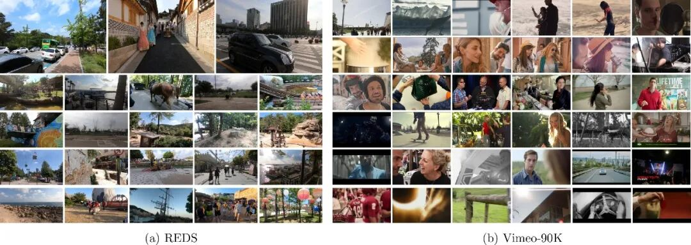

# 【视频专栏】基于深度学习的视频超分辨率重建算法进展

原创 自动化学报 自动化学报 2026-05-29 17:02 北京

> 原文地址: [https://mp.weixin.qq.com/s/TUHTVVcjQbUlxowoX4XcTw](https://mp.weixin.qq.com/s/TUHTVVcjQbUlxowoX4XcTw)

**[唐麒](https://www.aas.net.cn/cn/article/doi/10.16383/j.aas.c240235)[,](https://www.aas.net.cn/cn/article/doi/10.16383/j.aas.c240235) [赵耀](https://www.aas.net.cn/cn/article/doi/10.16383/j.aas.c240235)[,](https://www.aas.net.cn/cn/article/doi/10.16383/j.aas.c240235) [刘美琴](https://www.aas.net.cn/cn/article/doi/10.16383/j.aas.c240235)[,](https://www.aas.net.cn/cn/article/doi/10.16383/j.aas.c240235) [姚超](https://www.aas.net.cn/cn/article/doi/10.16383/j.aas.c240235)[.](https://www.aas.net.cn/cn/article/doi/10.16383/j.aas.c240235) [基于深度学习的视频超分辨率重建算法进展](https://www.aas.net.cn/cn/article/doi/10.16383/j.aas.c240235)[.](https://www.aas.net.cn/cn/article/doi/10.16383/j.aas.c240235) [自动化学报](https://www.aas.net.cn/cn/article/doi/10.16383/j.aas.c240235)[, 2025, 51(7): 1480−1524](https://www.aas.net.cn/cn/article/doi/10.16383/j.aas.c240235)** 

点击即可观看视频

  

  

**摘要**

视频超分辨率重建是底层计算机视觉任务中的一个重要研究方向, 旨在利用低分辨率视频的帧内和帧间信息, 重建具有更多细节和内容一致的高分辨率视频, 有助于提升下游任务性能和改善用户观感体验. 近年来, 基于深度学习的视频超分辨率重建算法大量涌现, 在帧间对齐、信息传播等方面取得突破性的进展. 首先, 在简述视频超分辨率重建任务的基础上, 梳理现有的视频超分辨率重建的公共数据集及相关算法; 接着, 详细综述基于深度学习的视频超分辨率重建算法的创新性工作进展情况; 最后, 总结视频超分辨率重建算法面临的挑战及未来的发展趋势.

  

  

  

**引言**

随着便携式消费级相机的发展和第五代移动通信技术的普及, 视频已成为人们日常生活中最主要的视觉媒介之一. 在用户追求高清画质的同时, 相机拍摄得到的视频受到采集设备精度、网络传输带宽等因素的制约, 造成视频的成像分辨率和采样频率低、存在噪声等复杂的退化问题. 由图像超分辨率重建延伸而来的视频超分辨率重建(VSR)旨在将低分辨率(LR)视频重建为相应的高分辨率(HR)版本. 视频超分既要求复原的高分辨率视频与给定的低分辨率视频保持内容的一致性和连续性,同时又希望重建的高分辨率视频细节清晰、真实和自然, 广泛应用于影像修复\[1\]、网络传输\[2\]和智能分析\[3−4\]等领域.

  

视频超分辨率重建算法可以利用相邻帧包含的高度相关的时序信息, 但时序信息未对齐会导致重建的视频出现帧间内容不连贯、抖动的现象, 限制视频超分辨率重建性能的提升. 因此, 如何有效利用视频的帧间信息是视频超分辨率重建研究的热点和难点. 早期的VSR算法直接将图像超分的插值法(如双线性插值、双立方插值)应用于每帧视频的高分辨率重建, 并未考虑视频的时间维度造成重建视频出现帧间不连贯的问题. 因此, 有些算法结合贝叶斯\[5\]、最大期望\[6\]等技术和视频的时空信息提升视频的重建质量. 然而, 这些方法受限于严苛的假设条件, 不足以适应复杂多变的视频内容. 此外,这些方法难以有效复原丢失的高频信息, 无法满足目前高清显示设备的需求.

  

伴随着深度学习技术在图像处理领域的成功应用\[7−8\], 基于深度学习的视频超分辨率重建算法也迅速发展. 得益于强大的非线性学习能力, 基于深度学习的VSR算法可以有效提取和融合视频中的时空信息, 获得优于传统VSR算法的重建效果. 基于深度学习的VSR算法主要包括对齐、融合和重建三个部分. 其中, 对齐模块利用光流、可变形卷积等方法可以解决卷积操作导致的感受野受限、应对相邻帧中较大运动变化造成的模糊和伪影问题. 基于循环神经网络的方法利用之前视频帧信息的隐状态完成视频帧的对齐和融合, 克服卷积神经网络无法建模长程时序信息的缺陷. 基于Transformer的VSR算法利用注意力机制获取视频帧内和帧间的相关性, 获得优于其他网络结构的特征表示能力和视频的重建性能, 可以并行处理所有视频帧, 不存在循环网络的特征衰减和噪声放大等问题. 上述算法主要将VSR视作回归问题, 在大规模视频序列数据集上学习从低分辨率到高分辨率视频帧的非线性映射, 但重建的视频帧中存在纹理模糊的问题.基于生成模型的VSR算法可以在保持重建视频时序一致性的同时, 有效地建模高分辨率视频帧的数据分布, 这类方法复原的高分辨率视频中包含清晰、真实的细节.

  

本文聚焦于基于深度学习的VSR算法, 从研究进展与存在的问题及挑战等方面全面梳理VSR,并系统概述相关技术的进展情况.

  

**视频超分辨率重建数据集REDS和Vimeo-90K示例**

  

  

**正文框架**

1  视频超分辨率重建

2  基于深度学习的视频超分辨率重建算法

  2.1  基于并行架构的VSR算法

  2.2  基于循环架构的VSR算法

3  视频超分中的帧间对齐方式

4  难点和未来研究

  4.1  在线视频超分辨率重建

  4.2  真实场景下的视频超分辨率重建

  4.3  任意上采样因子的视频超分辨率重建

  4.4  生成范式的视频超分辨率重建

  4.5  结合语义感知的视频超分辨率重建

  4.6  视频超分辨率重建网络的可解释性

5  结束语

  

  

  

**参考文献（部分）**

  

\[1\]  Wan Z Y, Zhang B, Chen D D, Liao J. Bringing old films back to life. In: Proceedings of the IEEE/CVF Conference on Computer Vision and Pattern Recognition (CVPR). New Orleans, USA: IEEE, 2022. 17673−17682

\[2\]  Li G, Ji J, Qin M H, Niu W, Ren B, Afghah F, et al. Towards high-quality and efficient video super-resolution via spatial-temporal data overfitting. In: Proceedings of the IEEE/CVF Conference on Computer Vision and Pattern Recognition (CVPR). Vancouver, Canada: IEEE, 2023. 10259−10269

\[3\]  Zhu H G, Wei Y C, Liang X D, Zhang C J, Zhao Y. CTP: Towards vision-language continual pretraining via compatible momentum contrast and topology preservation. In: Proceedings of the IEEE/CVF International Conference on Computer Vision (ICCV). Paris, France: IEEE, 2023. 22200−22210

\[4\]  Jiao S Y, Wei Y C, Wang Y W, Zhao Y, Shi H. Learning mask-aware CLIP representations for zero-shot segmentation. In: Proceedings of the 37th International Conference on Neural Information Processing Systems. New Orleans, USA: Curran Associates Inc., 2023. Article No. 1549

\[5\]  Liu C, Sun D Q. On Bayesian adaptive video super resolution. _IEEE Transactions on Pattern Analysis and Machine Intelligence_, 2014, **36**(2): 346−360 doi: [10.1109/TPAMI.2013.127](http://dx.doi.org/10.1109/TPAMI.2013.127)

\[6\]  Ma Z Y, Liao R J, Tao X, Xu L, Jia J Y, Wu E H. Handling motion blur in multi-frame super-resolution. In: Proceedings of the IEEE Conference on Computer Vision and Pattern Recognition (CVPR). Boston, USA: IEEE, 2015. 5224−5232

\[7\]  Wu Y X, Li F, Bai H H, Lin W S, Cong R M, Zhao Y. Bridging component learning with degradation modelling for blind image super-resolution. _IEEE Transactions on Multimedia_, DOI: [10.1109/TMM.2022.3216115](http://dx.doi.org/10.1109/TMM.2022.3216115)

\[8\]  张帅勇, 刘美琴, 姚超, 林春雨, 赵耀. 分级特征反馈融合的深度图像超分辨率重建. 自动化学报, 2022, **48**(4): 992−1003   

Zhang Shuai-Yong, Liu Mei-Qin, Yao Chao, Lin Chun-Yu, Zhao Yao. Hierarchical feature feedback network for depth super-resolution reconstruction. _Acta Automatica Sinica_, 2022, **48**(4): 992−1003

\[9\]  Charbonnier P, Blanc-Feraud L, Aubert G, Barlaud M. Two deterministic half-quadratic regularization algorithms for computed imaging. In: Proceedings of the 1st International Conference on Image Processing (ICIP). Austin, USA: IEEE, 1994. 168−172

\[10\]  Lai W S, Huang J B, Ahuja N, Yang M H. Fast and accurate image super-resolution with deep Laplacian pyramid networks. IEEE Transactions on Pattern Analysis and Machine Intelligence, 2019, 41(11): 2599−2613 doi: [10.1109/TPAMI.2018.2865304](http://dx.doi.org/10.1109/TPAMI.2018.2865304)

  

  

**作者简介**

唐　麒

北京交通大学信息科学研究所硕士研究生. 主要研究方向为图像与视频复原.

赵　耀

北京交通大学信息科学研究所教授. 主要研究方向为图像/视频压缩, 数字媒体内容安全, 媒体内容分析与理解, 人工智能.

刘美琴

北京交通大学信息科学研究所教授. 主要研究方向为多媒体信息处理, 三维视频处理, 视频智能编码.本文通信作者.

姚　超

北京科技大学计算机与通信工程学院副教授. 主要研究方向为图像/视频压缩, 计算机视觉和人机交互.

  

**热**

**点**

**文**

**章**

[【视频专栏】基于红外与可见光视觉的高炉铁口铁水温度场在线检测](https://mp.weixin.qq.com/s?__biz=MzI2NjA3MzM5MA==&mid=2650005310&idx=1&sn=e7007609413190096a34ad5ebe1e159b&scene=21#wechat_redirect)

[【视频专栏】分布式在线鞍点问题的Bandit反馈优化算法](https://mp.weixin.qq.com/s?__biz=MzI2NjA3MzM5MA==&mid=2650005186&idx=1&sn=3fb2f43130b6c1cfff68f611ef5965cf&scene=21#wechat_redirect)

[【视频专栏】基于分层仿生神经网络的多机器人协同区域搜索算法](https://mp.weixin.qq.com/s?__biz=MzI2NjA3MzM5MA==&mid=2650005164&idx=1&sn=e65702f1abd81cecb8bcf3f7a74eafc4&scene=21#wechat_redirect)

[【视频专栏】基于模糊神经网络在线自学习的多智能体一致性控制](https://mp.weixin.qq.com/s?__biz=MzI2NjA3MzM5MA==&mid=2650005057&idx=1&sn=5919278d0126e1c7051914699a44f47d&scene=21#wechat_redirect)

[【视频专栏】基于神经网络ODE和非线性MPC的DEA建模与控制](https://mp.weixin.qq.com/s?__biz=MzI2NjA3MzM5MA==&mid=2650005037&idx=1&sn=9f6ac9af5e47b1ab340187de90cbf70c&scene=21#wechat_redirect)

[【视频专栏】基于自适应原型特征类矫正的小样本学习方法](https://mp.weixin.qq.com/s?__biz=MzI2NjA3MzM5MA==&mid=2650005012&idx=1&sn=4939cb092f48ea688e273e9993db5b59&scene=21#wechat_redirect)

[【视频专栏】面向源网荷的智能化数据协同推断技术研究综述](https://mp.weixin.qq.com/s?__biz=MzI2NjA3MzM5MA==&mid=2650004733&idx=1&sn=f92cbe358200c02e0fcbab490b5e76e9&scene=21#wechat_redirect)

[【视频专栏】提示学习在计算机视觉中的分类、应用及展望](https://mp.weixin.qq.com/s?__biz=MzI2NjA3MzM5MA==&mid=2650004704&idx=1&sn=9879e756a21d1700d28da3f94707b514&scene=21#wechat_redirect)

[【视频专栏】追逃博弈问题研究综述](https://mp.weixin.qq.com/s?__biz=MzI2NjA3MzM5MA==&mid=2650004638&idx=1&sn=7baf0f46669d8590e0c64fea151abea5&scene=21#wechat_redirect)

[【视频专栏】基于视觉属性的多模态可解释图像分类方法](https://mp.weixin.qq.com/s?__biz=MzI2NjA3MzM5MA==&mid=2650004507&idx=1&sn=d583b2ffc2a80019358827e8853577ff&scene=21#wechat_redirect)

[【视频专栏】数据驱动自适应评判控制研究进展](https://mp.weixin.qq.com/s?__biz=MzI2NjA3MzM5MA==&mid=2650004208&idx=1&sn=3ed16fce5fc87a38960ccc5b5c0ca7b7&scene=21#wechat_redirect)

[【视频专栏】基于MARL-MHSA架构的水下仿生机器人协同围捕策略: 数据驱动建模与分布式策略优化](https://mp.weixin.qq.com/s?__biz=MzI2NjA3MzM5MA==&mid=2650004191&idx=1&sn=423cfa393c8f49c1350ee58860215f65&scene=21#wechat_redirect)

[【视频专栏】多智能体系统协同互估计与控制一体化框架](https://mp.weixin.qq.com/s?__biz=MzI2NjA3MzM5MA==&mid=2650004164&idx=1&sn=fde70f95730e129645b4b6303ad87de8&scene=21#wechat_redirect)

[【视频专栏】面向智能生化实验室的机器人感知、规划与控制技术](https://mp.weixin.qq.com/s?__biz=MzI2NjA3MzM5MA==&mid=2650004145&idx=1&sn=cf58bcba992f71140b1ce75fa27bbad3&scene=21#wechat_redirect)

[【视频专栏】基于最小化背景判别性知识的小样本目标检测算法](https://mp.weixin.qq.com/s?__biz=MzI2NjA3MzM5MA==&mid=2650004140&idx=1&sn=daf20cec22bbc4a37b9801f33f186c6c&scene=21#wechat_redirect)

[【视频专栏】输入受限的挠性航天器全驱姿态饱和控制](https://mp.weixin.qq.com/s?__biz=MzI2NjA3MzM5MA==&mid=2650004116&idx=1&sn=a9656a34f333263f70a61b72bbd4e41f&scene=21#wechat_redirect)

[【视频专栏】嵌套运动饱和下分布式多移动机器人反振荡安全编队控制](https://mp.weixin.qq.com/s?__biz=MzI2NjA3MzM5MA==&mid=2650004106&idx=1&sn=3c2d6544c2a3b36858f85f204bc937a8&scene=21#wechat_redirect)

[【视频专栏】基于变分稀疏高斯过程的多机器人协同感知与围捕](https://mp.weixin.qq.com/s?__biz=MzI2NjA3MzM5MA==&mid=2650004101&idx=1&sn=207b1a7ead7c70e21eb3bed464eafdf0&scene=21#wechat_redirect)

[【视频专栏】基于双向多视角关系图卷积网络的论辩对抽取方法](https://mp.weixin.qq.com/s?__biz=MzI2NjA3MzM5MA==&mid=2650004090&idx=1&sn=af0153db5ed11833e983bc02e3bfbf45&scene=21#wechat_redirect)

[【视频专栏】模型参数不确定下多无人艇系统固定时间二分编队跟踪控制](https://mp.weixin.qq.com/s?__biz=MzI2NjA3MzM5MA==&mid=2650004078&idx=1&sn=b6f17a39b563f6c11aa4c881a9d3037c&scene=21#wechat_redirect)

[【视频专栏】具身智能自主无人系统技术](https://mp.weixin.qq.com/s?__biz=MzI2NjA3MzM5MA==&mid=2650004061&idx=1&sn=fcbda0f1fefe62aba8dde5829d87f7a5&scene=21#wechat_redirect)

[【视频专栏】异构不确定二阶非线性多智能体系统事件触发状态趋同](https://mp.weixin.qq.com/s?__biz=MzI2NjA3MzM5MA==&mid=2650004056&idx=1&sn=eb2dc171b51c1d59524958252bac12c1&scene=21#wechat_redirect)

[【视频专栏】基于大语言模型的兵棋推演智能决策技术](https://mp.weixin.qq.com/s?__biz=MzI2NjA3MzM5MA==&mid=2650004046&idx=1&sn=cd5d381d88804a31fc44a105355a72ac&scene=21#wechat_redirect)

[【视频专栏】面向大模型时代的持续学习方法论演变](https://mp.weixin.qq.com/s?__biz=MzI2NjA3MzM5MA==&mid=2650004033&idx=1&sn=11b48c7a87bdf68e51e3fb89bde1d962&scene=21#wechat_redirect)

[【视频专栏】电力设施多模态精细化机器人巡检关键技术及应用](https://mp.weixin.qq.com/s?__biz=MzI2NjA3MzM5MA==&mid=2650004005&idx=1&sn=c67ac894129f6020a65ddb8d1a096b6f&scene=21#wechat_redirect)

[【视频专栏】基于大模型的具身智能系统综述](https://mp.weixin.qq.com/s?__biz=MzI2NjA3MzM5MA==&mid=2650003856&idx=1&sn=4f39c045003477a848d3a100353812ca&scene=21#wechat_redirect)

[【视频专栏】无人飞行器集群自主控制: 预设性能驱动的安全编队控制](https://mp.weixin.qq.com/s?__biz=MzI2NjA3MzM5MA==&mid=2650003850&idx=1&sn=3510c49397b356de4f4a829af18ee0ba&scene=21#wechat_redirect)

[【视频专栏】时间序列分类模型的集成对抗训练防御方法](https://mp.weixin.qq.com/s?__biz=MzI2NjA3MzM5MA==&mid=2650003845&idx=1&sn=047cf795b25d206fc00e2ccec6106bab&scene=21#wechat_redirect)

**期**

**刊**

**动**

**态**

[《自动化学报》致谢2025年度审稿专家](https://mp.weixin.qq.com/s?__biz=MzI2NjA3MzM5MA==&mid=2650004684&idx=1&sn=96a0950f58020801aeac34d26daf6b06&scene=21#wechat_redirect)

[《自动化学报》蝉联CJCR学科第1，持续入选中国最具国际影响力学术期刊](https://mp.weixin.qq.com/s?__biz=MzI2NjA3MzM5MA==&mid=2650004271&idx=1&sn=ebc0b42a493d74d6ce5c6e12d8ab522b&scene=21#wechat_redirect)

[《自动化学报》13篇文章入选2025年度“领跑者5000”顶尖论文](https://mp.weixin.qq.com/s?__biz=MzI2NjA3MzM5MA==&mid=2650004163&idx=1&sn=c1a1003330bb1cc5b3b4cf44d5ae5525&scene=21#wechat_redirect)

[《自动化学报》致谢审稿人（2024年度）](https://mp.weixin.qq.com/s?__biz=MzI2NjA3MzM5MA==&mid=2650002940&idx=1&sn=143124df4e9f117cf65dba731316d450&scene=21#wechat_redirect)

[》CJCR发布：自动化学报各项主要指标蝉联第1](http://mp.weixin.qq.com/s?__biz=MzI2NjA3MzM5MA==&mid=2650001473&idx=1&sn=eb2e44a48f804b67cb3a4c9709aae25c&chksm=f294d400c5e35d162db46a5d31d07f904cf89fbe646f5488b4e97b743effd29db6c0a5014c06&scene=21#wechat_redirect)

[》自动化学报排名第一，持续入选中国权威学术期刊（A+）](http://mp.weixin.qq.com/s?__biz=MzI2NjA3MzM5MA==&mid=2649995334&idx=1&sn=bf87bcddd566917490e06918b8895fe2&chksm=f294bc07c5e335115415c45903d01f3133749582e672a81464c428dcb5f845aec3f9b109ea5f&scene=21#wechat_redirect)

[》自动化学报蝉联百种中国杰出期刊称号](http://mp.weixin.qq.com/s?__biz=MzI2NjA3MzM5MA==&mid=2649990067&idx=1&sn=4a6e171d54d1c781c8809f67f05967c1&chksm=f294a7f2c5e32ee4cac04ce10b0b413f2d356bb2b80e6d4426c65df3df25e7cd87eaaa0a3954&scene=21#wechat_redirect)

[》自动化学报连续11年入选国际影响力TOP期刊榜单](http://mp.weixin.qq.com/s?__biz=MzI2NjA3MzM5MA==&mid=2649981948&idx=1&sn=6b850c9c095f2e9cbbb899c8b4a8149d&chksm=f29487bdc5e30eab3df0fb761e7f00b3c4945f7e0e971483a4c5f37434032e69f76d2f9f4160&scene=21#wechat_redirect)

[》自动化学报多篇论文入选中国百篇最具影响国内论文和中国精品期刊顶尖论文](http://mp.weixin.qq.com/s?__biz=MzI2NjA3MzM5MA==&mid=2649961152&idx=1&sn=4a5e9e4b84879f4cde4e13a0ef97272c&chksm=f2943681c5e3bf97d7770c9623dac869b283b3ea83f3d320017974033e361d8b999134a8bdff&scene=21#wechat_redirect)

[》《自动化学报》挺进世界期刊影响力指数Q1区](http://mp.weixin.qq.com/s?__biz=MzI2NjA3MzM5MA==&mid=2649957452&idx=1&sn=c5fa8ac9c581e4ae3de2e7956e603dca&chksm=f294200dc5e3a91bb250e25fd6f7e47dc1114ad6fdf1762a7bfc440f789a059f1de455584e66&scene=21&token=489162852&lang=zh_CN#wechat_redirect)

**期**

**刊**

**目**

**录**

[》2026年第4期](https://mp.weixin.qq.com/s?__biz=MzI2NjA3MzM5MA==&mid=2650005276&idx=1&sn=e4a39b1ca505af90d364b8faa0e78a22&scene=21#wechat_redirect)

[》2026年第3期](https://mp.weixin.qq.com/s?__biz=MzI2NjA3MzM5MA==&mid=2650005133&idx=1&sn=8fb158023205787e7beb85ee09aa08a8&scene=21#wechat_redirect)

[》2026年第2期](https://mp.weixin.qq.com/s?__biz=MzI2NjA3MzM5MA==&mid=2650004974&idx=1&sn=6a9668ba37f5240dbbe625ddd1868477&scene=21#wechat_redirect)

[》2026年第1期](https://mp.weixin.qq.com/s?__biz=MzI2NjA3MzM5MA==&mid=2650004836&idx=1&sn=00f0ae368a2f0b9bbe51e5550126be0b&scene=21#wechat_redirect)

[》2025年第12期](https://mp.weixin.qq.com/s?__biz=MzI2NjA3MzM5MA==&mid=2650004594&idx=1&sn=6a0faef723d7ce2252705823126505f2&scene=21#wechat_redirect)

[》2025年第11期](https://mp.weixin.qq.com/s?__biz=MzI2NjA3MzM5MA==&mid=2650004484&idx=1&sn=85c39ee396019509fdfa0f6e6a2f2d26&scene=21#wechat_redirect)

[》2025年第10期](https://mp.weixin.qq.com/s?__biz=MzI2NjA3MzM5MA==&mid=2650004154&idx=1&sn=52c9de73803192a418508b0cd99af96e&scene=21#wechat_redirect)

[》2025年第9期](https://mp.weixin.qq.com/s?__biz=MzI2NjA3MzM5MA==&mid=2650004122&idx=1&sn=55380a1aa7ef6a0efaaa6e92094132be&scene=21#wechat_redirect)

[》2025年第8期](https://mp.weixin.qq.com/s?__biz=MzI2NjA3MzM5MA==&mid=2650004085&idx=1&sn=574db83094f500887dbca0acd3a04607&scene=21#wechat_redirect)

[》2025年第7期](https://mp.weixin.qq.com/s?__biz=MzI2NjA3MzM5MA==&mid=2650004068&idx=1&sn=744c424fe14e7c389bbd6011bc23b2fe&scene=21#wechat_redirect)

[》2025年第6期](https://mp.weixin.qq.com/s?__biz=MzI2NjA3MzM5MA==&mid=2650004010&idx=1&sn=d3ca761542c86da1a2474f37e3d1b9d6&scene=21#wechat_redirect)

[》2025年第5期](https://mp.weixin.qq.com/s?__biz=MzI2NjA3MzM5MA==&mid=2650003999&idx=1&sn=f05167a6cfc0908fdb59f45c4cefd57a&scene=21#wechat_redirect)

[》2025年第4期](https://mp.weixin.qq.com/s?__biz=MzI2NjA3MzM5MA==&mid=2650003831&idx=1&sn=9de9fa20d954d43779505cfacfdbf7fb&scene=21#wechat_redirect)

[》2025年第3期](https://mp.weixin.qq.com/s?__biz=MzI2NjA3MzM5MA==&mid=2650003799&idx=1&sn=8ecbcce5498b68c6587634c701499599&scene=21#wechat_redirect)

[》2025年第2期](https://mp.weixin.qq.com/s?__biz=MzI2NjA3MzM5MA==&mid=2650003746&idx=1&sn=5bcd26b86b5f5653733c49bf9fa9662e&scene=21#wechat_redirect)

[》2025年第1期](https://mp.weixin.qq.com/s?__biz=MzI2NjA3MzM5MA==&mid=2650003737&idx=1&sn=b44902136950ec8dd158fe7c5b97bc6c&scene=21#wechat_redirect)

[》2024年第12期](https://mp.weixin.qq.com/s?__biz=MzI2NjA3MzM5MA==&mid=2650002764&idx=1&sn=9847e270aa7723e028c292dec9382ff2&scene=21#wechat_redirect)

[》2024年第11期](https://mp.weixin.qq.com/s?__biz=MzI2NjA3MzM5MA==&mid=2650002423&idx=1&sn=9c2c44f29a39bba071e7d5cebd362787&scene=21#wechat_redirect)

[》2024年第10期](http://mp.weixin.qq.com/s?__biz=MzI2NjA3MzM5MA==&mid=2650001656&idx=1&sn=be757a7fc7721faaa6454757824515df&chksm=f294d4b9c5e35dafdced997b4fe2e95e25e1306f519177ccf279272a81eb1f04104cb9b26ca5&scene=21#wechat_redirect)

[》2024年第09期](http://mp.weixin.qq.com/s?__biz=MzI2NjA3MzM5MA==&mid=2650001568&idx=1&sn=601ba42f8f1948156fed9bfc695ab096&chksm=f294d4e1c5e35df7f86458a067f51531f114442de83b9747f3970572b1567585d73c21a79418&scene=21#wechat_redirect)

[》2024年第08期](http://mp.weixin.qq.com/s?__biz=MzI2NjA3MzM5MA==&mid=2650001113&idx=1&sn=c9c698f9c1089080b58e66f6815d9a6b&chksm=f294ca98c5e3438e33f6d89b271439f7d4aad102096e7117709a2323a27befab5653450275b7&scene=21#wechat_redirect)

[》2024年第07期](http://mp.weixin.qq.com/s?__biz=MzI2NjA3MzM5MA==&mid=2650000761&idx=1&sn=3a92db7947e5ee87cc5f09e7e5fb1b75&chksm=f294c938c5e3402ee0152feef2328cabe3de62652288f20cb7105ffb95b77e5dd5f29dcb9b10&scene=21#wechat_redirect)

[》2024年第06期](http://mp.weixin.qq.com/s?__biz=MzI2NjA3MzM5MA==&mid=2649998994&idx=1&sn=e85c7e5e341382aa802d6725484acc86&chksm=f294c2d3c5e34bc510298427cc30bba15d664707509f51346146e567fa0b1339fe08d6e237b7&scene=21#wechat_redirect)

[》2024年第05期](http://mp.weixin.qq.com/s?__biz=MzI2NjA3MzM5MA==&mid=2649997440&idx=1&sn=206e5535b1e208f218f0c02769155aa0&chksm=f294c4c1c5e34dd775e7fd252910ce73cf23916065222185aed3c780ba8c253b715df66e72f7&scene=21#wechat_redirect)

[》2024年第04期](http://mp.weixin.qq.com/s?__biz=MzI2NjA3MzM5MA==&mid=2649996742&idx=1&sn=b08c5e9f61c270c578d012da47f3b8ae&chksm=f294b987c5e33091fd024e3839b813bc27797c1ffc372525b5ac4e99c8fede5520abf672dd84&scene=21#wechat_redirect)

[》2024年第03期](http://mp.weixin.qq.com/s?__biz=MzI2NjA3MzM5MA==&mid=2649995269&idx=1&sn=6c10ec073a6d1218b48b62eabc65d5ef&chksm=f294bc44c5e3355256ed0dea32d9b262942c57a1f19aeb87eb12ffeb3e01aafb6a94076f05ad&scene=21#wechat_redirect)

[》2024年第02期](http://mp.weixin.qq.com/s?__biz=MzI2NjA3MzM5MA==&mid=2649994160&idx=1&sn=71e5ccf4a90c44f08b5f8077cf29c32b&chksm=f294b7f1c5e33ee724ca66de9170aa632babab162096a97a35bbafa1f288ce657ed921a3609d&scene=21#wechat_redirect)

[》2024年第01期](http://mp.weixin.qq.com/s?__biz=MzI2NjA3MzM5MA==&mid=2649993861&idx=1&sn=c7b42ca4677588ecb992557c9fa12139&chksm=f294b6c4c5e33fd2ee444f54c2df145bd007e09695d8748148b2cc1673bc7044884c9ca47832&scene=21#wechat_redirect)

  

  

  

**长按二维码｜关注我们**

**《自动化学报》服务号**

**联系我们**

**网站:** 

[https://www.aas.net.cn](https://www.aas.net.cn/)

**投稿:** 

[https://mc03.manuscriptcentral.com/aas-cn](https://mc03.manuscriptcentral.com/aas-cn) 

**电话:**  010-82544653（日常咨询和稿件处理） 

           010-82544677（录用后稿件处理）

**邮箱:**  aas@ia.ac.cn（日常咨询和稿件处理）

           aas\_editor@ia.ac.cn（录用后稿件处理）

**博客:** 

[http://blog.sina.com.cn/aasedit](http://blog.sina.com.cn/aaseditor)

**点击****阅读**原文 了解更多