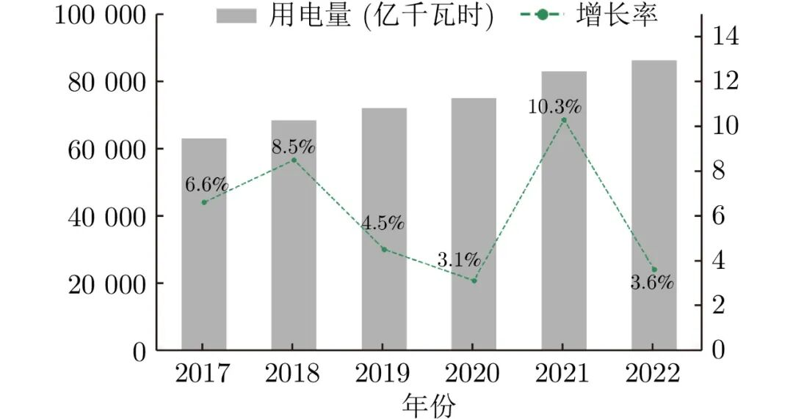

# 【视频专栏】电力设施多模态精细化机器人巡检关键技术及应用

原创 自动化学报 自动化学报 2025-05-29 17:00 北京

> 原文地址: [https://mp.weixin.qq.com/s/7LCjgiGhi07EV1pMsnK\_-g](https://mp.weixin.qq.com/s/7LCjgiGhi07EV1pMsnK_-g)

点击上方**蓝字**关注我们

  

张辉, 杜瑞, 钟杭, 曹意宏, 王耀南. [电力设施多模态精细化机器人巡检关键技术及应用](http://www.aas.net.cn/cn/article/doi/10.16383/j.aas.c230809). 自动化学报, 2025, 51(1): 20−42

1

摘要

     电力设施巡检对于加快电网基础设施智能化改造和智能微电网建设, 提高电力系统互补互济和智能调节能力的需求具有重要作用. 近年来, 智能巡检机器人开始在电力巡检中广泛应用, 在提高电力设施巡检效率和准确性、提升安全性、降低成本和促进电力智能化发展等方面发挥关键作用. 本文从电力巡检机器人的智能感知和导航技术出发, 重点介绍目标检测、语义分割、自主导航等共性关键技术的国内外发展现状. 然后以可见光红外双光融合、可见光图像和点云数据融合、声纹和可见光融合为例, 阐述电力场景多模态数据融合方式. 并进一步介绍电力部件精准分割和异物检测、线路点云杆塔倾斜检测、输电线路覆冰多模态检测和电力架空线路缺陷分析及台账异常检测等电力设施多模态机器人相关案例. 最后探讨电力设施多模态精细化机器人巡检关键技术的发展趋势和所面临的挑战.

  

2

引言

    电力巡检在保障电力系统稳定运行中具有重要作用. 如图1所示, 全国的用电量呈现出稳步上升的态势, 电力巡检对于确保我国面对用电量持续增长挑战时的电力供应安全、稳定和高效至关重要. 随着电力行业加速转型升级, 为了使巡检工作变得更加高效和准确, 应对人工巡检耗时耗力且难以到达高山江河等巡检盲区的挑战\[1−2\], 智能巡检机器人在电力巡检中得到广泛应用. 电力巡检机器人具有提高巡检效率、准确性、安全性, 降低成本和促进电力智能化发展的关键作用. 

  

图 1  近年全国总用电量趋势(单位: 亿千瓦时)

Fig. 1  Trend of national total electricity consumption in recent years (unit: 100 million kW·h)

  

电力设施精细化多模态机器人巡检是一项集成多种感知技术、机器人技术和人工智能的综合性技术, 旨在提高电力系统的运行安全、稳定性和效率. 该领域涵盖了地面机器人、空中机器人(无人机)、自主水下机器人等多种类型的机器人系统, 它们通过集成视觉、声音、热成像等多模态感知技术, 对电力设施进行自动化、智能化的检测与评估. 世界各国高度重视电力巡检机器人的发展, 例如美国自上世纪80年代起开始研发电力巡检机器人, 并逐步推广应用, 而欧盟和日本也在近年推出了促进电力行业中人工智能应用的具体目标和计划. 我国也发布了 《智能能源行动计划》 和 《“十四五”通用航空发展专项规划》, 提出了加快电力行业智能化改造与推进能源数字化转型的目标和措施, 其中包括智能电网建设、能源大数据平台建设等.  

  

智能感知是实现电力设施巡检的基础关键技术, 可以嵌入到电力设施巡检机器人中, 以实现电力设备的定位和分类, 这可以进一步被认为是机器人传感、自动导航和自主检查的基础\[3−4\]. 智能感知通过激光雷达、可见光相机、多光谱相机和红外相机等成像设备进行数据采集, 并对采集到的目标场景数据进行语义理解和状态感知, 记录当前场景的巡检结果. 例如, 变电站红外图像精准检测任务中\[5\], 需要对无人机采集到的变电站电流互感器、断路器和隔离开关等部件进行检测. 在准确得到电力部件在图像中的位置信息后, 利用温度解译对相关电力部件进行分析, 根据是否出现温度异常判断电力设施是否存在潜在过热等危险. 通过这种巡检方式, 可以在出现故障前提前感知潜在风险, 及时采取相应措施, 避免过热产生电力故障甚至严重的火灾, 有效防范了电力故障, 减少了人工巡检的主观干扰, 提升了巡检准确性, 降低了人力成本. 目前, 深度学习和大数据技术的快速发展使得电力场景的智能巡检得到广泛应用. 智能巡检前期通过机器人摄像头、激光雷达等设备采集数据, 并送入目标检测或语义分割模型进行训练, 训练好的模型就可以在很多巡检任务上取得显著性优越结果. 同时, 在成本和安全性能上也实现了对人工巡检的压倒性胜利. 

  

然而, 在实际应用中, 复杂多变的环境给机器人带来了语义理解的难度, 并且由于数据采集本身的局限性, 单一模态的数据难以对巡检场景实现精准数据表征, 巡检结果往往较为粗糙. 例如, 仅使用可见光模态的情况下, 恶劣的天气、较差的照明或低对比度会降低视觉传感器的图像质量, 而杂乱的背景、极端的遮挡或密集的物体可能会降低基于视觉图像的语义分割方法的性能\[6\]; 而只使用红外模态完成场景理解后进行温度解译, 会由于红外图像的分辨率低导致电力部件检测的精度不高, 影响后续温度分析的准确性; 对于点云模态, 在杆塔或导线检测任务中, 仅有坐标信息而缺乏颜色和纹理信息会由于难以区分背景与前景而影响检测性能. 因此, 开展电力设施的多模态精细化智能化机器人巡检势在必行. 通过多模态数据融合, 电力巡检机器人可以利用不同数据模态间的互补性, 构建出更精准、更全面、更一致的精细化智能感知模型, 提升特征表达的信息量和判别性, 为电力业务实施提供更加准确、高效、灵活的业务辅助报告. 

  

3

正文框架

1\. 电力设施多模态机器人巡检研究现状

2\. 电力设施巡检感知和导航关键技术

  2.1 电力设施机器人巡检2D感知技术

  2.2 电力设施机器人巡检3D感知技术

  2.3 智能巡检机器人导航关键技术

3\. 电力设施多模态精细化巡检关键技术

  3.1 可见光红外双光融合技术

  3.2 可见光图像和点云融合关键技术

  3.3 声学和光学图像融合相关技术

4\. 电力设施多模态精细化机器人巡检应用

  4.1 电力部件精准分割和输电线路异物检测

  4.2 电力线路点云多模态精细化检测

  4.3 电力架空线路缺陷分析及台账异常检测

5\. 现有技术挑战与未来发展趋势

  5.1 现有技术挑战

  5.2 未来发展趋势

6\. 结束语

  

**部分文献**

  

\[1\] 吴庆, 赵涛, 佃松宜, 郭锐, 李胜川, 方红帏, 等. 基于FPSO的电力巡检机器人的广义二型模糊逻辑控制. 自动化学报, 2022, 48(6): 1482−1492

Wu Qing, Zhao Tao, Dian Song-Yi, Guo Rui, Li Sheng-Chuan, Fang Hong-Wei, et al. General type-2 fuzzy logic control for a power-line inspection robot based on FPSO. Acta Automatica Sinica, 2022, 48(6): 1482−1492

  

\[2\] Dian S Y, Chen L, Hoang S, Pu M, Liu J Y. Dynamic balance control based on an adaptive gain-scheduled backstepping scheme for power-line inspection robots. IEEE/CAA Journal of Automatica Sinica, 2019, 6(1): 198−208 doi: 10.1109/JAS.2017.7510721

  

\[3\] 王耀南, 江一鸣, 姜娇, 张辉, 谭浩然, 彭伟星, 等. 机器人感知与控制关键技术及其智能制造应用. 自动化学报, 2023, 49(3): 494−513

Wang Yao-Nan, Jiang Yi-Ming, Jiang Jiao, Zhang Hui, Tan Hao-Ran, Peng Wei-Xing, et al. Key technologies of robot perception and control and its intelligent manufacturing applications. Acta Automatica Sinica, 2023, 49(3): 494−513

  

\[4\] 张振国, 毛建旭, 谭浩然, 王耀南, 张雪波, 江一鸣. 重大装备制造多机器人任务分配与运动规划技术研究综述. 自动化学报, 2024, 50(1): 21−41

Zhang Zhen-Guo, Mao Jian-Xu, Tan Hao-Ran, Wang Yao-Nan, Zhang Xue-Bo, Jiang Yi-Ming. A review of task allocation and motion planning for multi-robot in major equipment manufacturing. Acta Automatica Sinica, 2024, 50(1): 21−41

  

\[5\] Li J Q, Xu Y Q, Nie K H, Cao B F, Zuo S N, Zhu J. PEDNet: A lightweight detection network of power equipment in infrared image based on YOLOv4-tiny. IEEE Transactions on Instrumentation and Measurement, 2023, 72: Article No. 5004312

  

\[6\] Chen G, Shao F, Chai X L, Chen H W, Jiang Q P, Meng X C, et al. CGMDRNet: Cross-guided modality difference reduction network for RGB-T salient object detection. IEEE Transactions on Circuits and Systems for Video Technology, 2022, 32(9): 6308−6323 doi: 10.1109/TCSVT.2022.3166914

  

**作者简介**

  

  

**张辉**，湖南大学机器人学院教授. 主要研究方向为机器视觉, 图像处理和机器人控制.

  

**杜瑞**，湖南大学机器人学院博士研究生. 2020年获得湘潭大学硕士学位. 主要研究方向为机器视觉, 图像处理. 本文通信作者.

  

**钟杭**，湖南大学机器人学院副教授. 分别于2013年、2016年和2020年获得湖南大学电气与信息工程学院自动化科学专业学士、硕士和博士学位. 主要研究方向为航空机器人, 多机器人系统, 视觉伺服, 视觉导航和非线性控制.

  

**曹意宏**，湖南大学机器人学院博士研究生. 2021年获得湖南师范大学硕士学位. 主要研究方向为计算机视觉.

  

**王耀南**，中国工程院院士, 湖南大学电气与信息工程学院教授. 1995 年获得湖南大学博士学位. 主要研究方向为机器人学, 智能控制和图像处理.

  

  

**热**

**点**

**文**

**章**

[》【视频专栏】无人飞行器集群自主控制: 预设性能驱动的安全编队控制](https://mp.weixin.qq.com/s?__biz=MzI2NjA3MzM5MA==&mid=2650003850&idx=1&sn=3510c49397b356de4f4a829af18ee0ba&scene=21#wechat_redirect)

[》【视频专栏】时间序列分类模型的集成对抗训练防御方法](https://mp.weixin.qq.com/s?__biz=MzI2NjA3MzM5MA==&mid=2650003845&idx=1&sn=047cf795b25d206fc00e2ccec6106bab&scene=21#wechat_redirect)

[》【视频专栏】基于零和微分博弈的航天器编队通信链路故障容错控制](https://mp.weixin.qq.com/s?__biz=MzI2NjA3MzM5MA==&mid=2650003823&idx=1&sn=f2a388ad3c284f99b32a357c4388a89a&scene=21#wechat_redirect)

[》【视频专栏】行人惯性定位新动态: 基于神经网络的方法、性能与展望](https://mp.weixin.qq.com/s?__biz=MzI2NjA3MzM5MA==&mid=2650003817&idx=1&sn=0bf22ec6111160539e4f68d1d7cd2581&scene=21#wechat_redirect)

[》【视频专栏】前额叶皮层启发的Transformer模型应用及其进展](https://mp.weixin.qq.com/s?__biz=MzI2NjA3MzM5MA==&mid=2650003789&idx=1&sn=4628505b878c4a478187bdb5a5cd457f&scene=21#wechat_redirect)

[》【视频专栏】基于仿真机理和改进回归决策树的二噁英排放建模](https://mp.weixin.qq.com/s?__biz=MzI2NjA3MzM5MA==&mid=2650003776&idx=1&sn=7d080fe02d7b365c207584c80925dedc&scene=21#wechat_redirect)

[》【视频专栏】收缩、分离和聚合: 面向长尾视觉识别的特征平衡方法](https://mp.weixin.qq.com/s?__biz=MzI2NjA3MzM5MA==&mid=2650003755&idx=1&sn=1590f91c56ed9184e626d556861b8a9f&scene=21#wechat_redirect)

[》【视频专栏】基于自组织递归小波神经网络的污水处理过程多变量控制](https://mp.weixin.qq.com/s?__biz=MzI2NjA3MzM5MA==&mid=2650003738&idx=1&sn=839dd5673821c09e521f344d595bc836&scene=21#wechat_redirect)

[》2024年度自动化学科国家自然科学基金项目申请与资助情况综述](https://mp.weixin.qq.com/s?__biz=MzI2NjA3MzM5MA==&mid=2650002664&idx=1&sn=849ab0044383328c3edb6f49bdf1c770&scene=21#wechat_redirect)

[》【视频专栏】多尺度视觉语义增强的多模态命名实体识别方法](https://mp.weixin.qq.com/s?__biz=MzI2NjA3MzM5MA==&mid=2650002642&idx=1&sn=77d0bde604b7f8f9b80889f77db2f0ec&scene=21#wechat_redirect)

[》【视频专栏】基于被动声呐音频信号的水中目标识别综述](https://mp.weixin.qq.com/s?__biz=MzI2NjA3MzM5MA==&mid=2650002637&idx=1&sn=5e362f1a68719bfa31be68145f111e90&scene=21#wechat_redirect)

[》【视频专栏】基于慢特征分析的分布式动态工业过程运行状态评价](https://mp.weixin.qq.com/s?__biz=MzI2NjA3MzM5MA==&mid=2650002613&idx=1&sn=2bdd9d5d7b20f19caf30be5b298a5850&scene=21#wechat_redirect)

[》【视频专栏】基于多尺度流模型的视觉异常检测研究](https://mp.weixin.qq.com/s?__biz=MzI2NjA3MzM5MA==&mid=2650001911&idx=1&sn=ecbca405c481ab60135af4c8156f4c22&scene=21#wechat_redirect)

[》【视频专栏】面向工业过程的图像生成及其应用研究综述](http://mp.weixin.qq.com/s?__biz=MzI2NjA3MzM5MA==&mid=2650001789&idx=1&sn=d995d02870670a8fcafb528eb2c63cc0&chksm=f294d53cc5e35c2a2507e5f6a7d93b78624ca8ff27e8754a9b21113e330cc1dee66b363d0d3c&scene=21#wechat_redirect)

[》【视频专栏】叠层模型驱动的书法文字识别方法研究](http://mp.weixin.qq.com/s?__biz=MzI2NjA3MzM5MA==&mid=2650001754&idx=1&sn=ee40b15ca961248756cfdaca99ef633e&chksm=f294d51bc5e35c0dc61feaffe2d794405fc3fc9df457e784f8524422b3f439eb0106519dc0e9&scene=21#wechat_redirect)

[》【视频专栏】外部干扰和随机DoS攻击下的网联车安全H∞ 队列控制](http://mp.weixin.qq.com/s?__biz=MzI2NjA3MzM5MA==&mid=2650001747&idx=1&sn=10af98de509e5eba3c0e124f842ea092&chksm=f294d512c5e35c0440b4304455bab3efc5da349fc60e06e66f6836e23d971dd5075ed5b5bde7&scene=21#wechat_redirect)

[》【视频专栏】航天器姿态受限的协同势函数族设计方法](http://mp.weixin.qq.com/s?__biz=MzI2NjA3MzM5MA==&mid=2650001653&idx=1&sn=2727a3ebf3fbc25aaca01582570c0f74&chksm=f294d4b4c5e35da2ad592667d93f6febd699428c2ded93e594fdde73c4791a26406d602012af&scene=21#wechat_redirect)

[》【视频专栏】虹膜呈现攻击检测综述](http://mp.weixin.qq.com/s?__biz=MzI2NjA3MzM5MA==&mid=2650001419&idx=1&sn=9935082d26aa31b227236fc458c81a28&chksm=f294d44ac5e35d5c5b63811d6f8cd57121db6f18efc720f1ff854682caf32f2cf7de6d3a2916&scene=21#wechat_redirect)

[》【视频专栏】一种边界增强的医学图像小样本分割网络](http://mp.weixin.qq.com/s?__biz=MzI2NjA3MzM5MA==&mid=2649999124&idx=1&sn=afe4ace33e6f05830f4b50d9b97bf443&chksm=f294c355c5e34a4369e78b6a4cbb963f145b1d49668427858cd172e01042b36ac9ebeef50565&scene=21#wechat_redirect)

[》【视频专栏】基于捕获点理论的混合驱动水下刀锋腿机器人稳定性判据](http://mp.weixin.qq.com/s?__biz=MzI2NjA3MzM5MA==&mid=2649999120&idx=1&sn=6832404a62c752a41316687b67b664b9&chksm=f294c351c5e34a47a415883763103b59271a84e8b830efda9f533a7b9efa51f05502f1c19c43&scene=21#wechat_redirect)

[》【视频专栏】面向自动驾驶测试的危险变道场景泛化生成](http://mp.weixin.qq.com/s?__biz=MzI2NjA3MzM5MA==&mid=2649997130&idx=1&sn=288877fc42a8d0c0fa4863e982d40e5c&chksm=f294bb0bc5e3321d02f67ea1033066c48e201cfd09349f4b949c1999ba66870a954e1438e13a&scene=21#wechat_redirect)

[》【视频专栏】全天实时跟踪无人机目标的多正则化相关滤波算法](http://mp.weixin.qq.com/s?__biz=MzI2NjA3MzM5MA==&mid=2649994631&idx=1&sn=9aec26372b4c60bfadf889a34d7922da&chksm=f294b1c6c5e338d0b1b620d09fbdcf1e341db6c4cae569afb4313019c7819cecb09bed908d1e&scene=21#wechat_redirect)

[》【视频专栏】面向研究问题的深度学习事件抽取综述](http://mp.weixin.qq.com/s?__biz=MzI2NjA3MzM5MA==&mid=2649994625&idx=1&sn=d74bf8af7713edac585290c01ad62f3e&chksm=f294b1c0c5e338d68184f77e9d4d14dbb8ae80dd7db0bd028f88f5daa929846623e7f4ad13e8&scene=21#wechat_redirect)

[》【视频专栏】联合深度超参数卷积和交叉关联注意力的大位移光流估计](http://mp.weixin.qq.com/s?__biz=MzI2NjA3MzM5MA==&mid=2649994575&idx=1&sn=59c57e42cb8782fce8f1b18f5e8a2eeb&chksm=f294b10ec5e3381840758afef677580a57e1521c1d162f94fd7570e711385da6bd8966089c73&scene=21#wechat_redirect)

[》【视频专栏】智能网联电动汽车节能优化控制研究进展与展望](http://mp.weixin.qq.com/s?__biz=MzI2NjA3MzM5MA==&mid=2649994506&idx=1&sn=c04f6769ca2080bb2d45124569e3d023&chksm=f294b14bc5e3385da83c9ac0accc54cd3611017dace04a846de3f4b3652d9875a63cae479f47&scene=21#wechat_redirect)

[》【视频专栏】含有输入时滞的非线性系统的输出反馈采样控制](http://mp.weixin.qq.com/s?__biz=MzI2NjA3MzM5MA==&mid=2649994468&idx=1&sn=8d60584613c5534f62f9ff338673b7c2&chksm=f294b0a5c5e339b32102f43f0bcffe769b0dcb7068a66c41c5d728c818d2e009ba229b4b3849&scene=21#wechat_redirect)

[》【视频专栏】基于多示例学习图卷积网络的隐写者检测](http://mp.weixin.qq.com/s?__biz=MzI2NjA3MzM5MA==&mid=2649994463&idx=1&sn=7d890483cbec1dc28fc4077e283630d2&chksm=f294b09ec5e3398884a6e3fcd2a0fbfc9f19b1e78568232fec8fc5f40b3d847872cfe3c52a38&scene=21#wechat_redirect)

[》【视频专栏】逆强化学习算法、理论与应用研究综述](http://mp.weixin.qq.com/s?__biz=MzI2NjA3MzM5MA==&mid=2649994414&idx=1&sn=417e22e0c2968c320f85c985ae8382fc&chksm=f294b0efc5e339f9f3c836cacdda17e54c43a6f0baecd765e56881ca02d100db002896664d27&scene=21#wechat_redirect)

[》【视频专栏】基于注意力机制和循环域三元损失的域适应目标检测](http://mp.weixin.qq.com/s?__biz=MzI2NjA3MzM5MA==&mid=2649994367&idx=1&sn=f285ff14cae5c1654c969984e245cb81&chksm=f294b03ec5e339286ba7cd614eb700c8a101a44e281d1910ac41e57eb049d7ec5007ceddeeaa&scene=21#wechat_redirect)

[》【视频专栏】基于语境辅助转换器的图像标题生成算法](http://mp.weixin.qq.com/s?__biz=MzI2NjA3MzM5MA==&mid=2649994195&idx=1&sn=a34112e60d2acadddd98669ab669f79b&chksm=f294b792c5e33e849767cd709b27d345020653081a1710f13523c8eaaf7233c5c82ec76a152e&scene=21#wechat_redirect)

[》【视频专栏】数据驱动的间歇低氧训练贝叶斯优化决策方法](http://mp.weixin.qq.com/s?__biz=MzI2NjA3MzM5MA==&mid=2649992616&idx=1&sn=5cdc4acb37f10484f5fb4f687917423e&chksm=f294a9e9c5e320ffcddc09aa42228b2484a4ea5895a5b749aa142fef7241f104b1d518032f4e&scene=21#wechat_redirect)

[》【视频专栏】无控制器间通信的线性多智能体一致性的降阶协议](http://mp.weixin.qq.com/s?__biz=MzI2NjA3MzM5MA==&mid=2649992535&idx=1&sn=5d756a7b9ddd2c427296abf18204b912&chksm=f294a916c5e3200083b74b11610119fbcdebe299e3e4ee019f4c2de3622496b8d82413e08230&scene=21#wechat_redirect)

[》【视频专栏】异策略深度强化学习中的经验回放研究综述](http://mp.weixin.qq.com/s?__biz=MzI2NjA3MzM5MA==&mid=2649992530&idx=1&sn=182c20bf9cf9009c481f2f6d0796ae2f&chksm=f294a913c5e320059fd7f13efe26dd275805bee07377f0afec5b70f1469873ccabe48da0e680&scene=21#wechat_redirect)

[》【视频专栏】基于距离信息的追逃策略:信念状态连续随机博弈](http://mp.weixin.qq.com/s?__biz=MzI2NjA3MzM5MA==&mid=2649991472&idx=1&sn=5181818a450e0a369a85e3d40640fc8e&chksm=f294ad71c5e32467d6cecac2a7eaccaa016606578145606b7edfe38f1b150a935d2c8379f651&scene=21#wechat_redirect)

[》【视频专栏】城市固废焚烧过程智能优化控制研究现状与展望](http://mp.weixin.qq.com/s?__biz=MzI2NjA3MzM5MA==&mid=2649991467&idx=1&sn=19ac55f597053208e3112503d4851945&chksm=f294ad6ac5e3247c1844a5eea29148d7fee3536e033ab2bfde450c0a8a44921e3593618aabdd&scene=21#wechat_redirect)

[》【视频专栏】深度对比学习综述](http://mp.weixin.qq.com/s?__biz=MzI2NjA3MzM5MA==&mid=2649990249&idx=1&sn=f2371317def406b8d981280f438a98a0&chksm=f294a028c5e3293ec7416a964bad9129f963ab87744d4be364b85c9f13f86549912a3a915064&scene=21#wechat_redirect)

[》【视频专栏】视网膜功能启发的边缘检测层级模型](http://mp.weixin.qq.com/s?__biz=MzI2NjA3MzM5MA==&mid=2649990097&idx=1&sn=9c006598a141c960afeb736fe6c18322&chksm=f294a790c5e32e867feb10042468ad3778a62d3f57ae236f5d47b3f3c27249eb73e6fe04626b&scene=21#wechat_redirect)

[》【视频专栏】一种新的分段式细粒度正则化的鲁棒跟踪算法](http://mp.weixin.qq.com/s?__biz=MzI2NjA3MzM5MA==&mid=2649990029&idx=1&sn=0713cd87b2b01b3d75e70d82f1060106&chksm=f294a7ccc5e32eda317e3774128e4c46dd706636dee8b57304065a3e1923f2285b4420d9b7b0&scene=21#wechat_redirect)

[》【视频专栏】基于自适应多尺度超螺旋算法的无人机集群姿态同步控制](http://mp.weixin.qq.com/s?__biz=MzI2NjA3MzM5MA==&mid=2649989511&idx=1&sn=4a60cca006ab7b8b69b542699df95942&chksm=f294a5c6c5e32cd0dd4cd4ba28f0db177e13d9f1acc8e3c23f07f5e7f13872ac00ba15ae40e4&scene=21#wechat_redirect)

[》【视频专栏】基于分层控制策略的六轮滑移机器人横向稳定性控制](http://mp.weixin.qq.com/s?__biz=MzI2NjA3MzM5MA==&mid=2649985235&idx=2&sn=58d3e84944a30b8123f70d048edcd370&chksm=f2949492c5e31d84230e6c5420719f15f9f9f5705f54684e86220dd21c9690c64f46efb4703c&scene=21#wechat_redirect)

[》【视频专栏】基于改进YOLOX的移动机器人目标跟随方法](http://mp.weixin.qq.com/s?__biz=MzI2NjA3MzM5MA==&mid=2649985156&idx=1&sn=4af3bc3bc9a540beb3f43227b15d1337&chksm=f29494c5c5e31dd320182a6bb157b068e4adfe7a2568162f665243d0a2a583a365e208eb8a74&scene=21#wechat_redirect)

[》](http://mp.weixin.qq.com/s?__biz=MzI2NjA3MzM5MA==&mid=2649985156&idx=1&sn=4af3bc3bc9a540beb3f43227b15d1337&chksm=f29494c5c5e31dd320182a6bb157b068e4adfe7a2568162f665243d0a2a583a365e208eb8a74&scene=21#wechat_redirect)[自动化学报创刊60周年专刊| 孙长银教授等：基于因果建模的强化学习控制: 现状及展望](http://mp.weixin.qq.com/s?__biz=MzI2NjA3MzM5MA==&mid=2649985156&idx=1&sn=4af3bc3bc9a540beb3f43227b15d1337&chksm=f29494c5c5e31dd320182a6bb157b068e4adfe7a2568162f665243d0a2a583a365e208eb8a74&scene=21#wechat_redirect)

[》【视频专栏】基于多尺度变形卷积的特征金字塔光流计算方法](http://mp.weixin.qq.com/s?__biz=MzI2NjA3MzM5MA==&mid=2649984913&idx=2&sn=310b86ad662f17d450f55e8e3c2dd178&chksm=f2948bd0c5e302c6776e8009e693fe270c838832527affe11131374642725528e2aa81df2d08&scene=21#wechat_redirect)

[》](http://mp.weixin.qq.com/s?__biz=MzI2NjA3MzM5MA==&mid=2649984132&idx=2&sn=6f8188f47dbac43358135416ef84152a&chksm=f29488c5c5e301d3d85c95e28af2d658373c1457ae9ad2ee31583569b51adefdf231cc18c9c7&scene=21#wechat_redirect)[自动化学报创刊60周年专刊| 柴天佑教授等：端边云协同的PID整定智能系统](https://mp.weixin.qq.com/s?__biz=MzI2NjA3MzM5MA==&mid=2649984913&idx=1&sn=ef45062894b813512922b43b45ed2b20&scene=21#wechat_redirect)

[》【视频专栏】一种同伴知识互增强下的序列推荐方法](http://mp.weixin.qq.com/s?__biz=MzI2NjA3MzM5MA==&mid=2649984132&idx=2&sn=6f8188f47dbac43358135416ef84152a&chksm=f29488c5c5e301d3d85c95e28af2d658373c1457ae9ad2ee31583569b51adefdf231cc18c9c7&scene=21#wechat_redirect)

[》自动化学报创刊60周年专刊| 桂卫华教授等：复杂生产流程协同优化与智能控制](http://mp.weixin.qq.com/s?__biz=MzI2NjA3MzM5MA==&mid=2649984132&idx=1&sn=723478ec0cdb2b7ff3ce3cb8387f29fb&chksm=f29488c5c5e301d353838c24bb0bbb482b24f87c51996ac332562bf81d26c1ce5a4008673fef&scene=21#wechat_redirect)

[》【视频专栏】 基于跨模态实体信息融合的神经机器翻译方法](http://mp.weixin.qq.com/s?__biz=MzI2NjA3MzM5MA==&mid=2649983595&idx=2&sn=f7f6d953924bc87606e3cff241d67c91&chksm=f2948e2ac5e3073c2355b5e03047521a7950a58833fa5948dcc73f535bd1a31ef848311c99d5&scene=21#wechat_redirect)

[》自动化学报创刊60周年专刊| 王耀南教授等：机器人感知与控制关键技术及其智能制造应用](http://mp.weixin.qq.com/s?__biz=MzI2NjA3MzM5MA==&mid=2649983595&idx=2&sn=f7f6d953924bc87606e3cff241d67c91&chksm=f2948e2ac5e3073c2355b5e03047521a7950a58833fa5948dcc73f535bd1a31ef848311c99d5&scene=21#wechat_redirect)

[》【视频专栏】机器人运动轨迹的模仿学习综述](http://mp.weixin.qq.com/s?__biz=MzI2NjA3MzM5MA==&mid=2649983595&idx=2&sn=f7f6d953924bc87606e3cff241d67c91&chksm=f2948e2ac5e3073c2355b5e03047521a7950a58833fa5948dcc73f535bd1a31ef848311c99d5&scene=21#wechat_redirect)

[》自动化学报创刊60周年专刊| 于海斌研究员等：无线化工业控制系统: 架构、关键技术及应用](http://mp.weixin.qq.com/s?__biz=MzI2NjA3MzM5MA==&mid=2649983595&idx=1&sn=d9545fc8cbb247e17e7eceac9f845155&chksm=f2948e2ac5e3073c23286ffecec152f6d8ec13355c4be30424843aa598ed49b3e3ecbc6ff81c&scene=21#wechat_redirect)

[》自动化学报创刊60周年专刊| 王飞跃教授等：平行智能与CPSS: 三十年发展的回顾与展望](http://mp.weixin.qq.com/s?__biz=MzI2NjA3MzM5MA==&mid=2649983512&idx=2&sn=17e0d1102db102517c33e43c04240468&chksm=f2948e59c5e3074feb246baa49f6b07886445d6e01286cbf53ee3c38a7c2609ce610a57d3a1e&scene=21#wechat_redirect)

[》自动化学报创刊60周年专刊| 陈杰教授等：非线性系统的安全分析与控制: 障碍函数方法](http://mp.weixin.qq.com/s?__biz=MzI2NjA3MzM5MA==&mid=2649983132&idx=1&sn=32c7e4b6c4c3f6d48726380c7445c8d2&chksm=f2948cddc5e305cb68b9bb4021c3a257d311bfad9c0bbe34e791f1d9b244b4be2be7b7d9909e&scene=21#wechat_redirect)

[》自动化学报创刊60周年专刊| 乔俊飞教授等：城市固废焚烧过程数据驱动建模与自组织控制](http://mp.weixin.qq.com/s?__biz=MzI2NjA3MzM5MA==&mid=2649983104&idx=1&sn=c21c87bc60f9ba05b85ac2a4ddf04e73&chksm=f2948cc1c5e305d7f636c366f29577fbcd1e1f90b75a1dc3def06b373f518e2a871f5d59de1d&scene=21#wechat_redirect)

[》自动化学报创刊60周年专刊| 姜斌教授等：航天器位姿运动一体化直接自适应容错控制研究](http://mp.weixin.qq.com/s?__biz=MzI2NjA3MzM5MA==&mid=2649982959&idx=1&sn=983094e59a60ac865c78562fb006ba48&chksm=f29483aec5e30ab8055a14678943b2acd1e80ee7319467bbf56bf6940bdd9b91c12a3d5f7526&scene=21#wechat_redirect)

[》](http://mp.weixin.qq.com/s?__biz=MzI2NjA3MzM5MA==&mid=2649983104&idx=2&sn=4e9ed9cff5c9acf2c85da060749b7fbe&chksm=f2948cc1c5e305d7ef1d929d3ff90ebbb6ea272e98d9edcb1289f5eece60e36e17afa3941489&scene=21#wechat_redirect)[自动化学报创刊60周年专刊| 王龙教授等：多智能体博弈、学习与控制](https://mp.weixin.qq.com/s?__biz=MzI2NjA3MzM5MA==&mid=2649983104&idx=2&sn=4e9ed9cff5c9acf2c85da060749b7fbe&scene=21#wechat_redirect)

[》自动化学报创刊60周年专刊| 刘成林研究员等：类别增量学习研究进展和性能评价](http://mp.weixin.qq.com/s?__biz=MzI2NjA3MzM5MA==&mid=2649982935&idx=1&sn=98725e6e1d7489129fe88c26d8f206f4&chksm=f2948396c5e30a80eb50116d01b1b3c734e45cc0bd28a3df2ef34ae93bb27c36982c6ea531fc&scene=21#wechat_redirect)

[》](http://mp.weixin.qq.com/s?__biz=MzI2NjA3MzM5MA==&mid=2649982073&idx=1&sn=f2cd4f06b5dfafadef97023d83881df0&chksm=f2948038c5e3092e1142f77236b80ca92116d4aff95cd27410faa4edc34a442245c3720cc2ff&scene=21#wechat_redirect)[《自动化学报》创刊60周年专刊｜杨孟飞研究员等：空间控制技术发展与展望](https://mp.weixin.qq.com/s?__biz=MzI2NjA3MzM5MA==&mid=2649982899&idx=1&sn=839c1c4632e2bc46fc39972f72d76209&scene=21#wechat_redirect)

**期**

**刊**

**动**

**态**

[》《自动化学报》学生作者分享会第1期](https://mp.weixin.qq.com/s?__biz=MzI2NjA3MzM5MA==&mid=2650003861&idx=1&sn=e1e3b064c8d3c47b6bd1c4e45e3f340f&scene=21#wechat_redirect)

[》《自动化学报》致谢审稿人（2024年度）](https://mp.weixin.qq.com/s?__biz=MzI2NjA3MzM5MA==&mid=2650002940&idx=1&sn=143124df4e9f117cf65dba731316d450&scene=21#wechat_redirect)

[》CJCR发布：自动化学报各项主要指标蝉联第1](http://mp.weixin.qq.com/s?__biz=MzI2NjA3MzM5MA==&mid=2650001473&idx=1&sn=eb2e44a48f804b67cb3a4c9709aae25c&chksm=f294d400c5e35d162db46a5d31d07f904cf89fbe646f5488b4e97b743effd29db6c0a5014c06&scene=21#wechat_redirect)

[》自动化学报排名第一，持续入选中国权威学术期刊（A+）](http://mp.weixin.qq.com/s?__biz=MzI2NjA3MzM5MA==&mid=2649995334&idx=1&sn=bf87bcddd566917490e06918b8895fe2&chksm=f294bc07c5e335115415c45903d01f3133749582e672a81464c428dcb5f845aec3f9b109ea5f&scene=21#wechat_redirect)

[》《自动化学报》兼职编辑招聘启事](http://mp.weixin.qq.com/s?__biz=MzI2NjA3MzM5MA==&mid=2649991339&idx=2&sn=4c2100dfa7c2df04170a136517068f49&chksm=f294aceac5e325fc7a2334e5d9449e3100d7adfb6f1fda1d26b67e0980db13c104b686d4dcad&scene=21#wechat_redirect)

[》《自动化学报》创刊六十周年学术研讨会第六期](http://mp.weixin.qq.com/s?__biz=MzI2NjA3MzM5MA==&mid=2649991050&idx=1&sn=d10a737dd85c77b4d2229be1e9dbbd6f&chksm=f294a3cbc5e32add703d75c7279b1119564a3d56eef1f26f448aaaa1e81447691ba8dab8daa0&scene=21#wechat_redirect)

[》《自动化学报》创刊六十周年学术研讨会第五期](http://mp.weixin.qq.com/s?__biz=MzI2NjA3MzM5MA==&mid=2649990342&idx=1&sn=cea126ca0e0f85f2ece3f73bfa9b126e&chksm=f294a087c5e32991a89b8d16ee745e2cc28b5d632ff08495d5b8f958853a717db99c68b078d8&scene=21#wechat_redirect)

[》自动化学报蝉联百种中国杰出期刊称号](http://mp.weixin.qq.com/s?__biz=MzI2NjA3MzM5MA==&mid=2649990067&idx=1&sn=4a6e171d54d1c781c8809f67f05967c1&chksm=f294a7f2c5e32ee4cac04ce10b0b413f2d356bb2b80e6d4426c65df3df25e7cd87eaaa0a3954&scene=21#wechat_redirect)

[》《自动化学报》20篇文章入选2023“领跑者5000”顶尖论文](http://mp.weixin.qq.com/s?__biz=MzI2NjA3MzM5MA==&mid=2649990046&idx=1&sn=7ee7129e9edf7ffe5e19d1b5fc0da8d3&chksm=f294a7dfc5e32ec9f4542539eb8476f0eedd4d11869f34265b065bc2ff1051e0a6cfd4c13f27&scene=21#wechat_redirect)

[》《自动化学报》创刊六十周年学术研讨会第三期](http://mp.weixin.qq.com/s?__biz=MzI2NjA3MzM5MA==&mid=2649985287&idx=1&sn=e088055dfb077c99cac881b294bfb860&chksm=f2949546c5e31c50f600d10eecd1a83ec3e5a2695f0905c4c988190106d18c6e01e8630bcd17&scene=21#wechat_redirect)

[》《自动化学报》创刊六十周年学术研讨会第二期](http://mp.weixin.qq.com/s?__biz=MzI2NjA3MzM5MA==&mid=2649984459&idx=1&sn=bade18d071fffdbd94a0062aa09e5821&chksm=f294898ac5e3009ca3e2a687b9e97fa8ef2274e6318b7b241ba9092d113839da69bf8337ebcc&scene=21#wechat_redirect)

[》《自动化学报》创刊六十周年学术研讨会第一期](http://mp.weixin.qq.com/s?__biz=MzI2NjA3MzM5MA==&mid=2649983235&idx=1&sn=8632016cf5744a797ee7ae7cf07ab943&chksm=f2948d42c5e304545e4a472d6b88fdf4a9f922013348a8d4f2ae4db0f1c6a4081245695cf3e9&scene=21#wechat_redirect)

[》《自动化学报》13篇文章入选2022“领跑者5000”顶尖论文](http://mp.weixin.qq.com/s?__biz=MzI2NjA3MzM5MA==&mid=2649982409&idx=1&sn=d0d4e97a7ac4337ca8e699625ddb94e5&chksm=f2948188c5e3089e988782a341caabdae47e6929a8e649b14438829e37e279f816f19e0652de&scene=21#wechat_redirect)

[》自动化学报连续11年入选国际影响力TOP期刊榜单](http://mp.weixin.qq.com/s?__biz=MzI2NjA3MzM5MA==&mid=2649981948&idx=1&sn=6b850c9c095f2e9cbbb899c8b4a8149d&chksm=f29487bdc5e30eab3df0fb761e7f00b3c4945f7e0e971483a4c5f37434032e69f76d2f9f4160&scene=21#wechat_redirect)

[》](http://mp.weixin.qq.com/s?__biz=MzI2NjA3MzM5MA==&mid=2649978148&idx=1&sn=279c2b1746c902b4dd71e8caef8edca4&chksm=f2947165c5e3f873100609f63b9358e6959232e72b83e44e828859065146391b62fd3c60dc39&scene=21#wechat_redirect)[《自动化学报》17篇文章入选2021“领跑者5000”顶尖论文](http://mp.weixin.qq.com/s?__biz=MzI2NjA3MzM5MA==&mid=2649978148&idx=1&sn=279c2b1746c902b4dd71e8caef8edca4&chksm=f2947165c5e3f873100609f63b9358e6959232e72b83e44e828859065146391b62fd3c60dc39&scene=21#wechat_redirect)

[》自动化学报（英文版）和自动化学报入选计算领域高质量科技期刊T1类](http://mp.weixin.qq.com/s?__biz=MzI2NjA3MzM5MA==&mid=2649961858&idx=1&sn=eaccb38a93a2b1f11e0f1b0f80476b12&chksm=f29431c3c5e3b8d5417d6e17aedae4c58f707822ee67c5f1d87a24308e56f888a31bff8ae332&scene=21#wechat_redirect)

[》自动化学报多篇论文入选中国百篇最具影响国内论文和中国精品期刊顶尖论文](http://mp.weixin.qq.com/s?__biz=MzI2NjA3MzM5MA==&mid=2649961152&idx=1&sn=4a5e9e4b84879f4cde4e13a0ef97272c&chksm=f2943681c5e3bf97d7770c9623dac869b283b3ea83f3d320017974033e361d8b999134a8bdff&scene=21#wechat_redirect)

[》自动化学报蝉联百种中国杰出期刊称号，入选中国精品科技期刊](http://mp.weixin.qq.com/s?__biz=MzI2NjA3MzM5MA==&mid=2649957485&idx=1&sn=8af865466cb6f52b05a1e41af8549e71&chksm=f294202cc5e3a93a40b4850e6e0f0bccaf56c89591e049e9d98bfe9a598913f5d25e8ecfcf8d&scene=21#wechat_redirect)

[》《自动化学报》挺进世界期刊影响力指数Q1区](http://mp.weixin.qq.com/s?__biz=MzI2NjA3MzM5MA==&mid=2649957452&idx=1&sn=c5fa8ac9c581e4ae3de2e7956e603dca&chksm=f294200dc5e3a91bb250e25fd6f7e47dc1114ad6fdf1762a7bfc440f789a059f1de455584e66&scene=21#wechat_redirect)

**期**

**刊**

**目**

**录**

[》2025年第5期](https://mp.weixin.qq.com/s?__biz=MzI2NjA3MzM5MA==&mid=2650003999&idx=1&sn=f05167a6cfc0908fdb59f45c4cefd57a&scene=21#wechat_redirect)

[》2025年第4期](https://mp.weixin.qq.com/s?__biz=MzI2NjA3MzM5MA==&mid=2650003831&idx=1&sn=9de9fa20d954d43779505cfacfdbf7fb&scene=21#wechat_redirect)

[》2025年第3期](https://mp.weixin.qq.com/s?__biz=MzI2NjA3MzM5MA==&mid=2650003799&idx=1&sn=8ecbcce5498b68c6587634c701499599&scene=21#wechat_redirect)

[》2025年第2期](https://mp.weixin.qq.com/s?__biz=MzI2NjA3MzM5MA==&mid=2650003746&idx=1&sn=5bcd26b86b5f5653733c49bf9fa9662e&scene=21#wechat_redirect)

[》2025年第1期](https://mp.weixin.qq.com/s?__biz=MzI2NjA3MzM5MA==&mid=2650003737&idx=1&sn=b44902136950ec8dd158fe7c5b97bc6c&scene=21#wechat_redirect)

[》2024年第12期](https://mp.weixin.qq.com/s?__biz=MzI2NjA3MzM5MA==&mid=2650002764&idx=1&sn=9847e270aa7723e028c292dec9382ff2&scene=21#wechat_redirect)

[》2024年第11期](https://mp.weixin.qq.com/s?__biz=MzI2NjA3MzM5MA==&mid=2650002423&idx=1&sn=9c2c44f29a39bba071e7d5cebd362787&scene=21#wechat_redirect)

[》2024年第10期](http://mp.weixin.qq.com/s?__biz=MzI2NjA3MzM5MA==&mid=2650001656&idx=1&sn=be757a7fc7721faaa6454757824515df&chksm=f294d4b9c5e35dafdced997b4fe2e95e25e1306f519177ccf279272a81eb1f04104cb9b26ca5&scene=21#wechat_redirect)

[》2024年第09期](http://mp.weixin.qq.com/s?__biz=MzI2NjA3MzM5MA==&mid=2650001568&idx=1&sn=601ba42f8f1948156fed9bfc695ab096&chksm=f294d4e1c5e35df7f86458a067f51531f114442de83b9747f3970572b1567585d73c21a79418&scene=21#wechat_redirect)

[》2024年第08期](http://mp.weixin.qq.com/s?__biz=MzI2NjA3MzM5MA==&mid=2650001113&idx=1&sn=c9c698f9c1089080b58e66f6815d9a6b&chksm=f294ca98c5e3438e33f6d89b271439f7d4aad102096e7117709a2323a27befab5653450275b7&scene=21#wechat_redirect)

[》2024年第07期](http://mp.weixin.qq.com/s?__biz=MzI2NjA3MzM5MA==&mid=2650000761&idx=1&sn=3a92db7947e5ee87cc5f09e7e5fb1b75&chksm=f294c938c5e3402ee0152feef2328cabe3de62652288f20cb7105ffb95b77e5dd5f29dcb9b10&scene=21#wechat_redirect)

[》2024年第06期](http://mp.weixin.qq.com/s?__biz=MzI2NjA3MzM5MA==&mid=2649998994&idx=1&sn=e85c7e5e341382aa802d6725484acc86&chksm=f294c2d3c5e34bc510298427cc30bba15d664707509f51346146e567fa0b1339fe08d6e237b7&scene=21#wechat_redirect)

[》2024年第05期](http://mp.weixin.qq.com/s?__biz=MzI2NjA3MzM5MA==&mid=2649997440&idx=1&sn=206e5535b1e208f218f0c02769155aa0&chksm=f294c4c1c5e34dd775e7fd252910ce73cf23916065222185aed3c780ba8c253b715df66e72f7&scene=21#wechat_redirect)

[》2024年第04期](http://mp.weixin.qq.com/s?__biz=MzI2NjA3MzM5MA==&mid=2649996742&idx=1&sn=b08c5e9f61c270c578d012da47f3b8ae&chksm=f294b987c5e33091fd024e3839b813bc27797c1ffc372525b5ac4e99c8fede5520abf672dd84&scene=21#wechat_redirect)

[》2024年第03期](http://mp.weixin.qq.com/s?__biz=MzI2NjA3MzM5MA==&mid=2649995269&idx=1&sn=6c10ec073a6d1218b48b62eabc65d5ef&chksm=f294bc44c5e3355256ed0dea32d9b262942c57a1f19aeb87eb12ffeb3e01aafb6a94076f05ad&scene=21#wechat_redirect)

[》2024年第02期](http://mp.weixin.qq.com/s?__biz=MzI2NjA3MzM5MA==&mid=2649994160&idx=1&sn=71e5ccf4a90c44f08b5f8077cf29c32b&chksm=f294b7f1c5e33ee724ca66de9170aa632babab162096a97a35bbafa1f288ce657ed921a3609d&scene=21#wechat_redirect)

[》2024年第01期](http://mp.weixin.qq.com/s?__biz=MzI2NjA3MzM5MA==&mid=2649993861&idx=1&sn=c7b42ca4677588ecb992557c9fa12139&chksm=f294b6c4c5e33fd2ee444f54c2df145bd007e09695d8748148b2cc1673bc7044884c9ca47832&scene=21#wechat_redirect)

  

  

**长按二维码｜关注我们**

**《自动化学报》服务号**

**联系我们**

**网站:** 

[http://www.aas.net.cn](http://www.aas.net.cn/)

**投稿:** 

[https://mc03.manuscriptcentral.com/aas-cn](https://mc03.manuscriptcentral.com/aas-cn) 

**电话:**  010-82544653（日常咨询和稿件处理） 

           010-82544677（录用后稿件处理）

**邮箱:**  aas@ia.ac.cn（日常咨询和稿件处理）

           aas\_editor@ia.ac.cn（录用后稿件处理）

**博客:** 

[http://blog.sina.com.cn/aasedit](http://blog.sina.com.cn/aaseditor)

**点击****阅读**原文 了解更多