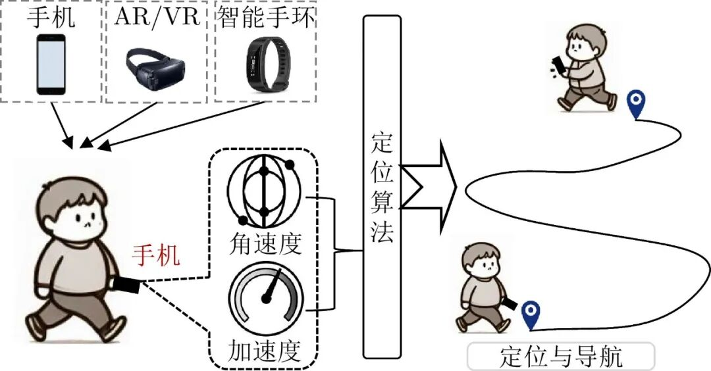
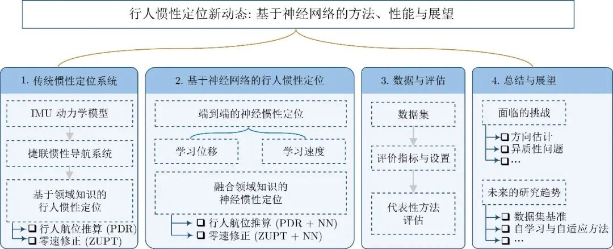
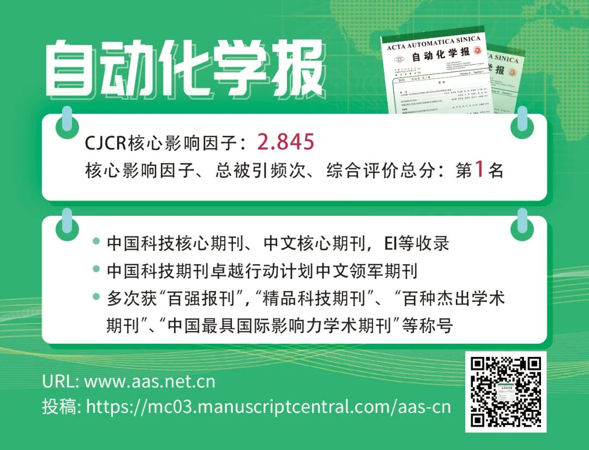

# 【视频专栏】行人惯性定位新动态: 基于神经网络的方法、性能与展望

原创 自动化学报 自动化学报 2025-03-27 17:08 北京

> 原文地址: [https://mp.weixin.qq.com/s/yKnSvQ5EgNqMNucObSwLLA](https://mp.weixin.qq.com/s/yKnSvQ5EgNqMNucObSwLLA)

点击上方**蓝字**关注我们

  

李岩, 施忠臣, 侯燕青, 戚煜华, 谢良, 陈伟, 陈洪波, 闫野, 印二威. [行人惯性定位新动态: 基于神经网络的方法、性能与展望](http://www.aas.net.cn/cn/article/doi/10.16383/j.aas.c240221). 自动化学报, 2025, 51(2): 271−286

1

摘要

     行人惯性定位(Inertial positioning, IP)通过惯性测量单元(Inertial measurement unit, IMU)的测量序列来估计行人的位置, 近年来已成为解决室内或卫星信号遮挡环境下行人自主定位的重要手段. 然而, 传统惯性定位方法在双重积分时易受误差源影响导致漂移问题, 一定程度上限制了行人惯性定位在长时间长距离实际运动中的应用. 幸运的是, 基于神经网络(Neural network, NN)的方法能够仅从IMU历史数据中学习行人的运动模式并修正惯性测量值在积分时引起的漂移. 为此, 本文对近期基于深度神经网络(Deep neural network, DNN)的行人惯性定位进行全面综述. 首先对传统的惯性定位方法进行了简要介绍; 其次, 按照是否融入领域知识分别介绍了端到端(End-to-end, ETE)的神经惯性定位方法和融合领域知识的神经惯性定位方法的研究动态; 然后, 概述了行人惯性定位的基准数据集和评价指标, 并分析比较了其中一些代表性方法的优势和不足; 最后, 对该领域需要解决的关键难点问题进行了总结, 并探讨基于DNN的行人惯性定位未来所面临的关键挑战与发展趋势, 以期为后续的研究提供有益参考.

  

2

引言

    快速而准确的自主定位对行人导航、机器人导航和工业制造自动化具有重要的作用. 尽管全球导航卫星系统(Global navigation satellite system, GNSS)已成为大多数定位问题的首选解决方案\[1\], 但在室内环境或受到建筑物、地下通道、隧道等结构物的遮挡环境下, GNSS信号会受到严重的阻塞和干扰, 从而无法提供连续的定位服务\[2\]. 随着微机电系统(Micro-electro-mechanical systems, MEMS)技术的不断发展, 惯性测量单元(Inertial measurement unit, IMU)变得更小、更节能和更低成本. 与其他常用的传感器(如GNSS\[1\]、无线电\[3−4\]、相机\[5\]和蓝牙\[6−7\])不同, IMU具有自主、不受遮挡干扰等特点, 可提供连续稳定的测量值. 从IMU测量值中获取准确的位置估计一直是工业界和学术界的研究热点, 在定位导航、紧急服务、健康监测、军事领域和公共安全等领域中扮演着越来越重要的角色\[8−12\]. 

  

惯性定位(Inertial positioning, IP)\[13−15\], 又称为惯性导航(Inertial navigation, IN), 是基于牛顿力学的定位技术, 可以通过加速度和角速度来推断移动主体的运动状态(速度、方向和位置). 由此, 基于惯性数据的行人定位方法\[16\]也逐渐成为一个研究热点\[17\], 该方法利用移动设备(例如, 智能手机、智能手环和AR/VR设备等)中的IMU内置的陀螺仪和加速度计连续采样角速度和加速度, 实现了对行人自身位置的连续跟踪, 如图1所示.

  

图 **1**  行人惯性定位范式

Fig. **1**  Pedestrian inertial positioning paradigm

  

传统的捷联惯性导航系统(Strapdown inertial navigation system, SINS)算法基于牛顿运动定律和数学规则设计. 具体而言, 首先通过对角速度的积分获得姿态信息, 随后将加速度测量值转换至全局坐标系中, 再通过对转换后的加速度进行二次积分, 最终获取位置信息. 然而, 由于制造精度和工艺的限制, 低成本MEMS IMU的测量值常包含偏置误差、正交偏差、温度相关误差、随机噪声和随机游走噪声等误差源\[18−19\]. 在实际应用中, 这些测量误差可能会对没有约束的惯性定位系统造成显著影响, 甚至在较短时间内导致系统性能下降. 在这个过程中, 即使是微小的误差也会呈指数增长, 导致误差漂移迅速累积. 因此, 传统的捷联惯性导航系统在处理长序列惯性数据时面临着巨大挑战.

  

为应对上述挑战, 学者们尝试将领域知识融入惯性解算过程中来缓解行人定位过程中的误差漂移问题. 例如, 将IMU附着在行人脚上来检测零速相位, 并将其作为伪测量输入到卡尔曼滤波中来修正捷联惯性导航系统的状态. 另一方面, 研究人员将人类行走的周期性融入位置解算中, 利用IMU数据进行行人步态检测、步长估计和航向估计来实时更新位置. 然而, 此类传统方法也很难用于长时间长距离运动的真实场景. 一个制约因素在于领域局限性无法解决惯性定位的根本问题, 例如, 步长、航向和零速检测的失败也会导致系统漂移较大.

  

由于惯性数据存在噪声扰动以及真实环境复杂多变使得难以建立准确且通用的误差模型并投入到实际应用中. 近年来, 深度神经网络(Deep neural network, DNN)在图像、自然语言处理和语音处理等领域表现出了卓越的性能\[20−21\]. 受此启发, 一些研究人员逐渐将神经网络(Neural network, NN)引入到行人惯性定位领域来应对上述挑战. 这种数据驱动的学习范式利用神经网络强大的非线性映射能力, 从惯性数据中提取行人运动的高级隐藏特征并回归速度和位置等状态信息, 有效地缓解了惯性传感器数据中的噪声和累积漂移问题, 显著提升了行人惯性定位的精度与稳定性\[8\]. 由于此类方法在不依赖于具体的物理或数学模型的前提下展现出一定的潜在优势, 所以受到学术界和工业界的广泛关注.

  

为此, 本文详细地呈现了基于神经网络的行人惯性定位的研究脉络, 为了较为全面地阐述和整理相关文献, 本文重点从以下几点展开综述: 1) 简要概述传统的行人惯性定位方法及其局限性; 2) 对基于神经网络的行人惯性定位方法和现状进行详细整理; 3) 介绍具有代表性的公共数据集、评估指标以及基于神经网络方法和传统方法的性能比较; 4) 总结当前研究及应用中存在的亟待突破的关键问题, 并对可能的研究方向进行阐述与说明, 为后续研究提供借鉴. 本文结构如图2所示.

  

图 2  全文组织结构

Fig. 2  The organization structure of this paper

  

3

正文框架

1\. 传统惯性定位系统

  1.1 IMU动力学模型

  1.2 捷联惯性导航系统

  1.3 基于领域知识的行人惯性定位

2\. 基于神经网络的行人惯性定位

  2.1 端到端的神经惯性定位

  2.2 融合领域知识的神经惯性定位

3\. 数据与评估

  3.1 数据集

  3.2 评价指标与设置

  3.3 代表性方法评估

4\. 总结与展望

  

**部分文献**

  

\[1\] Gao R P, Xiao X, Zhu S L, Xing W W, Li C, Liu L, et al. Glow in the dark: Smartphone inertial odometry for vehicle tracking in GPS blocked environments. IEEE Internet of Things Journal, 2021, 8(16): 12955−12967 doi: 10.1109/JIOT.2021.3064342

  

\[2\] Herrera E, Kaufmann H, Secue J, Quirós R, Fabregat G. Improving data fusion in personal positioning systems for outdoor environments. Information Fusion, 2013, 14(1): 45−56 doi: 10.1016/j.inffus.2012.01.009

  

\[3\] Roy P, Chowdhury C. A survey on ubiquitous WiFi-based indoor localization system for smartphone users from implementation perspectives. CCF Transactions on Pervasive Computing and Interaction, 2022, 4(3): 298−318 doi: 10.1007/s42486-022-00089-3

  

\[4\] Wang R R, Li Z H, Luo H Y, Zhao F, Shao W H, Wang Q. A robust Wi-Fi fingerprint positioning algorithm using stacked denoising autoencoder and multi-layer perceptron. Remote Sensing, 2019, 11(11): Article No. 1293 doi: 10.3390/rs11111293

  

\[5\] Mur-Artal R, Montiel J, Tardós J. ORB-SLAM: A versatile and accurate monocular SLAM system. IEEE Transactions on Robotics, 2015, 31(5): 1147−1163 doi: 10.1109/TRO.2015.2463671

  

\[6\] Szyc K, Nikodem M, Zdunek M. Bluetooth low energy indoor localization for large industrial areas and limited infrastructure. Ad Hoc Networks, 2023, 139: Article No. 103024 doi: 10.1016/j.adhoc.2022.103024

  

\[7\] Yu N, Zhan X H, Zhao S N, Wu Y F, Feng R J. A precise dead reckoning algorithm based on Bluetooth and multiple sensors. IEEE Internet of Things Journal, 2018, 5(1): 336−351 doi: 10.1109/JIOT.2017.2784386

  

\[8\] Chen C H, Zhao P J, Lu C X, Wang W, Markham A, Trigoni N. Deep-learning-based pedestrian inertial navigation: Methods, data set, and on-device inference. IEEE Internet of Things Journal, 2020, 7(5): 4431−4441 doi: 10.1109/JIOT.2020.2966773

  

\[9\] Gowda M, Dhekne A, Shen S, Choudhury R, Yang X, Yang L, et al. Bringing IoT to sports analytics. In: Proceedings of the 14th USENIX Conference on Networked Systems Design and Implementation. Boston, USA: USENIX, 2017. 499−513

  

\[10\] 潘献飞, 穆华, 胡小平. 单兵自主导航技术发展综述. 导航定位与授时, 2018, 5(1): 1−11

Pan Xian-Fei, Mu Hua, Hu Xiao-Ping. A survey of autonomous navigation technology for individual soldier. Navigation Positioning and Timing, 2018, 5(1): 1−11

  

\[11\] 郭孝宽, 岳丕玉, 安维廉. 运载火箭的距离惯性制导. 自动化学报, 1984, 10(4): 361−364

Guo Xiao-Kuan, Yue Pi-Yu, An Wei-Lian. Distance-inertial guidance of the launch vehicle. Acta Automatica Sinica, 1984, 10(4): 361−364

  

\[12\] Zhou B D, Wu P, Zhang X, Zhang D J, Li Q Q. Activity semantics-based indoor localization using smartphones. IEEE Sensors Journal, 2024, 24(7): 11069−11079 doi: 10.1109/JSEN.2024.3357718

  

\[13\] Barshan B, Durrant-Whyte H F. Inertial navigation systems for mobile robots. IEEE Transactions on Robotics and Automation, 1995, 11 (3): 328−342

  

\[14\] 王巍. 惯性技术研究现状及发展趋势. 自动化学报, 2013, 39(6): 723−729

Wang Wei. Status and development trend of inertial technology. Acta Automatica Sinica, 2013, 39(6): 723−729

  

\[15\] 董铭涛, 程建华, 赵琳, 刘萍. 惯性组合导航系统性能评估方法研究进展. 自动化学报, 2022, 48(10): 2361−2373

Dong Ming-Tao, Cheng Jian-Hua, Zhao Lin, Liu Ping. Perspectives on performance evaluation method for inertial integrated navigation system. Acta Automatica Sinica, 2022, 48(10): 2361−2373

  

\[16\] 许睿. 行人导航系统算法研究与应用实现 \[硕士学位论文\], 南京航空航天大学, 中国, 2008.

Xu R. Research and Application on Navigation Algorithm of Pedestrian Navigation System \[Master thesis\], Nanjing University of Aeronautics and Astronautics, China, 2008.

  

\[17\] Puyol M, Bobkov D, Robertson P, Jost T. Pedestrian simultaneous localization and mapping in multistory buildings using inertial sensors. IEEE Transactions on Intelligent Transportation Systems, 2014, 15(4): 1714−1727 doi: 10.1109/TITS.2014.2303115

  

\[18\] El-Sheimy N, Hou H Y, Niu X J. Analysis and modeling of inertial sensors using Allan variance. IEEE Transactions on Instrumentation and Measurement, 2008, 57(1): 140−149 doi: 10.1109/TIM.2007.908635

  

\[19\] Zhuo W P, Li S J, He T L, Liu M Y, Chan S, Ha S, et al. Online path description learning based on IMU signals from IoT devices. IEEE Transactions on Mobile Computing, DOI: 10.1109/TMC.2024.3406436

  

\[20\] Otter D, Medina J, Kalita J. A survey of the usages of deep learning for natural language processing. IEEE Transactions on Neural Networks and Learning Systems, 2021, 32(2): 604−624 doi: 10.1109/TNNLS.2020.2979670

  

\[21\] LeCun Y, Bengio Y, Hinton G. Deep learning. Nature, 2015, 521(7553): 436−444 doi: 10.1038/nature14539

  

**作者简介**

  

  

**李  岩**，中山大学系统科学与工程学院博士研究生. 2022年获得昆明理工大学硕士学位. 主要研究方向为神经惯性定位和姿态估计.

  

**施忠臣**，军事科学院国防科技创新研究院助理研究员. 2021年获得国防科技大学博士学位. 主要研究方向为机器人视觉和姿态估计.

  

**侯燕青**，中山大学系统科学与工程学院副教授. 2016年获得国防科技大学博士学位. 主要研究方向为卫星导航定位和多源融合导航.

  

**戚煜华**，中山大学系统科学与工程学院副研究员. 2020年获得北京理工大学博士学位. 主要研究方向为同时定位与建图.

  

**谢  良**，军事科学院国防科技创新研究院副研究员. 2018年获得国防科技大学博士学位. 主要研究方向为计算机视觉, 人机交互和混合现实.

  

**陈  伟**，军事科学院国防科技创新研究院助理研究员. 2022年获得伯明翰大学博士学位. 主要研究方向为姿态估计.

  

**陈洪波**，中山大学系统科学与工程学院教授. 2007年获得哈尔滨工业大学博士学位. 主要研究方向为复杂系统的建模、仿真和分析, 智能无人系统以及航空航天飞行器的设计.

  

**闫  野**，军事科学院国防科技创新研究院研究员. 2000年获得国防科技大学博士学位. 主要研究方向为人机交互和混合现实. 本文通信作者.

  

**印二威**，军事科学院国防科技创新研究院研究员. 2015年获得国防科技大学博士学位. 主要研究方向为脑机接口和智能人机交互技术.

  

**热**

**点**

**文**

**章**

[》【视频专栏】前额叶皮层启发的Transformer模型应用及其进展](https://mp.weixin.qq.com/s?__biz=MzI2NjA3MzM5MA==&mid=2650003789&idx=1&sn=4628505b878c4a478187bdb5a5cd457f&scene=21#wechat_redirect)

[》【视频专栏】基于仿真机理和改进回归决策树的二噁英排放建模](https://mp.weixin.qq.com/s?__biz=MzI2NjA3MzM5MA==&mid=2650003776&idx=1&sn=7d080fe02d7b365c207584c80925dedc&scene=21#wechat_redirect)

[》【视频专栏】收缩、分离和聚合: 面向长尾视觉识别的特征平衡方法](https://mp.weixin.qq.com/s?__biz=MzI2NjA3MzM5MA==&mid=2650003755&idx=1&sn=1590f91c56ed9184e626d556861b8a9f&scene=21#wechat_redirect)

[》](https://mp.weixin.qq.com/s?__biz=MzI2NjA3MzM5MA==&mid=2650003738&idx=1&sn=839dd5673821c09e521f344d595bc836&scene=21#wechat_redirect)[【视频专栏】](https://mp.weixin.qq.com/s?__biz=MzI2NjA3MzM5MA==&mid=2650003755&idx=1&sn=1590f91c56ed9184e626d556861b8a9f&scene=21#wechat_redirect)基于自组织递归小波神经网络的污水处理过程多变量控制

[》2024年度自动化学科国家自然科学基金项目申请与资助情况综述](https://mp.weixin.qq.com/s?__biz=MzI2NjA3MzM5MA==&mid=2650002664&idx=1&sn=849ab0044383328c3edb6f49bdf1c770&scene=21#wechat_redirect)

[》【视频专栏】多尺度视觉语义增强的多模态命名实体识别方法](https://mp.weixin.qq.com/s?__biz=MzI2NjA3MzM5MA==&mid=2650002642&idx=1&sn=77d0bde604b7f8f9b80889f77db2f0ec&scene=21#wechat_redirect)

[》【视频专栏】基于被动声呐音频信号的水中目标识别综述](https://mp.weixin.qq.com/s?__biz=MzI2NjA3MzM5MA==&mid=2650002637&idx=1&sn=5e362f1a68719bfa31be68145f111e90&scene=21#wechat_redirect)

[》【视频专栏】基于慢特征分析的分布式动态工业过程运行状态评价](https://mp.weixin.qq.com/s?__biz=MzI2NjA3MzM5MA==&mid=2650002613&idx=1&sn=2bdd9d5d7b20f19caf30be5b298a5850&scene=21#wechat_redirect)

[》【视频专栏】基于多尺度流模型的视觉异常检测研究](https://mp.weixin.qq.com/s?__biz=MzI2NjA3MzM5MA==&mid=2650001911&idx=1&sn=ecbca405c481ab60135af4c8156f4c22&scene=21#wechat_redirect)

[》【视频专栏】面向工业过程的图像生成及其应用研究综述](http://mp.weixin.qq.com/s?__biz=MzI2NjA3MzM5MA==&mid=2650001789&idx=1&sn=d995d02870670a8fcafb528eb2c63cc0&chksm=f294d53cc5e35c2a2507e5f6a7d93b78624ca8ff27e8754a9b21113e330cc1dee66b363d0d3c&scene=21#wechat_redirect)

[》【视频专栏】叠层模型驱动的书法文字识别方法研究](http://mp.weixin.qq.com/s?__biz=MzI2NjA3MzM5MA==&mid=2650001754&idx=1&sn=ee40b15ca961248756cfdaca99ef633e&chksm=f294d51bc5e35c0dc61feaffe2d794405fc3fc9df457e784f8524422b3f439eb0106519dc0e9&scene=21#wechat_redirect)

[》【视频专栏】外部干扰和随机DoS攻击下的网联车安全H∞ 队列控制](http://mp.weixin.qq.com/s?__biz=MzI2NjA3MzM5MA==&mid=2650001747&idx=1&sn=10af98de509e5eba3c0e124f842ea092&chksm=f294d512c5e35c0440b4304455bab3efc5da349fc60e06e66f6836e23d971dd5075ed5b5bde7&scene=21#wechat_redirect)

[》【视频专栏】航天器姿态受限的协同势函数族设计方法](http://mp.weixin.qq.com/s?__biz=MzI2NjA3MzM5MA==&mid=2650001653&idx=1&sn=2727a3ebf3fbc25aaca01582570c0f74&chksm=f294d4b4c5e35da2ad592667d93f6febd699428c2ded93e594fdde73c4791a26406d602012af&scene=21#wechat_redirect)

[》【视频专栏】虹膜呈现攻击检测综述](http://mp.weixin.qq.com/s?__biz=MzI2NjA3MzM5MA==&mid=2650001419&idx=1&sn=9935082d26aa31b227236fc458c81a28&chksm=f294d44ac5e35d5c5b63811d6f8cd57121db6f18efc720f1ff854682caf32f2cf7de6d3a2916&scene=21#wechat_redirect)

[》【视频专栏】一种边界增强的医学图像小样本分割网络](http://mp.weixin.qq.com/s?__biz=MzI2NjA3MzM5MA==&mid=2649999124&idx=1&sn=afe4ace33e6f05830f4b50d9b97bf443&chksm=f294c355c5e34a4369e78b6a4cbb963f145b1d49668427858cd172e01042b36ac9ebeef50565&scene=21#wechat_redirect)

[》【视频专栏】基于捕获点理论的混合驱动水下刀锋腿机器人稳定性判据](http://mp.weixin.qq.com/s?__biz=MzI2NjA3MzM5MA==&mid=2649999120&idx=1&sn=6832404a62c752a41316687b67b664b9&chksm=f294c351c5e34a47a415883763103b59271a84e8b830efda9f533a7b9efa51f05502f1c19c43&scene=21#wechat_redirect)

[》【视频专栏】面向自动驾驶测试的危险变道场景泛化生成](http://mp.weixin.qq.com/s?__biz=MzI2NjA3MzM5MA==&mid=2649997130&idx=1&sn=288877fc42a8d0c0fa4863e982d40e5c&chksm=f294bb0bc5e3321d02f67ea1033066c48e201cfd09349f4b949c1999ba66870a954e1438e13a&scene=21#wechat_redirect)

[》【视频专栏】全天实时跟踪无人机目标的多正则化相关滤波算法](http://mp.weixin.qq.com/s?__biz=MzI2NjA3MzM5MA==&mid=2649994631&idx=1&sn=9aec26372b4c60bfadf889a34d7922da&chksm=f294b1c6c5e338d0b1b620d09fbdcf1e341db6c4cae569afb4313019c7819cecb09bed908d1e&scene=21#wechat_redirect)

[》【视频专栏】面向研究问题的深度学习事件抽取综述](http://mp.weixin.qq.com/s?__biz=MzI2NjA3MzM5MA==&mid=2649994625&idx=1&sn=d74bf8af7713edac585290c01ad62f3e&chksm=f294b1c0c5e338d68184f77e9d4d14dbb8ae80dd7db0bd028f88f5daa929846623e7f4ad13e8&scene=21#wechat_redirect)

[》【视频专栏】联合深度超参数卷积和交叉关联注意力的大位移光流估计](http://mp.weixin.qq.com/s?__biz=MzI2NjA3MzM5MA==&mid=2649994575&idx=1&sn=59c57e42cb8782fce8f1b18f5e8a2eeb&chksm=f294b10ec5e3381840758afef677580a57e1521c1d162f94fd7570e711385da6bd8966089c73&scene=21#wechat_redirect)

[》【视频专栏】智能网联电动汽车节能优化控制研究进展与展望](http://mp.weixin.qq.com/s?__biz=MzI2NjA3MzM5MA==&mid=2649994506&idx=1&sn=c04f6769ca2080bb2d45124569e3d023&chksm=f294b14bc5e3385da83c9ac0accc54cd3611017dace04a846de3f4b3652d9875a63cae479f47&scene=21#wechat_redirect)

[》【视频专栏】含有输入时滞的非线性系统的输出反馈采样控制](http://mp.weixin.qq.com/s?__biz=MzI2NjA3MzM5MA==&mid=2649994468&idx=1&sn=8d60584613c5534f62f9ff338673b7c2&chksm=f294b0a5c5e339b32102f43f0bcffe769b0dcb7068a66c41c5d728c818d2e009ba229b4b3849&scene=21#wechat_redirect)

[》【视频专栏】基于多示例学习图卷积网络的隐写者检测](http://mp.weixin.qq.com/s?__biz=MzI2NjA3MzM5MA==&mid=2649994463&idx=1&sn=7d890483cbec1dc28fc4077e283630d2&chksm=f294b09ec5e3398884a6e3fcd2a0fbfc9f19b1e78568232fec8fc5f40b3d847872cfe3c52a38&scene=21#wechat_redirect)

[》【视频专栏】逆强化学习算法、理论与应用研究综述](http://mp.weixin.qq.com/s?__biz=MzI2NjA3MzM5MA==&mid=2649994414&idx=1&sn=417e22e0c2968c320f85c985ae8382fc&chksm=f294b0efc5e339f9f3c836cacdda17e54c43a6f0baecd765e56881ca02d100db002896664d27&scene=21#wechat_redirect)

[》【视频专栏】基于注意力机制和循环域三元损失的域适应目标检测](http://mp.weixin.qq.com/s?__biz=MzI2NjA3MzM5MA==&mid=2649994367&idx=1&sn=f285ff14cae5c1654c969984e245cb81&chksm=f294b03ec5e339286ba7cd614eb700c8a101a44e281d1910ac41e57eb049d7ec5007ceddeeaa&scene=21#wechat_redirect)

[》【视频专栏】基于语境辅助转换器的图像标题生成算法](http://mp.weixin.qq.com/s?__biz=MzI2NjA3MzM5MA==&mid=2649994195&idx=1&sn=a34112e60d2acadddd98669ab669f79b&chksm=f294b792c5e33e849767cd709b27d345020653081a1710f13523c8eaaf7233c5c82ec76a152e&scene=21#wechat_redirect)

[》【视频专栏】数据驱动的间歇低氧训练贝叶斯优化决策方法](http://mp.weixin.qq.com/s?__biz=MzI2NjA3MzM5MA==&mid=2649992616&idx=1&sn=5cdc4acb37f10484f5fb4f687917423e&chksm=f294a9e9c5e320ffcddc09aa42228b2484a4ea5895a5b749aa142fef7241f104b1d518032f4e&scene=21#wechat_redirect)

[》【视频专栏】无控制器间通信的线性多智能体一致性的降阶协议](http://mp.weixin.qq.com/s?__biz=MzI2NjA3MzM5MA==&mid=2649992535&idx=1&sn=5d756a7b9ddd2c427296abf18204b912&chksm=f294a916c5e3200083b74b11610119fbcdebe299e3e4ee019f4c2de3622496b8d82413e08230&scene=21#wechat_redirect)

[》【视频专栏】异策略深度强化学习中的经验回放研究综述](http://mp.weixin.qq.com/s?__biz=MzI2NjA3MzM5MA==&mid=2649992530&idx=1&sn=182c20bf9cf9009c481f2f6d0796ae2f&chksm=f294a913c5e320059fd7f13efe26dd275805bee07377f0afec5b70f1469873ccabe48da0e680&scene=21#wechat_redirect)

[》2023年度自动化领域国家自然科学基金申请与资助情况](http://mp.weixin.qq.com/s?__biz=MzI2NjA3MzM5MA==&mid=2649991977&idx=1&sn=e27d823bb7fb74c433a20076f60f82fc&chksm=f294af68c5e3267eac115c164b96da48da43dfb6aaaff89caf7c2e1b242f16b2d9cafd1a9f45&scene=21#wechat_redirect)

[》【视频专栏】基于距离信息的追逃策略:信念状态连续随机博弈](http://mp.weixin.qq.com/s?__biz=MzI2NjA3MzM5MA==&mid=2649991472&idx=1&sn=5181818a450e0a369a85e3d40640fc8e&chksm=f294ad71c5e32467d6cecac2a7eaccaa016606578145606b7edfe38f1b150a935d2c8379f651&scene=21#wechat_redirect)

[》【视频专栏】城市固废焚烧过程智能优化控制研究现状与展望](http://mp.weixin.qq.com/s?__biz=MzI2NjA3MzM5MA==&mid=2649991467&idx=1&sn=19ac55f597053208e3112503d4851945&chksm=f294ad6ac5e3247c1844a5eea29148d7fee3536e033ab2bfde450c0a8a44921e3593618aabdd&scene=21#wechat_redirect)

[》【视频专栏】深度对比学习综述](http://mp.weixin.qq.com/s?__biz=MzI2NjA3MzM5MA==&mid=2649990249&idx=1&sn=f2371317def406b8d981280f438a98a0&chksm=f294a028c5e3293ec7416a964bad9129f963ab87744d4be364b85c9f13f86549912a3a915064&scene=21#wechat_redirect)

[》【视频专栏】视网膜功能启发的边缘检测层级模型](http://mp.weixin.qq.com/s?__biz=MzI2NjA3MzM5MA==&mid=2649990097&idx=1&sn=9c006598a141c960afeb736fe6c18322&chksm=f294a790c5e32e867feb10042468ad3778a62d3f57ae236f5d47b3f3c27249eb73e6fe04626b&scene=21#wechat_redirect)

[》【视频专栏】一种新的分段式细粒度正则化的鲁棒跟踪算法](http://mp.weixin.qq.com/s?__biz=MzI2NjA3MzM5MA==&mid=2649990029&idx=1&sn=0713cd87b2b01b3d75e70d82f1060106&chksm=f294a7ccc5e32eda317e3774128e4c46dd706636dee8b57304065a3e1923f2285b4420d9b7b0&scene=21#wechat_redirect)

[》【视频专栏】基于自适应多尺度超螺旋算法的无人机集群姿态同步控制](http://mp.weixin.qq.com/s?__biz=MzI2NjA3MzM5MA==&mid=2649989511&idx=1&sn=4a60cca006ab7b8b69b542699df95942&chksm=f294a5c6c5e32cd0dd4cd4ba28f0db177e13d9f1acc8e3c23f07f5e7f13872ac00ba15ae40e4&scene=21#wechat_redirect)

[》【视频专栏】基于分层控制策略的六轮滑移机器人横向稳定性控制](http://mp.weixin.qq.com/s?__biz=MzI2NjA3MzM5MA==&mid=2649985235&idx=2&sn=58d3e84944a30b8123f70d048edcd370&chksm=f2949492c5e31d84230e6c5420719f15f9f9f5705f54684e86220dd21c9690c64f46efb4703c&scene=21#wechat_redirect)

[》【视频专栏】基于改进YOLOX的移动机器人目标跟随方法](http://mp.weixin.qq.com/s?__biz=MzI2NjA3MzM5MA==&mid=2649985156&idx=1&sn=4af3bc3bc9a540beb3f43227b15d1337&chksm=f29494c5c5e31dd320182a6bb157b068e4adfe7a2568162f665243d0a2a583a365e208eb8a74&scene=21#wechat_redirect)

[》](http://mp.weixin.qq.com/s?__biz=MzI2NjA3MzM5MA==&mid=2649985156&idx=1&sn=4af3bc3bc9a540beb3f43227b15d1337&chksm=f29494c5c5e31dd320182a6bb157b068e4adfe7a2568162f665243d0a2a583a365e208eb8a74&scene=21#wechat_redirect)[自动化学报创刊60周年专刊| 孙长银教授等：基于因果建模的强化学习控制: 现状及展望](http://mp.weixin.qq.com/s?__biz=MzI2NjA3MzM5MA==&mid=2649985156&idx=1&sn=4af3bc3bc9a540beb3f43227b15d1337&chksm=f29494c5c5e31dd320182a6bb157b068e4adfe7a2568162f665243d0a2a583a365e208eb8a74&scene=21#wechat_redirect)

[》【视频专栏】基于多尺度变形卷积的特征金字塔光流计算方法](http://mp.weixin.qq.com/s?__biz=MzI2NjA3MzM5MA==&mid=2649984913&idx=2&sn=310b86ad662f17d450f55e8e3c2dd178&chksm=f2948bd0c5e302c6776e8009e693fe270c838832527affe11131374642725528e2aa81df2d08&scene=21#wechat_redirect)

[》](http://mp.weixin.qq.com/s?__biz=MzI2NjA3MzM5MA==&mid=2649984132&idx=2&sn=6f8188f47dbac43358135416ef84152a&chksm=f29488c5c5e301d3d85c95e28af2d658373c1457ae9ad2ee31583569b51adefdf231cc18c9c7&scene=21#wechat_redirect)自动化学报创刊60周年专刊| 柴天佑教授等：端边云协同的PID整定智能系统

[》【视频专栏】一种同伴知识互增强下的序列推荐方法](http://mp.weixin.qq.com/s?__biz=MzI2NjA3MzM5MA==&mid=2649984132&idx=2&sn=6f8188f47dbac43358135416ef84152a&chksm=f29488c5c5e301d3d85c95e28af2d658373c1457ae9ad2ee31583569b51adefdf231cc18c9c7&scene=21#wechat_redirect)

[》自动化学报创刊60周年专刊| 桂卫华教授等：复杂生产流程协同优化与智能控制](http://mp.weixin.qq.com/s?__biz=MzI2NjA3MzM5MA==&mid=2649984132&idx=1&sn=723478ec0cdb2b7ff3ce3cb8387f29fb&chksm=f29488c5c5e301d353838c24bb0bbb482b24f87c51996ac332562bf81d26c1ce5a4008673fef&scene=21#wechat_redirect)

[》【视频专栏】 基于跨模态实体信息融合的神经机器翻译方法](http://mp.weixin.qq.com/s?__biz=MzI2NjA3MzM5MA==&mid=2649983595&idx=2&sn=f7f6d953924bc87606e3cff241d67c91&chksm=f2948e2ac5e3073c2355b5e03047521a7950a58833fa5948dcc73f535bd1a31ef848311c99d5&scene=21#wechat_redirect)

[》自动化学报创刊60周年专刊| 王耀南教授等：机器人感知与控制关键技术及其智能制造应用](http://mp.weixin.qq.com/s?__biz=MzI2NjA3MzM5MA==&mid=2649983595&idx=2&sn=f7f6d953924bc87606e3cff241d67c91&chksm=f2948e2ac5e3073c2355b5e03047521a7950a58833fa5948dcc73f535bd1a31ef848311c99d5&scene=21#wechat_redirect)

[》【视频专栏】机器人运动轨迹的模仿学习综述](http://mp.weixin.qq.com/s?__biz=MzI2NjA3MzM5MA==&mid=2649983595&idx=2&sn=f7f6d953924bc87606e3cff241d67c91&chksm=f2948e2ac5e3073c2355b5e03047521a7950a58833fa5948dcc73f535bd1a31ef848311c99d5&scene=21#wechat_redirect)

[》自动化学报创刊60周年专刊| 于海斌研究员等：无线化工业控制系统: 架构、关键技术及应用](http://mp.weixin.qq.com/s?__biz=MzI2NjA3MzM5MA==&mid=2649983595&idx=1&sn=d9545fc8cbb247e17e7eceac9f845155&chksm=f2948e2ac5e3073c23286ffecec152f6d8ec13355c4be30424843aa598ed49b3e3ecbc6ff81c&scene=21#wechat_redirect)

[》自动化学报创刊60周年专刊| 王飞跃教授等：平行智能与CPSS: 三十年发展的回顾与展望](http://mp.weixin.qq.com/s?__biz=MzI2NjA3MzM5MA==&mid=2649983512&idx=2&sn=17e0d1102db102517c33e43c04240468&chksm=f2948e59c5e3074feb246baa49f6b07886445d6e01286cbf53ee3c38a7c2609ce610a57d3a1e&scene=21#wechat_redirect)

[》自动化学报创刊60周年专刊| 陈杰教授等：非线性系统的安全分析与控制: 障碍函数方法](http://mp.weixin.qq.com/s?__biz=MzI2NjA3MzM5MA==&mid=2649983132&idx=1&sn=32c7e4b6c4c3f6d48726380c7445c8d2&chksm=f2948cddc5e305cb68b9bb4021c3a257d311bfad9c0bbe34e791f1d9b244b4be2be7b7d9909e&scene=21#wechat_redirect)

[》自动化学报创刊60周年专刊| 乔俊飞教授等：城市固废焚烧过程数据驱动建模与自组织控制](http://mp.weixin.qq.com/s?__biz=MzI2NjA3MzM5MA==&mid=2649983104&idx=1&sn=c21c87bc60f9ba05b85ac2a4ddf04e73&chksm=f2948cc1c5e305d7f636c366f29577fbcd1e1f90b75a1dc3def06b373f518e2a871f5d59de1d&scene=21#wechat_redirect)

[》自动化学报创刊60周年专刊| 姜斌教授等：航天器位姿运动一体化直接自适应容错控制研究](https://mp.weixin.qq.com/s?__biz=MzI2NjA3MzM5MA==&mid=2649982991&idx=1&sn=402f25724c6c016cd492e8f4ca9764c7&scene=21#wechat_redirect)

[》](http://mp.weixin.qq.com/s?__biz=MzI2NjA3MzM5MA==&mid=2649983104&idx=2&sn=4e9ed9cff5c9acf2c85da060749b7fbe&chksm=f2948cc1c5e305d7ef1d929d3ff90ebbb6ea272e98d9edcb1289f5eece60e36e17afa3941489&scene=21#wechat_redirect)[自动化学报创刊60周年专刊| 王龙教授等：多智能体博弈、学习与控制](https://mp.weixin.qq.com/s?__biz=MzI2NjA3MzM5MA==&mid=2649983104&idx=2&sn=4e9ed9cff5c9acf2c85da060749b7fbe&scene=21#wechat_redirect)

[》自动化学报创刊60周年专刊| 刘成林研究员等：类别增量学习研究进展和性能评价](http://mp.weixin.qq.com/s?__biz=MzI2NjA3MzM5MA==&mid=2649982935&idx=1&sn=98725e6e1d7489129fe88c26d8f206f4&chksm=f2948396c5e30a80eb50116d01b1b3c734e45cc0bd28a3df2ef34ae93bb27c36982c6ea531fc&scene=21#wechat_redirect)

[》](http://mp.weixin.qq.com/s?__biz=MzI2NjA3MzM5MA==&mid=2649982073&idx=1&sn=f2cd4f06b5dfafadef97023d83881df0&chksm=f2948038c5e3092e1142f77236b80ca92116d4aff95cd27410faa4edc34a442245c3720cc2ff&scene=21#wechat_redirect)[《自动化学报》创刊60周年专刊｜杨孟飞研究员等：空间控制技术发展与展望](https://mp.weixin.qq.com/s?__biz=MzI2NjA3MzM5MA==&mid=2649982899&idx=1&sn=839c1c4632e2bc46fc39972f72d76209&scene=21#wechat_redirect)

**期**

**刊**

**动**

**态**

[》《自动化学报》致谢审稿人（2024年度）](https://mp.weixin.qq.com/s?__biz=MzI2NjA3MzM5MA==&mid=2650002940&idx=1&sn=143124df4e9f117cf65dba731316d450&scene=21#wechat_redirect)

[》CJCR发布：自动化学报各项主要指标蝉联第1](http://mp.weixin.qq.com/s?__biz=MzI2NjA3MzM5MA==&mid=2650001473&idx=1&sn=eb2e44a48f804b67cb3a4c9709aae25c&chksm=f294d400c5e35d162db46a5d31d07f904cf89fbe646f5488b4e97b743effd29db6c0a5014c06&scene=21#wechat_redirect)

[》自动化学报排名第一，持续入选中国权威学术期刊（A+）](http://mp.weixin.qq.com/s?__biz=MzI2NjA3MzM5MA==&mid=2649995334&idx=1&sn=bf87bcddd566917490e06918b8895fe2&chksm=f294bc07c5e335115415c45903d01f3133749582e672a81464c428dcb5f845aec3f9b109ea5f&scene=21#wechat_redirect)

[》征文|《自动化学报》多智能体系统专刊](http://mp.weixin.qq.com/s?__biz=MzI2NjA3MzM5MA==&mid=2649994462&idx=1&sn=8321fbcf0e11a733ad040dc71440d70a&chksm=f294b09fc5e33989b173a69a0635a654006343344774390814804e7395180eda1b3388f720ca&scene=21#wechat_redirect)

[》《自动化学报》致谢审稿人（2023年度）](http://mp.weixin.qq.com/s?__biz=MzI2NjA3MzM5MA==&mid=2649992449&idx=1&sn=da54e4b3c03ac6b3a2126687eab836d4&chksm=f294a940c5e32056dd43d9f738d1265888a0ac3861053f8b18e7b123fabc75e905268efdefd0&scene=21#wechat_redirect)

[》《自动化学报》兼职编辑招聘启事](http://mp.weixin.qq.com/s?__biz=MzI2NjA3MzM5MA==&mid=2649991339&idx=2&sn=4c2100dfa7c2df04170a136517068f49&chksm=f294aceac5e325fc7a2334e5d9449e3100d7adfb6f1fda1d26b67e0980db13c104b686d4dcad&scene=21#wechat_redirect)

[》《自动化学报》创刊六十周年学术研讨会第六期](http://mp.weixin.qq.com/s?__biz=MzI2NjA3MzM5MA==&mid=2649991050&idx=1&sn=d10a737dd85c77b4d2229be1e9dbbd6f&chksm=f294a3cbc5e32add703d75c7279b1119564a3d56eef1f26f448aaaa1e81447691ba8dab8daa0&scene=21#wechat_redirect)

[》《自动化学报》创刊六十周年学术研讨会第五期](http://mp.weixin.qq.com/s?__biz=MzI2NjA3MzM5MA==&mid=2649990342&idx=1&sn=cea126ca0e0f85f2ece3f73bfa9b126e&chksm=f294a087c5e32991a89b8d16ee745e2cc28b5d632ff08495d5b8f958853a717db99c68b078d8&scene=21#wechat_redirect)

[》自动化学报蝉联百种中国杰出期刊称号](http://mp.weixin.qq.com/s?__biz=MzI2NjA3MzM5MA==&mid=2649990067&idx=1&sn=4a6e171d54d1c781c8809f67f05967c1&chksm=f294a7f2c5e32ee4cac04ce10b0b413f2d356bb2b80e6d4426c65df3df25e7cd87eaaa0a3954&scene=21#wechat_redirect)

[》《自动化学报》20篇文章入选2023“领跑者5000”顶尖论文](http://mp.weixin.qq.com/s?__biz=MzI2NjA3MzM5MA==&mid=2649990046&idx=1&sn=7ee7129e9edf7ffe5e19d1b5fc0da8d3&chksm=f294a7dfc5e32ec9f4542539eb8476f0eedd4d11869f34265b065bc2ff1051e0a6cfd4c13f27&scene=21#wechat_redirect)

[》《自动化学报》创刊六十周年学术研讨会第三期](http://mp.weixin.qq.com/s?__biz=MzI2NjA3MzM5MA==&mid=2649985287&idx=1&sn=e088055dfb077c99cac881b294bfb860&chksm=f2949546c5e31c50f600d10eecd1a83ec3e5a2695f0905c4c988190106d18c6e01e8630bcd17&scene=21#wechat_redirect)

[》《自动化学报》创刊六十周年学术研讨会第二期](http://mp.weixin.qq.com/s?__biz=MzI2NjA3MzM5MA==&mid=2649984459&idx=1&sn=bade18d071fffdbd94a0062aa09e5821&chksm=f294898ac5e3009ca3e2a687b9e97fa8ef2274e6318b7b241ba9092d113839da69bf8337ebcc&scene=21#wechat_redirect)

[》《自动化学报》创刊六十周年学术研讨会第一期](http://mp.weixin.qq.com/s?__biz=MzI2NjA3MzM5MA==&mid=2649983235&idx=1&sn=8632016cf5744a797ee7ae7cf07ab943&chksm=f2948d42c5e304545e4a472d6b88fdf4a9f922013348a8d4f2ae4db0f1c6a4081245695cf3e9&scene=21#wechat_redirect)

[》《自动化学报》致谢审稿人（2022年度）](http://mp.weixin.qq.com/s?__biz=MzI2NjA3MzM5MA==&mid=2649982665&idx=1&sn=d61e7b604db75a9e71a15e8046ee05ac&chksm=f2948288c5e30b9e3d2569ce292bdecf7e5f79419f638002531e8fba91d3de5c111cce298fed&scene=21#wechat_redirect)

[》《自动化学报》13篇文章入选2022“领跑者5000”顶尖论文](http://mp.weixin.qq.com/s?__biz=MzI2NjA3MzM5MA==&mid=2649982409&idx=1&sn=d0d4e97a7ac4337ca8e699625ddb94e5&chksm=f2948188c5e3089e988782a341caabdae47e6929a8e649b14438829e37e279f816f19e0652de&scene=21#wechat_redirect)

[》自动化学报连续11年入选国际影响力TOP期刊榜单](http://mp.weixin.qq.com/s?__biz=MzI2NjA3MzM5MA==&mid=2649981948&idx=1&sn=6b850c9c095f2e9cbbb899c8b4a8149d&chksm=f29487bdc5e30eab3df0fb761e7f00b3c4945f7e0e971483a4c5f37434032e69f76d2f9f4160&scene=21#wechat_redirect)

[》《自动化学报》影响因子6.627，影响因子和影响力指数排名第1](http://mp.weixin.qq.com/s?__biz=MzI2NjA3MzM5MA==&mid=2649978177&idx=1&sn=751e0861ae0aca7dda3e97d61d036b9b&chksm=f2947100c5e3f8164adef31ca955542569a2fa2f3b0bb712d0df51e5eadecd618010831521a5&scene=21#wechat_redirect)

[》](http://mp.weixin.qq.com/s?__biz=MzI2NjA3MzM5MA==&mid=2649978148&idx=1&sn=279c2b1746c902b4dd71e8caef8edca4&chksm=f2947165c5e3f873100609f63b9358e6959232e72b83e44e828859065146391b62fd3c60dc39&scene=21#wechat_redirect)[《自动化学报》17篇文章入选2021“领跑者5000”顶尖论文](http://mp.weixin.qq.com/s?__biz=MzI2NjA3MzM5MA==&mid=2649978148&idx=1&sn=279c2b1746c902b4dd71e8caef8edca4&chksm=f2947165c5e3f873100609f63b9358e6959232e72b83e44e828859065146391b62fd3c60dc39&scene=21#wechat_redirect)

[》自动化学报多名作者入选爱思唯尔2021中国高被引学者](http://mp.weixin.qq.com/s?__biz=MzI2NjA3MzM5MA==&mid=2649962415&idx=1&sn=4e1ea44f0317684b6a6e7b780837d5be&chksm=f29433eec5e3baf81455b542b535bddc4f0b33e77534fe72ab2ab8312ef149bb5812844b3cec&scene=21#wechat_redirect)

[》自动化学报（英文版）和自动化学报入选计算领域高质量科技期刊T1类](http://mp.weixin.qq.com/s?__biz=MzI2NjA3MzM5MA==&mid=2649961858&idx=1&sn=eaccb38a93a2b1f11e0f1b0f80476b12&chksm=f29431c3c5e3b8d5417d6e17aedae4c58f707822ee67c5f1d87a24308e56f888a31bff8ae332&scene=21#wechat_redirect)

[》自动化学报多篇论文入选中国百篇最具影响国内论文和中国精品期刊顶尖论文](http://mp.weixin.qq.com/s?__biz=MzI2NjA3MzM5MA==&mid=2649961152&idx=1&sn=4a5e9e4b84879f4cde4e13a0ef97272c&chksm=f2943681c5e3bf97d7770c9623dac869b283b3ea83f3d320017974033e361d8b999134a8bdff&scene=21#wechat_redirect)

[》自动化学报蝉联百种中国杰出期刊称号，入选中国精品科技期刊](http://mp.weixin.qq.com/s?__biz=MzI2NjA3MzM5MA==&mid=2649957485&idx=1&sn=8af865466cb6f52b05a1e41af8549e71&chksm=f294202cc5e3a93a40b4850e6e0f0bccaf56c89591e049e9d98bfe9a598913f5d25e8ecfcf8d&scene=21#wechat_redirect)

[》《自动化学报》挺进世界期刊影响力指数Q1区](http://mp.weixin.qq.com/s?__biz=MzI2NjA3MzM5MA==&mid=2649957452&idx=1&sn=c5fa8ac9c581e4ae3de2e7956e603dca&chksm=f294200dc5e3a91bb250e25fd6f7e47dc1114ad6fdf1762a7bfc440f789a059f1de455584e66&scene=21#wechat_redirect)

[》《自动化学报》多名作者入选科睿唯安2020年度高被引科学家](http://mp.weixin.qq.com/s?__biz=MzI2NjA3MzM5MA==&mid=2649957295&idx=1&sn=597189346218d96d9906447a50281084&chksm=f29427eec5e3aef8d0662def8a0afcde2d2f3f828ae8208a52b14fc72169cedc5d81c06185a9&scene=21#wechat_redirect)

[》自动化学报排名第一，被评定为中国中文权威期刊](https://mp.weixin.qq.com/s?__biz=MzI2NjA3MzM5MA==&mid=2649956509&idx=1&sn=1e39aaf65dc579606cf36258be8e1744&scene=21#wechat_redirect)

**期**

**刊**

**目**

**录**

[》2025年第3期](https://mp.weixin.qq.com/s?__biz=MzI2NjA3MzM5MA==&mid=2650003799&idx=1&sn=8ecbcce5498b68c6587634c701499599&scene=21#wechat_redirect)

[》2025年第2期](https://mp.weixin.qq.com/s?__biz=MzI2NjA3MzM5MA==&mid=2650003746&idx=1&sn=5bcd26b86b5f5653733c49bf9fa9662e&scene=21#wechat_redirect)

[》2025年第1期](https://mp.weixin.qq.com/s?__biz=MzI2NjA3MzM5MA==&mid=2650003737&idx=1&sn=b44902136950ec8dd158fe7c5b97bc6c&scene=21#wechat_redirect)

[》2024年第12期](https://mp.weixin.qq.com/s?__biz=MzI2NjA3MzM5MA==&mid=2650002764&idx=1&sn=9847e270aa7723e028c292dec9382ff2&scene=21#wechat_redirect)

[》2024年第11期](https://mp.weixin.qq.com/s?__biz=MzI2NjA3MzM5MA==&mid=2650002423&idx=1&sn=9c2c44f29a39bba071e7d5cebd362787&scene=21#wechat_redirect)

[》2024年第10期](http://mp.weixin.qq.com/s?__biz=MzI2NjA3MzM5MA==&mid=2650001656&idx=1&sn=be757a7fc7721faaa6454757824515df&chksm=f294d4b9c5e35dafdced997b4fe2e95e25e1306f519177ccf279272a81eb1f04104cb9b26ca5&scene=21#wechat_redirect)

[》2024年第09期](http://mp.weixin.qq.com/s?__biz=MzI2NjA3MzM5MA==&mid=2650001568&idx=1&sn=601ba42f8f1948156fed9bfc695ab096&chksm=f294d4e1c5e35df7f86458a067f51531f114442de83b9747f3970572b1567585d73c21a79418&scene=21#wechat_redirect)

[》2024年第08期](http://mp.weixin.qq.com/s?__biz=MzI2NjA3MzM5MA==&mid=2650001113&idx=1&sn=c9c698f9c1089080b58e66f6815d9a6b&chksm=f294ca98c5e3438e33f6d89b271439f7d4aad102096e7117709a2323a27befab5653450275b7&scene=21#wechat_redirect)

[》2024年第07期](http://mp.weixin.qq.com/s?__biz=MzI2NjA3MzM5MA==&mid=2650000761&idx=1&sn=3a92db7947e5ee87cc5f09e7e5fb1b75&chksm=f294c938c5e3402ee0152feef2328cabe3de62652288f20cb7105ffb95b77e5dd5f29dcb9b10&scene=21#wechat_redirect)

[》2024年第06期](http://mp.weixin.qq.com/s?__biz=MzI2NjA3MzM5MA==&mid=2649998994&idx=1&sn=e85c7e5e341382aa802d6725484acc86&chksm=f294c2d3c5e34bc510298427cc30bba15d664707509f51346146e567fa0b1339fe08d6e237b7&scene=21#wechat_redirect)

[》2024年第05期](http://mp.weixin.qq.com/s?__biz=MzI2NjA3MzM5MA==&mid=2649997440&idx=1&sn=206e5535b1e208f218f0c02769155aa0&chksm=f294c4c1c5e34dd775e7fd252910ce73cf23916065222185aed3c780ba8c253b715df66e72f7&scene=21#wechat_redirect)

[》2024年第04期](http://mp.weixin.qq.com/s?__biz=MzI2NjA3MzM5MA==&mid=2649996742&idx=1&sn=b08c5e9f61c270c578d012da47f3b8ae&chksm=f294b987c5e33091fd024e3839b813bc27797c1ffc372525b5ac4e99c8fede5520abf672dd84&scene=21#wechat_redirect)

[》2024年第03期](http://mp.weixin.qq.com/s?__biz=MzI2NjA3MzM5MA==&mid=2649995269&idx=1&sn=6c10ec073a6d1218b48b62eabc65d5ef&chksm=f294bc44c5e3355256ed0dea32d9b262942c57a1f19aeb87eb12ffeb3e01aafb6a94076f05ad&scene=21#wechat_redirect)

[》2024年第02期](http://mp.weixin.qq.com/s?__biz=MzI2NjA3MzM5MA==&mid=2649994160&idx=1&sn=71e5ccf4a90c44f08b5f8077cf29c32b&chksm=f294b7f1c5e33ee724ca66de9170aa632babab162096a97a35bbafa1f288ce657ed921a3609d&scene=21#wechat_redirect)

[》2024年第01期](http://mp.weixin.qq.com/s?__biz=MzI2NjA3MzM5MA==&mid=2649993861&idx=1&sn=c7b42ca4677588ecb992557c9fa12139&chksm=f294b6c4c5e33fd2ee444f54c2df145bd007e09695d8748148b2cc1673bc7044884c9ca47832&scene=21#wechat_redirect)

[》2023年第11期](http://mp.weixin.qq.com/s?__biz=MzI2NjA3MzM5MA==&mid=2649991339&idx=1&sn=d3aa60142592d77e0c0949c0696ef969&chksm=f294aceac5e325fcc7eb0e085d60f7c07512def25775118ec8891f2ddeeb1f4f278950613451&scene=21#wechat_redirect)

[》2023年第10期](http://mp.weixin.qq.com/s?__biz=MzI2NjA3MzM5MA==&mid=2649991228&idx=1&sn=057b89132a7b36855fc2c270a509047f&chksm=f294ac7dc5e3256b60d93ea57933f41ad3b38ef8e8f7eb56f2315404a19ee70f23fba3ebc604&scene=21#wechat_redirect)

[》2023年第09期](http://mp.weixin.qq.com/s?__biz=MzI2NjA3MzM5MA==&mid=2649990908&idx=1&sn=f1719a9ab768834be3bf5cd8ce6692dc&chksm=f294a2bdc5e32babe3cf2bc0695a59e4fcb2dca629e4a29844ab5ec3dcaac35608f1929f59a2&scene=21#wechat_redirect)

[》2023年第08期](http://mp.weixin.qq.com/s?__biz=MzI2NjA3MzM5MA==&mid=2649990024&idx=1&sn=de857b6925ff57baec454940ca79ea3e&chksm=f294a7c9c5e32edfd9e1e857530d8dea572bd8832abe4677a418d746a1aaf9b0b85213944e00&scene=21#wechat_redirect)

[》2023年第07期](http://mp.weixin.qq.com/s?__biz=MzI2NjA3MzM5MA==&mid=2649989276&idx=1&sn=ac47eafdc8e6f3b7779204094b1dce0d&chksm=f294a4ddc5e32dcb8274b615a5ac0814a562ce29e34570aa8508a935a953ce986847638ac215&scene=21#wechat_redirect)

[》2023年第06期](http://mp.weixin.qq.com/s?__biz=MzI2NjA3MzM5MA==&mid=2649988602&idx=1&sn=c6d669e73e5683dd1ff65b7f58bd00d2&chksm=f29499bbc5e310ad351e3106306d9e11bc913ca4718da01732492d5e0bfcfff17d97efa40c3f&scene=21#wechat_redirect)

[》2023年第05期](http://mp.weixin.qq.com/s?__biz=MzI2NjA3MzM5MA==&mid=2649987544&idx=1&sn=1a525d03fb4efd3312467d5a3001332a&chksm=f2949d99c5e3148f4e598134038ea9be0017a115110923332d90bcf115c2aee81c63d0737713&scene=21#wechat_redirect)

[》2023年第04期](http://mp.weixin.qq.com/s?__biz=MzI2NjA3MzM5MA==&mid=2649986424&idx=1&sn=d880a916d6a70f6669f107714aa80f19&chksm=f2949139c5e3182fe3d32555d98274a4eacdd83b0cc220a75948827711c9fbebc0373c2d3d2c&scene=21#wechat_redirect)

[》《自动化学报》创刊60周年专刊](http://mp.weixin.qq.com/s?__biz=MzI2NjA3MzM5MA==&mid=2649983512&idx=1&sn=b7b9d1242e60913fb1a9397b22565f41&chksm=f2948e59c5e3074fdf84f2fc97ceb6ee7012723dd40be24c5f6092247d1401facac5e27dd894&scene=21#wechat_redirect)

》[2023年第01期](http://mp.weixin.qq.com/s?__biz=MzI2NjA3MzM5MA==&mid=2649982877&idx=1&sn=40c0819751e9813b919ca43bd480a3b7&chksm=f29483dcc5e30aca0bac885092719afb182ab673c60c851572e6fefcbc2396d59cd202e7928f&scene=21#wechat_redirect)

  

  

**长按二维码｜关注我们**

**《自动化学报》服务号**

**联系我们**

**网站:** 

[http://www.aas.net.cn](http://www.aas.net.cn/)

**投稿:** 

[https://mc03.manuscriptcentral.com/aas-cn](https://mc03.manuscriptcentral.com/aas-cn) 

**电话:**  010-82544653（日常咨询和稿件处理） 

           010-82544677（录用后稿件处理）

**邮箱:**  aas@ia.ac.cn（日常咨询和稿件处理）

           aas\_editor@ia.ac.cn（录用后稿件处理）

**博客:** 

[http://blog.sina.com.cn/aasedit](http://blog.sina.com.cn/aaseditor)

**点击****阅读原文** **了解更多**