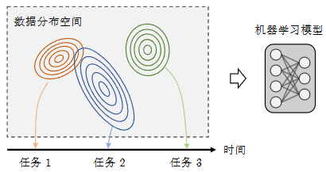
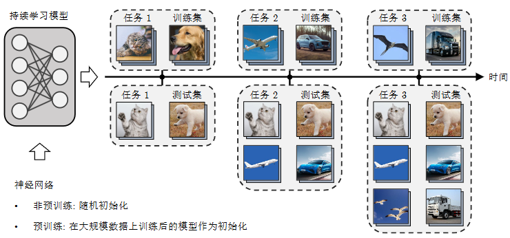

# 【视频专栏】面向大模型时代的持续学习方法论演变

原创 自动化学报 自动化学报 2025-07-04 17:00 北京

> 原文地址: [https://mp.weixin.qq.com/s/ZVyJl2symLk7uVM3QYHE1w](https://mp.weixin.qq.com/s/ZVyJl2symLk7uVM3QYHE1w)

点击上方**蓝字**关注我们

  

王全子昂, 王仁振, 孟德宇, 徐宗本. [面向大模型时代的持续学习方法论演变](http://www.aas.net.cn/cn/article/doi/10.16383/j.aas.c240805?viewType=HTML). 自动化学报, 2025, **51**(8): 1−27

点击即可观看视频

  

1

摘要

     以深度学习为代表的机器学习方法已经在多个领域取得显著进展, 然而大多方法局限于静态场景, 难以像人类一样在开放世界的动态场景中不断学习新知识, 同时保持已经学过的知识. 为解决该挑战, 持续学习受到越来越多的关注. 现有的持续学习方法大致可以分为两类, 即传统的非预训练模型持续学习方法以及大模型时代下逐步演进的预训练模型持续学习方法. 本文旨在对这两类方法的研究进展进行详细的综述, 主要从四个层面对比非预训练模型和预训练模型方法的异同点, 即数据层面、模型层面、损失/优化层面以及理论层面. 着重分析从应用非预训练模型的方法发展到应用预训练模型的方法的技术变化, 并分析出现此类差异的内在本质. 最后, 总结并展望未来持续学习发展的趋势.

  

2

引言

随着机器学习技术的发展, 人工智能模型在很多场景得到广泛的应用. 以计算机视觉为例, 在图像分类\[1−4\]、图像分割\[5−7\]、图像生成\[8−10\]等领域已经取得很好的效果. 然而, 当前的机器学习模型大多仅面向封闭的静态场景设计和开发, 仍然依赖于数据的独立同分布 (Independent and identically dis-tributed, i.i.d) 假设. 这些方法通常需要人工收集并处理大量样本用于模型训练, 训练后的模型在同分布的测试数据上能够取得较好的预测结果, 然而面对非同分布或动态变化的数据分布往往表现不佳. 如图1所示, 在真实世界中, 数据分布往往随时间和场景在持续地发生变化, 例如电商领域的推荐系统, 随着环境和时间变化, 人们对不同商品的喜好程度是时刻变化的, 并且会出现大量新商品需要模型拟合并预测, 传统的机器学习模型难以处理这样复杂动态场景. 这就需要机器学习模型能够模拟人类应对动态场景的能力, 不断学习新知识同时保留已经学过的历史任务的知识. 这即是持续学习(Continual learning, CL)的问题基本设定\[11−13\].  

图 1 动态场景下的机器学习图示 

  

持续学习旨在模拟人类的终身学习知识的能力, 故而也称为终身学习(Lifelong learning), 增量学习(Incremental learning). 如图2所示, 持续学习是希望机器学习模型按时序学习一系列任务的知识, 并且能够在所有见过的任务上表现良好. 由于学习新任务知识时难以接触到历史任务的数据, 所以模型很容易出现灾难性遗忘(Catastrophic for-getting)\[14\]问题, 即新任务到来后模型很快会遗忘已经学过的关于历史任务的知识, 导致模型在新任务上表现良好, 而过去见过的旧任务性能出现大幅下降. 所以持续学习方法希望尽可能保留处理旧任务的能力, 在此基础上融合新旧任务知识, 使得机器学习模型可以持续处理更加复杂多样的任务.  

图 2 持续学习设置图示 

  

值得说明的是, 持续学习的目标和设定与多任务学习(Multi-task learning)\[15−16\]以及在线学习Online learning)\[17\]不同. 多任务学习的目标是同时学习多个给定的不同任务, 希望模型在这些有限的任务上表现良好. 与持续学习的主要区别在于:多任务学习的任务集合是固定的, 不会出现遗忘问题; 而持续学习的任务集合是增量式的, 未来任务的数量、类型和数据分布都是未知的, 处理新任务时极易出现灾难性遗忘. 另一方面, 在线学习的目标是在流式数据上训练机器学习模型, 其数据依然服从独立同分布假设, 类别集合始终保持固定; 而持续学习仅假设每个任务的数据服从独立同分布假设, 随着新任务的到来, 持续学习模型需要处理的类别集合会不断扩张. 当前的一些持续学习方法也考虑更加实际且具有挑战性的在线持续学习(Online continual learning)设置, 即假设每个任务都是流式数据, 导致整个持续学习过程中数据分布变化更加剧烈且不稳定, 其具体问题设置在后续介绍.  

  

近年来, 很多优秀工作不断推动持续学习算法研究, 在图像分类、文本分类等多种问题上都取得很好的结果, 本文则主要关注图像分类问题的持续学习方法. 早期的持续学习方法主要针对规模相对较小的神经网络进行研究, 例如使用多层感知机(Multi-layer perception, MLP)或残差网络(Res-Net)\[2\]作为模型的主干网络. 这些方法的网络参数通常是随机初始化(Xavier初始化\[18\]、He初始化\[19\]等). 在整个持续学习过程中需要不断优化网络的全部参数, 从而增强应对各个任务的能力. 然而, 神经网络通常是在一个庞大的搜索空间中基于梯度下降进行优化, 这就导致网络参数很容易随数据分布的变化而快速变化, 对于历史任务的表征不稳定. 尤其当模型遇到新任务时, 网络参数对于从未见过的新任务数据往往表现得较为敏感, 其梯度量级要远大于对于历史任务数据的梯度, 使得模型很容易过度偏向沿着新任务梯度进行优化, 导致对于历史任务的表征受到破坏, 并出现灾难性遗忘. 所以早期持续学习方法尽管从不同角度提出很多有效且实用的方法来减轻遗忘问题, 但是受到主干网络优化的稳定性的限制, 整体的预测精度依然不高.  

  

随着机器学习技术和开源社区的发展, 特别是随着大模型时代的到来, 研究者开始尝试使用一些大规模预训练神经网络作为机器学习模型的主干网络. 这些预训练模型通常是在庞大的数据集上进行训练, 其参数量远超过先前工作中使用的多层感知机或残差网络, 可以适用于多种下游任务并达到惊人性能\[3−4,10\]. 因此, 这些预训练模型也被称为基础模型(Foundation model)\[20\], 如预训练ViT\[3\]、CLIP\[21\]以及各种大语言模型\[22\]等. 预训练基础模型通常具有强大的特征提取能力和泛化能力, 例如在零样本泛化(Zero-shot generalization)问题上就能取得较为不错的表现. 自然地, 人们希望这些大规模的预训练模型也可以像人类一样不断学习新知识, 从而应对更为复杂的开放世界的动态场景问题. 由于预训练模型参数量非常庞大, 直接调整其参数会耗费大量计算资源成本, 所以一些工作提出参数高效微调(Parameter efficient fine-tuning, PEFT)\[23−24\]策略,如Prompt tuning\[25−26\]、Adaptor\[27\]等方法. 然而在一系列下游任务上, 无论是直接调整预训练模型参数还是应用微调策略, 预训练基础模型仍然会出现严重的遗忘问题, 即下游任务表现良好, 但是预训练模型原有的特征表达和泛化能力会快速下降, 这就使得机器学习模型难以应对所有见过的任务, 无法处理动态场景问题. 为此, 近期出现大量基于预训练模型的持续学习方法, 希望利用预训练基础模型强大的表征能力来避免灾难性遗忘问题\[28−30\].  

  

 为方便起见, 在持续学习领域中, 本文将先前使用参数量较小的神经网络作为主干网络且没有预训练的方法称为非预训练持续学习方法, 将应用大规模预训练基础模型作为主干网络的方法称为预训练持续学习方法. 现有的持续学习领域的综述文章目前并没有深入探讨传统的非预训练持续学习方法和预训练持续学习方法之间的本质联系和区别. 具体而言, 综述\[11\]是较早的关于持续学习的完整综述, 仅整理当时已有的非预训练持续学习方法; 综述\[12−13\]简单介绍预训练持续学习方法, 并将其看作是一类独立的方法, 并未深入考虑这些方法和非预训练持续学习方法的差异和联系; 而综述\[28\]则主要关注预训练持续学习方法的发展, 对其进行更细致地划分和整理. 另外, 还有一些综述文章仅针对特定的设置或领域进行总结, 如综述\[31−32\]仅关注小样本持续学习的设置; 综述\[29−30\]对基于预训练语言大模型的持续学习方法进行整理; 综述\[33\]则重点关注多模态持续学习领域的发展并对相关方法进行总结. 本文重点关注视觉相关的分类问题, 重新梳理持续学习整体发展路线, 整理并分析从非预训练持续学习方法到预训练持续学习方法的思路和技术上的变化, 着重探讨目前更加前沿的基于预训练大模型的持续学习依然存在的问题,深入探讨持续学习未来可能的发展趋势.  

  

本文的整体结构如下: 第1节主要介绍持续学习的基本框架、常见设置以及评价指标; 第2节分别从数据、模型、损失/优化以及理论四个方面介绍非预训练模型和预训练模型的方法, 对比两类方法论的技术变化并分析其差异化的原因, 最后探讨未来持续学习技术的发展趋势; 第3节简要介绍持续学习技术在其他相关领域中的应用; 第4节对全文进行总结与展望.

  

3

正文框架

1\. 持续学习基本设置

  1.1 基本框架     

  1.2 常见设置     

  1.3 评价指标 

2\. 持续学习方法研究脉络     

  2.1 数据层面         

    2.1.1 数据层面的非预训练持续学习模型         

    2.1.2 数据层面的预训练持续学习模型         

    2.1.3 发展趋势     

  2.2 模型层面         

    2.2.1 模型层面的非预训练持续学习模型         

    2.2.2 模型层面的预训练持续学习模型

    2.2.3 发展趋势 

  2.3 损失/优化层面     

    2.3.1 损失/优化层面的非预训练持续学习模型     

    2.3.2 损失/优化层面的预训练持续学习模型     

    2.3.3 发展趋势 

  2.4 理论层面     

    2.4.1 关于持续学习的理论研究进展

    2.4.2 发展趋势 

3\. 持续学习应用及相关研究方向 

4\. 结束语

  

  

**部分文献**

  

\[1\]Simonyan K, Zisserman A. Very deep convolutional networksfor large-scale image recognition. In: Proceedings of the 3rd In-ternational Conference on Learning Representations. SanDiego, USA: ICLR, 2015. 1−14

\[2\]He K M, Zhang X Y, Ren S Q, Sun J. Deep residual learningfor image recognition. In: Proceedings of the IEEE Conferenceon Computer Vision and Pattern Recognition. Las Vegas, USA:IEEE, 2016. 770−778

\[3\]Dosovitskiy A, Beyer L, Kolesnikov A, Weissenborn D, Zhai X,Unterthiner T, et al. An image is worth 16 × 16 words: Trans-formers for image recognition at scale. arXiv preprint arXiv:2010.11929, 2020

\[4\]Liu Z, Lin Y T, Cao Y, Hu H, Wei Y X, Zhang Z Z, et al.Swin transformer: Hierarchical vision transformer using shiftedwindows. In: Proceedings of the IEEE/CVF International Con-ference on Computer Vision. Montreal, Canada: IEEE, 2021.9992−10002

\[5\]Zhao H S, Shi J P, Qi X J, Wang X G, Jia J Y. Pyramid sceneparsing network. In: Proceedings of the IEEE Conference onComputer Vision and Pattern Recognition. Honolulu, USA:IEEE, 2017. 6230−6239

\[6\]Zheng S X, Lu J C, Zhao H S, Zhu X T, Luo Z K, Wang Y B,et al. Rethinking semantic segmentation from a sequence-to-se-quence perspective with transformers. In: Proceedings of theIEEE/CVF Conference on Computer Vision and Pattern Re-cognition. Nashville, USA: IEEE, 2021. 6877−6886

\[7\]He K M, Chen X L, Xie S N, Li Y H, Dollár P, Girshick R.Masked autoencoders are scalable vision learners. In: Proceed-ings of the IEEE/CVF Conference on Computer Vision andPattern Recognition. New Orleans, USA: IEEE, 2022. 15979−15988

\[8\]Goodfellow I, Pouget-Abadie J, Mirza M, Xu B, Warde-FarleyD, Ozair S, et al. Generative adversarial networks. Communic-ations of the ACM, 2020, 63(11): 139−144

\[9\]Kingma D P, Welling M. Auto-encoding variational Bayes. In:Proceedings of the 2nd International Conference on LearningRepresentations. Banff, Canada: ICLR, 2014. 1−14

\[10\]Ho J, Jain A, Abbeel P. Denoising diffusion probabilistic mod-els. In: Proceedings of the 34th International Conference onNeural Information Processing Systems. Vancouver, Canada:Curran Associates Inc., 2020. Article No. 574

\[11\]de Lange M, Aljundi R, Masana M, Parisot S, Jia X, Leonard-is G, et al. A continual learning survey: Defying forgetting inclassification tasks. IEEE Transactions on Pattern Analysisand Machine Intelligence, 2022, 44(7): 3366−3385

\[12\]Wang L Y, Zhang X X, Su H, Zhu J. A comprehensive surveyof continual learning: Theory, method and application. IEEETransactions on Pattern Analysis and Machine Intelligence,2024, 46(8): 5362−5383

\[13\]Zhou D W, Wang Q W, Qi Z H, Ye H J, Zhan D C, Liu Z W.Classincremental learning: A survey. IEEE Transactions onPattern Analysis and Machine Intelligence, 2024, 46(12): 9851−9873

\[14\]McCloskey M, Cohen N J. Catastrophic interference in connec-tionist networks: The sequential learning problem. Psychologyof Learning and Motivation, 1989, 24: 109−165

\[15\]Zhang Y, Yang Q. A survey on multi-task learning. IEEETransactions on Knowledge and Data Engineering, 2022,34(12): 5586−5609

\[16\]Sener O, Koltun V. Multi-task learning as multi-objective op-timization. In: Proceedings of the 32nd Neural InformationProcessing Systems. Montréal, Canada: Curran Associates Inc.2018. 525−536

\[17\]Hoi S C H, Sahoo D, Lu J, Zhao P L. Online learning: A com-prehensive survey. Neurocomputing, 2021, 459: 249−289

\[18\]Glorot X, Bengio Y. Understanding the difficulty of trainingdeep feedforward neural networks. In: Proceedings of the 13thInternational Conference on Artificial Intelligence and Statist-ics. Sardinia, Italy: PMLR, 2010. 249−256

\[19\]He K M, Zhang X Y, Ren S Q, Sun J. Delving deep into recti-fiers: Surpassing human-level performance on ImageNet classi-fication. In: Proceedings of the IEEE International Conferenceon Computer Vision. Santiago, Chile: IEEE, 2015. 1026−1034

\[20\]Bommasani R, Hudson D A, Adeli E, Altman R, Arora S, vonArx S, et al. On the opportunities and risks of foundation mod-els. arXiv preprint arXiv: 2108.07258, 2021.

\[21\]Radford A, Kim J W, Hallacy C, Ramesh A, Goh G, AgarwalS, et al. Learning transferable visual models from natural lan-guage supervision. In: Proceedings of the 38th InternationalConference on Machine Learning. Virtual Event: PMLR, 2021.8748−8763

\[22\]Zhao W X, Zhou K, Li J Y, Tang T Y, Wang X L, Hou Y P,et al. A survey of large language models. arXiv preprint arXiv:2303.18223, 2023

\[23\]Han Z Y, Gao C, Liu J Y, Zhang J, Zhang S Q. Parameter-effi-cient fine-tuning for large models: A comprehensive survey.arXiv preprint arXiv: 2403.14608, 2024

\[24\]Xin Y, Yang J J, Luo S Q, Zhou H D, Du J L, Liu X H, et al.Parameter-efficient fine-tuning for pre-trained vision models: Asurvey. arXiv preprint arXiv: 2402.02242, 2024

\[25\]Lester B, Al-Rfou R, Constant N. The power of scale for para-meter-efficient prompt tuning. In: Proceedings of the Confer-ence on Empirical Methods in Natural Language Processing.Punta Cana, Dominican Republic: Association for Computa-tional Linguistics, 2021. 3045−3059

\[26\]Jia M L, Tang L M, Chen B C, Cardie C, Belongie S, Harihar-an B, et al. Visual prompt tuning. In: Proceedings of the 17thEuropean Conference on Computer Vision. Tel Aviv, Israel:Springer, 2022. 709−727

\[27\]Hu E J, Shen Y L, Wallis P, Allen-Zhu Z, Li Y Z, Wang S A,et al. LoRA: Low-rank adaptation of large language models. In:Proceedings of the 10th International Conference on LearningRepresentations. Virtual Event: ICLR, 2022. 1−13

\[28\]Zhou D W, Sun H L, Ning J Y, Ye H J, Zhan D C. Continuallearning with pre-trained models: A survey. In: Proceedings ofthe 33rd International Joint Conference on Artificial Intelli-gence. Jeju, South Korea: IJCAI, 2024. 8363−8371

\[29\]Wu T T, Luo L H, Li Y F, Pan S R, Vu T T, Haffari G. Con-tinual learning for large language models: A survey. arXiv pre-print arXiv: 2402.01364, 2024

\[30\]Shi H Z, Xu Z H, Wang H Y, Qin W Y, Wang W Y, Wang YB, et al. Continual learning of large language models: A com-prehensive survey. arXiv preprint arXiv: 2404.16789, 2024

\[31\]Zhang J H, Liu L, Silvén O, Pietikäinen M, Hu D W. Few-shotclass-incremental learning for classification and object detec-tion: A survey. IEEE Transactions on Pattern Analysis andMachine Intelligence, 2025, 47(4): 2924−2945

\[32\]Tian S S, Li L S, Li W J, Ran H, Ning X, Tiwari P. A surveyon few-shot class-incremental learning. Neural Networks, 2024,169: 307−324

\[33\]Yu D Z, Zhang X N, Chen Y K, Liu A W, Zhang Y F, Yu P S,et al. Recent advances of multimodal continual learning: Acomprehensive survey. arXiv preprint arXiv: 2410.0535, 2024.

  

**作者简介**

  

  

王全子昂, 西安交通大学数学与统计学院博士研究生. 2019 年获得西安交通大学学士学位. 主要研究方向为机器学习, 持续学习和半监督学习.

  

王仁振, 西安交通大学数学与统计学院助理教授. 2022 年获得西安交通大学博士学位. 主要研究方向为半监督学习, 持续学习和医学图像分析.

  

孟德宇, 西安交通大学数学与统计学院教授, 澳门科技大学特聘教授.2008 年获得西安交通大学博士学位.主要研究方向为机器学习, 人工智能和计算机视觉.

  

徐宗本, 中国科学院院士, 西安交通大学数学与统计学院教授. 1987 年获得西安交通大学博士学位. 主要研究方向为大数据与人工智能的数学基础与核心算法.

  

**热**

**点**

**文**

**章**

[【视频专栏】电力设施多模态精细化机器人巡检关键技术及应用](https://mp.weixin.qq.com/s?__biz=MzI2NjA3MzM5MA==&mid=2650004005&idx=1&sn=c67ac894129f6020a65ddb8d1a096b6f&scene=21#wechat_redirect)

[【视频专栏】基于大模型的具身智能系统综述](https://mp.weixin.qq.com/s?__biz=MzI2NjA3MzM5MA==&mid=2650003856&idx=1&sn=4f39c045003477a848d3a100353812ca&scene=21#wechat_redirect)

[【视频专栏】无人飞行器集群自主控制: 预设性能驱动的安全编队控制](https://mp.weixin.qq.com/s?__biz=MzI2NjA3MzM5MA==&mid=2650003850&idx=1&sn=3510c49397b356de4f4a829af18ee0ba&scene=21#wechat_redirect)

[【视频专栏】时间序列分类模型的集成对抗训练防御方法](https://mp.weixin.qq.com/s?__biz=MzI2NjA3MzM5MA==&mid=2650003845&idx=1&sn=047cf795b25d206fc00e2ccec6106bab&scene=21#wechat_redirect)

[【视频专栏】基于零和微分博弈的航天器编队通信链路故障容错控制](https://mp.weixin.qq.com/s?__biz=MzI2NjA3MzM5MA==&mid=2650003823&idx=1&sn=f2a388ad3c284f99b32a357c4388a89a&scene=21#wechat_redirect)

[【视频专栏】行人惯性定位新动态: 基于神经网络的方法、性能与展望](https://mp.weixin.qq.com/s?__biz=MzI2NjA3MzM5MA==&mid=2650003817&idx=1&sn=0bf22ec6111160539e4f68d1d7cd2581&scene=21#wechat_redirect)

[【视频专栏】前额叶皮层启发的Transformer模型应用及其进展](https://mp.weixin.qq.com/s?__biz=MzI2NjA3MzM5MA==&mid=2650003789&idx=1&sn=4628505b878c4a478187bdb5a5cd457f&scene=21#wechat_redirect)

[【视频专栏】基于仿真机理和改进回归决策树的二噁英排放建模](https://mp.weixin.qq.com/s?__biz=MzI2NjA3MzM5MA==&mid=2650003776&idx=1&sn=7d080fe02d7b365c207584c80925dedc&scene=21#wechat_redirect)

[【视频专栏】收缩、分离和聚合: 面向长尾视觉识别的特征平衡方法](https://mp.weixin.qq.com/s?__biz=MzI2NjA3MzM5MA==&mid=2650003755&idx=1&sn=1590f91c56ed9184e626d556861b8a9f&scene=21#wechat_redirect)

[【视频专栏】基于自组织递归小波神经网络的污水处理过程多变量控制](https://mp.weixin.qq.com/s?__biz=MzI2NjA3MzM5MA==&mid=2650003738&idx=1&sn=839dd5673821c09e521f344d595bc836&scene=21#wechat_redirect)

[2024年度自动化学科国家自然科学基金项目申请与资助情况综述](https://mp.weixin.qq.com/s?__biz=MzI2NjA3MzM5MA==&mid=2650002664&idx=1&sn=849ab0044383328c3edb6f49bdf1c770&scene=21#wechat_redirect)

[【视频专栏】多尺度视觉语义增强的多模态命名实体识别方法](https://mp.weixin.qq.com/s?__biz=MzI2NjA3MzM5MA==&mid=2650002642&idx=1&sn=77d0bde604b7f8f9b80889f77db2f0ec&scene=21#wechat_redirect)

[【视频专栏】基于被动声呐音频信号的水中目标识别综述](https://mp.weixin.qq.com/s?__biz=MzI2NjA3MzM5MA==&mid=2650002637&idx=1&sn=5e362f1a68719bfa31be68145f111e90&scene=21#wechat_redirect)

[【视频专栏】基于慢特征分析的分布式动态工业过程运行状态评价](https://mp.weixin.qq.com/s?__biz=MzI2NjA3MzM5MA==&mid=2650002613&idx=1&sn=2bdd9d5d7b20f19caf30be5b298a5850&scene=21#wechat_redirect)

[【视频专栏】基于多尺度流模型的视觉异常检测研究](https://mp.weixin.qq.com/s?__biz=MzI2NjA3MzM5MA==&mid=2650001911&idx=1&sn=ecbca405c481ab60135af4c8156f4c22&scene=21#wechat_redirect)

[【视频专栏】面向工业过程的图像生成及其应用研究综述](https://mp.weixin.qq.com/s?__biz=MzI2NjA3MzM5MA==&mid=2650001789&idx=1&sn=d995d02870670a8fcafb528eb2c63cc0&scene=21#wechat_redirect)

[【视频专栏】叠层模型驱动的书法文字识别方法研究](https://mp.weixin.qq.com/s?__biz=MzI2NjA3MzM5MA==&mid=2650001754&idx=1&sn=ee40b15ca961248756cfdaca99ef633e&scene=21#wechat_redirect)

[【视频专栏】外部干扰和随机DoS攻击下的网联车安全H∞ 队列控制](https://mp.weixin.qq.com/s?__biz=MzI2NjA3MzM5MA==&mid=2650001747&idx=1&sn=10af98de509e5eba3c0e124f842ea092&scene=21#wechat_redirect)

[【视频专栏】航天器姿态受限的协同势函数族设计方法](https://mp.weixin.qq.com/s?__biz=MzI2NjA3MzM5MA==&mid=2650001653&idx=1&sn=2727a3ebf3fbc25aaca01582570c0f74&scene=21#wechat_redirect)

[【视频专栏】虹膜呈现攻击检测综述](https://mp.weixin.qq.com/s?__biz=MzI2NjA3MzM5MA==&mid=2650001419&idx=1&sn=9935082d26aa31b227236fc458c81a28&scene=21#wechat_redirect)

[【视频专栏】一种边界增强的医学图像小样本分割网络](https://mp.weixin.qq.com/s?__biz=MzI2NjA3MzM5MA==&mid=2649999124&idx=1&sn=afe4ace33e6f05830f4b50d9b97bf443&scene=21#wechat_redirect)

[【视频专栏】基于捕获点理论的混合驱动水下刀锋腿机器人稳定性判据](https://mp.weixin.qq.com/s?__biz=MzI2NjA3MzM5MA==&mid=2649999120&idx=1&sn=6832404a62c752a41316687b67b664b9&scene=21#wechat_redirect)

[【视频专栏】面向自动驾驶测试的危险变道场景泛化生成](https://mp.weixin.qq.com/s?__biz=MzI2NjA3MzM5MA==&mid=2649997130&idx=1&sn=288877fc42a8d0c0fa4863e982d40e5c&scene=21#wechat_redirect)

[【视频专栏】全天实时跟踪无人机目标的多正则化相关滤波算法](https://mp.weixin.qq.com/s?__biz=MzI2NjA3MzM5MA==&mid=2649994631&idx=1&sn=9aec26372b4c60bfadf889a34d7922da&scene=21#wechat_redirect)

[【视频专栏】面向研究问题的深度学习事件抽取综述](https://mp.weixin.qq.com/s?__biz=MzI2NjA3MzM5MA==&mid=2649994625&idx=1&sn=d74bf8af7713edac585290c01ad62f3e&scene=21#wechat_redirect)

[【视频专栏】联合深度超参数卷积和交叉关联注意力的大位移光流估计](https://mp.weixin.qq.com/s?__biz=MzI2NjA3MzM5MA==&mid=2649994575&idx=1&sn=59c57e42cb8782fce8f1b18f5e8a2eeb&scene=21#wechat_redirect)

[【视频专栏】智能网联电动汽车节能优化控制研究进展与展望](https://mp.weixin.qq.com/s?__biz=MzI2NjA3MzM5MA==&mid=2649994506&idx=1&sn=c04f6769ca2080bb2d45124569e3d023&scene=21#wechat_redirect)

[【视频专栏】含有输入时滞的非线性系统的输出反馈采样控制](https://mp.weixin.qq.com/s?__biz=MzI2NjA3MzM5MA==&mid=2649994468&idx=1&sn=8d60584613c5534f62f9ff338673b7c2&scene=21#wechat_redirect)

[【视频专栏】基于多示例学习图卷积网络的隐写者检测](https://mp.weixin.qq.com/s?__biz=MzI2NjA3MzM5MA==&mid=2649994463&idx=1&sn=7d890483cbec1dc28fc4077e283630d2&scene=21#wechat_redirect)

[【视频专栏】逆强化学习算法、理论与应用研究综述](https://mp.weixin.qq.com/s?__biz=MzI2NjA3MzM5MA==&mid=2649994414&idx=1&sn=417e22e0c2968c320f85c985ae8382fc&scene=21#wechat_redirect)

[【视频专栏】基于注意力机制和循环域三元损失的域适应目标检测](https://mp.weixin.qq.com/s?__biz=MzI2NjA3MzM5MA==&mid=2649994367&idx=1&sn=f285ff14cae5c1654c969984e245cb81&scene=21#wechat_redirect)

[【视频专栏】基于语境辅助转换器的图像标题生成算法](https://mp.weixin.qq.com/s?__biz=MzI2NjA3MzM5MA==&mid=2649994195&idx=1&sn=a34112e60d2acadddd98669ab669f79b&scene=21#wechat_redirect)

[【视频专栏】数据驱动的间歇低氧训练贝叶斯优化决策方法](https://mp.weixin.qq.com/s?__biz=MzI2NjA3MzM5MA==&mid=2649992616&idx=1&sn=5cdc4acb37f10484f5fb4f687917423e&scene=21#wechat_redirect)

[【视频专栏】无控制器间通信的线性多智能体一致性的降阶协议](https://mp.weixin.qq.com/s?__biz=MzI2NjA3MzM5MA==&mid=2649992535&idx=1&sn=5d756a7b9ddd2c427296abf18204b912&scene=21#wechat_redirect)

[【视频专栏】异策略深度强化学习中的经验回放研究综述](https://mp.weixin.qq.com/s?__biz=MzI2NjA3MzM5MA==&mid=2649992530&idx=1&sn=182c20bf9cf9009c481f2f6d0796ae2f&scene=21#wechat_redirect)

[【视频专栏】基于距离信息的追逃策略:信念状态连续随机博弈](https://mp.weixin.qq.com/s?__biz=MzI2NjA3MzM5MA==&mid=2649991472&idx=1&sn=5181818a450e0a369a85e3d40640fc8e&scene=21#wechat_redirect)

[【视频专栏】城市固废焚烧过程智能优化控制研究现状与展望](https://mp.weixin.qq.com/s?__biz=MzI2NjA3MzM5MA==&mid=2649991467&idx=1&sn=19ac55f597053208e3112503d4851945&scene=21#wechat_redirect)

[【视频专栏】深度对比学习综述](https://mp.weixin.qq.com/s?__biz=MzI2NjA3MzM5MA==&mid=2649990249&idx=1&sn=f2371317def406b8d981280f438a98a0&scene=21#wechat_redirect)

[【视频专栏】视网膜功能启发的边缘检测层级模型](https://mp.weixin.qq.com/s?__biz=MzI2NjA3MzM5MA==&mid=2649990097&idx=1&sn=9c006598a141c960afeb736fe6c18322&scene=21#wechat_redirect)

[【视频专栏】一种新的分段式细粒度正则化的鲁棒跟踪算法](https://mp.weixin.qq.com/s?__biz=MzI2NjA3MzM5MA==&mid=2649990029&idx=1&sn=0713cd87b2b01b3d75e70d82f1060106&scene=21#wechat_redirect)

[【](https://mp.weixin.qq.com/s?__biz=MzI2NjA3MzM5MA==&mid=2649989511&idx=1&sn=4a60cca006ab7b8b69b542699df95942&scene=21#wechat_redirect)视频专栏】基于自适应多尺度超螺旋算法的无人机集群姿态同步控制

[【视频专栏】基于多层注意力和消息传递网络的药物相互作用预测方法](https://mp.weixin.qq.com/s?__biz=MzI2NjA3MzM5MA==&mid=2649988637&idx=1&sn=d706c4bb2bc69cc69ed54da87af8c052&scene=21#wechat_redirect)

[【视频专栏】基于分层控制策略的六轮滑移机器人横向稳定性控制](https://mp.weixin.qq.com/s?__biz=MzI2NjA3MzM5MA==&mid=2649985235&idx=2&sn=58d3e84944a30b8123f70d048edcd370&scene=21#wechat_redirect)

[【视频专栏】基于改进YOLOX的移动机器人目标跟随方法](https://mp.weixin.qq.com/s?__biz=MzI2NjA3MzM5MA==&mid=2649985156&idx=2&sn=29232f90232aea818f7a01afa3f5a36a&scene=21#wechat_redirect)

[自动化学报创刊60周年专刊| 孙长银教授等：基于因果建模的强化学习控制: 现状及展望](https://mp.weixin.qq.com/s?__biz=MzI2NjA3MzM5MA==&mid=2649985156&idx=1&sn=4af3bc3bc9a540beb3f43227b15d1337&scene=21#wechat_redirect)

[【视频专栏】基于多尺度变形卷积的特征金字塔光流计算方法](https://mp.weixin.qq.com/s?__biz=MzI2NjA3MzM5MA==&mid=2649984913&idx=2&sn=310b86ad662f17d450f55e8e3c2dd178&scene=21#wechat_redirect)

[自动化学报创刊60周年专刊| 柴天佑教授等：端边云协同的PID整定智能系统](https://mp.weixin.qq.com/s?__biz=MzI2NjA3MzM5MA==&mid=2649984913&idx=1&sn=ef45062894b813512922b43b45ed2b20&scene=21#wechat_redirect)

[【视频专栏】一种同伴知识互增强下的序列推荐方法](https://mp.weixin.qq.com/s?__biz=MzI2NjA3MzM5MA==&mid=2649984132&idx=2&sn=6f8188f47dbac43358135416ef84152a&scene=21#wechat_redirect)

[自动化学报创刊60周年专刊| 桂卫华教授等：复杂生产流程协同优化与智能控制](https://mp.weixin.qq.com/s?__biz=MzI2NjA3MzM5MA==&mid=2649984132&idx=1&sn=723478ec0cdb2b7ff3ce3cb8387f29fb&scene=21#wechat_redirect)

[【视频专栏】 基于跨模态实体信息融合的神经机器翻译方法](https://mp.weixin.qq.com/s?__biz=MzI2NjA3MzM5MA==&mid=2649983799&idx=2&sn=e7ce4f930169bc300e4d37619fdca604&scene=21#wechat_redirect)

[自动化学报创刊60周年专刊| 王耀南教授等：机器人感知与控制关键技术及其智能制造应用](https://mp.weixin.qq.com/s?__biz=MzI2NjA3MzM5MA==&mid=2649983799&idx=1&sn=dc9438335246ff414b912e29e9eb764c&scene=21#wechat_redirect)

[【视频专栏】机器人运动轨迹的模仿学习综述](https://mp.weixin.qq.com/s?__biz=MzI2NjA3MzM5MA==&mid=2649983595&idx=2&sn=f7f6d953924bc87606e3cff241d67c91&scene=21#wechat_redirect)

[自动化学报创刊60周年专刊| 于海斌研究员等：无线化工业控制系统: 架构、关键技术及应用](https://mp.weixin.qq.com/s?__biz=MzI2NjA3MzM5MA==&mid=2649983595&idx=1&sn=d9545fc8cbb247e17e7eceac9f845155&scene=21#wechat_redirect)

[自动化学报创刊60周年专刊| 王飞跃教授等：平行智能与CPSS: 三十年发展的回顾与展望](https://mp.weixin.qq.com/s?__biz=MzI2NjA3MzM5MA==&mid=2649983512&idx=2&sn=17e0d1102db102517c33e43c04240468&scene=21#wechat_redirect)

[自动化学报创刊60周年专刊| 陈杰教授等：非线性系统的安全分析与控制: 障碍函数方法](https://mp.weixin.qq.com/s?__biz=MzI2NjA3MzM5MA==&mid=2649983132&idx=1&sn=32c7e4b6c4c3f6d48726380c7445c8d2&scene=21#wechat_redirect)

[自动化学报创刊60周年专刊| 乔俊飞教授等：城市固废焚烧过程数据驱动建模与自组织控制](https://mp.weixin.qq.com/s?__biz=MzI2NjA3MzM5MA==&mid=2649983104&idx=1&sn=c21c87bc60f9ba05b85ac2a4ddf04e73&scene=21#wechat_redirect)

[自动化学报创刊60周年专刊| 姜斌教授等：航天器位姿运动一体化直接自适应容错控制研究](https://mp.weixin.qq.com/s?__biz=MzI2NjA3MzM5MA==&mid=2649982991&idx=1&sn=402f25724c6c016cd492e8f4ca9764c7&scene=21#wechat_redirect)

[自动化学报创刊60周年专刊| 王龙教授等：多智能体博弈、学习与控制](https://mp.weixin.qq.com/s?__biz=MzI2NjA3MzM5MA==&mid=2649983104&idx=2&sn=4e9ed9cff5c9acf2c85da060749b7fbe&scene=21#wechat_redirect)

[自动化学报创刊60周年专刊| 刘成林研究员等：类别增量学习研究进展和性能评价](https://mp.weixin.qq.com/s?__biz=MzI2NjA3MzM5MA==&mid=2649982935&idx=1&sn=98725e6e1d7489129fe88c26d8f206f4&scene=21#wechat_redirect)

[《自动化学报》创刊60周年专刊｜杨孟飞研究员等：空间控制技术发展与展望](https://mp.weixin.qq.com/s?__biz=MzI2NjA3MzM5MA==&mid=2649982899&idx=1&sn=839c1c4632e2bc46fc39972f72d76209&scene=21#wechat_redirect)

**期**

**刊**

**动**

**态**

[》《自动化学报》学生作者分享会第1期](https://mp.weixin.qq.com/s?__biz=MzI2NjA3MzM5MA==&mid=2650003861&idx=1&sn=e1e3b064c8d3c47b6bd1c4e45e3f340f&scene=21#wechat_redirect)

[》《自动化学报》致谢审稿人（2024年度）](https://mp.weixin.qq.com/s?__biz=MzI2NjA3MzM5MA==&mid=2650002940&idx=1&sn=143124df4e9f117cf65dba731316d450&scene=21#wechat_redirect)

[》CJCR发布：自动化学报各项主要指标蝉联第1](http://mp.weixin.qq.com/s?__biz=MzI2NjA3MzM5MA==&mid=2650001473&idx=1&sn=eb2e44a48f804b67cb3a4c9709aae25c&chksm=f294d400c5e35d162db46a5d31d07f904cf89fbe646f5488b4e97b743effd29db6c0a5014c06&scene=21#wechat_redirect)

[》自动化学报排名第一，持续入选中国权威学术期刊（A+）](http://mp.weixin.qq.com/s?__biz=MzI2NjA3MzM5MA==&mid=2649995334&idx=1&sn=bf87bcddd566917490e06918b8895fe2&chksm=f294bc07c5e335115415c45903d01f3133749582e672a81464c428dcb5f845aec3f9b109ea5f&scene=21#wechat_redirect)

[》《自动化学报》兼职编辑招聘启事](http://mp.weixin.qq.com/s?__biz=MzI2NjA3MzM5MA==&mid=2649991339&idx=2&sn=4c2100dfa7c2df04170a136517068f49&chksm=f294aceac5e325fc7a2334e5d9449e3100d7adfb6f1fda1d26b67e0980db13c104b686d4dcad&scene=21#wechat_redirect)

[》《自动化学报》创刊六十周年学术研讨会第六期](http://mp.weixin.qq.com/s?__biz=MzI2NjA3MzM5MA==&mid=2649991050&idx=1&sn=d10a737dd85c77b4d2229be1e9dbbd6f&chksm=f294a3cbc5e32add703d75c7279b1119564a3d56eef1f26f448aaaa1e81447691ba8dab8daa0&scene=21#wechat_redirect)

[》《自动化学报》创刊六十周年学术研讨会第五期](http://mp.weixin.qq.com/s?__biz=MzI2NjA3MzM5MA==&mid=2649990342&idx=1&sn=cea126ca0e0f85f2ece3f73bfa9b126e&chksm=f294a087c5e32991a89b8d16ee745e2cc28b5d632ff08495d5b8f958853a717db99c68b078d8&scene=21#wechat_redirect)

[》自动化学报蝉联百种中国杰出期刊称号](http://mp.weixin.qq.com/s?__biz=MzI2NjA3MzM5MA==&mid=2649990067&idx=1&sn=4a6e171d54d1c781c8809f67f05967c1&chksm=f294a7f2c5e32ee4cac04ce10b0b413f2d356bb2b80e6d4426c65df3df25e7cd87eaaa0a3954&scene=21#wechat_redirect)

[》《自动化学报》20篇文章入选2023“领跑者5000”顶尖论文](http://mp.weixin.qq.com/s?__biz=MzI2NjA3MzM5MA==&mid=2649990046&idx=1&sn=7ee7129e9edf7ffe5e19d1b5fc0da8d3&chksm=f294a7dfc5e32ec9f4542539eb8476f0eedd4d11869f34265b065bc2ff1051e0a6cfd4c13f27&scene=21#wechat_redirect)

[》《自动化学报》创刊六十周年学术研讨会第三期](http://mp.weixin.qq.com/s?__biz=MzI2NjA3MzM5MA==&mid=2649985287&idx=1&sn=e088055dfb077c99cac881b294bfb860&chksm=f2949546c5e31c50f600d10eecd1a83ec3e5a2695f0905c4c988190106d18c6e01e8630bcd17&scene=21#wechat_redirect)

[》《自动化学报》创刊六十周年学术研讨会第二期](http://mp.weixin.qq.com/s?__biz=MzI2NjA3MzM5MA==&mid=2649984459&idx=1&sn=bade18d071fffdbd94a0062aa09e5821&chksm=f294898ac5e3009ca3e2a687b9e97fa8ef2274e6318b7b241ba9092d113839da69bf8337ebcc&scene=21#wechat_redirect)

[》《自动化学报》创刊六十周年学术研讨会第一期](http://mp.weixin.qq.com/s?__biz=MzI2NjA3MzM5MA==&mid=2649983235&idx=1&sn=8632016cf5744a797ee7ae7cf07ab943&chksm=f2948d42c5e304545e4a472d6b88fdf4a9f922013348a8d4f2ae4db0f1c6a4081245695cf3e9&scene=21#wechat_redirect)

[》《自动化学报》13篇文章入选2022“领跑者5000”顶尖论文](http://mp.weixin.qq.com/s?__biz=MzI2NjA3MzM5MA==&mid=2649982409&idx=1&sn=d0d4e97a7ac4337ca8e699625ddb94e5&chksm=f2948188c5e3089e988782a341caabdae47e6929a8e649b14438829e37e279f816f19e0652de&scene=21#wechat_redirect)

[》自动化学报连续11年入选国际影响力TOP期刊榜单](http://mp.weixin.qq.com/s?__biz=MzI2NjA3MzM5MA==&mid=2649981948&idx=1&sn=6b850c9c095f2e9cbbb899c8b4a8149d&chksm=f29487bdc5e30eab3df0fb761e7f00b3c4945f7e0e971483a4c5f37434032e69f76d2f9f4160&scene=21#wechat_redirect)

[》《自动化学报》17篇文章入选2021“领跑者5000”顶尖论文](http://mp.weixin.qq.com/s?__biz=MzI2NjA3MzM5MA==&mid=2649978148&idx=1&sn=279c2b1746c902b4dd71e8caef8edca4&chksm=f2947165c5e3f873100609f63b9358e6959232e72b83e44e828859065146391b62fd3c60dc39&scene=21#wechat_redirect)

[》自动化学报（英文版）和自动化学报入选计算领域高质量科技期刊T1类](http://mp.weixin.qq.com/s?__biz=MzI2NjA3MzM5MA==&mid=2649961858&idx=1&sn=eaccb38a93a2b1f11e0f1b0f80476b12&chksm=f29431c3c5e3b8d5417d6e17aedae4c58f707822ee67c5f1d87a24308e56f888a31bff8ae332&scene=21#wechat_redirect)

[》自动化学报多篇论文入选中国百篇最具影响国内论文和中国精品期刊顶尖论文](http://mp.weixin.qq.com/s?__biz=MzI2NjA3MzM5MA==&mid=2649961152&idx=1&sn=4a5e9e4b84879f4cde4e13a0ef97272c&chksm=f2943681c5e3bf97d7770c9623dac869b283b3ea83f3d320017974033e361d8b999134a8bdff&scene=21#wechat_redirect)

[》自动化学报蝉联百种中国杰出期刊称号，入选中国精品科技期刊](http://mp.weixin.qq.com/s?__biz=MzI2NjA3MzM5MA==&mid=2649957485&idx=1&sn=8af865466cb6f52b05a1e41af8549e71&chksm=f294202cc5e3a93a40b4850e6e0f0bccaf56c89591e049e9d98bfe9a598913f5d25e8ecfcf8d&scene=21#wechat_redirect)

[》《自动化学报》挺进世界期刊影响力指数Q1区](http://mp.weixin.qq.com/s?__biz=MzI2NjA3MzM5MA==&mid=2649957452&idx=1&sn=c5fa8ac9c581e4ae3de2e7956e603dca&chksm=f294200dc5e3a91bb250e25fd6f7e47dc1114ad6fdf1762a7bfc440f789a059f1de455584e66&scene=21&token=489162852&lang=zh_CN#wechat_redirect)

**期**

**刊**

**目**

**录**

[》2025年第6期](https://mp.weixin.qq.com/s?__biz=MzI2NjA3MzM5MA==&mid=2650004010&idx=1&sn=d3ca761542c86da1a2474f37e3d1b9d6&scene=21#wechat_redirect)

[》2025年第5期](https://mp.weixin.qq.com/s?__biz=MzI2NjA3MzM5MA==&mid=2650003999&idx=1&sn=f05167a6cfc0908fdb59f45c4cefd57a&scene=21#wechat_redirect)

[》2025年第4期](https://mp.weixin.qq.com/s?__biz=MzI2NjA3MzM5MA==&mid=2650003831&idx=1&sn=9de9fa20d954d43779505cfacfdbf7fb&scene=21#wechat_redirect)

[》2025年第3期](https://mp.weixin.qq.com/s?__biz=MzI2NjA3MzM5MA==&mid=2650003799&idx=1&sn=8ecbcce5498b68c6587634c701499599&scene=21#wechat_redirect)

[》2025年第2期](https://mp.weixin.qq.com/s?__biz=MzI2NjA3MzM5MA==&mid=2650003746&idx=1&sn=5bcd26b86b5f5653733c49bf9fa9662e&scene=21#wechat_redirect)

[》2025年第1期](https://mp.weixin.qq.com/s?__biz=MzI2NjA3MzM5MA==&mid=2650003737&idx=1&sn=b44902136950ec8dd158fe7c5b97bc6c&scene=21#wechat_redirect)

[》2024年第12期](https://mp.weixin.qq.com/s?__biz=MzI2NjA3MzM5MA==&mid=2650002764&idx=1&sn=9847e270aa7723e028c292dec9382ff2&scene=21#wechat_redirect)

[》2024年第11期](https://mp.weixin.qq.com/s?__biz=MzI2NjA3MzM5MA==&mid=2650002423&idx=1&sn=9c2c44f29a39bba071e7d5cebd362787&scene=21#wechat_redirect)

[》2024年第10期](http://mp.weixin.qq.com/s?__biz=MzI2NjA3MzM5MA==&mid=2650001656&idx=1&sn=be757a7fc7721faaa6454757824515df&chksm=f294d4b9c5e35dafdced997b4fe2e95e25e1306f519177ccf279272a81eb1f04104cb9b26ca5&scene=21#wechat_redirect)

[》2024年第09期](http://mp.weixin.qq.com/s?__biz=MzI2NjA3MzM5MA==&mid=2650001568&idx=1&sn=601ba42f8f1948156fed9bfc695ab096&chksm=f294d4e1c5e35df7f86458a067f51531f114442de83b9747f3970572b1567585d73c21a79418&scene=21#wechat_redirect)

[》2024年第08期](http://mp.weixin.qq.com/s?__biz=MzI2NjA3MzM5MA==&mid=2650001113&idx=1&sn=c9c698f9c1089080b58e66f6815d9a6b&chksm=f294ca98c5e3438e33f6d89b271439f7d4aad102096e7117709a2323a27befab5653450275b7&scene=21#wechat_redirect)

[》2024年第07期](http://mp.weixin.qq.com/s?__biz=MzI2NjA3MzM5MA==&mid=2650000761&idx=1&sn=3a92db7947e5ee87cc5f09e7e5fb1b75&chksm=f294c938c5e3402ee0152feef2328cabe3de62652288f20cb7105ffb95b77e5dd5f29dcb9b10&scene=21#wechat_redirect)

[》2024年第06期](http://mp.weixin.qq.com/s?__biz=MzI2NjA3MzM5MA==&mid=2649998994&idx=1&sn=e85c7e5e341382aa802d6725484acc86&chksm=f294c2d3c5e34bc510298427cc30bba15d664707509f51346146e567fa0b1339fe08d6e237b7&scene=21#wechat_redirect)

[》2024年第05期](http://mp.weixin.qq.com/s?__biz=MzI2NjA3MzM5MA==&mid=2649997440&idx=1&sn=206e5535b1e208f218f0c02769155aa0&chksm=f294c4c1c5e34dd775e7fd252910ce73cf23916065222185aed3c780ba8c253b715df66e72f7&scene=21#wechat_redirect)

[》2024年第04期](http://mp.weixin.qq.com/s?__biz=MzI2NjA3MzM5MA==&mid=2649996742&idx=1&sn=b08c5e9f61c270c578d012da47f3b8ae&chksm=f294b987c5e33091fd024e3839b813bc27797c1ffc372525b5ac4e99c8fede5520abf672dd84&scene=21#wechat_redirect)

[》2024年第03期](http://mp.weixin.qq.com/s?__biz=MzI2NjA3MzM5MA==&mid=2649995269&idx=1&sn=6c10ec073a6d1218b48b62eabc65d5ef&chksm=f294bc44c5e3355256ed0dea32d9b262942c57a1f19aeb87eb12ffeb3e01aafb6a94076f05ad&scene=21#wechat_redirect)

[》2024年第02期](http://mp.weixin.qq.com/s?__biz=MzI2NjA3MzM5MA==&mid=2649994160&idx=1&sn=71e5ccf4a90c44f08b5f8077cf29c32b&chksm=f294b7f1c5e33ee724ca66de9170aa632babab162096a97a35bbafa1f288ce657ed921a3609d&scene=21#wechat_redirect)

[》2024年第01期](http://mp.weixin.qq.com/s?__biz=MzI2NjA3MzM5MA==&mid=2649993861&idx=1&sn=c7b42ca4677588ecb992557c9fa12139&chksm=f294b6c4c5e33fd2ee444f54c2df145bd007e09695d8748148b2cc1673bc7044884c9ca47832&scene=21#wechat_redirect)

  

  

  

**长按二维码｜关注我们**

**《自动化学报》服务号**

**联系我们**

**网站:** 

[http://www.aas.net.cn](http://www.aas.net.cn/)

**投稿:** 

[https://mc03.manuscriptcentral.com/aas-cn](https://mc03.manuscriptcentral.com/aas-cn) 

**电话:**  010-82544653（日常咨询和稿件处理） 

           010-82544677（录用后稿件处理）

**邮箱:**  aas@ia.ac.cn（日常咨询和稿件处理）

           aas\_editor@ia.ac.cn（录用后稿件处理）

**博客:** 

[http://blog.sina.com.cn/aasedit](http://blog.sina.com.cn/aaseditor)

**点击****阅读**原文 了解更多