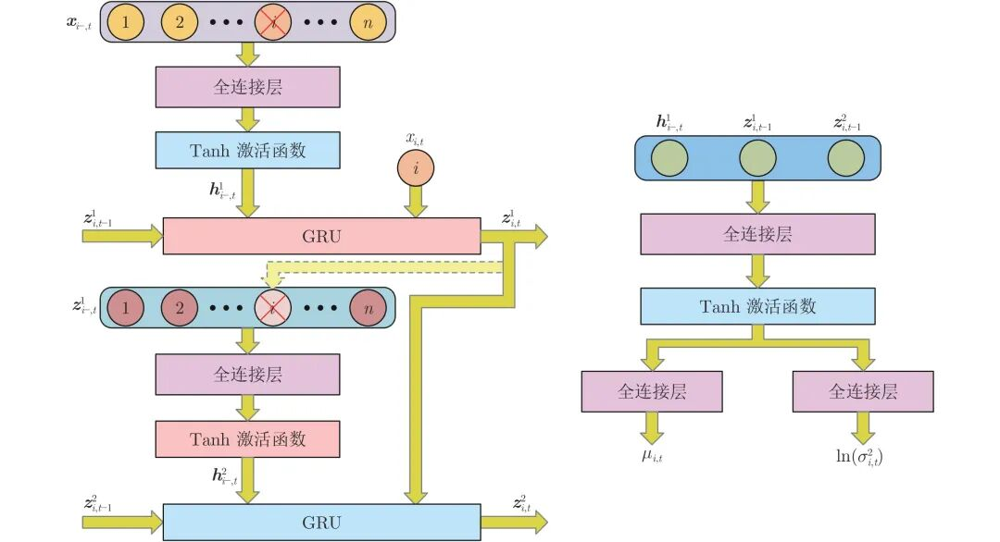
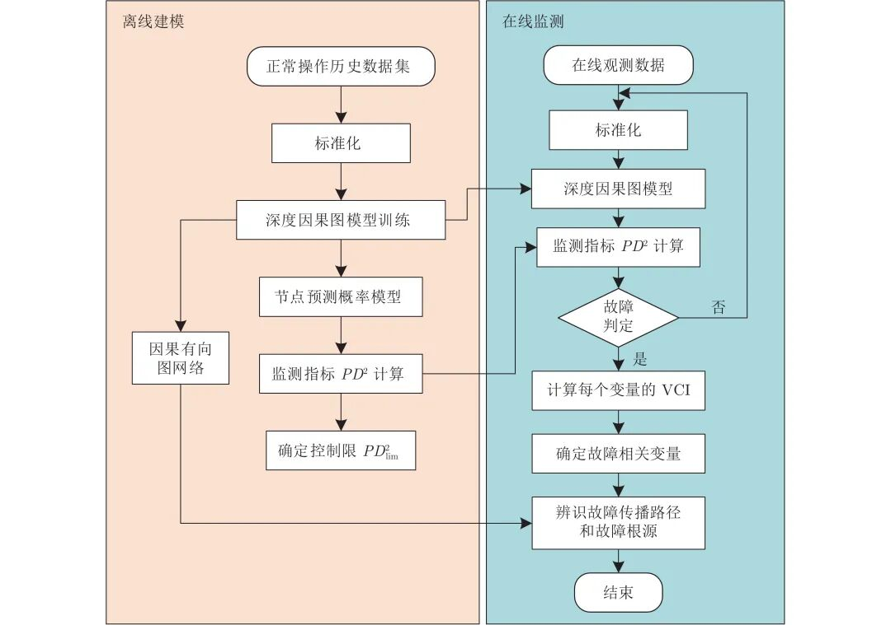

# 一种新颖的深度因果图建模及其故障诊断方法

原创 自动化学报 自动化学报 2022-06-08 16:53 北京

> 原文地址: [https://mp.weixin.qq.com/s/my2tEPLgMn\_Xhs0de2LtXg](https://mp.weixin.qq.com/s/my2tEPLgMn_Xhs0de2LtXg)

  

点击蓝字

关注我们

  

**引用本文**

唐鹏, 彭开香, 董洁. 一种新颖的深度因果图建模及其故障诊断方法. 自动化学报, 2022, 48(6): 1616−1624 doi: 10.16383/j.aas.c200996      

Tang Peng, Peng Kai-Xiang, Dong Jie. A novel method for deep causality graph modeling and fault diagnosis. Acta Automatica Sinica, 2022, 48(6): 1616−1624 doi: 10.16383/j.aas.c200996

http://www.aas.net.cn/cn/article/doi/10.16383/j.aas.c200996?viewType=HTML

  

**文章简介**

  

**关键词**

  

深度因果图模型, 故障检测, 根源诊断, 传播路径辨识, Group Lasso

  

**摘   要**

  

为了实现复杂工业过程故障检测和诊断一体化建模, 提出了一种新颖的深度因果图建模方法. 首先, 利用循环神经网络建立深度因果图模型, 将Group Lasso稀疏惩罚项引入到模型训练中, 自动地检测过程变量间的因果关系. 其次, 利用模型学习到的条件概率预测模型对每个变量建立监测指标, 并融合得到综合指标进行整体工业过程故障检测. 一旦检测到故障, 对故障样本构建变量贡献度指标, 隔离故障相关变量, 并通过深度因果图模型的局部因果有向图诊断故障根源, 辨识故障传播路径. 最后, 通过田纳西−伊斯曼过程进行仿真验证, 实验结果验证了所提方法的有效性.

  

**引   言**

  

现代工业过程是一个高度复杂的系统. 由于实际的物理连接、控制回路的作用, 工业过程中的设备、部件、过程变量相互耦合, 构成了复杂的互连网络. 这种互联耦合关系使得系统某一部位一旦发生异常, 将会随着系统网络传播并演变演化, 进而导致更加严重的故障. 采用先进的故障检测和诊断技术是保证工业过程安全有效稳定运行的重要手段. 传统的基于知识或者模型的方法很难构建大规模系统变量间的复杂关系. 随着工业自动化、信息化的快速发展, 工业过程收集了越来越多的传感器数据, 这为数据驱动方法提供强有力的支撑. 数据驱动的故障检测和诊断方法也因此受到了广泛关注和研究, 并大量应用到化工、半导体制造等过程, 尤其是多元统计过程监测 (Multivariate statistical process monitoring, MSPM) 方法.

  

MSPM利用多元投影技术将高维观测数据投影到低维主元子空间和残差子空间, 并设计相应的多元统计量 (如T^2, SPESPE) 及其控制限来监测数据是否超出正常工作范围, 常用的多元统计方法有主元分析 (Principal component analysis, PCA)、偏最小二乘 (Partial least squares, PLS)、独立主元分析 (Independent component analysis, ICA) 和典型相关分析(Canonical correlation analysis, CCA) 等. 一旦检测出故障, 需要采用贡献图、重构贡献图等故障隔离方法来辨识故障相关变量. 这些方法由于拖尾效应的影响并不能准确地辨识出所有的故障变量. 随后, 格兰杰因果分析、传递熵等因果分析方法被用来进行故障根源诊断和传播路径辨识, 然而这些算法很难达到预期效果, 且需要较长的分析时间. 深度学习能够处理大规模数据, 自动地提取深层次特征, 在工业领域也取得了较成功的应用. 近些年来, 自动编码器 (Autoencoder, AE)、深度信念网(Deep belief network, DBN)、变分自编码器(Variational autoencoder, VAE)等深度学习技术越来越多地应用到过程监测中, 但是由于神经网络的黑箱特性, 变量贡献率难以计算, 限制了其在故障隔离、根源诊断和传播路径辨识方面的应用.

  

图论技术利用由若干节点和连接节点的线构成的图模型来定性或者定量地表征变量之间关系, 能够较好地描述工业过程的复杂网络结构. 其中贝叶斯网络 (Bayesian network, BN) 作为一种概率有向图模型, 已经应用在风险分析、可靠性可维护性分析等领域, 在故障检测和诊断领域也取得了较成功的应用. Mehranbod等使用BN进行稳定和过渡阶段的故障检测和隔离. Azhdari和Mehranbod验证了BN在田纳西−伊斯曼 (Tennessee Eastman, TE) 过程中故障检测与诊断应用的有效性. Gonzalez等将BN应用在过程监测中的维数化简过程. Chen和Ge提出了一个分层BN (Hierachical Bayesian network, HBN) 建模框架, 通过对工业过程进行分解, 构建局部单元以及单元间的贝叶斯网络, 实现大规模工业过程的故障检测与诊断. 随后, Chen和Ge又针对过程监测中低质量数据建模问题, 提出了鲁棒BN (Robust Bayesian networks, RBN). 针对工业过程中存在的动态特性, Yu和Rashid采用动态贝叶斯网络 (Dynamic Bayesian networks, DBN), 用异常似然指标 (Abnormality likelihood index, ALI) 和动态贝叶斯概率指标 (Dynamic Bayesian probability index, DBPI) 分别进行故障检测和根源诊断. Zhang和Dong将高斯混合模型(Gaussian mixture model, GMM)和三时间切片DBN整合来解决过程监测中存在的数据缺失和非高斯问题.

  

BN为过程变量的因果关系提供了条件概率表示, 但是, 该条件概率关系一般是线性的, 无法描述过程中存在的非线性特性. 同时, 大多数基于BN的方法需要通过过程知识得到BN的网络结构, 这在很多复杂工业过程中是很难确定的. BN作为一种有向无环图模型, 也较难表示系统中存在的闭环结构. 为解决上述问题, 并考虑系统中存在的动态特性, 本文提出了一种深度因果图 (Deep causality graph, DCG) 建模方法, 利用多层感知器 (Multilayer perceptron, MLP) 和门控循环单元 (Gate recurrent unit, GRU) 对每一个过程变量建立概率预测模型. 在模型训练过程中, 引入组稀疏惩罚项, 自动地检测变量间因果关系, 从而得到过程变量的因果有向图结构以及定量的条件概率表征; 然后基于DCG模型的条件后验概率分布建立单变量监测统计指标, 并通过贝叶斯推理融合, 构建综合的监测统计量, 实现工业过程的整体监测. 进一步通过计算变量贡献度指标, 隔离出故障相关变量; 最后根据深度因果图模型获得的有向图结构, 诊断出故障根源, 并辨识故障的传播路径.

  

论文的结构如下: 第1节详细介绍了深度因果图推导和建模过程; 第2节提出了基于深度因果图模型的故障检测和诊断框架; 随后, 在第3节利用TE过程数据对所提算法进行了验证, 并在最后一节中进行了总结.

  

图 1  深度因果图的单节点预测模型网络结构

  

图 2  基于深度因果图模型的故障检测和诊断框架

  

请点击左下角“**阅读原文**”了解更多！

  

**作者简介**

**唐   鹏**

北京科技大学自动化学院博士研究生. 2013年获得长沙理工大学电气与信息工程学院学士学位. 2016年获得北方工业大学电气与控制工程学院硕士学位. 主要研究方向为过程监测和故障诊断.

E-mail: gnepgnat@163.com

**彭开香**

北京科技大学自动化学院教授. 2007 年获得北京科技大学控制科学与工程博士学位. 主要研究方向为复杂工业过程的故障诊断与容错控制. 本文通信作者. 

E-mail: kaixiang@ustb.edu.cn

**董   洁**

北京科技大学自动化学院教授. 2007 年获得北京科技大学控制科学与工程博士学位. 主要研究方向为智能控制理论与应用, 过程监控与故障诊断和复杂系统建模与控制.

E-mail: dongjie@ies.ustb.edu.cn

  

**相关文章**

  

**（请向上滑动阅读）**

  

\[1\]   赵春晖, 余万科, 高福荣. 非平稳间歇过程数据解析与状态监控 —回顾与展望. 自动化学报, 2020, 46(10): 2072−2091 doi: 10.16383/j.aas.c190586

http://www.aas.net.cn/cn/article/doi/10.16383/j.aas.c190586?viewType=HTML

  

\[2\]  周平,  刘记平,  梁梦圆,  张瑞垚.  基于KPLS鲁棒重构误差的高炉燃料比监测与异常识别.  自动化学报,  2021,  47(7): 1661−1671 doi: 10.16383/j.aas.c180579

http://www.aas.net.cn/cn/article/doi/10.16383/j.aas.c180579?viewType=HTML

  

\[3\]   尹进田, 谢永芳, 陈志文, 彭涛, 杨超. 基于故障传播与因果关系的故障溯源方法及其在牵引传动控制系统中的应用. 自动化学报, 2020, 46(1): 47−57 doi: 10.16383/j.aas.c190257

http://www.aas.net.cn/cn/article/doi/10.16383/j.aas.c190257?viewType=HTML

  

\[4\]   彭开香, 马亮, 张凯. 复杂工业过程质量相关的故障检测与诊断技术综述. 自动化学报, 2017, 43(3): 349-365. doi: 10.16383/j.aas.2017.c160427

http://www.aas.net.cn/cn/article/doi/10.16383/j.aas.2017.c160427?viewType=HTML

  

\[5\]   王静, 胡益, 侍洪波. 基于GMM的间歇过程故障检测. 自动化学报, 2015, 41(5): 899-905. doi: 10.16383/j.aas.2015.c130680

http://www.aas.net.cn/cn/article/doi/10.16383/j.aas.2015.c130680?viewType=HTML

  

\[6\]   彭开香, 张凯, 李钢. 基于贡献率法的非线性工业过程在线故障诊断. 自动化学报, 2014, 40(3): 423-430. doi: 10.3724/SP.J.1004.2014.00423

http://www.aas.net.cn/cn/article/doi/10.3724/SP.J.1004.2014.00423?viewType=HTML

  

\[7\]   周东华, 史建涛, 何潇. 动态系统间歇故障诊断技术综述. 自动化学报, 2014, 40(2): 161-171. doi: 10.3724/SP.J.1004.2014.00161

http://www.aas.net.cn/cn/article/doi/10.3724/SP.J.1004.2014.00161?viewType=HTML

  

\[8\]   王聪, 文彬鹤, 司文杰, 彭滔, 袁成志, 陈填锐, 林文愉, 王勇, 侯安平. 轴流压气机旋转失速建模与检测：基于确定学习理论与高阶Moore-Greitzer模型的研究. 自动化学报, 2014, 40(7): 1265-1277. doi: 10.3724/SP.J.1004.2014.01265

http://www.aas.net.cn/cn/article/doi/10.3724/SP.J.1004.2014.01265?viewType=HTML

  

\[9\]   易辉, 宋晓峰, 姜斌, 刘宇芳, 周智华. 柔性支持向量回归及其在故障检测中的应用. 自动化学报, 2013, 39(3): 272-284. doi: 10.3724/SP.J.1004.2013.00272

http://www.aas.net.cn/cn/article/doi/10.3724/SP.J.1004.2013.00272?viewType=HTML

  

\[10\]   周东华, 刘洋, 何潇. 闭环系统故障诊断技术综述. 自动化学报, 2013, 39(11): 1933-1943. doi: 10.3724/SP.J.1004.2013.01933

http://www.aas.net.cn/cn/article/doi/10.3724/SP.J.1004.2013.01933?viewType=HTML

  

\[11\]   李霄剑, 杨光红. 在低频域内对线性时滞系统的故障检测滤波器设计. 自动化学报, 2009, 35(11): 1465-1469. doi: 10.3724/SP.J.1004.2009.01465

http://www.aas.net.cn/cn/article/doi/10.3724/SP.J.1004.2009.01465?viewType=HTML

  

\[12\]   李元, 唐哓初. 基于最优主元数的故障检测性能的改进. 自动化学报, 2009, 35(12): 1550-1557. doi: 10.3724/SP.J.1004.2009.01550

http://www.aas.net.cn/cn/article/doi/10.3724/SP.J.1004.2009.01550?viewType=HTML

  

\[13\]   张沐光, 宋执环. LPMVP算法及其在故障检测中的应用. 自动化学报, 2009, 35(6): 766-772. doi: 10.3724/SP.J.1004.2009.00766

http://www.aas.net.cn/cn/article/doi/10.3724/SP.J.1004.2009.00766?viewType=HTML

  

\[14\]   王宏, 柴天佑, 丁进良, 布朗·马丁. 数据驱动的故障诊断与容错控制:进展与可能的新方向. 自动化学报, 2009, 35(6): 739-747. doi: 10.3724/SP.J.1004.2009.00739

http://www.aas.net.cn/cn/article/doi/10.3724/SP.J.1004.2009.00739?viewType=HTML

  

\[15\]   张萍, DING Steven X, 王桂增, 周东华. 采样数据系统的故障检测. 自动化学报, 2003, 29(2): 306-311.

http://www.aas.net.cn/cn/article/id/14097?viewType=HTML

  

\[16\]   方华京. 控制系统鲁棒故障检测的l1优化方法. 自动化学报, 2002, 28(4): 535-539.

http://www.aas.net.cn/cn/article/id/15566?viewType=HTML

  

\[17\]   胡峰, 孙国基, 黄刘生. 动态系统输入环节突发性故障的检测与辨识. 自动化学报, 2002, 28(6): 881-887.

http://www.aas.net.cn/cn/article/id/15625?viewType=HTML

  

\[18\]   胡峰, 孙国基. 非平稳过程突发性故障的在线检测与辨识. 自动化学报, 2001, 27(1): 120-124.

http://www.aas.net.cn/cn/article/id/16570?viewType=HTML

  

\[19\]   叶昊, 王桂增, 方崇智. 小波变换在故障检测中的应用. 自动化学报, 1997, 23(6): 736-741.

http://www.aas.net.cn/cn/article/id/16925?viewType=HTML

  

\[20\]   周东华. 一种非线性系统的传感器故障检测与诊断新方法. 自动化学报, 1995, 21(3): 362-365.

http://www.aas.net.cn/cn/article/id/13968?viewType=HTML

  

\[21\]   周东华, 王庆林. 基于模型的控制系统故障诊断技术的最新进展. 自动化学报, 1995, 21(2): 244-248.

http://www.aas.net.cn/cn/article/id/13982?viewType=HTML

  

\[22\]   周东华, 孙优贤, 席裕庚, 张钟俊. 一类非线性系统参数偏差型故障的实时检测与诊断. 自动化学报, 1993, 19(2): 184-189.

http://www.aas.net.cn/cn/article/id/14266?viewType=HTML

  

\[23\]   刘志军, 陈福根, 张永光. 参数估计法检测与诊断铁路运输车减振装置故障. 自动化学报, 1992, 18(5): 633-636.

http://www.aas.net.cn/cn/article/id/14359?viewType=HTML

  

  

**近期文章**

[SealGAN: 基于生成式对抗网络的印章消除研究](http://mp.weixin.qq.com/s?__biz=MzAwMzAzMDgxOA==&mid=2651078520&idx=1&sn=7b2fd3ad0255df30e61587f6ec80fd61&chksm=8131f535b6467c2351542b9537baee1f20a56d0cbe0baf3aa8c6b10e6830b72150c4bc4fe1d8&scene=21#wechat_redirect)

[基于遗传乌燕鸥算法的同步优化特征选择](http://mp.weixin.qq.com/s?__biz=MzAwMzAzMDgxOA==&mid=2651078520&idx=2&sn=41dec470920a78fd021209e5a113d716&chksm=8131f535b6467c23e0b7246b7697614f7c4debcbd0d727df9e8fca2841a6623d48c4e0571bb3&scene=21#wechat_redirect)

[基于轮胎状态刚度预测的极限工况路径跟踪控制研究](http://mp.weixin.qq.com/s?__biz=MzAwMzAzMDgxOA==&mid=2651078406&idx=1&sn=8b5e13ba1fbc860b2d6d92007d179345&chksm=8131f54bb6467c5d558d1ebbb4284a903eea029458b76e3e041773b42465284ab401d28e694e&scene=21#wechat_redirect)

[基于多参数灵敏度分析与遗传优化的铁水质量无模型自适应控制](http://mp.weixin.qq.com/s?__biz=MzAwMzAzMDgxOA==&mid=2651078406&idx=2&sn=919e0ff02f38f7bca086867466a39225&chksm=8131f54bb6467c5d789d8bf33edd281094acde67c5c035df91a8d655c03c3e9f096b3a1c6d2e&scene=21#wechat_redirect)

[串行生产线中机器维修工人的任务分配问题研究](http://mp.weixin.qq.com/s?__biz=MzAwMzAzMDgxOA==&mid=2651078261&idx=1&sn=af3614da8d72cbe2e4f01ddebad97732&chksm=8131f438b6467d2e30070c37bdd4ca82a6fa414a2b26588dc0d0bfec42efea2b2729becd1fc0&scene=21#wechat_redirect)  

[参考点自适应调整下评价指标驱动的高维多目标进化算法](http://mp.weixin.qq.com/s?__biz=MzAwMzAzMDgxOA==&mid=2651078261&idx=2&sn=725096e30b6fa219dcadacd45e6ded10&chksm=8131f438b6467d2e16f74d001605e31d4ec852905a2f39385130867dd12d5f031bc836b611cf&scene=21#wechat_redirect)

[基于改进YOLOv3算法的公路车道线检测方法](http://mp.weixin.qq.com/s?__biz=MzAwMzAzMDgxOA==&mid=2651078200&idx=1&sn=4044a26db179fbfb3781438fc7d9057d&chksm=8131f475b6467d63cf97cea2ea58db3bdc8f9d6958896d95b9a9b3a44828946362c7d6891418&scene=21#wechat_redirect)  

[直播预告‖自动化前沿热点讲堂之第十七讲](http://mp.weixin.qq.com/s?__biz=MzAwMzAzMDgxOA==&mid=2651078200&idx=2&sn=27f5d791ac740f87f0bcf7854c03f466&chksm=8131f475b6467d6366df12dbeb2d11b026a233143ed5d6fd80e3174be2ca86878ec8b56d302c&scene=21#wechat_redirect)

[一种基于改进AOD-Net的航拍图像去雾算法](http://mp.weixin.qq.com/s?__biz=MzAwMzAzMDgxOA==&mid=2651078165&idx=1&sn=092f00bc0dba34c5fd7c160e233ee480&chksm=8131f458b6467d4e9899392d597abb82989303551eae58bd4b9ef5580623abe046b273fbdbb3&scene=21#wechat_redirect)

[基于多级动态主元分析的电熔镁炉异常工况诊断](http://mp.weixin.qq.com/s?__biz=MzAwMzAzMDgxOA==&mid=2651078165&idx=2&sn=8d9a1a97361f5aea0655ef0bad114d5d&chksm=8131f458b6467d4e7b8185944175b5670bf21736d9ace23f32c73febef9b17de59f87795ad2d&scene=21#wechat_redirect)

[一种针对德州扑克AI的对手建模与策略集成框架【视频】](http://mp.weixin.qq.com/s?__biz=MzAwMzAzMDgxOA==&mid=2651078084&idx=1&sn=66f75170f77cdae1de9f7957ab6211be&chksm=8131f789b6467e9ff292811301f7aa59da264c1ebe9d3e805181b338cd4a41fe839759bf9d7b&scene=21#wechat_redirect)

[量子线性卷积及其在图像处理中的应用](http://mp.weixin.qq.com/s?__biz=MzAwMzAzMDgxOA==&mid=2651078077&idx=1&sn=0f8e5cc62e1a4648057f27b196fb3de5&chksm=8131f7f0b6467ee681a9542faea153769e16a0ff1a0f59b513f32a8f3ca3f360b045ca89615d&scene=21#wechat_redirect)

[基于非线性干扰观测器的飞机全电刹车系统滑模控制设计](http://mp.weixin.qq.com/s?__biz=MzAwMzAzMDgxOA==&mid=2651078038&idx=1&sn=e5b2617763076b22acf9042cd66265c6&chksm=8131f7dbb6467ecd0c2f64516f6ec7bf689fa3108d330d2f7c99144380c33c5a21dcf835f48c&scene=21#wechat_redirect)

[基于多源数据的电网一次调频能力平行计算研究](http://mp.weixin.qq.com/s?__biz=MzAwMzAzMDgxOA==&mid=2651078038&idx=2&sn=045ef6ad8cbe1556d93b98b8d89b3c5f&chksm=8131f7dbb6467ecd07a70dd79508b11ee9328f05b029eccc17bf47bf9ae9ac8be75d3f0988e3&scene=21#wechat_redirect)

[作者识别研究综述](http://mp.weixin.qq.com/s?__biz=MzAwMzAzMDgxOA==&mid=2651077968&idx=1&sn=707a66d03d8fac053431dd0efb42ba5f&chksm=8131f71db6467e0b021bdcd1807f03d5cb334157f63461fedcc1bddf23947af1ca995f1987f3&scene=21#wechat_redirect)

[基于FPSO的电力巡检机器人的广义二型模糊逻辑控制](http://mp.weixin.qq.com/s?__biz=MzAwMzAzMDgxOA==&mid=2651077968&idx=2&sn=8f03d20c1eb55d908b0d625b5aee029f&chksm=8131f71db6467e0b9c1a043856fd0cd82d69fd878c95c2afe8fb14cda9ec4d2e06fa1cc4dd6c&scene=21#wechat_redirect)

[污水处理过程出水水质稀疏鲁棒建模](http://mp.weixin.qq.com/s?__biz=MzAwMzAzMDgxOA==&mid=2651077888&idx=1&sn=00ac4a402538e7d00e1e7728d3b91449&chksm=8131f74db6467e5bdc3b24d484092e79541739d5093d0913e2f430a0410d3305c80baf1059f7&scene=21#wechat_redirect)

[一类p规范型非线性系统预设性能有限时间H∞跟踪控制](http://mp.weixin.qq.com/s?__biz=MzAwMzAzMDgxOA==&mid=2651077888&idx=2&sn=86079f3d558330183997baa3fb6e40d8&chksm=8131f74db6467e5b532977ab27c179528aeebfe2c5956ae2ab2d3a291af9661c8b87f9dc2a1e&scene=21#wechat_redirect)

[基于自注意力模态融合网络的跨模态行人再识别方法研究](http://mp.weixin.qq.com/s?__biz=MzAwMzAzMDgxOA==&mid=2651077831&idx=1&sn=6a76db27f4c8f0f1b96e5b8c6771abeb&chksm=8131f68ab6467f9cd2a0f82cc7756e0501991992475ef16d1eadb77b3fb27ff72ec26342d4ae&scene=21#wechat_redirect)

[基于多相关HMT模型的DT CWT域数字水印算法](http://mp.weixin.qq.com/s?__biz=MzAwMzAzMDgxOA==&mid=2651077831&idx=2&sn=2c167c0a7155779ce961509e8dbedc79&chksm=8131f68ab6467f9cedcba9c6fce9d8d2fd00a89ec6f06c26b258aec8e9d98086ebd5d4d4ab14&scene=21#wechat_redirect)

[基于多阶运动参量的四旋翼无人机识别方法](http://mp.weixin.qq.com/s?__biz=MzAwMzAzMDgxOA==&mid=2651077767&idx=1&sn=587115a6ffee6f33a5113a392bafd18e&chksm=8131f6cab6467fdc113dfc124638e9f0c73bfc2cc606025b4bc5c630bd6c5569b8948c3a2bad&scene=21#wechat_redirect)

  

**热点文章**

[基于改进YOLOv3算法的公路车道线检测方法](http://mp.weixin.qq.com/s?__biz=MzAwMzAzMDgxOA==&mid=2651078200&idx=1&sn=4044a26db179fbfb3781438fc7d9057d&chksm=8131f475b6467d63cf97cea2ea58db3bdc8f9d6958896d95b9a9b3a44828946362c7d6891418&scene=21#wechat_redirect)

[通信延时环境下异质网联车辆队列非线性纵向控制](http://mp.weixin.qq.com/s?__biz=MzAwMzAzMDgxOA==&mid=2651077767&idx=2&sn=d497bd4b45545cdc7584e9c9568ef4e0&chksm=8131f6cab6467fdc01f675bd4ea8b4823af1ff46862041b55d3b58ce8903265b6efd60bbc281&scene=21#wechat_redirect)

[图像异常检测研究现状综述](http://mp.weixin.qq.com/s?__biz=MzAwMzAzMDgxOA==&mid=2651077688&idx=1&sn=2535d4c0961f79a4e6e28fcec08d2fed&chksm=8131f675b6467f63e42dec407492be9cccdbf245e71dd2cd84b1d4af8072250b8b9f0f01329c&scene=21#wechat_redirect)

[迭代学习模型预测控制研究现状与挑战](http://mp.weixin.qq.com/s?__biz=MzAwMzAzMDgxOA==&mid=2651077623&idx=1&sn=1d8a9d2a39cab773fd8b49e8e73c55fd&chksm=8131f1bab64678ac33f4512961aa95fe90d40e9dbd6c4e13cad77295f4940b6aef050700caac&scene=21#wechat_redirect)

[2022年第05期](http://mp.weixin.qq.com/s?__biz=MzAwMzAzMDgxOA==&mid=2651077579&idx=1&sn=d2cf8dfd19e4104f5958b4ad6356239d&chksm=8131f186b6467890faae7fb5e1bdb23ca54b21a631ce9c32c47dc615ff926149628b9bf9b64b&scene=21#wechat_redirect)

[基于凸近似的避障原理及无人驾驶车辆路径规划模型预测算法](http://mp.weixin.qq.com/s?__biz=MzAwMzAzMDgxOA==&mid=2651077442&idx=1&sn=432dd266dbf5c99ca845248bb09df5c1&chksm=8131f10fb646781977984ae605369c8004b7c57f61747a28c49813698802554d4a11047abea0&scene=21#wechat_redirect)

[通信受限的多智能体系统二分实用一致性](http://mp.weixin.qq.com/s?__biz=MzAwMzAzMDgxOA==&mid=2651077321&idx=1&sn=02d81030a428cbb4275f4ff076068f08&chksm=8131f084b646799235c36b924d470f26f4e4da762c08d57e951613e4f74a57febdc8c03777c9&scene=21#wechat_redirect)

[【热点专题】多目标优化](http://mp.weixin.qq.com/s?__biz=MzI2NjA3MzM5MA==&mid=2649962438&idx=1&sn=83b21f7b6a63fc4e01c2f4718b2aae92&chksm=f2943387c5e3ba91ce32286c06f215a989233f55bbbd5c7d436a43c40615bb5ae208d0f0f228&scene=21#wechat_redirect)

[一种基于深度迁移学习的滚动轴承早期故障在线检测方法](http://mp.weixin.qq.com/s?__biz=MzAwMzAzMDgxOA==&mid=2651076931&idx=2&sn=128b1673843353529d8b130f372bb46f&chksm=8131f30eb6467a18e0f645b207ada16cd601b791297b32b1caccf72daa50b55063074ec4fdc3&scene=21#wechat_redirect)

[基于多智能体强化学习的乳腺癌致病基因预测](http://mp.weixin.qq.com/s?__biz=MzAwMzAzMDgxOA==&mid=2651076931&idx=1&sn=a62942cd056156ad5a885d6350e8b373&chksm=8131f30eb6467a18ffbee77b25fb9b0417b08918d3625d04c89a3a9bcb1490eece239c5fda25&scene=21#wechat_redirect)

[基于事件触发的离散MIMO系统自适应评判容错控制](http://mp.weixin.qq.com/s?__biz=MzAwMzAzMDgxOA==&mid=2651076863&idx=1&sn=aec9cf55a1b0b8eae741999601a8c6df&chksm=8131f2b2b6467ba4c20d388390d4ac191555e5d00d77f510f72af77359d18bdca5230ea52df0&scene=21#wechat_redirect)

[水下多机器人系统综述](http://mp.weixin.qq.com/s?__biz=MzAwMzAzMDgxOA==&mid=2651076668&idx=1&sn=b50e43710be8208fd711cd45943e95c0&chksm=8131f271b6467b675083610c925ce0d329e201ddab5c8e935eb266fbf41418395459fdd0618d&scene=21#wechat_redirect)

[基于事件触发二阶多智能体系统的固定时间比例一致性](http://mp.weixin.qq.com/s?__biz=MzAwMzAzMDgxOA==&mid=2651076637&idx=2&sn=fcf40a44a926c9034593207d6a614e95&chksm=8131f250b6467b46e70d4ef5f10226fbed60a0d12e327f83c793d86e7815ff00e4fcafcac295&scene=21#wechat_redirect)

[基于事件触发的分布式优化算法](http://mp.weixin.qq.com/s?__biz=MzAwMzAzMDgxOA==&mid=2651076142&idx=2&sn=b074793ec4be44ea08efb78617dcdcc0&chksm=8131fc63b6467575b7f6d698909e56be16089f8f56ca415294483ff6f40902c7546417f82531&scene=21#wechat_redirect)

  

**期刊动态**

[《自动化学报》多名作者入选爱思唯尔2021中国高被引学者](http://mp.weixin.qq.com/s?__biz=MzAwMzAzMDgxOA==&mid=2651076637&idx=1&sn=ee78f108cf0551024cb95c33241a5f1d&chksm=8131f250b6467b46c8d4af1bd63381328a80c65ade97a6daa97e3bb4538b39c6f761da238066&scene=21#wechat_redirect)

[自动化学报（英文版）和自动化学报入选计算领域高质量科技期刊T1类](http://mp.weixin.qq.com/s?__biz=MzAwMzAzMDgxOA==&mid=2651073859&idx=2&sn=7a9192717637dcf6cddb39ed961e8c3b&chksm=8131e70eb6466e188a123c504bdeba80c75681de4762f8685b3bf584bc33eb12362c70613b4e&scene=21#wechat_redirect)

[《自动化学报》编辑部防诈骗公告](http://mp.weixin.qq.com/s?__biz=MzAwMzAzMDgxOA==&mid=2651073517&idx=1&sn=c52de7c685e546af9faffc0cefab1c85&chksm=8131e1a0b64668b63ebaa68ea81cbaec3b94dc52ea8360821a0a49e67ae7e4b428a25d0f19c5&scene=21#wechat_redirect)

[《自动化学报》致谢审稿人](http://mp.weixin.qq.com/s?__biz=MzI2NjA3MzM5MA==&mid=2649961201&idx=1&sn=3142842d75c441ae860c1ecb313c7657&chksm=f29436b0c5e3bfa6c679210f60513eb1a7205dc20fe028f482bb593eac60427e4e56fba12493&scene=21#wechat_redirect)

[自动化学报多篇论文入选中国百篇最具影响国内论文和中国精品期刊顶尖论文](http://mp.weixin.qq.com/s?__biz=MzI2NjA3MzM5MA==&mid=2649961152&idx=1&sn=4a5e9e4b84879f4cde4e13a0ef97272c&chksm=f2943681c5e3bf97d7770c9623dac869b283b3ea83f3d320017974033e361d8b999134a8bdff&scene=21#wechat_redirect)

[自动化学报各项主要指标蝉联第1，再获百种中国杰出期刊称号](http://mp.weixin.qq.com/s?__biz=MzI2NjA3MzM5MA==&mid=2649960903&idx=1&sn=7da8b8a0167e16bcbaa1f00fbfb69782&chksm=f2943586c5e3bc9014f6d4fff7147b998ae42b4da452907e641e8029f296fd2413b4f17aef62&scene=21#wechat_redirect)

  

**期刊目录**

[2022年第05期](http://mp.weixin.qq.com/s?__biz=MzI2NjA3MzM5MA==&mid=2649962842&idx=1&sn=b91e3ab1206e29fdb9287ebbf7b07638&chksm=f2943d1bc5e3b40d9447d720203aca6ca2ae6662b85e3d9d5768c2da45df90cc31e49f895255&scene=21#wechat_redirect)

[2022年第04期](http://mp.weixin.qq.com/s?__biz=MzI2NjA3MzM5MA==&mid=2649962369&idx=1&sn=ae2c4584f8904be917b600e67005ae03&chksm=f29433c0c5e3bad6d78382b3c09015aadb09e040b8fc8c319c4f554fd592fe677797000340cd&scene=21#wechat_redirect)

[2022年第03期](http://mp.weixin.qq.com/s?__biz=MzAwMzAzMDgxOA==&mid=2651075527&idx=1&sn=bc020c5fd09080243f7527610b003507&chksm=8131f98ab646709c2f485852b526989a3b9af5cc93e8afb508d9239b78176f49caa9807d6a8d&scene=21#wechat_redirect)

[2022年第02期](http://mp.weixin.qq.com/s?__biz=MzI2NjA3MzM5MA==&mid=2649961838&idx=1&sn=29334896aa0f372b70312250c75b6b20&chksm=f294312fc5e3b8392ffd49100eaba435bf48fa9234c5019fe7b16ed1e4ebef70be58691f3fb3&scene=21#wechat_redirect)

[2022年第01期](http://mp.weixin.qq.com/s?__biz=MzI2NjA3MzM5MA==&mid=2649961423&idx=1&sn=3b65958faa7c7f94c247f46dd72bd71e&chksm=f294378ec5e3be9825f860d132c36c97f3e877089449cb1fe85a6d1e7da9bd0e24795336bc54&scene=21#wechat_redirect)

[《自动化学报》2021年全年合集](http://mp.weixin.qq.com/s?__biz=MzAwMzAzMDgxOA==&mid=2651072770&idx=1&sn=7c531f7fa3bc390558fab15b339ce86e&chksm=8131e34fb6466a59ed079448fddda0fc9f97066460bff8f6835288003a1fba2812de383813c1&scene=21#wechat_redirect)

[《自动化学报》2020年全年合集](http://mp.weixin.qq.com/s?__biz=MzI2NjA3MzM5MA==&mid=2649957972&idx=1&sn=1951847aacbcb7d22bdd2a46a79af871&chksm=f2942215c5e3ab03d070d8e52b8764b38036897c97b6a26c7a1f918c806b28edbe6c0fbf7ea9&scene=21#wechat_redirect)

[2020年第10期 工业人工智能专题](http://mp.weixin.qq.com/s?__biz=MzI2NjA3MzM5MA==&mid=2649957201&idx=1&sn=ab82a767bd716ab67fdf2942500d8b61&chksm=f2942710c5e3ae06b27f9e63a5e329a1123d90b051164e6b6123c500230541b1ed12d92abbfb&scene=21#wechat_redirect)

[2020年第09期 分布式信息能源系统理论与应用专题](http://mp.weixin.qq.com/s?__biz=MzI2NjA3MzM5MA==&mid=2649956412&idx=1&sn=8ebc13d63fd333ad85dbb8b5825df248&chksm=f294247dc5e3ad6ba297857a5b957e97cf499266c50318791fa8abd9432ecf1d9c3d9b287e36&scene=21#wechat_redirect)

  

**长按二维码｜关注我们**

**IEEE/CAA Journal of Automatica Sinica (JAS)**

**长按二维码｜关注我们**

**《自动化学报》服务号**

**长按二维码｜关注我们**

**《自动化学报》订阅号**  

  

**联系我们**

**网站:** 

http://www.aas.net.cn

http://www.ieee-jas.net

**投稿:** 

https://mc03.manuscriptcentral.com/aas-cn   

https://mc03.manuscriptcentral.com/ieee-jas 

**电话:**

010-82544653（日常咨询和稿件处理）

010-82544677（录用后稿件处理）  

**邮箱:** 

aas@ia.ac.cn（日常咨询和稿件处理）  

aas\_editor@ia.ac.cn（录用后稿件处理）

**博客:** 

http://blog.sina.com.cn/aaseditor 

  

**↓ 点击下方 阅读原文 了解更多**