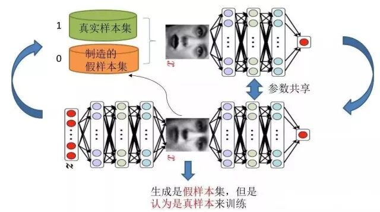
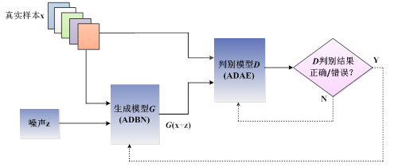
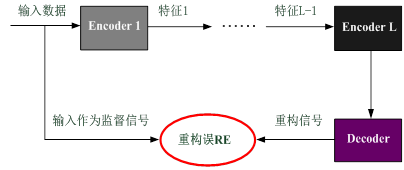

# 一种能量函数意义下的生成式对抗网络

原创 自动化学报 2018-06-19 16:35 北京

> 原文地址: [https://mp.weixin.qq.com/s/wi3FyeFduPgPBhCe6QFnWw](https://mp.weixin.qq.com/s/wi3FyeFduPgPBhCe6QFnWw)

人工智能的飞速发展得益于机器学习在感知阶段和认知阶段的长足进步，而从感知与认知到生成与创造往往需要人类的干预。如何能让机器学习实现“无人干预”的全智能模式是当前人工智能所面临的一个重要突破口，也必将助力人工智能实现进一步的飞跃。

在缺乏足够数据量的样本生成任务中，从输入数据到产生意义的理解过程往往需要经过多层信息处理、转换、表达和抽象，且在生成过程中需要人类的多次干预。生成式对抗网络是一种功能模块化且同步运行的自学习模型，能够以对抗的思想训练生成模型并检验其生成能力，从而实现对真实样本的“无限逼近”能力。

本文针对缺乏足够数据量的小样本生成任务，从原始数据的理解到产生意义的过程出发，设计一种基于深度学习思想的自适应深度信念网络作为生成模型，将自适应深度自编码器作为判别模型。在对抗迭代过程中将判别模型的重构误差作为能量函数，利用能量函数的大小来指导对抗迭代步数。最后，将本文所提方法针对两个benchmark数据集做了验证，并与若干种公开的实验结果进行比较。

引用格式

王功明, 乔俊飞, 王磊. 一种能量函数意义下的生成式对抗网络. 自动化学报, 2018, 44(5): 793-803.

作者简介

王功明  北京工业大学信息学部自动化学院博士研究生，美国俄勒冈大学计算机与信息科学系联合培养博士。主要研究方向为深度学习,神经网络结构设计与优化控制策略。

E-mail: xiaowangqsd@163.com

乔俊飞  北京工业大学副校长、信息学部主任、自动化学院博士生导师、教授。主要研究方向为自组织智能控制理论与方法、数据驱动控制与知识自动化、 城市污水处理过程建模与优化控制。本文通信作者。

E-mail: junfeiq@bjut.edu.cn

王 磊  北京工业大学信息学部自动化学院博士研究生. 主要研究方向为神经网络结构设计与优化。

E-mail: jade\_wanglei@163.com

自动化

学报

往期回顾

[人工智能研究的新前线：生成式对抗网络](http://mp.weixin.qq.com/s?__biz=MzAwMzAzMDgxOA==&mid=2651063920&idx=1&sn=9094936d46b4bab696df49c408fa1656&chksm=8131cc3db646452b0cba9ebdee9672b9ae010166a941ef19d5972616235193048a3346cf54f0&scene=21#wechat_redirect)  

[生成式对抗网络：从生成数据到创造智能](http://mp.weixin.qq.com/s?__biz=MzAwMzAzMDgxOA==&mid=2651063870&idx=1&sn=1e1d7562a4bbe4c31e2fdef4859c0bc4&chksm=8131cc73b6464565d9419524cd87b4bbe363384f0ba722017e91a49af4640d349403ea9a0ea6&scene=21#wechat_redirect)

欢迎扫描二维码、长按图片识别关注《自动化学报》中文版订阅号aas1963，服务号自动化学报和英文版服务号！

JAS《自动化学报》（英文版）

自动化学报服务号

自动化学报订阅号

  

联系我们

Tel:  010-82544653（日常咨询和稿件处理） 

        010-82544677（录用后稿件处理）

Fax: 010-82544497

Email: aas@ia.ac.cn（日常咨询和稿件处理）

          aas\_editor@ia.ac.cn（录用后稿件处理）

http://www.aas.net.cn

点击阅读原文，了解更多精彩内容