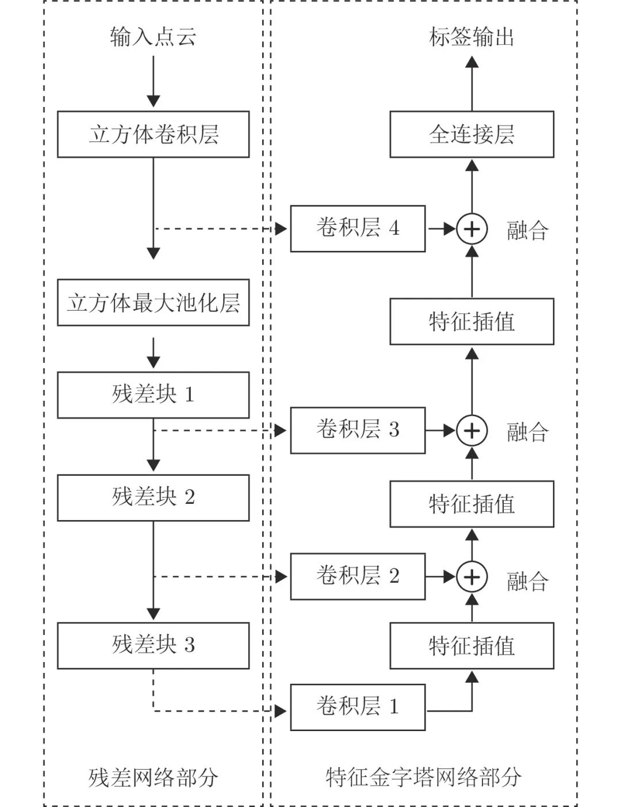
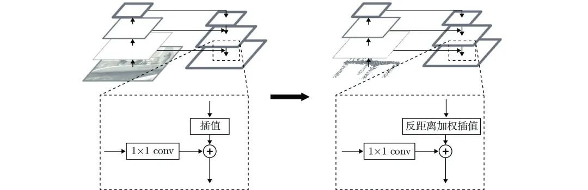
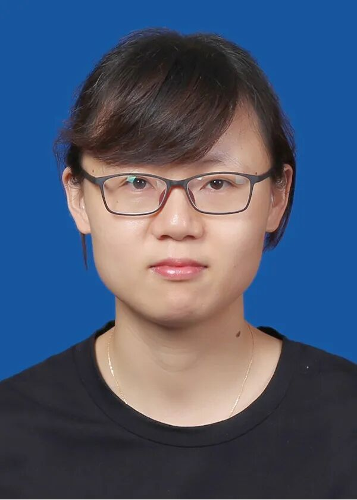
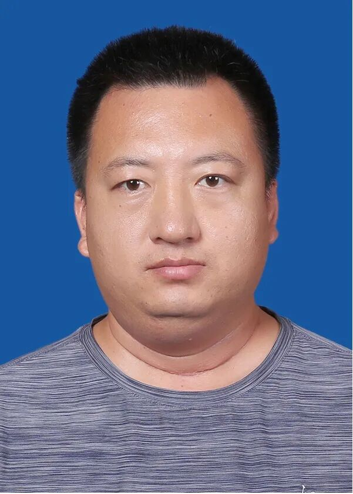

# 一种面向散乱点云语义分割的深度残差−特征金字塔网络框架

原创 自动化学报 自动化学报 2022-05-19 12:16 北京

> 原文地址: [https://mp.weixin.qq.com/s/IxiFINuXl6yOmG65RGA27A](https://mp.weixin.qq.com/s/IxiFINuXl6yOmG65RGA27A)

**点击蓝字|关注我们**

  

**引用本文**

  

彭秀平, 仝其胜, 林洪彬, 冯超, 郑武. 一种面向散乱点云语义分割的深度残差−特征金字塔网络框架. 自动化学报, 2021, 47(12): 2831−2840 doi: 10.16383/j.aas.c190063

Peng Xiu-Ping, Tong Qi-Sheng, Lin Hong-Bin, Feng Chao, Zheng Wu. A deep residual — feature pyramid network framework for scattered point cloud semantic segmentation. Acta Automatica Sinica, 2021, 47(12): 2831−2840 doi: 10.16383/j.aas.c190063

http://www.aas.net.cn/cn/article/doi/10.16383/j.aas.c190063?viewType=HTML

  

**文章简介**

  

**关键词**

  

散乱点云, 语义分割, 立方体卷积, 残差网络, 特征金字塔网络

  

**摘   要**

  

针对当前基于深度学习的散乱点云语义特征提取方法通用性差以及特征提取不足导致的分割精度和可靠性差的难题, 提出了一种散乱点云语义分割深度残差−特征金字塔网络框架. 首先, 针对当前残差网络在卷积方式上的局限性, 定义一种立方体卷积运算, 不仅可以通过二维卷积运算实现三维表示点的高层特征的抽取, 还可以解决现有的参数化卷积设计通用性差的问题;其次, 将定义的立方体卷积计算与残差网络相结合, 构建面向散乱点云语义分割的深度残差特征学习网络框架; 进一步, 将深度残差网络与特征金字塔网络相结合, 实现三维表示点高层特征多尺度学习与散乱点云场景语义分割. 实验结果表明, 本文提出的立方体卷积运算具有良好的适用性, 且本文提出的深度残差−特征金字塔网络框架在分割精度方面优于现存同类方法.

  

**引   言**

  

三维点云数据理解在计算机视觉和模式识别领域是一项非常重要的任务, 该任务包括物体分类, 目标检测和语义分割等. 其中, 语义分割任务最具有挑战性, 传统的方法大多是在对点云数据进行必要特征提取的基础上, 应用支持向量机(Support vector machine, SVM)一类的分类算法, 通过训练一组特征分类器来完成散乱点云数据的语义分割任务. 显然, 这类方法的性能很大程度上依赖点云特征的设计、特征提取的精度以及特征分类器的性能. 虽然国内外学者提出了几十种点云特征和大量的分类算法, 但是依然没有一种或几种特征能完全适用于所有语义分割场景, 算法适用性、精度和可靠性都得不到保障.

  

近年来, 随着深度学习技术的发展, 涌现出许多端对端的学习算法, 这种端对端的学习方式不依赖于手工设计的特征, 只需给定输入数据和对应的数据标签, 将其输入神经网络, 即可通过反向传播算法自动学习一组可以抽象高级特征的权重矩阵, 最后再由全连接层(Fully connected layer, FC)对高级特征进行分类, 从而完成分割任务. 现有的基于深度学习的点云分割研究方法大体可分为如下两类:

  

一类是基于散乱点云数据结构规则化的深度学习方法, 这类方法通常是先通过体素化处理或八叉树、KD树等树形结构, 将无序和不规则的散乱点云处理成规则的结构化数据, 再将结构化数据输入三维卷积神经网络(Convolutional neural network, CNN)进行训练. 基于体素化方法的提出首次将深度学习技术应用于三维点云数据理解任务, 通过将三维点云体素化为规则的结构化数据, 解决了其无序性和不规则性问题. 但是, 使用体素占用表示三维点云带来了量化误差问题, 为了减小这种误差必须使用更高的体素分辨率表示, 高分辨率的体素表示又会在训练神经网络过程中带来大内存占用问题. 因此, 受限于目前计算机硬件的发展水平, 基于体素化的散乱点云深度学习方法往往难以完成诸如大规模室内三维场景一类的复杂、需要细粒度的三维场景的语义分割和场景理解任务. 基于八叉树和KD树结构方法的提出解决了直接体素化点云所带来的大内存占用问题, 但是这种树形结构对三维点云旋转和噪声敏感, 从而导致卷积内核的可训练权重矩阵学习困难, 算法的鲁棒性往往不够理想.

  

另一类是基于参数化卷积设计的深度学习方法, 这类方法以原始三维点云作为输入, 通过设计一种能够有效抽象高层次特征的参数化卷积, 再使用堆叠卷积架构来完成点云分割任务. PointNet是这类方法的代表, 其首先使用共享参数的多层感知机(Multi-layer perception, MLP)将三维点云坐标映射到高维空间, 再通过全局最大池化(Global max pooling, GMP)得到点云全局特征, 解决了点云的无序性问题; 此外, 文献\[7\]还提出了一种T-net网络, 通过学习采样点变换矩阵和特征变换矩阵解决了散乱点云的旋转一致性问题, 但是由于缺乏点云局部特征信息局限了其在点云分割任务中的性能. 随后PointNet++提出一种分层网络, 通过在每一图层递归使用采样、分组、PointNet网络来抽象低层次特征和高层次特征, 再经过特征反向传播得到融合特征, 最终使用全连接层预测点语义标签, 解决了文献\[7\]方法对点云局部特征信息提取不足的问题. RSNet通过将无序点云特征映射为有序点云特征, 再结合循环神经网络(Recurrent neural network, RNN)来提取更丰富的语义信息, 从而进行语义标签预测. PointCNN则定义了一种卷积, 通过学习特征变换矩阵将无序点云特征变换成潜在的有序特征, 再使用堆叠卷积架构来完成点云分割任务.

  

总体而言, 基于参数化卷积设计的深度学习为散乱三维点云场景的理解提供了具有广阔前景的新方案. 然而, 目前该领域的研究尚处于萌芽阶段, 许多切实问题尚待解决, 如: 由于卷积方式的局限性, 用于二维图像处理的主流深度神经网络构架(如: U-Net, ResNet, Inception V2/V3, DenseNet等)无法直接用于三维散乱点云数据的处理; 由于针对点云特征提取设计的参数化卷积的局限性, 现有的方法普遍存在特征抽象能力不足、无法将用于二维图像处理的一些主流神经网络框架适用于三维点云分割任务等问题.

  

基于此, 本文设计了一种立方体卷积运算, 不仅可以通过二维卷积实现三维表示点的高层特征的抽取, 还可以解决当前参数化卷积设计通用性差的问题; 其次, 将定义的立方体卷积计算和残差网络相结合, 构建面向散乱点云语义分割的深度残差特征学习网络框架; 进一步, 将深度残差网络与特征金字塔网络相结合, 以实现三维表示点高层特征多尺度学习和语义分割.

  

图 1  深度残差−特征金字塔网络框架

  

图 5  三维点云特征金字塔网络  

  

请点击左下角“**阅读原文**”了解更多！

  

**作者简介**

**彭秀平**

燕山大学信息科学与工程学院副教授. 主要研究方向为扩频序列设计, 组合设计编码, 智能信息处理.

E-mail: pengxp@ysu.edu.cn

**仝其胜**

燕山大学信息科学与工程学院硕士研究生. 主要研究方向为计算机视觉, 点云感知.

E-mail: tsisen@outlook.com

**林洪彬**

燕山大学电气工程学院副教授. 主要研究方向为点云处理, 模式识别与计算机视觉. 本文通信作者.

E-mail: honphin@ysu.edu.cn

**冯   超**

燕山大学信息科学与工程学院硕士研究生. 主要研究方向为计算机视觉, 同步定位与建图. 

E-mail: chaofenggo@163.com

**郑   武**

燕山大学信息科学与工程学院硕士研究生. 主要研究方向为计算机视觉, 点云感知. 

E-mail: zweducn@163.com

  

**相关文章**

**（请向上滑动阅读）**

  

\[1\]  王上. 金字塔结构逻辑运用二值脉冲对简单图形处理. 自动化学报, 2022, 48(2): 615-626. doi: 10.16383/j.aas.c190619

http://www.aas.net.cn/cn/article/doi/10.16383/j.aas.c190619?viewType=HTML

  

\[2\]  单铉洋, 孙战里, 曾志刚. RFNet: 用于三维点云分类的卷积神经网络. 自动化学报. doi: 10.16383/j.aas.c210532

http://www.aas.net.cn/cn/article/doi/10.16383/j.aas.c210532?viewType=HTML

  

\[3\]  储珺, 束雯, 周子博, 缪君, 冷璐. 结合语义和多层特征融合的行人检测. 自动化学报, 2022, 48(1): 282-291. doi: 10.16383/j.aas.c200032

http://www.aas.net.cn/cn/article/doi/10.16383/j.aas.c200032?viewType=HTML

  

\[4\]  王正文, 宋慧慧, 樊佳庆, 刘青山. 基于语义引导特征聚合的显著性目标检测网络. 自动化学报. doi: 10.16383/j.aas.c210425

http://www.aas.net.cn/cn/article/doi/10.16383/j.aas.c210425?viewType=HTML

  

\[5\]  黄庭鸿, 聂卓赟, 王庆国, 李帅, 晏来成, 郭东生. 基于区块自适应特征融合的图像实时语义分割. 自动化学报, 2021, 47(5): 1137-1148. doi: 10.16383/j.aas.c180645

http://www.aas.net.cn/cn/article/doi/10.16383/j.aas.c180645?viewType=HTML

  

\[6\]  许翔, 帅惠, 刘青山. 基于卦限卷积神经网络的3D点云分析. 自动化学报, 2021, 47(12): 2791-2800. doi: 10.16383/j.aas.c200080

http://www.aas.net.cn/cn/article/doi/10.16383/j.aas.c200080?viewType=HTML

  

\[7\]  卢运西, 李晓光, 张辉, 张菁, 卓力. 中医舌象分割技术研究进展: 方法、性能与展望. 自动化学报, 2021, 47(5): 1005-1016. doi: 10.16383/j.aas.c180807

http://www.aas.net.cn/cn/article/doi/10.16383/j.aas.c180807?viewType=HTML

  

\[8\]  徐鹏斌, 瞿安国, 王坤峰, 李大字. 全景分割研究综述. 自动化学报, 2021, 47(3): 549-568. doi: 10.16383/j.aas.c200657

http://www.aas.net.cn/cn/article/doi/10.16383/j.aas.c200657?viewType=HTML

  

\[9\]  蒋芸, 谭宁. 基于条件深度卷积生成对抗网络的视网膜血管分割. 自动化学报, 2021, 47(1): 136-147. doi: 10.16383/j.aas.c180285

http://www.aas.net.cn/cn/article/doi/10.16383/j.aas.c180285?viewType=HTML

  

\[10\]  刘凤, 刘浩哲, 张文天, 陈嘉树, 沈琳琳, 王磊. 一种鲁棒的基于对抗结构的生物特征ROI提取方法. 自动化学报. doi: 10.16383/j.aas.c200156

http://www.aas.net.cn/cn/article/doi/10.16383/j.aas.c200156?viewType=HTML

  

\[11\]  练秋生, 富利鹏, 陈书贞, 石保顺. 基于多尺度残差网络的压缩感知重构算法. 自动化学报, 2019, 45(11): 2082-2091. doi: 10.16383/j.aas.c170546

http://www.aas.net.cn/cn/article/doi/10.16383/j.aas.c170546?viewType=HTML

  

\[12\]  周登文, 赵丽娟, 段然, 柴晓亮. 基于递归残差网络的图像超分辨率重建. 自动化学报, 2019, 45(6): 1157-1165. doi: 10.16383/j.aas.c180334

http://www.aas.net.cn/cn/article/doi/10.16383/j.aas.c180334?viewType=HTML

  

\[13\]  骆小飞, 徐军, 陈佳梅. 基于逐像素点深度卷积网络分割模型的上皮和间质组织分割. 自动化学报, 2017, 43(11): 2003-2013. doi: 10.16383/j.aas.2017.c160464

http://www.aas.net.cn/cn/article/doi/10.16383/j.aas.2017.c160464?viewType=HTML

  

\[14\]  时增林, 叶阳东, 吴云鹏, 娄铮铮. 基于序的空间金字塔池化网络的人群计数方法. 自动化学报, 2016, 42(6): 866-874. doi: 10.16383/j.aas.2016.c150663

http://www.aas.net.cn/cn/article/doi/10.16383/j.aas.2016.c150663?viewType=HTML

  

\[15\]  张靖, 周明全, 张雨禾, 耿国华. 基于马尔科夫随机场的散乱点云全局特征提取. 自动化学报, 2016, 42(7): 1090-1099. doi: 10.16383/j.aas.2016.c150627

http://www.aas.net.cn/cn/article/doi/10.16383/j.aas.2016.c150627?viewType=HTML

  

\[16\]  崔汉国, 刘健鑫, 李正民. 基于金字塔技术的STL模型数字水印算法. 自动化学报, 2013, 39(6): 852-860. doi: 10.3724/SP.J.1004.2013.00852

http://www.aas.net.cn/cn/article/doi/10.3724/SP.J.1004.2013.00852?viewType=HTML

  

\[17\]  何楚, 刘明, 冯倩, 邓新萍. 基于多尺度压缩感知金字塔的极化干涉SAR图像分类. 自动化学报, 2011, 37(7): 820-827. doi: 10.3724/SP.J.1004.2011.00820

http://www.aas.net.cn/cn/article/doi/10.3724/SP.J.1004.2011.00820?viewType=HTML

  

\[18\]  庞旭芳, 庞明勇, 肖春霞. 点云模型谷脊特征的提取与增强算法. 自动化学报, 2010, 36(8): 1073-1083. doi: 10.3724/SP.J.1004.2010.01073

http://www.aas.net.cn/cn/article/doi/10.3724/SP.J.1004.2010.01073?viewType=HTML

  

\[19\]  王珏, 戴汝为. 一种语义网络. 自动化学报, 1986, 12(4): 399-346.

http://www.aas.net.cn/cn/article/id/15111?viewType=HTML

  

\[20\]  刘汉龙. 立方体图及开关函数极小化. 自动化学报, 1983, 9(3): 169-174.

http://www.aas.net.cn/cn/article/id/15348?viewType=HTML

  

**近期文章**

  

[迭代学习模型预测控制研究现状与挑战](http://mp.weixin.qq.com/s?__biz=MzAwMzAzMDgxOA==&mid=2651077623&idx=1&sn=1d8a9d2a39cab773fd8b49e8e73c55fd&chksm=8131f1bab64678ac33f4512961aa95fe90d40e9dbd6c4e13cad77295f4940b6aef050700caac&scene=21#wechat_redirect)

[《自动化学报》2022年48卷5期目录分享](http://mp.weixin.qq.com/s?__biz=MzAwMzAzMDgxOA==&mid=2651077579&idx=1&sn=d2cf8dfd19e4104f5958b4ad6356239d&chksm=8131f186b6467890faae7fb5e1bdb23ca54b21a631ce9c32c47dc615ff926149628b9bf9b64b&scene=21#wechat_redirect)

[基于多节点拓扑重叠测度高阶MRF模型的图像分割](http://mp.weixin.qq.com/s?__biz=MzAwMzAzMDgxOA==&mid=2651077552&idx=1&sn=c40ec0d4fa5686c5221844003ead45de&chksm=8131f1fdb64678eb229154ac8f5cf5166c6a0bac57e1f50b65d7eba7e99778e2f7d80fb7547b&scene=21#wechat_redirect)

[基于分布式有限感知网络的多伯努利目标跟踪](http://mp.weixin.qq.com/s?__biz=MzAwMzAzMDgxOA==&mid=2651077514&idx=1&sn=ca1172c74ab9e32db9bca7c66082fee8&chksm=8131f1c7b64678d1129b3d8832fe3670fdde3ed267c0f98f178110b649b4042c8c903b2f673f&scene=21#wechat_redirect)

[一类非线性系统模糊自适应固定时间量化反馈控制](http://mp.weixin.qq.com/s?__biz=MzAwMzAzMDgxOA==&mid=2651077514&idx=2&sn=eb7906d16b1727ef482e6bf319f0a7e1&chksm=8131f1c7b64678d1c5a98c4614c347fee33b2d2498c76d1e5c950fce2cc304317670650273ee&scene=21#wechat_redirect)

[基于凸近似的避障原理及无人驾驶车辆路径规划模型预测算法](http://mp.weixin.qq.com/s?__biz=MzAwMzAzMDgxOA==&mid=2651077442&idx=1&sn=432dd266dbf5c99ca845248bb09df5c1&chksm=8131f10fb646781977984ae605369c8004b7c57f61747a28c49813698802554d4a11047abea0&scene=21#wechat_redirect)

[多级注意力传播驱动的生成式图像修复方法](http://mp.weixin.qq.com/s?__biz=MzAwMzAzMDgxOA==&mid=2651077391&idx=1&sn=0e34736530d8ef540b4abaa08362a0bf&chksm=8131f142b6467854f8396d0ea54b34946bbe5fb78f29a281271dab33867ae129a5b401c36277&scene=21#wechat_redirect)

[一种噪声容错弱监督矩阵补全的生存分析方法](http://mp.weixin.qq.com/s?__biz=MzAwMzAzMDgxOA==&mid=2651077391&idx=2&sn=b84c8750f960526618606c0b97e56d06&chksm=8131f142b6467854d25b0873e4bcb1b30dd5c1ee99db58bbd7b6d5ea5109e868878d7ee1689d&scene=21#wechat_redirect)

[通信受限的多智能体系统二分实用一致性](http://mp.weixin.qq.com/s?__biz=MzAwMzAzMDgxOA==&mid=2651077321&idx=1&sn=02d81030a428cbb4275f4ff076068f08&chksm=8131f084b646799235c36b924d470f26f4e4da762c08d57e951613e4f74a57febdc8c03777c9&scene=21#wechat_redirect)

[基于卦限卷积神经网络的3D点云分析](http://mp.weixin.qq.com/s?__biz=MzAwMzAzMDgxOA==&mid=2651077321&idx=2&sn=72b1883dbcc0cbf059d0b772116c1833&chksm=8131f084b6467992a2ece5ef2da60a5e9c99798f5fdaf0419ebb1b40fac405f89f410ec0399e&scene=21#wechat_redirect)

[多子群的共生非均匀高斯变异樽海鞘群算法](http://mp.weixin.qq.com/s?__biz=MzAwMzAzMDgxOA==&mid=2651077253&idx=1&sn=8bb31df462faacb91e929c785da5cc66&chksm=8131f0c8b64679deba1726b4ace546e4db5cd4f75a3c7a32b8585d5ba4923c950040bb4e10c1&scene=21#wechat_redirect)

[深海起重机系统的实时轨迹规划方法](http://mp.weixin.qq.com/s?__biz=MzAwMzAzMDgxOA==&mid=2651077253&idx=2&sn=a56d6ba21cacc230b19e46cbac02d1f2&chksm=8131f0c8b64679de5196befb6529c000b1ca45ee81eda188944e136ceb3e03833d0d77513b4f&scene=21#wechat_redirect)

[一种改进的特征子集区分度评价准则](http://mp.weixin.qq.com/s?__biz=MzAwMzAzMDgxOA==&mid=2651077115&idx=2&sn=f9e9063e82252dc6389f99cd9921b665&chksm=8131f3b6b6467aa0efe5b1d2a7898b081ad349d484ed7ce6603fd9dd2742bfd9afe599a49cf8&scene=21#wechat_redirect)

[基于多阶段注意力机制的多种导航传感器故障识别研究](http://mp.weixin.qq.com/s?__biz=MzAwMzAzMDgxOA==&mid=2651077115&idx=1&sn=cb5a0515e8ced5d96aec9aeee0c43906&chksm=8131f3b6b6467aa06f5244ad53639bb0452b6dfba6540ee50ea7d33b764e1e81fe712d58d371&scene=21#wechat_redirect)

[支持数据隐私保护的联邦深度神经网络模型研究](http://mp.weixin.qq.com/s?__biz=MzAwMzAzMDgxOA==&mid=2651077039&idx=1&sn=679f6b0a5a6a97ad2564e590bd534072&chksm=8131f3e2b6467af447638b7d6e7312046f128019c857cf8e79609736f5d57849cfa2c34f8ba4&scene=21#wechat_redirect)

[联合样本输出与特征空间的半监督概念漂移检测法及其应用](http://mp.weixin.qq.com/s?__biz=MzAwMzAzMDgxOA==&mid=2651076994&idx=1&sn=4e40a43610e5879752437474d12ea2c8&chksm=8131f3cfb6467ad9f54ad169a3857897807584e30d02dbbf83c75664398d19992c1b95fb6be2&scene=21#wechat_redirect)

[面向行人重识别的局部特征研究进展、挑战与展望](http://mp.weixin.qq.com/s?__biz=MzAwMzAzMDgxOA==&mid=2651076994&idx=2&sn=2f1fe243ff0cc599548f9c1d238b4a59&chksm=8131f3cfb6467ad93a3228636e3780da17bb32b7383faa4e5746adab8a53db9281d1894c160c&scene=21#wechat_redirect)

[一种脑肢融合的神经康复训练在线评价与调整方法](http://mp.weixin.qq.com/s?__biz=MzAwMzAzMDgxOA==&mid=2651076801&idx=1&sn=01be1c22a480f6d2c52e4afcf7c173d8&chksm=8131f28cb6467b9af8e33ff70860ff2731c797d27cbbda568088b6d17a41ae07d38ebb59a0e5&scene=21#wechat_redirect)

[基于自适应LASSO先验的稀疏贝叶斯学习算法](http://mp.weixin.qq.com/s?__biz=MzAwMzAzMDgxOA==&mid=2651076733&idx=1&sn=01ccbc6fe6e387330aa93ae1a2a11953&chksm=8131f230b6467b260036bbc1efe3db2924397a4e7ba2f683e2e0c4819805906180d44529244a&scene=21#wechat_redirect)  

[眼动跟踪研究进展与展望](http://mp.weixin.qq.com/s?__biz=MzAwMzAzMDgxOA==&mid=2651076581&idx=1&sn=dab1369362bf1790033e5cf2f5736281&chksm=8131fda8b64674be08cbf0bf3bf5a928115b76ec24e8000cad36820b039d33dedba8a048210e&scene=21#wechat_redirect)

  

**热点文章**

  

[通信受限的多智能体系统二分实用一致性](http://mp.weixin.qq.com/s?__biz=MzAwMzAzMDgxOA==&mid=2651077321&idx=1&sn=02d81030a428cbb4275f4ff076068f08&chksm=8131f084b646799235c36b924d470f26f4e4da762c08d57e951613e4f74a57febdc8c03777c9&scene=21#wechat_redirect)

[【热点专题】多目标优化](http://mp.weixin.qq.com/s?__biz=MzI2NjA3MzM5MA==&mid=2649962438&idx=1&sn=83b21f7b6a63fc4e01c2f4718b2aae92&chksm=f2943387c5e3ba91ce32286c06f215a989233f55bbbd5c7d436a43c40615bb5ae208d0f0f228&scene=21#wechat_redirect)

[一种基于深度迁移学习的滚动轴承早期故障在线检测方法](http://mp.weixin.qq.com/s?__biz=MzAwMzAzMDgxOA==&mid=2651076931&idx=2&sn=128b1673843353529d8b130f372bb46f&chksm=8131f30eb6467a18e0f645b207ada16cd601b791297b32b1caccf72daa50b55063074ec4fdc3&scene=21#wechat_redirect)

[基于多智能体强化学习的乳腺癌致病基因预测](http://mp.weixin.qq.com/s?__biz=MzAwMzAzMDgxOA==&mid=2651076931&idx=1&sn=a62942cd056156ad5a885d6350e8b373&chksm=8131f30eb6467a18ffbee77b25fb9b0417b08918d3625d04c89a3a9bcb1490eece239c5fda25&scene=21#wechat_redirect)

[基于事件触发的离散MIMO系统自适应评判容错控制](http://mp.weixin.qq.com/s?__biz=MzAwMzAzMDgxOA==&mid=2651076863&idx=1&sn=aec9cf55a1b0b8eae741999601a8c6df&chksm=8131f2b2b6467ba4c20d388390d4ac191555e5d00d77f510f72af77359d18bdca5230ea52df0&scene=21#wechat_redirect)

[水下多机器人系统综述](http://mp.weixin.qq.com/s?__biz=MzAwMzAzMDgxOA==&mid=2651076668&idx=1&sn=b50e43710be8208fd711cd45943e95c0&chksm=8131f271b6467b675083610c925ce0d329e201ddab5c8e935eb266fbf41418395459fdd0618d&scene=21#wechat_redirect)

[基于事件触发二阶多智能体系统的固定时间比例一致性](http://mp.weixin.qq.com/s?__biz=MzAwMzAzMDgxOA==&mid=2651076637&idx=2&sn=fcf40a44a926c9034593207d6a614e95&chksm=8131f250b6467b46e70d4ef5f10226fbed60a0d12e327f83c793d86e7815ff00e4fcafcac295&scene=21#wechat_redirect)

[基于事件触发的分布式优化算法](http://mp.weixin.qq.com/s?__biz=MzAwMzAzMDgxOA==&mid=2651076142&idx=2&sn=b074793ec4be44ea08efb78617dcdcc0&chksm=8131fc63b6467575b7f6d698909e56be16089f8f56ca415294483ff6f40902c7546417f82531&scene=21#wechat_redirect)

  

**期刊动态**

  

[《自动化学报》多名作者入选爱思唯尔2021中国高被引学者](http://mp.weixin.qq.com/s?__biz=MzAwMzAzMDgxOA==&mid=2651076637&idx=1&sn=ee78f108cf0551024cb95c33241a5f1d&chksm=8131f250b6467b46c8d4af1bd63381328a80c65ade97a6daa97e3bb4538b39c6f761da238066&scene=21#wechat_redirect)

[自动化学报（英文版）和自动化学报入选计算领域高质量科技期刊T1类](http://mp.weixin.qq.com/s?__biz=MzAwMzAzMDgxOA==&mid=2651073859&idx=2&sn=7a9192717637dcf6cddb39ed961e8c3b&chksm=8131e70eb6466e188a123c504bdeba80c75681de4762f8685b3bf584bc33eb12362c70613b4e&scene=21#wechat_redirect)

[《自动化学报》编辑部防诈骗公告](http://mp.weixin.qq.com/s?__biz=MzAwMzAzMDgxOA==&mid=2651073517&idx=1&sn=c52de7c685e546af9faffc0cefab1c85&chksm=8131e1a0b64668b63ebaa68ea81cbaec3b94dc52ea8360821a0a49e67ae7e4b428a25d0f19c5&scene=21#wechat_redirect)

[《自动化学报》致谢审稿人](http://mp.weixin.qq.com/s?__biz=MzI2NjA3MzM5MA==&mid=2649961201&idx=1&sn=3142842d75c441ae860c1ecb313c7657&chksm=f29436b0c5e3bfa6c679210f60513eb1a7205dc20fe028f482bb593eac60427e4e56fba12493&scene=21#wechat_redirect)

[自动化学报多篇论文入选中国百篇最具影响国内论文和中国精品期刊顶尖论文](http://mp.weixin.qq.com/s?__biz=MzI2NjA3MzM5MA==&mid=2649961152&idx=1&sn=4a5e9e4b84879f4cde4e13a0ef97272c&chksm=f2943681c5e3bf97d7770c9623dac869b283b3ea83f3d320017974033e361d8b999134a8bdff&scene=21#wechat_redirect)

[自动化学报各项主要指标蝉联第1，再获百种中国杰出期刊称号](http://mp.weixin.qq.com/s?__biz=MzI2NjA3MzM5MA==&mid=2649960903&idx=1&sn=7da8b8a0167e16bcbaa1f00fbfb69782&chksm=f2943586c5e3bc9014f6d4fff7147b998ae42b4da452907e641e8029f296fd2413b4f17aef62&scene=21#wechat_redirect)

  

**期刊目录**

  

[2022年第05期](http://mp.weixin.qq.com/s?__biz=MzAwMzAzMDgxOA==&mid=2651077579&idx=1&sn=d2cf8dfd19e4104f5958b4ad6356239d&chksm=8131f186b6467890faae7fb5e1bdb23ca54b21a631ce9c32c47dc615ff926149628b9bf9b64b&scene=21#wechat_redirect)

[2022年第04期](http://mp.weixin.qq.com/s?__biz=MzI2NjA3MzM5MA==&mid=2649962369&idx=1&sn=ae2c4584f8904be917b600e67005ae03&chksm=f29433c0c5e3bad6d78382b3c09015aadb09e040b8fc8c319c4f554fd592fe677797000340cd&scene=21#wechat_redirect)

[2022年第03期](http://mp.weixin.qq.com/s?__biz=MzAwMzAzMDgxOA==&mid=2651075527&idx=1&sn=bc020c5fd09080243f7527610b003507&chksm=8131f98ab646709c2f485852b526989a3b9af5cc93e8afb508d9239b78176f49caa9807d6a8d&scene=21#wechat_redirect)

[2022年第02期](http://mp.weixin.qq.com/s?__biz=MzI2NjA3MzM5MA==&mid=2649961838&idx=1&sn=29334896aa0f372b70312250c75b6b20&chksm=f294312fc5e3b8392ffd49100eaba435bf48fa9234c5019fe7b16ed1e4ebef70be58691f3fb3&scene=21#wechat_redirect)

[2022年第01期](http://mp.weixin.qq.com/s?__biz=MzI2NjA3MzM5MA==&mid=2649961423&idx=1&sn=3b65958faa7c7f94c247f46dd72bd71e&chksm=f294378ec5e3be9825f860d132c36c97f3e877089449cb1fe85a6d1e7da9bd0e24795336bc54&scene=21#wechat_redirect)

[《自动化学报》2021年全年合集](http://mp.weixin.qq.com/s?__biz=MzAwMzAzMDgxOA==&mid=2651072770&idx=1&sn=7c531f7fa3bc390558fab15b339ce86e&chksm=8131e34fb6466a59ed079448fddda0fc9f97066460bff8f6835288003a1fba2812de383813c1&scene=21#wechat_redirect)

[《自动化学报》2020年全年合集](http://mp.weixin.qq.com/s?__biz=MzI2NjA3MzM5MA==&mid=2649957972&idx=1&sn=1951847aacbcb7d22bdd2a46a79af871&chksm=f2942215c5e3ab03d070d8e52b8764b38036897c97b6a26c7a1f918c806b28edbe6c0fbf7ea9&scene=21#wechat_redirect)

[2020年第10期 工业人工智能专题](http://mp.weixin.qq.com/s?__biz=MzI2NjA3MzM5MA==&mid=2649957201&idx=1&sn=ab82a767bd716ab67fdf2942500d8b61&chksm=f2942710c5e3ae06b27f9e63a5e329a1123d90b051164e6b6123c500230541b1ed12d92abbfb&scene=21#wechat_redirect)

[2020年第09期 分布式信息能源系统理论与应用专题](http://mp.weixin.qq.com/s?__biz=MzI2NjA3MzM5MA==&mid=2649956412&idx=1&sn=8ebc13d63fd333ad85dbb8b5825df248&chksm=f294247dc5e3ad6ba297857a5b957e97cf499266c50318791fa8abd9432ecf1d9c3d9b287e36&scene=21#wechat_redirect)

  

  

  

**长按二维码｜关注我们**

**IEEE/CAA Journal of Automatica Sinica (JAS)**

**长按二维码｜关注我们**

**《自动化学报》服务号**

**长按二维码｜关注我们**

**《自动化学报》订阅号**  

  

**联系我们**

**网站:** 

http://www.aas.net.cn

http://www.ieee-jas.net

**投稿:** 

https://mc03.manuscriptcentral.com/aas-cn   

https://mc03.manuscriptcentral.com/ieee-jas 

**电话:**

010-82544653（日常咨询和稿件处理）           

010-82544677（录用后稿件处理）

**邮箱:** 

aas@ia.ac.cn（日常咨询和稿件处理）

aas\_editor@ia.ac.cn（录用后稿件处理）

**博客:** 

http://blog.sina.com.cn/aaseditor 

  

**点击****阅读原文** **了解更多**