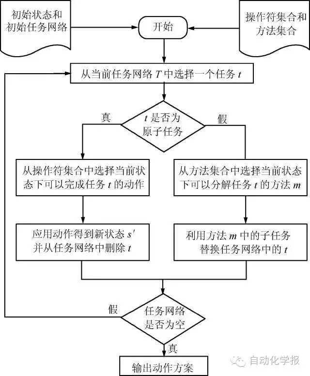

# 不确定层次任务网络规划研究综述

原创 自动化学报 2016-05-23 16:22 北京

> 原文地址: [https://mp.weixin.qq.com/s/Ici2RMkwi6GXi1R2EHr-3Q](https://mp.weixin.qq.com/s/Ici2RMkwi6GXi1R2EHr-3Q)

摘要

层次任务网络(Hierarchical task network, HTN) 规划作为一项重要的智能规划技术被广泛应用于实际规划问题中,传统的HTN 规划无法处理不确定规划问题. 然而, 现实世界不可避免地存在无法确定或无法预测的信息, 这使许多学者开始关注不确定规划问题, 不确定HTN 规划研究也成为HTN 规划研究的前沿. 本文从HTN 规划过程出发分析了不确定HTN规划问题中涉及的三类不确定, 即状态不确定、动作效果不确定和任务分解不确定; 总结了系统状态、动作效果和任务分解等不确定需要扩展确定性HTN 规划模型的工作, 以此对现有不确定HTN 规划的研究工作加以梳理和归类; 最后, 对不确定HTN 规划研究中仍需要解决的问题和未来的研究方向作了进一步展望.

关键词

智能规划, 不确定规划, HTN 规划, 不确定HTN 规划

引用格式

王红卫, 刘典, 赵鹏, 祁超, 陈曦. 不确定层次任务网络规划研究综述. 自动化学报, 2016, 42(5): 655-667

图 1.  HTN 规划过程示意图

作者简介

王红卫 华中科技大学自动化学院系统工程专业博士, 教授. 主要研究方向为物流系统, 公共安全与应急管理, 工程管理.本文通信作者. 

E-mail: hwwang@mail.hust.edu.cn

刘典 华中科技大学自动化学院博士研究生. 2008 年获得华中科技大学控制科学与工程系学士学位. 主要研究方向为HTN 规划, 应急管理, 人工智能.

E-mail: liudianop@hust.edu.cn

赵鹏 华中科技大学自动化学院博士研究生. 2008 年获得华中科技大学控制科学与工程系学士学位. 主要研究方向为HTN 规划, 应急管理, 人工智能.

E-mail: pengzhao@hust.edu.cn

祁超 华中科技大学自动化学院系统科学与工程系副教授, 博士. 2006 年毕业于新加坡南洋理工大学. 主要研究方向为自动规划, 调度与优化, 应急管理与决策. 

E-mail: qichao@hust.edu.cn

陈曦 华中科技大学自动化学院系统科学与工程系副教授, 博士. 2007 年毕业于华中科技大学. 主要研究方向为复杂系统建模与仿真, 计算实验, 决策支持,公共安全与应急管理.

E-mail: chenxi@hust.edu.cn

