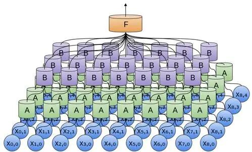
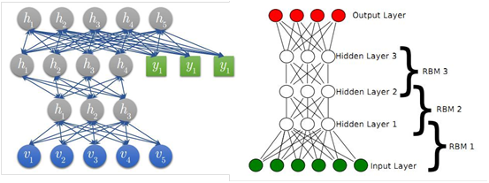
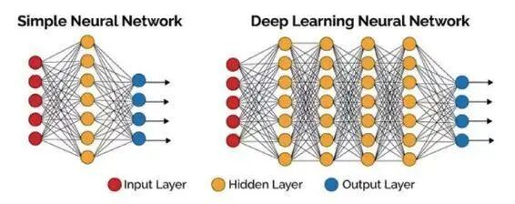
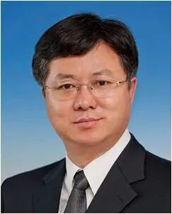
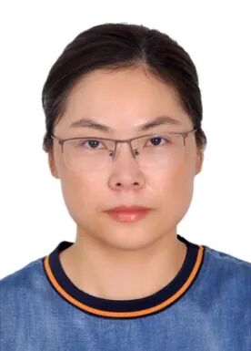

# 乔俊飞, 贾庆山等：深度信念网络研究现状与展望

原创 自动化学报 自动化学报 2021-02-26 17:19 北京

> 原文地址: [https://mp.weixin.qq.com/s/qKJLqsm0z6ZWbJUu4WQS1Q](https://mp.weixin.qq.com/s/qKJLqsm0z6ZWbJUu4WQS1Q)

**点击蓝字**

**关注我们**

  

**深度信念网络**是指一种概率生成模型, 其分层学习机理克服了传统梯度算法在处理深层结构所面临的梯度消失问题, 近几年来已成为深度学习领域的研究热点之一。

  

王功明, 乔俊飞, 关丽娜, 贾庆山.深度信念网络研究现状与展望.自动化学报, 2021, 47(1): 35-49

_http://www.aas.net.cn/cn/article/doi/10.16383/j.aas.c190102?viewType=HTML_

  

  

近年来，深度信念网络的结构设计问题引起了众多学者的关注。著名深度学习专家Bengio曾提出一个令人深思的问题, 该问题原文描述为：“Is there a depth that is mostly sufficient for the computations necessary to approach human-level performance of AI tasks?”。然而，由于深度信念网络的结构复杂和参数多样化，其结构设计注定是一个充满挑战的问题，往往面临诸多困难。例如：

  

1）基于规则的结构动态设计方法可解释性差，不具有普遍性；

  

2）深层结构含有大量的超参数，结构设计需要首先解决超参数赋值问题；

  

3）由于隐含层神经元间的双向连接特性，计算复杂度是制约结构设计的最大因素。

  

  

  

  

面对这些问题，深度信念网络的研究逐渐形成了以问题为导向的发展模式，即根据实际需求，最大化某种特征或功能。因此，本文：

  

1）介绍了深度信念网络的基本模型结构以及其标准的学习框架, 并分析了深度信念网络与其他深度结构的关系与区别；

  

2）分别介绍了深度信念网络的固定结构、稀疏结构、自组织结构、增量式结构、递归结构等不同结构学习模式的研究进展及成果；

  

3）分别介绍了深度信念网络的无监督学习和有监督学习变种算法的研究进展及成果；

  

4）总结并分析了深度信念网络今后的发展趋势及未来研究方向。

  

**请点击左下角“****阅读原文****”了解更多！**

  

**作者简介**

  

**王功明**

清华大学自动化系智能与网络化系统研究中心博士后. 主要研究方向为深度学习, 神经网络结构设计与优化控制.本文通信作者.

E-mail: wanggm@tsinghua.edu.cn

  

**乔俊飞**

北京工业大学信息学部人工智能与自动化学院教授. 主要研究方向为污水处理过程智能控制, 神经网络结构设计与分析.

E-mail: junfeiq@bjut.edu.cn

  

**关丽娜**

北京工业大学信息学部人工智能与自动化学院博士研究生.主要研究方向为双曲系统稳定性分析及鲁棒控制.

E-mail: guanlina@emails.bjut.edu.

cn

  

**贾庆山**

清华大学自动化系智能与网络化系统研究中心副教授。主要研究方向为网络化信息物理融合能源系统的优化理论与方法，特别在序优化及事件驱动优化的理论、方法与应用方面做出了贡献.

E-mail: jiaqs@tsinghua.edu.cn

  

  

**期刊目录**

[2021年第01期](http://mp.weixin.qq.com/s?__biz=MzI2NjA3MzM5MA==&mid=2649958084&idx=1&sn=24c140a6a1957eb7f4164689ed2840a5&chksm=f2942285c5e3ab93c5ed6127ad93e76ded82ae657ca79f7ead390387fbe2a72cb6df0ec6dcd2&scene=21#wechat_redirect)

[《自动化学报》2020年全年合集](http://mp.weixin.qq.com/s?__biz=MzI2NjA3MzM5MA==&mid=2649957972&idx=1&sn=1951847aacbcb7d22bdd2a46a79af871&chksm=f2942215c5e3ab03d070d8e52b8764b38036897c97b6a26c7a1f918c806b28edbe6c0fbf7ea9&scene=21#wechat_redirect)

[2020年第10期 工业人工智能专题](http://mp.weixin.qq.com/s?__biz=MzI2NjA3MzM5MA==&mid=2649957201&idx=1&sn=ab82a767bd716ab67fdf2942500d8b61&chksm=f2942710c5e3ae06b27f9e63a5e329a1123d90b051164e6b6123c500230541b1ed12d92abbfb&scene=21#wechat_redirect)

[2020年第09期 分布式信息能源系统理论与应用专题](http://mp.weixin.qq.com/s?__biz=MzI2NjA3MzM5MA==&mid=2649956412&idx=1&sn=8ebc13d63fd333ad85dbb8b5825df248&chksm=f294247dc5e3ad6ba297857a5b957e97cf499266c50318791fa8abd9432ecf1d9c3d9b287e36&scene=21#wechat_redirect)

[2019年第12期 智能轨道交通系统专刊](http://mp.weixin.qq.com/s?__biz=MzI2NjA3MzM5MA==&mid=2649955524&idx=1&sn=a76b97bf832e984f0155acc0fb367bc7&chksm=f2941885c5e391935c353c88072e806cb0b5b9b78b1f7b23b3c6f4b8c6a2c12f72557f87b56b&scene=21#wechat_redirect)  

[2019年第01期 信息物理融合系统理论与应用专刊](http://mp.weixin.qq.com/s?__biz=MzI2NjA3MzM5MA==&mid=2649955194&idx=2&sn=fb75bc8af9672922fa20efe2d30ff6c9&chksm=f2941f3bc5e3962db43689d03a54a0e40d83cb0e69fb9c48e87c0325b5bdf1b71028ebbbba0a&scene=21#wechat_redirect)

  

**期刊动态**

[《自动化学报》致谢审稿人](http://mp.weixin.qq.com/s?__biz=MzI2NjA3MzM5MA==&mid=2649957872&idx=1&sn=e642c48a6d17dc0f99d2f3879446ecab&chksm=f29421b1c5e3a8a7b4e5cf8564d2f0713d3bcec5186ef4684875caf67dd096659450c96f31ce&scene=21#wechat_redirect)

[自动化学报蝉联百种中国杰出期刊称号，入选中国精品科技期刊](http://mp.weixin.qq.com/s?__biz=MzI2NjA3MzM5MA==&mid=2649957485&idx=1&sn=8af865466cb6f52b05a1e41af8549e71&chksm=f294202cc5e3a93a40b4850e6e0f0bccaf56c89591e049e9d98bfe9a598913f5d25e8ecfcf8d&scene=21#wechat_redirect)

[《自动化学报》挺进世界期刊影响力指数Q1区](http://mp.weixin.qq.com/s?__biz=MzI2NjA3MzM5MA==&mid=2649957452&idx=1&sn=c5fa8ac9c581e4ae3de2e7956e603dca&chksm=f294200dc5e3a91bb250e25fd6f7e47dc1114ad6fdf1762a7bfc440f789a059f1de455584e66&scene=21#wechat_redirect)

[《自动化学报》多名作者入选科睿唯安2020年度高被引科学家](http://mp.weixin.qq.com/s?__biz=MzI2NjA3MzM5MA==&mid=2649957295&idx=1&sn=597189346218d96d9906447a50281084&chksm=f29427eec5e3aef8d0662def8a0afcde2d2f3f828ae8208a52b14fc72169cedc5d81c06185a9&scene=21#wechat_redirect)

[自动化学报排名第一，被评定为中国中文权威期刊](https://mp.weixin.qq.com/s?__biz=MzI2NjA3MzM5MA==&mid=2649956509&idx=1&sn=1e39aaf65dc579606cf36258be8e1744&scene=21#wechat_redirect)

  

**热点文章**

[孙长银, 吴国政, 王志衡等：自动化学科面临的挑战](http://mp.weixin.qq.com/s?__biz=MzAwMzAzMDgxOA==&mid=2651070248&idx=1&sn=a02af679240552bf79b3dd01100be89b&chksm=8131d565b6465c73532b22b11e92c8dd87b72d269f79fe53a2e3050fa996cc8ab1fec676659c&scene=21#wechat_redirect)

[值得收藏！SCI论文中的常用句式全总结](http://mp.weixin.qq.com/s?__biz=MzAwMzAzMDgxOA==&mid=2651069425&idx=1&sn=c945766f5d7f2ada8a217b981dcc734c&chksm=8131d1bcb64658aa80092eb53e1ead905ab02fc7a9f035e798e57d6407472ef688e8f7f0e831&scene=21#wechat_redirect)

[收藏！SCI论文经典词和常用句型汇总](http://mp.weixin.qq.com/s?__biz=MzAwMzAzMDgxOA==&mid=2651069036&idx=1&sn=961c952c84a07355dc70d4bb8291ce25&chksm=8131d021b6465937c80cf41a3118a5ad92a752cb3979f22d5964a741269a1df1987a37185a31&scene=21#wechat_redirect)

[吴国政等：浅析人工智能学科基金项目申请资助情况及展望](http://mp.weixin.qq.com/s?__biz=MzAwMzAzMDgxOA==&mid=2651068994&idx=1&sn=bca1ddc9774ad59ff1459a32883be60f&chksm=8131d00fb646591928654c4880aa609305efa30b538c0c431d8c8138df4401fcc87e80a131e0&scene=21#wechat_redirect)

[段广仁院士：高阶系统方法—Ⅲ. 能观性与观测器设计](http://mp.weixin.qq.com/s?__biz=MzI2NjA3MzM5MA==&mid=2649956510&idx=1&sn=7aa3652a7908ccd9621b47023dc25103&chksm=f29424dfc5e3adc938a51b7b1620a6f47911c974153f94b2c38cfdc37536b750195fbc4be8a4&scene=21#wechat_redirect)

[段广仁院士：高阶系统方法— II. 能控性与全驱性](http://mp.weixin.qq.com/s?__biz=MzI2NjA3MzM5MA==&mid=2649956009&idx=1&sn=d887902e385f28ddea0fcb569208bb86&chksm=f2941ae8c5e393feccb4347c9a3afbe191007f67323747782405b9ca5c754ba6e16017557786&scene=21#wechat_redirect)

[段广仁院士：高阶系统方法— I. 全驱系统与参数化设计](http://mp.weixin.qq.com/s?__biz=MzI2NjA3MzM5MA==&mid=2649955943&idx=1&sn=7d2e161c5d48ea877709b94ef706a3af&chksm=f2941a26c5e3933077b5c9ef2cf38af1087f3f074454251d441433f1c53861ddd85386b7a260&scene=21#wechat_redirect)

[陈虹教授等：智能时代的汽车控制](http://mp.weixin.qq.com/s?__biz=MzAwMzAzMDgxOA==&mid=2651065976&idx=1&sn=d6daa2fafd8e723a0238c5566cf1641c&chksm=8131c435b6464d23449b163afedd37f20a5d7598fe6684c6b011d19554e0ed38ef031fbf2ec9&scene=21#wechat_redirect)

[科研必备！盘点常用文献管理工具](http://mp.weixin.qq.com/s?__biz=MzI2NjA3MzM5MA==&mid=2649956322&idx=1&sn=aa1f98bb307dda70981e073546c973c4&chksm=f2941ba3c5e392b58981c27b2ea1334ef149e0b9eb126ac62453537db789a694cc35f72cac09&scene=21#wechat_redirect)

[吴子牛教授: 浅谈论文写作](http://mp.weixin.qq.com/s?__biz=MzI2NjA3MzM5MA==&mid=2649955566&idx=1&sn=3df5d36d46f533cae96361a987e914db&chksm=f29418afc5e391b97525c9f5193e21d92517dc58041e51509d0e5fb7f25938a7e601e414e46b&scene=21#wechat_redirect)

[刘洋教授: 浅谈研究生学位论文选题方法](http://mp.weixin.qq.com/s?__biz=MzI2NjA3MzM5MA==&mid=2649955575&idx=1&sn=b0cba28d16eb2af6672862064dca2ac8&chksm=f29418b6c5e391a0af6810385fdc25c36fade0562348469a5b28195b9c46309ee1c7b873c280&scene=21#wechat_redirect)

[张军平教授: 论文选题与写作](http://mp.weixin.qq.com/s?__biz=MzI2NjA3MzM5MA==&mid=2649955604&idx=1&sn=1b2dab0efab5528e57ce3b80a69f70e0&chksm=f2941955c5e390434fb1bc78bbd754f6209f2c75ba841c3023aadf8681c4f6b6784cf3f2af84&scene=21#wechat_redirect)

[【热点综述】2019年综述TOP20](http://mp.weixin.qq.com/s?__biz=MzI2NjA3MzM5MA==&mid=2649955584&idx=1&sn=b6460d48b4c365e8062c2b45bbcf8e38&chksm=f2941941c5e390574162e362028c22a441fa00ffbc0634599685c34f8a3a3446eaf90b8c0723&scene=21#wechat_redirect)

[【热点综述】2019年最新文章](http://mp.weixin.qq.com/s?__biz=MzI2NjA3MzM5MA==&mid=2649955359&idx=1&sn=cd768b5f2572472b6465c3f06b21a803&chksm=f294185ec5e3914807e5a5c9ec3143c15eb94a38ae51f5608acbc21b9b16cd20da65649401e0&scene=21#wechat_redirect)

[国家科技重大专项&重点研发计划等资助论文精选](http://mp.weixin.qq.com/s?__biz=MzI2NjA3MzM5MA==&mid=2649955416&idx=1&sn=152515bf1cc9800199a8da3d456f6b54&chksm=f2941819c5e3910ff3f98d74e2aae494046b5dbb6f6096c3d5c0c3d5ba134cf10f5e7af5bb86&scene=21#wechat_redirect)

[国家自然科学基金资助论文精选（二）](http://mp.weixin.qq.com/s?__biz=MzI2NjA3MzM5MA==&mid=2649955406&idx=2&sn=be8a73e34b097480f593ad399d4ce4d1&chksm=f294180fc5e39119440ddd930d887fd848daf3104587519b2295e2e32d97a5cb9cfd7f4e7bc3&scene=21#wechat_redirect)

[国家自然科学基金资助论文精选（一）](http://mp.weixin.qq.com/s?__biz=MzI2NjA3MzM5MA==&mid=2649955406&idx=1&sn=3c905081a57f1deb156b9f6f12b57a56&chksm=f294180fc5e3911966de31a290e784e8d5856902968fb29b3d3242a2e2d26104d526d217c79b&scene=21#wechat_redirect)  

[【前沿速递】机器人领域热点综述](http://mp.weixin.qq.com/s?__biz=MzI2NjA3MzM5MA==&mid=2649955259&idx=1&sn=c6aaf28c985bc4535380e5e774cac040&chksm=f2941ffac5e396ec6562e95c6ab505f84a1ad6f6f3f558a1a13abe94ec0a3db42a984830dec8&scene=21#wechat_redirect)

[【好文推荐】智能交通文集](http://mp.weixin.qq.com/s?__biz=MzI2NjA3MzM5MA==&mid=2649955221&idx=1&sn=9fc1c9e36a890e83da22882421bd8a14&chksm=f2941fd4c5e396c2bd720a9d9e007ffb1e8dd88fde551cfa3b5a41a527458ebc340522a4b669&scene=21#wechat_redirect)

[【热点专题】流程工业自动化](http://mp.weixin.qq.com/s?__biz=MzI2NjA3MzM5MA==&mid=2649955342&idx=1&sn=0301d93b276aaaf27fe36d71ee2c841d&chksm=f294184fc5e391596cf037d93097ab69ee48b5a3c36c5fd5dfdaa14a302c445a9ec4cf9dab11&scene=21#wechat_redirect)[专题](http://mp.weixin.qq.com/s?__biz=MzI2NjA3MzM5MA==&mid=2649955342&idx=1&sn=0301d93b276aaaf27fe36d71ee2c841d&chksm=f294184fc5e391596cf037d93097ab69ee48b5a3c36c5fd5dfdaa14a302c445a9ec4cf9dab11&scene=21#wechat_redirect)  

[【热点专题】数据驱动控制、学习及优化专题](http://mp.weixin.qq.com/s?__biz=MzI2NjA3MzM5MA==&mid=2649955310&idx=1&sn=9565312b88fe3ed17b199d148f22f191&chksm=f2941fafc5e396b93c014d1ab5d33c8f1da2a2d293843bcb814d5131b29677dfd4e38ff5699d&scene=21#wechat_redirect)

[【热点专题】模糊系统专题](https://mp.weixin.qq.com/s?__biz=MzI2NjA3MzM5MA==&mid=2649955382&idx=1&sn=07f211b9dd9d8c222f96d59f9960fd4f&chksm=f2941877c5e3916198db46714ecd96c3273dc248fa10dc75f84212a2531159e31f25f40c73c2&scene=21&token=684109038&lang=zh_CN#wechat_redirect)

  

  

**长按二维码｜关注我们**

**IEEE/CAA Journal of Automatica Sinica (JAS)**

**长按二维码｜关注我们**

**《自动化学报》服务号**

**长按二维码｜关注我们**

**《自动化学报》订阅号**  

  

**联系我们**

**网站:** 

http://www.aas.net.cn

http://www.ieee-jas.org

**投稿:** 

https://mc03.manuscriptcentral.com/aas-cn   

https://mc03.manuscriptcentral.com/ieee-jas 

**电话:**  010-82544653（日常咨询和稿件处理） 

           010-82544677（录用后稿件处理）

**邮箱:**  aas@ia.ac.cn（日常咨询和稿件处理）  

           aas\_editor@ia.ac.cn（录用后稿件处理）

**博客:** 

http://blog.sina.com.cn/aaseditor 

  

**↓ 点击下方 阅读原文 了解更多**