# 人工智能的本源：一本书和两个学术家族的故事

原创 王飞跃 自动化学报 2016-06-13 15:07 北京

> 原文地址: [https://mp.weixin.qq.com/s/x\_ozlUUYmaGhBnZi5yb88w](https://mp.weixin.qq.com/s/x_ozlUUYmaGhBnZi5yb88w)

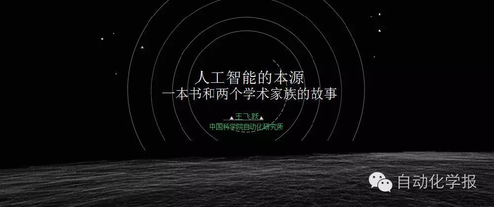  

  

大家好!

非常高兴来参加听道和中国自动化协会联合举办的这次公益活动。我今天就跟大家谈一点人工智能的历史和本源，还有相关的一些话题，但不谈技术。那么这次报告的主旨呢，就是跟大家传达三个信息，一，智能技术是我们这个时代的时代技术，对此我们要激动之心； 二，智能技术其实是科学跟技术发展到今天的一个必然结果，对此我们要有敬畏之心；三， 这种技术绝对不是对人类的威胁，它是人类的朋友，会让我们的生活过得更好，对此我们要有平常之心。我就从这几个方面跟大家来介绍一下，人工智能的历史还有它的作用。

  

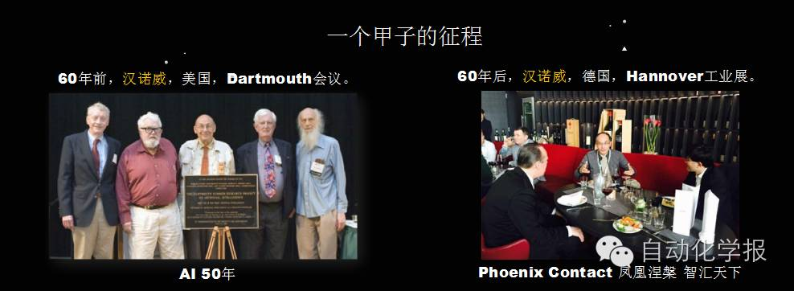  

  

大家都知道今年是人工智能60周年的纪念。为什么?就是60年前一帮小伙子带头开了一个会，这个会的内容是关于什么呢?实质是关于自动机和Cybernetics控制论的进一步发展，但是组织会议的这两个年轻人McCarthy和 Minsky，为了让大家一不把它认为是自动机的研究，二是不愿意跟Cybernetic控制论联系起来，他们不愿意跟Wiener联系起来，因为控制论创始人Wiener那时候脾气很不好，年轻人都蛮怕他的，所以McCarthy就想出个新的名词来，就叫人工智能。

当时参加会议的有些人并不觉得这个名字合适，因为觉得人工智能这个名字，Artificial Intelligence听起来不大真实，好像还有点骗人的意思。所以当时参加这个会议年纪比较大的司马贺(H. A. Simon)就说我们能不能把它叫成“复杂信息处理”?更好的反映这个领域的本质? 但是最后呢，这个领域还是叫了人工智能。这就是为什么今天我们庆祝人工智能60周年。不过，把在美国汉诺威开的这个会作为人工智能研究的开始，我是觉得一有点任性，二不是一件公平的事情。

60年后的2016年的年初，我去另外一个汉诺威开会，就是德国的汉诺威，更老的汉诺威。在这个会上，我跟一个叫Phoenix Contact的德国公司二位负责人谈起人工智能。我认为他们公司这个名字很好，Phoenix Contact凤凰接触，今年正好是人工智能60年，60年中国人说是一个甲子一个轮回，要重新开始，就是"凤凰涅槃"，恰好他们正计划从老IT工业技术转化为新IT智能技术，力推"工业4.0"。跟凤凰一接触之后变成智能了，你们以后的口号就叫"凤凰涅磐，智汇天下"吧。

  

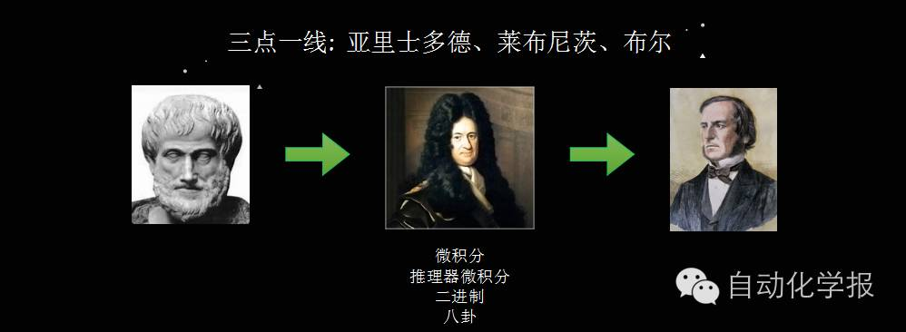  

  

这个公司的CEO叫Frank，他说汉诺威是莱布尼茨的出身之地(实际上是其安息之地，生于莱比锡)。莱布尼茨是德国著名的哲学家、数学家、逻辑学家，号称17世纪的亚里士多德，发明了微积分和二进制。亚里士多德其实他还发明了一样跟人工智能非常相关的东西，叫“推理器微积分”。什么叫推理器微积分?就是想把人的这个思维也和算术一样给机械化了，以后人的思维也变成可以像大家做数学题一样，机械化微积分了。当时他只是一种设想，他的相关的工作现在也不知道到哪儿去了，只留了一些名词和一些片言只语的东西。

  

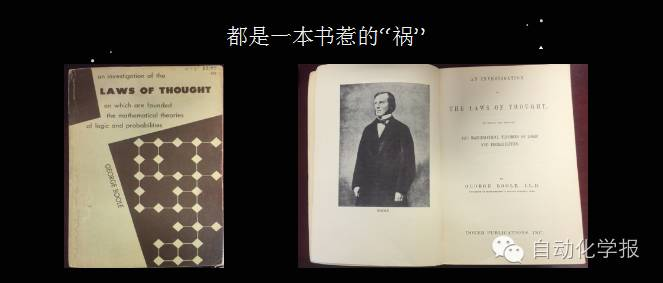  

  

到了一个多世纪之后，又有另外一个数学家、逻辑学家叫乔治·布尔，他写了一本书叫《LAWS OF THOUGHT》思维定律，最终把亚里士多德提出的三段论形式逻辑（这是奠定了数理逻辑最初基础的哲学工作），结合一千多年之后莱布尼茨提出的设想，集大成开始了现代的数理逻辑，并提出布尔代数，成为后来数字逻辑电路的数学基础，智能的科学研究真正开始了。

30年前，我在一个美国小教堂里面的图书馆找到了这本书，后来主教把这本书送给我，我也是因为这本书认识了我后来的老师Robert McNaughton教授，让我认识了一个历史悠久、伟大的学术家族。这也让我对人工智能有了不同的认识。

  

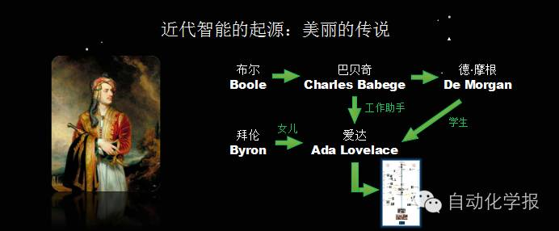  

  

在我看来，这几个人开创了人工智能的现代史。哪几个人?布尔、巴贝奇(Babbage)还有德•摩根(De Morgan)这三个人。布尔我刚才已经讲了，那么巴贝奇呢?就是做了世界第一个完完整整有记录的机械计算机的人。

德•摩根是布尔同时代的学术好友，当时很多人不理解布尔，但德•摩根是布尔的坚决支持者，他是一个数学家，也是一个逻辑学家，还是一个哲学家。研究逻辑或做电路的人都知道有个De Morgan Law，就是他提出的。当时在布尔岳父的组织之下，三人都在一个社会小圈子里，专门研究印度古代逻辑，然后在这个基础上就开始了我们今天的计算机史，也形成了我们今天的人工智能的早期历史。

当时，巴贝奇雇了德•摩根的一个学生叫爱达(Ada Lovelace)给他编程，所以这个Ada成为了世界第一个程序员。她是谁呢?她是大诗人拜伦唯一的合法女儿。现在大家公认Ada是世界上第一个程序员，你去看计算机行业有好多奖甚至程序语言都是以她命名的，其实她到底做了多少工作，大家都说不清楚。这也像一首诗一样，算是拜伦这个诗人的另一个美丽传说吧。其实，摩根之后还衍生了一个完整的学术家族，这个家族的发展极大地推动了人工智能的发展。

  

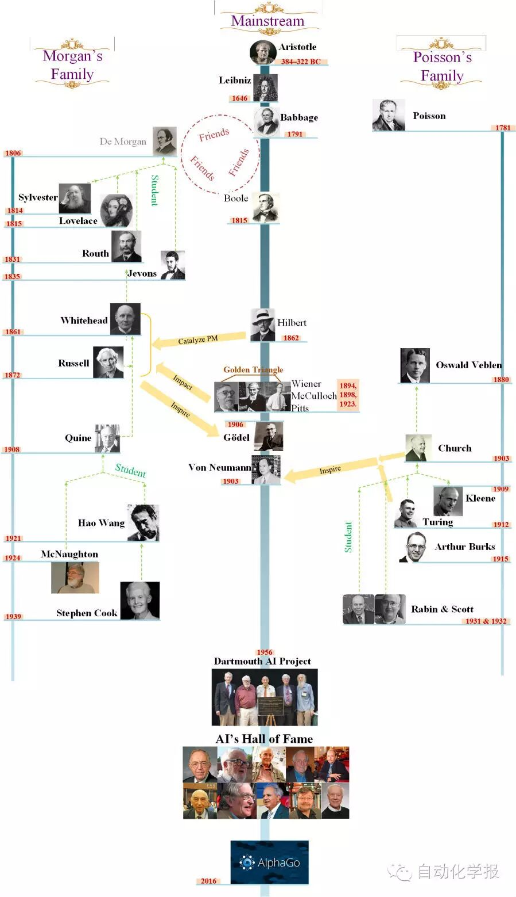

  

简单地说，人工智能是从哲学开始的。哲学一词本来字面上的意思就是爱智慧，学术上来说就是对智慧的追求，这不就是人工智能吗?从亚里多士德到莱布尼茨，一直到布尔，都由哲学主导。

然后，到了1900年的8月8号，开了一次世界数学大会。德国数学家希尔伯特会上提出23个问题，其实他的核心思想还是要把数学机械化了，引发了德•摩根的学生怀德海(A. N. Whitehead, 白头)在自己的学生加朋友罗素（Russell)鼓动之下，合写了一本书叫《数学原理》，号称是人类历史上最伟大的100本书之一，提出怎样一步一步地用符号逻辑建立一套公理和推理体系，把数学机械化。写这本书要克服许多奇怪的问题，第一个问题就是罗素悖论，剃头师的头谁剃? 通过引入category的慨念，这些问题似乎基本解决。

沒过多少年，哥德尔(Godel)就提出靠有限系统沒有矛盾地推出整个数学体系这条路根本就不行，这就是有名的哥德尔的不完备原理。然后又来了图灵(Turing)，他弄了一个更简单的图灵机，再次证明不行。大家都说图灵机是实现智能的基础，但谁要是拿图灵机来做人工智能就只剩人工没有智能了，图灵机其实是没用的，只是一个数学概念一个简单的装置而己。但这个装置证明了决策问题“停机”问题是不可判定的。由此，引发了所谓的Church-Turing Thesis的计算假设，就是所有能计算的东西都可以用图灵机来实现，冯•诺依曼(von Neumann)据此做出第一台二进制电子计算机，提出了今天还在用的冯•诺依曼的结构，有了我们现在的计算机，催生了今天的信息技术，推动了我们今天的人工智能。从维纳到人工智能会议，《数学原理》这本书发挥很大作用，如这幅图所示，这是几个学术家族之间差不多一百多年的努力的结果，最后才形成了今天的人工智能。讲这个的目的就是要表明，今天的智能技术是几代科学家的努力，而且还是科学发展的一个必然结果。

  

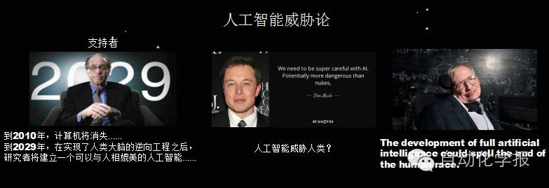  

  

人工智能不会对人类形成威胁，尽管这个威胁论目前风行，特别在中国很有市场。一个是这个奇点理论，到什么2029年机器智能要超过人类智能，再就是一个很成功的企业家说它比原子弹还可怕，最后一个更有名的物理学家说人工智能可能标志着人类的结束! 我是觉得这有点太过分了，像这类讲法都是一种文学上的描述。虽然有些是科学家，有些是企业家，但这些东西你驳都没办法驳。他要是说一个具体时间，什么时候实现什么，你只有靠时间来验证。比如说库兹韦尔（奇点大学校长）说到2010年计算机就消失了，可今天是2016年了，这可是白纸黑字写的，并在公共场合上讲的话，我想今天好多人还是带了计算机来了吧。有些预测是没有时间界限的，你就更没法儿验证，好多几乎是业内常识，搭顺风车就能实现，能叫预言?

还有一些我说其实是默顿定律（Merton’s Law)，他有这个预测使得大家都愿意跟他去做，在大家的推动下，最后可能也真的实现了。所以我说，这一类的预测是没有任何科学依据的。套用霍金自己讲的话，他自己年轻的时候讲过只要有人类，就有希望，人类的探索是无止境的!他还讲过一句话，他说不能把万有引力作为飞机失事的罪魁祸首。显然，那你也不能把智能作为终结人类的这个祸首。

  

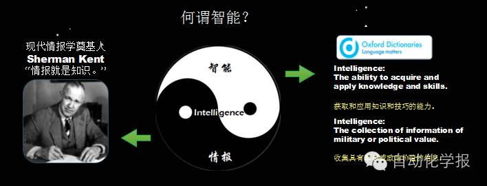  

  

为什么说人工智能不会威胁人类呢?大家不妨回顾一下智能的本质，首先什么叫智能?有一年开国际人工智能联合大会，大家做了个调查，发现有一百多种定义。你要真找，我估计两三百种定义你可以都找到。但是有个很简单的定义，大家去查字典呗。英文字典Intelligence其实有两个意思，一个意思大家都知道，就是技术层次的智能，它就是人类利用知识的能力和技巧，但是还有一个意思，智能就是情报。为什么我们今天这个时代这一点特别重要?你看搜索技术，谷歌，还有我们的百度，它们为什么变成人工智能的领先公司，就跟智能的另外的意思——情报，是相关的。你要把信息搜集起来，形成大数据、物联网、最后还要云计算一下，这样就自然而然地走向智能。所以智能就是这个时代的特征，一定要把智能和情报两个结合起来。

  

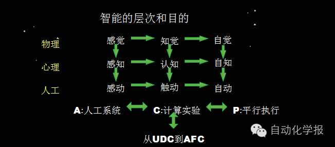  

  

为什么我们的时代需要智能技术?这是因为我们进入一个智能的时代，这个智能的时代不由劳动力主导，它要求我们每个人具有深度的知识、深度的技巧，可新一代是QQ长大的一代，知识都是碎片化的。如果你让他们花那么多时间再去读那么多专业书，了解这么多专门知识，我相信大家都不愿意做这种努力了，你还要生活的好，所以，你就需要智能技术。工业社会是靠了工业自动化才实现的，我们下面一个知识社会智能社会，一定要靠知识自动化来实现。

  

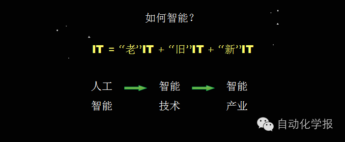  

  

人工智能机器人只是开了一个头而已，如何来进一步智能? 我们要从人工智能的学术研究产生智能技术，最后形成智能产业。由此，必须对IT的这个词有新的理解。

**IT=“老”IT+“旧”IT+“新”IT**

我们现在进入一个新IT时代，就是IT不再是“旧”的信息技术(Information Technology)，不再是“老”的工业技术(Industrial Technology)，而是“新”的智能技术(Intelligent Technology)，但是它只是这个IT的一部分，将来的IT一定是老旧新三部分都有，但这是一个新IT的时代!

  

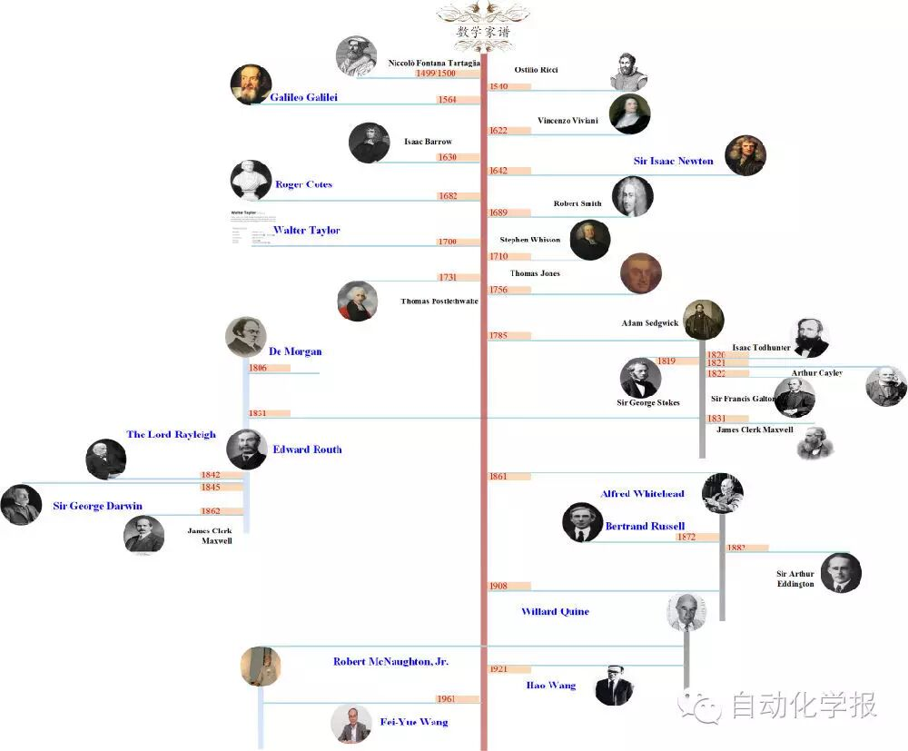

  

刚才提了一本书和二个学术家族在智能研究过程的历史作用，时间原因我就不再细讲了。为什么说人工智能是科学发展的必然呢?这两个学术家族，一个里面有伽利略，是第三代，第六代就是牛顿，这个家族里面出了接近20多个诺贝尔奖，出了好多位图灵奖。另一个里面有欧拉、达郎贝尔、泊桑等伟大的力学家和数学家。所以，智能走到今天，是主流科学家一代一代推动的结果，这些人在整个科学发展史上都起过极其重要的作用，这从一个侧面说明了人工智能是主流科学发展的必然结果，不是从天上掉下来的，不是六十年前才开始的，更不是今天才冒出来的。说人工智能威胁人类，不如直接说科学威胁人类听起更有道理。

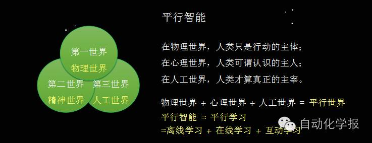  

  

我相信，我们现在进入一个新的时代。一个物理世界 + 心理世界 + 人工世界的时代。三个世界是波普尔的世界观，这三个世界加起来就是平行的时代。以前农业社会开发了物理世界，工业社会开发了物理世界和心理世界，还有一个第三世界叫人工世界等着我们去开发。这个人工世界就是要有人工智能，数据就是它的基础、矿藏。但智力最重要，而且人工智能，人工有多广，智能才可多深。

最近的AlphaGo就是一个非常好的数据驱动的智能和知识自动化特例。这个特例我们可以用Self X来称呼它。你看，它这个智能靠什么?相对过去的方法，它靠自打实现大数据，它靠加强学习实现智能化，它在很短的时间之内就可以自打三千万盘。我们人类自从有围棋以来，下的围棋的总盘数加起来还不到AlphaGo的几千万盘。它下了这么多，自己下了这么多盘了，就算不太聪明，胜过一个人类棋手也是应该的。Self X就是一种初步的平行，应是建设Digital Twin的主要目的。

  

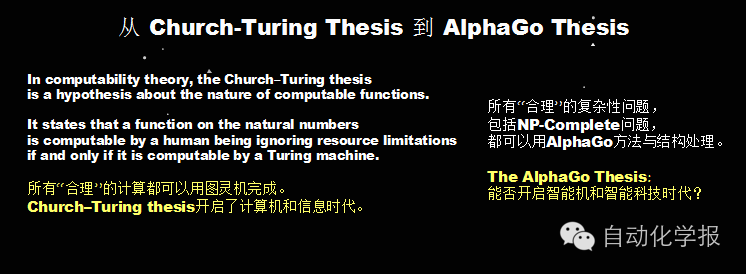  

  

如果这种技术用到运营管理中，将来每个企业里面做自打、自运营、自管理、自营销，它的智能一下就会涌现出来了!企业还没成立之前就可以靠这种平行的(人工+实际)的技术，这种企业自我运营方式，相当于一下子就运行了好几百年，它那个管理经验一总结，是不是应该比其它的企业好?所以这就是一个新时代的开始!我觉得，要进入这个新时代，必须从我刚才讲的Church-Turing Thesis跨越到AlphaGo Thesis，就是认为用阿尔法Go这种方法，可以实现几乎所有的工程智能技术。

  

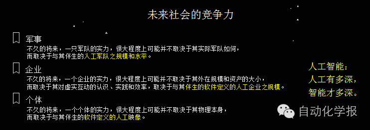  

  

将来的大家都要编程，我们要编各种各样的软件定义的系统，让VR、AR和AI虚实互动。机器人，包括有软件机器人和物理机器人平行合作，将来所有东西都平行，成为灵捷、精准、收敛、可编程化的个体与组织。

所以，人也是平行的。你一生下来就有好几个数据双胞胎twin you，也就是软件定义的你在各个方面跟你一起生活，一起学习，一起工作。各种各样的产品也是平行的，虚实互动。制造过程也是平行的， 工厂也是平行的，物流也是平行的。将来的军事、企业，包括你自己，都必须这样!你将来可以有自己的军队，你这个军队就是平行的你，软件定义的你，加上你买的各种各样的平行机器人，从小跟你一起成长形成你自己的一个、多个映射，提高你的智能。

  

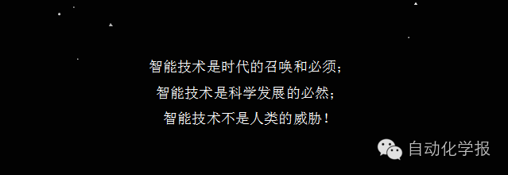  

  

所以我说按这种技术发展下来，将使人类社会更加开放，人工智能不是对人类的威胁，而是让人走向更加公开、公平、公正的智能社会。在这个新IT社会，智能技术迫使大家不骗人、不欺人、不害人，大家都能Happy, Healthy, High paid地工作!

这就是我今天传达的三个信息，也是我的一个信念。智能技术是时代的召唤和必须，要有激情迎接;也是技术和科学发展的必然，要敬畏;不是对人类的威胁，是人类的朋友，要平常心对待其效果，只有人类才能威胁人类!

谢谢大家！

  

点击“阅读原文”跳转学报网站当期页面。  

欢迎扫描二维码、长按图片识别关注《自动化学报》中文版订阅号aas1963和英文版服务号！

