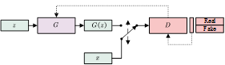
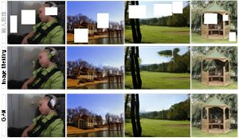
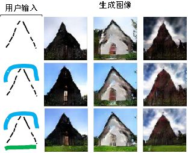
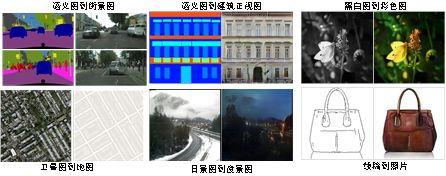
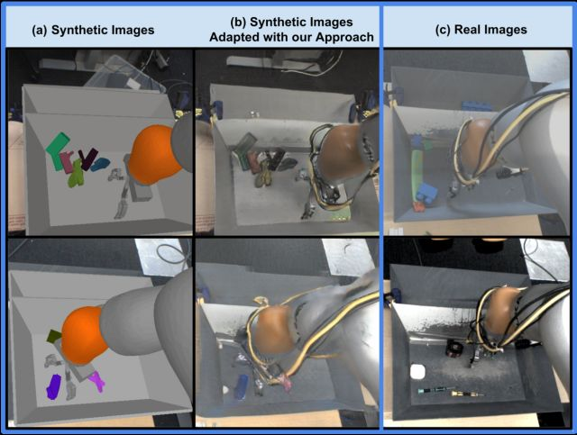
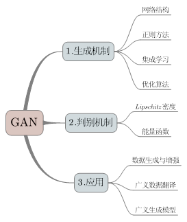
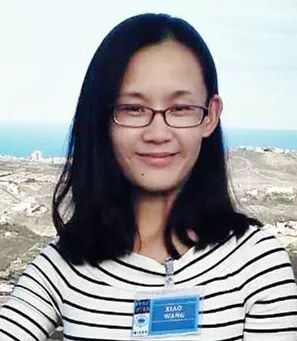

# 人工智能研究的新前线：生成式对抗网络

原创 自动化学报 2018-06-13 18:16 北京

> 原文地址: [https://mp.weixin.qq.com/s/N4BPxtfHaxplOFXw\_uy0Wg](https://mp.weixin.qq.com/s/N4BPxtfHaxplOFXw_uy0Wg)

生成式对抗网络 (Generative adversarial networks, GAN) 是当前人工智能学界最为重要的研究热点之一. 其主要思想是设置一个零和博弈, 通过两个玩家的对抗实现学习. 博弈中的一名玩家称为生成器, 它的主要工作是生成样本, 并尽量使得其看上去与训练样本一致. 另外一名玩家称为判别器, 它的目的是准确判断输入样本是否属于真实的训练样本. 一个常见的比喻是将这两个网络想象成伪钞制造者与警察.  GAN的训练过程类似于伪钞制造者尽可能提高伪钞制作水平以骗过警察, 而警察则不断提高鉴别能力以识别伪钞. 随着GAN的不断训练, 伪钞制作者与警察的能力都会不断提高.

图 1 生成式对抗网络

相比以往的生成模型, GAN模型具有以下几点明显的优势: 一是数据生成的复杂度与维度线性相关, 对于较大维度的样本生成, 仅需增加神经网络的输出维度, 不会像传统模型一样面临指数上升的计算量; 二是对数据的分布不做显性的限制, 从而避免了人工设计模型分布的需要; 三是GAN生成的手写数字, 人脸, CIFAR-10等样本较VAE, PixelCNN等生成模型更为清晰. 

图 2  GAN与传统方法的数据填补效果 \[3\]

图 3  iGAN的生成样例 \[4\]

GAN突出的生成能力不仅可用于生成各类图像和自然语言数据,  还启发和推动了各类半监督学习和无监督学习任务的发展. 结合GAN, 研究者在数据填报, 图像翻译, 数据合成, 模仿学习等诸多方面取得了突破性的进展.

图 4  图对图翻译 \[5\]

图 5  使用GAN合成数据训练机械臂 \[6\]

然而, 原始GAN模型也存在许多问题, 包括收敛困难, 无法生成离散数据, 难以评价等. 本文对GAN近年来的发展进行了综述, 对GAN在生成机制, 判别机制两方面的改进进行了介绍, 并梳理了其应用领域. 在此基础上, 本文还探讨了GAN与平行思想的关系.

图 6  本文组织结构

参考文献

\[1\] I. Goodfellow et al., “Generative adversarial nets,” in Advances in neural information processing systems, 2014, pp. 2672–2680

\[2\] I. Goodfellow, “NIPS 2016 Tutorial: Generative Adversarial Networks,” arXiv:1701.00160 \[cs\], Dec. 2016(arXiv: 1701.00160)

\[3\] S. Iizuka, E. Simo-Serra, and H. Ishikawa, “Globally and locally consistent image completion,” ACM Transactions on Graphics, vol. 36, no. 4, pp. 1–14, Jul. 2017

\[4\] J.-Y. Zhu, P. Krähenbühl, E. Shechtman, and A. A. Efros, “Generative Visual Manipulation on the Natural Image Manifold,” in European Conference on Computer Vision, 2016, pp. 597–613

\[5\] P. Isola, J.-Y. Zhu, T. Zhou, and A. A. Efros, “Image-to-image translation with conditional adversarial networks,” arXiv preprint arXiv:1611.07004, 2016

\[6\] K. Bousmalis et al., “Using Simulation and Domain Adaptation to Improve Efficiency of Deep Robotic Grasping,” arXiv:1709.07857 \[cs\], Sep. 2017(arXiv: 1709.07857)

引用格式

林懿伦, 戴星原, 李力, 王晓, 王飞跃. 人工智能研究的新前线：生成式对抗网络. 自动化学报, 2018, 44(5): 775-792.

作者简介

林懿伦 中国科学院自动化研究所复杂系统管理与控制国家重点实验室博士研究生. 主要研究方向为社会计算, 智能交通系统和智能汽车, 深度学习和强化学习.

E-mail: linyilun2014@ia.ac.cn

戴星原 中国科学院自动化研究所复杂系统管理与控制国家重点实验室博士研究生. 主要研究方向为智能交通系统, 机器学习和深度学习.

E-mail: daixingyuan2015@ia.ac.cn

李 力 清华大学自动化系副教授. 主要研究方向为人工智能和机器学习, 智能交通系统和智能汽车. 本文通信作者.

E-mail: li-li@tsinghua.edu.cn

王 晓 中国科学院自动化研究所复杂系统管理与控制国家重点实验室助理研究员. 主要研究方向为社会计算, 社会网络结构分析及其内容挖掘, 知识自动化, 人工智能, 平行驾驶.

E-mail: x.wang@ia.ac.cn

王飞跃 中国科学院自动化研究所复杂系统管理与控制国家重点实验室研究员. 国防科学技术大学军事计算实验与平行系统技术研究中心主任. 主要研究方向为智能系统和复杂系统的建模、分析与控制.

E-mail: feiyue.wang@ia.ac.cn

自动化

学报

相关文章

[生成式对抗网络：从生成数据到创造智能](http://mp.weixin.qq.com/s?__biz=MzAwMzAzMDgxOA==&mid=2651063870&idx=1&sn=1e1d7562a4bbe4c31e2fdef4859c0bc4&chksm=8131cc73b6464565d9419524cd87b4bbe363384f0ba722017e91a49af4640d349403ea9a0ea6&scene=21#wechat_redirect)  

[【智能自动化学科前沿讲习班第1期】王飞跃教授：生成式对抗网络GAN的研究进展与展望](http://mp.weixin.qq.com/s?__biz=MzAwMzAzMDgxOA==&mid=2651063376&idx=1&sn=9c789aa47b2f5230afb1a8780ce6ef99&chksm=8131ce1db646470b786e8e0fa6f3f14eadb31c2046f6f4b93609f7cc6c1f886122cca1d9f038&scene=21#wechat_redirect)  

[生成式对抗网络GAN的研究进展与展望](http://mp.weixin.qq.com/s?__biz=MzAwMzAzMDgxOA==&mid=2651063183&idx=1&sn=64a05ba464c29d32ec5e09c960aa0b2e&chksm=8131c9c2b64640d4362611c24d5dc8cf0d614ad4cce783ba6c7ee0abfb1053e12abde1a8fa7a&scene=21#wechat_redirect)

欢迎扫描二维码、长按图片识别关注《自动化学报》中文版订阅号aas1963，服务号自动化学报和英文版服务号！

JAS《自动化学报》（英文版）

自动化学报服务号

自动化学报订阅号

  

联系我们

Tel:  010-82544653（日常咨询和稿件处理） 

        010-82544677（录用后稿件处理）

Fax: 010-82544497

Email: aas@ia.ac.cn（日常咨询和稿件处理）

          aas\_editor@ia.ac.cn（录用后稿件处理）

http://www.aas.net.cn

点击阅读原文，了解更多精彩内容