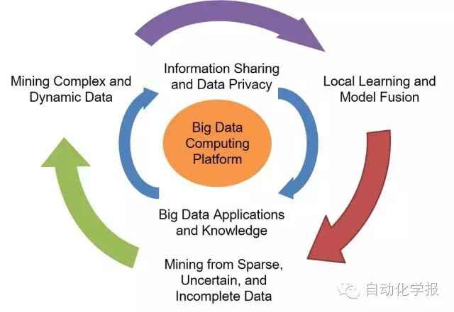
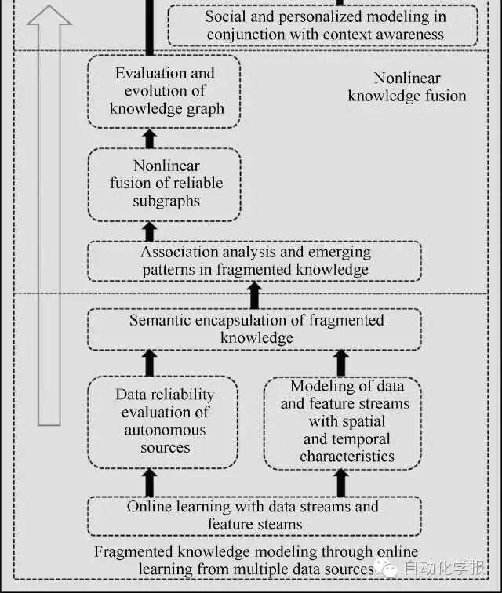
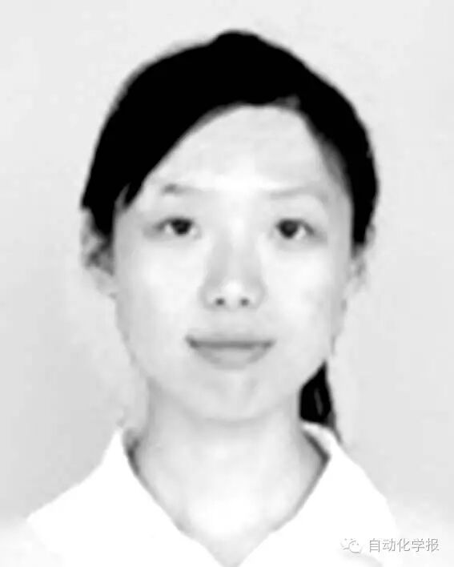
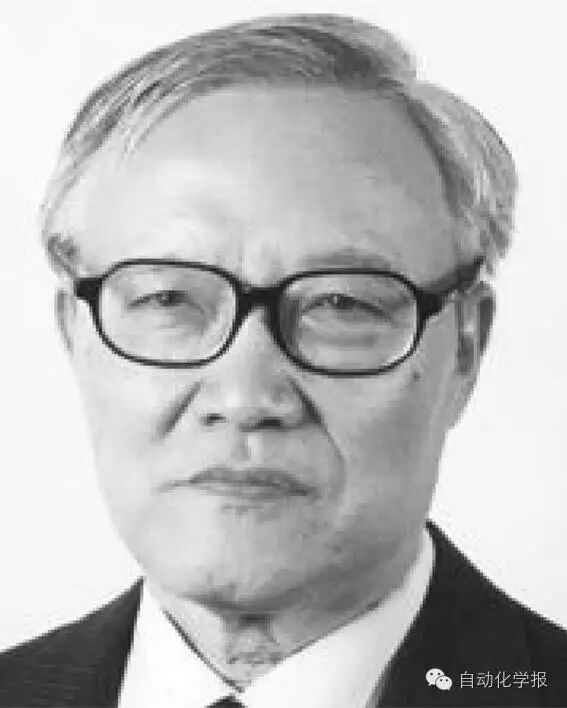

# 从大数据到大知识: HACE + BigKE

原创 自动化学报 2016-08-01 14:54 北京

> 原文地址: [https://mp.weixin.qq.com/s/p\_MTZQYNgFzsXePf9jOuZg](https://mp.weixin.qq.com/s/p_MTZQYNgFzsXePf9jOuZg)

随着数据采集存储和互联网技术的发展, 和大数据有关的分析方法和实例被广泛应用. 大数据面向异构自治的多源海量数据, 旨在挖掘数据间复杂且演化的关联. 结合大数据背景的HACE定理和大数据知识工程已产生巨大影响, 并具有广阔的而应用前景. 本文从大数据的本质特征开始, 评述现有的几种大数据模型, 包括5V, 5R, 4P和HACE 定理, 同时从知识建模的角度, 介绍一种大数据知识工程模型BigKE 来生成大知识, 并对大知识的前景进行展望. 

吴信东等在2014年在文章中提出的大数据HACE定理指出, 大数据始于异构(Heterogeneous)、自治(Autonomous)的多源海量数据, 旨在寻求探索复杂的(Complex)和演化的(Evolving)数据关联的方法和途径. HACE定理一经提出即引发热烈的反响, 从2014年1月开始, 连续18个月在IEEE XPLORE数字图书馆里每个月的下载量全球第一.

图1 HACE定理: 大数据处理框架的修改版

大数据的兴起也为知识工程带来了机遇和挑战. 大数据知识工程模型BigKE旨在融合碎片化知识, 以知识导航的形式提供个性化服务, 以满足不同用户需求与场景的多变性. 这些特性为公共领域, 如医疗、在线教育等增效提供了有利的保障.

图2 大数据知识工程模型——BigKE

引用格式

吴信东, 何进, 陆汝钤, 郑南宁. 从大数据到大知识: HACE + BigKE. 自动化学报, 2016, 42(7): 965-982

作者简介

吴信东 长江学者, 特聘教授, IEEE Fellow, AAAS Fellow. 合肥工业大学计算机与信息学院教授. 美国佛蒙特大学计算机与科学系教授. 1993 年获得英国爱丁堡大学人工智能博士学位.主要研究方向为数据挖掘, 知识库系统,万维网信息探索. 本文通信作者.

E-mail: xwu@hfut.edu.cn

何进 合肥工业大学计算机与信息学院硕士研究生. 2015 年获得安徽财经大学计算机科学与技术系学士学位. 主要研究方向为数据挖掘和大数据分析.

E-mail: flyingfish93319@126.com

陆汝钤 中国科学院院士. 1959 年获得德国耶拿大学数学系学士学位. 主要研究方向为知识工程, 基于知识的软件工程, 人工智能. 

E-mail: rqlu@math.ac.cn

郑南宁 中国工程院院士, IEEE Fellow,西安交通大学教授. 1985 年获得日本庆应大学工学博士学位. 主要研究方向为模式识别, 机器视觉与图像处理.

E-mail: nnzheng@mail.xjtu.edu.cn

