# 俞扬：“审时度势”的高效强化学习

原创 俞扬 自动化学报 2017-12-27 16:21 北京

> 原文地址: [https://mp.weixin.qq.com/s/VHxtmGCGVOjfjfiI3EIWEQ](https://mp.weixin.qq.com/s/VHxtmGCGVOjfjfiI3EIWEQ)

点击上方“深度学习大讲堂”可订阅哦！

  

**编者按：**强化学习，本质上是一种在环境中“审时度势”地学习策略的过程。AlpahGo和AlphaGo Zero的相继问世，证明了强化学习在模拟世界中的有效性。然而，现有的强化学习方法对样本量的需求极大、且利用率低，造成其难以在真实世界中应用。因此，如何提高强化学习的效率以应用于真实世界，进而打造真正的人工智能，是该领域的开放性问题。在本文中，来自南京大学的俞扬副教授，将从优化、方法论、模拟器等角度，介绍他近年来在高效强化学习中的一些探索。**文末，大讲堂特别提供文中提到所有文章的下载链接。**

  

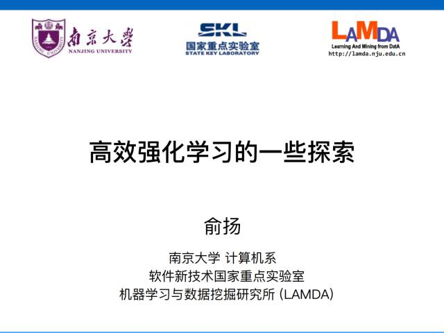

我今天主要介绍最近在强化学习方面一些初步的探索。

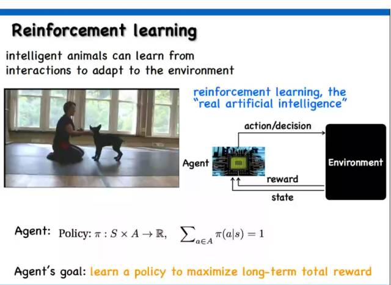

我们认为强化学习是有智商的动物都能做到的事情。举个例子，人类实际上没有办法与狗直接用语言交流，所以通过食物的诱导来训练它，比如当狗趴下（达到我们的目的）才给予它食物（奖赏），大概历经半个小时就可以训练一只幼犬听懂“趴下”。从狗的视角来看，它并不了解所处的环境，但能够通过大量尝试学会如何适应这个环境。

  

所谓强化学习，就是希望计算机能做出同样的事情——机器能够自主和环境交互，观察环境的反馈并学会适应环境。因此，在很多场合强化学习常被称为“真正的人工智能”，因为这个理想过程是没有人为干预的，完全在环境中进行自主学习。

  

如果把这个过程抽象出来，计算机和环境交互需要几个要素：首先，智能体需要做出一些决策以在环境里执行，以狗为例，它会做出一些动作，这个动作和环境是相互交互的，在做决策后环境会发生一些变化，同时能够观察到环境给的奖赏以及环境的状态，比如狗能够观察饲养员的行为语言（环境的状态），并将吃到的零食作为给它的奖赏。

  

智能体内部的结构就是一个策略，根据观察到的环境状态做出决策，这个策略类似于监督学习里的模型，其目标是最大化长期得到的回报，比如狗长期吃到的食物最多。

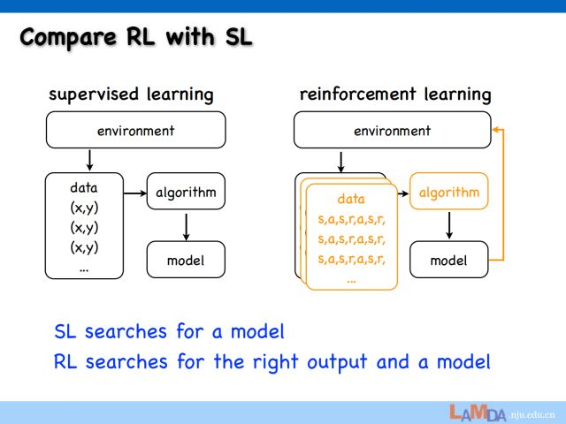

强化学习和经典的监督学习相比，有很多相似之处以及本质上的差异。对于相似之处，比如强化学习的策略模型和监督学习的分类或者预测模型看起来本身是一样的。不同之处在于它们完成的事情是不一样的，并且在监督学习中，假设数据是独立同分布的，预测数据和训练数据的分布是一致的。但在强化学习中，这个基本的假设是不成立的，因为智能体在环境里决策，这个决策会不断改变环境，从环境中收集的数据也会不断变化。

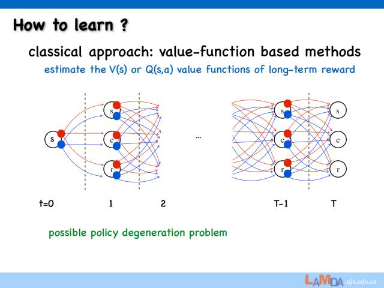

由于环境的不同，强化学习的方法也是不同于监督学习的。经典的方法有两类，第一类，是对值函数的学习。用类似于动态规划的方法求解长期的奖赏回报，然后通过估计当前状态下动作的回报值的大小做策略。传统的Q-learning等算法都属于基于值函数的算法，其学习目标是值函数。这类方法有可能存在策略退化问题，所谓策略退化，是指实际想要得到的是策略，但是学习的是值函数，而不是策略本身。特别当模型的表达能力不足时，这种现象很容易出现。

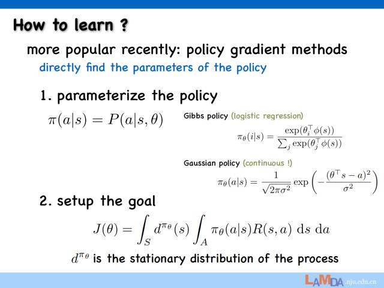

第二类，是策略梯度方法，这类方法近来更受欢迎，和现在的监督学习方法更加接近。首先将策略参数化，如果是离散输出的策略，表达出来可能和对率回归（logistic regression）差不多，我们称之为Gibbs策略，这里用线性模型来表达；如果是连续输出的策略，则采用高斯策略来表达。表达出策略后再把学习的总体目标表达出来，由于策略表达是可微的，因此目标表达也是可微的，所以可以用梯度方法来求解参数。这类方法求解目标是策略本身，因此在复杂任务上表现得相对更好。

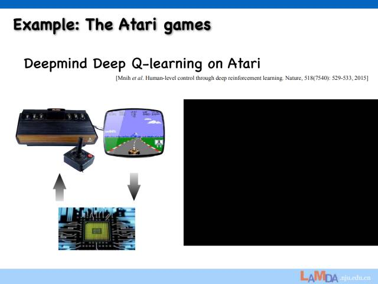

这是一些与强化学习相关的例子。从2015年Deepmind设计的deep Q-network算法开始，强化学习和深度学习更加紧密结合。深度学习在此扮演强化学习的眼睛，比如在Atari游戏上，他们以游戏屏幕像素作为卷积神经网络的输入，然后自己学习如何来操作游戏使得分值最大化，这个工作使深度强化学习备受关注。借助深度学习，强化学习处理输入的能力更强。

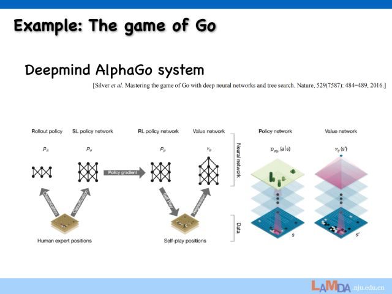

AlphaGo系统其实也用到了深度强化学习。它的策略网络是通过强化学习学出来的。之后AlphaGo Zero和AlphaZero更新的系统里面，对强化学习的强调越来越重。

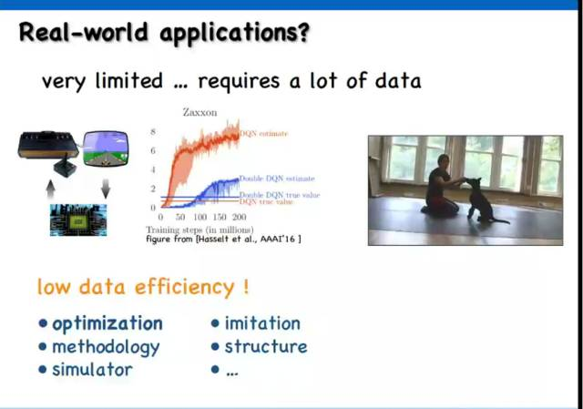

强化学习在现实社会的应用还很少，其中一个原因是目前强化学习对样本量的需求过大。以Atari游戏为例，玩这个简单的游戏需要多少样本来训练呢？从AAAI2016的Double DQN的工作中可以看出，即使对于两亿的训练数据量，其性能增长曲线还没有完全收敛。也就是说，目前的强化学习方法，无论基于值函数还是基于策略梯度，对于样本的需求量都极其大，在真实物理环境中的应用很难得到满足。作为对比，让狗听懂“趴下”需半个小时，这个过程大概有二十左右个样本，由此可见机器强化学习的学习能力目前还和生物强化学习能力有很大差距。也就是说目前强化学习方法的样本利用率很低，这种低效可能来源于优化能力、方法论等多个方面的局限。

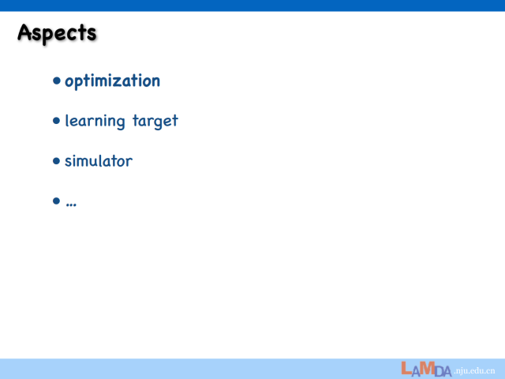

在本次报告中，我将汇报在其中三个方面的一些研究，第一个方面是关于优化的；第二个方面是目标表达；第三个方面是模拟器。

  

**optimization**

  

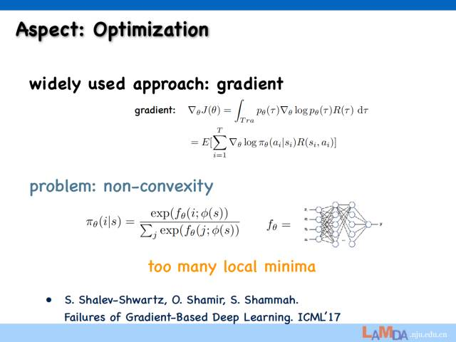

首先是关于优化的一些研究。目前强化学习的主要方法是策略梯度，也就是说优化方法依据梯度，沿着梯度方向行走，使得目标表达的总体奖赏最大。实际上，模型可能使用一个神经网络来表达，生成的策略是对模型的包裹，这个策略在优化目标里不是一步执行的，而是很多步合在一起的。i从1到T求和，也就是在环境里走T步，然后求期望才是用样本来替代。

  

强化学习面临的优化问题比传统的监督学习或者深度学习更复杂，所以我们通常认为传统强化学习面临的局部极小值问题非常严重。即使对于深度神经网络的优化，也不是那么简单的。比如ICML17的一篇文章，就阐述了现在基于梯度方法求解的深度学习的局限。而梯度方法用在强化学习上，局限性会更显著。

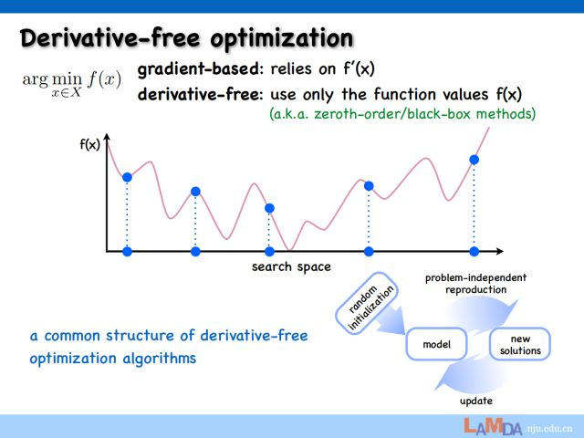

那么有没有其他不使用梯度的方法来进行优化呢？实际是有的，我们之前长期在研究非梯度的优化方法。采用基于梯度的优化方法需要对函数先求一个梯度，然后沿着梯度的正方向或者负方向前进，这是我们常用的优化方法，这类优化方法对于凸函数是很好用的，因为梯度方向指向凸函数最小值。但是当函数非常复杂时，特别是有指数多个局部最优解时，梯度方向非常随机，不再指向更好的解的方向。

  

无梯度优化的基本思想就是“采样”。我们想了解的是：函数空间中的哪一块区域有更好的解。假设上图中横轴是搜索空间，对搜索空间先进行几个采样，然后观察每个采样点上的函数值，通过函数值可以初步判断函数的分布形状（中间凹两边凸），下一步搜索就有可能在中间的区域进行进一步的采样。即使函数实际更复杂，但是采样定理能够在一定程度上保证对函数有一定理解。基于这个理解，我们设计了无梯度的优化算法，它有一个共性的结构，这个结构从随机采样开始，通过一个循环来理解每个采样的样本，并理解整体的函数，然后希望在下一轮得到更好的采样。

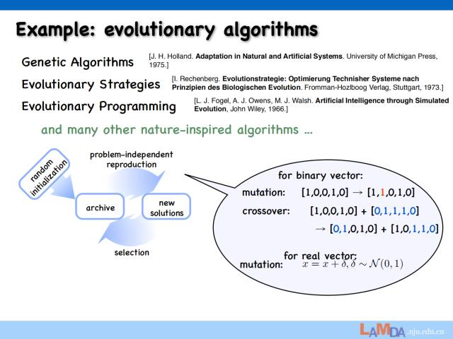

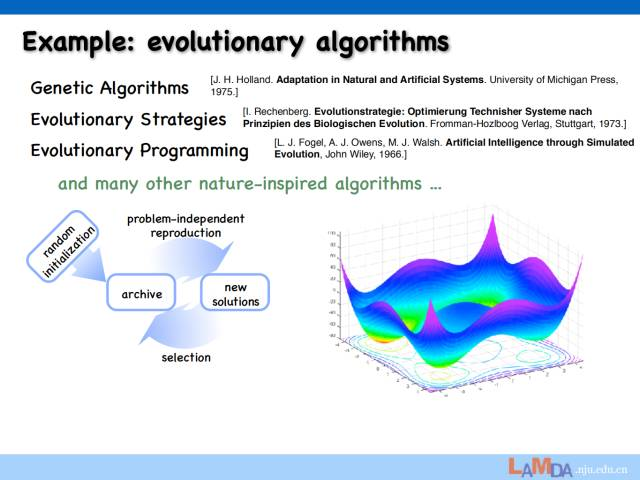

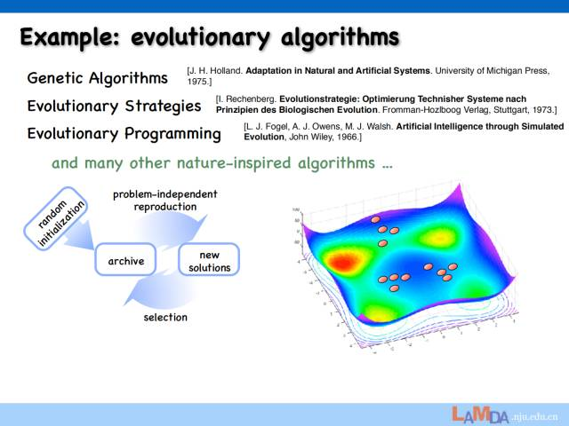

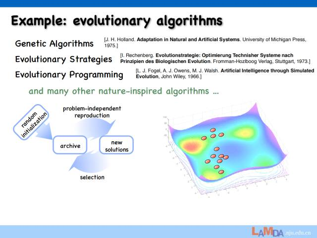

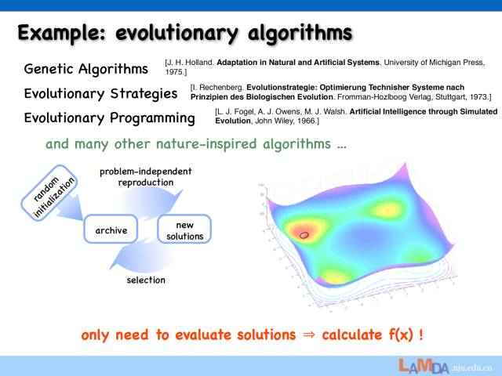

无梯度优化算法其实已有很长的历史。它的演示过程如图所示，如果有一个复杂函数，可以从初始采样开始，通过一些扰动算子生成新的解，这个扰动方法和问题是独立的，通过从新的解里面不断循环找到更好的解。整个过程只需要评估函数在某个点的值的大小，并不需要对函数求导，所以其应用范围很广。

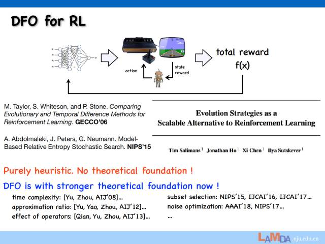

在强化学习领域，很早就有用无梯度优化方法来求解强化学习策略的工作。一个称为neuroevolution的领域，用演化方法求解神经网络参数。十多年前，就有工作对比过这种方法和经典值函数方法（比如时序差分方法）的性能，发现这类方法对于比较复杂的问题（特别是不满足马尔可夫性的问题）效果更好。同时，这类方法把待优化的神经网络或者其他模型的参数作为搜索空间，将一个采样得到的解拿到环境中去跑，得到的总体的回报值作为解的评估，这类方法不关心具体怎么跑，因此相对而言效率较低。

  

Open AI最近将evolution strategies（演化算法的一类）拿来进行强化学习模型的求解，他们发现这类算法很容易并行，所以他们用这类算法并行的版本进行求解，发现和梯度策略方法求解效果差不多，并且由于其并行性较好，使得物理时间更快。

  

这类方法优点是与问题本身的内部结构关系不大。但也有其局限，其一是效率低，其二是这类以启发式方法居多，作为优化方法缺失理论基础。机器学习是一个很关心理论基础的领域，比如最近刚刚闭幕的NIPS2017上，就对深度网络的理论性质有很多争议。

  

近几年，我们对无梯度优化算法理论性质进行了一些分析，已经可以求解这一类方法在一些问题上的时间复杂度，以及逼近最优解的能力等。

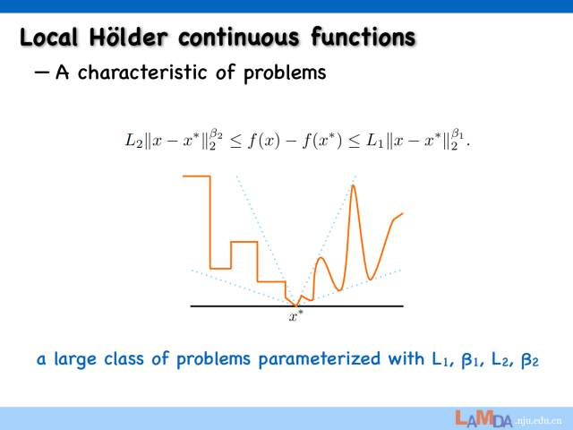

比如，我们采用local holder函数对一类问题进行刻画，这类函数可以在时域空间上或者在离散空间上，通过最优解（也就是最小值）来刻画这类函数。当偏离最优解时，通过函数值的上下界来刻画。也就是说无论函数在上下界区间里有何性质，有无穷多个局部最优解，或者不连续或者不可导，只要函数值不超过上下界，就可以用这四个常数来表示。

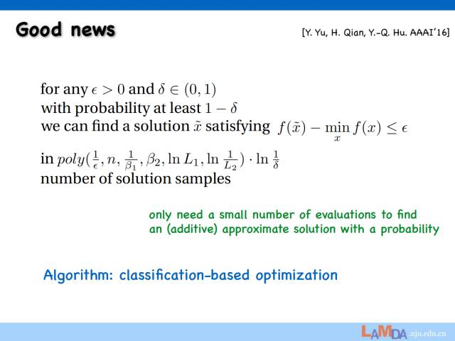

为什么对这类函数比较感兴趣呢？一方面这类函数足够复杂，从函数的形式上看，它可能和我们在真实场景中对应的优化问题是比较类似的，另一方面可以在多项式实现里逼近这类函数的全局最优解。其中一个逼近算法就是我们的一个工作——基于分类的优化算法。

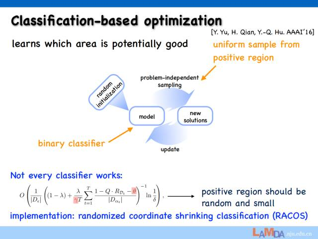

如图是基于分类的优化算法的框架，不同之处在于，这个模型是一个分类器，它将经过采样后的好样本和不好的样本分开，然后在下一轮采样时，从分类器的正类区域（也就是更有潜力的区域）里面进行采样，这是基于分类的优化算法的框架。然而并不是任何分类器在这里都能有效，从我们的分析中可以看出，这些分类器设计应该有一定的条件要求。根据此要求我们设计了一个能够高效运行的算法——RACOS算法。

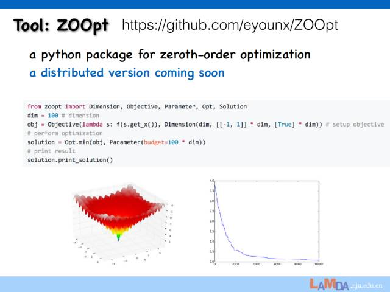

我们把这个RACOS算法实现在一个开源工具包里，单机版本已发布，大规模分布式优化版本很快就会发布。它以Python作为接口，对于一个问题的优化，使用这个包会很简单，可以看出优化曲线会逼近全局最优解。

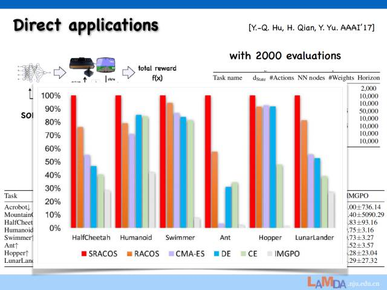

在优化工具的基础上，我们希望按照传统的思路直接优化神经网络参数得到一个比较好的结果。比如，将神经网络参数用在一些军用控制问题上，如上表所示这些问题维度并不高，以关节作为输入，还不是以像素为输入，但即便这样，数据维度也接近一万维。以往的非梯度优化方法能够求解的问题维度比较小，像贝叶斯优化维度一般不超过50维，到100维还能很好工作的就不多了。我们的工具可以做到万维左右的优化。前两列都是我们的方法，可以看出领先其他方法很多。

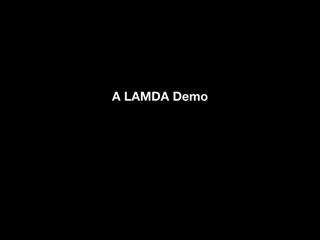

这是一个half chaser的例子。前两个是我们的方法，也是最快跑出界的，可以看出其他优化速度较慢。最后一个贝叶斯优化方法，其基本是静止的。

  

**Methodology**

  

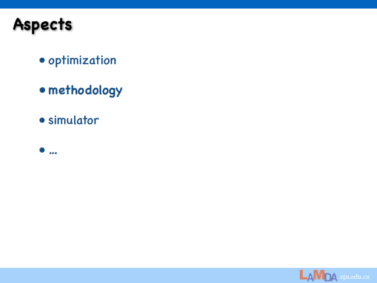

有了优化后，能不能找到更好的求解方法呢？

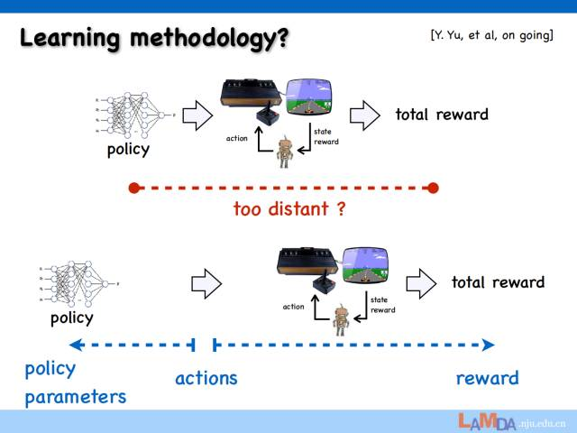

观察求解参数和策略，我们发现求解困难可能在于求解目标和求解参数的距离过长，我们要求解的是神经网络的参数（神经网络每一个连接上的权重），而目标是被赋予参数的策略在环境中工作得到的累计奖赏，这个距离远长于监督学习的距离。监督学习可以直接看到输出是什么，但是强化学习需要在环境里走很多步才能看到最终奖赏是什么，我们认为有可能优化距离太长导致优化困难。

  

能不能缩短优化距离呢？我们把优化变量移到优化过程中间，直接优化的就不是神经网络的权重而是神经网络的输出，也就是在状态上应该做哪些动作，那么这离最终奖赏的距离会更近一些，如果能够拿到状态上的动作，那么学习神经网络参数的问题就会变成监督学习的问题，状态动作两边分别的优化都会变得更容易。

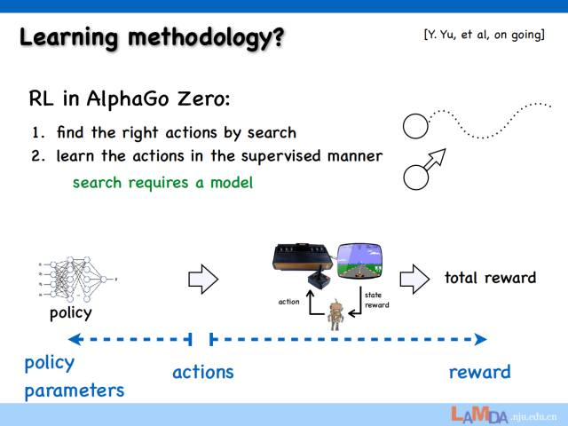

实际上，这个过程和AlphaGo Zero里面强化学习的思路比较一致，不是直接采用策略梯度的方法，而是搜索的方法，在每一个状态上直接搜索下一步较好的动作，然后结合监督学习方法使其直接适应模型。

  

但是AlphaGo面临的是很简单的围棋环境，直接可以在计算机上模拟出下一步如何转移，在更多强化学习面临的应用中，建立环境模型是很困难的，难以用搜索方法来得到状态上的动作决策。因此AlphaGo这套方法只适用于棋牌类。

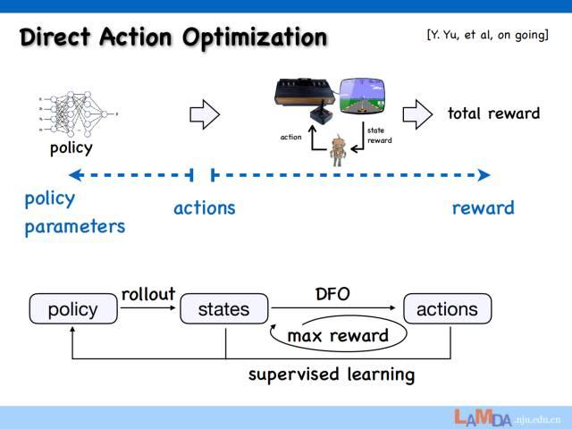

在没有环境模型的情况下如何来做动作决策呢？

  

基于非梯度优化，我们的思路是，从一个策略开始，让它跑出来一些状态，需要优化的是状态上的动作，由于没有环境模型，就不能在环境模型中模拟它的动作。这个时候我们采用非梯度优化方法在状态上赋一些动作，通过监督学习的方法得到模型，然后在环境里面测试监督学习模型的回报值。这样的循环能够使得非梯度优化实现采样（每个状态上应该做什么动作）。通过学习监督学习的模型评估采样动作的优劣，非梯度优化就能够运行起来，优化出每一个状态上的动作，由此进入下一轮的循环。由此能够在没有环境模型的情况下，做到像Alphago Zero一样强化学习的方法。

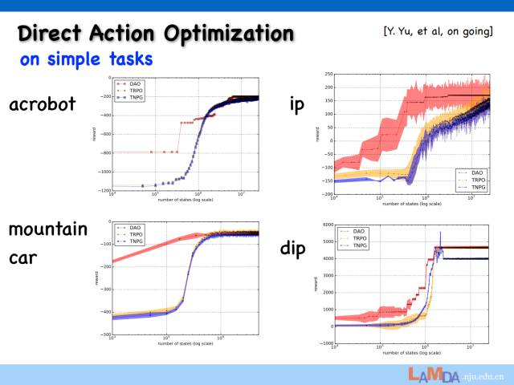

通过一些控制的实验，我们可以看到，和策略梯度的方法相比，我们的方法（红线）收敛的速度更快。

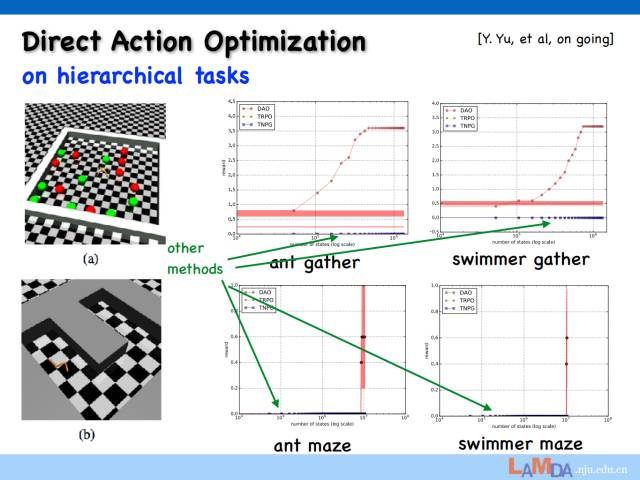

特别对于更复杂的任务，比如左边reward非常稀疏的任务。任务（a）是控制每一个关节如何动，在智能体还没有学会该如何走路的情况下，赋予它吃绿点规避红点的任务。任务（b）是控制棍子夹角的运动，平时没有奖赏，只有在出口才有奖赏。

  

对于这样复杂的问题，可以看到，我们的方法（红线）明显高于其他方法，且我们的方法不需要增加任何领域知识，可以直接找到比较好的解。可以看到如果改变学习方法，能够获得较高的效率。

  

**Simulator**

  

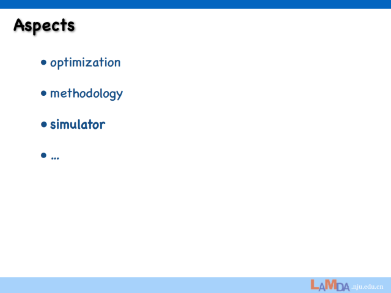

即使使用这样的思想，还需要很多样本来进行强化学习，所以在很多物理环境应用中，我们会首先构建一个模拟器。  

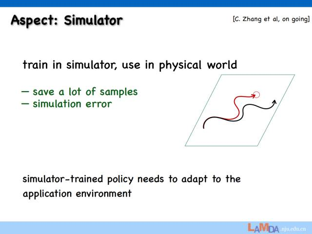

比如在很多机器人的应用上，我们都会有一个和实体机器人对应的模拟器。在模拟器上先训练好策略，然后再把它放到实体机器人上应用。如果有一个比较精确的模拟器，在模拟器上学习策略会节省大量实际开销。比较商用的模拟器已经是批量生产的机器人了，但是它的模拟器还不是很精确，在模拟器里学到的策略总会有模拟误差，哪怕误差很小，但是在强化学习中也需要做长时间决策，多步累计起来就会产生一个很大的误差，即使是比较精确的模拟器，也不能将模拟器训练的策略直接应用于物理环境中。

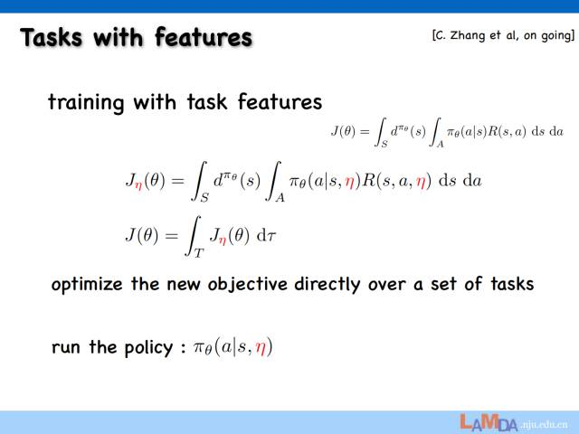

因此，我们需要将模拟器里训练的策略适应到真实环境中去。有一类比较简单的适应方法：如果能够获得每个任务的特征，就可以学一个策略，它可以用在很多任务上。所谓的任务特征是指，假设特征决定任务特性，刚才已经写出了策略梯度的目标，实际上如果想用在很多任务上，只需做一个简单的变换：策略模型不仅输入状态，而且输入任务的特征。因此对于每一个任务，有一个优化的目标，可以在一批任务上设定一批任务的联合目标，这个目标也是可导目标。策略梯度方法可以直接用在目标上面，求得可以用在多个任务上的策略。这个策略运行起来，只需要在一个具体任务上，不仅输入状态，还输入任务特征，策略就可以在这个任务上输出它要做的动作。

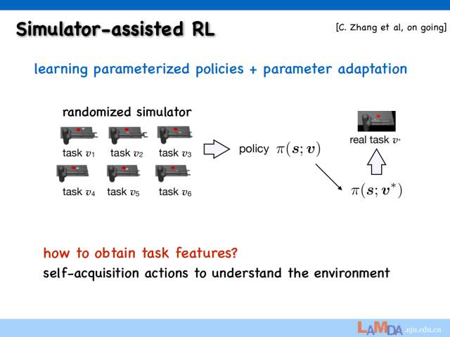

这样的方法用在模拟器上，让模拟器可以被配置，配置出很多种不同的模拟器，每个模拟器都有一个特征，通过训练一个策略，这个策略在所有模拟器上同时优化，对于真实任务，把真实任务特征放到训练好的策略里面，这个策略在真实的任务上就可以直接运行。

  

这里存在一个问题：在真实物理环境里面，并不知道环境特征到底是什么，因此没有办法把特征放到策略里。

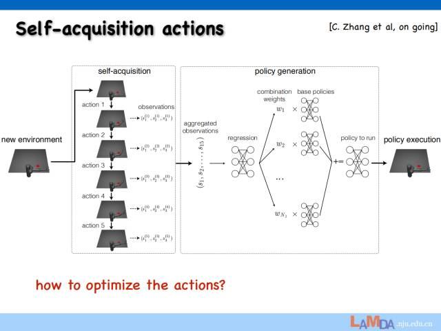

怎样获得环境特征呢？我们最近尝试了一个方法，训练一组动作，通过动作感知环境来获得环境的特征。当进入一个新的环境，执行一组Self-acquitsition的动作，观察每一个动作得到的结果，然后把结果汇总起来得到一个关于环境的探测结果，通过一个回归器将一组基策略组合起来得到针对于当前物理环境的策略，然后这个策略就可以拿到物理环境中运行。如果能做到利用较少动作就对环境进行较好探测，那么就只需在环境中采集少量样本就能高效适应环境。

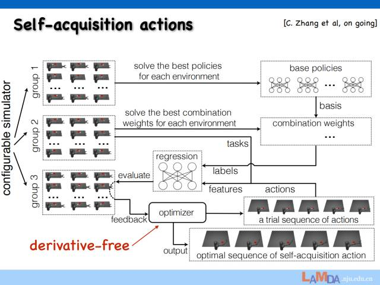

这个动作需要怎样来学呢？我们做了一个初步的工作，先从模拟器生成一组任务，然后在每个任务上找到一个最好的策略作为基策略，再找一组任务，在基策略的基础上选择一个最好的组合权重，在这个任务上组合权重。我们需要做的是寻找动作来探索最好的环境（最具有区分能力），此时我们采用优化方法生成一组动作，然后将动作拿到环境中运行，这样就得到了观测的特征。刚才解出来的用来组合基策略的权重是我们预测的对象。接下来使用一个回归器，希望利用特征最好地预测标签，再将回归器用在新的任务上评价回归器的性能，这个评价结果交给优化器进行优化。最后优化的结果就是用来探索环境的动作。这里的优化相对来说是比较复杂的，因此我们derivative-free的优化思想也刚好用在这里。

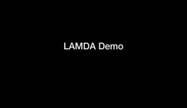

这里显示我们优化了五个self-acquisition的动作，左右手臂是不同长度的，但是智能体并不知道自己手臂的配置。做完五个动作之后，得到的观测回归到基于基策略的组合上，就可以直接地运行我们的策略。可以看到这两个配置不一样的手臂都可以顺利完成任务。在新环境里，实际只采了五个样本，如果利用强化学习从头开始训练100万个样本也是不够的，训练样本达三四百万时效果才会比较好。

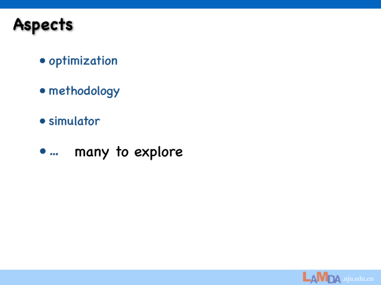

以上是我探索的一些内容，实际上对于如何提高强化学习的效率，也是一个比较长期的问题，我们还有很多方面需要探索。

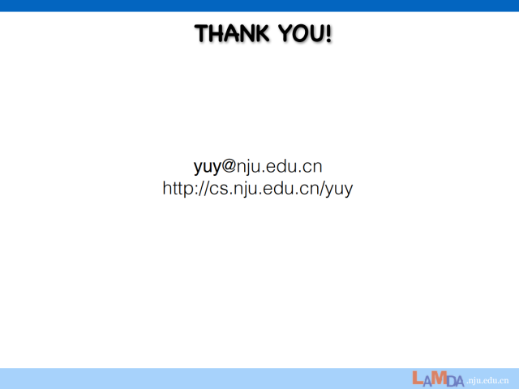

  

**文中俞老师提到的文章下载链接为：** 

**https://pan.baidu.com/s/1pKO3vq7**  

  

**致谢：**

本文主编袁基睿，诚挚感谢志愿者杨茹茵对本文进行了细致的整理工作

  

该文章属于“深度学习大讲堂”原创，如需要转载，请联系 astaryst。

  

**作者信息：  
**

  

**作者简介：**

**俞扬，**博士，南京大学副教授。主要研究领域为机器学习、强化学习、演化计算。分别于2004年和2011年获得南京大学计算机科学与技术系学士学位和博士学位，获2013年全国优秀博士学位论文奖、2011年中国计算机学会优秀博士学位论文奖。2011年8月加入南京大学计算机科学与技术系、机器学习与数据挖掘研究所（LAMDA）从事教学与科研工作。发表论文40余篇，包括多篇Artificial Intelligence、IJCAI、AAAI、NIPS等，研究成果获得5项国际论文和竞赛奖。个人主页：http://cs.nju.edu.cn/yuy

  

VALSE是视觉与学习青年学者研讨会的缩写，该研讨会致力于为计算机视觉、图像处理、模式识别与机器学习研究领域内的中国青年学者提供一个深层次学术交流的舞台。2017年4月底，VALSE2017在厦门圆满落幕，近期大讲堂将连续推出VALSE2017特刊。VALSE公众号为：VALSE，欢迎关注。

  

  

  

往期精彩回顾

  

[揭秘CVPR2017 WebVision图片分类竞赛冠军背后的技术](http://mp.weixin.qq.com/s?__biz=MzI1NTE4NTUwOQ==&mid=2650329293&idx=1&sn=7ce74a95921ff5c47e6a7211122a9137&chksm=f235b7c7c5423ed1f2a584ee275b937097ad7072c1ca9ceabdc3eeeee0f3fbecbc4a31e8ba83&scene=21#wechat_redirect)  

[山世光：AI产业需要赋能平台](http://mp.weixin.qq.com/s?__biz=MzI1NTE4NTUwOQ==&mid=2650329210&idx=1&sn=c66b85f5996ec2bc2e30ee70cc00fd75&chksm=f235b770c5423e66d9c2f7f582880968f0fbe369a0cc3c96b95f8cb9e289e138a0b80eb45777&scene=21#wechat_redirect)  

[曹汛：计算摄像学研究 | VALSE2017之十六](http://mp.weixin.qq.com/s?__biz=MzI1NTE4NTUwOQ==&mid=2650329161&idx=1&sn=3d9361a68705e76bf4e7e7edcd10e53a&chksm=f235b743c5423e5526f69ddc1acb4339546809f60742cd82bd02932d5d0240d0561d9e387107&scene=21#wechat_redirect)  

[见微知著：语义分割中的弱监督学习](http://mp.weixin.qq.com/s?__biz=MzI1NTE4NTUwOQ==&mid=2650329071&idx=1&sn=cb89e69a84ae712a3e32a1f15a88ec60&chksm=f235a8e5c54221f3dc0ad21ac551ad22bdba822548ae755f49e455c4134b4a676d3733a30a10&scene=21#wechat_redirect)  

[实录：余凯、颜水成、梅涛、张兆翔、山世光同台讨论 “深度学习的能与不能”](http://mp.weixin.qq.com/s?__biz=MzI1NTE4NTUwOQ==&mid=2650328443&idx=1&sn=78761a4f85258be3b38dd2dfd90f4de0&chksm=f235aa71c54223677f2a51177726c6204548ce3d20796e389825932c576f29b261b4581d4167&scene=21#wechat_redirect)  

  

  

欢迎关注我们！  

  

深度学习大讲堂是由中科视拓运营的高质量原创内容平台，邀请学术界、工业界一线专家撰稿，致力于推送人工智能与深度学习最新技术、产品和活动信息！

  

中科视拓（SeetaTech）将秉持“开源开放共发展”的合作思路，为企业客户提供人脸识别、计算机视觉与机器学习领域“企业研究院式”的技术、人才和知识服务，帮助企业在人工智能时代获得可自主迭代和自我学习的人工智能研发和创新能力。  

  

中科视拓目前正在招聘： 人脸识别算法研究员，深度学习算法工程师，GPU研发工程师， C++研发工程师，Python研发工程师，嵌入式视觉研发工程师，运营经理。有兴趣可以发邮件至：hr@seetatech.com，想了解更多可以访问，www.seetatech.com  

中科视拓

深度学习大讲堂

  

点击阅读原文打开中科视拓官方网站