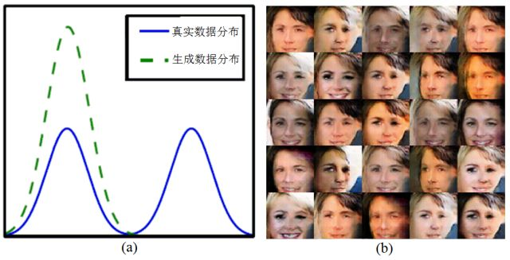
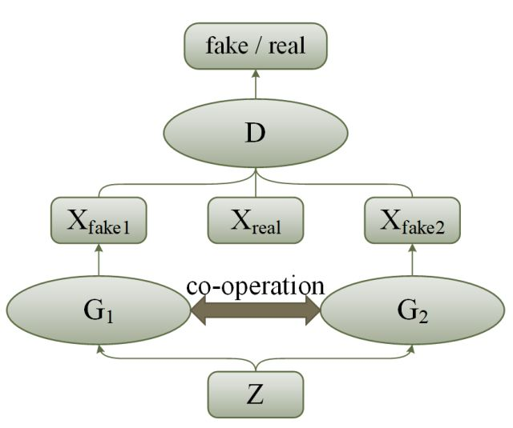
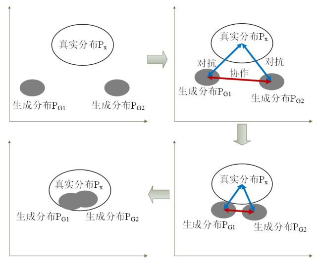
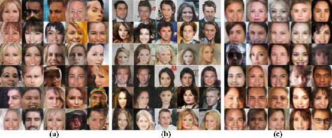

# 协作式生成对抗网络

原创 自动化学报 2018-06-22 09:00 北京

> 原文地址: [https://mp.weixin.qq.com/s/GM5PTUQDAA7wb\_\_SxiZrJg](https://mp.weixin.qq.com/s/GM5PTUQDAA7wb__SxiZrJg)

生成对抗网络（GANs）是近期机器学习的热点，通过在一对生成器与判别器之间引入“对抗”关系，使得生成器能够完好拟合真实样本的数据分布，但由于缺乏监督信息的指导, 该拟合过程充满随机性。在实际当中，受限于网络的学习能力，通常只能拟合出真实数据分布的一部分，从而导致一些模式的缺失，即模式坍塌问题(Mode collapse)。

如图1所示，模式坍塌会导致训练结果出现冗余，生成图像质量差等问题。通过对真实数据进行分析不难发现，不同模式之间存在着显著的差异，例如人脸中的男性与女性，场景中的白天与黑夜等等，同时也存在着联系，例如五官结构、物体形状、位置等等。强调差异而忽略联系，或者反之，我们认为都不算是好的解决方案，寻求两者间的平衡是解决问题的关键。

图 1 生成对抗网络中的模式坍塌问题. (a) 生成数据分布无法完好拟合真实数据分布 (b) 模式坍塌导致生成数据冗余 (重复图像过多)

由此作者设计了一种新的GANs网络结构（图2）。通过构建两个（或多个）生成器，共享输入数据以及判别器，同步进行训练，训练方法与经典GANs相同。此外生成器之间相互学习，该步骤我们称为“协作”，互为指导，共同进步。“协作”穿插在正常训练之中，速率可以根据实际情况进行调整，例如训练生成器两次，协作一次。从数据分布的角度看（图3），经典对抗式训练可以拉近真实分布与生成分布之间的距离，而协作式训练则可以拉近不同生成器生成分布之间的距离。这种做法不但可以提高模型收敛速度，而且增加生成器的数量可以增强模型的学习能力，降低模式坍塌的可能。

图 2 协作式生成对抗网络结构图

图 3 网络拟合过程

作者在多种类型的数据集上验证了网络的有效性，以下是部分实验结果，图4是在大型人脸数据集CelebA上的生成结果对比，图5是在三维数据集ModelNet40上的训练结果。

图 4 CelebA人脸数据集生成结果对比（a）DCGAN（b）MAD-GAN（c）作者提出的方法

图 5 ModelNet40数据集的训练结果

**引用格式**

张龙, 赵杰煜, 叶绪伦, 董伟. 协作式生成对抗网络. 自动化学报, 2018, 44(5): 804-810.

**作者简介**

张龙, 宁波大学博士研究生. 2008 年获得瑞典布京理工学院硕士学位. 主要研究方向为神经网络与深度学习. 

E-mail: 1401082013@nbu.edu.cn

赵杰煜, 宁波大学教授. 主要研究方向为计算机图像处理, 机器学习, 神经网络. 本文通信作者. 

E-mail: zhao\_jieyu@nbu.edu.cn

叶绪伦, 宁波大学博士研究生. 2016 年获得宁波大学硕士学位. 主要研究方向为非参聚类, 流形学习以及非负矩阵分解. 

E-mail: 1601082017@nbu.edu.cn

董伟, 宁波大学硕士研究生. 2015 年获得辽宁科技大学学士学位. 主要研究方向为神经网络, 深度学习. 

E-mail: 1511082629@nbu.edu.cn

自动化

学报

往期回顾

[一种能量函数意义下的生成式对抗网络](http://mp.weixin.qq.com/s?__biz=MzAwMzAzMDgxOA==&mid=2651063930&idx=1&sn=8fc4569fbc51adb78002a6c492a7b58f&chksm=8131cc37b646452180ad8b4be28b69e9e1767c94cf2bf8b712074d8b26e72fffd95146d9fac5&scene=21#wechat_redirect)  

[人工智能研究的新前线：生成式对抗网络](http://mp.weixin.qq.com/s?__biz=MzAwMzAzMDgxOA==&mid=2651063920&idx=1&sn=9094936d46b4bab696df49c408fa1656&chksm=8131cc3db646452b0cba9ebdee9672b9ae010166a941ef19d5972616235193048a3346cf54f0&scene=21#wechat_redirect)  

[生成式对抗网络：从生成数据到创造智能](http://mp.weixin.qq.com/s?__biz=MzAwMzAzMDgxOA==&mid=2651063870&idx=1&sn=1e1d7562a4bbe4c31e2fdef4859c0bc4&chksm=8131cc73b6464565d9419524cd87b4bbe363384f0ba722017e91a49af4640d349403ea9a0ea6&scene=21#wechat_redirect)  

欢迎扫描二维码、长按图片识别关注《自动化学报》中文版订阅号aas1963，服务号自动化学报和英文版服务号！

JAS《自动化学报》（英文版）

自动化学报服务号

自动化学报订阅号

  

联系我们

Tel:  010-82544653（日常咨询和稿件处理） 

        010-82544677（录用后稿件处理）

Fax: 010-82544497

Email: aas@ia.ac.cn（日常咨询和稿件处理）

          aas\_editor@ia.ac.cn（录用后稿件处理）

http://www.aas.net.cn

点击阅读原文，了解更多精彩内容