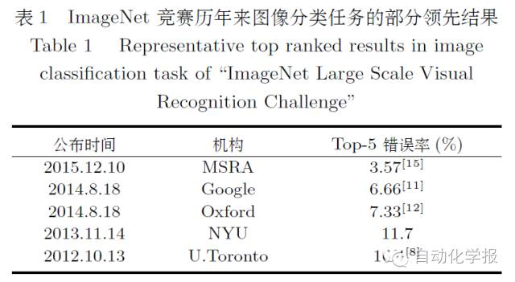
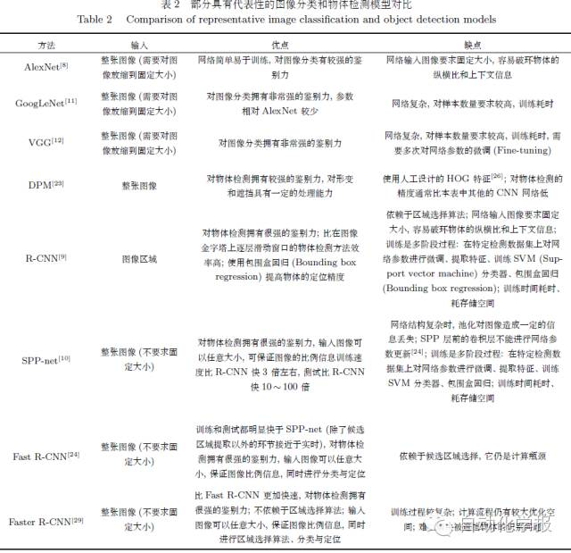
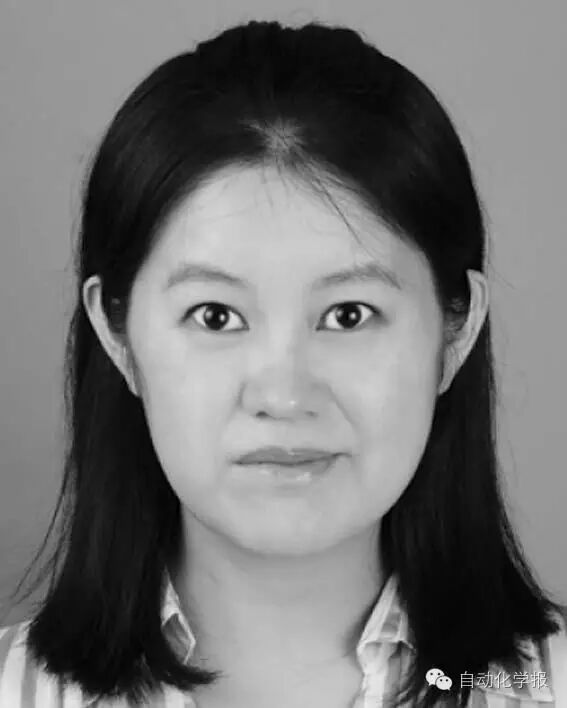
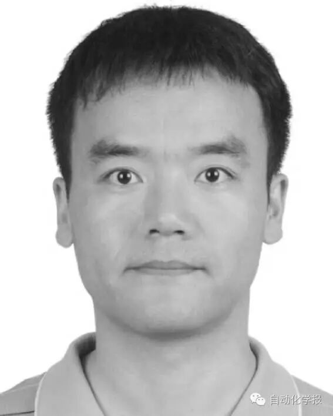
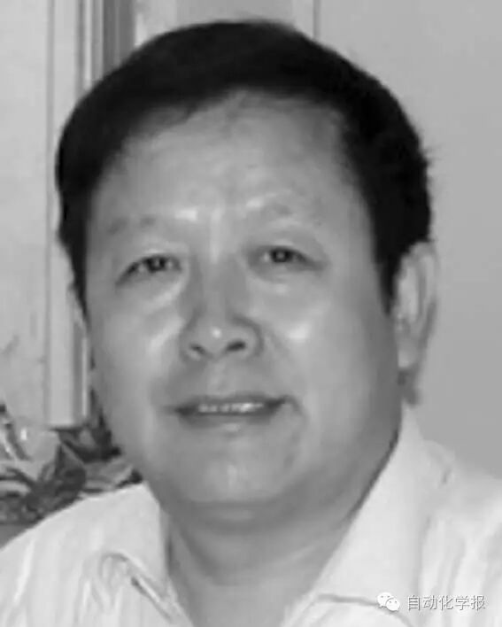
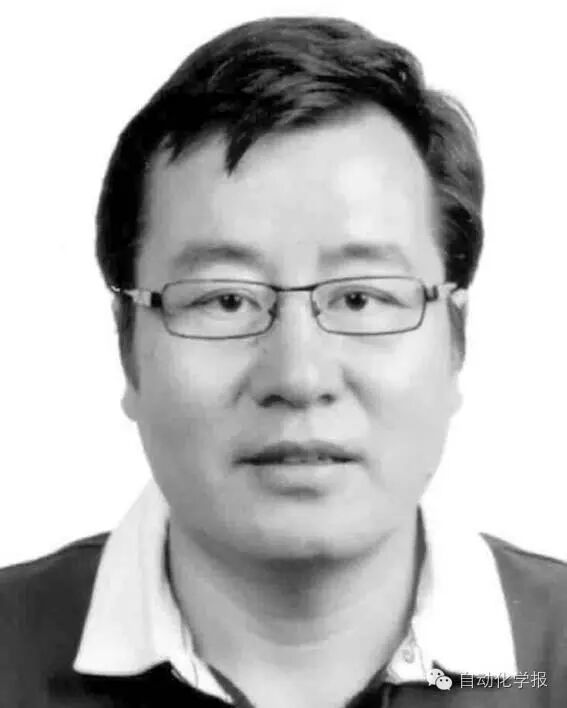
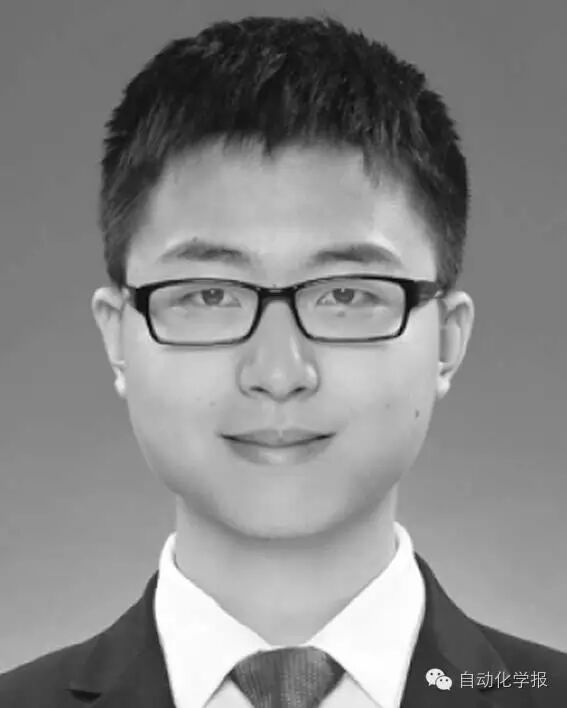
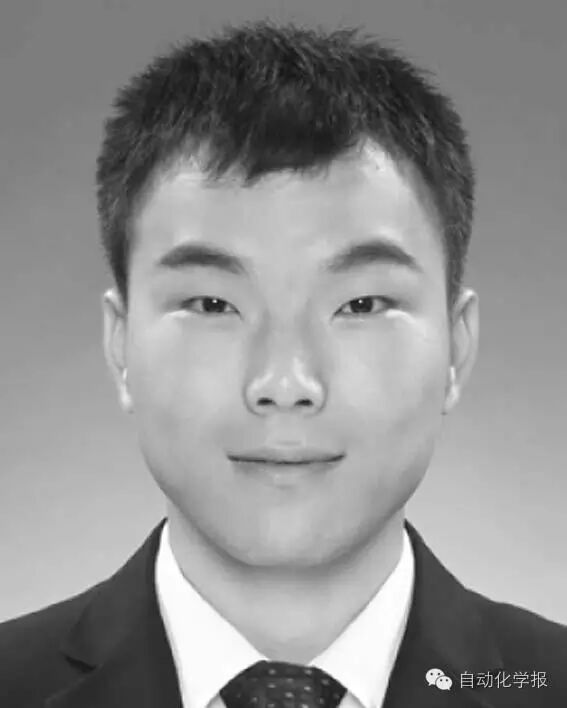
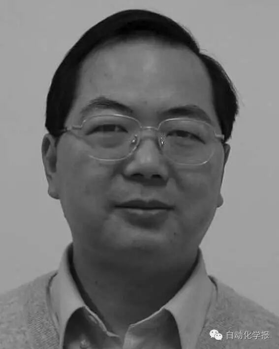

# 图像理解中的卷积神经网络

原创 自动化学报 2016-10-09 18:48 北京

> 原文地址: [https://mp.weixin.qq.com/s/NzeZeZ1-BS6joqO-RsCpVg](https://mp.weixin.qq.com/s/NzeZeZ1-BS6joqO-RsCpVg)

本文综述了卷积神经网络在图像理解中的研究进展与典型应用. 首先,阐述卷积神经网络的基础理论; 然后, 阐述其在图像理解的具体方面, 如图像分类与物体检测、人脸识别和场景的语义分割等的研究进展与应用.

近年来, 卷积神经网络(Convolutional neural networks, CNN) 已在图像理解领域得到了广泛的应用, 引起了研究者的关注. 特别是随着大规模图像数据的产生以及计算机硬件(特别是GPU) 的飞速发展, 卷积神经网络以及其改进方法在图像理解中取得了突破性的成果, 引发了研究的热潮. 卷积神经网络(Convolutional neural networks, CNN) 是一种带有卷积结构的深度神经网络, 卷积结构可以减少深层网络占用的内存量, 也可以减少网络的参数个数, 缓解模型的过拟合问题. 1989 年, LeCun 等在手写数字识别中采用神经网络误差反向传播算法, 在网络结构设计中加入下采样(Undersampling) 与权值共享(Weight sharing). 1998 年, LeCun 等提出用于文档识别的卷积神经网络, 为了保证一定程度的平移、尺度、畸变不变性, CNN 设计了局部感受野、共享权重和空间或时间下采样, 提出用于字符识别的卷积神经网络LeNet-5. LeNet-5 由卷积层、下采样层、全连接层构成, 该系统在小规模手写数字识别中取得了较好的结果. 2012 年, Krizhevsky 等采用称为AlexNet 的CNN 在ImageNet 竞赛图像分类任务中取得了最好的成绩, 是CNN 在大规模图像分类中的巨大成功. AlexNet 网络具有更深层的结构, 并设计了ReLU (Rectified linear unit) 作为非线性激活函数以及Dropout 来避免过拟合. 表1 是ImageNet 竞赛历年来图像分类任务的部分领先结果. 在AlexNet 之后, 研究者又进一步改善网络性能, 提出能有效分类检测的R-CNN (Region-based CNN)、SPP (Spatial pyramid pooling)-net、GoogLeNet、VGG等. 为了更好地改进卷积神经网络, 使其在应用中发挥更大的功效, 研究者不仅从应用的特殊性、网络的结构等方面进一步探讨卷积神经网络, 而且从其中的网络层设计、损失函数的设计、激活函数、正则项等多方面对现有网络进行改进, 取得了一系列成果.

计算机视觉的中心任务就是通过对图像或图像序列的分析, 得到景物的尽可能完全正确的描述. 图像理解与计算机视觉紧密相关, 研究内容交叉重合, 图像理解侧重在图像分析的基础上, 理解图像内容的含义以及解释原来的客观场景, 从而指导和规划行动. 图像理解是深度学习应用最早的领域, 也是其应用最广的领域之一. 随着互联网大数据的兴起, 深度学习在大规模图像的处理中显示了不可替代的优越性. 卷积神经网络的研究已经在图像理解中广泛应用. 本文着重阐述卷积神经网络的理论和面向图像理解几个不同方面的卷积神经网络的提出、进展和应用, 包括: 图像分类和物体检测(表2给出部分具有代表性的图像分类和物体检测模型对比)、人脸识别和验证、场景的语义分割和深度恢复、人体关节检测, 通过这些介绍希望能帮助读者了解相关工作的方法和思路并启发新的研究思路.

卷积神经网络虽然在一些数据上, 如ImageNet 上取得了成功, 但是如何针对实际特定问题、特定图像训练库设计更有效的网络结构, 融合问题先验信息、从理论和应用上评估网络性能等都是需要深入研究的问题. 我们觉得可能的研究方向有:

1) 卷积神经网络将卷积、池化与神经网络结合,有效地利用了图像的结构信息. 进一步, 如何有效利用领域知识, 改进网络结构来获取视觉上的不变性值得引起关注;

2) 在理论上, 如何在算法中利用深度模型的选择性、稀疏性, 如何设计算法保证收敛性;

3) 如何针对更大规模数据、更深结构网络设计高效的数值优化、并行计算方法和平台.

引用格式

常亮, 邓小明, 周明全, 武仲科, 袁野, 杨硕, 王宏安. 图像理解中的卷积神经网络. 自动化学报, 2016, 42(9): 1300-1312

作者简介

常亮 北京师范大学信息科学与技术学院副教授. 主要研究方向为计算机视觉与机器学习.

E-mail: changliang@bnu.edu.cn

邓小明 中国科学院软件研究所副研究员. 主要研究方向为计算机视觉. 本文通信作者. 

E-mail: xiaoming@iscas.ac.cn

周明全 北京师范大学信息科学与技术学院教授. 主要研究方向为计算机可视化技术, 虚拟现实.

E-mail: mqzhou@bnu.edu.cn

  

武仲科 北京师范大学信息科学与技术学院教授. 主要研究方向为计算机图形学, 计算机辅助几何设计, 计算机动画,虚拟现实. 

E-mail: zwu@bnu.edu.cn

袁野 中国科学院软件研究所硕士研究生. 主要研究方向为计算机视觉.

E-mail: yuanye13@mails.ucas.ac.cn

杨硕 中国科学院软件研究所硕士研究生. 主要研究方向为计算机视觉.

E-mail: yangshuo114@mails.ucas.ac.cn

王宏安 中国科学院软件研究所研究员.主要研究方向为实时智能, 自然人机交互. 

E-mail: hongan@iscas.ac.cn

欢迎扫描二维码、长按图片识别关注《自动化学报》中文版订阅号aas1963，服务号自动化学报和英文版服务号！

