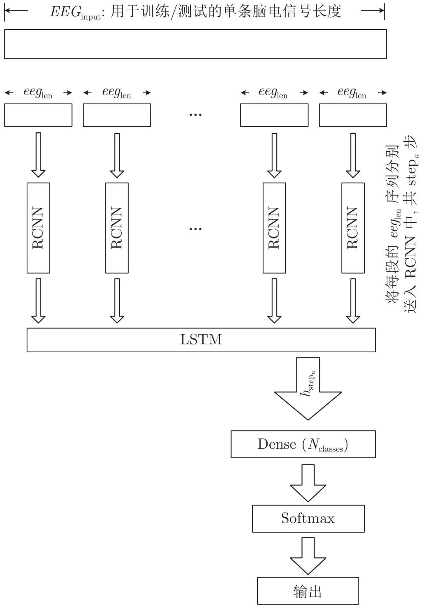
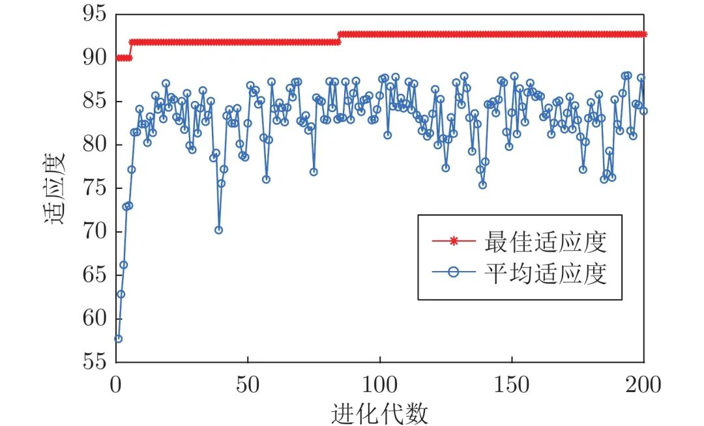
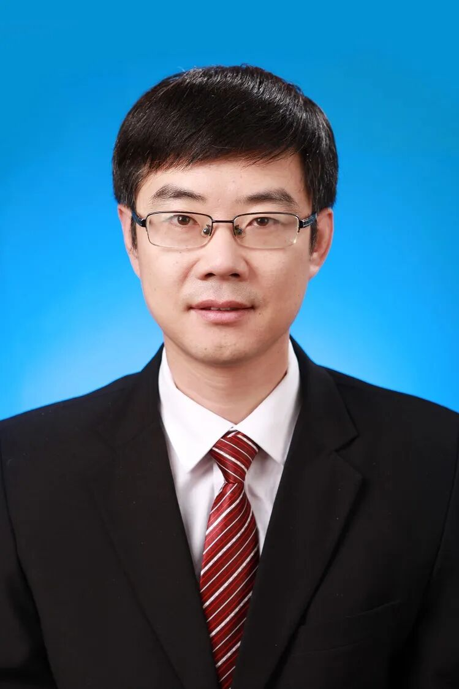
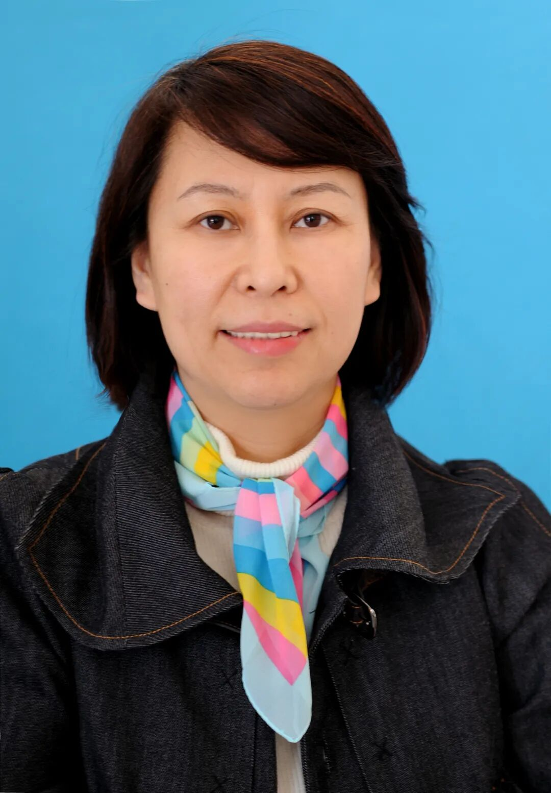

# 基于RCNN-LSTM的脑电情感识别研究

原创 自动化学报 自动化学报 2022-03-16 16:41 北京

> 原文地址: [https://mp.weixin.qq.com/s/4maCvsrR9hLi4INPqdd94w](https://mp.weixin.qq.com/s/4maCvsrR9hLi4INPqdd94w)

**点击蓝字 关注我们**

  

**引****用本文**

  

柳长源, 李文强, 毕晓君. 基于RCNN-LSTM的脑电情感识别研究. 自动化学报, 2022, 48(3): 917−925 doi: 10.16383/j.aas.c190357

Liu Chang-Yuan, Li Wen-Qiang, Bi Xiao-Jun. Research on EEG emotion recognition based on RCNN-LSTM. Acta Automatica Sinica, 2022, 48(3): 917−925 doi: 10.16383/j.aas.c190357  

http://www.aas.net.cn/cn/article/doi/10.16383/j.aas.c190357?viewType=HTML

  

**文章简介**

  

**关键词**

  

脑电信号, 情感识别, 循环卷积神经网络, 长短期记忆神经网络

  

**摘   要**

  

情感作为人脑的高级功能, 对人们的个性特征和心理健康有很大的影响, 利用网上公开的脑电情感数据库(DEAP (Database for emotion analysis using physiological signals)数据库), 根据心理效价和激励唤醒度等级进行情感划分, 对压力和平静等5种情感进行研究分析. 针对脑电信号时空特征结合的特点, 把深度学习中的卷积神经网络(Convolutional neural network, CNN)和长短期记忆网络(Long short term memory, LSTM)两者作为基本前提, 并在此基础之上设计了一个RCNN-LSTM的脑电情感信号分类模型. 利用循环卷积神经网络(Recurrent convolutional neural network, RCNN)自动提取脑电信号中的抽象特征, 省去了人工选择与降维的过程, 然后结合LSTM网络对脑电情感信号进行分类识别. 实验结果表明, 利用该方法对5种情感类别的平均分类识别率达到了96.63%, 证明了该方法的有效性.

  

**引   言**

  

情感在人们的理性行为和日常生活中起着重要作用, 与我们息息相关. 通过情感的识别, 我们可以去看一些患有自闭症和抑郁症的儿童, 为他们提供心理咨询与辅导, 这不仅能够更好地促进人们之间的交流, 在人机交互的应用中也具有重要意义, 这是一个涉及现代医学心理学领域、计算机领域和人工智能等众多领域内的重要研究课题.

  

目前, 对于情感分析的分类方法已有一定的规模, 一般我们在研究过程中经常使用的方式就是在研究生理特点的基础之上对人的各种情感差异进行对比分析, 例如通过人的面部表情、行为动作和语音语调等外部生理特征来进行情感分析, 但是这种研究方法易导致情感识别的精度有所下降. 因为人的面部表情、声音等又容易受到自己的主观控制, 与这些外在表现出来的生理信号特征相比, 脑电信号存在于人们的中枢神经系统中, 能够体现出不同时刻的差异, 因此, 与情感的关联性远远超过其他信号. 基于脑电信号的情感识别有着非常广阔的应用前景和研究价值, 越来越多的科研人员投入到了这项工作中. Krisnandhka等提取了脑电信号的小波能量, 并计算出其相对利用率作为最后的脑电特征进行情感识别, 达到了76%的情感识别率. Duan等对常见的正向情感和和负向情感做了二分类, 提出采用脑电信号的差分熵作为脑电特征, 准确率达到了83.28%. Murugappan等利用三种不同的“db8”,“sym8”和“coif5”小波基函数来提取脑电信号的统计特征, 对常见的快乐、惊讶、恐惧、厌恶和中性情绪进行分类识别, 最大平均准确率达到了83.04%. 黄柠檬基于共同空间模式(Common patial pattern, CSP)算法对脑电信号中的多种特征进行选择与融合, 分类识别率为80.5%. 杨默涵等利用总体经验模态分解(Ensemble empirical mode decomposition, EEMD)和希尔伯特变换提取了边际谱和瞬时能量作为脑电特征, 利用线性判别分类器(Linear discriminant analysis, LDA)对脑电信号进行分类, 平均识别率为 82.74%. Zhang等提出了利用变分模态分解(Variational mode decomposition, VMD)和自回归(Auto regressive, AR)相结合的方法进行脑电特征提取, 并采用随机森林分类器处理三分类任务, 取得了不错的效果. 另外, 也有研究者通过非线性动力学特征对脑电情感信号进行了分析, 孙颖等利用功率谱熵和非线性全局特征相结合构造出脑电情感特征, 采用支持向量机对脑电情感进行四分类, 平均识别率达到了86.42%. 但是, 上述文献中的这些脑电特征都是依据经验进行设计手动提取的特征, 所得到的脑电特征的质量得不到保证且容易出现特征丢失. 利用传统的分类方法支持向量机, 随机森林和LDA 等进行情感识别时, 这些算法的分类结果很大程度上依赖于特征质量, 且泛化性不强. 所以, 构造出一个能够自动提取情感特征和进行分类的模型是提高脑电情感分类识别率的关键.

  

深度学习(Deep learning, DL)作为机器学习领域的一个重要分支, 其目标是创造一个模仿人脑学习的网络. 与传统机器学习方法相比, 其省去了手动提取特征的环节, 通过半监督或者无监督的方式来满足特征自动提取的需要, 为数据的高级别抽象表示提供了可能. 如今, 深度学习在语音识别、图像识别等领域中都得到一定程度的运用, 并且为这些领域的发展做出了一定的贡献. 由于深度学习具有自动学习提取样本抽象特征的能力, 避免了特征选择与降维的过程, 在情感识别方面, Jirayucharoensak等应用堆叠自编码器(Stack autoencoder, SAE)方法建立情感识别模型, 除此之外, 并与一些我们传统使用的分类计算方式支持向量机(Support vector machine, SVM)、朴素贝叶斯(Naive Bayesian, NB)等进行对比分析, 以此验证了深度网络的优越性. 杨豪等采用深度信念网络(Deep belief network, DBN)来识别三种脑电情感状态, 平均准确率达到89.12%, 但是DBN训练所需的时间较长, 且训练过程中易产生冗余特性. Cheng等利用深度卷积神经网络对脑电情感进行分类识别, 但是随着情感分类类别数的增加准确率出现下降, 此时体现出单一卷积神经网络(Convolutional neural network, CNN)模型的局限性. 此后, Wang等引入了3D-CNN对脑电信号进行情感识别, 唤醒度和效价的分类准确率分别为73.3%和72.1%, 但是识别脑电信号时所需的时间较长, 因为在识别前, 需要将一维的脑电信号转成三维数据形式. 阚威等利用LSTM网络对脑电情感信号进行二分类, 愉悦度分类的准确率为73.5%, 唤醒度的分类准确率为73.87%. 把脑电时序信号的各个时间点直接输入长短期记忆网络(Long short term memory, LSTM)中, 并没有达到理想的分类结果, 主要原因可能是将脑电信号的时序信息直接输入LSTM网络并不能获得与情感相关的空间频率信息特征. 在脑电情感信号处理时, 前后的关联和表征能力仍有不足之处. 所以, 有必要在LSTM的前层嫁接一个合适的用于提取脑电情感特征的神经网络结构.

  

因此, 本文采用深度学习中的卷积神经网络CNN和长短期记忆网络LSTM为基础, 设计了RCNN-LSTM混合深度学习模型来提高脑电情感信号的识别率, 首先, 改进传统的CNN模型, 利用循环卷积神经网络(Recurrent convolutional neural network, RCNN)来提取脑电信号特征, 以充分挖掘脑电信号的内在情感信息, 再结合LSTM对时序特征信息的融合与建模, 使其综合考虑了脑电信号的时间和空间特性, 更全面地保留了脑电信号的抽象和深层特征, 通过对最后实验结果的评估, 证明了RCNN-LSTM模型的有效性.

  

图 5  RCNN-LSTM结构示意图

  

图 6  GA-SVM的适应度曲线

  

请点击左下角“**阅读原文**”了解更多！

  

**作者简介**

**柳长源**

哈尔滨理工大学测控技术与通信工程学院副教授. 主要研究方向为机器学习方法研究与改进, 智能优化算法及脑电信号智能诊断技术.

E-mail: liuchangyuan@hrbust.edu.cn

**李文强**

哈尔滨理工大学测控技术与通信工程学院硕士研究生. 主要研究方向为深度学习与情感识别. 本文通信作者.

E-mail: lwqpost@163.com

**毕晓君**

哈尔滨工程大学信息与通信工程学院教授, 中国人工智能学会自然计算专委会成员, 黑龙江省生物医学工程学会常务副理事长. 主要研究方向为信息智能处理技术, 深度学习及智能优化算法.

E-mail: bixiaojun@hrbeu.edu.cn

  

**相关文章**

**（请向上滑动阅读）**

  

\[1\]  牟永强, 范宝杰, 孙超, 严蕤, 郭怡适. 面向精准价格牌识别的多任务循环神经网络. 自动化学报, 2022, 48(2): 608-614. doi: 10.16383/j.aas.c190633

http://www.aas.net.cn/cn/article/doi/10.16383/j.aas.c190633?viewType=HTML

  

\[2\]  司念文, 张文林, 屈丹, 罗向阳, 常禾雨, 牛铜. 卷积神经网络表征可视化研究综述. 自动化学报. doi: 10.16383/j.aas.c200554

http://www.aas.net.cn/cn/article/doi/10.16383/j.aas.c200554?viewType=HTML

  

\[3\]  王亚朝, 赵伟, 徐海洋, 刘建业. 基于多阶段注意力机制的多种导航传感器故障识别研究. 自动化学报, 2021, 47(12): 2784-2790. doi: 10.16383/j.aas.c190435

http://www.aas.net.cn/cn/article/doi/10.16383/j.aas.c190435?viewType=HTML

  

\[4\]  林景栋, 吴欣怡, 柴毅, 尹宏鹏. 卷积神经网络结构优化综述. 自动化学报, 2020, 46(1): 24-37. doi: 10.16383/j.aas.c180275

http://www.aas.net.cn/cn/article/doi/10.16383/j.aas.c180275?viewType=HTML

  

\[5\]  孟琭, 孙霄宇, 赵滨, 李楠. 基于卷积神经网络的铁轨路牌识别方法. 自动化学报, 2020, 46(3): 518-530. doi: 10.16383/j.aas.c190182

http://www.aas.net.cn/cn/article/doi/10.16383/j.aas.c190182?viewType=HTML

  

\[6\]  张宪法, 郝矿荣, 陈磊. 免疫多域特征融合的多核学习SVM运动想象脑电信号分类. 自动化学报, 2020, 46(11): 2417-2426. doi: 10.16383/j.aas.c180247

http://www.aas.net.cn/cn/article/doi/10.16383/j.aas.c180247?viewType=HTML

  

\[7\]  刘嘉敏, 苏远歧, 魏平, 刘跃虎. 基于长短记忆与信息注意的视频-脑电交互协同情感识别. 自动化学报, 2020, 46(10): 2137-2147. doi: 10.16383/j.aas.c180107

http://www.aas.net.cn/cn/article/doi/10.16383/j.aas.c180107?viewType=HTML

  

\[8\]  孙小棋, 李昕, 蔡二娟, 康健楠. 改进模糊熵算法及其在孤独症儿童脑电分析中的应用. 自动化学报, 2018, 44(9): 1672-1678. doi: 10.16383/j.aas.2018.c170334

http://www.aas.net.cn/cn/article/doi/10.16383/j.aas.2018.c170334?viewType=HTML

  

\[9\]  李霞, 卢官明, 闫静杰, 张正言. 多模态维度情感预测综述. 自动化学报, 2018, 44(12): 2142-2159. doi: 10.16383/j.aas.2018.c170644

http://www.aas.net.cn/cn/article/doi/10.16383/j.aas.2018.c170644?viewType=HTML

  

\[10\]  张毅, 尹春林, 蔡军, 罗久飞. Bagging RCSP脑电特征提取算法. 自动化学报, 2017, 43(11): 2044-2050. doi: 10.16383/j.aas.2017.c160094

http://www.aas.net.cn/cn/article/doi/10.16383/j.aas.2017.c160094?viewType=HTML

  

\[11\]  刘志勇, 孙金玮, 卜宪庚. 单通道脑电信号眼电伪迹去除算法研究. 自动化学报, 2017, 43(10): 1726-1735. doi: 10.16383/j.aas.2017.c160191

http://www.aas.net.cn/cn/article/doi/10.16383/j.aas.2017.c160191?viewType=HTML

  

\[12\]  杨默涵, 陈万忠, 李明阳. 基于总体经验模态分解的多类特征的运动想象脑电识别方法研究. 自动化学报, 2017, 43(5): 743-752. doi: 10.16383/j.aas.2017.c160175

http://www.aas.net.cn/cn/article/doi/10.16383/j.aas.2017.c160175?viewType=HTML

  

\[13\]  刘明, 李国军, 郝华青, 侯增广, 刘秀玲. 基于卷积神经网络的T波形态分类. 自动化学报, 2016, 42(9): 1339-1346. doi: 10.16383/j.aas.2016.c150817

http://www.aas.net.cn/cn/article/doi/10.16383/j.aas.2016.c150817?viewType=HTML

  

\[14\]  常亮, 邓小明, 周明全, 武仲科, 袁野, 杨硕, 王宏安. 图像理解中的卷积神经网络. 自动化学报, 2016, 42(9): 1300-1312. doi: 10.16383/j.aas.2016.c150800

http://www.aas.net.cn/cn/article/doi/10.16383/j.aas.2016.c150800?viewType=HTML

  

\[15\]  孙晓, 潘汀, 任福继. 基于ROI-KNN卷积神经网络的面部表情识别. 自动化学报, 2016, 42(6): 883-891. doi: 10.16383/j.aas.2016.c150638

http://www.aas.net.cn/cn/article/doi/10.16383/j.aas.2016.c150638?viewType=HTML

  

\[16\]  王金甲, 陈春. 分层向量自回归的多通道脑电信号的特征提取研究. 自动化学报, 2016, 42(8): 1215-1226. doi: 10.16383/j.aas.2016.c150461

http://www.aas.net.cn/cn/article/doi/10.16383/j.aas.2016.c150461?viewType=HTML

  

\[17\]  王行愚, 金晶, 张宇, 王蓓. 脑控: 基于脑——机接口的人机融合控制. 自动化学报, 2013, 39(3): 208-221. doi: 10.3724/SP.J.1004.2013.00208

http://www.aas.net.cn/cn/article/doi/10.3724/SP.J.1004.2013.00208?viewType=HTML

  

\[18\]  赵力, 王治平, 卢韦, 邹采荣, 吴镇扬. 全局和时序结构特征并用的语音信号情感特征识别方法. 自动化学报, 2004, 30(3): 423-429.

http://www.aas.net.cn/cn/article/id/16342?viewType=HTML

  

\[19\]  王晓蒲, 霍剑青, 刘同怀. 用相关卷积运算提取特征信息的神经网络对手写数字的识别方法. 自动化学报, 1996, 22(1): 123-125.

http://www.aas.net.cn/cn/article/id/17196?viewType=HTML

  

\[20\]  张承福, 赵刚. 联想记忆神经网络的训练. 自动化学报, 1995, 21(6): 641-648.

http://www.aas.net.cn/cn/article/id/17205?viewType=HTML

  

  

**近期文章**

[直播回放分享 | 陈关荣教授：探索最优同步网络的拓扑结构](http://mp.weixin.qq.com/s?__biz=MzIxMjA5Njg2Nw==&mid=2649061608&idx=1&sn=1500a81260d8f5127b7cb7767c759fba&chksm=8f5a9ae4b82d13f201b714d8e96af9bbddf442bb7e10c97416fb925ab2170c05fa12010fb1d1&scene=21#wechat_redirect)

[人生跑马灯？人类首次同步测量大脑濒死状态](http://mp.weixin.qq.com/s?__biz=MzAwMzAzMDgxOA==&mid=2651074149&idx=2&sn=60d48feaa01d160092c19a91e1314db7&chksm=8131e428b6466d3e1e8f835c506ae7faf61e8b66d94fc1dd027a089e075f82078ce5422a0a13&scene=21#wechat_redirect)

[自动化学报（英文版）和自动化学报入选计算领域高质量科技期刊T1类](http://mp.weixin.qq.com/s?__biz=MzAwMzAzMDgxOA==&mid=2651073859&idx=2&sn=7a9192717637dcf6cddb39ed961e8c3b&chksm=8131e70eb6466e188a123c504bdeba80c75681de4762f8685b3bf584bc33eb12362c70613b4e&scene=21#wechat_redirect)

[AI黑科技：马赛克加密被破解了！](http://mp.weixin.qq.com/s?__biz=MzAwMzAzMDgxOA==&mid=2651073824&idx=2&sn=0c15fef01cd893210bef1cceece5d49d&chksm=8131e76db6466e7b1c78884be8517733101cbe37b5a2fd95f4d4df6b569956c0dc5598435eb4&scene=21#wechat_redirect)

[Nature：当AI学会控制核聚变反应堆](http://mp.weixin.qq.com/s?__biz=MzAwMzAzMDgxOA==&mid=2651073629&idx=2&sn=b298f9f715cc9a6a38a54f36aea98171&chksm=8131e610b6466f06072ffe4dcfb213dde209f893bd3071cd4cbca8ba9a6484334028a3aae92a&scene=21#wechat_redirect)

[《自动化学报》编辑部防诈骗公告](http://mp.weixin.qq.com/s?__biz=MzAwMzAzMDgxOA==&mid=2651073517&idx=1&sn=c52de7c685e546af9faffc0cefab1c85&chksm=8131e1a0b64668b63ebaa68ea81cbaec3b94dc52ea8360821a0a49e67ae7e4b428a25d0f19c5&scene=21#wechat_redirect)

[中国科学院自动化研究所“海外优青”项目招聘启事](http://mp.weixin.qq.com/s?__biz=MzAwMzAzMDgxOA==&mid=2651073629&idx=3&sn=704a900c277b3224dfa9745d2ccc8c24&chksm=8131e610b6466f06329a900636c1bf894d6a890b89d114bbd9faf5f9a8132a73a228e7c3aeac&scene=21#wechat_redirect)

[“诺奖风向标”斯隆奖2022名单出炉！27位华人学者入选](http://mp.weixin.qq.com/s?__biz=MzAwMzAzMDgxOA==&mid=2651073517&idx=2&sn=5ed3a30328a9f41bd43999c1592469b8&chksm=8131e1a0b64668b687601773f8d9d6960344a59a62e83dede480b768fad7375bc5329cfcebdc&scene=21#wechat_redirect)

[Nature封面：人类又输给了AI，赛车AI击败人类顶级车手！](http://mp.weixin.qq.com/s?__biz=MzAwMzAzMDgxOA==&mid=2651073362&idx=2&sn=e9a5d620fd2afa6af2c13d9c695e54a7&chksm=8131e11fb64668099fa52873d8df2f3a91c3244972da7d10cbf7c234c8b95b70954e1f2affab&scene=21#wechat_redirect)

  

**热点文章**

[《自动化学报》2019年高关注论文](http://mp.weixin.qq.com/s?__biz=MzAwMzAzMDgxOA==&mid=2651073450&idx=1&sn=6f57bd0df73f259aa416575f1f69bdfb&chksm=8131e1e7b64668f1344de4acdef6148e8dcfa60c80e4f48e6cb1270558c2beade5601e92d05c&scene=21#wechat_redirect)

[《自动化学报》2021年热点文章回顾](http://mp.weixin.qq.com/s?__biz=MzAwMzAzMDgxOA==&mid=2651072577&idx=1&sn=4e6be077d7371c7d29d9a371d8defe19&chksm=8131e20cb6466b1aec2f3b8b1063d3be11725ca9a0c15785c3b42a638170e732acd0d8d345e0&scene=21#wechat_redirect)

[国家自然科学基金论文精选](http://mp.weixin.qq.com/s?__biz=MzI2NjA3MzM5MA==&mid=2649960308&idx=1&sn=1634c999f22588333537f13393403f9c&chksm=f2942b35c5e3a2232e86b51c2b7c8f37a4d3d7f858d370d76d5afd00567d7da6e9543476d120&scene=21#wechat_redirect)  

[国家重点研发计划论文精选](http://mp.weixin.qq.com/s?__biz=MzI2NjA3MzM5MA==&mid=2649960255&idx=1&sn=f48435928fd924134cb72014860b9d00&chksm=f2942b7ec5e3a26869da68a1419b3b40ca1e6cb98abf2e380d78a49ffb99c85991d76cc346b0&scene=21#wechat_redirect)

[中国科学院自动化研究所高层次人才招聘启事 | 长期有效](http://mp.weixin.qq.com/s?__biz=MzI2NjA3MzM5MA==&mid=2649959451&idx=1&sn=657b7e4aeeaa88114d5189641c5409dc&chksm=f294285ac5e3a14cd230a2b9678c32ba9bf92e8ffc9d61d506c5ffea2df793456dd37c2c6fb1&scene=21#wechat_redirect)

  

**期刊动态**

[自动化学报（英文版）和自动化学报入选计算领域高质量科技期刊T1类](http://mp.weixin.qq.com/s?__biz=MzAwMzAzMDgxOA==&mid=2651073859&idx=2&sn=7a9192717637dcf6cddb39ed961e8c3b&chksm=8131e70eb6466e188a123c504bdeba80c75681de4762f8685b3bf584bc33eb12362c70613b4e&scene=21#wechat_redirect)

[《自动化学报》编辑部防诈骗公告](http://mp.weixin.qq.com/s?__biz=MzAwMzAzMDgxOA==&mid=2651073517&idx=1&sn=c52de7c685e546af9faffc0cefab1c85&chksm=8131e1a0b64668b63ebaa68ea81cbaec3b94dc52ea8360821a0a49e67ae7e4b428a25d0f19c5&scene=21#wechat_redirect)

[《自动化学报》致谢审稿人](http://mp.weixin.qq.com/s?__biz=MzI2NjA3MzM5MA==&mid=2649961201&idx=1&sn=3142842d75c441ae860c1ecb313c7657&chksm=f29436b0c5e3bfa6c679210f60513eb1a7205dc20fe028f482bb593eac60427e4e56fba12493&scene=21#wechat_redirect)

[自动化学报多篇论文入选中国百篇最具影响国内论文和中国精品期刊顶尖论文](http://mp.weixin.qq.com/s?__biz=MzI2NjA3MzM5MA==&mid=2649961152&idx=1&sn=4a5e9e4b84879f4cde4e13a0ef97272c&chksm=f2943681c5e3bf97d7770c9623dac869b283b3ea83f3d320017974033e361d8b999134a8bdff&scene=21#wechat_redirect)

[自动化学报各项主要指标蝉联第1，再获百种中国杰出期刊称号](http://mp.weixin.qq.com/s?__biz=MzI2NjA3MzM5MA==&mid=2649960903&idx=1&sn=7da8b8a0167e16bcbaa1f00fbfb69782&chksm=f2943586c5e3bc9014f6d4fff7147b998ae42b4da452907e641e8029f296fd2413b4f17aef62&scene=21#wechat_redirect)

[《自动化学报》发表文章入选第六届中国科协优秀科技论文](http://mp.weixin.qq.com/s?__biz=MzI2NjA3MzM5MA==&mid=2649960313&idx=1&sn=01b5a9defe9664ba4a0b8d7322e115d0&chksm=f2942b38c5e3a22e2c57edaa8667a27368ccfb595e6a372dfa85ff2a61329788870d77957a2f&scene=21#wechat_redirect)

[自动化学报（英文版）首届青年编委招募](http://mp.weixin.qq.com/s?__biz=MzI2NjA3MzM5MA==&mid=2649959475&idx=1&sn=e28ce2b8fa27ee4fb6a5c0c17e25dd25&chksm=f2942872c5e3a16438dbf45fd8091b643cd2bf50f0bab7092a6c5103d06cd4a16ebceb4db40a&scene=21#wechat_redirect)

  

**期刊目录**

[2022年第02期](http://mp.weixin.qq.com/s?__biz=MzI2NjA3MzM5MA==&mid=2649961838&idx=1&sn=29334896aa0f372b70312250c75b6b20&chksm=f294312fc5e3b8392ffd49100eaba435bf48fa9234c5019fe7b16ed1e4ebef70be58691f3fb3&scene=21#wechat_redirect)

[2022年第01期](http://mp.weixin.qq.com/s?__biz=MzI2NjA3MzM5MA==&mid=2649961423&idx=1&sn=3b65958faa7c7f94c247f46dd72bd71e&chksm=f294378ec5e3be9825f860d132c36c97f3e877089449cb1fe85a6d1e7da9bd0e24795336bc54&scene=21#wechat_redirect)

[《自动化学报》2021年全年合集](http://mp.weixin.qq.com/s?__biz=MzAwMzAzMDgxOA==&mid=2651072770&idx=1&sn=7c531f7fa3bc390558fab15b339ce86e&chksm=8131e34fb6466a59ed079448fddda0fc9f97066460bff8f6835288003a1fba2812de383813c1&scene=21#wechat_redirect)

[《自动化学报》2020年全年合集](http://mp.weixin.qq.com/s?__biz=MzI2NjA3MzM5MA==&mid=2649957972&idx=1&sn=1951847aacbcb7d22bdd2a46a79af871&chksm=f2942215c5e3ab03d070d8e52b8764b38036897c97b6a26c7a1f918c806b28edbe6c0fbf7ea9&scene=21#wechat_redirect)

[2020年第10期 工业人工智能专题](http://mp.weixin.qq.com/s?__biz=MzI2NjA3MzM5MA==&mid=2649957201&idx=1&sn=ab82a767bd716ab67fdf2942500d8b61&chksm=f2942710c5e3ae06b27f9e63a5e329a1123d90b051164e6b6123c500230541b1ed12d92abbfb&scene=21#wechat_redirect)

[2020年第09期 分布式信息能源系统理论与应用专题](http://mp.weixin.qq.com/s?__biz=MzI2NjA3MzM5MA==&mid=2649956412&idx=1&sn=8ebc13d63fd333ad85dbb8b5825df248&chksm=f294247dc5e3ad6ba297857a5b957e97cf499266c50318791fa8abd9432ecf1d9c3d9b287e36&scene=21#wechat_redirect)

  

  

  

**长按二维码｜关注我们**

**IEEE/CAA Journal of Automatica Sinica (JAS)**

**长按二维码｜关注我们**

**《自动化学报》服务号**

**长按二维码｜关注我们**

**《自动化学报》订阅号**  

  

**联系我们**

**网站:** 

http://www.aas.net.cn

http://www.ieee-jas.net

**投稿:** 

https://mc03.manuscriptcentral.com/aas-cn   

https://mc03.manuscriptcentral.com/ieee-jas 

**电话:**

010-82544653（日常咨询和稿件处理） 

010-82544677（录用后稿件处理）

**邮箱:** 

aas@ia.ac.cn（日常咨询和稿件处理）  

aas\_editor@ia.ac.cn（录用后稿件处理）

**博客:** 

http://blog.sina.com.cn/aaseditor 

  

**↓ 点击下方 阅读原文 了解更多**