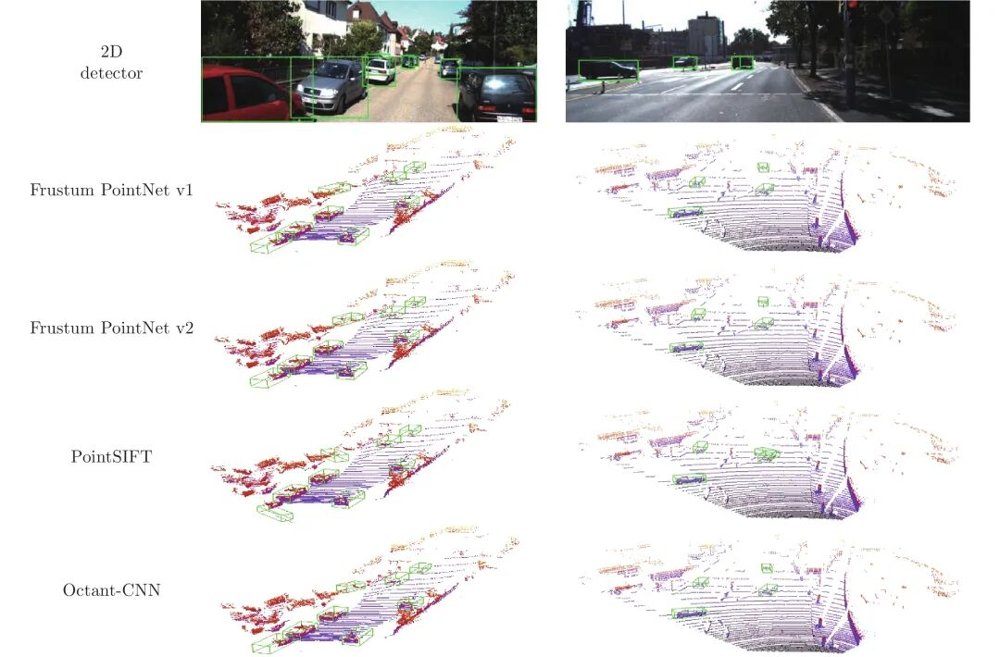
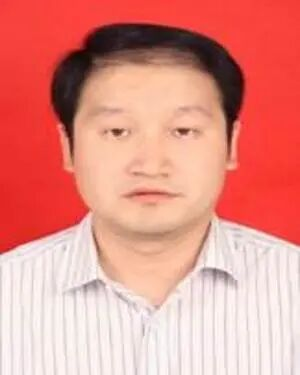

# 基于卦限卷积神经网络的3D点云分析

原创 自动化学报 自动化学报 2022-05-10 17:01 北京

> 原文地址: [https://mp.weixin.qq.com/s/e5g76BPE6MGR97BGgamX0g](https://mp.weixin.qq.com/s/e5g76BPE6MGR97BGgamX0g)

**点击蓝字  / 关注我们**

  

**引用本文**

许翔, 帅惠, 刘青山. 基于卦限卷积神经网络的3D点云分析. 自动化学报, 2021, 47(12): 2791−2800 doi: 10.16383/j.aas.c200080

Xu Xiang, Shuai Hui, Liu Qing-Shan. Octant convolutional neural network for 3D point cloud analysis. Acta Automatica Sinica, 2021, 47(12): 2791−2800 doi: 10.16383/j.aas.c200080

http://www.aas.net.cn/cn/article/doi/10.16383/j.aas.c200080?viewType=HTML

  

**文章简介**

  

**关键词**

  

深度学习, 点云, 卦限卷积神经网络, 局部几何特征

  

**摘   要**

  

基于深度学习的三维点云数据分析技术得到了越来越广泛的关注, 然而点云数据的不规则性使得高效提取点云中的局部结构信息仍然是一大研究难点. 本文提出了一种能够作用于局部空间邻域的卦限卷积神经网络(Octant convolutional neural network, Octant-CNN), 它由卦限卷积模块和下采样模块组成. 针对输入点云, 卦限卷积模块在每个点的近邻空间中定位8个卦限内的最近邻点, 接着通过多层卷积操作将8卦限中的几何特征抽象成语义特征, 并将低层几何特征与高层语义特征进行有效融合, 从而实现了利用卷积操作高效提取三维邻域内的局部结构信息; 下采样模块对原始点集进行分组及特征聚合, 从而提高特征的感受野范围, 并且降低网络的计算复杂度. Octant-CNN通过对卦限卷积模块和下采样模块的分层组合, 实现了对三维点云进行由底层到抽象、从局部到全局的特征表示. 实验结果表明, Octant-CNN在对象分类、部件分割、语义分割和目标检测四个场景中均取得了较好的性能.

  

**引   言**

  

随着自动驾驶和机器人应用技术的兴起, 3D点云数据分析引起了广泛关注. 近年来, 由于基于深度学习的神经网络在图像分类、目标检测和图像分割等任务中取得了很大的成功, 基于深度学习的点云数据分析也成为了研究的热点. 现有的基于深度学习的点云数据分析方法大体可以分为以下两类:

  

一类是基于无序点云规则化的深度学习方法, 这类方法先将3D点云转换为规则的体素结构或多视图图像, 然后使用卷积神经网络 (Convolutional neural network, CNN)方法来学习特征表示. 由于体素化过程存在量化误差, 多视图投影则压缩了数据维度, 这些都会不同程度上导致3D点云中几何信息的丢失. 另一类方法是直接基于点云的深度学习方法. 这类方法又可以分为基于多层感知机(Multi-layer perceptron, MLP)的方法、 基于卷积的方法和基于图的方法. 其中基于多层感知机的方法的核心思想是通过参数共享的MLP独立地提取每个点的特征, 然后通过一个对称函数聚合得到全局特征, 这类方法往往不能充分考虑到3D点之间的关系. 基于卷积的方法的核心思想是根据邻域点之间的空间位置关系去学习点之间的权重参数, 并根据学习到的权重参数自适应地聚合局部特征, 这类方法已经取得了极大的成功. 基于图的方法在近年来也受到了广泛的关注, 它们将每个点都作为图的顶点, 通过学习顶点之间边的权重来更新顶点的特征, 这类方法通常在构图的过程中会产生相当大的计算量.

  

在上述方法中, 基于MLP的方法是最直接简单的方法. PointNet是这类方法中的开创性工作, 其核心思想是通过参数共享的多层感知机独立地将每个点的坐标信息映射至高维特征空间, 再通过一个对称函数聚合最终的高维特征以获得全局表示, 从而解决了点云的无序性问题; 此外, PointNet还使用T-Net网络学习变换矩阵对点云进行旋转标定, 从而保证点云的旋转不变性; 在分割任务中, PointNet将全局特征与每个点的局部特征级联, 通过多层MLP提取每个点的语义特征, 实现对每个点的分类. 虽然该方法简单有效, 但是由于其是对每个点进行独立地处理, 因此该网络并没有有效提取点云的局部特征. 对此, PointNet++提出了一种层次化的网络结构, 通过在每一层级递归使用采样、分组和PointNet网络来抽象低层次的特征; 面对语义分割任务, PointNet++提出基于欧氏距离的插值法对点进行上采样, 并将通过插值计算所得语义特征与低层学习的语义特征进行融合以更准确地学习每个点的语义特征. 但是在每一个子区域中, PointNet++仍然独立地处理每个点的信息. PointSIFT引入卦限约束来有效探索各个点周围的局部模式, 其主要思想是以每个点为原点, 在周围8个卦限中找到特定范围内的最近点, 然后沿着X, Y, Z轴使用三阶段2D卷积来提取局部模式, 其三阶段的卷积操作会受到因点云旋转而造成的不同卦限顺序的影响, 从而使得提取的局部模式具有方向敏感性; 此外, 在下采样阶段, PointSIFT沿用PointNet++的网络结构, 采用可学习的方式聚合局部特征, 这为其引入额外的参数, 从而大大增加了其计算量.

  

为了克服上述问题, 本文提出了一种新的卦限卷积神经网络(Octant-CNN)来提取点云的局部几何结构. 该网络主要由卦限卷积模块和下采样模块两部分组成. 具体来说, 卦限卷积模块首先搜索每个点在8个卦限内的最近邻点, 由于点云的密度特性可以通过近邻点的距离来表征, 为了使Octant-CNN能更好地反映这一特性, 本文取消了对搜索半径的限制, 从而保证远离中心点的近邻点同样可以被度量. 卦限卷积模块使用单阶段卷积操作同时作用在8个卦限的近邻点, 从而克服了三阶段卷积操作对卦限顺序敏感这一问题, 并且配合T-Net的使用, 能够对点云旋转具有更好的鲁棒性. 最后通过级联各层的特征和残差连接方式实现了多层次特征的融合. 下采样模块根据空间分布对点云进行分组聚合, 扩大了中间特征的感受野, 构成了层次化的网络连结结构, 并且该模块并没有引入额外的可学习参数, 从而大大降低了Octant-CNN的计算复杂度. 通过对卦限卷积模块和下采样模块的多层堆叠, Octant-CNN实现了从局部模式中不断抽象出全局特征.

  

图 5  KITTI目标检测可视化结果

  

请点击左下角“**阅读原文**”了解更多！

  

**作者简介**

**许   翔**

南京信息工程大学自动化学院硕士研究生. 2018年获得南京信息工程大学信息与控制学院学士学位. 主要研究方向为三维点云场景感知.

E-mail: xuxiang0103@gmail.com

**帅   惠**

南京信息工程大学博士研究生. 2018年获得南京信息工程大学信息与控制学院硕士学位. 主要研究方向为目标检测, 3D点云场景感知.

E-mail: huishuai13@163.com

**刘青山**

南京信息工程大学计算机学院、软件学院、网络空间安全学院院长, 教授. 2003年获得中国科学院自动化研究所博士学位. 主要研究方向为图像理解, 模式识别, 机器学习. 本文通信作者.

E-mail: qsliu@nuist.edu.cn

  

**相关文章**

**（请向上滑动阅读）**

  

\[1\]  彭秀平, 仝其胜, 林洪彬, 冯超, 郑武. 一种面向散乱点云语义分割的深度残差−特征金字塔网络框架. 自动化学报, 2021, 47(12): 2831−2840 doi: 10.16383/j.aas.c190063

http://www.aas.net.cn/cn/article/doi/10.16383/j.aas.c190063?viewType=HTML

  

\[2\]  王龙, 宋慧慧, 张开华, 刘青山. 反馈学习高斯表观网络的视频目标分割. 自动化学报, 2022, 48(3): 834-842. doi: 10.16383/j.aas.c200288

http://www.aas.net.cn/cn/article/doi/10.16383/j.aas.c200288?viewType=HTML

  

\[3\]  张泽辉, 富瑶, 高铁杠. 支持数据隐私保护的联邦深度神经网络模型研究. 自动化学报. doi: 10.16383/j.aas.c200236

http://www.aas.net.cn/cn/article/doi/10.16383/j.aas.c200236?viewType=HTML

  

\[4\]  单铉洋, 孙战里, 曾志刚. RFNet: 用于三维点云分类的卷积神经网络. 自动化学报. doi: 10.16383/j.aas.c210532

http://www.aas.net.cn/cn/article/doi/10.16383/j.aas.c210532?viewType=HTML

  

\[5\]  范家伟, 张如如, 陆萌, 何佳雯, 康霄阳, 柴文俊, 石珅达, 宋美娜, 鄂海红, 欧中洪. 深度学习方法在糖尿病视网膜病变诊断中的应用. 自动化学报, 2021, 47(5): 985-1004. doi: 10.16383/j.aas.c190069

http://www.aas.net.cn/cn/article/doi/10.16383/j.aas.c190069?viewType=HTML

  

\[6\]  熊峰, 刘成菊, 陈启军. 基于垂直约束的激光扫描机构外参标定算法. 自动化学报, 2021, 47(5): 1058-1066. doi: 10.16383/j.aas.c190264

http://www.aas.net.cn/cn/article/doi/10.16383/j.aas.c190264?viewType=HTML

  

\[7\]  司念文, 张文林, 屈丹, 罗向阳, 常禾雨, 牛铜. 卷积神经网络表征可视化研究综述. 自动化学报. doi: 10.16383/j.aas.c200554

http://www.aas.net.cn/cn/article/doi/10.16383/j.aas.c200554?viewType=HTML

  

\[8\]  王正文, 宋慧慧, 樊佳庆, 刘青山. 基于语义引导特征聚合的显著性目标检测网络. 自动化学报. doi: 10.16383/j.aas.c210425

http://www.aas.net.cn/cn/article/doi/10.16383/j.aas.c210425?viewType=HTML

  

\[9\]  王功明, 乔俊飞, 关丽娜, 贾庆山. 深度信念网络研究现状与展望. 自动化学报, 2021, 47(1): 35-49. doi: 10.16383/j.aas.c190102

http://www.aas.net.cn/cn/article/doi/10.16383/j.aas.c190102?viewType=HTML

  

\[10\]  林文瑞, 丛爽. 基于深度学习LDAMP网络的量子状态估计. 自动化学报. doi: 10.16383/j.aas.c210156

http://www.aas.net.cn/cn/article/doi/10.16383/j.aas.c210156?viewType=HTML

  

\[11\]  孟琭, 孙霄宇, 赵滨, 李楠. 基于卷积神经网络的铁轨路牌识别方法. 自动化学报, 2020, 46(3): 518-530. doi: 10.16383/j.aas.c190182

http://www.aas.net.cn/cn/article/doi/10.16383/j.aas.c190182?viewType=HTML

  

\[12\]  薄迎春, 张欣, 刘宝. 延迟深度回声状态网络及其在时间序列预测中的应用. 自动化学报, 2020, 46(8): 1644-1653. doi: 10.16383/j.aas.c180264

http://www.aas.net.cn/cn/article/doi/10.16383/j.aas.c180264?viewType=HTML

  

\[13\]  林金花, 姚禹, 王莹. 基于深度图及分离池化技术的场景复原及语义分类网络. 自动化学报, 2019, 45(11): 2178-2186. doi: 10.16383/j.aas.2018.c170439

http://www.aas.net.cn/cn/article/doi/10.16383/j.aas.2018.c170439?viewType=HTML

  

\[14\]  蔡云飞, 石庭敏, 唐振民. 基于双多线激光雷达的非结构化环境负障碍感知技术. 自动化学报, 2018, 44(3): 569-576. doi: 10.16383/j.aas.2018.c160453

http://www.aas.net.cn/cn/article/doi/10.16383/j.aas.2018.c160453?viewType=HTML

  

\[15\]  陈伟宏, 安吉尧, 李仁发, 李万里. 深度学习认知计算综述. 自动化学报, 2017, 43(11): 1886-1897. doi: 10.16383/j.aas.2017.c160690

http://www.aas.net.cn/cn/article/doi/10.16383/j.aas.2017.c160690?viewType=HTML

  

\[16\]  胡长胜, 詹曙, 吴从中. 基于深度特征学习的图像超分辨率重建. 自动化学报, 2017, 43(5): 814-821. doi: 10.16383/j.aas.2017.c150634

http://www.aas.net.cn/cn/article/doi/10.16383/j.aas.2017.c150634?viewType=HTML

  

\[17\]  罗建豪, 吴建鑫. 基于深度卷积特征的细粒度图像分类研究综述. 自动化学报, 2017, 43(8): 1306-1318. doi: 10.16383/j.aas.2017.c160425

http://www.aas.net.cn/cn/article/doi/10.16383/j.aas.2017.c160425?viewType=HTML

  

\[18\]  常亮, 邓小明, 周明全, 武仲科, 袁野, 杨硕, 王宏安. 图像理解中的卷积神经网络. 自动化学报, 2016, 42(9): 1300-1312. doi: 10.16383/j.aas.2016.c150800

http://www.aas.net.cn/cn/article/doi/10.16383/j.aas.2016.c150800?viewType=HTML

  

\[19\]  唐朝辉, 朱清新, 洪朝群, 祝峰. 基于自编码器及超图学习的多标签特征提取. 自动化学报, 2016, 42(7): 1014-1021. doi: 10.16383/j.aas.2016.c150736

http://www.aas.net.cn/cn/article/doi/10.16383/j.aas.2016.c150736?viewType=HTML

  

\[20\]  耿杰, 范剑超, 初佳兰, 王洪玉. 基于深度协同稀疏编码网络的海洋浮筏SAR图像目标识别. 自动化学报, 2016, 42(4): 593-604. doi: 10.16383/j.aas.2016.c150425

http://www.aas.net.cn/cn/article/doi/10.16383/j.aas.2016.c150425?viewType=HTML

  

\[21\]  随婷婷, 王晓峰. 一种基于CLMF的深度卷积神经网络模型. 自动化学报, 2016, 42(6): 875-882. doi: 10.16383/j.aas.2016.c150741

http://www.aas.net.cn/cn/article/doi/10.16383/j.aas.2016.c150741?viewType=HTML

  

  

**近期文章**

  

[多子群的共生非均匀高斯变异樽海鞘群算法](http://mp.weixin.qq.com/s?__biz=MzAwMzAzMDgxOA==&mid=2651077253&idx=1&sn=8bb31df462faacb91e929c785da5cc66&chksm=8131f0c8b64679deba1726b4ace546e4db5cd4f75a3c7a32b8585d5ba4923c950040bb4e10c1&scene=21#wechat_redirect)

[深海起重机系统的实时轨迹规划方法](http://mp.weixin.qq.com/s?__biz=MzAwMzAzMDgxOA==&mid=2651077253&idx=2&sn=a56d6ba21cacc230b19e46cbac02d1f2&chksm=8131f0c8b64679de5196befb6529c000b1ca45ee81eda188944e136ceb3e03833d0d77513b4f&scene=21#wechat_redirect)

[一种改进的特征子集区分度评价准则](http://mp.weixin.qq.com/s?__biz=MzAwMzAzMDgxOA==&mid=2651077115&idx=2&sn=f9e9063e82252dc6389f99cd9921b665&chksm=8131f3b6b6467aa0efe5b1d2a7898b081ad349d484ed7ce6603fd9dd2742bfd9afe599a49cf8&scene=21#wechat_redirect)

[基于多阶段注意力机制的多种导航传感器故障识别研究](http://mp.weixin.qq.com/s?__biz=MzAwMzAzMDgxOA==&mid=2651077115&idx=1&sn=cb5a0515e8ced5d96aec9aeee0c43906&chksm=8131f3b6b6467aa06f5244ad53639bb0452b6dfba6540ee50ea7d33b764e1e81fe712d58d371&scene=21#wechat_redirect)

[支持数据隐私保护的联邦深度神经网络模型研究](http://mp.weixin.qq.com/s?__biz=MzAwMzAzMDgxOA==&mid=2651077039&idx=1&sn=679f6b0a5a6a97ad2564e590bd534072&chksm=8131f3e2b6467af447638b7d6e7312046f128019c857cf8e79609736f5d57849cfa2c34f8ba4&scene=21#wechat_redirect)

[【热点专题】多目标优化](http://mp.weixin.qq.com/s?__biz=MzI2NjA3MzM5MA==&mid=2649962438&idx=1&sn=83b21f7b6a63fc4e01c2f4718b2aae92&chksm=f2943387c5e3ba91ce32286c06f215a989233f55bbbd5c7d436a43c40615bb5ae208d0f0f228&scene=21#wechat_redirect)

[联合样本输出与特征空间的半监督概念漂移检测法及其应用](http://mp.weixin.qq.com/s?__biz=MzAwMzAzMDgxOA==&mid=2651076994&idx=1&sn=4e40a43610e5879752437474d12ea2c8&chksm=8131f3cfb6467ad9f54ad169a3857897807584e30d02dbbf83c75664398d19992c1b95fb6be2&scene=21#wechat_redirect)

[面向行人重识别的局部特征研究进展、挑战与展望](http://mp.weixin.qq.com/s?__biz=MzAwMzAzMDgxOA==&mid=2651076994&idx=2&sn=2f1fe243ff0cc599548f9c1d238b4a59&chksm=8131f3cfb6467ad93a3228636e3780da17bb32b7383faa4e5746adab8a53db9281d1894c160c&scene=21#wechat_redirect)

[基于多智能体强化学习的乳腺癌致病基因预测](http://mp.weixin.qq.com/s?__biz=MzAwMzAzMDgxOA==&mid=2651076931&idx=1&sn=a62942cd056156ad5a885d6350e8b373&chksm=8131f30eb6467a18ffbee77b25fb9b0417b08918d3625d04c89a3a9bcb1490eece239c5fda25&scene=21#wechat_redirect)

[一种基于深度迁移学习的滚动轴承早期故障在线检测方法](http://mp.weixin.qq.com/s?__biz=MzAwMzAzMDgxOA==&mid=2651076931&idx=2&sn=128b1673843353529d8b130f372bb46f&chksm=8131f30eb6467a18e0f645b207ada16cd601b791297b32b1caccf72daa50b55063074ec4fdc3&scene=21#wechat_redirect)

[水下多机器人系统综述](http://mp.weixin.qq.com/s?__biz=MzAwMzAzMDgxOA==&mid=2651076668&idx=1&sn=b50e43710be8208fd711cd45943e95c0&chksm=8131f271b6467b675083610c925ce0d329e201ddab5c8e935eb266fbf41418395459fdd0618d&scene=21#wechat_redirect)

[《自动化学报》多名作者入选爱思唯尔2021中国高被引学者](http://mp.weixin.qq.com/s?__biz=MzAwMzAzMDgxOA==&mid=2651076637&idx=1&sn=ee78f108cf0551024cb95c33241a5f1d&chksm=8131f250b6467b46c8d4af1bd63381328a80c65ade97a6daa97e3bb4538b39c6f761da238066&scene=21#wechat_redirect)

[基于事件触发的离散MIMO系统自适应评判容错控制](http://mp.weixin.qq.com/s?__biz=MzAwMzAzMDgxOA==&mid=2651076863&idx=1&sn=aec9cf55a1b0b8eae741999601a8c6df&chksm=8131f2b2b6467ba4c20d388390d4ac191555e5d00d77f510f72af77359d18bdca5230ea52df0&scene=21#wechat_redirect)

[一种脑肢融合的神经康复训练在线评价与调整方法](http://mp.weixin.qq.com/s?__biz=MzAwMzAzMDgxOA==&mid=2651076801&idx=1&sn=01be1c22a480f6d2c52e4afcf7c173d8&chksm=8131f28cb6467b9af8e33ff70860ff2731c797d27cbbda568088b6d17a41ae07d38ebb59a0e5&scene=21#wechat_redirect)

[基于自适应LASSO先验的稀疏贝叶斯学习算法](http://mp.weixin.qq.com/s?__biz=MzAwMzAzMDgxOA==&mid=2651076733&idx=1&sn=01ccbc6fe6e387330aa93ae1a2a11953&chksm=8131f230b6467b260036bbc1efe3db2924397a4e7ba2f683e2e0c4819805906180d44529244a&scene=21#wechat_redirect)  

[眼动跟踪研究进展与展望](http://mp.weixin.qq.com/s?__biz=MzAwMzAzMDgxOA==&mid=2651076581&idx=1&sn=dab1369362bf1790033e5cf2f5736281&chksm=8131fda8b64674be08cbf0bf3bf5a928115b76ec24e8000cad36820b039d33dedba8a048210e&scene=21#wechat_redirect)

  

**热点文章**

  

[【热点专题】多目标优化](http://mp.weixin.qq.com/s?__biz=MzI2NjA3MzM5MA==&mid=2649962438&idx=1&sn=83b21f7b6a63fc4e01c2f4718b2aae92&chksm=f2943387c5e3ba91ce32286c06f215a989233f55bbbd5c7d436a43c40615bb5ae208d0f0f228&scene=21#wechat_redirect)

[基于事件触发的分布式优化算法](http://mp.weixin.qq.com/s?__biz=MzAwMzAzMDgxOA==&mid=2651076142&idx=2&sn=b074793ec4be44ea08efb78617dcdcc0&chksm=8131fc63b6467575b7f6d698909e56be16089f8f56ca415294483ff6f40902c7546417f82531&scene=21#wechat_redirect)

[一种针对德州扑克AI的对手建模与策略集成框架](http://mp.weixin.qq.com/s?__biz=MzAwMzAzMDgxOA==&mid=2651075800&idx=1&sn=9ab9006d50bb2513c49006b1c1431a3c&chksm=8131fe95b6467783eb58de5d7b1726ddcb881561603c76bdcefa44f4a9a9027afc37b1be979c&scene=21#wechat_redirect)

[工业铸件缺陷无损检测技术的应用进展与展望](http://mp.weixin.qq.com/s?__biz=MzAwMzAzMDgxOA==&mid=2651075561&idx=1&sn=afda9a46702ab802788e1c9fc67b5849&chksm=8131f9a4b64670b2c122efca37574a0dceda3582b0477845b80670246b4eb8befce2ae748dc1&scene=21#wechat_redirect)

[CVPR 2022 | 自动化所新作速览！（上）](http://mp.weixin.qq.com/s?__biz=MzAwMzAzMDgxOA==&mid=2651075034&idx=2&sn=48b5232daaa7a51da96c3a7c87013e2d&chksm=8131fb97b6467281dc8e02749df8d0388f89d30e3b08f44d13c700169d1d7a22c4feef9f2dba&scene=21#wechat_redirect)

[CVPR 2022 | 自动化所新作速览！（下）](http://mp.weixin.qq.com/s?__biz=MzAwMzAzMDgxOA==&mid=2651075034&idx=3&sn=21833bb312bb0d9826c64c9fce068aa5&chksm=8131fb97b646728147f2bff58a04230d708d5a4537eb824656c2d54580b11f6a47b0eb30ade6&scene=21#wechat_redirect)

[直播回放分享 | 陈关荣教授：探索最优同步网络的拓扑结构](http://mp.weixin.qq.com/s?__biz=MzIxMjA5Njg2Nw==&mid=2649061608&idx=1&sn=1500a81260d8f5127b7cb7767c759fba&chksm=8f5a9ae4b82d13f201b714d8e96af9bbddf442bb7e10c97416fb925ab2170c05fa12010fb1d1&scene=21#wechat_redirect)

[《自动化学报》2019年高关注论文](http://mp.weixin.qq.com/s?__biz=MzAwMzAzMDgxOA==&mid=2651073450&idx=1&sn=6f57bd0df73f259aa416575f1f69bdfb&chksm=8131e1e7b64668f1344de4acdef6148e8dcfa60c80e4f48e6cb1270558c2beade5601e92d05c&scene=21#wechat_redirect)

[《自动化学报》2021年热点文章回顾](http://mp.weixin.qq.com/s?__biz=MzAwMzAzMDgxOA==&mid=2651072577&idx=1&sn=4e6be077d7371c7d29d9a371d8defe19&chksm=8131e20cb6466b1aec2f3b8b1063d3be11725ca9a0c15785c3b42a638170e732acd0d8d345e0&scene=21#wechat_redirect)

[国家自然科学基金论文精选](http://mp.weixin.qq.com/s?__biz=MzI2NjA3MzM5MA==&mid=2649960308&idx=1&sn=1634c999f22588333537f13393403f9c&chksm=f2942b35c5e3a2232e86b51c2b7c8f37a4d3d7f858d370d76d5afd00567d7da6e9543476d120&scene=21#wechat_redirect)  

[国家重点研发计划论文精选](http://mp.weixin.qq.com/s?__biz=MzI2NjA3MzM5MA==&mid=2649960255&idx=1&sn=f48435928fd924134cb72014860b9d00&chksm=f2942b7ec5e3a26869da68a1419b3b40ca1e6cb98abf2e380d78a49ffb99c85991d76cc346b0&scene=21#wechat_redirect)

  

**期刊动态**

  

[《自动化学报》多名作者入选爱思唯尔2021中国高被引学者](http://mp.weixin.qq.com/s?__biz=MzAwMzAzMDgxOA==&mid=2651076637&idx=1&sn=ee78f108cf0551024cb95c33241a5f1d&chksm=8131f250b6467b46c8d4af1bd63381328a80c65ade97a6daa97e3bb4538b39c6f761da238066&scene=21#wechat_redirect)

[自动化学报（英文版）和自动化学报入选计算领域高质量科技期刊T1类](http://mp.weixin.qq.com/s?__biz=MzAwMzAzMDgxOA==&mid=2651073859&idx=2&sn=7a9192717637dcf6cddb39ed961e8c3b&chksm=8131e70eb6466e188a123c504bdeba80c75681de4762f8685b3bf584bc33eb12362c70613b4e&scene=21#wechat_redirect)

[《自动化学报》编辑部防诈骗公告](http://mp.weixin.qq.com/s?__biz=MzAwMzAzMDgxOA==&mid=2651073517&idx=1&sn=c52de7c685e546af9faffc0cefab1c85&chksm=8131e1a0b64668b63ebaa68ea81cbaec3b94dc52ea8360821a0a49e67ae7e4b428a25d0f19c5&scene=21#wechat_redirect)

[《自动化学报》致谢审稿人](http://mp.weixin.qq.com/s?__biz=MzI2NjA3MzM5MA==&mid=2649961201&idx=1&sn=3142842d75c441ae860c1ecb313c7657&chksm=f29436b0c5e3bfa6c679210f60513eb1a7205dc20fe028f482bb593eac60427e4e56fba12493&scene=21#wechat_redirect)

[自动化学报多篇论文入选中国百篇最具影响国内论文和中国精品期刊顶尖论文](http://mp.weixin.qq.com/s?__biz=MzI2NjA3MzM5MA==&mid=2649961152&idx=1&sn=4a5e9e4b84879f4cde4e13a0ef97272c&chksm=f2943681c5e3bf97d7770c9623dac869b283b3ea83f3d320017974033e361d8b999134a8bdff&scene=21#wechat_redirect)

[自动化学报各项主要指标蝉联第1，再获百种中国杰出期刊称号](http://mp.weixin.qq.com/s?__biz=MzI2NjA3MzM5MA==&mid=2649960903&idx=1&sn=7da8b8a0167e16bcbaa1f00fbfb69782&chksm=f2943586c5e3bc9014f6d4fff7147b998ae42b4da452907e641e8029f296fd2413b4f17aef62&scene=21#wechat_redirect)

  

**期刊目录**

  

[2022年第04期](http://mp.weixin.qq.com/s?__biz=MzI2NjA3MzM5MA==&mid=2649962369&idx=1&sn=ae2c4584f8904be917b600e67005ae03&chksm=f29433c0c5e3bad6d78382b3c09015aadb09e040b8fc8c319c4f554fd592fe677797000340cd&scene=21#wechat_redirect)

[2022年第03期](http://mp.weixin.qq.com/s?__biz=MzAwMzAzMDgxOA==&mid=2651075527&idx=1&sn=bc020c5fd09080243f7527610b003507&chksm=8131f98ab646709c2f485852b526989a3b9af5cc93e8afb508d9239b78176f49caa9807d6a8d&scene=21#wechat_redirect)

[2022年第02期](http://mp.weixin.qq.com/s?__biz=MzI2NjA3MzM5MA==&mid=2649961838&idx=1&sn=29334896aa0f372b70312250c75b6b20&chksm=f294312fc5e3b8392ffd49100eaba435bf48fa9234c5019fe7b16ed1e4ebef70be58691f3fb3&scene=21#wechat_redirect)

[2022年第01期](http://mp.weixin.qq.com/s?__biz=MzI2NjA3MzM5MA==&mid=2649961423&idx=1&sn=3b65958faa7c7f94c247f46dd72bd71e&chksm=f294378ec5e3be9825f860d132c36c97f3e877089449cb1fe85a6d1e7da9bd0e24795336bc54&scene=21#wechat_redirect)

[《自动化学报》2021年全年合集](http://mp.weixin.qq.com/s?__biz=MzAwMzAzMDgxOA==&mid=2651072770&idx=1&sn=7c531f7fa3bc390558fab15b339ce86e&chksm=8131e34fb6466a59ed079448fddda0fc9f97066460bff8f6835288003a1fba2812de383813c1&scene=21#wechat_redirect)

[《自动化学报》2020年全年合集](http://mp.weixin.qq.com/s?__biz=MzI2NjA3MzM5MA==&mid=2649957972&idx=1&sn=1951847aacbcb7d22bdd2a46a79af871&chksm=f2942215c5e3ab03d070d8e52b8764b38036897c97b6a26c7a1f918c806b28edbe6c0fbf7ea9&scene=21#wechat_redirect)

[2020年第10期 工业人工智能专题](http://mp.weixin.qq.com/s?__biz=MzI2NjA3MzM5MA==&mid=2649957201&idx=1&sn=ab82a767bd716ab67fdf2942500d8b61&chksm=f2942710c5e3ae06b27f9e63a5e329a1123d90b051164e6b6123c500230541b1ed12d92abbfb&scene=21#wechat_redirect)

[2020年第09期 分布式信息能源系统理论与应用专题](http://mp.weixin.qq.com/s?__biz=MzI2NjA3MzM5MA==&mid=2649956412&idx=1&sn=8ebc13d63fd333ad85dbb8b5825df248&chksm=f294247dc5e3ad6ba297857a5b957e97cf499266c50318791fa8abd9432ecf1d9c3d9b287e36&scene=21#wechat_redirect)

  

  

  

**长按二维码｜关注我们**

**IEEE/CAA Journal of Automatica Sinica (JAS)**

**长按二维码｜关注我们**

**《自动化学报》服务号**

**长按二维码｜关注我们**

**《自动化学报》订阅号**  

  

**联系我们**

**网站:** 

http://www.aas.net.cn

http://www.ieee-jas.net

**投稿:** 

https://mc03.manuscriptcentral.com/aas-cn   

https://mc03.manuscriptcentral.com/ieee-jas 

**电话:**

010-82544653（日常咨询和稿件处理） 

010-82544677（录用后稿件处理）

**邮箱:** 

aas@ia.ac.cn（日常咨询和稿件处理）  

aas\_editor@ia.ac.cn（录用后稿件处理）

**博客:** 

http://blog.sina.com.cn/aaseditor 

  

**↓ 点击下方 阅读原文 了解更多**