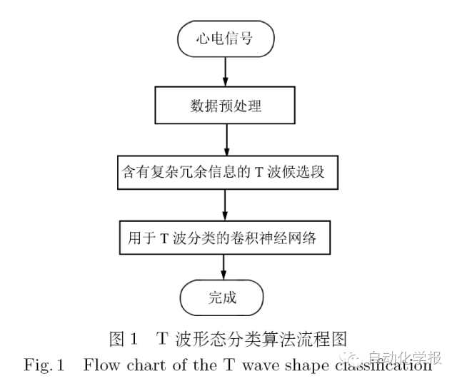
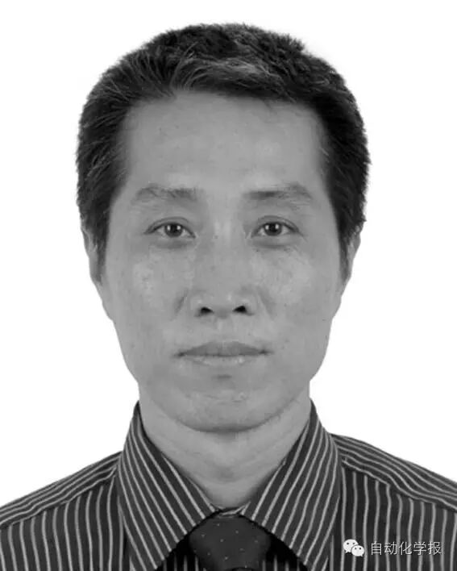

# 基于卷积神经网络的T 波形态分类

原创 自动化学报 2016-10-09 18:48 北京

> 原文地址: [https://mp.weixin.qq.com/s/yqvWTihSjAwNsuGaAzlufw](https://mp.weixin.qq.com/s/yqvWTihSjAwNsuGaAzlufw)

近年来，心血管疾病的发病率呈明显上升趋势，且其死亡率已经跃居总死亡率第一。现有医学成果表明，T波形态改变是心脏猝死等疾病的重要标志。正确的T波形态分类有助于诊断心肌缺血、急性心包炎和心脏猝死等疾病。传统的T波分类算法依赖于T波检测，在准确定位T波的关键点之后再提取T波特征，完成分类。然而由于心电信号包含复杂噪声，而T波能量低、持续时间短、形态多变、位置可能发生偏移，这导致T波检测本身就是一个难题。为了解决上述问题，本文提出基于卷积神经网络的T波分类算法：首先根据QRS波群位置及医学统计规律确定一个包含复杂噪声的T波候选段，然后采用卷积神经网络直接完成T波分类。由于卷积神经网络具有稀疏连接、权值共享的特性，能够通过训练自动获取T波特征，并且其特征对微小平移具备不变性却对噪声不敏感，从而能够有效解决T波形态分类问题。最后在MIT-BIH QT心电数据库上对本文方法进行测试。实验表明，本文方法可以在T波起始点未确定的情况下，能够识别多种形态的T波，正确率达到了99.1%。

引用格式

刘明, 李国军, 郝华青, 侯增广, 刘秀玲. 基于卷积神经网络的T 波形态分类. 自动化学报, 2016, 42(9): 1339-1346

作者简介

刘明 河北大学副教授. 主要研究方向为模式识别, 心电信号处理．

E-mail: liuming@hbu.cn

李国军 河北大学硕士研究生. 主要研究方向为模式识别, 心电信号处理.

E-mail: l631440866@163.com

郝华青 河北大学硕士研究生. 主要研究方向为模式识别, 心电信号处理.

E-mail: huaqingdeyouxiang@163.com

侯增广 中国科学院自动化研究所研究员, 复杂系统管理与控制国家重点实验室副主任. 主要研究方向为嵌入式系统软硬件开发, 机器人控制, 智能控制理论与方法, 医学和健康自动化领域的康复与手术机器人.

E-mail: zengguang.hou@ia.ac.cn

刘秀玲 河北大学电子信息工程学院教授. 主要研究方向为心血管系统智能分析. 本文通信作者.

E-mail: liuxiuling121@hotmail.com

欢迎扫描二维码、长按图片识别关注《自动化学报》中文版订阅号aas1963，服务号自动化学报和英文版服务号！

