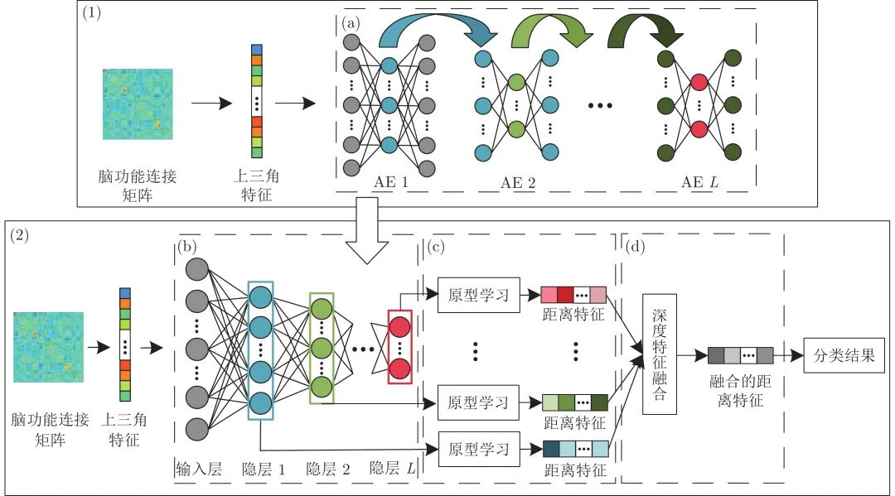
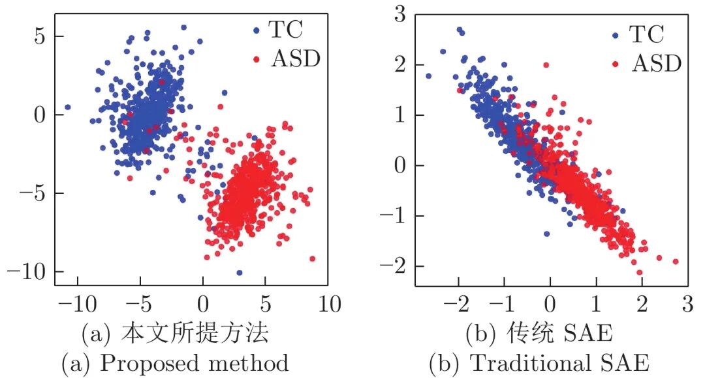
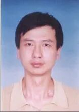

# 基于原型学习与深度特征融合的脑功能连接分类方法研究

原创 自动化学报 自动化学报 2022-03-16 16:41 北京

> 原文地址: [https://mp.weixin.qq.com/s/XPTvVRpc5jfV03vrrxpDiw](https://mp.weixin.qq.com/s/XPTvVRpc5jfV03vrrxpDiw)

**点击蓝字|关注我们**

  

**引用本文**

  

梁玉泽, 冀俊忠. 基于原型学习与深度特征融合的脑功能连接分类方法研究. 自动化学报, 2022, 48(2): 504−514 doi: 10.16383/j.aas.c190747

Liang Yu-Ze, Ji Jun-Zhong. Brain functional connection classification method based on prototype learning and deep feature fusion. Acta Automatica Sinica, 2022, 48(2): 504−514 doi: 10.16383/j.aas.c190747

http://www.aas.net.cn/cn/article/doi/10.16383/j.aas.c190747?viewType=HTML

  

**文章简介**

  

**关键词**

  

脑功能连接分类, 栈式自编码器, 原型学习, 特征融合

  

**摘   要**

  

近年来, 基于深度学习的脑功能连接分类方法已成为一个研究热点. 为了进一步提高脑功能连接的分类准确率, 获得与疾病相关的鉴别性特征, 本文提出了一种基于原型学习与深度特征融合的脑功能连接分类方法. 该方法首先使用栈式自编码器从脑功能连接中提取从低层次到高层次的深度特征; 然后利用原型学习在自编码器的各隐层中提取表示样本类别信息的距离特征; 最后采用深度特征融合策略将这些距离特征融合, 并将该融合特征用于脑功能连接的类别标签预测. 在ABIDE数据集上的实验结果表明, 与其他同类方法相比, 该方法不仅具有较高的分类准确率, 而且能够更加准确地定位与疾病相关的脑区.

  

**引   言**

  

人类大脑是一个高度复杂的系统, 通过脑区之间的互相协作来完成特定任务. 这种协作方式可以通过定量地分析静息态功能磁共振成像(Resting-state functional magnetic resonance imaging, rs-fMRI)数据来表达, 该表达称为功能连接. 已有研究表明, 精神障碍疾病与患者脑区之间功能连接的异常改变密切相关. 因此, 对脑功能连接分类的研究有助于揭示脑疾病的致病原因, 具有十分重要的现实意义.

  

目前脑功能连接分类方法主要分为两种: 基于传统机器学习的分类方法和基于深度学习的分类方法. 基于传统机器学习的分类方法使用浅层模型分析脑功能连接, 其中支持向量机(Support vector machine, SVM)和套索算法(Least absolute shrinkage and selection operator, LASSO)是两种最常用的算法. 虽然传统的机器学习方法已经表现出较好的分类效果, 但是受限于浅层结构, 特征表达能力不足, 分类准确率有待进一步提升. 与传统机器学习方法相比, 深度学习方法具有更强的特征提取能力, 能够系统地从脑功能连接中提取从低层次到高层次的特征. 其中, 栈式自编码器(Stacked autoencoders, SAE)结构简单, 能够逐层提取数据中深层次的特征, 是脑功能连接分类任务中最常用的深度学习方法之一. 此外, 有研究将卷积神经网络(Convolutional neural network, CNN)应用于脑功能连接分类任务, 针对脑功能连接的特点设计了多种网络结构, 取得了不错的效果. 不过, 基于深度学习的脑功能连接分类准确率仍存在进一步的提升空间.

  

近年来, 有研究发现, 在分类时综合利用深度模型提取的不同层次的特征, 相比于仅使用最高层次的特征能够提升分类效果. Sun等使用CNN来提取人脸特征, 将其用于人脸分类任务. 该方法将CNN中最后一个池化层与全连接层提取的特征拼接起来, 作为最终的特征表示, 在分类时充分考虑了不同层次特征中的信息, 与一些代表性的方法相比具有较高的分类准确率. 张婷等在传统CNN 的基础上引入了跨层连接思想, 将CNN中第二个池化层的特征跨越模型中间的隐层直接与全连接层连接起来, 最后使用该特征来预测样本类别. 该方法可以有效地将高层次特征和低层次特征结合起来, 在人脸性别分类任务中获得了比传统CNN更高的准确率. 李勇等针对LeNet-5在表情识别中识别率不高的问题提出了一种基于跨连接LeNet-5网络的面部表情识别方法, 该方法能够将神经网络提取的低层次特征和高层次特征融合, 提高了表情识别率. 最近, 又有研究表明, 将原型学习与深度学习结合能够提取到类内差异小, 类间差异大的鉴别性特征. Yang等将原型学习与CNN结合, 提出了卷积原型学习, 该模型能够显著缩小CNN提取到的特征的类内差异, 提高了CNN的鲁棒性. Wang等提出了一种基于原型学习的原型集成方法, 该方法不仅能够缩小深度特征的类内差异, 而且能够扩大类间差异, 从而提高了增量学习中新类别的检测的鲁棒性. Zhang等提出了模态缺失情况下的深度编码及分类模型(Cross partial multi-view networks, CPM-Nets), 该模型充分利用完备信息编码和原型分类思想, 提高了模态缺失情况下多模态数据的分类性能. 可见, 将原型学习与深度学习结合用于脑功能连接分类任务, 并且在分类阶段综合利用深度模型提取到的不同层次的特征, 将有望在获得与疾病相关的鉴别性特征的同时进一步提升分类准确率.

  

为了进一步提高脑功能连接的分类效果, 本文提出基于原型学习与深度特征融合的脑功能连接分类方法. 与CPM-Nets 不同的是,本文使用的数据为单一模态, 并不涉及模态缺失的情况; 此外本文所提方法还探索了深度模型中不同层次的特征对分类性能的影响. 具体来说, 首先, 利用SAE提取脑功能连接中不同层次的特征; 然后, 使用原型学习在SAE的每个隐层中提取表示样本类别信息的距离特征; 最后, 利用提出的深度特征融合策略将提取到的距离特征融合, 并将该融合特征用于类别标签预测. 在ABIDE数据集上的实验结果表明, 本文所提方法不仅提升了脑功能连接的分类准确率, 而且能够根据模型提取到的鉴别性特征更加准确地定位与精神障碍疾病相关的脑区.

  

图 1  基于原型学习与深度特征融合的脑功能连接分类方法结构图

  

图 3  两种方法的特征分布对比

  

**作者简介**

  

**梁玉泽**

北京工业大学信息学部硕士研究生. 主要研究方向为深度学习, 计算智能和脑科学.

E-mail: liangyuze@emails.bjut.edu.cn

  

**冀俊忠**

北京工业大学教授. 2004年获北京工业大学计算机应用技术专业博士学位, 2005年和2010 年分别在挪威科技大学、纽约州立大学布法罗分校做访问学者. 主要研究方向为机器学习, 计算智能, 生物信息学和脑科学. 本文通信作者.

E-mail: jjz01@bjut.edu.cn

  

**相关文章**

**（请向上滑动阅读）**

  

\[1\]  陈晓云, 陈媛. 子空间结构保持的多层极限学习机自编码器. 自动化学报. doi: 10.16383/j.aas.c200684

http://www.aas.net.cn/cn/article/doi/10.16383/j.aas.c200684?viewType=HTML

  

\[2\]  储珺, 束雯, 周子博, 缪君, 冷璐. 结合语义和多层特征融合的行人检测. 自动化学报, 2022, 48(1): 282-291. doi: 10.16383/j.aas.c200032

http://www.aas.net.cn/cn/article/doi/10.16383/j.aas.c200032?viewType=HTML

  

\[3\]  冀俊忠, 刘金铎, 邹爱笑, 杨翠翠. 一种融合多源信息的脑效应连接网络蚁群学习算法. 自动化学报, 2021, 47(4): 864-881. doi: 10.16383/j.aas.c180680

http://www.aas.net.cn/cn/article/doi/10.16383/j.aas.c180680?viewType=HTML

  

\[4\]  周圆, 王明非, 杜晓婷, 陈艳芳. 基于层次特征复用的视频超分辨率重建. 自动化学报. doi: 10.16383/j.aas.c210095

http://www.aas.net.cn/cn/article/doi/10.16383/j.aas.c210095?viewType=HTML

  

\[5\]  李慧芳, 黄姜杭, 徐光浩, 夏元清. 基于多维度特征融合的云工作流任务执行时间预测方法. 自动化学报.

http://www.aas.net.cn/cn/article/id/5c0f8248-128b-40e9-96f8-342ee9ab40da?viewType=HTML

  

\[6\]  孙超文, 陈晓. 基于多尺度特征融合反投影网络的图像超分辨率重建. 自动化学报, 2021, 47(7): 1689-1700. doi: 10.16383/j.aas.c200714

http://www.aas.net.cn/cn/article/doi/10.16383/j.aas.c200714?viewType=HTML

  

\[7\]  卢绍文, 温乙鑫. 基于图像与电流特征的电熔镁炉欠烧工况半监督分类方法. 自动化学报, 2021, 47(4): 891-902. doi: 10.16383/j.aas.c200754

http://www.aas.net.cn/cn/article/doi/10.16383/j.aas.c200754?viewType=HTML

  

\[8\]  张宪法, 郝矿荣, 陈磊. 免疫多域特征融合的多核学习SVM运动想象脑电信号分类. 自动化学报, 2020, 46(11): 2417-2426. doi: 10.16383/j.aas.c180247

http://www.aas.net.cn/cn/article/doi/10.16383/j.aas.c180247?viewType=HTML

  

\[9\]  雷涛, 李云彤, 周文政, 袁启斌, 王成兵, 张小红. 数据与模型联合驱动的陶瓷材料晶粒分割. 自动化学报. doi: 10.16383/j.aas.c200277

http://www.aas.net.cn/cn/article/doi/10.16383/j.aas.c200277?viewType=HTML

  

\[10\]  顾广华, 曹宇尧, 崔冬, 赵耀. 基于形式概念分析和语义关联规则的目标图像标注. 自动化学报, 2020, 46(4): 767-781. doi: 10.16383/j.aas.c180523

http://www.aas.net.cn/cn/article/doi/10.16383/j.aas.c180523?viewType=HTML

  

\[11\]  张帅勇, 刘美琴, 姚超, 林春雨, 赵耀. 分级特征反馈融合的深度图像超分辨率重建. 自动化学报. doi: 10.16383/j.aas.c200542

http://www.aas.net.cn/cn/article/doi/10.16383/j.aas.c200542?viewType=HTML

  

\[12\]  杨爱萍, 刘瑾, 邢金娜, 李晓晓, 何宇清. 基于内容特征和风格特征融合的单幅图像去雾网络. 自动化学报. doi: 10.16383/j.aas.c200217

http://www.aas.net.cn/cn/article/doi/10.16383/j.aas.c200217?viewType=HTML

  

\[13\]  宋平, 黄玲, 王云龙, 刘菲, 孙哲南. 基于计算光场成像的虹膜活体检测方法. 自动化学报, 2019, 45(9): 1701-1712. doi: 10.16383/j.aas.c180213

http://www.aas.net.cn/cn/article/doi/10.16383/j.aas.c180213?viewType=HTML

  

\[10\]  李勇, 林小竹, 蒋梦莹. 基于跨连接LeNet-5网络的面部表情识别. 自动化学报, 2018, 44(1): 176-182. doi: 10.16383/j.aas.2018.c160835

http://www.aas.net.cn/cn/article/doi/10.16383/j.aas.2018.c160835?viewType=HTML

  

\[14\]  唐朝辉, 朱清新, 洪朝群, 祝峰. 基于自编码器及超图学习的多标签特征提取. 自动化学报, 2016, 42(7): 1014-1021. doi: 10.16383/j.aas.2016.c150736

http://www.aas.net.cn/cn/article/doi/10.16383/j.aas.2016.c150736?viewType=HTML

  

\[9\]  张婷, 李玉鑑, 胡海鹤, 张亚红. 基于跨连卷积神经网络的性别分类模型. 自动化学报, 2016, 42(6): 858-865. doi: 10.16383/j.aas.2016.c150658

http://www.aas.net.cn/cn/article/doi/10.16383/j.aas.2016.c150658?viewType=HTML

  

\[15\]  邹凌, 严永, 杨彪, 李文杰, 潘昌杰, 周仁来. 基于同步EEG-fMRI采集的情绪认知重评数据特征融合分析研究. 自动化学报, 2016, 42(5): 771-781. doi: 10.16383/j.aas.2016.c150545

http://www.aas.net.cn/cn/article/doi/10.16383/j.aas.2016.c150545?viewType=HTML

  

\[16\]  侯书东, 孙权森. 稀疏保持典型相关分析及在特征融合中的应用. 自动化学报, 2012, 38(4): 659-665. doi: 10.3724/SP.J.1004.2012.00659

http://www.aas.net.cn/cn/article/doi/10.3724/SP.J.1004.2012.00659?viewType=HTML

  

\[17\]  焦慧敏, 王党校, 张玉茹, 方磊. 基于书写摩擦力的签名识别方法. 自动化学报, 2011, 37(7): 883-890. doi: 10.3724/SP.J.1004.2011.00883

http://www.aas.net.cn/cn/article/doi/10.3724/SP.J.1004.2011.00883?viewType=HTML

  

\[18\]  刘帅师, 田彦涛, 万川. 基于Gabor多方向特征融合与分块直方图的人脸表情识别方法. 自动化学报, 2011, 37(12): 1455-1463. doi: 10.3724/SP.J.1004.2011.01455

http://www.aas.net.cn/cn/article/doi/10.3724/SP.J.1004.2011.01455?viewType=HTML

  

\[19\]  孙艳丰, 唐恒亮, 尹宝才. 融合多种几何特征的三维人脸识别算法. 自动化学报, 2008, 34(12): 1483-1489. doi: 10.3724/SP.J.1004.2008.01483

http://www.aas.net.cn/cn/article/doi/10.3724/SP.J.1004.2008.01483?viewType=HTML

  

\[20\]  郎方年, 周激流, 钟钒, 宋恩彬, 闫斌. 基于四元数的图像信息并行融合. 自动化学报, 2007, 33(11): 1136-1143. doi: 10.1360/aas-007-1136

http://www.aas.net.cn/cn/article/doi/10.1360/aas-007-1136?viewType=HTML

  

**近期文章**

  

[直播回放分享 | 陈关荣教授：探索最优同步网络的拓扑结构](http://mp.weixin.qq.com/s?__biz=MzIxMjA5Njg2Nw==&mid=2649061608&idx=1&sn=1500a81260d8f5127b7cb7767c759fba&chksm=8f5a9ae4b82d13f201b714d8e96af9bbddf442bb7e10c97416fb925ab2170c05fa12010fb1d1&scene=21#wechat_redirect)

[人生跑马灯？人类首次同步测量大脑濒死状态](http://mp.weixin.qq.com/s?__biz=MzAwMzAzMDgxOA==&mid=2651074149&idx=2&sn=60d48feaa01d160092c19a91e1314db7&chksm=8131e428b6466d3e1e8f835c506ae7faf61e8b66d94fc1dd027a089e075f82078ce5422a0a13&scene=21#wechat_redirect)

[自动化学报（英文版）和自动化学报入选计算领域高质量科技期刊T1类](http://mp.weixin.qq.com/s?__biz=MzAwMzAzMDgxOA==&mid=2651073859&idx=2&sn=7a9192717637dcf6cddb39ed961e8c3b&chksm=8131e70eb6466e188a123c504bdeba80c75681de4762f8685b3bf584bc33eb12362c70613b4e&scene=21#wechat_redirect)

[AI黑科技：马赛克加密被破解了！](http://mp.weixin.qq.com/s?__biz=MzAwMzAzMDgxOA==&mid=2651073824&idx=2&sn=0c15fef01cd893210bef1cceece5d49d&chksm=8131e76db6466e7b1c78884be8517733101cbe37b5a2fd95f4d4df6b569956c0dc5598435eb4&scene=21#wechat_redirect)

[Nature：当AI学会控制核聚变反应堆](http://mp.weixin.qq.com/s?__biz=MzAwMzAzMDgxOA==&mid=2651073629&idx=2&sn=b298f9f715cc9a6a38a54f36aea98171&chksm=8131e610b6466f06072ffe4dcfb213dde209f893bd3071cd4cbca8ba9a6484334028a3aae92a&scene=21#wechat_redirect)

[《自动化学报》编辑部防诈骗公告](http://mp.weixin.qq.com/s?__biz=MzAwMzAzMDgxOA==&mid=2651073517&idx=1&sn=c52de7c685e546af9faffc0cefab1c85&chksm=8131e1a0b64668b63ebaa68ea81cbaec3b94dc52ea8360821a0a49e67ae7e4b428a25d0f19c5&scene=21#wechat_redirect)

[中国科学院自动化研究所“海外优青”项目招聘启事](http://mp.weixin.qq.com/s?__biz=MzAwMzAzMDgxOA==&mid=2651073629&idx=3&sn=704a900c277b3224dfa9745d2ccc8c24&chksm=8131e610b6466f06329a900636c1bf894d6a890b89d114bbd9faf5f9a8132a73a228e7c3aeac&scene=21#wechat_redirect)

[“诺奖风向标”斯隆奖2022名单出炉！27位华人学者入选](http://mp.weixin.qq.com/s?__biz=MzAwMzAzMDgxOA==&mid=2651073517&idx=2&sn=5ed3a30328a9f41bd43999c1592469b8&chksm=8131e1a0b64668b687601773f8d9d6960344a59a62e83dede480b768fad7375bc5329cfcebdc&scene=21#wechat_redirect)

[Nature封面：人类又输给了AI，赛车AI击败人类顶级车手！](http://mp.weixin.qq.com/s?__biz=MzAwMzAzMDgxOA==&mid=2651073362&idx=2&sn=e9a5d620fd2afa6af2c13d9c695e54a7&chksm=8131e11fb64668099fa52873d8df2f3a91c3244972da7d10cbf7c234c8b95b70954e1f2affab&scene=21#wechat_redirect)

  

**热点文章**

  

[《自动化学报》2019年高关注论文](http://mp.weixin.qq.com/s?__biz=MzAwMzAzMDgxOA==&mid=2651073450&idx=1&sn=6f57bd0df73f259aa416575f1f69bdfb&chksm=8131e1e7b64668f1344de4acdef6148e8dcfa60c80e4f48e6cb1270558c2beade5601e92d05c&scene=21#wechat_redirect)

[《自动化学报》2021年热点文章回顾](http://mp.weixin.qq.com/s?__biz=MzAwMzAzMDgxOA==&mid=2651072577&idx=1&sn=4e6be077d7371c7d29d9a371d8defe19&chksm=8131e20cb6466b1aec2f3b8b1063d3be11725ca9a0c15785c3b42a638170e732acd0d8d345e0&scene=21#wechat_redirect)

[国家自然科学基金论文精选](http://mp.weixin.qq.com/s?__biz=MzI2NjA3MzM5MA==&mid=2649960308&idx=1&sn=1634c999f22588333537f13393403f9c&chksm=f2942b35c5e3a2232e86b51c2b7c8f37a4d3d7f858d370d76d5afd00567d7da6e9543476d120&scene=21#wechat_redirect)  

[国家重点研发计划论文精选](http://mp.weixin.qq.com/s?__biz=MzI2NjA3MzM5MA==&mid=2649960255&idx=1&sn=f48435928fd924134cb72014860b9d00&chksm=f2942b7ec5e3a26869da68a1419b3b40ca1e6cb98abf2e380d78a49ffb99c85991d76cc346b0&scene=21#wechat_redirect)

[中国科学院自动化研究所高层次人才招聘启事 | 长期有效](http://mp.weixin.qq.com/s?__biz=MzI2NjA3MzM5MA==&mid=2649959451&idx=1&sn=657b7e4aeeaa88114d5189641c5409dc&chksm=f294285ac5e3a14cd230a2b9678c32ba9bf92e8ffc9d61d506c5ffea2df793456dd37c2c6fb1&scene=21#wechat_redirect)

  

**期刊动态**

  

[自动化学报（英文版）和自动化学报入选计算领域高质量科技期刊T1类](http://mp.weixin.qq.com/s?__biz=MzAwMzAzMDgxOA==&mid=2651073859&idx=2&sn=7a9192717637dcf6cddb39ed961e8c3b&chksm=8131e70eb6466e188a123c504bdeba80c75681de4762f8685b3bf584bc33eb12362c70613b4e&scene=21#wechat_redirect)

[《自动化学报》编辑部防诈骗公告](http://mp.weixin.qq.com/s?__biz=MzAwMzAzMDgxOA==&mid=2651073517&idx=1&sn=c52de7c685e546af9faffc0cefab1c85&chksm=8131e1a0b64668b63ebaa68ea81cbaec3b94dc52ea8360821a0a49e67ae7e4b428a25d0f19c5&scene=21#wechat_redirect)

[《自动化学报》致谢审稿人](http://mp.weixin.qq.com/s?__biz=MzI2NjA3MzM5MA==&mid=2649961201&idx=1&sn=3142842d75c441ae860c1ecb313c7657&chksm=f29436b0c5e3bfa6c679210f60513eb1a7205dc20fe028f482bb593eac60427e4e56fba12493&scene=21#wechat_redirect)

[自动化学报多篇论文入选中国百篇最具影响国内论文和中国精品期刊顶尖论文](http://mp.weixin.qq.com/s?__biz=MzI2NjA3MzM5MA==&mid=2649961152&idx=1&sn=4a5e9e4b84879f4cde4e13a0ef97272c&chksm=f2943681c5e3bf97d7770c9623dac869b283b3ea83f3d320017974033e361d8b999134a8bdff&scene=21#wechat_redirect)

[自动化学报各项主要指标蝉联第1，再获百种中国杰出期刊称号](http://mp.weixin.qq.com/s?__biz=MzI2NjA3MzM5MA==&mid=2649960903&idx=1&sn=7da8b8a0167e16bcbaa1f00fbfb69782&chksm=f2943586c5e3bc9014f6d4fff7147b998ae42b4da452907e641e8029f296fd2413b4f17aef62&scene=21#wechat_redirect)

[《自动化学报》发表文章入选第六届中国科协优秀科技论文](http://mp.weixin.qq.com/s?__biz=MzI2NjA3MzM5MA==&mid=2649960313&idx=1&sn=01b5a9defe9664ba4a0b8d7322e115d0&chksm=f2942b38c5e3a22e2c57edaa8667a27368ccfb595e6a372dfa85ff2a61329788870d77957a2f&scene=21#wechat_redirect)

[自动化学报（英文版）首届青年编委招募](http://mp.weixin.qq.com/s?__biz=MzI2NjA3MzM5MA==&mid=2649959475&idx=1&sn=e28ce2b8fa27ee4fb6a5c0c17e25dd25&chksm=f2942872c5e3a16438dbf45fd8091b643cd2bf50f0bab7092a6c5103d06cd4a16ebceb4db40a&scene=21#wechat_redirect)

  

**期刊目录**

  

[2022年第02期](http://mp.weixin.qq.com/s?__biz=MzI2NjA3MzM5MA==&mid=2649961838&idx=1&sn=29334896aa0f372b70312250c75b6b20&chksm=f294312fc5e3b8392ffd49100eaba435bf48fa9234c5019fe7b16ed1e4ebef70be58691f3fb3&scene=21#wechat_redirect)

[2022年第01期](http://mp.weixin.qq.com/s?__biz=MzI2NjA3MzM5MA==&mid=2649961423&idx=1&sn=3b65958faa7c7f94c247f46dd72bd71e&chksm=f294378ec5e3be9825f860d132c36c97f3e877089449cb1fe85a6d1e7da9bd0e24795336bc54&scene=21#wechat_redirect)

[《自动化学报》2021年全年合集](http://mp.weixin.qq.com/s?__biz=MzAwMzAzMDgxOA==&mid=2651072770&idx=1&sn=7c531f7fa3bc390558fab15b339ce86e&chksm=8131e34fb6466a59ed079448fddda0fc9f97066460bff8f6835288003a1fba2812de383813c1&scene=21#wechat_redirect)

[《自动化学报》2020年全年合集](http://mp.weixin.qq.com/s?__biz=MzI2NjA3MzM5MA==&mid=2649957972&idx=1&sn=1951847aacbcb7d22bdd2a46a79af871&chksm=f2942215c5e3ab03d070d8e52b8764b38036897c97b6a26c7a1f918c806b28edbe6c0fbf7ea9&scene=21#wechat_redirect)

[2020年第10期 工业人工智能专题](http://mp.weixin.qq.com/s?__biz=MzI2NjA3MzM5MA==&mid=2649957201&idx=1&sn=ab82a767bd716ab67fdf2942500d8b61&chksm=f2942710c5e3ae06b27f9e63a5e329a1123d90b051164e6b6123c500230541b1ed12d92abbfb&scene=21#wechat_redirect)

[2020年第09期 分布式信息能源系统理论与应用专题](http://mp.weixin.qq.com/s?__biz=MzI2NjA3MzM5MA==&mid=2649956412&idx=1&sn=8ebc13d63fd333ad85dbb8b5825df248&chksm=f294247dc5e3ad6ba297857a5b957e97cf499266c50318791fa8abd9432ecf1d9c3d9b287e36&scene=21#wechat_redirect)

  

  

  

**长按二维码｜关注我们**

**IEEE/CAA Journal of Automatica Sinica (JAS)**

**长按二维码｜关注我们**

**《自动化学报》服务号**

**长按二维码｜关注我们**

**《自动化学报》订阅号**  

  

**联系我们**

**网站:** 

http://www.aas.net.cn

http://www.ieee-jas.net

**投稿:** 

https://mc03.manuscriptcentral.com/aas-cn   

https://mc03.manuscriptcentral.com/ieee-jas 

**电话:**

010-82544653（日常咨询和稿件处理）           

010-82544677（录用后稿件处理）

**邮箱:** 

aas@ia.ac.cn（日常咨询和稿件处理）

aas\_editor@ia.ac.cn（录用后稿件处理）

**博客:** 

http://blog.sina.com.cn/aaseditor 

  

**点击****阅读原文** **了解更多**