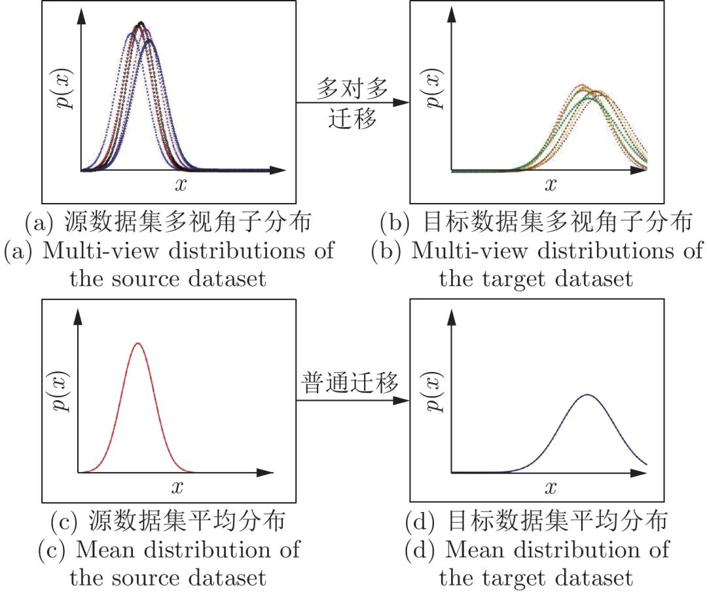
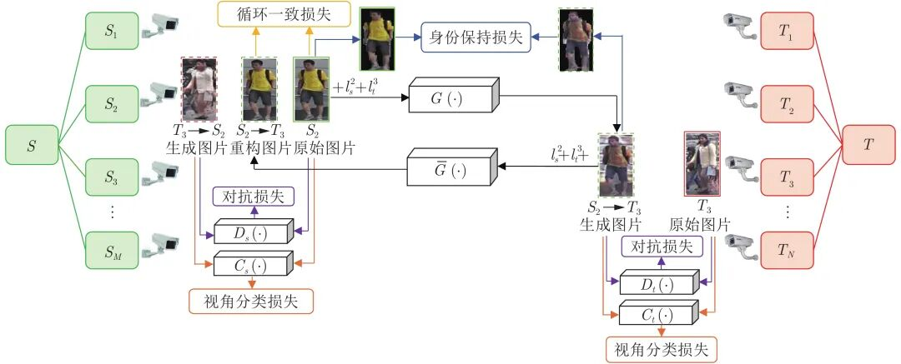
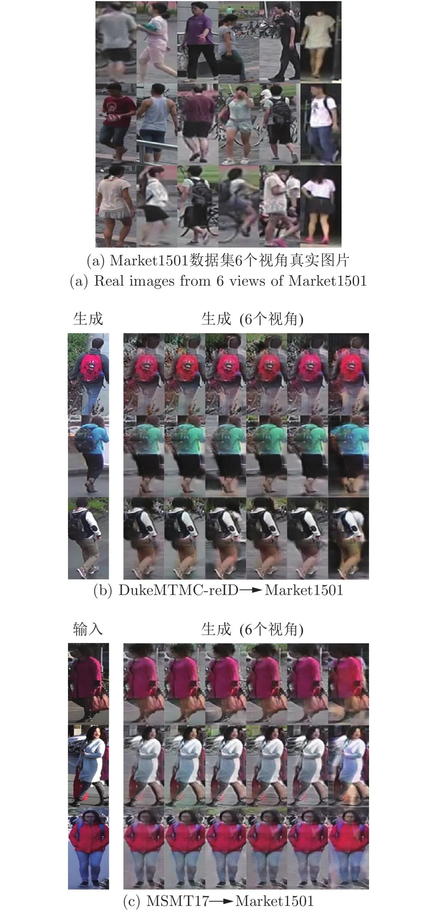

# 基于多对多生成对抗网络的非对称跨域迁移行人再识别

原创 自动化学报 自动化学报 2022-04-11 17:13 北京

> 原文地址: [https://mp.weixin.qq.com/s/AAfblYZvgDk5Wd0oVFNxog](https://mp.weixin.qq.com/s/AAfblYZvgDk5Wd0oVFNxog)

**点击蓝字|关注我们**

  

**引用本文**

  

梁文琦, 王广聪, 赖剑煌. 基于多对多生成对抗网络的非对称跨域迁移行人再识别. 自动化学报, 2022, 48(1): 103−120 doi: 10.16383/j.aas.c190303

Liang Wen-Qi, Wang Guang-Cong, Lai Jian-Huang. Asymmetric cross-domain transfer learning of person re-identification based on the many-to-many generative adversarial network. Acta Automatica Sinica, 2022, 48(1): 103−120 doi: 10.16383/j.aas.c190303

http://www.aas.net.cn/cn/article/doi/10.16383/j.aas.c190303?viewType=HTML

  

**文章简介**

  

**关键词**

  

行人再识别, 多对多跨域迁移, 非监督迁移学习, 生成对抗网络

  

**摘   要**

  

无监督跨域迁移学习是行人再识别中一个非常重要的任务. 给定一个有标注的源域和一个没有标注的目标域, 无监督跨域迁移的关键点在于尽可能地把源域的知识迁移到目标域. 然而, 目前的跨域迁移方法忽略了域内各视角分布的差异性, 导致迁移效果不好. 针对这个缺陷, 本文提出了一个基于多视角的非对称跨域迁移学习的新问题. 为了实现这种非对称跨域迁移, 提出了一种基于多对多生成对抗网络(Many-to-many generative adversarial network, M2M-GAN)的迁移方法. 该方法嵌入了指定的源域视角标记和目标域视角标记作为引导信息, 并增加了视角分类器用于鉴别不同的视角分布, 从而使模型能自动针对不同的源域视角和目标域视角组合采取不同的迁移方式. 在行人再识别基准数据集Market1501、DukeMTMC-reID和MSMT17上, 实验验证了本文的方法能有效提升迁移效果, 达到更高的无监督跨域行人再识别准确率.

  

**引   言**

  

行人再识别是指在非重叠的摄像头视角下检索特定的目标行人图片或视频片段, 它是多摄像机跟踪、搜索取证等重要应用中的关键技术, 广泛应用于智能视频监控网络中. 行人再识别最初的研究方法是先设计一种能够描述行人图片的手工视觉特征, 再建立一个鲁棒的距离度量模型来度量视觉特征之间的相似性. 近年来, 随着深度学习的发展, 大部分研究者转向使用深度学习来处理行人再识别问题. 文献\[16-18\]分别提出了基于分类损失、验证损失、三元组损失的行人再识别基本框架. 为了处理行人图像不对齐的问题, 文献\[19-20\]分别提出全局区域和局部区域的对齐方法, 文献\[21\]提出动态的特征对齐方法. 为了处理摄像头之间的差异, 文献\[22\]提出使用多组生成对抗网络在同域内的多个视角之间进行迁移, 以此缩小域内不同视角之间的差别. 为了进一步提高识别准确率, 最近有很多文献尝试使用额外的标注信息作为辅助. 例如文献\[23\]提出人体姿势驱动的深度卷积模型, 文献\[24\]引入行人属性标记, 文献\[25-26\]加入了人体掩模, 文献\[27\]提出在检索过程中加入时空约束.

  

得益于深度学习的发展, 如今行人再识别任务在大规模数据集上已经取得了良好的效果, 但需要大量带标注的训练数据. 然而, 与其他检索任务不同, 收集带标注的行人再识别训练数据更加困难. 标注数据的难点在于, 行人再识别数据集没有固定的类别, 多人合作标注很困难; 而且图像分辨率低, 不容易辨别. 为了更符合实际场景的应用需求, 科研人员开始研究如何在目标数据集没有标注信息的前提下实现行人再识别. 在这种背景下, 非监督行人再识别(Unsupervised person re-identification)成为新的研究热点.

  

目前, 非监督行人再识别有两类主要的研究方法. 第1类是基于聚类的非监督学习方法. 文献\[28\]提出一种基于聚类的非对称度量学习方法, 利用非对称聚类学习把不同视角的数据投影到共享空间中. 文献\[29\]提出基于聚类和微调的非监督深度学习框架. 该方法先使用预训练的神经网络模型提取目标数据集的特征, 然后通过聚类算法得到目标数据集的伪标签, 再利用伪标签对预训练的网络进行微调(Fine-tune). 文献\[30\]在文献\[29\]的框架上再进行改进, 提出一种自底向上逐层合并最相近簇的聚类方法.

  

非监督行人再识别的第2类研究方法是跨域迁移学习方法(Cross-domain transfer learning). 这类方法通常都有带标注的行人再识别数据集作为辅助, 这个辅助的数据集称为源数据集或源域(Source domain), 实际应用场景对应的无标注数据集称为目标数据集或目标域(Target domain). 由于只有源域是有标注的, 所以这类方法的关键之处在于尽可能地把从源域中学习到的知识迁移到目标域中. 文献\[31\]通过添加域分类器和梯度反传网络层来实现域适应. 文献\[32\]提出一种跨域自适应的Ranking SVM (Support vector machine)方法, 利用了源域的正负样本、目标域的负样本和目标域估计的正样本均值来训练. 文献\[33-34\]则提出两阶段的跨域迁移学习方法: 首先利用生成对抗网络实现源域数据分布到目标域数据分布的变换, 根据变换前源域数据的标签对变换后的图片进行标注; 然后使用变换后的图片及其对应的标注进行有监督训练.

  

跨域迁移学习方法对目标域训练集(无标注数据)的数据分布限制更少, 应用范围更广泛, 更加适合实际的行人再识别应用场景. 但是现有的跨域迁移学习方法没有考虑视角偏差(View-specific bias)问题, 源域中不同视角(摄像机)的数据以完全相同的迁移方式变换到目标域中. 也就是说, 目前的迁移方式都是对称的(对称迁移). 然而在智能监控视频网络中, 不同拍摄地点的光照条件、拍摄角度以及摄像机本身的参数都可能存在明显的差别, 不同摄像头拍摄到的图片往往服从不同的分布. 在跨域迁移学习时, 忽略摄像头的分布差异一方面会导致迁移效果不佳, 另一方面会导致迁移后的数据无法体现出目标域多个视角子分布的情况, 从而不利于训练跨视角匹配模型.

  

基于以上分析, 本文提出基于多视角(摄像机)的非对称跨域迁移学习方法. 在基于生成对抗网络的两阶段跨域迁移学习方法基础上, 本文针对视角之间的差异问题进行建模. 为了对每种源域−目标域视角组合使用不同的迁移方式(称为非对称迁移), 一个最简单直观的想法是把每个视角的数据看成是各自独立的, 然后训练多组互不相干的生成对抗网络模型, 每个模型分别把知识从源域的某个视角迁移到目标域的某个视角. 然而, 这种不同视角组合使用不同网络参数的非对称迁移方式非常消耗训练时间和存储空间. 假如源域有M个视角, 目标域有N个视角, 则一共需要训练M×N组生成对抗网络. 大型智能监控网络涉及的摄像头数目非常多, 显然这种方法是不切实际的. 除此之外, 单独使用每对视角的数据来训练生成对抗网络无法利用数据集内不同视角数据之间的相关性. 为了解决独立训练而造成成本太高的问题, 并尽可能地利用不同视角数据的相关性, 本文提出把非对称迁移学习嵌入到一组生成对抗网络中. 为此, 我们设计了一个多对多生成对抗网络(Many-to-many generative adversarial network, M2M-GAN), 同时实现源域任意视角子分布到目标域任意视角子分布的转换. 实验表明, 与现有的对称迁移方法(不考虑视角差异, 且仅有一组生成对抗网络网络)相比, 我们的方法只需增加少量训练时间和空间成本就能有效提升识别准确率. 与单独训练多组生成对抗网络这种简单的建模方式(考虑视角差异, 但需M×N组生成对抗网络)相比, 我们的方法在训练成本和识别准确率两方面都取得更优的性能.

  

本文的主要贡献: 

  

1)针对源域或者目标域存在多个具有差异性的子分布问题, 本文提出一种多对多的跨域迁移模型来区别对待源域不同的子分布到目标域不同的子分布的迁移. 本文将这种区分性的迁移模式称为非对称迁移. 为了更好地优化非对称迁移学习模型, 本文提出了一种基于多对多生成对抗网络(M2M-GAN)的迁移学习方法, 同时实现把源域任意子分布的图像风格转变成目标域任意子分布的图像风格. 

  

2)视角偏差或摄像机差异是跨域迁移行人再识别领域被忽略的一个关键问题. 本文将M2M-GAN方法应用于该领域, 生成了具有视角差异且服从目标域各个视角子分布的行人图片, 进而使得模型学习到的特征具有视角偏差不变性, 有效提升了无监督跨域迁移行人再识别的准确率. 

  

3)在Market-1501, DukeMTMC-reID和MSMT17三个大规模多摄像头行人再识别基准数据集上, 实验结果验证了M2M-GAN的有效性.

  

图 2  本文提出的多视角对多视角迁移方式与现有迁移方式的比较

  

图 3  多对多生成对抗网络框架(省略了目标域→→源域的生成过程、循环一致损失和身份保持损失)

  

图 7  其他数据集迁移到Market数据集的可视化例子

  

请点击左下角“**阅读原文**”了解更多！

  

**作者简介**

**梁文琦**

中山大学计算机学院硕士研究生. 2018年获中山大学计算机科学与技术学士学位. 主要研究方向为行人再识别和深度学习.

E-mail: liangwq8@mail2.sysu.edu.cn

**王广聪**

中山大学计算机学院博士研究生. 2015年获吉林大学通信工程学院学士学位. 主要研究方向为行人再识别和深度学习.

E-mail: wanggc3@mail2.sysu.edu.cn

**赖剑煌**

中山大学教授. 1999年获得中山大学数学系博士学位. 目前在IEEE Transactions on Pattern Analysis and Machine Intelligence (TPAMI), IEEE Transactions on Neural Networks and Learning Systems (TNNLS), IEEE Transactions on Image Processing (TIP), IEEE Transactions on Systems, Man, and Cybernetics Part B — Cybernetics (TSMC-B), Pattern Recognition (PR), IEEE International Conference on Computer Vision (ICCV), IEEE Conference on Computer Vision and Pattern Recognition (CVPR),IEEE International Conference on Data Mining (ICDM)等国际权威刊物发表论文200多篇. 主要研究方向为图像处理, 计算机视觉, 模式识别. 本文通信作者.

E-mail: stsljh@mail.sysu.edu.cn

  

**相关文章**

**（请向上滑动阅读）**

  

\[1\]   尹明, 吴浩杨, 谢胜利, 杨其宇. 基于自注意力对抗的深度子空间聚类. 自动化学报, 2022, 48(1): 271-281. doi: 10.16383/j.aas.c200302

http://www.aas.net.cn/cn/article/doi/10.16383/j.aas.c200302?viewType=HTML

  

\[2\]   胡铭菲, 左信, 刘建伟. 深度生成模型综述. 自动化学报, 2022, 48(1): 40-74. doi: 10.16383/j.aas.c190866

http://www.aas.net.cn/cn/article/doi/10.16383/j.aas.c190866?viewType=HTML

  

\[3\]   钱锦浩, 宋展仁, 郭春超, 赖剑煌, 谢晓华. 基于时空共现模式的视觉行人再识别. 自动化学报, 2022, 48(2): 408-417. doi: 10.16383/j.aas.c200897

http://www.aas.net.cn/cn/article/doi/10.16383/j.aas.c200897?viewType=HTML

  

\[4\]   林泓, 任硕, 杨益, 张杨忆. 融合自注意力机制和相对鉴别的无监督图像翻译. 自动化学报, 2021, 47(9): 2226-2237. doi: 10.16383/j.aas.c190074

http://www.aas.net.cn/cn/article/doi/10.16383/j.aas.c190074?viewType=HTML

  

\[5\]   蒋芸, 谭宁. 基于条件深度卷积生成对抗网络的视网膜血管分割. 自动化学报, 2021, 47(1): 136-147. doi: 10.16383/j.aas.c180285

http://www.aas.net.cn/cn/article/doi/10.16383/j.aas.c180285?viewType=HTML

  

\[6\]  赖轩, 曲延云, 谢源, 裴玉龙. 基于拓扑一致性对抗互学习的知识蒸馏. 自动化学报. doi: 10.16383/j.aas.200665

http://www.aas.net.cn/cn/article/doi/10.16383/j.aas.200665?viewType=HTML

  

\[7\]   张宁, 王永成, 张欣, 徐东东. 基于深度学习的单幅图片超分辨率重构研究进展. 自动化学报, 2020, 46(12): 2479-2499. doi: 10.16383/j.aas.c190031

http://www.aas.net.cn/cn/article/doi/10.16383/j.aas.c190031?viewType=HTML

  

\[8\]   刘建伟, 谢浩杰, 罗雄麟. 生成对抗网络在各领域应用研究进展. 自动化学报, 2020, 46(12): 2500-2536. doi: 10.16383/j.aas.c180831

http://www.aas.net.cn/cn/article/doi/10.16383/j.aas.c180831?viewType=HTML

  

\[9\]   孔锐, 蔡佳纯, 黄钢. 基于生成对抗网络的对抗攻击防御模型. 自动化学报. doi: 10.16383/j.aas.2020.c200033

http://www.aas.net.cn/cn/article/doi/10.16383/j.aas.2020.c200033?viewType=HTML

  

\[10\]   胡旭光, 马大中, 郑君, 张化光, 王睿. 基于关联信息对抗学习的综合能源系统运行状态分析方法. 自动化学报, 2020, 46(9): 1783-1797. doi: 10.16383/j.aas.c200171

http://www.aas.net.cn/cn/article/doi/10.16383/j.aas.c200171?viewType=HTML

  

\[11\]   付晓, 沈远彤, 李宏伟, 程晓梅. 基于半监督编码生成对抗网络的图像分类模型. 自动化学报, 2020, 46(3): 531-539. doi: 10.16383/j.aas.c180212

http://www.aas.net.cn/cn/article/doi/10.16383/j.aas.c180212?viewType=HTML

  

\[12\]   刘一敏, 蒋建国, 齐美彬, 刘皓, 周华捷. 融合生成对抗网络和姿态估计的视频行人再识别方法. 自动化学报, 2020, 46(3): 576-584. doi: 10.16383/j.aas.c180054

http://www.aas.net.cn/cn/article/doi/10.16383/j.aas.c180054?viewType=HTML

  

\[13\]   吴彦丞, 陈鸿昶, 李邵梅, 高超. 基于行人属性先验分布的行人再识别. 自动化学报, 2019, 45(5): 953-964. doi: 10.16383/j.aas.c170691

http://www.aas.net.cn/cn/article/doi/10.16383/j.aas.c170691?viewType=HTML

  

\[14\]   孙亮, 韩毓璇, 康文婧, 葛宏伟. 基于生成对抗网络的多视图学习与重构算法. 自动化学报, 2018, 44(5): 819-828. doi: 10.16383/j.aas.2018.c170496

http://www.aas.net.cn/cn/article/doi/10.16383/j.aas.2018.c170496?viewType=HTML

  

\[15\]  张一珂, 张鹏远, 颜永红. 基于对抗训练策略的语言模型数据增强技术. 自动化学报, 2018, 44(5): 891-900. doi: 10.16383/j.aas.2018.c170464

http://www.aas.net.cn/cn/article/doi/10.16383/j.aas.2018.c170464?viewType=HTML

  

\[16\]   赵树阳, 李建武. 基于生成对抗网络的低秩图像生成方法. 自动化学报, 2018, 44(5): 829-839. doi: 10.16383/j.aas.2018.c170473

http://www.aas.net.cn/cn/article/doi/10.16383/j.aas.2018.c170473?viewType=HTML

  

\[17\]   张龙, 赵杰煜, 叶绪伦, 董伟. 协作式生成对抗网络. 自动化学报, 2018, 44(5): 804-810. doi: 10.16383/j.aas.2018.c170483

http://www.aas.net.cn/cn/article/doi/10.16383/j.aas.2018.c170483?viewType=HTML

  

\[18\]   李幼蛟, 卓力, 张菁, 李嘉锋, 张辉. 行人再识别技术综述. 自动化学报, 2018, 44(9): 1554-1568. doi: 10.16383/j.aas.2018.c170505

http://www.aas.net.cn/cn/article/doi/10.16383/j.aas.2018.c170505?viewType=HTML

  

\[19\]   唐贤伦, 杜一铭, 刘雨微, 李佳歆, 马艺玮. 基于条件深度卷积生成对抗网络的图像识别方法. 自动化学报, 2018, 44(5): 855-864. doi: 10.16383/j.aas.2018.c170470

http://www.aas.net.cn/cn/article/doi/10.16383/j.aas.2018.c170470?viewType=HTML

  

\[20\]   齐美彬, 檀胜顺, 王运侠, 刘皓, 蒋建国. 基于多特征子空间与核学习的行人再识别. 自动化学报, 2016, 42(2): 299-308. doi: 10.16383/j.aas.2016.c150344

http://www.aas.net.cn/cn/article/doi/10.16383/j.aas.2016.c150344?viewType=HTML

  

**近期文章**

  

[【热点专题】目标检测](http://mp.weixin.qq.com/s?__biz=MzI2NjA3MzM5MA==&mid=2649962259&idx=1&sn=97b0c31ec704211713ef8cba4bb51b01&chksm=f2943352c5e3ba44f2c7217cff60405765c6d67312beb6d07006155404bfc4b34268956697f5&scene=21#wechat_redirect)

[《自动化学报》2022年第03期目录分享](http://mp.weixin.qq.com/s?__biz=MzAwMzAzMDgxOA==&mid=2651075527&idx=1&sn=bc020c5fd09080243f7527610b003507&chksm=8131f98ab646709c2f485852b526989a3b9af5cc93e8afb508d9239b78176f49caa9807d6a8d&scene=21#wechat_redirect)

[2022斯坦福AI指数报告出炉！点击获取完整报告](http://mp.weixin.qq.com/s?__biz=MzAwMzAzMDgxOA==&mid=2651075236&idx=3&sn=1caed46e80f613c172a227ead8ddc1a3&chksm=8131f8e9b64671ffa8d6f7c8a36210fe1e262a66a42ab9a544e064d3c725b4a31274a4551750&scene=21#wechat_redirect)

[黄艳龙, 徐德, 谭民. 机器人运动轨迹的模仿学习综述](http://mp.weixin.qq.com/s?__biz=MzAwMzAzMDgxOA==&mid=2651075236&idx=1&sn=ec575c249f6e60709a32a7dfa6b55f37&chksm=8131f8e9b64671ffaf5de201407410a38735b35d7f4e6ab43eb05dac537068fb912ceef808c1&scene=21#wechat_redirect)

[CVPR 2022 | 自动化所新作速览！（上）](http://mp.weixin.qq.com/s?__biz=MzAwMzAzMDgxOA==&mid=2651075034&idx=2&sn=48b5232daaa7a51da96c3a7c87013e2d&chksm=8131fb97b6467281dc8e02749df8d0388f89d30e3b08f44d13c700169d1d7a22c4feef9f2dba&scene=21#wechat_redirect)

[CVPR 2022 | 自动化所新作速览！（下）](http://mp.weixin.qq.com/s?__biz=MzAwMzAzMDgxOA==&mid=2651075034&idx=3&sn=21833bb312bb0d9826c64c9fce068aa5&chksm=8131fb97b646728147f2bff58a04230d708d5a4537eb824656c2d54580b11f6a47b0eb30ade6&scene=21#wechat_redirect)

[直播回放分享 | 陈关荣教授：探索最优同步网络的拓扑结构](http://mp.weixin.qq.com/s?__biz=MzIxMjA5Njg2Nw==&mid=2649061608&idx=1&sn=1500a81260d8f5127b7cb7767c759fba&chksm=8f5a9ae4b82d13f201b714d8e96af9bbddf442bb7e10c97416fb925ab2170c05fa12010fb1d1&scene=21#wechat_redirect)

  

**热点文章**

  

[《自动化学报》2019年高关注论文](http://mp.weixin.qq.com/s?__biz=MzAwMzAzMDgxOA==&mid=2651073450&idx=1&sn=6f57bd0df73f259aa416575f1f69bdfb&chksm=8131e1e7b64668f1344de4acdef6148e8dcfa60c80e4f48e6cb1270558c2beade5601e92d05c&scene=21#wechat_redirect)

[《自动化学报》2021年热点文章回顾](http://mp.weixin.qq.com/s?__biz=MzAwMzAzMDgxOA==&mid=2651072577&idx=1&sn=4e6be077d7371c7d29d9a371d8defe19&chksm=8131e20cb6466b1aec2f3b8b1063d3be11725ca9a0c15785c3b42a638170e732acd0d8d345e0&scene=21#wechat_redirect)

[国家自然科学基金论文精选](http://mp.weixin.qq.com/s?__biz=MzI2NjA3MzM5MA==&mid=2649960308&idx=1&sn=1634c999f22588333537f13393403f9c&chksm=f2942b35c5e3a2232e86b51c2b7c8f37a4d3d7f858d370d76d5afd00567d7da6e9543476d120&scene=21#wechat_redirect)  

[国家重点研发计划论文精选](http://mp.weixin.qq.com/s?__biz=MzI2NjA3MzM5MA==&mid=2649960255&idx=1&sn=f48435928fd924134cb72014860b9d00&chksm=f2942b7ec5e3a26869da68a1419b3b40ca1e6cb98abf2e380d78a49ffb99c85991d76cc346b0&scene=21#wechat_redirect)

[中国科学院自动化研究所高层次人才招聘启事 | 长期有效](http://mp.weixin.qq.com/s?__biz=MzI2NjA3MzM5MA==&mid=2649959451&idx=1&sn=657b7e4aeeaa88114d5189641c5409dc&chksm=f294285ac5e3a14cd230a2b9678c32ba9bf92e8ffc9d61d506c5ffea2df793456dd37c2c6fb1&scene=21#wechat_redirect)

  

**期刊动态**

  

[自动化学报（英文版）和自动化学报入选计算领域高质量科技期刊T1类](http://mp.weixin.qq.com/s?__biz=MzAwMzAzMDgxOA==&mid=2651073859&idx=2&sn=7a9192717637dcf6cddb39ed961e8c3b&chksm=8131e70eb6466e188a123c504bdeba80c75681de4762f8685b3bf584bc33eb12362c70613b4e&scene=21#wechat_redirect)

[《自动化学报》编辑部防诈骗公告](http://mp.weixin.qq.com/s?__biz=MzAwMzAzMDgxOA==&mid=2651073517&idx=1&sn=c52de7c685e546af9faffc0cefab1c85&chksm=8131e1a0b64668b63ebaa68ea81cbaec3b94dc52ea8360821a0a49e67ae7e4b428a25d0f19c5&scene=21#wechat_redirect)

[《自动化学报》致谢审稿人](http://mp.weixin.qq.com/s?__biz=MzI2NjA3MzM5MA==&mid=2649961201&idx=1&sn=3142842d75c441ae860c1ecb313c7657&chksm=f29436b0c5e3bfa6c679210f60513eb1a7205dc20fe028f482bb593eac60427e4e56fba12493&scene=21#wechat_redirect)

[自动化学报多篇论文入选中国百篇最具影响国内论文和中国精品期刊顶尖论文](http://mp.weixin.qq.com/s?__biz=MzI2NjA3MzM5MA==&mid=2649961152&idx=1&sn=4a5e9e4b84879f4cde4e13a0ef97272c&chksm=f2943681c5e3bf97d7770c9623dac869b283b3ea83f3d320017974033e361d8b999134a8bdff&scene=21#wechat_redirect)

[自动化学报各项主要指标蝉联第1，再获百种中国杰出期刊称号](http://mp.weixin.qq.com/s?__biz=MzI2NjA3MzM5MA==&mid=2649960903&idx=1&sn=7da8b8a0167e16bcbaa1f00fbfb69782&chksm=f2943586c5e3bc9014f6d4fff7147b998ae42b4da452907e641e8029f296fd2413b4f17aef62&scene=21#wechat_redirect)

  

**期刊目录**

  

[2022年第03期](http://mp.weixin.qq.com/s?__biz=MzAwMzAzMDgxOA==&mid=2651075527&idx=1&sn=bc020c5fd09080243f7527610b003507&chksm=8131f98ab646709c2f485852b526989a3b9af5cc93e8afb508d9239b78176f49caa9807d6a8d&scene=21#wechat_redirect)

[2022年第02期](http://mp.weixin.qq.com/s?__biz=MzI2NjA3MzM5MA==&mid=2649961838&idx=1&sn=29334896aa0f372b70312250c75b6b20&chksm=f294312fc5e3b8392ffd49100eaba435bf48fa9234c5019fe7b16ed1e4ebef70be58691f3fb3&scene=21#wechat_redirect)

[2022年第01期](http://mp.weixin.qq.com/s?__biz=MzI2NjA3MzM5MA==&mid=2649961423&idx=1&sn=3b65958faa7c7f94c247f46dd72bd71e&chksm=f294378ec5e3be9825f860d132c36c97f3e877089449cb1fe85a6d1e7da9bd0e24795336bc54&scene=21#wechat_redirect)

[《自动化学报》2021年全年合集](http://mp.weixin.qq.com/s?__biz=MzAwMzAzMDgxOA==&mid=2651072770&idx=1&sn=7c531f7fa3bc390558fab15b339ce86e&chksm=8131e34fb6466a59ed079448fddda0fc9f97066460bff8f6835288003a1fba2812de383813c1&scene=21#wechat_redirect)

[《自动化学报》2020年全年合集](http://mp.weixin.qq.com/s?__biz=MzI2NjA3MzM5MA==&mid=2649957972&idx=1&sn=1951847aacbcb7d22bdd2a46a79af871&chksm=f2942215c5e3ab03d070d8e52b8764b38036897c97b6a26c7a1f918c806b28edbe6c0fbf7ea9&scene=21#wechat_redirect)

[2020年第10期 工业人工智能专题](http://mp.weixin.qq.com/s?__biz=MzI2NjA3MzM5MA==&mid=2649957201&idx=1&sn=ab82a767bd716ab67fdf2942500d8b61&chksm=f2942710c5e3ae06b27f9e63a5e329a1123d90b051164e6b6123c500230541b1ed12d92abbfb&scene=21#wechat_redirect)

[2020年第09期 分布式信息能源系统理论与应用专题](http://mp.weixin.qq.com/s?__biz=MzI2NjA3MzM5MA==&mid=2649956412&idx=1&sn=8ebc13d63fd333ad85dbb8b5825df248&chksm=f294247dc5e3ad6ba297857a5b957e97cf499266c50318791fa8abd9432ecf1d9c3d9b287e36&scene=21#wechat_redirect)

  

  

  

**长按二维码｜关注我们**

**IEEE/CAA Journal of Automatica Sinica (JAS)**

**长按二维码｜关注我们**

**《自动化学报》服务号**

**长按二维码｜关注我们**

**《自动化学报》订阅号**  

  

**联系我们**

**网站:** 

http://www.aas.net.cn

http://www.ieee-jas.net

**投稿:** 

https://mc03.manuscriptcentral.com/aas-cn   

https://mc03.manuscriptcentral.com/ieee-jas 

**电话:**

010-82544653（日常咨询和稿件处理）           

010-82544677（录用后稿件处理）

**邮箱:** 

aas@ia.ac.cn（日常咨询和稿件处理）

aas\_editor@ia.ac.cn（录用后稿件处理）

**博客:** 

http://blog.sina.com.cn/aaseditor 

  

**点击****阅读原文** **了解更多**