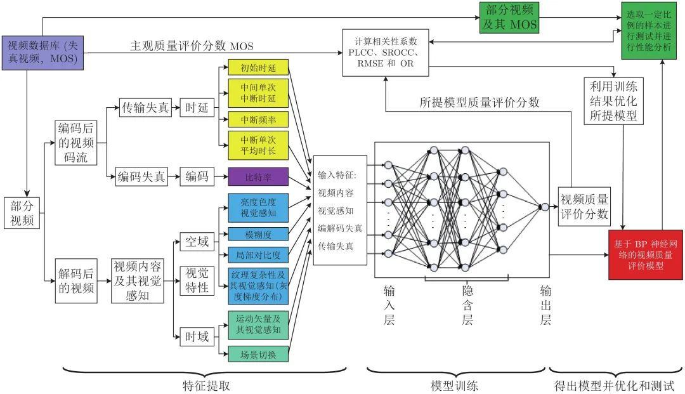
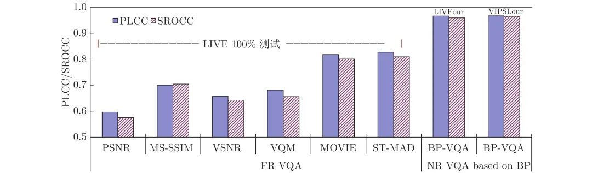
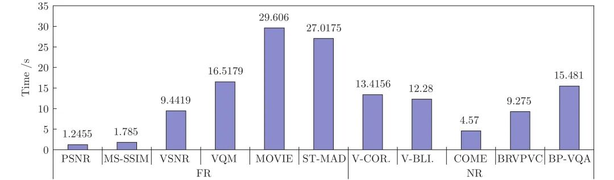

# 基于多层BP神经网络的无参考视频质量客观评价

原创 自动化学报 自动化学报 2022-03-30 16:10 北京

> 原文地址: [https://mp.weixin.qq.com/s/ZpI-66aRD-FtWKyH0yB0BQ](https://mp.weixin.qq.com/s/ZpI-66aRD-FtWKyH0yB0BQ)

**点击蓝字|关注我们**

  

**引用本文**

  

姚军财, 申静, 黄陈蓉. 基于多层BP神经网络的无参考视频质量客观评价. 自动化学报, 2022, 48(2): 594−607 doi: 10.16383/j.aas.c190539

Yao Jun-Cai, Shen Jing, Huang Chen-Rong. No reference video quality objective assessment based on multilayer BP neural network. Acta Automatica Sinica, 2022, 48(2): 594−607 doi: 10.16383/j.aas.c190539

http://www.aas.net.cn/cn/article/doi/10.16383/j.aas.c190539?viewType=HTML

  

**文章简介**

  

**关键词**

  

视频质量评价, 神经网络, 时延, 视频内容

  

**摘   要**

  

机器学习在视频质量评价(Video quality assessment, VQA)模型回归方面具有较大的优势, 能够较大地提高构建模型的精度. 基于此, 设计了合理的多层BP神经网络, 并以提取的失真视频的内容特征、编解码失真特征、传输失真特征及其视觉感知效应特征参数为输入, 通过构建的数据库中的样本对其进行训练学习, 构建了一个无参考VQA模型. 在模型构建中, 首先采用图像的亮度和色度及其视觉感知、图像的灰度梯度期望值、图像的模糊程度、局部对比度、运动矢量及其视觉感知、场景切换特征、比特率、初始时延、单次中断时延、中断频率和中断平均时长共11个特征, 来描述影响视频质量的4个主要方面, 并对建立的两个视频数据库中的大量视频样本, 提取其特征参数; 再以该特征参数作为输入, 对设计的多层BP神经网络进行训练, 从而构建VQA模型; 最后, 对所提模型进行测试, 同时与14种现有的VQA模型进行对比分析, 研究其精度、复杂性和泛化性能. 实验结果表明: 所提模型的精度明显高于其14种现有模型的精度, 其最低高出幅度为4.34 %; 且优于该14种模型的泛化性能, 同时复杂性处于该15种模型中的中间水平. 综合分析所提模型的精度、泛化性能和复杂性表明, 所提模型是一种较好的基于机器学习的VQA模型.

  

**引   言**

  

视频技术的发展和应用改变了人们传统的生活、工作和学习等方式. 由此, 视频质量成为一个不可回避的重点话题. 实时、有效和便捷的视频质量评价(Video quality assessment, VQA)方法, 是保障视频有效通信的前提.

  

视频质量主要受到来自视频内容、编解码、传输环境和人类感知4个大的方面因素的影响. 视频的压缩编码给视频带来模糊、块效应等损伤; 视频传输中的缓冲延时、卡顿、误码等问题造成视频图像模糊、播放停顿等情况, 均会影响网络视频质量, 使得用户体验质量下降; 对于视频内容, 相同的外在环境但不同的视频内容给人的感知效果也有较大的不同, 视频内容同样是影响视频质量的重要因素; 人类是视频质量的最后接受者和评价者, 视频质量评价结果需要符合人类视觉特性. 由此, 在VQA中需要考虑上述4个大的方面的影响.

  

VQA一般分为3类: 全参考(Full-reference, FR)、部分参考(Reduced-reference, RR)和无参考(No-reference, NR)视频质量评价. 截止目前, 现有的大多数VQA模型均是FR和RR, 其典型的有 PSNR (Peak signal-to-noise ratio)、VSNR (Visual signal-to-noise ratio)、SSIM (Structural similarity index)、VQM (Video quality model)、ST-MAD (Spatiotemporal most apparent distortion algorithm)、MOVIE (Motion-based video integrity evaluation)模型等. 对于NR-VQA, 其不需要任何来源, 该方法进一步分为两类: 1) NR-P (NR视觉感知)类型, 其用于完全解码的视频质量的评价; 2) NR-B (NR编码)类型, 其使用从比特流中提取的信息来评价视频质量. 另外, 神经网络方法在VQA模型回归方面具有较大的优势, 能够较大地提高构建模型的精度, 且由于NR-VQA不需要源视频, 其在视频传输中具有重要的实际应用价值, 因而, 结合神经网络的无参考视频质量评价方法成为视频通信的热门研究课题. 近些年报道相关领域的研究成果主要有VQAUCA (NR VQA using codec analysis)、V-CORNIA (Video codebook representation for NR image assessment)、C-VQA (NR VQA method in the compressed domain)、NR-DCT (Discrete cosine transform-based NR VQA model)、V-BLIINDS (Blind VQA algorithm)、NVSM (NR VQM using natural video statistical model)、3D-DCT (NR-VQA metric based on 3D discrete cosine transform domain)和COME (NR VQA method based on convolutional NN and multiregression)等NR-VQA模型, 但其目前仍存在较多问题, 主要有:

  

1)失真特征提取数量问题: 在视频通信中, 可能会产生多种类型的视频失真, 在构建NR-VQA模型中, 虽然提取更多的视频失真特征可以提高其评估精度, 但同时也增加了其复杂度. 因此, 构建NR-VQA模型时应尽量提取少量但有效的失真特征, 但这个度非常难把握;

  

2)视频内容及其视觉感知问题: 现有的NR-VQA模型通常只关注于传输造成的视频失真, 很少考虑视频内容及其视觉感知效果对视频质量的影响. 因此, 其主客观评价结果一致性较差, 需要结合二者提高精度;

  

3) HVS特性问题: 在VQA中引入合适有效的HVS (Human visual system)感知特性能够显著性提高VQA评价精度. 但是, 如果使用从比特流中提取的失真特征来构建NR-VQA模型时, 则很难有效地在模型中引入HVS特性. 因此, 目前一般将VQA-B度量和VQA-P度量相结合, 构建综合的NR-VQA模型, 从而提高了模型的精度;

  

4)模型的复杂性问题: 在视频通信中, VQA需要实时进行, 其要求模型尽可能简单但有效. 然而, VQA模型往往引入了部分HVS特性, 并且依赖于更多的视频失真特性, 同时, 采用了机器学习方法, 因此, 现有的NR-VQA模型往往非常复杂. 因此, 在构建模型时, 需要对这些特征和方法进行适当的选择, 并对相应的参数进行优化;

  

5)泛化性问题: 在NR-VQA中, 其方法往往使用机器学习工具获得视频质量评价分数, 然而, 机器学习需要训练样本; 目前, 其常见方法是使用视频数据库中的部分样本进行训练, 而其余部分进行测试, 其实验结果表明, 如此方式, VQA模型精度较高; 然而, 当测试其他数据库中的视频时, 其模型精度则显著下降. 实验表明, 基于机器学习方法的VQA模型的泛化性能往往较差. 因此, 有必要对VQA模型进行优化, 提高泛化性能.

  

6)模型精度问题: 对于基于机器学习方法的NR-VQA, 往往选取的样本素材、测试和训练样本的比例、不同测试数据库样本等对评价模型的精度有较大的影响. 因此, 在模型构建时需要从样本的多个方面来考虑, 以提高精度.

  

基于此, 在本研究中, 针对上述影响视频质量的4个大的方面, 结合多层BP神经网络研究了无参考视频质量评价方法, 并与现有模型进行对比分析, 研究了其精度、复杂性和泛化性能.

  

图 1  基于多层BP神经网络的无参考视频质量客观评价方法流程图

  

图 9  所提BP-VQA模型与6种现有FR-VQA模型的精度对比

  

图 10  所提模型与10种现有VQA模型的运算耗时对比

  

**作者简介**

**姚军财**

博士, 南京工程学院计算机工程学院教授.主要研究方向为图像和视频处理, 计算机视觉与模式识别. 本文通信作者.

E-mail: yjc4782@163.com

**申   静**

南京工程学院计算机工程学院副教授. 主要研究方向为图像和视频处理, 多媒体技术和人工智能.

E-mail: shenjingtg@163.com

**黄陈蓉**

博士, 南京工程学院计算机工程学院教授. 主要研究方向为图像分割和编码, 计算机视觉与模式识别.

E-mail: huangcr@njit.edu.cn

  

**相关文章**

**（请向上滑动阅读）**

  

\[1\]  南栋, 毕笃彦, 马时平, 凡遵林, 何林远. 基于分类学习的去雾后图像质量评价算法. 自动化学报, 2016, 42(2): 270-278. doi: 10.16383/j.aas.2016.c140854

http://www.aas.net.cn/cn/article/doi/10.16383/j.aas.2016.c140854?viewType=HTML

  

\[2\]  冯欣, 杨丹, 张凌. 基于视觉注意力变化的网络丢包视频质量评估. 自动化学报, 2011, 37(11): 1322-1331. doi: 10.3724/SP.J.1004.2011.01322

http://www.aas.net.cn/cn/article/doi/10.3724/SP.J.1004.2011.01322

  

\[3\]  唐贤伦, 杜一铭, 刘雨微, 李佳歆, 马艺玮. 基于条件深度卷积生成对抗网络的图像识别方法. 自动化学报, 2018, 44(5): 855-864. doi: 10.16383/j.aas.2018.c170470

http://www.aas.net.cn/cn/article/doi/10.16383/j.aas.2018.c170470?viewType=HTML

  

\[1\]  李秀英, 尹帅, 孙书利. 传感器饱和的非线性网络化系统模糊H∞滤波. 自动化学报, 2021, 47(5): 1149-1158. doi: 10.16383/j.aas.c180778

http://www.aas.net.cn/cn/article/doi/10.16383/j.aas.c180778

  

\[2\]  徐君, 张国良, 曾静, 孙巧, 羊帆. 具有时延和切换拓扑的高阶离散时间多智能体系统鲁棒保性能一致性. 自动化学报, 2019, 45(2): 360-373. doi: 10.16383/j.aas.2017.c160758

http://www.aas.net.cn/cn/article/doi/10.16383/j.aas.2017.c160758

  

\[3\]  闵海波, 刘源, 王仕成, 孙富春. 多个体协调控制问题综述. 自动化学报, 2012, 38(10): 1557-1570. doi: 10.3724/SP.J.1004.2012.01557

http://www.aas.net.cn/cn/article/doi/10.3724/SP.J.1004.2012.01557

  

\[4\]  陈杰, 李志平, 张国柱. 变结构神经网络自适应鲁棒控制. 自动化学报, 2010, 36(1): 174-178. doi: 10.3724/SP.J.1004.2010.00174

http://www.aas.net.cn/cn/article/doi/10.3724/SP.J.1004.2010.00174

  

\[5\]  刘博, 何海波, 陈晟. 一类非线性时变不确定SIMO系统的自适应双网络设计. 自动化学报, 2010, 36(4): 564-572. doi: 10.3724/SP.J.1004.2010.00564

http://www.aas.net.cn/cn/article/doi/10.3724/SP.J.1004.2010.00564

  

\[6\]  赵翔辉, 郝飞. 一类基于观测器的非线性网络化控制系统的绝对稳定性. 自动化学报, 2009, 35(7): 933-944. doi: 10.3724/SP.J.1004.2009.00933

http://www.aas.net.cn/cn/article/doi/10.3724/SP.J.1004.2009.00933

  

\[7\]  彭济根, 倪元华, 乔红. 柔性关节机操手的神经网络控制. 自动化学报, 2007, 33(2): 175-180. doi: 10.1360/aas-007-0175

http://www.aas.net.cn/cn/article/doi/10.1360/aas-007-0175

  

\[8\]  胡包钢. 非线性PID控制器研究——比例分量的非线性方法. 自动化学报, 2006, 32(2): 219-227.

http://www.aas.net.cn/cn/article/id/15793

  

\[9\]  景兴建, 王越超, 谈大龙. 遥操作机器人系统时延控制方法综述. 自动化学报, 2004, 30(2): 214-223.

http://www.aas.net.cn/cn/article/id/16299

  

\[10\]  邢进生, 万百五, 冯祖仁. 神经网络输出两阶段优化及其应用. 自动化学报, 2002, 28(5): 845-847.

http://www.aas.net.cn/cn/article/id/15650

  

\[11\]  舒怀林. 基于PID神经网络的非线性时变系统辨识. 自动化学报, 2002, 28(3): 474-476.

http://www.aas.net.cn/cn/article/id/15643

  

\[12\]  杨尔辅, 徐用懋. 一种小波-神经网络多变量混合过程模型及其应用. 自动化学报, 2000, 26(增刊B): 153-157.

http://www.aas.net.cn/cn/article/id/16118

  

\[13\]  李文彪, 宁静, 潘士先. 一种神经网络体视协同算法. 自动化学报, 1998, 24(3): 323-330.

http://www.aas.net.cn/cn/article/id/16862

  

\[14\]  刘慧, 许晓鸣, 张钟俊. 小脑模型神经网络改进算法的研究. 自动化学报, 1997, 23(4): 482-488.

http://www.aas.net.cn/cn/article/id/17015

  

\[15\]  胡泽新. 基于神经网络的滤波器. 自动化学报, 1996, 22(2): 168-174.

http://www.aas.net.cn/cn/article/id/17203

  

\[16\]  邓志东, 孙增圻, 张再兴. 一种模糊CMAC神经网络. 自动化学报, 1995, 21(3): 288-294.

http://www.aas.net.cn/cn/article/id/13973

  

\[17\]  张承福, 赵刚. 联想记忆神经网络的训练. 自动化学报, 1995, 21(6): 641-648.

http://www.aas.net.cn/cn/article/id/17205

  

\[18\]  钱大群, 孙振飞. 神经网络的知识获取与行为解释. 自动化学报, 1994, 20(3): 348-351.

http://www.aas.net.cn/cn/article/id/14101

  

\[19\]  倪先锋, 陈宗基, 周绥平. 基于神经网络的非线性学习控制研究. 自动化学报, 1993, 19(3): 307-315.

http://www.aas.net.cn/cn/article/id/14238

  

\[20\]  应行仁, 曾南. 采用BP神经网络记忆模糊规则的控制. 自动化学报, 1991, 17(1): 63-67.

http://www.aas.net.cn/cn/article/id/14629

  

**近期文章**

  

[《自动化学报》2022年第03期目录分享](http://mp.weixin.qq.com/s?__biz=MzAwMzAzMDgxOA==&mid=2651075527&idx=1&sn=bc020c5fd09080243f7527610b003507&chksm=8131f98ab646709c2f485852b526989a3b9af5cc93e8afb508d9239b78176f49caa9807d6a8d&scene=21#wechat_redirect)

[2022斯坦福AI指数报告出炉！点击获取完整报告](http://mp.weixin.qq.com/s?__biz=MzAwMzAzMDgxOA==&mid=2651075236&idx=3&sn=1caed46e80f613c172a227ead8ddc1a3&chksm=8131f8e9b64671ffa8d6f7c8a36210fe1e262a66a42ab9a544e064d3c725b4a31274a4551750&scene=21#wechat_redirect)

[CVPR 2022 | 自动化所新作速览！（上）](http://mp.weixin.qq.com/s?__biz=MzAwMzAzMDgxOA==&mid=2651075034&idx=2&sn=48b5232daaa7a51da96c3a7c87013e2d&chksm=8131fb97b6467281dc8e02749df8d0388f89d30e3b08f44d13c700169d1d7a22c4feef9f2dba&scene=21#wechat_redirect)

[CVPR 2022 | 自动化所新作速览！（下）](http://mp.weixin.qq.com/s?__biz=MzAwMzAzMDgxOA==&mid=2651075034&idx=3&sn=21833bb312bb0d9826c64c9fce068aa5&chksm=8131fb97b646728147f2bff58a04230d708d5a4537eb824656c2d54580b11f6a47b0eb30ade6&scene=21#wechat_redirect)

[直播回放分享 | 陈关荣教授：探索最优同步网络的拓扑结构](http://mp.weixin.qq.com/s?__biz=MzIxMjA5Njg2Nw==&mid=2649061608&idx=1&sn=1500a81260d8f5127b7cb7767c759fba&chksm=8f5a9ae4b82d13f201b714d8e96af9bbddf442bb7e10c97416fb925ab2170c05fa12010fb1d1&scene=21#wechat_redirect)

  

**热点文章**

  

[《自动化学报》2019年高关注论文](http://mp.weixin.qq.com/s?__biz=MzAwMzAzMDgxOA==&mid=2651073450&idx=1&sn=6f57bd0df73f259aa416575f1f69bdfb&chksm=8131e1e7b64668f1344de4acdef6148e8dcfa60c80e4f48e6cb1270558c2beade5601e92d05c&scene=21#wechat_redirect)

[《自动化学报》2021年热点文章回顾](http://mp.weixin.qq.com/s?__biz=MzAwMzAzMDgxOA==&mid=2651072577&idx=1&sn=4e6be077d7371c7d29d9a371d8defe19&chksm=8131e20cb6466b1aec2f3b8b1063d3be11725ca9a0c15785c3b42a638170e732acd0d8d345e0&scene=21#wechat_redirect)

[国家自然科学基金论文精选](http://mp.weixin.qq.com/s?__biz=MzI2NjA3MzM5MA==&mid=2649960308&idx=1&sn=1634c999f22588333537f13393403f9c&chksm=f2942b35c5e3a2232e86b51c2b7c8f37a4d3d7f858d370d76d5afd00567d7da6e9543476d120&scene=21#wechat_redirect)  

[国家重点研发计划论文精选](http://mp.weixin.qq.com/s?__biz=MzI2NjA3MzM5MA==&mid=2649960255&idx=1&sn=f48435928fd924134cb72014860b9d00&chksm=f2942b7ec5e3a26869da68a1419b3b40ca1e6cb98abf2e380d78a49ffb99c85991d76cc346b0&scene=21#wechat_redirect)

[中国科学院自动化研究所高层次人才招聘启事 | 长期有效](http://mp.weixin.qq.com/s?__biz=MzI2NjA3MzM5MA==&mid=2649959451&idx=1&sn=657b7e4aeeaa88114d5189641c5409dc&chksm=f294285ac5e3a14cd230a2b9678c32ba9bf92e8ffc9d61d506c5ffea2df793456dd37c2c6fb1&scene=21#wechat_redirect)

  

**期刊动态**

  

[自动化学报（英文版）和自动化学报入选计算领域高质量科技期刊T1类](http://mp.weixin.qq.com/s?__biz=MzAwMzAzMDgxOA==&mid=2651073859&idx=2&sn=7a9192717637dcf6cddb39ed961e8c3b&chksm=8131e70eb6466e188a123c504bdeba80c75681de4762f8685b3bf584bc33eb12362c70613b4e&scene=21#wechat_redirect)

[《自动化学报》编辑部防诈骗公告](http://mp.weixin.qq.com/s?__biz=MzAwMzAzMDgxOA==&mid=2651073517&idx=1&sn=c52de7c685e546af9faffc0cefab1c85&chksm=8131e1a0b64668b63ebaa68ea81cbaec3b94dc52ea8360821a0a49e67ae7e4b428a25d0f19c5&scene=21#wechat_redirect)

[《自动化学报》致谢审稿人](http://mp.weixin.qq.com/s?__biz=MzI2NjA3MzM5MA==&mid=2649961201&idx=1&sn=3142842d75c441ae860c1ecb313c7657&chksm=f29436b0c5e3bfa6c679210f60513eb1a7205dc20fe028f482bb593eac60427e4e56fba12493&scene=21#wechat_redirect)

[自动化学报多篇论文入选中国百篇最具影响国内论文和中国精品期刊顶尖论文](http://mp.weixin.qq.com/s?__biz=MzI2NjA3MzM5MA==&mid=2649961152&idx=1&sn=4a5e9e4b84879f4cde4e13a0ef97272c&chksm=f2943681c5e3bf97d7770c9623dac869b283b3ea83f3d320017974033e361d8b999134a8bdff&scene=21#wechat_redirect)

[自动化学报各项主要指标蝉联第1，再获百种中国杰出期刊称号](http://mp.weixin.qq.com/s?__biz=MzI2NjA3MzM5MA==&mid=2649960903&idx=1&sn=7da8b8a0167e16bcbaa1f00fbfb69782&chksm=f2943586c5e3bc9014f6d4fff7147b998ae42b4da452907e641e8029f296fd2413b4f17aef62&scene=21#wechat_redirect)

  

**期刊目录**

  

[2022年第03期](http://mp.weixin.qq.com/s?__biz=MzAwMzAzMDgxOA==&mid=2651075527&idx=1&sn=bc020c5fd09080243f7527610b003507&chksm=8131f98ab646709c2f485852b526989a3b9af5cc93e8afb508d9239b78176f49caa9807d6a8d&scene=21#wechat_redirect)

[2022年第02期](http://mp.weixin.qq.com/s?__biz=MzI2NjA3MzM5MA==&mid=2649961838&idx=1&sn=29334896aa0f372b70312250c75b6b20&chksm=f294312fc5e3b8392ffd49100eaba435bf48fa9234c5019fe7b16ed1e4ebef70be58691f3fb3&scene=21#wechat_redirect)

[2022年第01期](http://mp.weixin.qq.com/s?__biz=MzI2NjA3MzM5MA==&mid=2649961423&idx=1&sn=3b65958faa7c7f94c247f46dd72bd71e&chksm=f294378ec5e3be9825f860d132c36c97f3e877089449cb1fe85a6d1e7da9bd0e24795336bc54&scene=21#wechat_redirect)

[《自动化学报》2021年全年合集](http://mp.weixin.qq.com/s?__biz=MzAwMzAzMDgxOA==&mid=2651072770&idx=1&sn=7c531f7fa3bc390558fab15b339ce86e&chksm=8131e34fb6466a59ed079448fddda0fc9f97066460bff8f6835288003a1fba2812de383813c1&scene=21#wechat_redirect)

[《自动化学报》2020年全年合集](http://mp.weixin.qq.com/s?__biz=MzI2NjA3MzM5MA==&mid=2649957972&idx=1&sn=1951847aacbcb7d22bdd2a46a79af871&chksm=f2942215c5e3ab03d070d8e52b8764b38036897c97b6a26c7a1f918c806b28edbe6c0fbf7ea9&scene=21#wechat_redirect)

[2020年第10期 工业人工智能专题](http://mp.weixin.qq.com/s?__biz=MzI2NjA3MzM5MA==&mid=2649957201&idx=1&sn=ab82a767bd716ab67fdf2942500d8b61&chksm=f2942710c5e3ae06b27f9e63a5e329a1123d90b051164e6b6123c500230541b1ed12d92abbfb&scene=21#wechat_redirect)

[2020年第09期 分布式信息能源系统理论与应用专题](http://mp.weixin.qq.com/s?__biz=MzI2NjA3MzM5MA==&mid=2649956412&idx=1&sn=8ebc13d63fd333ad85dbb8b5825df248&chksm=f294247dc5e3ad6ba297857a5b957e97cf499266c50318791fa8abd9432ecf1d9c3d9b287e36&scene=21#wechat_redirect)

  

  

  

**长按二维码｜关注我们**

**IEEE/CAA Journal of Automatica Sinica (JAS)**

**长按二维码｜关注我们**

**《自动化学报》服务号**

**长按二维码｜关注我们**

**《自动化学报》订阅号**  

  

**联系我们**

**网站:** 

http://www.aas.net.cn

http://www.ieee-jas.net

**投稿:** 

https://mc03.manuscriptcentral.com/aas-cn   

https://mc03.manuscriptcentral.com/ieee-jas 

**电话:**

010-82544653（日常咨询和稿件处理）           

010-82544677（录用后稿件处理）

**邮箱:** 

aas@ia.ac.cn（日常咨询和稿件处理）

aas\_editor@ia.ac.cn（录用后稿件处理）

**博客:** 

http://blog.sina.com.cn/aaseditor 

  

**点击****阅读原文** **了解更多**