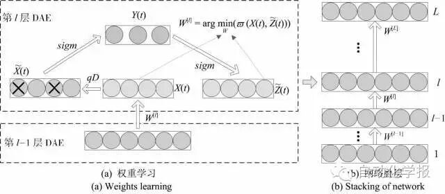
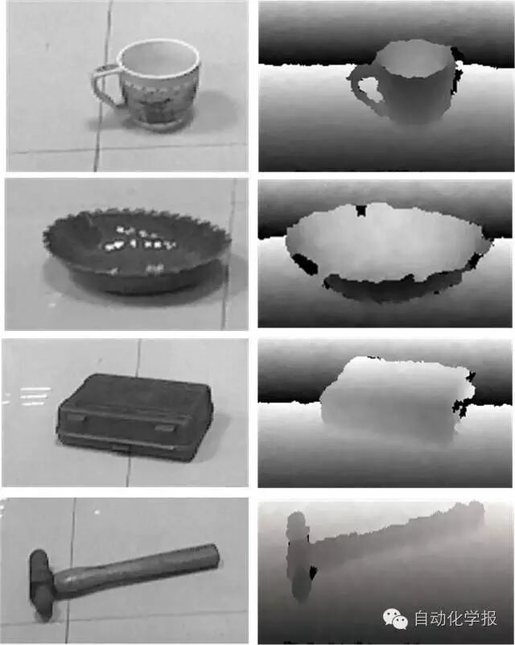
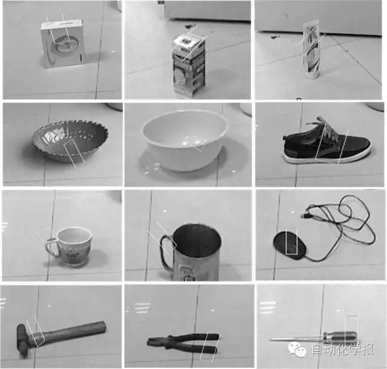
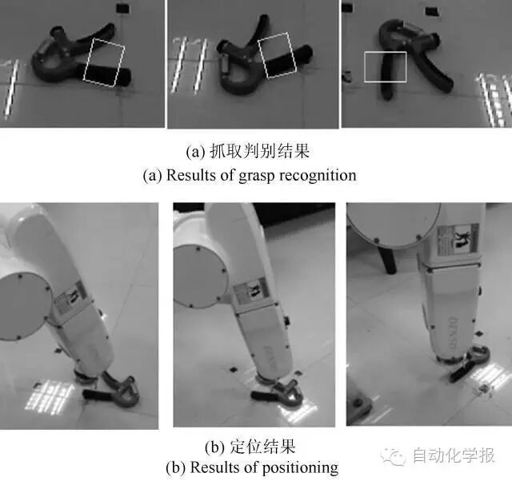
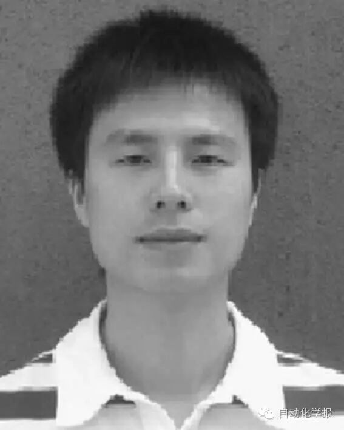

# 基于多模特征深度学习的机器人抓取判别方法

原创 自动化学报 2016-08-01 14:54 北京

> 原文地址: [https://mp.weixin.qq.com/s/DCS1UoL2D8sO5\_2f\_MixSw](https://mp.weixin.qq.com/s/DCS1UoL2D8sO5_2f_MixSw)

针对智能机器人抓取判别问题，研究多模特征深度学习与融合方法. 本文研究目标为，给定抓取目标场景图，机器人通过多模特征深度学习推断出最优抓取位姿，为此，论文主要研究内容及贡献包括：(1)采用堆叠降噪自动编码 (Denoising Auto-Encoding，DAE)建立深度网络模型. 在网络建模中，把测试特征分布偏离训练特征视为一类噪化，通过引入降噪自动编码和稀疏约束条件实现网络权值学习；在网络学习中，先对训练数据进行噪化，再对其进行降噪编码，提高深度网对新目标抓取判别的鲁棒性能. (2)采用Kinect体感传感器获取目标RGB及深度多模数据，以融合策略处理多模特征的深层抽象表达. 试验表明，与单模相比多模特征融合学习大大改善了机器人抓取判别的精确性. (3)最后，论文研究的多模特征深度学习模型与六自由度机器人相结合，机器人实现了对不同形状，不同摆放方向物体的抓取判别与定位. 结果表明，设计的多模特征深度学习依据人的抓取习惯，实现最优抓取判别，并且机器人成功实施抓取定位，研究方法对新目标具备良好的抓取判别能力.

图1 叠层DAE深度学习过程

在线抓取判别测试中，采用微软Kinect体感摄像机，在VS与MATLAB交叉编译环境下，获取抓取目标RGB图像和深度图像，采集到的部分测试数据如图2所示. 针对不同形状，大小、摆放方向的测试目标，抓取判别试验结果如图3所示，从结果中可看出判别模型参照人的抓取习惯，表明本文研究的多模特征深度学习抓取判别方法具备以下两个特性：第一，学习算法依据人的抓取习惯实，实现抓取位置的最优判别，说明该方法具有一定的智能学习判别特性. 第二，试验中部分测试目标不同于网络训练样本，这说明本文构建的多模特征深度学习网具有较好的鲁棒特性，即机器人在面临新的抓取目标时，同样能够实现抓取判别.

图2 抓取判别测试数据

图3 不同类别目标抓取判别结果

本文研究方法与六自由度工业机器人相结合，构建机器人视觉伺服抓取定位试验平台，验证本文方法的实际应用效果. 实验结果如图7所示，机器人对摆放方向大致为-5°、35°、270°的同一物体成功实施抓取判别与定位. 从以上结果可直观看出，本文研究方法适用于不同形状、不同摆放姿态物体的抓取判别与定位. 值得一提的是，我们沿用了目标识别一贯表示方式，用一个矩形框来表示抓取位势，同时考虑目标物为刚性物体，在抓取定位精确情况下机器人即可进行简单的两指挟持操作，后续工作我们也将进一步研究机器人多指抓取操作问题.

最后，我们对四类不同物体，不同摆放方向进行总计96次机器人抓取定位实验，从有限代表性实验中得出机器人抓取定位平均成功率为91.7%，综上得证本文研究方法的实用性.

图4 机器人对相同物体、不同摆放方向实施抓取判别与定位

引用格式

仲训杲, 徐敏, 仲训昱, 彭侠夫. 基于多模特征深度学习的机器人抓取判别方法. 自动化学报, 2016, 42(7):1022-1029

作者简介

仲训杲 博士, 厦门理工学院电气工程与自动化学院讲师. 主要研究方向为机器学习和机器人视觉伺服.

E-mail: zhongxungao@163.com

徐敏 厦门理工学院电气工程与自动化学院教授. 主要研究方向为模式识别和机器人智能控制.

E-mail: xumin@xmut.edu.cn

仲训昱 博士, 厦门大学自动化系副教授. 主要研究方向为机器视觉, 机器人运动规划, 遥自主机器人. 本文通信作者.

E-mail: zhongxunyu@xmu.edu.cn

彭侠夫 博士, 厦门大学自动化系教授.主要研究方向为机器人导航与运动控制,机器学习.

E-mail: xfpeng@xmu.edu.cn

