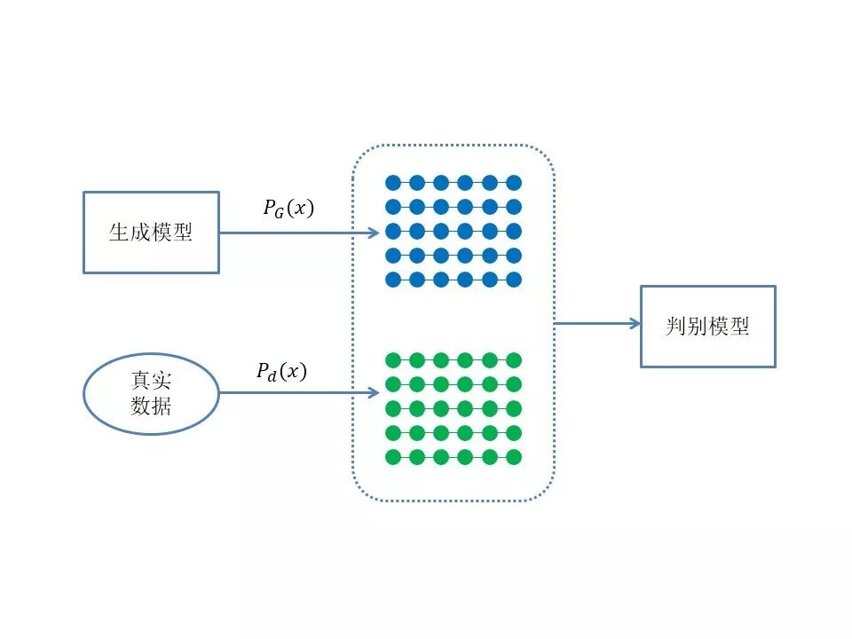
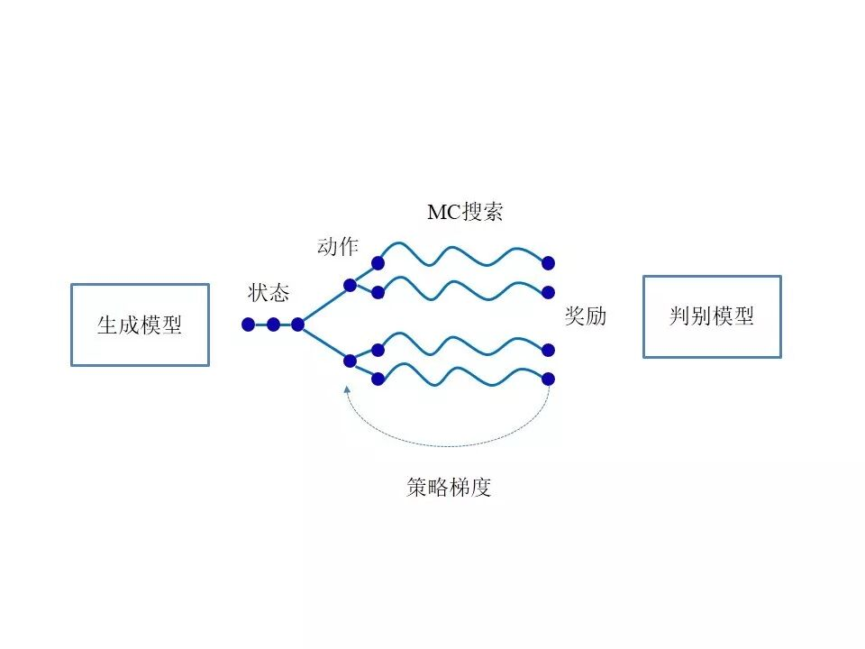

# 基于对抗训练策略的语言模型数据增强技术

原创 自动化学报 2018-08-06 17:38 北京

> 原文地址: [https://mp.weixin.qq.com/s/Ype\_2C6yex05HXzYX-600g](https://mp.weixin.qq.com/s/Ype_2C6yex05HXzYX-600g)

统计语言模型（Statistical Language Model）广泛应用于各种自然语言处理问题，如语音识别、机器翻译、分词、词性标注，等等。简单地说，语言模型就是用来计算一个句子的概率的模型。利用语言模型，可以确定哪个词序列的可能性更大，或者给定若干个词，可以预测下一个最可能出现的词语。目前主要采用的是n元文法（n-gram）语言模型，这种模型构建简单、直接，但当训练数据不充足时，无法估计出鲁棒的模型参数，模型的性能急剧恶化。数据增强是指利用一定的方法扩充训练数据，可以有效缓解数据稀疏问题。

图 1判别模型训练过程

本文提出了一种基于对抗训练策略的语言模型数据增强的方法，通过一个辅助的卷积神经网络判别模型判断生成数据的真伪，从而引导递归神经网络生成模型学习真实数据的分布。语言模型的数据增强问题实质上是离散序列的生成问题。当生成模型的输出为离散值时，来自判别模型的误差无法通过反向传播算法回传到生成模型。为了解决此问题，本文将离散序列生成问题表示为强化学习问题，利用判别模型的输出作为奖励对生成模型进行优化。此外，由于判别模型只能对完整的生成序列进行评价，本文采用蒙特卡洛（Monte Carlo, MC）搜索算法对生成序列的中间状态进行评价。最后，在两个中文语音识别数据库上将本方法与传统数据增强算法进行了详细的对比试验。

图 2生成模型训练过程

引用格式

张一珂, 张鹏远, 颜永红. 基于对抗训练策略的语言模型数据增强技术. 自动化学报, 2018, 44(5): 891-900.

作者简介

张一珂 中国科学院声学研究所博士研究生. 2014年获西北工业大学学士学位. 主要研究方向为自动语音识别, 自然语言处理.

E-mail: zhangyike@hccl.ioa.ac.cn

张鹏远 中国科学院语言声学与内容理解重点实验室研究员. 2007年获中国科学院声学研究所博士学位. 主要研究方向为自动语音识别. 本文通信作者.

E-mail: zhangpengyuan@hccl.ioa.ac.cn

颜永红 中国科学院语言声学与内容理解重点实验室研究员. 1990年获清华大学学士学位, 1995年获俄勒冈科学理工研究学院博士学位. 主要研究方向为语音信号处理, 语音识别, 说话人/语种识别, 人机交互.

E-mail: yanyonghong@hccl.ioa.ac.cn

自动化

学报

往期回顾

[生成式对抗网络：从生成数据到创造智能](http://mp.weixin.qq.com/s?__biz=MzAwMzAzMDgxOA==&mid=2651063870&idx=1&sn=1e1d7562a4bbe4c31e2fdef4859c0bc4&chksm=8131cc73b6464565d9419524cd87b4bbe363384f0ba722017e91a49af4640d349403ea9a0ea6&scene=21#wechat_redirect)  

[人工智能研究的新前线：生成式对抗网络](http://mp.weixin.qq.com/s?__biz=MzAwMzAzMDgxOA==&mid=2651063920&idx=1&sn=9094936d46b4bab696df49c408fa1656&chksm=8131cc3db646452b0cba9ebdee9672b9ae010166a941ef19d5972616235193048a3346cf54f0&scene=21#wechat_redirect)  

[一种能量函数意义下的生成式对抗网络](http://mp.weixin.qq.com/s?__biz=MzAwMzAzMDgxOA==&mid=2651063930&idx=1&sn=8fc4569fbc51adb78002a6c492a7b58f&chksm=8131cc37b646452180ad8b4be28b69e9e1767c94cf2bf8b712074d8b26e72fffd95146d9fac5&scene=21#wechat_redirect)  

[协作式生成对抗网络](http://mp.weixin.qq.com/s?__biz=MzAwMzAzMDgxOA==&mid=2651063937&idx=1&sn=b3bb0ca500fa6f1e5b2d4fdc476187ed&chksm=8131ccccb64645daca101424f49facb82039d857908b8467fc5033a3b254fc348376128fef89&scene=21#wechat_redirect)  

[融合对抗学习的因果关系抽取](http://mp.weixin.qq.com/s?__biz=MzAwMzAzMDgxOA==&mid=2651063950&idx=1&sn=073948b72538b1547399cd7d3ba0b847&chksm=8131ccc3b64645d5c3c82fb7baa62c0cd2644c19f626a6a0904b6223bf155b8e77045006815a&scene=21#wechat_redirect)  

[基于生成对抗网络的多视图学习与重构算法](http://mp.weixin.qq.com/s?__biz=MzAwMzAzMDgxOA==&mid=2651063957&idx=1&sn=19964ffc71d7cb689887517b5d1bec12&chksm=8131ccd8b64645cee6db75a3910ee76a1bf2dab99af617044cfc2210d106ebc8c5eb7c88f7ba&scene=21#wechat_redirect)  

[基于生成对抗网络的低秩图像生成方法](http://mp.weixin.qq.com/s?__biz=MzAwMzAzMDgxOA==&mid=2651063961&idx=1&sn=8d6567b1750f5aa499007f17bed8e92b&chksm=8131ccd4b64645c2a898492cbb2eb4ed8272b4234bd1a08da279f17d6eb9884e0d4ace8f062c&scene=21#wechat_redirect)  

[基于条件深度卷积生成对抗网络的图像识别方法](http://mp.weixin.qq.com/s?__biz=MzAwMzAzMDgxOA==&mid=2651063972&idx=1&sn=b8bf8ae85b62f83e74d50f086ff6bc04&chksm=8131cce9b64645ff1ce4a10e6482d74876c664917a3ee821c11a72693cee3af1360b88d6fffe&scene=21#wechat_redirect)  

[基于生成式对抗网络的鲁棒人脸表情识别](http://mp.weixin.qq.com/s?__biz=MzAwMzAzMDgxOA==&mid=2651063980&idx=1&sn=ee5a109bc89e6b59dcf0db6359438be1&chksm=8131cce1b64645f7d5c0153e2fc3703abc37bc4edb3fc668efc90fd7433599ef40dcaa94e238&scene=21#wechat_redirect)

欢迎扫描二维码、长按图片识别关注《自动化学报》中文版订阅号aas1963，服务号自动化学报和英文版服务号！

JAS《自动化学报》（英文版）

自动化学报服务号

自动化学报订阅号

  

联系我们

Tel:  010-82544653（日常咨询和稿件处理） 

        010-82544677（录用后稿件处理）

Fax: 010-82544497

Email: aas@ia.ac.cn（日常咨询和稿件处理）

          aas\_editor@ia.ac.cn（录用后稿件处理）

http://www.aas.net.cn

点

这里“阅读原文”，查看更多