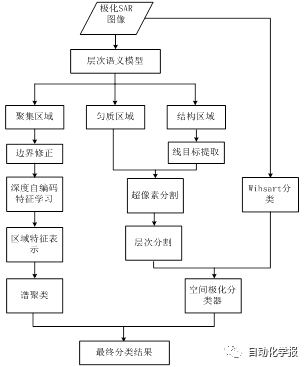
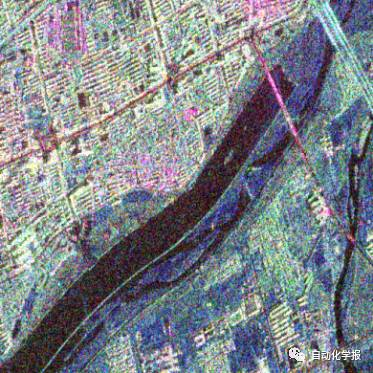
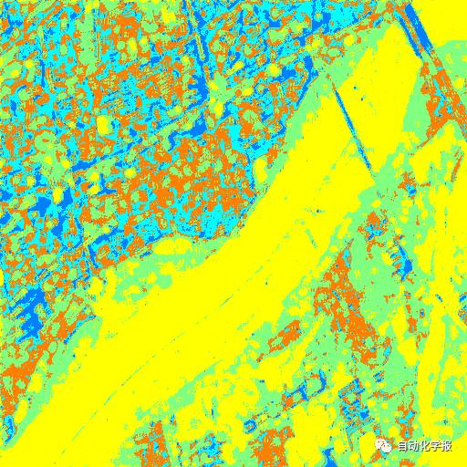
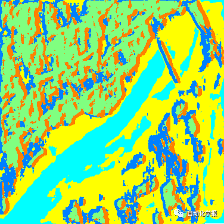
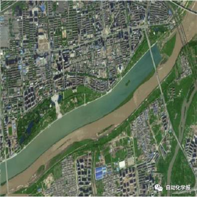
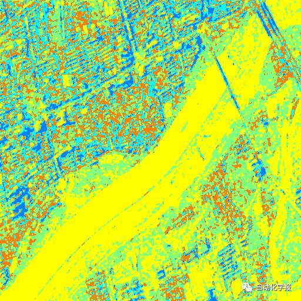
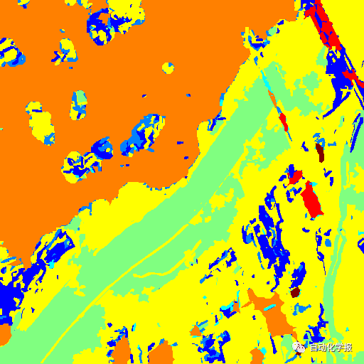

# 基于深度学习和层次语义模型的极化SAR分类

原创 自动化学报 2017-03-15 17:04 北京

> 原文地址: [https://mp.weixin.qq.com/s/E6lyjxnmwWwJxVfHwOPkXw](https://mp.weixin.qq.com/s/E6lyjxnmwWwJxVfHwOPkXw)

  

极化合成孔径雷达(SAR)图像是电磁波在水平和垂直极化方式下进行的地物成像，因此含有更多的极化信息。极化SAR地物分类是图像处理的关键步骤，是人们进行图像理解和解译的前提。极化SAR图像地物繁多，场景复杂，尺度不一。由于没有考虑语义信息，这些方法很难将聚集地物分为语义一致的区域。聚集地物是指由同类目标聚集在一起形成的地物，如森林，城区等。这种地物的特点为目标和地面的散射回波形成强烈的亮暗变化，且这种变化重复出现。由于聚集地物内部强烈的亮暗变化和地物散射特性的较大差异，各种底层特征都难以将其合并为语义一致的区域。

  

刘芳

提出了极化SAR的层次语义模型

该模型能够将极化SAR图像划分为聚集、结构和匀质三种区域。这样，根据地物的特性，不同的分类方法可以自适应的对不同区域进行分类。

**对于匀质区域**，由于结构比较单一，传统的分割和分类方法能够很好的分类。

**对于结构区域**，主要是边界定位和线目标保持。

**对于聚集区域**，一幅极化SAR图像，可能存在多种聚集地物类型，如何区分不同聚集地物，并对聚集区域赋予类标，是本文研究的重点。对于聚集区域，同一区域内应该含有相同的地物结构，而不同区域之间的地物结构可能不同。因此，问题的关键是如何表示各种聚集区域的地物结构，并进行分类。

算法步骤

针对上述问题，本文首次将深度学习和层次语义模型结合，应用在极化SAR图像的分类上，提出了一种新的基于深度学习的极化SAR分类方法。主要步骤如下：

1）基于层次语义模型，极化SAR图像被分为聚集、匀质和结构三类区域；

2）对聚集区域，本文采用深度自编码进行特征学习，得到区域的特征表示，并用谱聚类算法得到区域类别。

3）对于匀质区域，采用基于Wishart最大似然的层次分割方法，并进一步和极化分类结果进行融合分类。

4）对于结构区域，进行线目标和边界定位，对边界两边的超像素和相邻匀质区域进行合并。

算法示意

  

实验结果

为了验证本文算法的有效性，对几幅真实的极化SAR数据进行实验，这些数据来自不同波段不同卫星。为了验证本文算法的优势，Wishart分类算法、Wishart MRF方法和堆叠自编码器(stacked auto-encoder, SAE)分类方法用来进行对比。实验结果如图2所示，分类效果使用主观和客观标准进行评价。与其他算法相比，本文算法对聚集地物能够取得语义一致的分类结果，且能够较好地保持边界。

西安地区分类结果图。(a) 极化SAR伪彩图；(b) Google Earth光学图像；(c) Wishart分类结果图；(d) Wishart MRF分类结果图；(e) SAE分类结果图；(f) 本文算法分类结果图。

  

引用格式

石俊飞, 刘芳, 林耀海, 刘璐. 基于深度学习和层次语义模型的极化SAR分类. 自动化学报, 2017, 43(2): 215-226

作者简介

石俊飞 西安理工大学计算机信息与工程学院讲师，2016年获得西安电子科技大学计算机学院博士学位，2009年获得河南师范大学计算机学院学士学位，主要研究方向为极化SAR图像分类、语义模型和计算机视觉。本文通信作者。

E-mail: shijunfei1@163.com

刘 芳 西安电子科技大学计算机学院教授，博士生导师. 1984年获得西安交通大学计算机科学与技术专业学士学位，1995年获得西安电子科技大学计算机学院硕士学位，在期刊和会议上发表论文80余篇，主要研究方向包括图像和信号处理、SAR图像处理、多尺度几何分析、学习理论和算法、优化问题以及数据挖掘。

E-mail: f63liu@163.com

林耀海 福建农林大学计算机与信息学院讲师，主要研究方向有图像处理、智能信号处理。

E-mail: lyh953@qq.com

  

刘 璐 西安理工大学计算机信息与工程学院讲师，2015年获得西安电子科技大学电子工程学院博士学位，主要研究方向为极化SAR图像分类。

E-mail: liulu0613@163.com

微信服务号：自动化学报

微信订阅号：aas1963

新浪微博：自动化学报

新浪博客：Automation\_2011

联系我们：

Tel:  010-82544653（日常咨询和稿件处理） 

        010-82544677（录用后稿件处理）

Fax: 010-82544497

Email: aas@ia.ac.cn（日常咨询和稿件处理）

          aas\_editor@ia.ac.cn（录用后稿件处理）

http://www.aas.net.cn

