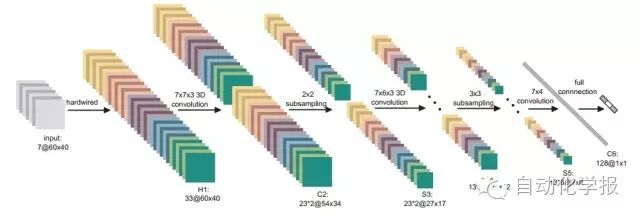
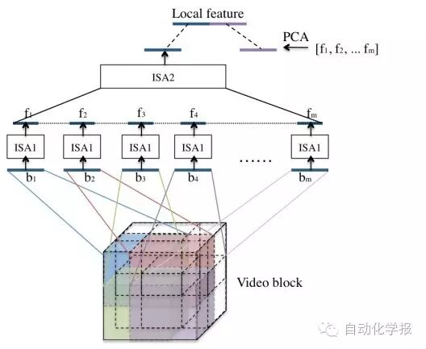
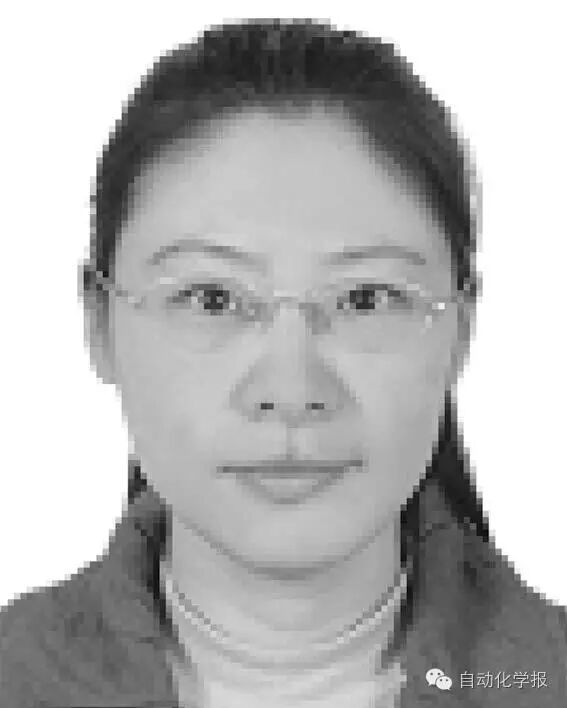
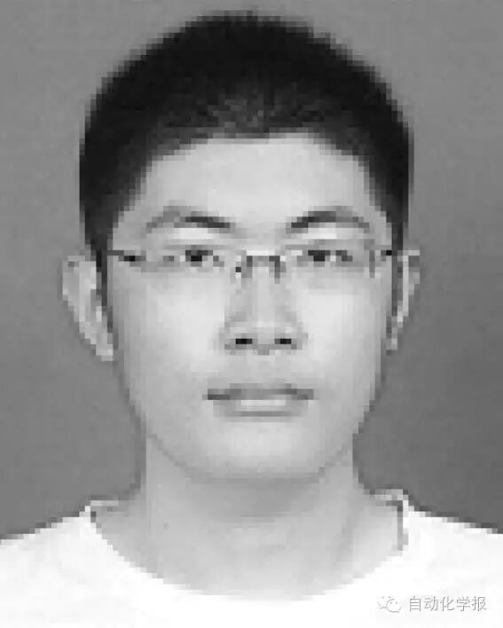

# 基于深度学习的人体行为识别算法综述

原创 自动化学报 2016-06-30 09:10 北京

> 原文地址: [https://mp.weixin.qq.com/s/fAGVAKh1r9HHq1BVCClriw](https://mp.weixin.qq.com/s/fAGVAKh1r9HHq1BVCClriw)

基于深度学习的人体行为识别算法综述—语音图文信息处理中的深度学习方法进展专刊

近年来，深度学习在语音识别、图像识别等各个领域有了广泛的应用.深度学习理论在静态图像特征提取上取得了卓著成就，并被逐步推广至具有时间序列的视频行为识别研究中.本文在回顾了基于时空兴趣点等传统行为识别方法的基础上，对近年来提出的基于不同深度学习框架的人体行为识别新进展进行了逐一介绍和总结分析，包括卷积神经网络、独立子空间分析、限制玻尔兹曼机以及递归神经网络及其在行为识别中的模型建立，对模型性能、成果进展及各类方法的优缺点进行了分析和总结.

图1 3DCNN结构图

图2 ISA-3D结构图

引用格式

朱煜, 赵江坤, 王逸宁, 郑兵兵. 基于深度学习的人体行为识别算法综述. 自动化学报, 2016, 42(6): 848-857

作者简介

朱煜 华东理工大学信息科学与工程学院教授. 1999 年获得南京理工大学博士学位. 主要研究方向为智能视频分析与理解, 模式识别方法, 数字图像处理方法及应用. 本文通信作者.

E-mail: zhuyu@ecust.edu.cn

赵江坤 华东理工大学信息科学与工程学院硕士研究生. 主要研究方向为智能视频分析与模式识别.

zhaojk90@gmail.com

王逸宁 华东理工大学信息科学与工程学院硕士研究生. 主要研究方向为智能视频分析与模式识别.

E-mail: wyn885@126.com

郑兵兵 华东理工大学信息科学与工程学院硕士研究生. 主要研究方向为智能视频分析与模式识别.

13162233697@163.com

  

