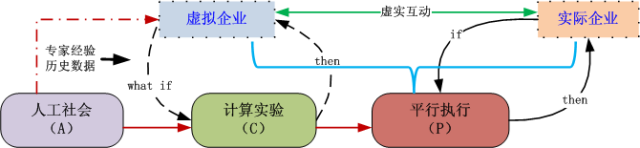
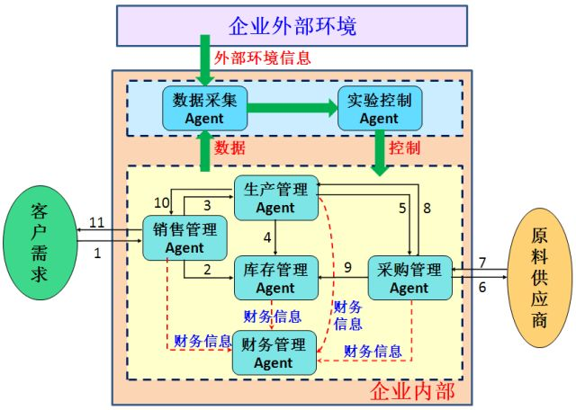
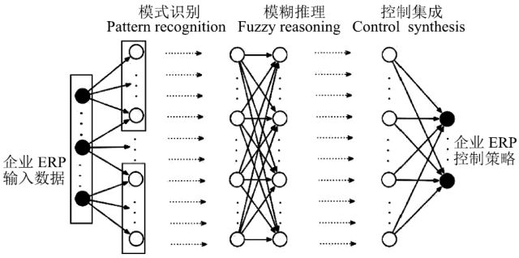

# 基于深度强化学习的平行企业资源计划

原创 自动化学报 2018-01-03 16:39 北京

> 原文地址: [https://mp.weixin.qq.com/s/HV-0ZwuHoQGHZPvG2Q62Uw](https://mp.weixin.qq.com/s/HV-0ZwuHoQGHZPvG2Q62Uw)

“

随着社会化和网络化趋势的日益增强， 企业已全面而深度地融入网络环境， 并已演变成为现实物理世界、网络虚拟世界和社会耦合空间的现代新型企业。在以信息技术和网络技术为特征的知识经济时代，如何实现大数据、知识与人三者之间的动态闭环反馈以及实时交互， 已成为现代企业ERP 面临的重大挑战。本文主要基于ACP （人工社会、计算实验、平行执行）方法，构建基于平行管理的企业ERP系统（如图1）。

图1. 平行企业ERP系统思路

首先提出基于平行管理的ERP 3.0的概念，然后构建基于多Agent的ERP 3.0 建模框架（如图2），在此基础上，建立基于企业ERP 全流程的不完全信息动态博弈模型，并构建基于深度强化学习框架的监督学习网络（如图3）对模型进行求解。

图2. 企业ERP 3.0系统Agent建模流程图

图3. 基于深度神经网络框架的监督学习网络

以人工智能为代表的新时代已经到来，实现基于ACP方法的虚实互动“平行企业”是建设“智能企业”的基础，也是未来企业ERP的发展趋势，本文即为在这个方向上的一个初步探索。可以预见， 在未来企业ERP中，人工虚拟的系统、工厂、城市将成为现实，大数据将成为原料，数字化的经验、案例、预演将成为生产力，计算实验将成为首要方法，而虚拟与现实的平行执行将会是企业ERP 的“新常态”。

引用格式

秦蕊, 曾帅, 李娟娟, 袁勇. 基于深度强化学习的平行企业资源计划. 自动化学报, 2017, 43(9): 1588-1596

作者简介

秦蕊

中国科学院自动化研究所复杂系统管理与控制国家重点实验室助理研究员。主要研究方向为商务智能， 计算广告学， 知识自动化与企业平行管理。本文通信作者。

E-mail: rui.qin@ia.ac.cn

曾帅

中国科学院自动化研究所复杂系统管理与控制国家重点实验室助理研究员。主要研究方向为社会计算和策略优化。

E-mail: shuai.zeng@ia.ac.cn

李娟娟

中国科学院自动化研究所复杂系统管理与控制国家重点实验室助理研究员。主要研究方向为商务智能、计算广告学、知识自动化与企业平行管理。

E-mail: juanjuan.li@ia.ac.cn

袁勇

中国科学院自动化研究所复杂系统管理与控制国家重点实验室副研究员。主要研究方向为商务智能与计算广告学。

E-mail: yong.yuan@ia.ac.cn

欢迎扫描二维码、长按图片识别关注《自动化学报》中文版订阅号aas1963，服务号自动化学报和英文版服务号！

JAS《自动化学报》（英文版）

自动化学报服务号

自动化学报订阅号

  

联系我们

Tel:  010-82544653（日常咨询和稿件处理） 

        010-82544677（录用后稿件处理）

Fax: 010-82544497

Email: aas@ia.ac.cn（日常咨询和稿件处理）

          aas\_editor@ia.ac.cn（录用后稿件处理）

http://www.aas.net.cn

更多精彩内容，尽在阅读原文