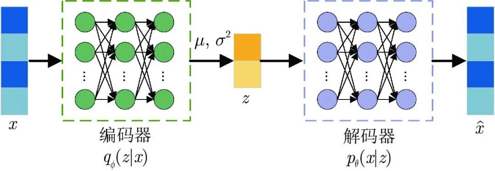
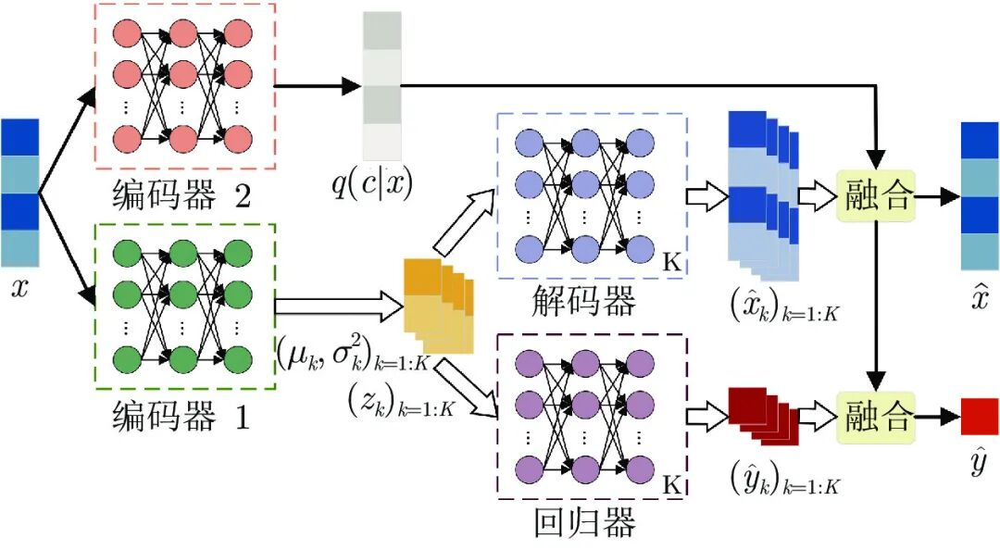

# 基于混合变分自编码器回归模型的软测量建模方法

原创 自动化学报 自动化学报 2022-03-03 16:26 北京

> 原文地址: [https://mp.weixin.qq.com/s/VeQh2n-jW\_gZkrNSzxYLXA](https://mp.weixin.qq.com/s/VeQh2n-jW_gZkrNSzxYLXA)

点击蓝字

关注我们

  

**引用本文**

崔琳琳, 沈冰冰, 葛志强. 基于混合变分自编码器回归模型的软测量建模方法. 自动化学报, 2022, 48(2): 398−407 doi: 10.16383/j.aas.c210035    

Cui Lin-Lin, Shen Bing-Bing, Ge Zhi-Qiang. A mixture variational autoencoder regression model for soft sensor application. Acta Automatica Sinica, 2022, 48(2): 398−407 doi: 10.16383/j.aas.c210035

http://www.aas.net.cn/cn/article/doi/10.16383/j.aas.c210035?viewType=HTML

  

**文章简介**

  

**关键词**

  

软测量, 变分自编码器, 高斯混合模型, 混合变分自编码器回归模型, 多模态工业过程

  

**摘   要**

  

近年来, 变分自编码器(Variational auto-encoder, VAE)模型由于在概率数据描述和特征提取能力等方面的优越性, 受到了学术界和工业界的广泛关注, 并被引入到工业过程监测、诊断和软测量建模等应用中. 然而, 传统基于VAE的软测量方法使用高斯分布作为潜在变量的分布, 限制了其对复杂工业过程数据, 尤其是多模态数据的建模能力. 为了解决这一问题, 本论文提出了一种混合变分自编码器回归模型(Mixture variational autoencoder regression, MVAER), 并将其应用于复杂多模态工业过程的软测量建模. 具体来说, 该方法采用高斯混合模型来描述VAE的潜在变量分布, 通过非线性映射将复杂多模态数据映射到潜在空间, 学习各模态下的潜在变量, 获取原始数据的有效特征表示. 同时, 建立潜在特征表示与关键质量变量之间的回归模型, 实现软测量应用. 通过一个数值例子和一个实际工业案例, 对所提模型的性能进行了评估, 验证了该模型的有效性和优越性.

  

**引   言**

  

在实际工业生产过程中, 需要对一些关键的质量变量进行实时测量, 如产品浓度、过程气体含量、催化剂活性和熔体指数等, 这对实现有效的过程控制和提高产品质量具有重要意义. 然而, 由于极端的测量环境、昂贵的仪器成本、大的分析测量延迟等因素, 关键质量变量的物理测量难以实现. 因此, 软测量技术应运而生. 软测量是一种虚拟传感器技术, 通过构建数学模型, 以一组容易测量的相关过程变量为输入, 以过程关键质量变量为输出, 来快速准确地估计这些难以直接测量的质量变量. 一般来说, 软测量方法可大致分为两种, 模型驱动的软测量和数据驱动的软测量. 与前者相比, 数据驱动的软测量方法不需要精准的机理模型和大量的过程专家知识, 更加具有灵活性和实用性. 此外, 随着分布式控制系统(Distributed control systems, DCSs)在现代工业过程中的广泛使用, 收集到的数据也日益增多, 为数据驱动建模方法提供了丰富的数据保证. 因此, 数据驱动的软测量方法受到了越来越多的关注. 经典的基于数据驱动的软测量建模方法有主成分回归分析(Principal component regression, PCR)、偏最小二乘法(Partial least squares, PLS)、支持向量机(Support vector machine, SVM)和人工神经网络(Artificial neural-network techniques, ANN)等.

  

近年来, 深度学习作为一种新兴技术, 在图像处理、计算机视觉、自然语言处理等应用领域都取得了很大的进展. 与传统的浅层方法相比, 深度学习方法具有更深的网络结构, 它能够通过多层非线性映射, 从数据中提取更深层的抽象特征, 具有强大的数据建模能力. 因此, 面对越来越复杂的大规模现代工业过程, 深度学习具有不可替代的优势, 已经被应用到了软测量领域当中. 例如, Yao和Ge提出了一种基于分层极限学习机的半监督深度学习软测量模型. Yuan等开发出一种质量相关自动编码器, 用于提取深层次的输出相关特征. Zhang和Ge基于门控循环单元和编码解码网络, 设计了一种深度可迁移动态特征提取器, 并应用于软测量. Zheng等将集成策略、深度信念网络和核学习集成到软测量框架中, 建立了集成深度核回归模型, 并扩展到半监督形式. 然而, 由于过程的随机扰动等原因, 几乎所有的过程数据都会受到随机噪声的污染, 从本质上来说, 过程变量都属于随机变量. 最近, Kingma和Welling提出了变分自编码器, 一种深度生成模型, 它结合了深度学习和贝叶斯变分推断. 作为一种以深层神经网络为结构的概率框架模型, VAE既具有深度学习的非线性特征提取能力, 又能像概率模型那样对过程不确定性和数据噪声进行建模. 基于这些优点, VAE已经被引入到工业过程中, 并逐渐被用于过程监测和软测量建模等应用场景.

  

尽管目前VAE在软测量应用中取得了一些进展, 但是传统的VAE通常假设其潜在变量分布服从高斯分布, 因此模型学习到的特征表示只能是单峰形式, 难以充分发挥潜在空间编码的能力和灵活性. 这在很大程度上限制了VAE对复杂特性过程数据的描述, 如工业领域广泛存在的多模态数据, VAE的建模性能很难得到有效的保障. 在实际工业过程中, 由于原料比例、产品需求、制造策略等因素的变化, 经常会发生操作条件的转变, 即工况发生变化, 从而使过程数据呈现典型的多模态特性. 近年来, 学者们提出了一些VAE变体模型, 通过使用复杂的先验等手段来促进编码的灵活性, 但他们的目标大多是进行无监督聚类. 到目前为止, 还没有VAE在多模态工业过程软测量应用中的相关研究报导. 基于以上讨论, 本文结合高斯混合模型的思想, 基于VAE框架提出一种混合变分自编码器回归(MVAER)模型, 用于解决多模态过程的质量预测问题. 该方法采用高斯混合模型来描述VAE的潜在空间变量分布, 分别对应工业过程中的多个模态. 通过非线性映射将复杂多模态数据映射到潜在空间, 学习各模态下的潜在变量, 获取原始数据的有效特征表示. 同时, 建立潜在特征表示与关键质量变量之间的回归模型, 实现软测量应用. 通过一个数值算例和一个实际工业案例, 验证了所提方法的有效性和可行性.

  

图 1  VAE模型结构图

  

图 2  混合变分自编码器回归模型结构图

  

请点击左下角“**阅读原文**”了解更多！

  

**作者简介**

**崔琳琳**

浙江大学控制科学与工程学院硕士研究生. 主要研究方向为工业软测量. 

E-mail: linlincui@zju.edu.cn

**沈冰冰**

浙江大学控制科学与工程学院博士研究生. 主要研究方向为数据驱动建模, 过程数据分析和软测量应用.

E-mail: shenbingbing@zju.edu.cn

**葛志强**

浙江大学教授、博导. 主要研究方向为工业大数据、过程监测与故障诊断、软测量技术、智能系统与知识自动化. 本文通信作者.

E-mail: gezhiqiang@zju.edu.cn

  

**相关文章**

  

**（请向上滑动阅读）**

  

\[1\]  胡铭菲, 左信, 刘建伟. 深度生成模型综述. 自动化学报, 2022, 48(1): 40-74. doi: 10.16383/j.aas.c190866

http://www.aas.net.cn/cn/article/doi/10.16383/j.aas.c190866?viewType=HTML

  

\[2\]  金聪聪, 刘安东, StevenLiu, 张文安. 基于改进动态系统稳定估计器的机器人技能学习方法. 自动化学报. doi: 10.16383/j.aas.c200341

http://www.aas.net.cn/cn/article/doi/10.16383/j.aas.c200341?viewType=HTML

  

\[3\]  李燕萍, 曹盼, 左宇涛, 张燕, 钱博. 基于i向量和变分自编码相对生成对抗网络的语音转换. 自动化学报. doi: 10.16383/j.aas.c190733

http://www.aas.net.cn/cn/article/doi/10.16383/j.aas.c190733?viewType=HTML

  

\[4\]  蒙西, 乔俊飞, 韩红桂. 基于类脑模块化神经网络的污水处理过程关键出水参数软测量. 自动化学报, 2019, 45(5): 906-919. doi: 10.16383/j.aas.2018.c170497

http://www.aas.net.cn/cn/article/doi/10.16383/j.aas.2018.c170497?viewType=HTML

  

\[5\]  郭小萍, 刘诗洋, 李元. 基于稀疏残差距离的多工况过程故障检测方法研究. 自动化学报, 2019, 45(3): 617-625. doi: 10.16383/j.aas.c170389

http://www.aas.net.cn/cn/article/doi/10.16383/j.aas.c170389?viewType=HTML

  

\[6\]  王传云, 秦世引. 动态场景红外图像的压缩感知域高斯混合背景建模. 自动化学报, 2018, 44(7): 1212-1226. doi: 10.16383/j.aas.2017.c170061

http://www.aas.net.cn/cn/article/doi/10.16383/j.aas.2017.c170061?viewType=HTML

  

\[7\]  黄德先, 江永亨, 金以慧. 炼油工业过程控制的研究现状、问题与展望. 自动化学报, 2017, 43(6): 902-916. doi: 10.16383/j.aas.2017.c170157

http://www.aas.net.cn/cn/article/doi/10.16383/j.aas.2017.c170157?viewType=HTML

  

\[8\]  余建波, 卢笑蕾, 宗卫周. 基于局部与非局部线性判别分析和高斯混合模型动态集成的晶圆表面缺陷探测与识别. 自动化学报, 2016, 42(1): 47-59. doi: 10.16383/j.aas.2016.c150311

http://www.aas.net.cn/cn/article/doi/10.16383/j.aas.2016.c150311?viewType=HTML

  

\[9\]  曲寒冰, 王加强, 李彬, 王松涛. 基于概率图模型的点集匹配方法研究. 自动化学报, 2015, 41(4): 694-710. doi: 10.16383/j.aas.2015.c140376

http://www.aas.net.cn/cn/article/doi/10.16383/j.aas.2015.c140376?viewType=HTML

  

\[10\]  王魏, 邓长辉, 赵立杰. 椭球定界算法在混合建模中的应用研究. 自动化学报, 2014, 40(9): 1875-1881. doi: 10.3724/SP.J.1004.2014.01875

http://www.aas.net.cn/cn/article/doi/10.3724/SP.J.1004.2014.01875?viewType=HTML

  

\[11\]  曹鹏飞, 罗雄麟. 基于Wiener结构的软测量模型及辨识算法. 自动化学报, 2014, 40(10): 2179-2192. doi: 10.3724/SP.J.1004.2014.02179

http://www.aas.net.cn/cn/article/doi/10.3724/SP.J.1004.2014.02179?viewType=HTML

  

\[12\]  柴天佑. 复杂工业过程运行优化与反馈控制. 自动化学报, 2013, 39(11): 1744-1757 doi: 10.3724/SP.J.1004.2013.01744

http://www.aas.net.cn/cn/article/doi/10.3724/SP.J.1004.2013.01744?viewType=HTML

  

\[13\]  杨栋, 周秀玲, 郭平. 基于贝叶斯通用背景模型的图像标注. 自动化学报, 2013, 39(10): 1674-1680. doi: 10.3724/SP.J.1004.2013.01674

http://www.aas.net.cn/cn/article/doi/10.3724/SP.J.1004.2013.01674?viewType=HTML

  

\[14\]  林晓丹. 基于高斯混合模型的DCT域水印检测方法. 自动化学报, 2012, 38(9): 1445-1448. doi: 10.3724/SP.J.1004.2012.01445

http://www.aas.net.cn/cn/article/doi/10.3724/SP.J.1004.2012.01445?viewType=HTML

  

\[15\]  董远, 陆亮, 赵贤宇, 赵建. 对文本无关的说话人验证中模型距离归一化问题的研究. 自动化学报, 2009, 35(5): 556-560. doi: 10.3724/SP.J.1004.2009.00556

http://www.aas.net.cn/cn/article/doi/10.3724/SP.J.1004.2009.00556?viewType=HTML

  

\[16\]  孟猛, 王晓瑞, 梁家恩, 徐波. 一种基于互补声学模型的多系统融合语音关键词检测方法. 自动化学报, 2009, 35(1): 39-45. doi: 10.3724/SP.J.1004.2009.00039

http://www.aas.net.cn/cn/article/doi/10.3724/SP.J.1004.2009.00039?viewType=HTML

  

\[17\]  贾润达, 毛志忠, 常玉清. 基于非线性偏鲁棒M-回归的萃余液pH值软测量. 自动化学报, 2009, 35(5): 583-587. doi: 10.3724/SP.J.1004.2009.00583

http://www.aas.net.cn/cn/article/doi/10.3724/SP.J.1004.2009.00583?viewType=HTML

  

\[18\]  叶涛, 朱学峰, 李向阳, 史步海. 基于改进k-最近邻回归算法的软测量建模. 自动化学报, 2007, 33(9): 996-999. doi: 10.1360/aas-007-0996

http://www.aas.net.cn/cn/article/doi/10.1360/aas-007-0996?viewType=HTML

  

\[19\]  李勇, 邵诚. 一种新的灰关联分析算法在软测量中的应用. 自动化学报, 2006, 32(2): 311-317.

http://www.aas.net.cn/cn/article/id/16118?viewType=HTML

  

\[20\]  王锡淮, 李少远, 席裕庚. 加热炉钢坯温度软测量模型研究. 自动化学报, 2004, 30(6): 928-932.

http://www.aas.net.cn/cn/article/id/16264?viewType=HTML

  

\[21\]  杨尔辅, 徐用懋. 一种小波-神经网络多变量混合过程模型及其应用. 自动化学报, 2000, 26(增刊B): 153-157.

http://www.aas.net.cn/cn/article/id/16118?viewType=HTML

  

\[22\]  王旭东, 邵惠鹤. 基于神经网络的通用软测量技术. 自动化学报, 1998, 24(5): 702-706.

http://www.aas.net.cn/cn/article/id/16787?viewType=HTML

  

  

**近期文章**

[人生跑马灯？人类首次同步测量大脑濒死状态](http://mp.weixin.qq.com/s?__biz=MzAwMzAzMDgxOA==&mid=2651074149&idx=2&sn=60d48feaa01d160092c19a91e1314db7&chksm=8131e428b6466d3e1e8f835c506ae7faf61e8b66d94fc1dd027a089e075f82078ce5422a0a13&scene=21#wechat_redirect)

[自动化学报（英文版）和自动化学报入选计算领域高质量科技期刊T1类](http://mp.weixin.qq.com/s?__biz=MzAwMzAzMDgxOA==&mid=2651073859&idx=2&sn=7a9192717637dcf6cddb39ed961e8c3b&chksm=8131e70eb6466e188a123c504bdeba80c75681de4762f8685b3bf584bc33eb12362c70613b4e&scene=21#wechat_redirect)

[AI黑科技：马赛克加密被破解了！](http://mp.weixin.qq.com/s?__biz=MzAwMzAzMDgxOA==&mid=2651073824&idx=2&sn=0c15fef01cd893210bef1cceece5d49d&chksm=8131e76db6466e7b1c78884be8517733101cbe37b5a2fd95f4d4df6b569956c0dc5598435eb4&scene=21#wechat_redirect)

[Nature：当AI学会控制核聚变反应堆](http://mp.weixin.qq.com/s?__biz=MzAwMzAzMDgxOA==&mid=2651073629&idx=2&sn=b298f9f715cc9a6a38a54f36aea98171&chksm=8131e610b6466f06072ffe4dcfb213dde209f893bd3071cd4cbca8ba9a6484334028a3aae92a&scene=21#wechat_redirect)

[《自动化学报》编辑部防诈骗公告](http://mp.weixin.qq.com/s?__biz=MzAwMzAzMDgxOA==&mid=2651073517&idx=1&sn=c52de7c685e546af9faffc0cefab1c85&chksm=8131e1a0b64668b63ebaa68ea81cbaec3b94dc52ea8360821a0a49e67ae7e4b428a25d0f19c5&scene=21#wechat_redirect)

[中国科学院自动化研究所“海外优青”项目招聘启事](http://mp.weixin.qq.com/s?__biz=MzAwMzAzMDgxOA==&mid=2651073629&idx=3&sn=704a900c277b3224dfa9745d2ccc8c24&chksm=8131e610b6466f06329a900636c1bf894d6a890b89d114bbd9faf5f9a8132a73a228e7c3aeac&scene=21#wechat_redirect)

[“诺奖风向标”斯隆奖2022名单出炉！27位华人学者入选](http://mp.weixin.qq.com/s?__biz=MzAwMzAzMDgxOA==&mid=2651073517&idx=2&sn=5ed3a30328a9f41bd43999c1592469b8&chksm=8131e1a0b64668b687601773f8d9d6960344a59a62e83dede480b768fad7375bc5329cfcebdc&scene=21#wechat_redirect)

[Nature封面：人类又输给了AI，赛车AI击败人类顶级车手！](http://mp.weixin.qq.com/s?__biz=MzAwMzAzMDgxOA==&mid=2651073362&idx=2&sn=e9a5d620fd2afa6af2c13d9c695e54a7&chksm=8131e11fb64668099fa52873d8df2f3a91c3244972da7d10cbf7c234c8b95b70954e1f2affab&scene=21#wechat_redirect)

  

**热点文章**

[《自动化学报》2019年高关注论文](http://mp.weixin.qq.com/s?__biz=MzAwMzAzMDgxOA==&mid=2651073450&idx=1&sn=6f57bd0df73f259aa416575f1f69bdfb&chksm=8131e1e7b64668f1344de4acdef6148e8dcfa60c80e4f48e6cb1270558c2beade5601e92d05c&scene=21#wechat_redirect)

[《自动化学报》2021年热点文章回顾](http://mp.weixin.qq.com/s?__biz=MzAwMzAzMDgxOA==&mid=2651072577&idx=1&sn=4e6be077d7371c7d29d9a371d8defe19&chksm=8131e20cb6466b1aec2f3b8b1063d3be11725ca9a0c15785c3b42a638170e732acd0d8d345e0&scene=21#wechat_redirect)

[国家自然科学基金论文精选](http://mp.weixin.qq.com/s?__biz=MzI2NjA3MzM5MA==&mid=2649960308&idx=1&sn=1634c999f22588333537f13393403f9c&chksm=f2942b35c5e3a2232e86b51c2b7c8f37a4d3d7f858d370d76d5afd00567d7da6e9543476d120&scene=21#wechat_redirect)  

[国家重点研发计划论文精选](http://mp.weixin.qq.com/s?__biz=MzI2NjA3MzM5MA==&mid=2649960255&idx=1&sn=f48435928fd924134cb72014860b9d00&chksm=f2942b7ec5e3a26869da68a1419b3b40ca1e6cb98abf2e380d78a49ffb99c85991d76cc346b0&scene=21#wechat_redirect)

[中国科学院自动化研究所高层次人才招聘启事 | 长期有效](http://mp.weixin.qq.com/s?__biz=MzI2NjA3MzM5MA==&mid=2649959451&idx=1&sn=657b7e4aeeaa88114d5189641c5409dc&chksm=f294285ac5e3a14cd230a2b9678c32ba9bf92e8ffc9d61d506c5ffea2df793456dd37c2c6fb1&scene=21#wechat_redirect)

  

**期刊动态**

[自动化学报（英文版）和自动化学报入选计算领域高质量科技期刊T1类](http://mp.weixin.qq.com/s?__biz=MzAwMzAzMDgxOA==&mid=2651073859&idx=2&sn=7a9192717637dcf6cddb39ed961e8c3b&chksm=8131e70eb6466e188a123c504bdeba80c75681de4762f8685b3bf584bc33eb12362c70613b4e&scene=21#wechat_redirect)

[《自动化学报》编辑部防诈骗公告](http://mp.weixin.qq.com/s?__biz=MzAwMzAzMDgxOA==&mid=2651073517&idx=1&sn=c52de7c685e546af9faffc0cefab1c85&chksm=8131e1a0b64668b63ebaa68ea81cbaec3b94dc52ea8360821a0a49e67ae7e4b428a25d0f19c5&scene=21#wechat_redirect)

[《自动化学报》致谢审稿人](http://mp.weixin.qq.com/s?__biz=MzI2NjA3MzM5MA==&mid=2649961201&idx=1&sn=3142842d75c441ae860c1ecb313c7657&chksm=f29436b0c5e3bfa6c679210f60513eb1a7205dc20fe028f482bb593eac60427e4e56fba12493&scene=21#wechat_redirect)

[自动化学报多篇论文入选中国百篇最具影响国内论文和中国精品期刊顶尖论文](http://mp.weixin.qq.com/s?__biz=MzI2NjA3MzM5MA==&mid=2649961152&idx=1&sn=4a5e9e4b84879f4cde4e13a0ef97272c&chksm=f2943681c5e3bf97d7770c9623dac869b283b3ea83f3d320017974033e361d8b999134a8bdff&scene=21#wechat_redirect)

[自动化学报各项主要指标蝉联第1，再获百种中国杰出期刊称号](http://mp.weixin.qq.com/s?__biz=MzI2NjA3MzM5MA==&mid=2649960903&idx=1&sn=7da8b8a0167e16bcbaa1f00fbfb69782&chksm=f2943586c5e3bc9014f6d4fff7147b998ae42b4da452907e641e8029f296fd2413b4f17aef62&scene=21#wechat_redirect)

[《自动化学报》发表文章入选第六届中国科协优秀科技论文](http://mp.weixin.qq.com/s?__biz=MzI2NjA3MzM5MA==&mid=2649960313&idx=1&sn=01b5a9defe9664ba4a0b8d7322e115d0&chksm=f2942b38c5e3a22e2c57edaa8667a27368ccfb595e6a372dfa85ff2a61329788870d77957a2f&scene=21#wechat_redirect)

[自动化学报（英文版）首届青年编委招募](http://mp.weixin.qq.com/s?__biz=MzI2NjA3MzM5MA==&mid=2649959475&idx=1&sn=e28ce2b8fa27ee4fb6a5c0c17e25dd25&chksm=f2942872c5e3a16438dbf45fd8091b643cd2bf50f0bab7092a6c5103d06cd4a16ebceb4db40a&scene=21#wechat_redirect)

  

**期刊目录**

[2022年第02期](http://mp.weixin.qq.com/s?__biz=MzI2NjA3MzM5MA==&mid=2649961838&idx=1&sn=29334896aa0f372b70312250c75b6b20&chksm=f294312fc5e3b8392ffd49100eaba435bf48fa9234c5019fe7b16ed1e4ebef70be58691f3fb3&scene=21#wechat_redirect)

[2022年第01期](http://mp.weixin.qq.com/s?__biz=MzI2NjA3MzM5MA==&mid=2649961423&idx=1&sn=3b65958faa7c7f94c247f46dd72bd71e&chksm=f294378ec5e3be9825f860d132c36c97f3e877089449cb1fe85a6d1e7da9bd0e24795336bc54&scene=21#wechat_redirect)

[《自动化学报》2021年全年合集](http://mp.weixin.qq.com/s?__biz=MzAwMzAzMDgxOA==&mid=2651072770&idx=1&sn=7c531f7fa3bc390558fab15b339ce86e&chksm=8131e34fb6466a59ed079448fddda0fc9f97066460bff8f6835288003a1fba2812de383813c1&scene=21#wechat_redirect)

[《自动化学报》2020年全年合集](http://mp.weixin.qq.com/s?__biz=MzI2NjA3MzM5MA==&mid=2649957972&idx=1&sn=1951847aacbcb7d22bdd2a46a79af871&chksm=f2942215c5e3ab03d070d8e52b8764b38036897c97b6a26c7a1f918c806b28edbe6c0fbf7ea9&scene=21#wechat_redirect)

[2020年第10期 工业人工智能专题](http://mp.weixin.qq.com/s?__biz=MzI2NjA3MzM5MA==&mid=2649957201&idx=1&sn=ab82a767bd716ab67fdf2942500d8b61&chksm=f2942710c5e3ae06b27f9e63a5e329a1123d90b051164e6b6123c500230541b1ed12d92abbfb&scene=21#wechat_redirect)

[2020年第09期 分布式信息能源系统理论与应用专题](http://mp.weixin.qq.com/s?__biz=MzI2NjA3MzM5MA==&mid=2649956412&idx=1&sn=8ebc13d63fd333ad85dbb8b5825df248&chksm=f294247dc5e3ad6ba297857a5b957e97cf499266c50318791fa8abd9432ecf1d9c3d9b287e36&scene=21#wechat_redirect)

  

  

  

**长按二维码｜关注我们**

**IEEE/CAA Journal of Automatica Sinica (JAS)**

**长按二维码｜关注我们**

**《自动化学报》服务号**

**长按二维码｜关注我们**

**《自动化学报》订阅号**  

  

**联系我们**

**网站:** 

http://www.aas.net.cn

http://www.ieee-jas.net

**投稿:** 

https://mc03.manuscriptcentral.com/aas-cn   

https://mc03.manuscriptcentral.com/ieee-jas 

**电话:**  

010-82544653（日常咨询和稿件处理） 

010-82544677（录用后稿件处理）

**邮箱:**  

aas@ia.ac.cn（日常咨询和稿件处理）  

aas\_editor@ia.ac.cn（录用后稿件处理）

**博客:** 

http://blog.sina.com.cn/aaseditor 

  

**↓ 点击下方 阅读原文 了解更多**