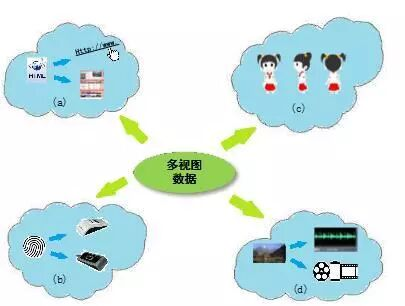
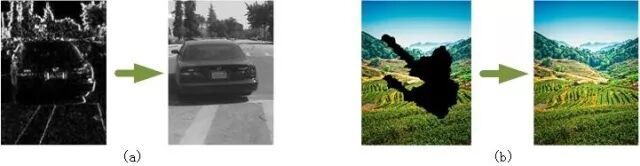
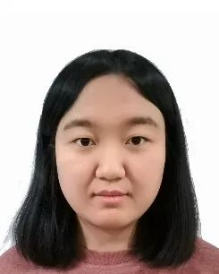

# 基于生成对抗网络的多视图学习与重构算法

原创 自动化学报 2018-07-04 15:21 北京

> 原文地址: [https://mp.weixin.qq.com/s/AoPZl4hxFdCzj4nYVUn1MQ](https://mp.weixin.qq.com/s/AoPZl4hxFdCzj4nYVUn1MQ)

  

**多视图学习与重构是指**：在同一事物缺失部分视图数据的场景下，通过不同视图数据之间相关性的分析，构建其他视图，获得事物的完整表达。

  

在实际应用问题中，对于同一事物可以从多种不同的途径或不同的角度进行描述，这些不同的描述构成了事物的多个视图。事物的多视图数据在真实世界中广泛存在并且影响着人们生活的方方面面。例如：在与人们生活息息相关的互联网中，网页数据既可以用网页本身包含信息的特征集描述，也可以用超链接包含的信息描述。此外，同一事物由于数据采集方式不同，也可以有不同的表达方法。例如：使用不同传感器采集一个人的指纹就形成了多种不同的印痕，构成了指纹数据的多个视图。

多视图数据的不同表达方式

（a） 一张网页由超链接或网页内容描述；(b) 一个指纹由光学指纹仪或电容式指纹仪采集；(c) 一个人由多种不同的视觉角度描述；（d） 一张图片由音频或视频描述

同一事物的多视图数据可以有助于人们全面地认识事物，对事物进行更加精确的表达。然而，在现实场景中数据通常独立地收集、处理和存储。受环境因素的影响，给定一个实例，通常很难获得其所有视图的数据，并且可能由于存储管理等问题，发生视图信息缺失等情况。

因此，面对现实应用中复杂的多视图场景，如何利用已掌握的视图数据，构建事物的其他视图数据是亟需解决的问题。

构建视图示例

(a)纹理视图构建完整视图  (b) 缺失视图构建完整视图

**如何利用单一已知视图构建其他视图？**目前，一种较为通用的做法采用密度估计方法，即给定已知视图，估计其他视图的条件概率分布。但是不同视图间的表达方式是不全相同的，因此直接进行视图间的映射不是十分可行的。本文提出一种基于生成对抗网络的为多视图数据构建表征的算法。首先为不同的视图构建通用的表征向量，然后引入生成对抗网络的思想，恢复表征向量的信息和丰富自己独有的数据表达的信息。该算法有效避免了不同表达方式的视图间的直接映射，极大保留了各视图间的互信息，并利用对抗生成的方式解决了视图间重构的问题，提高了生成数据的真实性。对获得事物的全面性表达提供了有效的手段。最后，在手写体数字数据集、街景数字数据集和人脸数据集上的实验验证了该算法的可行性和有效性，并指出了未来有意义的研究工作。本文具体的贡献可以概括如下：

1)提出了多视图通用表征学习方法，避免了视图间的直接映射；

2)使用了生成对抗网络的思想构建视图数据，避免了传统的生成式方法，生成的样本更加接近于真实数据；

3)将已知视图的表征向量加入生成模型和判别模型中，解决了新视图数据与已知视图数据正确对应的问题。

**引用格式**

孙亮, 韩毓璇, 康文婧, 葛宏伟. 基于生成对抗网络的多视图学习与重构算法. 自动化学报, 2018, 44(5): 819-828

**作者简介**

孙亮，大连理工大学计算机科学与技术学院讲师。2012年获得吉林大学计算机应用技术博士学位和高知工科大学信息科学博士学位。主要研究方向为机器学习、计算智能、群智计算理论与应用。

Email: liangsun@dlut.edu.cn

韩毓璇，大连理工大学计算机科学与技术学院硕士研究生。主要研究方向为智能计算与机器学习方法。

Email: yuxuanhan@mail.dlut.edu.cn

康文婧，大连理工大学计算机科学与技术学院硕士研究生，主要研究方向为智能计算与机器学习方法。 

Email: wjkang@mail.dlut.edu.cn

葛宏伟，大连理工大学计算机科学与技术学院副教授。2006年获得吉林大学计算机应用技术博士学位。主要研究方向为计算智能、机器学习、系统建模与优化。本文通信作者。

Email: hwge@dlut.edu.cn

自动化

学报

往期回顾

[生成式对抗网络：从生成数据到创造智能](http://mp.weixin.qq.com/s?__biz=MzAwMzAzMDgxOA==&mid=2651063870&idx=1&sn=1e1d7562a4bbe4c31e2fdef4859c0bc4&chksm=8131cc73b6464565d9419524cd87b4bbe363384f0ba722017e91a49af4640d349403ea9a0ea6&scene=21#wechat_redirect)  

[人工智能研究的新前线：生成式对抗网络](http://mp.weixin.qq.com/s?__biz=MzAwMzAzMDgxOA==&mid=2651063920&idx=1&sn=9094936d46b4bab696df49c408fa1656&chksm=8131cc3db646452b0cba9ebdee9672b9ae010166a941ef19d5972616235193048a3346cf54f0&scene=21#wechat_redirect)  

[一种能量函数意义下的生成式对抗网络](http://mp.weixin.qq.com/s?__biz=MzAwMzAzMDgxOA==&mid=2651063930&idx=1&sn=8fc4569fbc51adb78002a6c492a7b58f&chksm=8131cc37b646452180ad8b4be28b69e9e1767c94cf2bf8b712074d8b26e72fffd95146d9fac5&scene=21#wechat_redirect)  

[协作式生成对抗网络](http://mp.weixin.qq.com/s?__biz=MzAwMzAzMDgxOA==&mid=2651063937&idx=1&sn=b3bb0ca500fa6f1e5b2d4fdc476187ed&chksm=8131ccccb64645daca101424f49facb82039d857908b8467fc5033a3b254fc348376128fef89&scene=21#wechat_redirect)  

[融合对抗学习的因果关系抽取](http://mp.weixin.qq.com/s?__biz=MzAwMzAzMDgxOA==&mid=2651063950&idx=1&sn=073948b72538b1547399cd7d3ba0b847&chksm=8131ccc3b64645d5c3c82fb7baa62c0cd2644c19f626a6a0904b6223bf155b8e77045006815a&scene=21#wechat_redirect)

欢迎扫描二维码、长按图片识别关注《自动化学报》中文版订阅号aas1963，服务号自动化学报和英文版服务号！

JAS《自动化学报》（英文版）

自动化学报服务号

自动化学报订阅号

  

联系我们

Tel:  010-82544653（日常咨询和稿件处理） 

        010-82544677（录用后稿件处理）

Fax: 010-82544497

Email: aas@ia.ac.cn（日常咨询和稿件处理）

          aas\_editor@ia.ac.cn（录用后稿件处理）

http://www.aas.net.cn

点击阅读原文，了解更多精彩内容