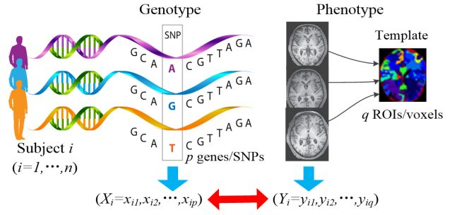
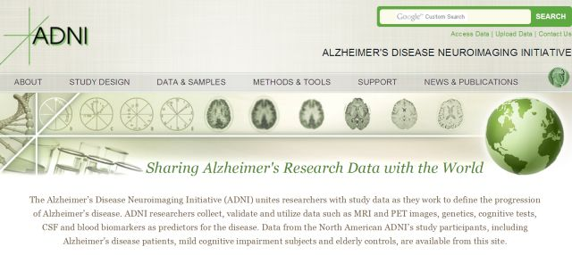
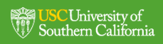
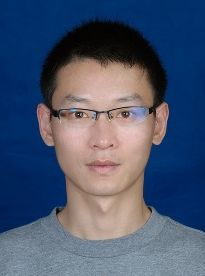
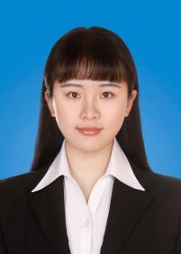
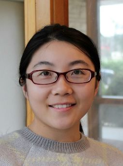
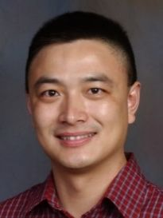
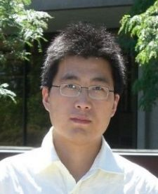

# 基于统计学习的影像遗传学方法综述

原创 自动化学报 2018-02-07 09:00 北京

> 原文地址: [https://mp.weixin.qq.com/s/L3agfEQ609Ssvmcusvpw5g](https://mp.weixin.qq.com/s/L3agfEQ609Ssvmcusvpw5g)

**基于统计学习的影像遗传学方法：**统计学习方法作为基于数据驱动的关联分析强有力工具，能够充分利用生物标志数据内在的结构信息构建模型来分析易感基因与大脑结构或者功能的相关性，从而更好地揭示脑认知行为或者相关疾病的产生机制。

近年来随着多模态神经影像技术和基因检测技术的发展，影像遗传学这一交叉学科的研究能够运用脑影像技术将人类大脑的结构与功能作为表型来评价基因对个体的影响，使得人们可以在脑的宏观结构上以更客观的测量手段理解基因对行为或精神疾病的影响。

基因SNP与脑影像关联分析框架

早期的影像遗传学是单变量成对的统计分析方法，即通过多次检验，发现单核苷酸多态性 （Single nucleotide polymorphism，SNP）或者基因与复杂疾病或可测的数量性状（Quantitative trait，QT）的关联性研究方法。单变量分析方法在影像遗传学中的应用具有较为直观的解释性，能够简单快速地检测出单个SNP 与单个 QT 之间的关联程度，但由于数据变量的高维特性而导致的很大数量的多重比较最终使得统计测试结果不具有显著性，而且上述检验方法基于一个严格的假设，即基因位点或者影像特征变量之间是统计独立的，而忽略了变量之间相关性这一重要信息。因此，面对单变量方法存在的不足，在高维特征的基因影像关联分析这一研究问题中仍然需要在方法学上进行改进和创新。

数据实验平台Alzheimer's Disease Neuroimaging Initiative

近期，基于统计学习的影像遗传学重点关注基于结构化的多变量分析建模思路和算法框架，即通过生物学过程以及医学领域知识如代谢通路/网络、多模态融合、诊断信息等) 诱导的方法获得更好的关联性能和生物解释，例如：

1）多变量基因回归单变量影像：（多基因）结构化稀疏现行回归模型。

2）多变量影像回归单变量基因：（纵向/多模态影像）稀疏多任务回归模型。

3）多变量基因回归多变量影像：稀疏多任务回归、稀疏低秩回归模型。

4）多变量基因关联多变量影像：结构化稀疏典型相关分析、稀疏偏最小二乘回归模型。

影像遗传学作为新兴的前沿交叉学科，涉及到了神经科学、影像学、遗传学、 医学、生物统计学等多种科学和研究技术。而基因组、多模态影像组数据（包括不同时间点的纵向脑影像）也为影像遗传学研究提供了丰富的数据实验平台，使得基因与脑结构或者功能之间产生关联的致病机制能够通过具有遗传特性的影像内表型呈现出来。该综述回顾了近年来基于稀疏学习的关联分析算法在影像遗传学研究领域的应用，大量的实验和报告显示模型所检测到的部分关联结果也在生物和医学界得到了验证。

引用格式

郝小可, 李蝉秀, 严景文, 沈理, 张道强. 基于统计学习的影像遗传学方法综述. 自动化学报, 2018, 44(1): 13-24

作者简介

郝小可，河北工业大学计算机科学与软件学院讲师。2017年在南京航空航天大学计算机科学与技术学院获得博士学位。主要研究方向为机器学习、数据挖掘、影像遗传学。

E-mail: robinhc@163.com

李蝉秀，南京航空航天大学计算机科学与技术学院硕士研究生。2015年在南京航空航天大学计算机科学与技术学院获得学士学位。主要研究方向为机器学习、影像遗传学。

E-mail: lcx show@nuaa.edu.cn

严景文，印第安纳大学普渡大学印第安纳波利斯联合分校信息学与计算学院生物健康信息学系助理教授。2015年获得印第安纳大学信息学与计算学院博士学位。 主要研究方向为机器学习、影像遗传学。

E-mail: jingyan@iupui.edu

沈 理，印第安纳大学医学院放射学与影像科学系副教授。曾在达特茅斯学院获得博士学位，专业为计算机科学。主要研究方向为医学影像计算、信息生物学、影像遗传学、脑连接组。

E-mail: shenli@iu.edu

张道强，南京航空航天大学计算机科学与技术学院教授。2004年在南京航空航天大学获得博士学位。主要研究方向为机器学习、模式识别、数据挖掘以及医学影像分析。本文通信作者。

E-mail: dqzhang@nuaa.edu.cn

欢迎扫描二维码、长按图片识别关注《自动化学报》中文版订阅号aas1963，服务号自动化学报和英文版服务号！

JAS《自动化学报》（英文版）

自动化学报服务号

自动化学报订阅号

  

联系我们

Tel:  010-82544653（日常咨询和稿件处理） 

        010-82544677（录用后稿件处理）

Fax: 010-82544497

Email: aas@ia.ac.cn（日常咨询和稿件处理）

          aas\_editor@ia.ac.cn（录用后稿件处理）

http://www.aas.net.cn

  

点击阅读原文查看更多