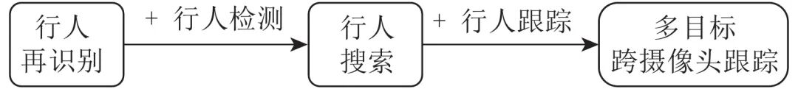
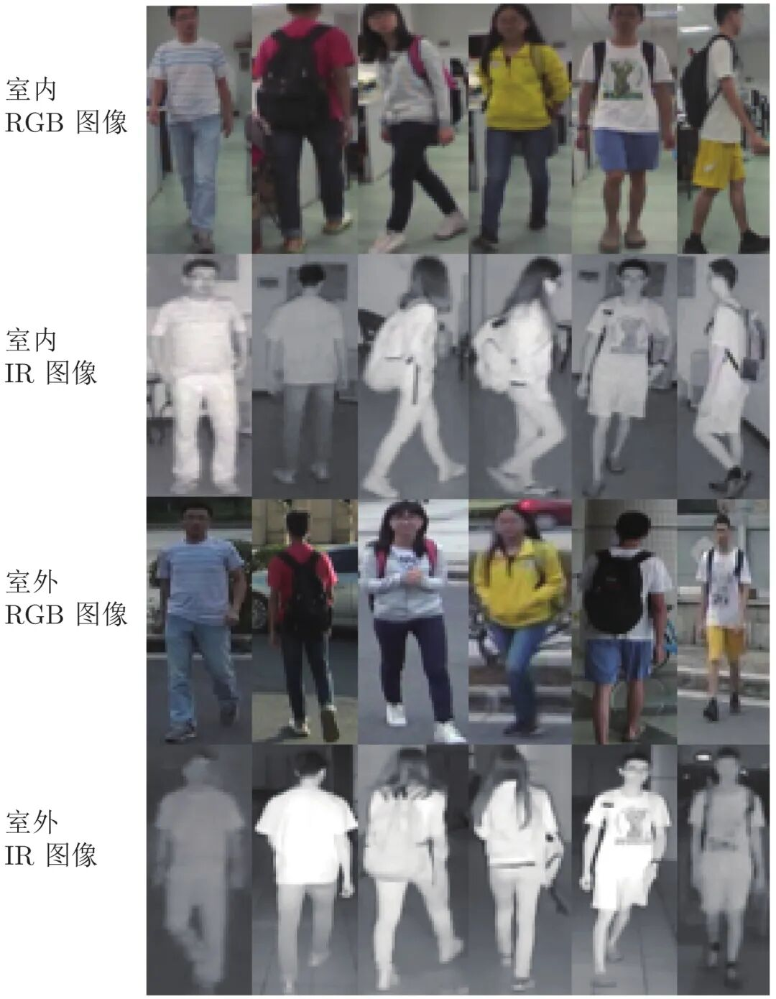
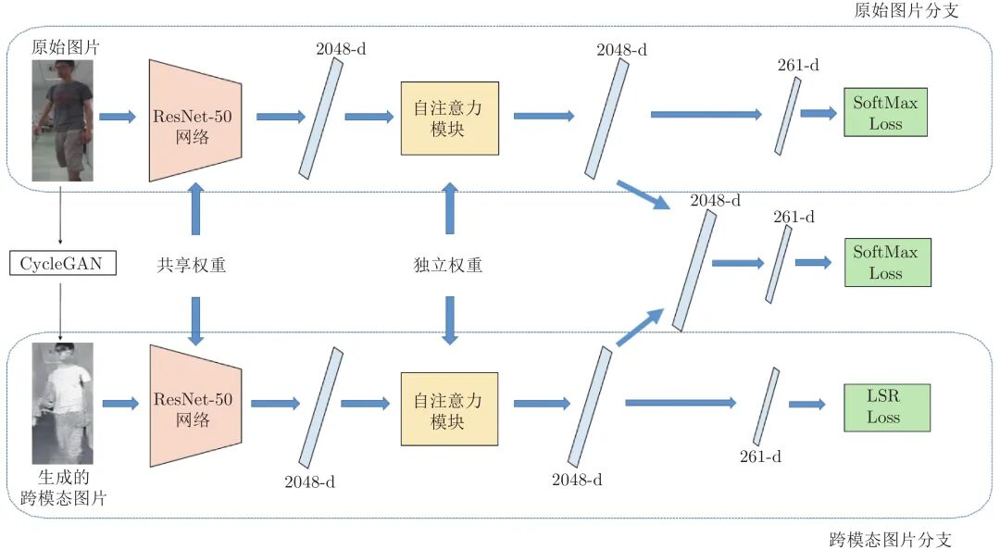

# 基于自注意力模态融合网络的跨模态行人再识别方法研究

原创 自动化学报 自动化学报 2022-05-23 17:47 北京

> 原文地址: [https://mp.weixin.qq.com/s/-6iy6HpC9rdTAPeBO4JXwA](https://mp.weixin.qq.com/s/-6iy6HpC9rdTAPeBO4JXwA)

**点击蓝字 关注我们**

  

**引****用本文**

  

杜鹏, 宋永红, 张鑫瑶. 基于自注意力模态融合网络的跨模态行人再识别方法研究. 自动化学报, 2022, 48(6): 1457-1468 doi: 10.16383/j.aas.c190340

Du Peng, Song Yong-Hong, Zhang Xin-Yao. Self-attention cross-modality fusion network for cross-modality person re-identification. Acta Automatica Sinica, 2022, 48(6): 1457-1468 doi: 10.16383/j.aas.c190340  

http://www.aas.net.cn/cn/article/doi/10.16383/j.aas.c190340?viewType=HTML

  

**文章简介**

  

**关键词**

  

跨模态行人再识别, 自注意力, 模态融合, CycleGAN

  

**摘   要**

  

行人再识别是实现多目标跨摄像头跟踪的核心技术, 该技术能够广泛应用于安防、智能视频监控、刑事侦查等领域. 一般的行人再识别问题面临的挑战包括摄像机的低分辨率、行人姿态变化、光照变化、行人检测误差、遮挡等. 跨模态行人再识别相比于一般的行人再识别问题增加了相同行人不同模态的变化. 针对跨模态行人再识别中存在的模态变化问题, 本文提出了一种自注意力模态融合网络. 首先是利用CycleGAN生成跨模态图像. 在得到了跨模态图像后利用跨模态学习网络同时学习两种模态图像特征, 对于原始数据集中的图像利用SoftMax 损失进行有监督的训练, 对生成的跨模态图像利用LSR (Label smooth regularization) 损失进行有监督的训练. 之后, 使用自注意力模块将原始图像和CycleGAN生成的图像进行区分, 自动地对跨模态学习网络的特征在通道层面进行筛选. 最后利用模态融合模块将两种筛选后的特征进行融合. 通过在跨模态数据集SYSU-MM01上的实验证明了本文提出的方法和跨模态行人再识别其他方法相比有一定程度的性能提升.

  

**引   言**

  

近年来, 伴随着视频采集技术的大力发展, 大量的监控摄像头部署在商场、公园、学校等公共场所. 监控摄像的出现给人们带来了极大的便利, 其中最直接的一个好处就是可以帮助公安等执法部门解决盗窃、抢劫等重大刑事案件. 但是正是由于监控摄像头布置的区域十分广阔, 基本在大中小城市中都遍地布满了监控摄像头, 当一个目标人物在一个城市的监控摄像网络中移动时, 往往会导致公安等相关部门人员在一定时间内在整个网络中对监控视频进行查看, 这对公安等相关部门进行区域的管理以及视频的查看带来了较大的不便. 因此, 需要一种方便、快捷的方式来代替人工对监控视频中行人进行搜寻. 为了实现对监控视频中的行人进行搜寻这个目标, 其本质就是要实现多目标跨摄像头追踪, 而行人再识别技术是多目标跨摄像头追踪问题的核心与关键. 行人再识别和多目标跨摄像头追踪的关系如图1所示. 实际场景中, 摄像头拍摄到的是包含众多行人与复杂背景的图像, 这个时候可以利用行人检测技术从拍摄到的复杂全景图像中得到行人包围框, 之后对于行人包围框集合利用行人再识别技术进行搜寻.

  

图 1  行人再识别和多目标跨摄像头跟踪关系示意

  

除此之外, 犯罪分子通常会在夜间行动, 这时仅仅靠RGB相机去采集图像不能很好地解决这种夜间出现的行人匹配问题. 为了对夜晚出现的行人也能进行匹配, 除了RGB相机外, 有些地方可能会布控红外(Infrared, IR)相机, 这样, 在夜间或者是光线较暗处也可以采集到行人的红外图, 弥补了在夜晚传统的RGB相机采集失效的问题. 在这种情况下, RGB图和IR图之间的跨模态匹配(跨模态行人再识别)具有很重要的现实意义. 跨模态匹配的重点是寻找不同模态间的相似性, 从而跨越模态对行人再识别的限制.

  

跨模态行人再识别相对于传统的行人再识别, 除了面临行人之间姿态变化、视角变化等问题外, 数据之间还存在跨模态的难点. 图2为跨模态行人再识别数据集中的行人数据. 图中第1行为在白天通过RGB相机在室内采集到的RGB图像; 第2行为在夜晚通过红外相机在室内采集到的IR图像; 第3行为白天在室外采集到的RGB图像; 第4行为夜晚在室外采集到的IR图像. 每一列的4张图片属于同一个人, 不同列的图片属于不同的人. 与传统的RGB-RGB图像之间的匹配不同, 跨模态数据集上所关注的是IR图像和RGB图像之间的匹配, 这种跨模态匹配为行人再识别增加了不少难度, 如图2中第3列和第4列的两个行人, 通过RGB图可以很好地进行区分, 但通过IR图和RGB图匹配, 难度有一定程度的提升.

  

图 2  跨模态行人再识别数据

  

针对上述这些问题, 本文主要创新点如下:

  

1)提出一种自注意力模态融合网络以解决跨模态行人再识别中存在的模态变化问题;

  

2)提出使用CycleGAN对图像进行模态间的转换, 从而解决学习时需要对应的样本对问题;

  

3)提出使用自注意力机制进行不同模态之间的特征筛选, 从而有效地对原始图像和使用CycleGAN生成的图像进行区分.

  

图 3  自注意力模态融合网络

  

请点击左下角“**阅读原文**”了解更多！

  

**作者简介**

**杜   鹏**

西安交通大学软件学院硕士研究生. 主要研究方向为行人再识别.

E-mail: xjydupeng@163.com

**宋永红**

西安交通大学人工智能学院研究员. 主要研究方向为图像与视频内容理解, 智能软件开发. 本文通信作者.

E-mail: songyh@xjtu.edu.cn

**张鑫瑶**

西安交通大学软件学院硕士研究生. 主要研究方向为行人再识别.

E-mail: xyzhangxy@stu.xjtu.edu.cn

  

**相关文章**

**（请向上滑动阅读）**

  

\[1\]  林懿伦, 戴星原, 李力, 王晓, 王飞跃. 人工智能研究的新前线：生成式对抗网络. 自动化学报, 2018, 44(5): 775-792. doi: 10.16383/j.aas.2018.y000002

http://www.aas.net.cn/cn/article/doi/10.16383/j.aas.2018.y000002?viewType=HTML

  

\[2\]  梁文琦, 王广聪, 赖剑煌. 基于多对多生成对抗网络的非对称跨域迁移行人再识别. 自动化学报, 2022, 48(1): 103-120. doi: 10.16383/j.aas.c190303

http://www.aas.net.cn/cn/article/doi/10.16383/j.aas.c190303?viewType=HTML

  

\[3\]  尹明, 吴浩杨, 谢胜利, 杨其宇. 基于自注意力对抗的深度子空间聚类. 自动化学报, 2022, 48(1): 271-281. doi: 10.16383/j.aas.c200302

http://www.aas.net.cn/cn/article/doi/10.16383/j.aas.c200302?viewType=HTML

  

\[4\]  穆世义, 徐树公. 基于单字符注意力的全品类鲁棒车牌识别. 自动化学报. doi: 10.16383/j.aas.c211210

http://www.aas.net.cn/cn/article/doi/10.16383/j.aas.c211210?viewType=HTML

  

\[5\]  暴琳, 孙晓燕, 巩敦卫, 张勇. 融合注意力机制的增强受限玻尔兹曼机驱动的交互式分布估计算法. 自动化学报. doi: 10.16383/j.aas.c200604

http://www.aas.net.cn/cn/article/doi/10.16383/j.aas.c200604?viewType=HTML

  

\[6\]  张颐康, 张恒, 刘永革, 刘成林. 基于跨模态深度度量学习的甲骨文字识别. 自动化学报, 2021, 47(4): 791-800. doi: 10.16383/j.aas.c200443

http://www.aas.net.cn/cn/article/doi/10.16383/j.aas.c200443?viewType=HTML

  

\[7\]  王亚朝, 赵伟, 徐海洋, 刘建业. 基于多阶段注意力机制的多种导航传感器故障识别研究. 自动化学报, 2021, 47(12): 2784-2790. doi: 10.16383/j.aas.c190435

http://www.aas.net.cn/cn/article/doi/10.16383/j.aas.c190435?viewType=HTML

  

\[8\]  张玉康, 谭磊, 陈靓影. 基于图像和特征联合约束的跨模态行人重识别. 自动化学报, 2021, 47(8): 1943-1950. doi: 10.16383/j.aas.c200184

http://www.aas.net.cn/cn/article/doi/10.16383/j.aas.c200184?viewType=HTML

  

\[9\]  林泓, 任硕, 杨益, 张杨忆. 融合自注意力机制和相对鉴别的无监督图像翻译. 自动化学报, 2021, 47(9): 2226-2237. doi: 10.16383/j.aas.c190074

http://www.aas.net.cn/cn/article/doi/10.16383/j.aas.c190074?viewType=HTML

  

\[10\]  李新利, 邹昌铭, 杨国田, 刘禾. SealGAN: 基于生成式对抗网络的印章消除研究. 自动化学报, 2021, 47(11): 2614-2622. doi: 10.16383/j.aas.c190459

http://www.aas.net.cn/cn/article/doi/10.16383/j.aas.c190459?viewType=HTML

  

\[11\]  张亚茹, 孔雅婷, 刘彬. 多维注意力特征聚合立体匹配算法. 自动化学报. doi: 10.16383/j.aas.c200778

http://www.aas.net.cn/cn/article/doi/10.16383/j.aas.c200778?viewType=HTML

  

\[12\]  刘一敏, 蒋建国, 齐美彬, 刘皓, 周华捷. 融合生成对抗网络和姿态估计的视频行人再识别方法. 自动化学报, 2020, 46(3): 576-584. doi: 10.16383/j.aas.c180054

http://www.aas.net.cn/cn/article/doi/10.16383/j.aas.c180054?viewType=HTML

  

\[13\]  肖进胜, 申梦瑶, 江明俊, 雷俊峰, 包振宇. 融合包注意力机制的监控视频异常行为检测. 自动化学报. doi: 10.16383/j.aas.c190805

http://www.aas.net.cn/cn/article/doi/10.16383/j.aas.c190805?viewType=HTML

  

\[14\]  周勇, 王瀚正, 赵佳琦, 陈莹, 姚睿, 陈思霖. 基于可解释注意力部件模型的行人重识别方法. 自动化学报. doi: 10.16383/j.aas.c200493

http://www.aas.net.cn/cn/article/doi/10.16383/j.aas.c200493?viewType=HTML

  

\[15\]  吴彦丞, 陈鸿昶, 李邵梅, 高超. 基于行人属性先验分布的行人再识别. 自动化学报, 2019, 45(5): 953-964. doi: 10.16383/j.aas.c170691

http://www.aas.net.cn/cn/article/doi/10.16383/j.aas.c170691?viewType=HTML

  

\[16\]  王金甲, 纪绍男, 崔琳, 夏静, 杨倩. 基于注意力胶囊网络的家庭活动识别. 自动化学报, 2019, 45(11): 2199-2204. doi: 10.16383/j.aas.c180721

http://www.aas.net.cn/cn/article/doi/10.16383/j.aas.c180721?viewType=HTML

  

\[17\]  李幼蛟, 卓力, 张菁, 李嘉锋, 张辉. 行人再识别技术综述. 自动化学报, 2018, 44(9): 1554-1568. doi: 10.16383/j.aas.2018.c170505

http://www.aas.net.cn/cn/article/doi/10.16383/j.aas.2018.c170505?viewType=HTML

  

\[18\]  姚涛, 孔祥维, 付海燕, TIANQi. 基于映射字典学习的跨模态哈希检索. 自动化学报, 2018, 44(8): 1475-1485. doi: 10.16383/j.aas.2017.c160433

http://www.aas.net.cn/cn/article/doi/10.16383/j.aas.2017.c160433?viewType=HTML

  

\[19\]  张淑美, 王福利, 谭帅, 王姝. 多模态过程的全自动离线模态识别方法. 自动化学报, 2016, 42(1): 60-80. doi: 10.16383/j.aas.2016.c150048

http://www.aas.net.cn/cn/article/doi/10.16383/j.aas.2016.c150048?viewType=HTML

  

\[20\]  冯欣, 杨丹, 张凌. 基于视觉注意力变化的网络丢包视频质量评估. 自动化学报, 2011, 37(11): 1322-1331. doi: 10.3724/SP.J.1004.2011.01322

http://www.aas.net.cn/cn/article/doi/10.3724/SP.J.1004.2011.01322?viewType=HTML

  

\[21\]  李永, 殷建平, 祝恩, 李宽. 基于FAR和FRR融合的多模态生物特征识别. 自动化学报, 2011, 37(4): 408-417. doi: 10.3724/SP.J.1004.2011.00408

http://www.aas.net.cn/cn/article/doi/10.3724/SP.J.1004.2011.00408?viewType=HTML

  

  

**近期文章**

[基于多阶运动参量的四旋翼无人机识别方法](http://mp.weixin.qq.com/s?__biz=MzAwMzAzMDgxOA==&mid=2651077767&idx=1&sn=587115a6ffee6f33a5113a392bafd18e&chksm=8131f6cab6467fdc113dfc124638e9f0c73bfc2cc606025b4bc5c630bd6c5569b8948c3a2bad&scene=21#wechat_redirect)

[通信延时环境下异质网联车辆队列非线性纵向控制](http://mp.weixin.qq.com/s?__biz=MzAwMzAzMDgxOA==&mid=2651077767&idx=2&sn=d497bd4b45545cdc7584e9c9568ef4e0&chksm=8131f6cab6467fdc01f675bd4ea8b4823af1ff46862041b55d3b58ce8903265b6efd60bbc281&scene=21#wechat_redirect)

[图像异常检测研究现状综述](http://mp.weixin.qq.com/s?__biz=MzAwMzAzMDgxOA==&mid=2651077688&idx=1&sn=2535d4c0961f79a4e6e28fcec08d2fed&chksm=8131f675b6467f63e42dec407492be9cccdbf245e71dd2cd84b1d4af8072250b8b9f0f01329c&scene=21#wechat_redirect)

[一种面向散乱点云语义分割的深度残差−特征金字塔网络框架](http://mp.weixin.qq.com/s?__biz=MzAwMzAzMDgxOA==&mid=2651077688&idx=2&sn=215768980627e71df84a39bb85729db9&chksm=8131f675b6467f63c4393a4fce391e67237c29928058a3e2dfd5971800e636c3baa090fb4dba&scene=21#wechat_redirect)

[迭代学习模型预测控制研究现状与挑战](http://mp.weixin.qq.com/s?__biz=MzAwMzAzMDgxOA==&mid=2651077623&idx=1&sn=1d8a9d2a39cab773fd8b49e8e73c55fd&chksm=8131f1bab64678ac33f4512961aa95fe90d40e9dbd6c4e13cad77295f4940b6aef050700caac&scene=21#wechat_redirect)

[《自动化学报》2022年48卷5期目录分享](http://mp.weixin.qq.com/s?__biz=MzAwMzAzMDgxOA==&mid=2651077579&idx=1&sn=d2cf8dfd19e4104f5958b4ad6356239d&chksm=8131f186b6467890faae7fb5e1bdb23ca54b21a631ce9c32c47dc615ff926149628b9bf9b64b&scene=21#wechat_redirect)

[基于多节点拓扑重叠测度高阶MRF模型的图像分割](http://mp.weixin.qq.com/s?__biz=MzAwMzAzMDgxOA==&mid=2651077552&idx=1&sn=c40ec0d4fa5686c5221844003ead45de&chksm=8131f1fdb64678eb229154ac8f5cf5166c6a0bac57e1f50b65d7eba7e99778e2f7d80fb7547b&scene=21#wechat_redirect)

[基于分布式有限感知网络的多伯努利目标跟踪](http://mp.weixin.qq.com/s?__biz=MzAwMzAzMDgxOA==&mid=2651077514&idx=1&sn=ca1172c74ab9e32db9bca7c66082fee8&chksm=8131f1c7b64678d1129b3d8832fe3670fdde3ed267c0f98f178110b649b4042c8c903b2f673f&scene=21#wechat_redirect)

[一类非线性系统模糊自适应固定时间量化反馈控制](http://mp.weixin.qq.com/s?__biz=MzAwMzAzMDgxOA==&mid=2651077514&idx=2&sn=eb7906d16b1727ef482e6bf319f0a7e1&chksm=8131f1c7b64678d1c5a98c4614c347fee33b2d2498c76d1e5c950fce2cc304317670650273ee&scene=21#wechat_redirect)

[基于凸近似的避障原理及无人驾驶车辆路径规划模型预测算法](http://mp.weixin.qq.com/s?__biz=MzAwMzAzMDgxOA==&mid=2651077442&idx=1&sn=432dd266dbf5c99ca845248bb09df5c1&chksm=8131f10fb646781977984ae605369c8004b7c57f61747a28c49813698802554d4a11047abea0&scene=21#wechat_redirect)

[多级注意力传播驱动的生成式图像修复方法](http://mp.weixin.qq.com/s?__biz=MzAwMzAzMDgxOA==&mid=2651077391&idx=1&sn=0e34736530d8ef540b4abaa08362a0bf&chksm=8131f142b6467854f8396d0ea54b34946bbe5fb78f29a281271dab33867ae129a5b401c36277&scene=21#wechat_redirect)

[一种噪声容错弱监督矩阵补全的生存分析方法](http://mp.weixin.qq.com/s?__biz=MzAwMzAzMDgxOA==&mid=2651077391&idx=2&sn=b84c8750f960526618606c0b97e56d06&chksm=8131f142b6467854d25b0873e4bcb1b30dd5c1ee99db58bbd7b6d5ea5109e868878d7ee1689d&scene=21#wechat_redirect)

[通信受限的多智能体系统二分实用一致性](http://mp.weixin.qq.com/s?__biz=MzAwMzAzMDgxOA==&mid=2651077321&idx=1&sn=02d81030a428cbb4275f4ff076068f08&chksm=8131f084b646799235c36b924d470f26f4e4da762c08d57e951613e4f74a57febdc8c03777c9&scene=21#wechat_redirect)

  

**热点文章**

[通信延时环境下异质网联车辆队列非线性纵向控制](http://mp.weixin.qq.com/s?__biz=MzAwMzAzMDgxOA==&mid=2651077767&idx=2&sn=d497bd4b45545cdc7584e9c9568ef4e0&chksm=8131f6cab6467fdc01f675bd4ea8b4823af1ff46862041b55d3b58ce8903265b6efd60bbc281&scene=21#wechat_redirect)

[图像异常检测研究现状综述](http://mp.weixin.qq.com/s?__biz=MzAwMzAzMDgxOA==&mid=2651077688&idx=1&sn=2535d4c0961f79a4e6e28fcec08d2fed&chksm=8131f675b6467f63e42dec407492be9cccdbf245e71dd2cd84b1d4af8072250b8b9f0f01329c&scene=21#wechat_redirect)

[迭代学习模型预测控制研究现状与挑战](http://mp.weixin.qq.com/s?__biz=MzAwMzAzMDgxOA==&mid=2651077623&idx=1&sn=1d8a9d2a39cab773fd8b49e8e73c55fd&chksm=8131f1bab64678ac33f4512961aa95fe90d40e9dbd6c4e13cad77295f4940b6aef050700caac&scene=21#wechat_redirect)

[2022年第05期](http://mp.weixin.qq.com/s?__biz=MzAwMzAzMDgxOA==&mid=2651077579&idx=1&sn=d2cf8dfd19e4104f5958b4ad6356239d&chksm=8131f186b6467890faae7fb5e1bdb23ca54b21a631ce9c32c47dc615ff926149628b9bf9b64b&scene=21#wechat_redirect)

[基于凸近似的避障原理及无人驾驶车辆路径规划模型预测算法](http://mp.weixin.qq.com/s?__biz=MzAwMzAzMDgxOA==&mid=2651077442&idx=1&sn=432dd266dbf5c99ca845248bb09df5c1&chksm=8131f10fb646781977984ae605369c8004b7c57f61747a28c49813698802554d4a11047abea0&scene=21#wechat_redirect)

[通信受限的多智能体系统二分实用一致性](http://mp.weixin.qq.com/s?__biz=MzAwMzAzMDgxOA==&mid=2651077321&idx=1&sn=02d81030a428cbb4275f4ff076068f08&chksm=8131f084b646799235c36b924d470f26f4e4da762c08d57e951613e4f74a57febdc8c03777c9&scene=21#wechat_redirect)

[【热点专题】多目标优化](http://mp.weixin.qq.com/s?__biz=MzI2NjA3MzM5MA==&mid=2649962438&idx=1&sn=83b21f7b6a63fc4e01c2f4718b2aae92&chksm=f2943387c5e3ba91ce32286c06f215a989233f55bbbd5c7d436a43c40615bb5ae208d0f0f228&scene=21#wechat_redirect)

[一种基于深度迁移学习的滚动轴承早期故障在线检测方法](http://mp.weixin.qq.com/s?__biz=MzAwMzAzMDgxOA==&mid=2651076931&idx=2&sn=128b1673843353529d8b130f372bb46f&chksm=8131f30eb6467a18e0f645b207ada16cd601b791297b32b1caccf72daa50b55063074ec4fdc3&scene=21#wechat_redirect)

[基于多智能体强化学习的乳腺癌致病基因预测](http://mp.weixin.qq.com/s?__biz=MzAwMzAzMDgxOA==&mid=2651076931&idx=1&sn=a62942cd056156ad5a885d6350e8b373&chksm=8131f30eb6467a18ffbee77b25fb9b0417b08918d3625d04c89a3a9bcb1490eece239c5fda25&scene=21#wechat_redirect)

[基于事件触发的离散MIMO系统自适应评判容错控制](http://mp.weixin.qq.com/s?__biz=MzAwMzAzMDgxOA==&mid=2651076863&idx=1&sn=aec9cf55a1b0b8eae741999601a8c6df&chksm=8131f2b2b6467ba4c20d388390d4ac191555e5d00d77f510f72af77359d18bdca5230ea52df0&scene=21#wechat_redirect)

[水下多机器人系统综述](http://mp.weixin.qq.com/s?__biz=MzAwMzAzMDgxOA==&mid=2651076668&idx=1&sn=b50e43710be8208fd711cd45943e95c0&chksm=8131f271b6467b675083610c925ce0d329e201ddab5c8e935eb266fbf41418395459fdd0618d&scene=21#wechat_redirect)

[基于事件触发二阶多智能体系统的固定时间比例一致性](http://mp.weixin.qq.com/s?__biz=MzAwMzAzMDgxOA==&mid=2651076637&idx=2&sn=fcf40a44a926c9034593207d6a614e95&chksm=8131f250b6467b46e70d4ef5f10226fbed60a0d12e327f83c793d86e7815ff00e4fcafcac295&scene=21#wechat_redirect)

[基于事件触发的分布式优化算法](http://mp.weixin.qq.com/s?__biz=MzAwMzAzMDgxOA==&mid=2651076142&idx=2&sn=b074793ec4be44ea08efb78617dcdcc0&chksm=8131fc63b6467575b7f6d698909e56be16089f8f56ca415294483ff6f40902c7546417f82531&scene=21#wechat_redirect)

  

**期刊动态**

[《自动化学报》多名作者入选爱思唯尔2021中国高被引学者](http://mp.weixin.qq.com/s?__biz=MzAwMzAzMDgxOA==&mid=2651076637&idx=1&sn=ee78f108cf0551024cb95c33241a5f1d&chksm=8131f250b6467b46c8d4af1bd63381328a80c65ade97a6daa97e3bb4538b39c6f761da238066&scene=21#wechat_redirect)

[自动化学报（英文版）和自动化学报入选计算领域高质量科技期刊T1类](http://mp.weixin.qq.com/s?__biz=MzAwMzAzMDgxOA==&mid=2651073859&idx=2&sn=7a9192717637dcf6cddb39ed961e8c3b&chksm=8131e70eb6466e188a123c504bdeba80c75681de4762f8685b3bf584bc33eb12362c70613b4e&scene=21#wechat_redirect)

[《自动化学报》编辑部防诈骗公告](http://mp.weixin.qq.com/s?__biz=MzAwMzAzMDgxOA==&mid=2651073517&idx=1&sn=c52de7c685e546af9faffc0cefab1c85&chksm=8131e1a0b64668b63ebaa68ea81cbaec3b94dc52ea8360821a0a49e67ae7e4b428a25d0f19c5&scene=21#wechat_redirect)

[《自动化学报》致谢审稿人](http://mp.weixin.qq.com/s?__biz=MzI2NjA3MzM5MA==&mid=2649961201&idx=1&sn=3142842d75c441ae860c1ecb313c7657&chksm=f29436b0c5e3bfa6c679210f60513eb1a7205dc20fe028f482bb593eac60427e4e56fba12493&scene=21#wechat_redirect)

[自动化学报多篇论文入选中国百篇最具影响国内论文和中国精品期刊顶尖论文](http://mp.weixin.qq.com/s?__biz=MzI2NjA3MzM5MA==&mid=2649961152&idx=1&sn=4a5e9e4b84879f4cde4e13a0ef97272c&chksm=f2943681c5e3bf97d7770c9623dac869b283b3ea83f3d320017974033e361d8b999134a8bdff&scene=21#wechat_redirect)

[自动化学报各项主要指标蝉联第1，再获百种中国杰出期刊称号](http://mp.weixin.qq.com/s?__biz=MzI2NjA3MzM5MA==&mid=2649960903&idx=1&sn=7da8b8a0167e16bcbaa1f00fbfb69782&chksm=f2943586c5e3bc9014f6d4fff7147b998ae42b4da452907e641e8029f296fd2413b4f17aef62&scene=21#wechat_redirect)

  

**期刊目录**

[2022年第05期](http://mp.weixin.qq.com/s?__biz=MzI2NjA3MzM5MA==&mid=2649962842&idx=1&sn=b91e3ab1206e29fdb9287ebbf7b07638&chksm=f2943d1bc5e3b40d9447d720203aca6ca2ae6662b85e3d9d5768c2da45df90cc31e49f895255&scene=21#wechat_redirect)

[2022年第04期](http://mp.weixin.qq.com/s?__biz=MzI2NjA3MzM5MA==&mid=2649962369&idx=1&sn=ae2c4584f8904be917b600e67005ae03&chksm=f29433c0c5e3bad6d78382b3c09015aadb09e040b8fc8c319c4f554fd592fe677797000340cd&scene=21#wechat_redirect)

[2022年第03期](http://mp.weixin.qq.com/s?__biz=MzAwMzAzMDgxOA==&mid=2651075527&idx=1&sn=bc020c5fd09080243f7527610b003507&chksm=8131f98ab646709c2f485852b526989a3b9af5cc93e8afb508d9239b78176f49caa9807d6a8d&scene=21#wechat_redirect)

[2022年第02期](http://mp.weixin.qq.com/s?__biz=MzI2NjA3MzM5MA==&mid=2649961838&idx=1&sn=29334896aa0f372b70312250c75b6b20&chksm=f294312fc5e3b8392ffd49100eaba435bf48fa9234c5019fe7b16ed1e4ebef70be58691f3fb3&scene=21#wechat_redirect)

[2022年第01期](http://mp.weixin.qq.com/s?__biz=MzI2NjA3MzM5MA==&mid=2649961423&idx=1&sn=3b65958faa7c7f94c247f46dd72bd71e&chksm=f294378ec5e3be9825f860d132c36c97f3e877089449cb1fe85a6d1e7da9bd0e24795336bc54&scene=21#wechat_redirect)

[《自动化学报》2021年全年合集](http://mp.weixin.qq.com/s?__biz=MzAwMzAzMDgxOA==&mid=2651072770&idx=1&sn=7c531f7fa3bc390558fab15b339ce86e&chksm=8131e34fb6466a59ed079448fddda0fc9f97066460bff8f6835288003a1fba2812de383813c1&scene=21#wechat_redirect)

[《自动化学报》2020年全年合集](http://mp.weixin.qq.com/s?__biz=MzI2NjA3MzM5MA==&mid=2649957972&idx=1&sn=1951847aacbcb7d22bdd2a46a79af871&chksm=f2942215c5e3ab03d070d8e52b8764b38036897c97b6a26c7a1f918c806b28edbe6c0fbf7ea9&scene=21#wechat_redirect)

[2020年第10期 工业人工智能专题](http://mp.weixin.qq.com/s?__biz=MzI2NjA3MzM5MA==&mid=2649957201&idx=1&sn=ab82a767bd716ab67fdf2942500d8b61&chksm=f2942710c5e3ae06b27f9e63a5e329a1123d90b051164e6b6123c500230541b1ed12d92abbfb&scene=21#wechat_redirect)

[2020年第09期 分布式信息能源系统理论与应用专题](http://mp.weixin.qq.com/s?__biz=MzI2NjA3MzM5MA==&mid=2649956412&idx=1&sn=8ebc13d63fd333ad85dbb8b5825df248&chksm=f294247dc5e3ad6ba297857a5b957e97cf499266c50318791fa8abd9432ecf1d9c3d9b287e36&scene=21#wechat_redirect)

  

  

**长按二维码｜关注我们**

**IEEE/CAA Journal of Automatica Sinica (JAS)**

**长按二维码｜关注我们**

**《自动化学报》服务号**

**长按二维码｜关注我们**

**《自动化学报》订阅号**  

  

**联系我们**

**网站:** 

http://www.aas.net.cn

http://www.ieee-jas.net

**投稿:** 

https://mc03.manuscriptcentral.com/aas-cn   

https://mc03.manuscriptcentral.com/ieee-jas 

**电话:**

010-82544653（日常咨询和稿件处理） 

010-82544677（录用后稿件处理）

**邮箱:** 

aas@ia.ac.cn（日常咨询和稿件处理）  

aas\_editor@ia.ac.cn（录用后稿件处理）

**博客:** 

http://blog.sina.com.cn/aaseditor 

  

**↓ 点击下方 阅读原文 了解更多**