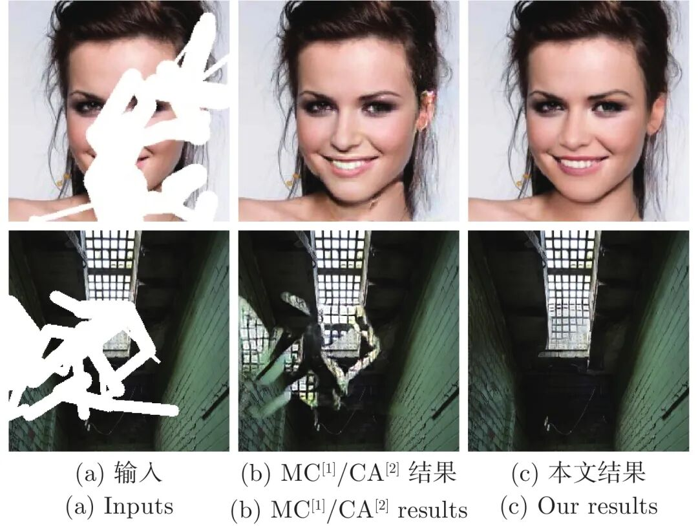
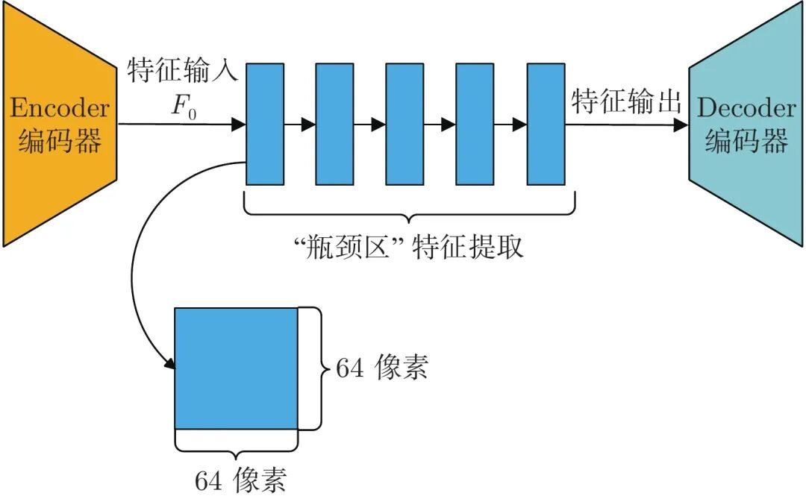
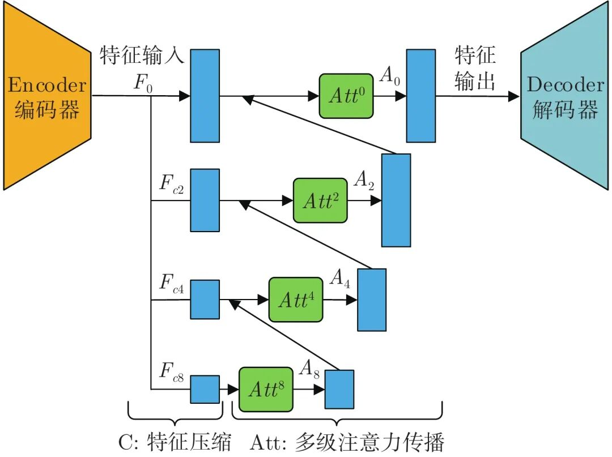

# 多级注意力传播驱动的生成式图像修复方法

原创 自动化学报 自动化学报 2022-05-11 16:12 北京

> 原文地址: [https://mp.weixin.qq.com/s/bplybnhIPJpmq-AqI2ttNQ](https://mp.weixin.qq.com/s/bplybnhIPJpmq-AqI2ttNQ)

**点击蓝字 关注我们**

✦

✦

  

**引用本文**

✦

✦

✦

✦

  

曹承瑞, 刘微容, 史长宏, 张浩琛. 多级注意力传播驱动的生成式图像修复方法. 自动化学报, 2022, 48(5): 1343−1352 doi: 10.16383/j.aas.c200485

Cao Cheng-Rui, Liu Wei-Rong, Shi Chang-Hong, Zhang Hao-Chen. Generative image inpainting with attention propagation. Acta Automatica Sinica, 2022, 48(5): 1343−1352 doi: 10.16383/j.aas.c200485

http://www.aas.net.cn/cn/article/doi/10.16383/j.aas.c200485?viewType=HTML

  

**文章简介**

✦

✦

✦

✦

  

✦

**关键词**

✦

  

注意力传播, 特征压缩, 复合粒度判别器, 图像修复

  

  

✦

**摘   要**

✦

  

现有图像修复方案普遍存在着结构错乱和细节纹理模糊的问题, 这主要是因为在图像破损区域的重建过程中, 修复网络难以充分利用非破损区域内的信息来准确地推断破损区域内容. 为此, 本文提出了一种由多级注意力传播驱动的图像修复网络. 该网络通过将全分辨率图像中提取的高级特征压缩为多尺度紧凑特征, 进而依据尺度大小顺序驱动紧凑特征进行多级注意力特征传播, 以期达到包括结构和细节在内的高级特征在网络中充分传播的目标. 为进一步实现细粒度图像修复重建, 本文还同时提出了一种复合粒度判别器, 以期实现对图像修复过程进行全局语义约束与非特定局部密集约束. 大量实验表明, 本文提出的方法可以产生更高质量的修复结果.

  

✦

**引   言**

✦

  

图像修复是指对图像中缺失或损坏区域进行修复重建的过程, 它是计算机视觉技术领域的重点研究内容之一, 其在图像编辑、图像渲染等诸多领域具有重要实用价值. 如何在图像破损区域合成与现有上下文区域结构语义一致、内容准确、细节丰富的局部图像信息, 是图像修复方法需要解决的难点问题.

  

根据所利用特征级别的不同, 现有图像修复方法可分为两大类: 1)利用低级非语义特征的方法; 2)利用高级语义特征的方法. 其中, 利用低级非语义特征的图像修复方法为传统的图像修复方法, 通常基于扩散或图像块匹配机制将非破损区域的低级特征“粘贴”到破损区域. 此类方法对特定的图像缺损类型有着优秀的修复效果. 例如基于扩散的方法将图像信息从破损区域边界往内部进行传播, 可以有效地修复“抓痕”这样的细小破损. 基于图像块匹配的方法在背景修复方面性能强大, 并广泛应用于商用软件中. 然而, 此类利用低级非语义特征的图像修复方案无法对破损区域的上下文进行深入理解, 即无法获取图像的高级语义特征, 使得此类方法对高度模式化的图像(比如人脸)无法实现很好的修复效果.

  

利用高级语义特征的方法, 从大规模数据中学习高级语义特征, 大大提升了修复性能. 其中, 基于生成式对抗网络GANs (Generative adversarial nets)的方法已成为图像修复领域的主流. 基于GANs的方法将图像修复问题转化为基于条件生成对抗网络的条件生成问题. 此类方法通常以破损图像与标定破损区域的掩码作为条件输入, 采用自动编码器网络作为生成器来重建缺损区域的内容, 并结合判别器网络以对抗方式训练, 最终得到完整的图像输出. 为有效地综合利用图像上下文区域的特征, GL (Globally and locally consistent image completion)引入级联扩张卷积, 并将其集成到自动编码器网络的“瓶颈区”. 虽然扩张卷积可以在一定程度上将远距离特征纳入其感受野中, 以达到综合利用远距离特征的目标; 但是扩张卷积有较大的空穴区域, 以规则对称的网格方式采样图像特征, 从而造成远距离重点区域特征被忽略. MC (Multi-column convolutional), CA (Contextual attention)以及CI (Contextual-based inpainting)等方案采用单级上下文注意力方案, 计算图像上下文的语义相似度, 显式地从破损图像的未破损区域中借取有意义的图像表达, 缓解了远距离特征无法有效利用的问题.

  

然而, 以上这些方法通常无法为场景复杂图像的缺损区域生成结构合理、细节丰富的内容. 如图1(b)所示, 修复结果图像中明显存在整体性或局部性结构错乱, 此外生成图像还存在语义特征重建不够细致的问题, 即对图像语义(比如人脸图像的眼睛、鼻子等部分)重建比较模糊.

  

图 1  当前图像修复方法所存在的结构和细节问题展示

  

如图2所示为当前主流图像修复方案通常采用的自动编码器生成网络. 缺损图像经过编码器编码得到浅层特征, 将浅层特征送入“瓶颈区”进行特征提取, 然后再由解码器解码为完整图像. 我们通过研究发现此类自动编码器结构存在非常严重的特征传递受阻问题, 其“瓶颈区”高级特征的截面过大(一般为64 × 64像素大小). 大截面特征使得扩张卷积与单级注意力特征匹配等方案无法充分获取结构与细节特征, 同时阻碍了结构和细节特征在网络中传播, 从而导致了修复结果中出现结构错乱和语义对象模糊等现象.

  

图 2  常规自动编码器

  

如图3所示, 针对特征传递受阻问题, 我们对自动编码器结构中的“瓶颈区”网络部分进行以下两步改进: 第一步, 多级特征压缩. 将编码器与解码器之间的“瓶颈网络”中大小为h×w×c像素的高级特征分别按照0、2、4、8压缩率进行缩放, 构建多级压缩特征, 即F\_c0、F\_c2、F\_c4和F\_c8. 越高压缩率的特征, 其尺度越小. 若按照特征尺度大小对多级压缩特征进行排列, 其结果为F\_c0 > F\_c2 > F\_c4 > F\_c8. 多级压缩特征在特征表达方面是互补的, 越小尺度的特征中有着越小的结构特征空间, 网络更容易从中搜索出有意义的结构表达, 但是越小尺度特征越缺乏细节信息; 与之相反, 越大尺度特征中虽然在结构表达能力上更弱, 却有着越丰富的细节特征, 网络更容易从中搜索出有意义的细节表达. 因此, 大小尺度特征之间的这种互补性为第二步, 即多级注意力传播, 提供了巨大潜力. 多级注意力传播可以充分利用不同压缩特征对不同特征(结构/细节)表达方面的优势. 具体来说, 我们分别对各级压缩特征F\_c8、F\_c4、F\_c2和F\_c0依次执行注意力匹配与替换, 得到注意力特征; 并依据从小尺度到大尺度的顺序对注意力特征进行分级传播. 如图3所示注意力特征A\_8与压缩特征F\_c4结合, 将小尺度注意力特征传播至更高尺度. 其后注意力特征A\_4再以相同的过程传播至A\_2和A\_0. 由于前一级注意力特征匹配替换的结果总比后一级有更准确的结构表达; 后一级紧凑的压缩特征总比前一级有更多的细节特征. 因此, 多级注意力的传播方案可以促使网络在多个尺度下既保持图像结构准确, 又不断地丰富细节. 相比当前基于单级注意力的图像修复方案, 我们的多级方案可以得到更加丰富的深度特征.

  

图 3  多级注意力特征传播自动编码器

  

同时, 与当前主流方法中由“粗”到“细”的多阶段方案不同, 我们期望在一个阶段内实现细粒度图像重建. 为此, 我们还提出了一种复合粒度判别器网络对图像修复过程进行全局语义约束与非特定局部密集约束. 其中, 全局语义约束由全局判别器实现, 该判别器的输出为一个评价图像整体真实度得分的值; 非特定局部密集约束由局部密集判别器实现, “非特定局部”与“密集”体现在我们的局部密集判别器所执行的是对图像内多个相互重叠的局部区域进行密集地判别. 因此, 这种密集局部判别方式非常适合处理不规则破损情况下的修复任务.

  

在包括人脸、建筑立面和自然图像在内的多个数据集上进行的大量实验表明, 本文所提出的多级注意力传播驱动的生成式图像修复方法所生成的图像修复结果比现有方法拥有更高的图像质量.

  

综上所述, 本文的贡献如下: 1)提出了一种端到端的图像修复模型, 该模型通对全分辨率的图像上下文进行编码, 将提取的高级特征压缩为多尺度紧凑特征, 并依据尺度大小顺序驱动紧凑特征进行多级注意力特征传播, 实现了包括结构和细节在内的高级特征在网络中的充分传播. 2)提出了一种复合粒度判别器, 对图像进行全局语义约束与非特定局部密集约束, 使得图像修复在单个前向过程中同时现高质量的细粒度重建.

  

请点击左下角“**阅读原文**”了解更多！

  

**作者简介**

✦

✦

✦

✦

  

**曹承瑞**

兰州理工大学硕士研究生. 主要研究方向为深度学习和图像处理.

E-mail: xiaocao1239@outlook.com

**刘微容**

兰州理工大学教授. 主要研究方向为机器视觉与人工智能、复杂系统先进控制理论与应用等. 本文通信作者. 

E-mail: liu\_weirong@163.com

**史长宏**

兰州理工大学博士研究生. 主要研究方向为深度学习和图像处理.

E-mail: changhong\_shi@126.com

**张浩琛**

兰州理工大学电气工程与信息工程学院讲师. 主要研究方向为机器人传感与控制.

E-mail: zhanghc@lut.edu.cn

  

**相关文章**

✦

✦

✦

✦

  

**（请向上滑动阅读）**

  

\[1\]  尹明, 吴浩杨, 谢胜利, 杨其宇. 基于自注意力对抗的深度子空间聚类. 自动化学报, 2022, 48(1): 271-281. doi: 10.16383/j.aas.c200302

http://www.aas.net.cn/cn/article/doi/10.16383/j.aas.c200302?viewType=HTML

  

\[2\]  陈善雄, 朱世宇, 熊海灵, 赵富佳, 王定旺, 刘云. 一种双判别器GAN的古彝文字符修复方法. 自动化学报, 2022, 48(3): 853-864. doi: 10.16383/j.aas.c190752

http://www.aas.net.cn/cn/article/doi/10.16383/j.aas.c190752?viewType=HTML

  

\[3\]  陈芳, 张道强, 廖洪恩, 赵喆. 基于序列注意力和局部相位引导的骨超声图像分割网络. 自动化学报. doi: 10.16383/j.aas.c210298

http://www.aas.net.cn/cn/article/doi/10.16383/j.aas.c210298?viewType=HTML

  

\[4\]  汤文兵, 任正云, 韩芳. 基于注意力机制的协同卷积动态推荐网络. 自动化学报, 2021, 47(10): 2438-2448. doi: 10.16383/j.aas.c190820

http://www.aas.net.cn/cn/article/doi/10.16383/j.aas.c190820?viewType=HTML

  

\[5\]  蒋珂, 蒋朝辉, 谢永芳, 潘冬, 桂卫华. 基于动态注意力深度迁移网络的高炉铁水硅含量在线预测方法. 自动化学报. doi: 10.16383/j.aas.c210524

http://www.aas.net.cn/cn/article/doi/10.16383/j.aas.c210524?viewType=HTML

  

\[6\]  杨启萌, 禹龙, 田生伟, 艾山·吾买尔. 基于多注意力机制的维吾尔语人称代词指代消解. 自动化学报, 2021, 47(6): 1412-1421. doi: 10.16383/j.aas.c180678

http://www.aas.net.cn/cn/article/doi/10.16383/j.aas.c180678?viewType=HTML

  

\[7\]  俞文武, 杨晓亚, 李海昌, 王瑞, 胡晓惠. 面向多智能体协作的注意力意图与交流学习方法. 自动化学报. doi: 10.16383/j.aas.c210430

http://www.aas.net.cn/cn/article/doi/10.16383/j.aas.c210430?viewType=HTML

  

\[8\]  潘文雯, 赵洲, 俞俊, 吴飞. 基于文本引导的注意力图像转发预测排序网络. 自动化学报, 2021, 47(11): 2547-2556. doi: 10.16383/j.aas.c200629

http://www.aas.net.cn/cn/article/doi/10.16383/j.aas.c200629?viewType=HTML

  

\[9\]  王亚朝, 赵伟, 徐海洋, 刘建业. 基于多阶段注意力机制的多种导航传感器故障识别研究. 自动化学报, 2021, 47(12): 2784-2790. doi: 10.16383/j.aas.c190435

http://www.aas.net.cn/cn/article/doi/10.16383/j.aas.c190435?viewType=HTML

  

\[10\]  宋燕, 王勇. 多阶段注意力胶囊网络的图像分类. 自动化学报. doi: 10.16383/j.aas.c210012

http://www.aas.net.cn/cn/article/doi/10.16383/j.aas.c210012?viewType=HTML

  

\[11\]  林泓, 任硕, 杨益, 张杨忆. 融合自注意力机制和相对鉴别的无监督图像翻译. 自动化学报, 2021, 47(9): 2226-2237. doi: 10.16383/j.aas.c190074

http://www.aas.net.cn/cn/article/doi/10.16383/j.aas.c190074?viewType=HTML

  

\[12\]  肖进胜, 申梦瑶, 江明俊, 雷俊峰, 包振宇. 融合包注意力机制的监控视频异常行为检测. 自动化学报. doi: 10.16383/j.aas.c190805

http://www.aas.net.cn/cn/article/doi/10.16383/j.aas.c190805?viewType=HTML

  

\[13\]  王亚珅, 黄河燕, 冯冲, 周强. 基于注意力机制的概念化句嵌入研究. 自动化学报, 2020, 46(7): 1390-1400. doi: 10.16383/j.aas.2018.c170295

http://www.aas.net.cn/cn/article/doi/10.16383/j.aas.2018.c170295?viewType=HTML

  

\[14\]  陈一鸣, 周登文. 基于自适应级联的注意力网络的超分辨重建. 自动化学报. doi: 10.16383/j.aas.c200035

http://www.aas.net.cn/cn/article/doi/10.16383/j.aas.c200035?viewType=HTML

  

\[15\]  周勇, 王瀚正, 赵佳琦, 陈莹, 姚睿, 陈思霖. 基于可解释注意力部件模型的行人重识别方法. 自动化学报. doi: 10.16383/j.aas.c200493

http://www.aas.net.cn/cn/article/doi/10.16383/j.aas.c200493?viewType=HTML

  

\[16\]  张亚茹, 孔雅婷, 刘彬. 多维注意力特征聚合立体匹配算法. 自动化学报. doi: 10.16383/j.aas.c200778

http://www.aas.net.cn/cn/article/doi/10.16383/j.aas.c200778?viewType=HTML

  

\[17\]  金侠挺, 王耀南, 张辉, 刘理, 钟杭, 贺振东. 基于贝叶斯CNN和注意力网络的钢轨表面缺陷检测系统. 自动化学报, 2019, 45(12): 2312-2327. doi: 10.16383/j.aas.c190143

http://www.aas.net.cn/cn/article/doi/10.16383/j.aas.c190143?viewType=HTML

  

\[18\]  王金甲, 纪绍男, 崔琳, 夏静, 杨倩. 基于注意力胶囊网络的家庭活动识别. 自动化学报, 2019, 45(11): 2199-2204. doi: 10.16383/j.aas.c180721

http://www.aas.net.cn/cn/article/doi/10.16383/j.aas.c180721?viewType=HTML

  

\[19\]  冯欣, 杨丹, 张凌. 基于视觉注意力变化的网络丢包视频质量评估. 自动化学报, 2011, 37(11): 1322-1331. doi: 10.3724/SP.J.1004.2011.01322

http://www.aas.net.cn/cn/article/doi/10.3724/SP.J.1004.2011.01322?viewType=HTML

  

\[20\]  吴琼, 孙韶杰, 朱为, 李国辉, 涂丹, 何朝盛. 数字图像盲取证对样本合成修复应用的篡改区域检测算法. 自动化学报, 2009, 35(3): 239-243. doi: 10.3724/SP.J.1004.2009.00239

http://www.aas.net.cn/cn/article/doi/10.3724/SP.J.1004.2009.00239?viewType=HTML

  

  

**近期文章**

✦

✦

✦

✦

  

[通信受限的多智能体系统二分实用一致性](http://mp.weixin.qq.com/s?__biz=MzAwMzAzMDgxOA==&mid=2651077321&idx=1&sn=02d81030a428cbb4275f4ff076068f08&chksm=8131f084b646799235c36b924d470f26f4e4da762c08d57e951613e4f74a57febdc8c03777c9&scene=21#wechat_redirect)

[基于卦限卷积神经网络的3D点云分析](http://mp.weixin.qq.com/s?__biz=MzAwMzAzMDgxOA==&mid=2651077321&idx=2&sn=72b1883dbcc0cbf059d0b772116c1833&chksm=8131f084b6467992a2ece5ef2da60a5e9c99798f5fdaf0419ebb1b40fac405f89f410ec0399e&scene=21#wechat_redirect)

[多子群的共生非均匀高斯变异樽海鞘群算法](http://mp.weixin.qq.com/s?__biz=MzAwMzAzMDgxOA==&mid=2651077253&idx=1&sn=8bb31df462faacb91e929c785da5cc66&chksm=8131f0c8b64679deba1726b4ace546e4db5cd4f75a3c7a32b8585d5ba4923c950040bb4e10c1&scene=21#wechat_redirect)

[深海起重机系统的实时轨迹规划方法](http://mp.weixin.qq.com/s?__biz=MzAwMzAzMDgxOA==&mid=2651077253&idx=2&sn=a56d6ba21cacc230b19e46cbac02d1f2&chksm=8131f0c8b64679de5196befb6529c000b1ca45ee81eda188944e136ceb3e03833d0d77513b4f&scene=21#wechat_redirect)

[一种改进的特征子集区分度评价准则](http://mp.weixin.qq.com/s?__biz=MzAwMzAzMDgxOA==&mid=2651077115&idx=2&sn=f9e9063e82252dc6389f99cd9921b665&chksm=8131f3b6b6467aa0efe5b1d2a7898b081ad349d484ed7ce6603fd9dd2742bfd9afe599a49cf8&scene=21#wechat_redirect)

[基于多阶段注意力机制的多种导航传感器故障识别研究](http://mp.weixin.qq.com/s?__biz=MzAwMzAzMDgxOA==&mid=2651077115&idx=1&sn=cb5a0515e8ced5d96aec9aeee0c43906&chksm=8131f3b6b6467aa06f5244ad53639bb0452b6dfba6540ee50ea7d33b764e1e81fe712d58d371&scene=21#wechat_redirect)

[支持数据隐私保护的联邦深度神经网络模型研究](http://mp.weixin.qq.com/s?__biz=MzAwMzAzMDgxOA==&mid=2651077039&idx=1&sn=679f6b0a5a6a97ad2564e590bd534072&chksm=8131f3e2b6467af447638b7d6e7312046f128019c857cf8e79609736f5d57849cfa2c34f8ba4&scene=21#wechat_redirect)

[联合样本输出与特征空间的半监督概念漂移检测法及其应用](http://mp.weixin.qq.com/s?__biz=MzAwMzAzMDgxOA==&mid=2651076994&idx=1&sn=4e40a43610e5879752437474d12ea2c8&chksm=8131f3cfb6467ad9f54ad169a3857897807584e30d02dbbf83c75664398d19992c1b95fb6be2&scene=21#wechat_redirect)

[面向行人重识别的局部特征研究进展、挑战与展望](http://mp.weixin.qq.com/s?__biz=MzAwMzAzMDgxOA==&mid=2651076994&idx=2&sn=2f1fe243ff0cc599548f9c1d238b4a59&chksm=8131f3cfb6467ad93a3228636e3780da17bb32b7383faa4e5746adab8a53db9281d1894c160c&scene=21#wechat_redirect)

[一种脑肢融合的神经康复训练在线评价与调整方法](http://mp.weixin.qq.com/s?__biz=MzAwMzAzMDgxOA==&mid=2651076801&idx=1&sn=01be1c22a480f6d2c52e4afcf7c173d8&chksm=8131f28cb6467b9af8e33ff70860ff2731c797d27cbbda568088b6d17a41ae07d38ebb59a0e5&scene=21#wechat_redirect)

[基于自适应LASSO先验的稀疏贝叶斯学习算法](http://mp.weixin.qq.com/s?__biz=MzAwMzAzMDgxOA==&mid=2651076733&idx=1&sn=01ccbc6fe6e387330aa93ae1a2a11953&chksm=8131f230b6467b260036bbc1efe3db2924397a4e7ba2f683e2e0c4819805906180d44529244a&scene=21#wechat_redirect)  

[眼动跟踪研究进展与展望](http://mp.weixin.qq.com/s?__biz=MzAwMzAzMDgxOA==&mid=2651076581&idx=1&sn=dab1369362bf1790033e5cf2f5736281&chksm=8131fda8b64674be08cbf0bf3bf5a928115b76ec24e8000cad36820b039d33dedba8a048210e&scene=21#wechat_redirect)

  

**热点文章**

✦

✦

✦

✦

  

[通信受限的多智能体系统二分实用一致性](http://mp.weixin.qq.com/s?__biz=MzAwMzAzMDgxOA==&mid=2651077321&idx=1&sn=02d81030a428cbb4275f4ff076068f08&chksm=8131f084b646799235c36b924d470f26f4e4da762c08d57e951613e4f74a57febdc8c03777c9&scene=21#wechat_redirect)

[【热点专题】多目标优化](http://mp.weixin.qq.com/s?__biz=MzI2NjA3MzM5MA==&mid=2649962438&idx=1&sn=83b21f7b6a63fc4e01c2f4718b2aae92&chksm=f2943387c5e3ba91ce32286c06f215a989233f55bbbd5c7d436a43c40615bb5ae208d0f0f228&scene=21#wechat_redirect)

[一种基于深度迁移学习的滚动轴承早期故障在线检测方法](http://mp.weixin.qq.com/s?__biz=MzAwMzAzMDgxOA==&mid=2651076931&idx=2&sn=128b1673843353529d8b130f372bb46f&chksm=8131f30eb6467a18e0f645b207ada16cd601b791297b32b1caccf72daa50b55063074ec4fdc3&scene=21#wechat_redirect)

[基于多智能体强化学习的乳腺癌致病基因预测](http://mp.weixin.qq.com/s?__biz=MzAwMzAzMDgxOA==&mid=2651076931&idx=1&sn=a62942cd056156ad5a885d6350e8b373&chksm=8131f30eb6467a18ffbee77b25fb9b0417b08918d3625d04c89a3a9bcb1490eece239c5fda25&scene=21#wechat_redirect)

[基于事件触发的离散MIMO系统自适应评判容错控制](http://mp.weixin.qq.com/s?__biz=MzAwMzAzMDgxOA==&mid=2651076863&idx=1&sn=aec9cf55a1b0b8eae741999601a8c6df&chksm=8131f2b2b6467ba4c20d388390d4ac191555e5d00d77f510f72af77359d18bdca5230ea52df0&scene=21#wechat_redirect)

[水下多机器人系统综述](http://mp.weixin.qq.com/s?__biz=MzAwMzAzMDgxOA==&mid=2651076668&idx=1&sn=b50e43710be8208fd711cd45943e95c0&chksm=8131f271b6467b675083610c925ce0d329e201ddab5c8e935eb266fbf41418395459fdd0618d&scene=21#wechat_redirect)

[基于事件触发二阶多智能体系统的固定时间比例一致性](http://mp.weixin.qq.com/s?__biz=MzAwMzAzMDgxOA==&mid=2651076637&idx=2&sn=fcf40a44a926c9034593207d6a614e95&chksm=8131f250b6467b46e70d4ef5f10226fbed60a0d12e327f83c793d86e7815ff00e4fcafcac295&scene=21#wechat_redirect)

[基于事件触发的分布式优化算法](http://mp.weixin.qq.com/s?__biz=MzAwMzAzMDgxOA==&mid=2651076142&idx=2&sn=b074793ec4be44ea08efb78617dcdcc0&chksm=8131fc63b6467575b7f6d698909e56be16089f8f56ca415294483ff6f40902c7546417f82531&scene=21#wechat_redirect)

  

**期刊动态**

✦

✦

✦

✦

  

[《自动化学报》多名作者入选爱思唯尔2021中国高被引学者](http://mp.weixin.qq.com/s?__biz=MzAwMzAzMDgxOA==&mid=2651076637&idx=1&sn=ee78f108cf0551024cb95c33241a5f1d&chksm=8131f250b6467b46c8d4af1bd63381328a80c65ade97a6daa97e3bb4538b39c6f761da238066&scene=21#wechat_redirect)

[自动化学报（英文版）和自动化学报入选计算领域高质量科技期刊T1类](http://mp.weixin.qq.com/s?__biz=MzAwMzAzMDgxOA==&mid=2651073859&idx=2&sn=7a9192717637dcf6cddb39ed961e8c3b&chksm=8131e70eb6466e188a123c504bdeba80c75681de4762f8685b3bf584bc33eb12362c70613b4e&scene=21#wechat_redirect)

[《自动化学报》编辑部防诈骗公告](http://mp.weixin.qq.com/s?__biz=MzAwMzAzMDgxOA==&mid=2651073517&idx=1&sn=c52de7c685e546af9faffc0cefab1c85&chksm=8131e1a0b64668b63ebaa68ea81cbaec3b94dc52ea8360821a0a49e67ae7e4b428a25d0f19c5&scene=21#wechat_redirect)

[《自动化学报》致谢审稿人](http://mp.weixin.qq.com/s?__biz=MzI2NjA3MzM5MA==&mid=2649961201&idx=1&sn=3142842d75c441ae860c1ecb313c7657&chksm=f29436b0c5e3bfa6c679210f60513eb1a7205dc20fe028f482bb593eac60427e4e56fba12493&scene=21#wechat_redirect)

[自动化学报多篇论文入选中国百篇最具影响国内论文和中国精品期刊顶尖论文](http://mp.weixin.qq.com/s?__biz=MzI2NjA3MzM5MA==&mid=2649961152&idx=1&sn=4a5e9e4b84879f4cde4e13a0ef97272c&chksm=f2943681c5e3bf97d7770c9623dac869b283b3ea83f3d320017974033e361d8b999134a8bdff&scene=21#wechat_redirect)

[自动化学报各项主要指标蝉联第1，再获百种中国杰出期刊称号](http://mp.weixin.qq.com/s?__biz=MzI2NjA3MzM5MA==&mid=2649960903&idx=1&sn=7da8b8a0167e16bcbaa1f00fbfb69782&chksm=f2943586c5e3bc9014f6d4fff7147b998ae42b4da452907e641e8029f296fd2413b4f17aef62&scene=21#wechat_redirect)

  

**期刊目录**

✦

✦

✦

✦

  

[2022年第04期](http://mp.weixin.qq.com/s?__biz=MzI2NjA3MzM5MA==&mid=2649962369&idx=1&sn=ae2c4584f8904be917b600e67005ae03&chksm=f29433c0c5e3bad6d78382b3c09015aadb09e040b8fc8c319c4f554fd592fe677797000340cd&scene=21#wechat_redirect)

[2022年第03期](http://mp.weixin.qq.com/s?__biz=MzAwMzAzMDgxOA==&mid=2651075527&idx=1&sn=bc020c5fd09080243f7527610b003507&chksm=8131f98ab646709c2f485852b526989a3b9af5cc93e8afb508d9239b78176f49caa9807d6a8d&scene=21#wechat_redirect)

[2022年第02期](http://mp.weixin.qq.com/s?__biz=MzI2NjA3MzM5MA==&mid=2649961838&idx=1&sn=29334896aa0f372b70312250c75b6b20&chksm=f294312fc5e3b8392ffd49100eaba435bf48fa9234c5019fe7b16ed1e4ebef70be58691f3fb3&scene=21#wechat_redirect)

[2022年第01期](http://mp.weixin.qq.com/s?__biz=MzI2NjA3MzM5MA==&mid=2649961423&idx=1&sn=3b65958faa7c7f94c247f46dd72bd71e&chksm=f294378ec5e3be9825f860d132c36c97f3e877089449cb1fe85a6d1e7da9bd0e24795336bc54&scene=21#wechat_redirect)

[《自动化学报》2021年全年合集](http://mp.weixin.qq.com/s?__biz=MzAwMzAzMDgxOA==&mid=2651072770&idx=1&sn=7c531f7fa3bc390558fab15b339ce86e&chksm=8131e34fb6466a59ed079448fddda0fc9f97066460bff8f6835288003a1fba2812de383813c1&scene=21#wechat_redirect)

[《自动化学报》2020年全年合集](http://mp.weixin.qq.com/s?__biz=MzI2NjA3MzM5MA==&mid=2649957972&idx=1&sn=1951847aacbcb7d22bdd2a46a79af871&chksm=f2942215c5e3ab03d070d8e52b8764b38036897c97b6a26c7a1f918c806b28edbe6c0fbf7ea9&scene=21#wechat_redirect)

[2020年第10期 工业人工智能专题](http://mp.weixin.qq.com/s?__biz=MzI2NjA3MzM5MA==&mid=2649957201&idx=1&sn=ab82a767bd716ab67fdf2942500d8b61&chksm=f2942710c5e3ae06b27f9e63a5e329a1123d90b051164e6b6123c500230541b1ed12d92abbfb&scene=21#wechat_redirect)

[2020年第09期 分布式信息能源系统理论与应用专题](http://mp.weixin.qq.com/s?__biz=MzI2NjA3MzM5MA==&mid=2649956412&idx=1&sn=8ebc13d63fd333ad85dbb8b5825df248&chksm=f294247dc5e3ad6ba297857a5b957e97cf499266c50318791fa8abd9432ecf1d9c3d9b287e36&scene=21#wechat_redirect)

  

  

  

**长按二维码｜关注我们**

**IEEE/CAA Journal of Automatica Sinica (JAS)**

**长按二维码｜关注我们**

**《自动化学报》服务号**

**长按二维码｜关注我们**

**《自动化学报》订阅号**  

  

**联系我们**

**网站:** 

http://www.aas.net.cn

http://www.ieee-jas.net

**投稿:** 

https://mc03.manuscriptcentral.com/aas-cn   

https://mc03.manuscriptcentral.com/ieee-jas 

**电话:**

010-82544653（日常咨询和稿件处理） 

010-82544677（录用后稿件处理）

**邮箱:** 

aas@ia.ac.cn（日常咨询和稿件处理）  

aas\_editor@ia.ac.cn（录用后稿件处理）

**博客:** 

http://blog.sina.com.cn/aaseditor 

  

**↓ 点击下方 阅读原文 了解更多**