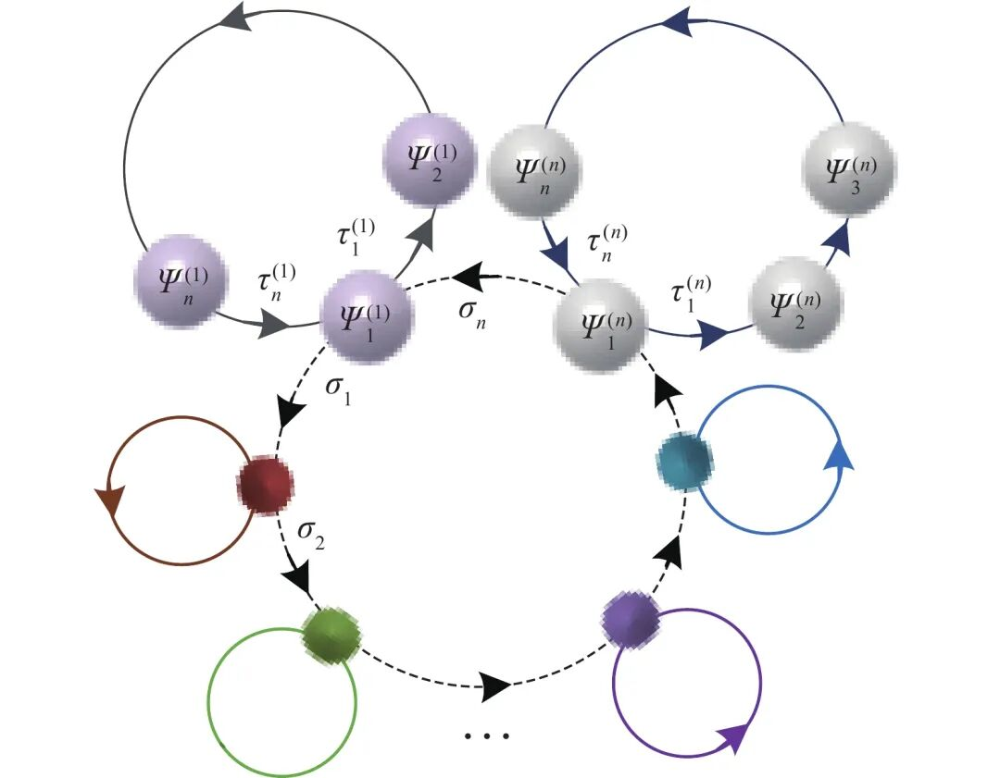
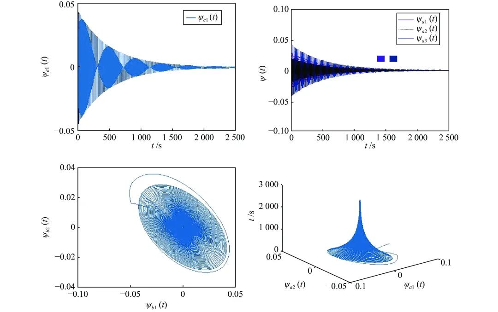
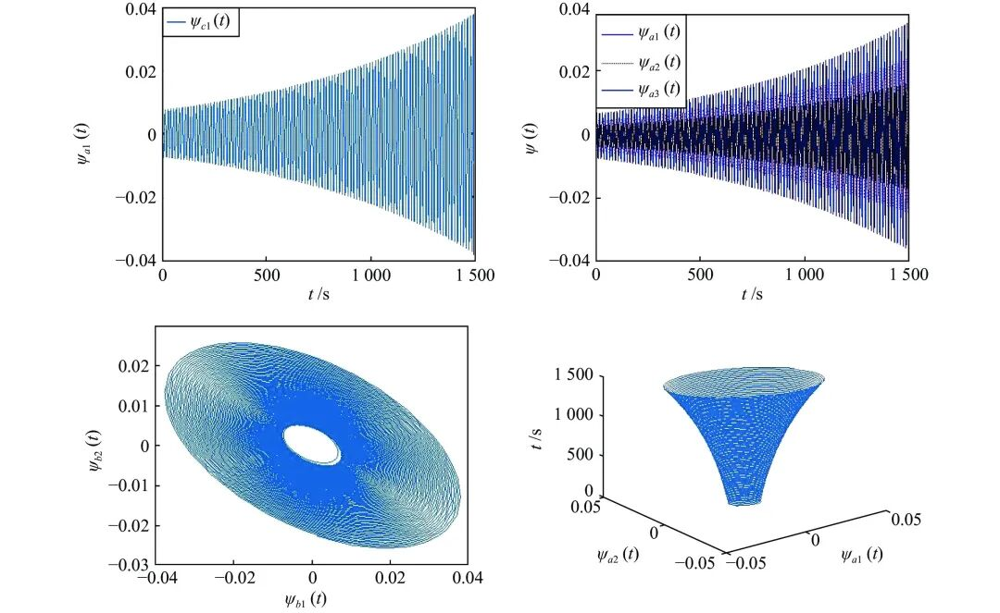

# 大规模超环神经网络分岔动力学

原创 自动化学报 自动化学报 2022-04-20 17:09 北京

> 原文地址: [https://mp.weixin.qq.com/s/\_AQCPga8horcPcD\_MxrFJA](https://mp.weixin.qq.com/s/_AQCPga8horcPcD_MxrFJA)

**点击蓝字 关注我们**

  

**引****用本文**

  

张跃中, 肖敏, 王璐, 徐丰羽. 大规模超环神经网络分岔动力学. 自动化学报, 2022, 48(4): 1129−1136 doi: 10.16383/j.aas.c200130

Zhang Yue-Zhong, Xiao Min, Wang Lu, Xu Feng-Yu. Bifurcation dynamics of large-scale neural networks composed of super multi-ring networks. Acta Automatica Sinica, 2022, 48(4): 1129−1136 doi: 10.16383/j.aas.c200130 

http://www.aas.net.cn/cn/article/doi/10.16383/j.aas.c200130?viewType=HTML

  

**文章简介**

  

**关键词**

  

神经网络, 超环结构, 时滞, 稳定性, Hopf分岔

  

**摘   要**

  

目前绝大多数神经网络分岔动力学局限于结构简单、低维少节点模型, 这与真实的大规模神经网络系统相去甚远. 因此, 研究大量神经元耦合的高维神经网络模型更具实际应用价值. 环状及辐射状结构在神经网络中普遍存在, 提出了一类大规模超环时滞神经网络模型, 结构包含一个大环和任意多个小环, 并且每个环上拥有任意多个神经元. 运用特征值法和分岔理论, 选取时滞为分岔参数, 给出了该超环神经网络模型的稳定性条件和Hopf分岔判据. 数值仿真结果, 验证该理论结果的正确性.

  

**引   言**

  

众所周知, 神经网络在信号处理、自动控制、联想记忆、人工智能、生物医学治疗等领域有着广阔的应用前景, 这些基本应用在很大程度上依赖于神经网络的动力学特性. 由于神经网络动力学是生物生理学和非线性动力学的交叉学科, 研究其稳定性、振荡、分岔、混沌和同步等多种动力学行为具有生物学和动力学意义. 一般来说, 神经网络具有大规模的非线性动力学性质和复杂的行为, 为进一步把握神经网络的动力学本质, 大批研究者将研究重点放在简单的神经网络模型上, 为寻求大型复杂神经网络的研究方案做铺垫. 例如, 在文献\[3\]中, 作者提出了3个神经元的神经网络模型; 文献\[4\]研究了7个神经元的神经网络模型; 文献\[5\]研究了具有双向联想记忆五维神经网络. 显然, 如果仅仅研究一个简单的网络, 一些复杂问题可能会被忽略, 并且在现实生物学中神经网络以及网络的构建模型都是错综复杂, 多种多样的. 因此, 本文提出一类大型神经网络的研究是极具理论价值和实践价值.

  

在如神经网络、生物模型和进化生态学等大多数实际的动态网络中, 时间延迟的存在是难以避免的. 然而, 由于时滞的存在, 系统可能变得不稳定, 系统的动态行为变得更加复杂. 在神经网络中, 由于突触中信号传播速度和处理时间的有限性, 不同相邻神经元之间的通信存在时滞差异. 人们对研究具有时延的神经网络的动力学越来越感兴趣, 理论成果也相继发表. 因此, 以时滞(离散时滞、分布式时滞、多时滞、泄露时滞等)作为研究对象, 分析神经网络的特性和动力学以及控制时滞系统的动态行为是十分必要和重要的.

  

在动力系统中, 可通过分岔方法获得某些丰富的动力特性, 这是无可争辩的. 分岔方法的优越性在于能捕捉复杂系统的内在性质, 涉及振荡行为出现的分岔可以帮助理解网络中观察到的参数敏感性, 并提供有利于网络的信息. 例如, 对于带有抑制的环结构遗传模型, 其渐近行为得到广泛的检验. 大肠杆菌循环抑制网络模型的建立就是很好的体现. 分岔的种类也有很多种, 其中随着参数的变化, 系统在稳定与不稳定之间切换的平衡点被称为Hopf分岔点. 近年来, 对神经网络有关Hopf分岔分析进行了大量的数学研究, 人们可以通过Hopf分岔的深入而清晰的认识某个网络, 可以提供有用的网络信息, 为网络的应用提供更多的可能性. 因此, 研究神经网络的Hopf分岔具有重要意义. 此外, Hopf分岔可以由延迟诱导的生物系统是如何表现出周期性响应, 更准确地说, 由时间延迟引起的Hopf分岔可以得到一些有趣的结果, 如延迟与振荡幅度的关系. 还有研究表明, 这些Hopf分岔分析有助于生物视觉信息的快速处理, 并可用于预测大脑的病理状态.

  

显然, 具有时滞依赖的高维神经网络的动力学特性是值得研究的, 但影响其动力学的因素很多, 其中网络结构也是关注的因素之一. 众所周知, 约有1000亿个神经细胞组成了人的大脑, 每个神经细胞可长出2000至数万个树突与其他神经细胞连接. 然而人脑的开发仅有1%, 倘若能进一步的开发或者未来通过人工神经网络来学习生物神经网络将是极具意义和价值的. 在人脑和脊柱中, 大量的神经元构成一个大型的复杂神经网络, 通过网络的结构特性也可以简单地剖析成放射状网络、链状网络和环状网络等. 因此, 以结构作为研究点是极具代表性和研究价值的. 例如Xiao等提出了具有辐射状的神经网络模型; Bootan等和Huang等研究了具有单环状的神经网络模型. 其次, 科研者更多提出的是形式单一且结构简单的网络, 依旧缺少具有多类网络结构组合的大型网络. 为此, 本文提出一类融合多种结构的超环神经网络模型. 如图1所示, 由超多环形网络组合的大型神经网络图, 即体现了神经网络的环状、辐射状, 也可简化到链状形态. 此外, 研究这些简化的连通性结构的目的是进一步理解具有更复杂连通性的递归网络行为的机制, 以及研究复杂网络中相互连接的模式, 即网络基序, 对于了解整个网络的动态行为是非常重要的.

  

图 1  一类融合多种结构的超环神经网络模型图

  

在上述研究基础上, 本文提出一类基于时滞诱导且融合了多种结构和高维性的超环神经网络, 对该类网络的稳定分析及分岔现象问题进行研究. 本文的主要贡献如下:

  

1)提出一类高维超环神经网络,该网络不仅融合了多类结构, 也体现了一般性.

  

2)针对大型神经网络, 选用离散时滞作为分岔参数, 讨论其网络所带来的新型稳定性及分岔理论.

  

3)引用矩阵与线性方程组的图解法, 解决一类规则性高维复杂网络模型的特征方程问题.

  

图 2  当τ = 3.15, s < τ\_0时, 网络(15)渐近稳定

  

图 3  当 τ = 3.3, s > τ\_0时, 网络(15)失稳

  

请点击左下角“**阅读原文**”了解更多！

  

**作者简介**

**张跃中**

南京邮电大学自动化学院人工智能学院硕士研究生. 主要研究方向为神经网络动力学.

E-mail: m13255191236@163.com

**肖   敏**

南京邮电大学自动化学院人工智能学院教授. 主要研究方向为非线性控制理论, 复杂网络, 神经网络, 信息网络融合系统和反常扩散系统. 本文通信作者.

E-mail: candymanxm2003@aliyun.com

**王   璐**

南京邮电大学自动化学院人工智能学院硕士研究生. 主要研究方向为信息物理融合系统.

E-mail: wangdadeer@aliyun.com

**徐丰羽**

南京邮电大学自动化学院人工智能学院教授. 主要研究方向为机器人及其自动化.

E-mail: xufengyu598@163.com

  

**相关文章**

**（请向上滑动阅读）**

  

\[1\]  张耀中, 胡小方, 周跃, 段书凯. 基于多层忆阻脉冲神经网络的强化学习及应用. 自动化学报, 2019, 45(8): 1536-1547. doi: 10.16383/j.aas.c180685

http://www.aas.net.cn/cn/article/doi/10.16383/j.aas.c180685?viewType=HTML

  

\[2\]  杨刚, 王乐, 戴丽珍, 杨辉. 基于连接自组织发育的稀疏跨越-侧抑制神经网络设计. 自动化学报, 2019, 45(4): 808-818. doi: 10.16383/j.aas.2018.c170374

http://www.aas.net.cn/cn/article/doi/10.16383/j.aas.2018.c170374?viewType=HTML

  

\[3\]  罗毅平, 周笔锋. 时滞扩散性复杂网络同步保性能控制. 自动化学报, 2015, 41(1): 147-156. doi: 10.16383/j.aas.2015.c140202

http://www.aas.net.cn/cn/article/doi/10.16383/j.aas.2015.c140202?viewType=HTML

  

\[4\]  杨仁明, 王玉振. 一类非线性时变时滞系统的稳定性分析与吸引域估计. 自动化学报, 2012, 38(5): 716-724. doi: 10.3724/SP.J.1004.2012.00716

http://www.aas.net.cn/cn/article/doi/10.3724/SP.J.1004.2012.00716?viewType=HTML

  

\[5\]  施继忠, 张继业, 徐晓惠. 时滞随机关联系统的群稳定性. 自动化学报, 2010, 36(12): 1744-1751. doi: 10.3724/SP.J.1004.2010.01744

http://www.aas.net.cn/cn/article/doi/10.3724/SP.J.1004.2010.01744?viewType=HTML

  

\[6\]  吴争光, 苏宏业, 褚健. 不确定广义跳变时滞系统的鲁棒指数稳定性. 自动化学报, 2010, 36(4): 558-563. doi: 10.3724/SP.J.1004.2010.00558

http://www.aas.net.cn/cn/article/doi/10.3724/SP.J.1004.2010.00558?viewType=HTML

  

\[7\]  魏庆来, 张化光, 刘德荣, 赵琰. 基于自适应动态规划的一类带有时滞的离散时间非线性系统的最优控制策略. 自动化学报, 2010, 36(1): 121-129. doi: 10.3724/SP.J.1004.2010.00121

http://www.aas.net.cn/cn/article/doi/10.3724/SP.J.1004.2010.00121?viewType=HTML

  

\[8\]  丛山, 费树岷, 李涛. 时滞切换系统指数稳定性分析: 多Lyapunov函数方法. 自动化学报, 2007, 33(9): 985-988. doi: 10.1360/aas-007-0985

http://www.aas.net.cn/cn/article/doi/10.1360/aas-007-0985?viewType=HTML

  

\[9\]  杨斌, 王金城. 中立型一般Lurie系统绝对稳定的时滞相关准则. 自动化学报, 2004, 30(2): 261-264.

http://www.aas.net.cn/cn/article/id/16188?viewType=HTML

  

\[10\]  俞立. 一类时滞系统的绝对稳定性问题研究. 自动化学报, 2003, 29(5): 780-784.

http://www.aas.net.cn/cn/article/id/13888?viewType=HTML

  

\[11\]  桂卫华, 谢永芳, 吴敏, 陈宁. 基于LMI的不确定性关联时滞大系统的分散鲁棒控制. 自动化学报, 2002, 28(1): 155-159.

http://www.aas.net.cn/cn/article/id/16478?viewType=HTML

  

\[12\]  梁久祯, 何新贵, 周家庆. 神经网络BP学习算法动力学分析. 自动化学报, 2002, 28(5): 729-735.

http://www.aas.net.cn/cn/article/id/15582?viewType=HTML

  

\[13\]  程储旺. 不确定性时滞大系统的分散鲁棒H∞控制. 自动化学报, 2001, 27(3): 361-366.

http://www.aas.net.cn/cn/article/id/16136?viewType=HTML

  

\[14\]  郑连伟, 刘晓平, 张庆灵. 具有时变不确定性的线性时滞系统的鲁棒H∞控制. 自动化学报, 2001, 27(3): 377-380.

http://www.aas.net.cn/cn/article/id/16515?viewType=HTML

  

\[15\]  年晓红. LURIE控制系统绝对稳定的时滞相关条件. 自动化学报, 1999, 25(4): 564-566.

http://www.aas.net.cn/cn/article/id/16678?viewType=HTML

  

\[16\]  田玉楚. 大时滞工业过程的双控制器结构. 自动化学报, 1999, 25(6): 824-827.

http://www.aas.net.cn/cn/article/id/16630?viewType=HTML

  

\[17\]  廖晓昕, 昌莉, 沈轶. 离散Hopfield神经网络的稳定性研究. 自动化学报, 1999, 25(6): 721-727.

http://www.aas.net.cn/cn/article/id/16658?viewType=HTML

  

\[18\]  金聪. 离散Hopfield双向联想记忆神经网络的稳定性分析. 自动化学报, 1999, 25(5): 606-612.

http://www.aas.net.cn/cn/article/id/16637?viewType=HTML

  

\[19\]  卢立磊, 高立群, 张嗣瀛. 结构不确定线性时滞系统的鲁棒控制. 自动化学报, 1998, 24(3): 345-349.

http://www.aas.net.cn/cn/article/id/16865?viewType=HTML

  

\[20\]  张剑, 刘永清, 沈建京. 线性滞后互联大系统的分散智能镇定. 自动化学报, 1998, 24(1): 102-107.

http://www.aas.net.cn/cn/article/id/16915?viewType=HTML

  

\[21\]  苗振江, 袁保宗. 非线性连续联想记忆神经网络的分析和优化设计. 自动化学报, 1995, 21(3): 333-340.

http://www.aas.net.cn/cn/article/id/13963?viewType=HTML

  

\[22\]  章毅, 钟守铭. 中立型时滞系统在C1空间中的稳定性. 自动化学报, 1989, 15(3): 242-247.

http://www.aas.net.cn/cn/article/id/14894?viewType=HTML

  

  

**近期文章**

[《自动化学报》2022年第04期目录分享](http://mp.weixin.qq.com/s?__biz=MzAwMzAzMDgxOA==&mid=2651076245&idx=1&sn=8380ebbcbf0ae69c0ad2f7fb428e8303&chksm=8131fcd8b64675cec8932335d68b6f0aa193141095c345d64d2de1dbc28abe1b36a63d742966&scene=21#wechat_redirect)

[【热点专题】目标检测](http://mp.weixin.qq.com/s?__biz=MzI2NjA3MzM5MA==&mid=2649962259&idx=1&sn=97b0c31ec704211713ef8cba4bb51b01&chksm=f2943352c5e3ba44f2c7217cff60405765c6d67312beb6d07006155404bfc4b34268956697f5&scene=21#wechat_redirect)

[基于事件触发的分布式优化算法](http://mp.weixin.qq.com/s?__biz=MzAwMzAzMDgxOA==&mid=2651076142&idx=2&sn=b074793ec4be44ea08efb78617dcdcc0&chksm=8131fc63b6467575b7f6d698909e56be16089f8f56ca415294483ff6f40902c7546417f82531&scene=21#wechat_redirect)

[一种针对德州扑克AI的对手建模与策略集成框架](http://mp.weixin.qq.com/s?__biz=MzAwMzAzMDgxOA==&mid=2651075800&idx=1&sn=9ab9006d50bb2513c49006b1c1431a3c&chksm=8131fe95b6467783eb58de5d7b1726ddcb881561603c76bdcefa44f4a9a9027afc37b1be979c&scene=21#wechat_redirect)

[工业铸件缺陷无损检测技术的应用进展与展望](http://mp.weixin.qq.com/s?__biz=MzAwMzAzMDgxOA==&mid=2651075561&idx=1&sn=afda9a46702ab802788e1c9fc67b5849&chksm=8131f9a4b64670b2c122efca37574a0dceda3582b0477845b80670246b4eb8befce2ae748dc1&scene=21#wechat_redirect)

[《自动化学报》2022年第03期目录分享](http://mp.weixin.qq.com/s?__biz=MzAwMzAzMDgxOA==&mid=2651075527&idx=1&sn=bc020c5fd09080243f7527610b003507&chksm=8131f98ab646709c2f485852b526989a3b9af5cc93e8afb508d9239b78176f49caa9807d6a8d&scene=21#wechat_redirect)

[2022斯坦福AI指数报告出炉！点击获取完整报告](http://mp.weixin.qq.com/s?__biz=MzAwMzAzMDgxOA==&mid=2651075236&idx=3&sn=1caed46e80f613c172a227ead8ddc1a3&chksm=8131f8e9b64671ffa8d6f7c8a36210fe1e262a66a42ab9a544e064d3c725b4a31274a4551750&scene=21#wechat_redirect)

[黄艳龙, 徐德, 谭民. 机器人运动轨迹的模仿学习综述](http://mp.weixin.qq.com/s?__biz=MzAwMzAzMDgxOA==&mid=2651075236&idx=1&sn=ec575c249f6e60709a32a7dfa6b55f37&chksm=8131f8e9b64671ffaf5de201407410a38735b35d7f4e6ab43eb05dac537068fb912ceef808c1&scene=21#wechat_redirect)

  

**热点文章**

[CVPR 2022 | 自动化所新作速览！（上）](http://mp.weixin.qq.com/s?__biz=MzAwMzAzMDgxOA==&mid=2651075034&idx=2&sn=48b5232daaa7a51da96c3a7c87013e2d&chksm=8131fb97b6467281dc8e02749df8d0388f89d30e3b08f44d13c700169d1d7a22c4feef9f2dba&scene=21#wechat_redirect)

[CVPR 2022 | 自动化所新作速览！（下）](http://mp.weixin.qq.com/s?__biz=MzAwMzAzMDgxOA==&mid=2651075034&idx=3&sn=21833bb312bb0d9826c64c9fce068aa5&chksm=8131fb97b646728147f2bff58a04230d708d5a4537eb824656c2d54580b11f6a47b0eb30ade6&scene=21#wechat_redirect)

[直播回放分享 | 陈关荣教授：探索最优同步网络的拓扑结构](http://mp.weixin.qq.com/s?__biz=MzIxMjA5Njg2Nw==&mid=2649061608&idx=1&sn=1500a81260d8f5127b7cb7767c759fba&chksm=8f5a9ae4b82d13f201b714d8e96af9bbddf442bb7e10c97416fb925ab2170c05fa12010fb1d1&scene=21#wechat_redirect)

[《自动化学报》2019年高关注论文](http://mp.weixin.qq.com/s?__biz=MzAwMzAzMDgxOA==&mid=2651073450&idx=1&sn=6f57bd0df73f259aa416575f1f69bdfb&chksm=8131e1e7b64668f1344de4acdef6148e8dcfa60c80e4f48e6cb1270558c2beade5601e92d05c&scene=21#wechat_redirect)

[《自动化学报》2021年热点文章回顾](http://mp.weixin.qq.com/s?__biz=MzAwMzAzMDgxOA==&mid=2651072577&idx=1&sn=4e6be077d7371c7d29d9a371d8defe19&chksm=8131e20cb6466b1aec2f3b8b1063d3be11725ca9a0c15785c3b42a638170e732acd0d8d345e0&scene=21#wechat_redirect)

[国家自然科学基金论文精选](http://mp.weixin.qq.com/s?__biz=MzI2NjA3MzM5MA==&mid=2649960308&idx=1&sn=1634c999f22588333537f13393403f9c&chksm=f2942b35c5e3a2232e86b51c2b7c8f37a4d3d7f858d370d76d5afd00567d7da6e9543476d120&scene=21#wechat_redirect)  

[国家重点研发计划论文精选](http://mp.weixin.qq.com/s?__biz=MzI2NjA3MzM5MA==&mid=2649960255&idx=1&sn=f48435928fd924134cb72014860b9d00&chksm=f2942b7ec5e3a26869da68a1419b3b40ca1e6cb98abf2e380d78a49ffb99c85991d76cc346b0&scene=21#wechat_redirect)

  

**期刊动态**

[自动化学报（英文版）和自动化学报入选计算领域高质量科技期刊T1类](http://mp.weixin.qq.com/s?__biz=MzAwMzAzMDgxOA==&mid=2651073859&idx=2&sn=7a9192717637dcf6cddb39ed961e8c3b&chksm=8131e70eb6466e188a123c504bdeba80c75681de4762f8685b3bf584bc33eb12362c70613b4e&scene=21#wechat_redirect)

[《自动化学报》编辑部防诈骗公告](http://mp.weixin.qq.com/s?__biz=MzAwMzAzMDgxOA==&mid=2651073517&idx=1&sn=c52de7c685e546af9faffc0cefab1c85&chksm=8131e1a0b64668b63ebaa68ea81cbaec3b94dc52ea8360821a0a49e67ae7e4b428a25d0f19c5&scene=21#wechat_redirect)

[《自动化学报》致谢审稿人](http://mp.weixin.qq.com/s?__biz=MzI2NjA3MzM5MA==&mid=2649961201&idx=1&sn=3142842d75c441ae860c1ecb313c7657&chksm=f29436b0c5e3bfa6c679210f60513eb1a7205dc20fe028f482bb593eac60427e4e56fba12493&scene=21#wechat_redirect)

[自动化学报多篇论文入选中国百篇最具影响国内论文和中国精品期刊顶尖论文](http://mp.weixin.qq.com/s?__biz=MzI2NjA3MzM5MA==&mid=2649961152&idx=1&sn=4a5e9e4b84879f4cde4e13a0ef97272c&chksm=f2943681c5e3bf97d7770c9623dac869b283b3ea83f3d320017974033e361d8b999134a8bdff&scene=21#wechat_redirect)

[自动化学报各项主要指标蝉联第1，再获百种中国杰出期刊称号](http://mp.weixin.qq.com/s?__biz=MzI2NjA3MzM5MA==&mid=2649960903&idx=1&sn=7da8b8a0167e16bcbaa1f00fbfb69782&chksm=f2943586c5e3bc9014f6d4fff7147b998ae42b4da452907e641e8029f296fd2413b4f17aef62&scene=21#wechat_redirect)

  

**期刊目录**

[2022年第04期](http://mp.weixin.qq.com/s?__biz=MzI2NjA3MzM5MA==&mid=2649962369&idx=1&sn=ae2c4584f8904be917b600e67005ae03&chksm=f29433c0c5e3bad6d78382b3c09015aadb09e040b8fc8c319c4f554fd592fe677797000340cd&scene=21#wechat_redirect)

[2022年第03期](http://mp.weixin.qq.com/s?__biz=MzAwMzAzMDgxOA==&mid=2651075527&idx=1&sn=bc020c5fd09080243f7527610b003507&chksm=8131f98ab646709c2f485852b526989a3b9af5cc93e8afb508d9239b78176f49caa9807d6a8d&scene=21#wechat_redirect)

[2022年第02期](http://mp.weixin.qq.com/s?__biz=MzI2NjA3MzM5MA==&mid=2649961838&idx=1&sn=29334896aa0f372b70312250c75b6b20&chksm=f294312fc5e3b8392ffd49100eaba435bf48fa9234c5019fe7b16ed1e4ebef70be58691f3fb3&scene=21#wechat_redirect)

[2022年第01期](http://mp.weixin.qq.com/s?__biz=MzI2NjA3MzM5MA==&mid=2649961423&idx=1&sn=3b65958faa7c7f94c247f46dd72bd71e&chksm=f294378ec5e3be9825f860d132c36c97f3e877089449cb1fe85a6d1e7da9bd0e24795336bc54&scene=21#wechat_redirect)

[《自动化学报》2021年全年合集](http://mp.weixin.qq.com/s?__biz=MzAwMzAzMDgxOA==&mid=2651072770&idx=1&sn=7c531f7fa3bc390558fab15b339ce86e&chksm=8131e34fb6466a59ed079448fddda0fc9f97066460bff8f6835288003a1fba2812de383813c1&scene=21#wechat_redirect)

[《自动化学报》2020年全年合集](http://mp.weixin.qq.com/s?__biz=MzI2NjA3MzM5MA==&mid=2649957972&idx=1&sn=1951847aacbcb7d22bdd2a46a79af871&chksm=f2942215c5e3ab03d070d8e52b8764b38036897c97b6a26c7a1f918c806b28edbe6c0fbf7ea9&scene=21#wechat_redirect)

[2020年第10期 工业人工智能专题](http://mp.weixin.qq.com/s?__biz=MzI2NjA3MzM5MA==&mid=2649957201&idx=1&sn=ab82a767bd716ab67fdf2942500d8b61&chksm=f2942710c5e3ae06b27f9e63a5e329a1123d90b051164e6b6123c500230541b1ed12d92abbfb&scene=21#wechat_redirect)

[2020年第09期 分布式信息能源系统理论与应用专题](http://mp.weixin.qq.com/s?__biz=MzI2NjA3MzM5MA==&mid=2649956412&idx=1&sn=8ebc13d63fd333ad85dbb8b5825df248&chksm=f294247dc5e3ad6ba297857a5b957e97cf499266c50318791fa8abd9432ecf1d9c3d9b287e36&scene=21#wechat_redirect)

  

  

  

**长按二维码｜关注我们**

**IEEE/CAA Journal of Automatica Sinica (JAS)**

**长按二维码｜关注我们**

**《自动化学报》服务号**

**长按二维码｜关注我们**

**《自动化学报》订阅号**  

  

**联系我们**

**网站:** 

http://www.aas.net.cn

http://www.ieee-jas.net

**投稿:** 

https://mc03.manuscriptcentral.com/aas-cn   

https://mc03.manuscriptcentral.com/ieee-jas 

**电话:**

010-82544653（日常咨询和稿件处理） 

010-82544677（录用后稿件处理）

**邮箱:** 

aas@ia.ac.cn（日常咨询和稿件处理）  

aas\_editor@ia.ac.cn（录用后稿件处理）

**博客:** 

http://blog.sina.com.cn/aaseditor 

  

**↓ 点击下方 阅读原文 了解更多**