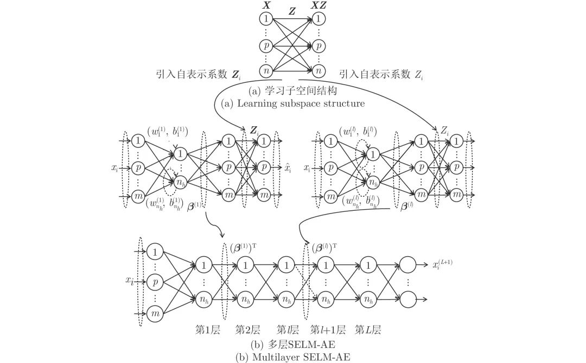
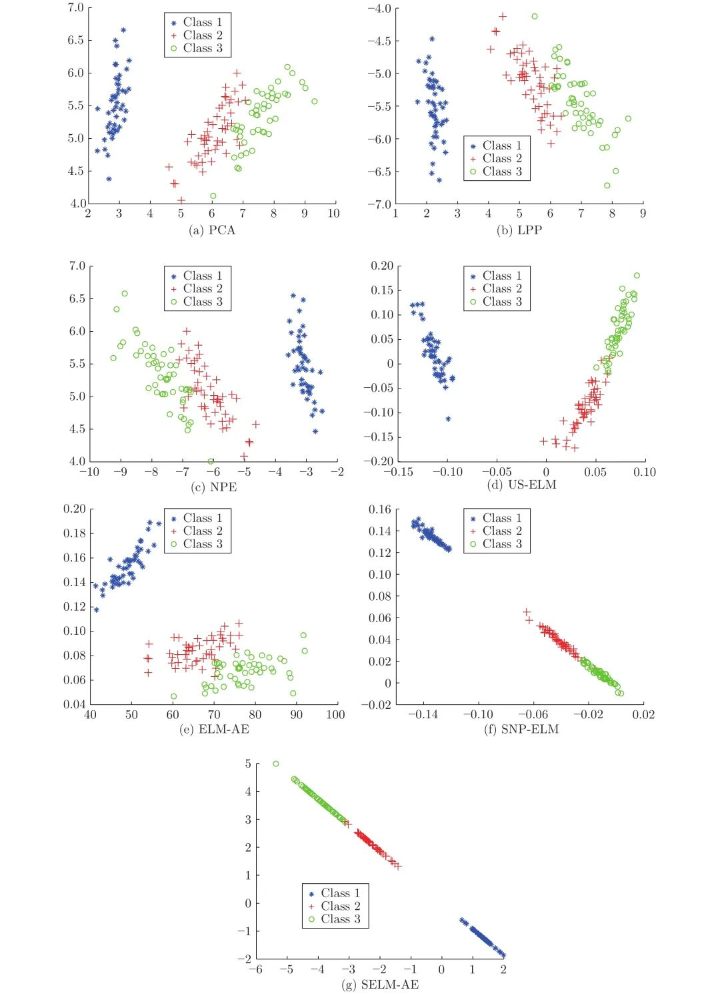
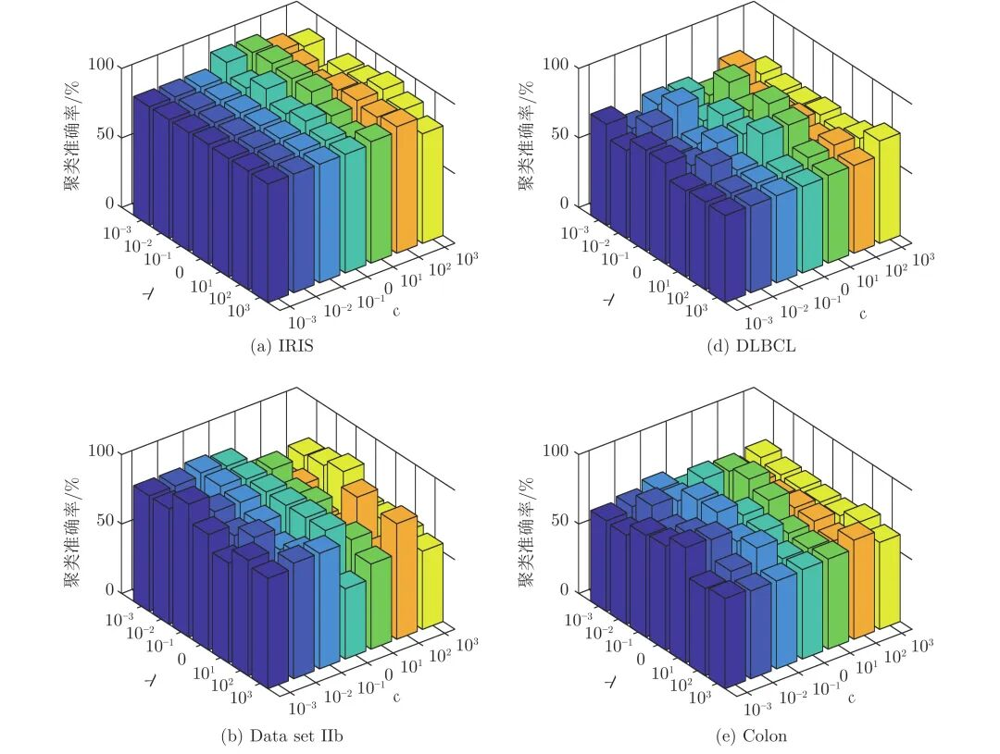
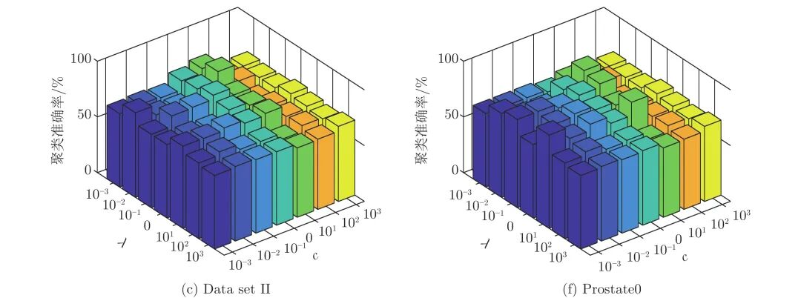

# 子空间结构保持的多层极限学习机自编码器

原创 自动化学报 自动化学报 2022-04-14 16:52 北京

> 原文地址: [https://mp.weixin.qq.com/s/booaHxNtV3UZABri6ZieAg](https://mp.weixin.qq.com/s/booaHxNtV3UZABri6ZieAg)

**点击蓝字 关注我们**

  

**引****用本文**

  

陈晓云, 陈媛. 子空间结构保持的多层极限学习机自编码器. 自动化学报, 2022, 48(4): 1091−1104 doi: 10.16383/j.aas.c200684

Chen Xiao-Yun, Chen Yuan. Multi-layer extreme learning machine autoencoder with subspace structure preserving. Acta Automatica Sinica, 2022, 48(4): 1091−1104 doi: 10.16383/j.aas.c200684    

http://www.aas.net.cn/cn/article/doi/10.16383/j.aas.c200684?viewType=HTML

  

**文章简介**

  

**关键词**

  

多层极限学习机, 自编码器, 子空间学习, 降维

  

**摘   要**

  

处理高维复杂数据的聚类问题, 通常需先降维后聚类, 但常用的降维方法未考虑数据的同类聚集性和样本间相关关系, 难以保证降维方法与聚类算法相匹配, 从而导致聚类信息损失. 非线性无监督降维方法极限学习机自编码器(Extreme learning machine, ELM-AE)因其学习速度快、泛化性能好, 近年来被广泛应用于降维及去噪. 为使高维数据投影至低维空间后仍能保持原有子空间结构, 提出基于子空间结构保持的多层极限学习机自编码器降维方法(Multilayer extreme learning machine autoencoder based on subspace structure preserving, ML-SELM-AE). 该方法在保持聚类样本多子空间结构的同时, 利用多层极限学习机自编码器捕获样本集的深层特征. 实验结果表明, 该方法在UCI数据、脑电数据和基因表达谱数据上可以有效提高聚类准确率且取得较高的学习效率.

  

**引   言**

  

自编码器(Autoencoder, AE)是一种非线性无监督神经网络, 也是一种无监督特征提取与降维方法, 通过非线性变换将输入数据投影到潜在特征空间中. AE由编码器和解码器组成, 可将输入数据编码为有意义的压缩表示, 然后对该表示进行解码使得解码输出与原始输入相同, 即解码器输出和输入数据间的重构误差最小. 当投影的潜在特征空间维数低于原始空间时, AE可视为非线性主成分分析的一种表示形式. 随着深度学习的成功, 其在多个领域取得了重要突破, 而深度自编码器作为一种无监督深度神经网络被用于数据降维、图像降噪和信号处理以提取数据的深层表示特征. 例如深度子空间聚类(Deep subspace clustering, DSL-l\_1)通过深度自编码器对稀疏子空间聚类进行扩展, 在深度自编码器的编码器和解码器间引入自表达层, 用反向传播算法对编码器的输出进行自表示系数矩阵的学习, 以该自表示系数矩阵作为原始样本的相似度矩阵. DSL-l\_1模型是全连接卷积神经网络并使用l\_1范数, 求解模型的反向传播算法时间及空间复杂度较高. 为提高计算效率, 需先执行主成分分析法对数据降维.

  

无监督的极限学习机自编码器(Extreme learning machine autoencoder, ELM-AE)是一种单隐层前馈神经网络, 其输入层到隐层的权值和偏置值随机给定, 学习过程只需通过优化最小二乘误差损失函数即可确定隐层到输出层的权值. 最小二乘损失函数的优化问题有解析解, 可转化为Moore-Penrose广义逆问题求解. 因此本质上相当于直接计算网络权值而无需迭代求解, 相比反向传播和迭代求解的神经网络学习方法, 学习速度快、泛化性能好, 因此本文以ELM-AE作为基础自编码器.

  

极限学习机自编码器与极限学习机(Extreme learning machine, ELM)类似, 主要不同之处在于ELM-AE的网络输出为输入样本的近似估计, ELM的网络输出为输入样本的类标签. 极限学习机自编码器虽然学习速度快, 但仅考虑数据全局非线性特征而未考虑面向聚类任务时数据本身固有的多子空间结构.

  

除极限学习机自编码器以外, 无监督极限学习机(Unsupervised extreme learning machine, US-ELM)也是一种重要的无监督ELM模型, 它采用无类别信息的流形正则项替代ELM模型中含类标签的网络误差函数, 经US-ELM投影后保持样本间的近邻关系不变. US-ELM虽考虑了样本分布的流形结构, 但其流形正则项在高维空间中易出现测度“集中现象”且未考虑不同聚簇样本间的结构差异. 在US-ELM模型基础上, 稀疏和近邻保持的极限学习机降维方法(Extreme learning machine based on sparsity and neighborhood preserving, SNP-ELM)引入全局稀疏表示及局部近邻保持模型,可以自适应地学习样本集的相似矩阵及不同簇样本集的子空间结构, 其不足之处在于需迭代求解稀疏优化问题, 运行时间较长.

  

综合上述分析, 本文以ELM-AE为基础自编码器, 引入最小二乘回归子空间模型(Least square regression, LSR)对编码器的输出样本进行多子空间结构约束, 提出子空间结构保持的极限学习机自编码器(Extreme learning machine autoencoder based on subspace structure preserving, SELM-AE)及其多层版本(Multilayer SELM-AE, ML-SELM-AE), 使面向聚类任务的高维数据经过ML-SELM-AE降维后仍能保持原样本数据的多子空间结构, 并可获取数据的更深层特征.

  

图 3  ML-SELM-AE网络结构

  

图 6  IRIS数据集的二维可视化

  

图 8  不同c和λ取值下的聚类准确率

  

请点击左下角“**阅读原文**”了解更多！

  

**作者简介**

**陈晓云**

福州大学数学与计算机科学学院教授. 主要研究方向为数据挖掘，机器学习和模式识别. 本文通信作者.

E-mail: c\_xiaoyun@fzu.edu.cn

**陈   媛**

福州大学数学与计算机科学学院硕士研究生. 主要研究方向为数据挖掘和模式识别.

E-mail: cy\_inohurry@163.com

  

**相关文章**

**（请向上滑动阅读）**

  

\[1\]   田娟秀, 刘国才, 谷珊珊, 鞠忠建, 刘劲光, 顾冬冬. 医学图像分析深度学习方法研究与挑战. 自动化学报, 2018, 44(3): 401-424. doi: 10.16383/j.aas.2018.c170153

http://www.aas.net.cn/cn/article/doi/10.16383/j.aas.2018.c170153?viewType=HTML

  

\[2\]   崔琳琳, 沈冰冰, 葛志强. 基于混合变分自编码器回归模型的软测量建模方法. 自动化学报, 2022, 48(2): 398-407. doi: 10.16383/j.aas.c210035

http://www.aas.net.cn/cn/article/doi/10.16383/j.aas.c210035?viewType=HTML

  

\[3\]   刘国梁, 余建波. 知识堆叠降噪自编码器. 自动化学报, 2022, 48(3): 774-786. doi: 10.16383/j.aas.c190375

http://www.aas.net.cn/cn/article/doi/10.16383/j.aas.c190375?viewType=HTML

  

\[4\]   刘国梁, 余建波. 基于堆叠降噪自编码器的神经-符号模型及在晶圆表面缺陷识别. 自动化学报. doi: 10.16383/j.aas.c190857

http://www.aas.net.cn/cn/article/doi/10.16383/j.aas.c190857?viewType=HTML

  

\[5\]   张万栋, 李庆忠, 黎明, 武庆明. 基于最优误差自校正极限学习机的高频地波雷达RD谱图海面目标检测算法. 自动化学报, 2021, 47(1): 108-120. doi: 10.16383/j.aas.c180210

http://www.aas.net.cn/cn/article/doi/10.16383/j.aas.c180210?viewType=HTML

  

\[6\]   陈晓云, 廖梦真. 基于稀疏和近邻保持的极限学习机降维. 自动化学报, 2019, 45(2): 325-333. doi: 10.16383/j.aas.2018.c170216

http://www.aas.net.cn/cn/article/doi/10.16383/j.aas.2018.c170216?viewType=HTML

  

\[7\]   许夙晖, 慕晓冬, 柴栋, 罗畅. 基于极限学习机参数迁移的域适应算法. 自动化学报, 2018, 44(2): 311-317. doi: 10.16383/j.aas.2018.c160818

http://www.aas.net.cn/cn/article/doi/10.16383/j.aas.2018.c160818?viewType=HTML

  

\[8\]   朱芳来, 蔡明, 郭胜辉. 离散切换系统观测器存在性讨论及降维观测器设计. 自动化学报, 2017, 43(12): 2091-2099. doi: 10.16383/j.aas.2017.c160471

http://www.aas.net.cn/cn/article/doi/10.16383/j.aas.2017.c160471?viewType=HTML

  

\[9\]   李春娜, 陈伟杰, 邵元海. 鲁棒的稀疏Lp-模主成分分析. 自动化学报, 2017, 43(1): 142-151. doi: 10.16383/j.aas.2017.c150512

http://www.aas.net.cn/cn/article/doi/10.16383/j.aas.2017.c150512?viewType=HTML

  

\[10\]   齐美彬, 檀胜顺, 王运侠, 刘皓, 蒋建国. 基于多特征子空间与核学习的行人再识别. 自动化学报, 2016, 42(2): 299-308. doi: 10.16383/j.aas.2016.c150344

http://www.aas.net.cn/cn/article/doi/10.16383/j.aas.2016.c150344?viewType=HTML

  

\[11\]   郑思龙, 李元祥, 魏宪, 彭希帅. 基于字典学习的非线性降维方法. 自动化学报, 2016, 42(7): 1065-1076. doi: 10.16383/j.aas.2016.c150557

http://www.aas.net.cn/cn/article/doi/10.16383/j.aas.2016.c150557?viewType=HTML

  

\[12\]   唐朝辉, 朱清新, 洪朝群, 祝峰. 基于自编码器及超图学习的多标签特征提取. 自动化学报, 2016, 42(7): 1014-1021. doi: 10.16383/j.aas.2016.c150736

http://www.aas.net.cn/cn/article/doi/10.16383/j.aas.2016.c150736?viewType=HTML

  

\[13\]   徐嘉明, 张卫强, 杨登舟, 刘加, 夏善红. 基于流形正则化极限学习机的语种识别系统. 自动化学报, 2015, 41(9): 1680-1685. doi: 10.16383/j.aas.2015.c140916

http://www.aas.net.cn/cn/article/doi/10.16383/j.aas.2015.c140916?viewType=HTML

  

\[14\]   张景祥, 王士同, 邓赵红, 蒋亦樟, 李奕. 融合异构特征的子空间迁移学习算法. 自动化学报, 2014, 40(2): 236-246. doi: 10.3724/SP.J.1004.2014.00236

http://www.aas.net.cn/cn/article/doi/10.3724/SP.J.1004.2014.00236?viewType=HTML

  

\[15\]   闫德勤, 刘胜蓝, 李燕燕. 一种基于稀疏嵌入分析的降维方法. 自动化学报, 2011, 37(11): 1306-1312. doi: 10.3724/SP.J.1004.2011.01306

http://www.aas.net.cn/cn/article/doi/10.3724/SP.J.1004.2011.01306?viewType=HTML

  

\[16\]   吴秀永, 徐科, 徐金梧. 基于Gabor小波和核保局投影算法的表面缺陷自动识别方法. 自动化学报, 2010, 36(3): 438-441. doi: 10.3724/SP.J.1004.2010.00438

http://www.aas.net.cn/cn/article/doi/10.3724/SP.J.1004.2010.00438?viewType=HTML

  

\[17\]   杨武夷, 梁伟, 辛乐, 张树武. 子空间半监督Fisher判别分析. 自动化学报, 2009, 35(12): 1513-1519. doi: 10.3724/SP.J.1004.2009.01513

http://www.aas.net.cn/cn/article/doi/10.3724/SP.J.1004.2009.01513?viewType=HTML

  

\[18\]   朱芳来, 丁宣浩. 具有单调性非线性项的非线性系统降维观测器设计. 自动化学报, 2007, 33(12): 1290-1293. doi: 10.1360/aas-007-1290

http://www.aas.net.cn/cn/article/doi/10.1360/aas-007-1290?viewType=HTML

  

\[19\]   朱芳来, 韩正之. 非线性系统降维观测器设计. 自动化学报, 2004, 30(4): 613-618.

http://www.aas.net.cn/cn/article/id/16292?viewType=HTML

  

\[20\]   朱芳来, 韩正之. 非线性系统指数型降维观测器设计. 自动化学报, 2002, 28(6): 1015-1018.

http://www.aas.net.cn/cn/article/id/15591?viewType=HTML

  

\[21\]   李海通. 小值轴角编码器. 自动化学报, 1981, 7(2): 131-137.

http://www.aas.net.cn/cn/article/id/15437?viewType=HTML

  

  

**近期文章**

[【热点专题】目标检测](http://mp.weixin.qq.com/s?__biz=MzI2NjA3MzM5MA==&mid=2649962259&idx=1&sn=97b0c31ec704211713ef8cba4bb51b01&chksm=f2943352c5e3ba44f2c7217cff60405765c6d67312beb6d07006155404bfc4b34268956697f5&scene=21#wechat_redirect)

[基于事件触发的分布式优化算法](http://mp.weixin.qq.com/s?__biz=MzAwMzAzMDgxOA==&mid=2651076142&idx=2&sn=b074793ec4be44ea08efb78617dcdcc0&chksm=8131fc63b6467575b7f6d698909e56be16089f8f56ca415294483ff6f40902c7546417f82531&scene=21#wechat_redirect)

[一种针对德州扑克AI的对手建模与策略集成框架](http://mp.weixin.qq.com/s?__biz=MzAwMzAzMDgxOA==&mid=2651075800&idx=1&sn=9ab9006d50bb2513c49006b1c1431a3c&chksm=8131fe95b6467783eb58de5d7b1726ddcb881561603c76bdcefa44f4a9a9027afc37b1be979c&scene=21#wechat_redirect)

[工业铸件缺陷无损检测技术的应用进展与展望](http://mp.weixin.qq.com/s?__biz=MzAwMzAzMDgxOA==&mid=2651075561&idx=1&sn=afda9a46702ab802788e1c9fc67b5849&chksm=8131f9a4b64670b2c122efca37574a0dceda3582b0477845b80670246b4eb8befce2ae748dc1&scene=21#wechat_redirect)

[《自动化学报》2022年第03期目录分享](http://mp.weixin.qq.com/s?__biz=MzAwMzAzMDgxOA==&mid=2651075527&idx=1&sn=bc020c5fd09080243f7527610b003507&chksm=8131f98ab646709c2f485852b526989a3b9af5cc93e8afb508d9239b78176f49caa9807d6a8d&scene=21#wechat_redirect)

[2022斯坦福AI指数报告出炉！点击获取完整报告](http://mp.weixin.qq.com/s?__biz=MzAwMzAzMDgxOA==&mid=2651075236&idx=3&sn=1caed46e80f613c172a227ead8ddc1a3&chksm=8131f8e9b64671ffa8d6f7c8a36210fe1e262a66a42ab9a544e064d3c725b4a31274a4551750&scene=21#wechat_redirect)

[黄艳龙, 徐德, 谭民. 机器人运动轨迹的模仿学习综述](http://mp.weixin.qq.com/s?__biz=MzAwMzAzMDgxOA==&mid=2651075236&idx=1&sn=ec575c249f6e60709a32a7dfa6b55f37&chksm=8131f8e9b64671ffaf5de201407410a38735b35d7f4e6ab43eb05dac537068fb912ceef808c1&scene=21#wechat_redirect)

**热点文章**

[CVPR 2022 | 自动化所新作速览！（上）](http://mp.weixin.qq.com/s?__biz=MzAwMzAzMDgxOA==&mid=2651075034&idx=2&sn=48b5232daaa7a51da96c3a7c87013e2d&chksm=8131fb97b6467281dc8e02749df8d0388f89d30e3b08f44d13c700169d1d7a22c4feef9f2dba&scene=21#wechat_redirect)

[CVPR 2022 | 自动化所新作速览！（下）](http://mp.weixin.qq.com/s?__biz=MzAwMzAzMDgxOA==&mid=2651075034&idx=3&sn=21833bb312bb0d9826c64c9fce068aa5&chksm=8131fb97b646728147f2bff58a04230d708d5a4537eb824656c2d54580b11f6a47b0eb30ade6&scene=21#wechat_redirect)

[直播回放分享 | 陈关荣教授：探索最优同步网络的拓扑结构](http://mp.weixin.qq.com/s?__biz=MzIxMjA5Njg2Nw==&mid=2649061608&idx=1&sn=1500a81260d8f5127b7cb7767c759fba&chksm=8f5a9ae4b82d13f201b714d8e96af9bbddf442bb7e10c97416fb925ab2170c05fa12010fb1d1&scene=21#wechat_redirect)

[《自动化学报》2019年高关注论文](http://mp.weixin.qq.com/s?__biz=MzAwMzAzMDgxOA==&mid=2651073450&idx=1&sn=6f57bd0df73f259aa416575f1f69bdfb&chksm=8131e1e7b64668f1344de4acdef6148e8dcfa60c80e4f48e6cb1270558c2beade5601e92d05c&scene=21#wechat_redirect)

[《自动化学报》2021年热点文章回顾](http://mp.weixin.qq.com/s?__biz=MzAwMzAzMDgxOA==&mid=2651072577&idx=1&sn=4e6be077d7371c7d29d9a371d8defe19&chksm=8131e20cb6466b1aec2f3b8b1063d3be11725ca9a0c15785c3b42a638170e732acd0d8d345e0&scene=21#wechat_redirect)

[国家自然科学基金论文精选](http://mp.weixin.qq.com/s?__biz=MzI2NjA3MzM5MA==&mid=2649960308&idx=1&sn=1634c999f22588333537f13393403f9c&chksm=f2942b35c5e3a2232e86b51c2b7c8f37a4d3d7f858d370d76d5afd00567d7da6e9543476d120&scene=21#wechat_redirect)  

[国家重点研发计划论文精选](http://mp.weixin.qq.com/s?__biz=MzI2NjA3MzM5MA==&mid=2649960255&idx=1&sn=f48435928fd924134cb72014860b9d00&chksm=f2942b7ec5e3a26869da68a1419b3b40ca1e6cb98abf2e380d78a49ffb99c85991d76cc346b0&scene=21#wechat_redirect)

  

**期刊动态**

[自动化学报（英文版）和自动化学报入选计算领域高质量科技期刊T1类](http://mp.weixin.qq.com/s?__biz=MzAwMzAzMDgxOA==&mid=2651073859&idx=2&sn=7a9192717637dcf6cddb39ed961e8c3b&chksm=8131e70eb6466e188a123c504bdeba80c75681de4762f8685b3bf584bc33eb12362c70613b4e&scene=21#wechat_redirect)

[《自动化学报》编辑部防诈骗公告](http://mp.weixin.qq.com/s?__biz=MzAwMzAzMDgxOA==&mid=2651073517&idx=1&sn=c52de7c685e546af9faffc0cefab1c85&chksm=8131e1a0b64668b63ebaa68ea81cbaec3b94dc52ea8360821a0a49e67ae7e4b428a25d0f19c5&scene=21#wechat_redirect)

[《自动化学报》致谢审稿人](http://mp.weixin.qq.com/s?__biz=MzI2NjA3MzM5MA==&mid=2649961201&idx=1&sn=3142842d75c441ae860c1ecb313c7657&chksm=f29436b0c5e3bfa6c679210f60513eb1a7205dc20fe028f482bb593eac60427e4e56fba12493&scene=21#wechat_redirect)

[自动化学报多篇论文入选中国百篇最具影响国内论文和中国精品期刊顶尖论文](http://mp.weixin.qq.com/s?__biz=MzI2NjA3MzM5MA==&mid=2649961152&idx=1&sn=4a5e9e4b84879f4cde4e13a0ef97272c&chksm=f2943681c5e3bf97d7770c9623dac869b283b3ea83f3d320017974033e361d8b999134a8bdff&scene=21#wechat_redirect)

[自动化学报各项主要指标蝉联第1，再获百种中国杰出期刊称号](http://mp.weixin.qq.com/s?__biz=MzI2NjA3MzM5MA==&mid=2649960903&idx=1&sn=7da8b8a0167e16bcbaa1f00fbfb69782&chksm=f2943586c5e3bc9014f6d4fff7147b998ae42b4da452907e641e8029f296fd2413b4f17aef62&scene=21#wechat_redirect)

  

**期刊目录**

[2022年第03期](http://mp.weixin.qq.com/s?__biz=MzAwMzAzMDgxOA==&mid=2651075527&idx=1&sn=bc020c5fd09080243f7527610b003507&chksm=8131f98ab646709c2f485852b526989a3b9af5cc93e8afb508d9239b78176f49caa9807d6a8d&scene=21#wechat_redirect)

[2022年第02期](http://mp.weixin.qq.com/s?__biz=MzI2NjA3MzM5MA==&mid=2649961838&idx=1&sn=29334896aa0f372b70312250c75b6b20&chksm=f294312fc5e3b8392ffd49100eaba435bf48fa9234c5019fe7b16ed1e4ebef70be58691f3fb3&scene=21#wechat_redirect)

[2022年第01期](http://mp.weixin.qq.com/s?__biz=MzI2NjA3MzM5MA==&mid=2649961423&idx=1&sn=3b65958faa7c7f94c247f46dd72bd71e&chksm=f294378ec5e3be9825f860d132c36c97f3e877089449cb1fe85a6d1e7da9bd0e24795336bc54&scene=21#wechat_redirect)

[《自动化学报》2021年全年合集](http://mp.weixin.qq.com/s?__biz=MzAwMzAzMDgxOA==&mid=2651072770&idx=1&sn=7c531f7fa3bc390558fab15b339ce86e&chksm=8131e34fb6466a59ed079448fddda0fc9f97066460bff8f6835288003a1fba2812de383813c1&scene=21#wechat_redirect)

[《自动化学报》2020年全年合集](http://mp.weixin.qq.com/s?__biz=MzI2NjA3MzM5MA==&mid=2649957972&idx=1&sn=1951847aacbcb7d22bdd2a46a79af871&chksm=f2942215c5e3ab03d070d8e52b8764b38036897c97b6a26c7a1f918c806b28edbe6c0fbf7ea9&scene=21#wechat_redirect)

[2020年第10期 工业人工智能专题](http://mp.weixin.qq.com/s?__biz=MzI2NjA3MzM5MA==&mid=2649957201&idx=1&sn=ab82a767bd716ab67fdf2942500d8b61&chksm=f2942710c5e3ae06b27f9e63a5e329a1123d90b051164e6b6123c500230541b1ed12d92abbfb&scene=21#wechat_redirect)

[2020年第09期 分布式信息能源系统理论与应用专题](http://mp.weixin.qq.com/s?__biz=MzI2NjA3MzM5MA==&mid=2649956412&idx=1&sn=8ebc13d63fd333ad85dbb8b5825df248&chksm=f294247dc5e3ad6ba297857a5b957e97cf499266c50318791fa8abd9432ecf1d9c3d9b287e36&scene=21#wechat_redirect)

  

  

  

**长按二维码｜关注我们**

**IEEE/CAA Journal of Automatica Sinica (JAS)**

**长按二维码｜关注我们**

**《自动化学报》服务号**

**长按二维码｜关注我们**

**《自动化学报》订阅号**  

  

**联系我们**

**网站:** 

http://www.aas.net.cn

http://www.ieee-jas.net

**投稿:** 

https://mc03.manuscriptcentral.com/aas-cn   

https://mc03.manuscriptcentral.com/ieee-jas 

**电话:**

010-82544653（日常咨询和稿件处理） 

010-82544677（录用后稿件处理）

**邮箱:** 

aas@ia.ac.cn（日常咨询和稿件处理）  

aas\_editor@ia.ac.cn（录用后稿件处理）

**博客:** 

http://blog.sina.com.cn/aaseditor 

  

**↓ 点击下方 阅读原文 了解更多**