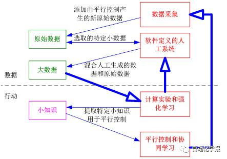
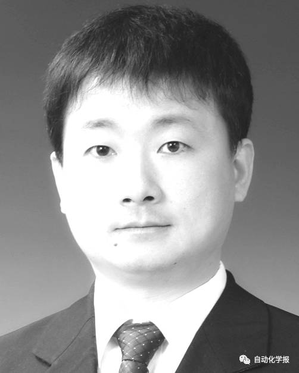
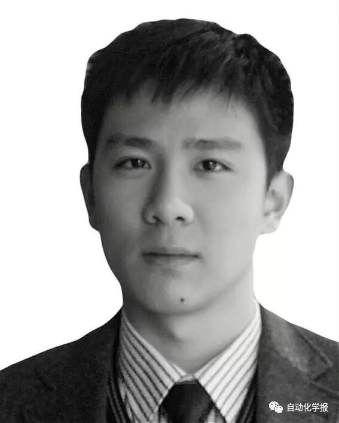
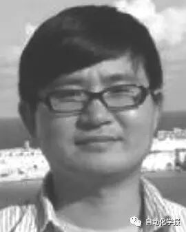
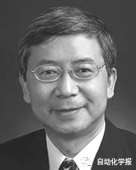
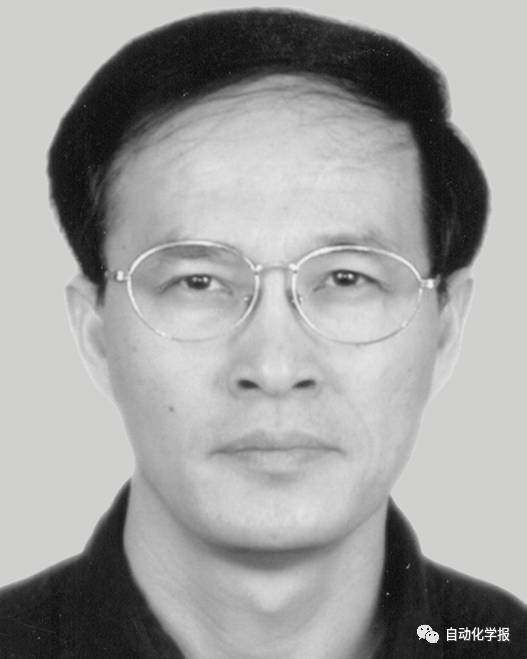

# 平行学习——机器学习的一个新型理论框架

原创 自动化学报 2017-01-19 17:49 北京

> 原文地址: [https://mp.weixin.qq.com/s/5W3TWqKlo4lAr1vR2ciYvA](https://mp.weixin.qq.com/s/5W3TWqKlo4lAr1vR2ciYvA)

随着计算能力的提高和计算理论的创新, 机器学习在过去 30 年中取得了长足的发展 , 正受到越来越多人的关注,与此同时, 机器学习也面临越来越多的问题, 传统机器学习理论框架的不足被逐渐发现和确认, 新的机器学习理论框架不断被提出.

中科院自动化所王飞跃研究员于2004年提出了平行系统的思想, 试图用一种适合复杂系统的计算理论与方法解决社会经济系统中的重要问题. 其主要观点是利用大型计算模拟、 预测并诱发引导复杂系统现象, 通过整合人工社会, 计算实验和平行系统等方法, 形成新的计算研究体系.近年来, 我们尝试将平行系统的思想扩展并引入到机器学习领域建立一种新型理论框架以更好地解决数据取舍、行动选择等传统机器学习理论不能很好解决的问题.在本文中，我们将对这一理论框架的结构和方法进行阐述。框架示意图如下：

图1  平行学习的理论框架图

平行学习大致可以分为数据处理和行动学习两个互相耦合关联的阶段。

在数据处理阶段，平行学习首先从原始数据中选取特定的“小数据”，输入到软件定义的人工系统中，并由人工系统产生大量新的数据。然后这些人工数据和特定的原始小数据一起构成解决问题所需要学习的“大数据”集合，用于更新机器学习模型。

在行动学习阶段，平行学习沿用强化学习的思路，使用状态迁移来刻画系统的动态变化，从人工合成大数据中学习，并将习到的知识存储在系统状态转移函数中。但特别之处在于，平行学习利用计算实验方法进行预测学习（Predictive Learning）。通过学习提取，我们可以得到应用于某些具体场景或任务的“小知识”，并用于平行控制和平行决策。

而平行控制和平行决策将引导系统进行特定的数据采集，获得新的原始数据，并再次进行新的平行学习，使系统在数据和行动之间构成一个闭环。不仅如此，我们还将引入指示学习（Prescriptive Learning）的思想，从另一个角度来重新结合数据和行动。

在本文中，我们还将阐述了平行学习的三大特色方法：

1）通过软件定义的人工系统进行大数据预处理.美国物理学家费曼（Richard Feynman）曾说“不是我创造的，我就不能理解”（What I cannot create, I do not understand）. 在平行学习中，我们通过构建人工场景来模拟和表示复杂系统的特定场景，并将选取的特定“小数据”在平行系统中演化和迭代，以受控的形式产生更多因果关系明确、数据格式规整、便于探索利用的大数据，再把大数据浓缩成小知识、小智慧和小定律,使模型可以更好地理解数据中隐藏的规律;

2）包含预测学习、集成学习的数据学习.通过结合仿真建模, 并行学习, 动态演化等方法实现对动态系统数据的建模和控制, 我们称这种学习方式为平行预测+指示学习（Parallel Predictive+ Prescriptive Learning）, 可以糅合无监督、半监督和有监督三种学习方式.

3）基于默顿定律实现数据—行动引导的指示学习. 美国社会学家默顿（Robert K. Merton）指出，存在一类所谓默顿系统, 在该型统中，存在双向的影响通路，控制者对系统的调控会影响系统运行的结果。默顿将这一长期行动称为预言的自我实现定律(Self-Fulfilling Prophecy）. 综合对抗学习和对偶学习，我们提出了更一般的指示学习，通过设置引导，使得我们获得预期的学习目的或者学习效果.

平行学习作为一种新的机器学习理论框架，已在虚拟场景生成、无人驾驶车辆智能测试以及社会计算和情报处理等领域得到了较好的应用。期待本文抛砖引玉，引起业内专家学者兴趣，共同对机器学习理论做出更加深入的革新。

引用格式

李力, 林懿伦, 曹东璞, 郑南宁, 王飞跃. 平行学习——机器学习的一个新型理论框架. 自动化学报, 2017, 43(1): 1-8

作者简介

李力 清华大学自动化系副教授. 主要研究方向为人工智能和机器学习, 智能交通系统和智能汽车.

E-mail: li-li@tsinghua.edu.cn

林懿伦 中国科学院自动化研究所复杂系统管理与控制国家重点实验室博士研究生. 主要研究方向为社会计算, 智能交通系统, 深度学习和强化学习.

E-mail: linyilun2014@ia.ac.cn

曹东璞 英国克兰菲尔德大学驾驶员认知与自动驾驶实验室主任. 中科院自动化所客座研究员.主要研究方向为自动驾驶, 人车协同, 与平行驾驶.

E-mail: d.cao@cranfield.ac.uk

郑南宁 西安交通大学人工智能与机器人研究所教授. 中国工程院院士. 主要研究方向为模式识别与智能系统, 机器视觉与图象处理.

E-mail: nnzheng@mail.xjtu.edu.cn

王飞跃 中国科学院自动化研究所复杂系统管理与控制国家重点实验室研究员. 国防科学技术大学军事计算实验与平行系统技术研究中心主任.主要研究方向为智能系统和复杂系统的建模、分析与控制.本文通信作者.

E-mail: feiyue.wang@ia.ac.cn

欢迎扫描二维码、长按图片识别关注《自动化学报》中文版订阅号aas1963，服务号自动化学报和英文版服务号！

