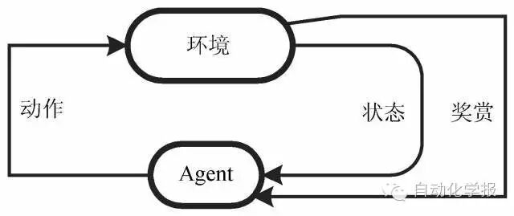
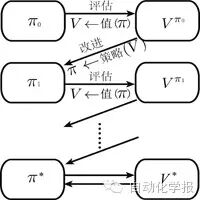
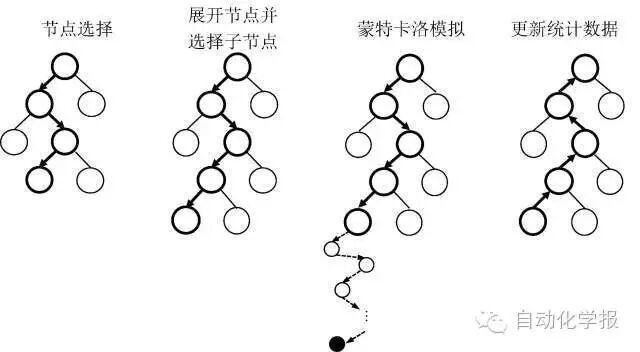
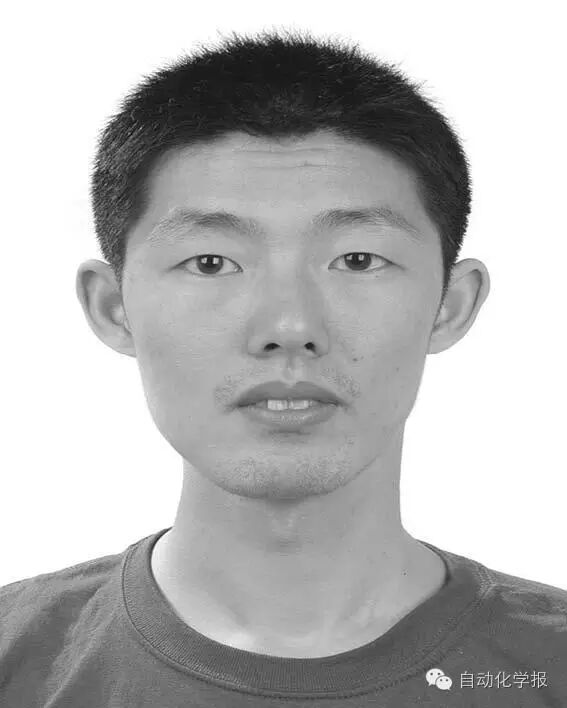

# 强化学习及其在电脑围棋中的应用

原创 自动化学报 2016-05-23 16:22 北京

> 原文地址: [https://mp.weixin.qq.com/s/cb82WNiafauuv0P5VEDcyA](https://mp.weixin.qq.com/s/cb82WNiafauuv0P5VEDcyA)

摘要

强化学习是一类特殊的机器学习, 通过与所在环境的自主交互来学习决策策略, 使得策略收到的长期累积奖赏最大.最近, 在围棋和电子游戏等领域, 强化学习被成功用于取得人类水平的操作能力, 受到了广泛关注. 本文将对强化学习进行简要介绍, 重点介绍基于函数近似的强化学习方法, 以及在围棋等领域中的应用.

关键词

强化学习, 函数近似, 核方法, 神经网络, 加性模型, 深度强化学习

引用格式

陈兴国, 俞扬. 强化学习及其在电脑围棋中的应用. 自动化学报, 2016, 42(5): 685-695

图 1.  强化学习

图 2.  广义策略迭代: 值函数与策略交互直到最优

图 3.  蒙特卡洛树搜索

作者简介

陈兴国 南京邮电大学计算机学院/软件学院讲师. 2014 年获得南京大学计算机系博士学位. 主要研究方向为机器学习, 强化学习.

E-mail: chenxg@njupt.edu.cn

俞扬 南京大学计算机系副教授, 2011年获得南京大学计算机系博士学位. 主要研究方向为机器学习, 演化学习, 强化学习. 本文通信作者.

E-mail: yuy@nju.edu.cn

