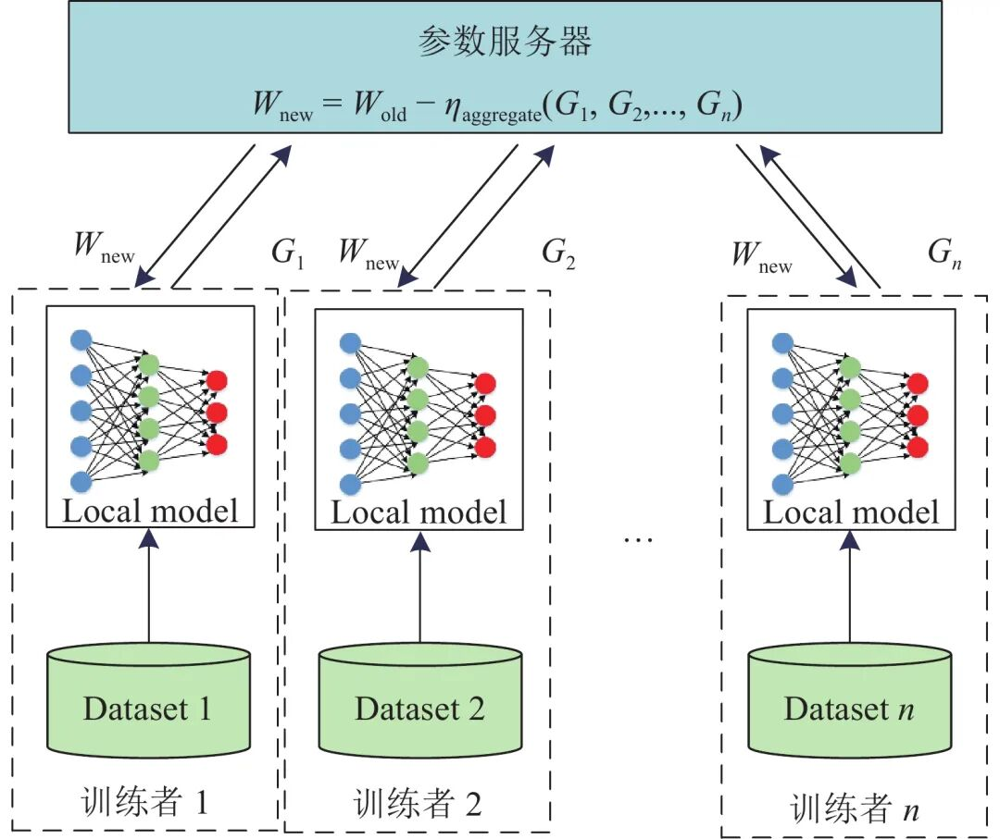
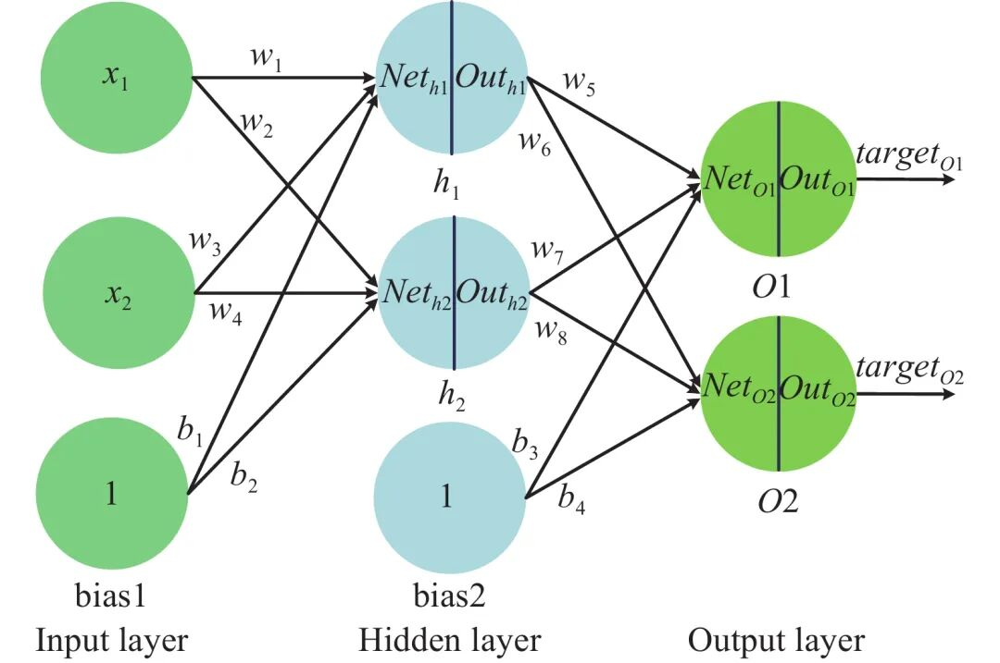
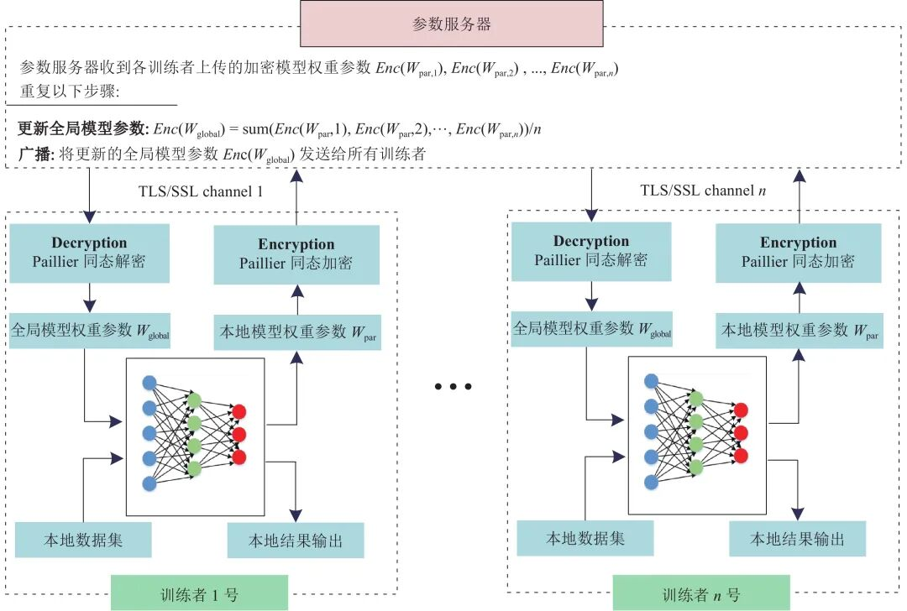

# 支持数据隐私保护的联邦深度神经网络模型研究

原创 自动化学报 自动化学报 2022-03-28 11:37 北京

> 原文地址: [https://mp.weixin.qq.com/s/8KC9-wb-\_sx7Y\_HEw39low](https://mp.weixin.qq.com/s/8KC9-wb-_sx7Y_HEw39low)

**点击蓝字 关注我们**

  

**引****用本文**

  

张泽辉, 富瑶, 高铁杠. 支持数据隐私保护的联邦深度神经网络模型研究. 自动化学报, 2022, 48(4): 1−12 doi: 10.16383/j.aas.c200236

Zhang Ze-Hui, Fu Yao, Gao Tie-Gang. Research on federated deep neural network model for data privacy protection. Acta Automatica Sinica, 2022, 48(4): 1−12 doi: 10.16383/j.aas.c200236

http://www.aas.net.cn/cn/article/doi/10.16383/j.aas.c200236?viewType=HTML

**文章简介**

  

**关键词**

  

联邦学习, 深度学习, 数据隐私, 同态加密, 神经网络

  

**摘   要**

  

近些年, 人工智能技术已经在图像分类、目标检测、语义分割、智能控制以及故障诊断等领域得到广泛应用, 然而某些行业(例如医疗行业)由于数据隐私的原因, 多个研究机构或组织难以共享数据训练联邦学习模型. 因此, 将同态加密算法技术引入到联邦学习中, 提出一种支持数据隐私保护的联邦深度神经网络模型(Privacy-preserving federated deep neural network, PFDNN). 该模型通过对其权重参数的同态加密保证了数据的隐私性, 并极大地减少了训练过程中的加解密计算量. 通过理论分析与实验验证, 所提出的联邦深度神经网络模型具有较好的安全性, 并且能够保证较高的精度.

  

**引   言**

  

近年来, 人工智能技术已经在图像分类、目标检测、语义分割、智能控制以及故障诊断等领域取得了优秀的成果. 在解决某些特殊问题方面, 深度学习算法已经逼近甚至超过人类水平. 深度学习技术的快速发展主要依赖于: 丰富的数据集、算法的创新和运算设备性能的大幅提升. 其中, 数据集的丰富程度对深度学习模型的性能水平产生直接影响. 因此, 为进一步提升模型性能水平, 能够组织多个研究机构通过共享本地模型参数, 协同训练全局模型的联邦学习算法被提出. 但是, 某些行业考虑到数据隐私泄露的问题, 难以共享数据进行联合学习. 例如医疗行业在数据共享的过程中, 某些病人的信息可能会泄露到不法分子手中, 不法分子则利用患者信息推销非法药品、谋财害命.

  

针对机器学习中数据隐私泄露的问题, 一些隐私保护的方法被提出, 主要可以分为以安全多方计算(Secure multiparty computation, SMPC)、同态加密(Homomorphic encryption, HE)为代表的基于加密的隐私保护方法和以差分隐私(Differential privacy, DP)为代表的基于扰动的隐私保护方法.

  

安全多方计算是指两个或者多个持有私有数据的参与者通过联合计算得到输出, 并且满足正确性、隐私性、公平性等安全特性. Bonawitz等提出一种基于秘密共享的安全多方计算协议, 旨在保证设备与服务端之间通信, 并可以用于联邦学习的参数聚合过程. 与传统密码学方法相比, 该协议的优点在于其计算代价并不高, 但由于通信过程涉及大量安全密钥及其他参数, 可能导致通信代价会高于计算代价.

  

同态加密方案能够保证对密文执行的特定数学运算会对其明文有着相同的影响. 贾春福等提出一种在同态加密数据集上训练机器学习算法的方案. 这类方法能够很好地解决隐私安全问题, 既可以将加密的数据聚合在一起进行模型训练, 也可以采用联邦学习进行模型训练. 然而, 该类方法需要根据所构建的机器学习模型, 选用或设计恰当的同态加密方案对训练数据进行加密, 对密码学知识有着较高的要求. 同时, 由于对数据加密需要大量的算力资源, 该类方法不适用于大数据环境下的深度学习模型训练. Phong等提出通过对联邦学习过程中各训练者产生的梯度数据进行加密, 从而保证多个参与训练者的本地数据隐私安全. 这类方法通过对梯度参数进行加密保护, 能够很好地保护数据隐私安全. 然而, 该方法的加密运算量与训练数据量的大小直接相关, 会大大增加模型训练时间和计算成本, 并且没有对偏置项进行考虑.

  

差分隐私技术指在模型训练过程中引入随机性, 即添加一定程度的随机噪声, 使输出结果与真实结果存在着一定程度的偏差, 从而防止攻击者推理. Agrawal等提出通过对训练数据集进行扰动, 实现联邦深度神经网络的隐私保护. Shokri等通过对神经网络模型的梯度参数上添加噪声, 从而实现数据隐私的保护. Truex等针对联邦学习模型, 提出一种结合差分隐私和安全多方计算的隐私保护方案, 能够在保护数据隐私的同时, 还有着较高的准确率. 然而在梯度参数上添加噪声, 可能会造成机器学习模型训练时收敛难度增大、预测精度下降, 降低模型的使用性能.

  

针对上述问题, 本文提出一种支持数据隐私保护的联邦深度神经网络模型. 本文主要贡献有两个: 1) 对多层神经网络的训练过程进行分析, 详细地论述模型权重参数与梯度参数是如何泄露数据集信息的. 2) 将固定的偏置项参数改为随机数生成, 从而避免由于梯度参数信息泄露而导致数据信息的直接泄露; 并且将模型梯度参数加密替换为神经网络模型的权重参数加密, 从而减少了加解密运算量; 同时训练者可选择多种优化算法, 不再局限于随机梯度下降法, 使得提出的方法更加适用于真实场景.

  

图 1  联邦学习结构

  

图 2  神经网络结构

  

图 6  支持数据隐私保护的联邦学习训练过程

  

请点击左下角“**阅读原文**”了解更多！

  

**作者简介**

**张泽辉**

南开大学软件学院博士研究生. 2019年获得武汉理工大学硕士学位. 主要研究方向为联邦学习, 故障诊断和智能船舶控制.

E-mail: zhangtianxia918@163.com

**富   瑶**

南开大学软件学院硕士研究生. 主要研究方向为云端数据完整性验证, 信息安全.

E-mail: FuYao\_TJ@163.com

**高铁杠**

南开大学软件学院教授. 1991年获得华中理工大学应用数学专业硕士学位, 2005年获得南开大学博士学位. 主要研究方向为联邦学习, 图像水印, 信息隐藏和云端数据安全. 本文通信作者.

E-mail: gaotiegang@nankai.edu.cn

  

**相关文章**

**（请向上滑动阅读）**

  

\[1\]  陈加, 张玉麒, 宋鹏, 魏艳涛, 王煜. 深度学习在基于单幅图像的物体三维重建中的应用. 自动化学报, 2019, 45(4): 657-668. doi: 10.16383/j.aas.2018.c180236

http://www.aas.net.cn/cn/article/doi/10.16383/j.aas.2018.c180236?viewType=HTML

  

\[2\]  张超, 李强, 陈子豪, 黎祖睿, 张震. Medical Chain:联盟式医疗区块链系统. 自动化学报, 2019, 45(8): 1495-1510. doi: 10.16383/j.aas.c180131

http://www.aas.net.cn/cn/article/doi/10.16383/j.aas.c180131?viewType=HTML

  

\[3\]  王龙, 宋慧慧, 张开华, 刘青山. 反馈学习高斯表观网络的视频目标分割. 自动化学报, 2022, 48(3): 834-842. doi: 10.16383/j.aas.c200288

http://www.aas.net.cn/cn/article/doi/10.16383/j.aas.c200288?viewType=HTML

  

\[4\]  范家伟, 张如如, 陆萌, 何佳雯, 康霄阳, 柴文俊, 石珅达, 宋美娜, 鄂海红, 欧中洪. 深度学习方法在糖尿病视网膜病变诊断中的应用. 自动化学报, 2021, 47(5): 985-1004. doi: 10.16383/j.aas.c190069

http://www.aas.net.cn/cn/article/doi/10.16383/j.aas.c190069?viewType=HTML

  

\[5\]  林文瑞, 丛爽. 基于深度学习LDAMP网络的量子状态估计. 自动化学报. doi: 10.16383/j.aas.c210156

http://www.aas.net.cn/cn/article/doi/10.16383/j.aas.c210156?viewType=HTML

  

\[6\]  李佳星, 赵勇先, 王京华. 基于深度学习的单幅图像超分辨率重建算法综述. 自动化学报, 2021, 47(10): 2341-2363. doi: 10.16383/j.aas.c190859

http://www.aas.net.cn/cn/article/doi/10.16383/j.aas.c190859?viewType=HTML

  

\[7\]  张泽辉, 李庆丹, 富瑶, 何宁昕, 高铁杠. 面向非独立同分布数据的自适应联邦深度学习算法. 自动化学报. doi: 10.16383/j.aas.c201018

http://www.aas.net.cn/cn/article/doi/10.16383/j.aas.c201018?viewType=HTML

  

\[8\]  许玉格, 钟铭, 吴宗泽, 任志刚, 刘伟生. 基于深度学习的纹理布匹瑕疵检测方法. 自动化学报. doi: 10.16383/j.aas.c200148

http://www.aas.net.cn/cn/article/doi/10.16383/j.aas.c200148?viewType=HTML

  

\[9\]  侯建华, 张国帅, 项俊. 基于深度学习的多目标跟踪关联模型设计. 自动化学报, 2020, 46(12): 2690-2700. doi: 10.16383/j.aas.c180528

http://www.aas.net.cn/cn/article/doi/10.16383/j.aas.c180528?viewType=HTML

  

\[10\]  梁星星, 冯旸赫, 马扬, 程光权, 黄金才, 王琦, 周玉珍, 刘忠. 多Agent深度强化学习综述. 自动化学报, 2020, 46(12): 2537-2557. doi: 10.16383/j.aas.c180372

http://www.aas.net.cn/cn/article/doi/10.16383/j.aas.c180372?viewType=HTML

  

\[11\]  田娟秀, 刘国才, 谷珊珊, 鞠忠建, 刘劲光, 顾冬冬. 医学图像分析深度学习方法研究与挑战. 自动化学报, 2018, 44(3): 401-424. doi: 10.16383/j.aas.2018.c170153

http://www.aas.net.cn/cn/article/doi/10.16383/j.aas.2018.c170153?viewType=HTML

  

\[12\]  陈伟宏, 安吉尧, 李仁发, 李万里. 深度学习认知计算综述. 自动化学报, 2017, 43(11): 1886-1897. doi: 10.16383/j.aas.2017.c160690

http://www.aas.net.cn/cn/article/doi/10.16383/j.aas.2017.c160690?viewType=HTML

  

\[13\]  朱煜, 赵江坤, 王逸宁, 郑兵兵. 基于深度学习的人体行为识别算法综述. 自动化学报, 2016, 42(6): 848-857. doi: 10.16383/j.aas.2016.c150710

http://www.aas.net.cn/cn/article/doi/10.16383/j.aas.2016.c150710?viewType=HTML

  

\[14\]  段艳杰, 吕宜生, 张杰, 赵学亮, 王飞跃. 深度学习在控制领域的研究现状与展望. 自动化学报, 2016, 42(5): 643-654. doi: 10.16383/j.aas.2016.c160019

http://www.aas.net.cn/cn/article/doi/10.16383/j.aas.2016.c160019?viewType=HTML

  

\[15\]  郭潇逍, 李程, 梅俏竹. 深度学习在游戏中的应用. 自动化学报, 2016, 42(5): 676-684. doi: 10.16383/j.aas.2016.y000002

http://www.aas.net.cn/cn/article/doi/10.16383/j.aas.2016.y000002?viewType=HTML

  

\[16\]  奚雪峰, 周国栋. 面向自然语言处理的深度学习研究. 自动化学报, 2016, 42(10): 1445-1465. doi: 10.16383/j.aas.2016.c150682

http://www.aas.net.cn/cn/article/doi/10.16383/j.aas.2016.c150682?viewType=HTML

  

\[17\]  乔俊飞, 潘广源, 韩红桂. 一种连续型深度信念网的设计与应用. 自动化学报, 2015, 41(12): 2138-2146. doi: 10.16383/j.aas.2015.c150239

http://www.aas.net.cn/cn/article/doi/10.16383/j.aas.2015.c150239?viewType=HTML

  

\[18\]  梁久祯, 何新贵, 周家庆. 神经网络BP学习算法动力学分析. 自动化学报, 2002, 28(5): 729-735.

http://www.aas.net.cn/cn/article/id/15582?viewType=HTML

  

\[19\]  朱大铭, 马绍汉, 魏道政. 二进制映射神经网络的几何学习算法及其应用. 自动化学报, 2000, 26(3): 339-346.

http://www.aas.net.cn/cn/article/id/16061?viewType=HTML

  

\[20\]  朱刚, 周贤伟, 张凯, 尤昌德, 胡保生. 一种神经网络自学习控制结构与算法. 自动化学报, 2000, 26(4): 568-571.

http://www.aas.net.cn/cn/article/id/16092?viewType=HTML

  

\[21\]  王耀南. 基于神经网络的机器人自学习控制器. 自动化学报, 1997, 23(5): 698-702.

http://www.aas.net.cn/cn/article/id/16965?viewType=HTML

  

\[22\]  倪先锋, 陈宗基, 周绥平. 基于神经网络的非线性学习控制研究. 自动化学报, 1993, 19(3): 307-315.

http://www.aas.net.cn/cn/article/id/14238?viewType=HTML

  

\[23\]  西广成. 神经网络系统学习过程初探. 自动化学报, 1991, 17(3): 311-316.

http://www.aas.net.cn/cn/article/id/14589?viewType=HTML

  

  

**近期文章**

[2022斯坦福AI指数报告出炉！点击获取完整报告](http://mp.weixin.qq.com/s?__biz=MzAwMzAzMDgxOA==&mid=2651075236&idx=3&sn=1caed46e80f613c172a227ead8ddc1a3&chksm=8131f8e9b64671ffa8d6f7c8a36210fe1e262a66a42ab9a544e064d3c725b4a31274a4551750&scene=21#wechat_redirect)

[CVPR 2022 | 自动化所新作速览！（上）](http://mp.weixin.qq.com/s?__biz=MzAwMzAzMDgxOA==&mid=2651075034&idx=2&sn=48b5232daaa7a51da96c3a7c87013e2d&chksm=8131fb97b6467281dc8e02749df8d0388f89d30e3b08f44d13c700169d1d7a22c4feef9f2dba&scene=21#wechat_redirect)

[CVPR 2022 | 自动化所新作速览！（下）](http://mp.weixin.qq.com/s?__biz=MzAwMzAzMDgxOA==&mid=2651075034&idx=3&sn=21833bb312bb0d9826c64c9fce068aa5&chksm=8131fb97b646728147f2bff58a04230d708d5a4537eb824656c2d54580b11f6a47b0eb30ade6&scene=21#wechat_redirect)

[直播回放分享 | 陈关荣教授：探索最优同步网络的拓扑结构](http://mp.weixin.qq.com/s?__biz=MzIxMjA5Njg2Nw==&mid=2649061608&idx=1&sn=1500a81260d8f5127b7cb7767c759fba&chksm=8f5a9ae4b82d13f201b714d8e96af9bbddf442bb7e10c97416fb925ab2170c05fa12010fb1d1&scene=21#wechat_redirect)

  

**热点文章**

[《自动化学报》2019年高关注论文](http://mp.weixin.qq.com/s?__biz=MzAwMzAzMDgxOA==&mid=2651073450&idx=1&sn=6f57bd0df73f259aa416575f1f69bdfb&chksm=8131e1e7b64668f1344de4acdef6148e8dcfa60c80e4f48e6cb1270558c2beade5601e92d05c&scene=21#wechat_redirect)

[《自动化学报》2021年热点文章回顾](http://mp.weixin.qq.com/s?__biz=MzAwMzAzMDgxOA==&mid=2651072577&idx=1&sn=4e6be077d7371c7d29d9a371d8defe19&chksm=8131e20cb6466b1aec2f3b8b1063d3be11725ca9a0c15785c3b42a638170e732acd0d8d345e0&scene=21#wechat_redirect)

[国家自然科学基金论文精选](http://mp.weixin.qq.com/s?__biz=MzI2NjA3MzM5MA==&mid=2649960308&idx=1&sn=1634c999f22588333537f13393403f9c&chksm=f2942b35c5e3a2232e86b51c2b7c8f37a4d3d7f858d370d76d5afd00567d7da6e9543476d120&scene=21#wechat_redirect)  

[国家重点研发计划论文精选](http://mp.weixin.qq.com/s?__biz=MzI2NjA3MzM5MA==&mid=2649960255&idx=1&sn=f48435928fd924134cb72014860b9d00&chksm=f2942b7ec5e3a26869da68a1419b3b40ca1e6cb98abf2e380d78a49ffb99c85991d76cc346b0&scene=21#wechat_redirect)

[中国科学院自动化研究所高层次人才招聘启事 | 长期有效](http://mp.weixin.qq.com/s?__biz=MzI2NjA3MzM5MA==&mid=2649959451&idx=1&sn=657b7e4aeeaa88114d5189641c5409dc&chksm=f294285ac5e3a14cd230a2b9678c32ba9bf92e8ffc9d61d506c5ffea2df793456dd37c2c6fb1&scene=21#wechat_redirect)

  

**期刊动态**

[自动化学报（英文版）和自动化学报入选计算领域高质量科技期刊T1类](http://mp.weixin.qq.com/s?__biz=MzAwMzAzMDgxOA==&mid=2651073859&idx=2&sn=7a9192717637dcf6cddb39ed961e8c3b&chksm=8131e70eb6466e188a123c504bdeba80c75681de4762f8685b3bf584bc33eb12362c70613b4e&scene=21#wechat_redirect)

[《自动化学报》编辑部防诈骗公告](http://mp.weixin.qq.com/s?__biz=MzAwMzAzMDgxOA==&mid=2651073517&idx=1&sn=c52de7c685e546af9faffc0cefab1c85&chksm=8131e1a0b64668b63ebaa68ea81cbaec3b94dc52ea8360821a0a49e67ae7e4b428a25d0f19c5&scene=21#wechat_redirect)

[《自动化学报》致谢审稿人](http://mp.weixin.qq.com/s?__biz=MzI2NjA3MzM5MA==&mid=2649961201&idx=1&sn=3142842d75c441ae860c1ecb313c7657&chksm=f29436b0c5e3bfa6c679210f60513eb1a7205dc20fe028f482bb593eac60427e4e56fba12493&scene=21#wechat_redirect)

[自动化学报多篇论文入选中国百篇最具影响国内论文和中国精品期刊顶尖论文](http://mp.weixin.qq.com/s?__biz=MzI2NjA3MzM5MA==&mid=2649961152&idx=1&sn=4a5e9e4b84879f4cde4e13a0ef97272c&chksm=f2943681c5e3bf97d7770c9623dac869b283b3ea83f3d320017974033e361d8b999134a8bdff&scene=21#wechat_redirect)

[自动化学报各项主要指标蝉联第1，再获百种中国杰出期刊称号](http://mp.weixin.qq.com/s?__biz=MzI2NjA3MzM5MA==&mid=2649960903&idx=1&sn=7da8b8a0167e16bcbaa1f00fbfb69782&chksm=f2943586c5e3bc9014f6d4fff7147b998ae42b4da452907e641e8029f296fd2413b4f17aef62&scene=21#wechat_redirect)

  

**期刊目录**

[2022年第02期](http://mp.weixin.qq.com/s?__biz=MzI2NjA3MzM5MA==&mid=2649961838&idx=1&sn=29334896aa0f372b70312250c75b6b20&chksm=f294312fc5e3b8392ffd49100eaba435bf48fa9234c5019fe7b16ed1e4ebef70be58691f3fb3&scene=21#wechat_redirect)

[2022年第01期](http://mp.weixin.qq.com/s?__biz=MzI2NjA3MzM5MA==&mid=2649961423&idx=1&sn=3b65958faa7c7f94c247f46dd72bd71e&chksm=f294378ec5e3be9825f860d132c36c97f3e877089449cb1fe85a6d1e7da9bd0e24795336bc54&scene=21#wechat_redirect)

[《自动化学报》2021年全年合集](http://mp.weixin.qq.com/s?__biz=MzAwMzAzMDgxOA==&mid=2651072770&idx=1&sn=7c531f7fa3bc390558fab15b339ce86e&chksm=8131e34fb6466a59ed079448fddda0fc9f97066460bff8f6835288003a1fba2812de383813c1&scene=21#wechat_redirect)

[《自动化学报》2020年全年合集](http://mp.weixin.qq.com/s?__biz=MzI2NjA3MzM5MA==&mid=2649957972&idx=1&sn=1951847aacbcb7d22bdd2a46a79af871&chksm=f2942215c5e3ab03d070d8e52b8764b38036897c97b6a26c7a1f918c806b28edbe6c0fbf7ea9&scene=21#wechat_redirect)

[2020年第10期 工业人工智能专题](http://mp.weixin.qq.com/s?__biz=MzI2NjA3MzM5MA==&mid=2649957201&idx=1&sn=ab82a767bd716ab67fdf2942500d8b61&chksm=f2942710c5e3ae06b27f9e63a5e329a1123d90b051164e6b6123c500230541b1ed12d92abbfb&scene=21#wechat_redirect)

[2020年第09期 分布式信息能源系统理论与应用专题](http://mp.weixin.qq.com/s?__biz=MzI2NjA3MzM5MA==&mid=2649956412&idx=1&sn=8ebc13d63fd333ad85dbb8b5825df248&chksm=f294247dc5e3ad6ba297857a5b957e97cf499266c50318791fa8abd9432ecf1d9c3d9b287e36&scene=21#wechat_redirect)

  

  

  

**长按二维码｜关注我们**

**IEEE/CAA Journal of Automatica Sinica (JAS)**

**长按二维码｜关注我们**

**《自动化学报》服务号**

**长按二维码｜关注我们**

**《自动化学报》订阅号**  

  

**联系我们**

**网站:** 

http://www.aas.net.cn

http://www.ieee-jas.net

**投稿:** 

https://mc03.manuscriptcentral.com/aas-cn   

https://mc03.manuscriptcentral.com/ieee-jas 

**电话:**

010-82544653（日常咨询和稿件处理） 

010-82544677（录用后稿件处理）

**邮箱:** 

aas@ia.ac.cn（日常咨询和稿件处理）  

aas\_editor@ia.ac.cn（录用后稿件处理）

**博客:** 

http://blog.sina.com.cn/aaseditor 

  

**↓ 点击下方 阅读原文 了解更多**