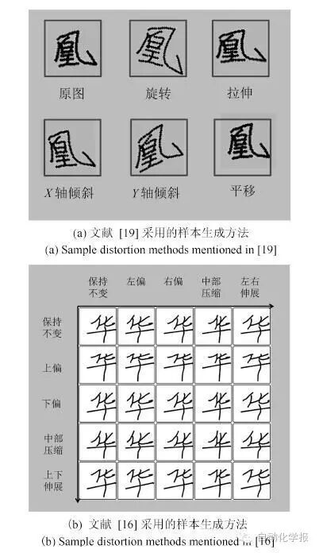
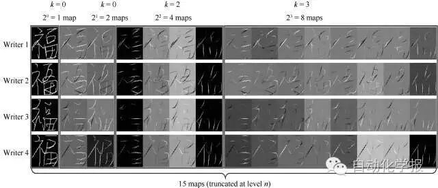
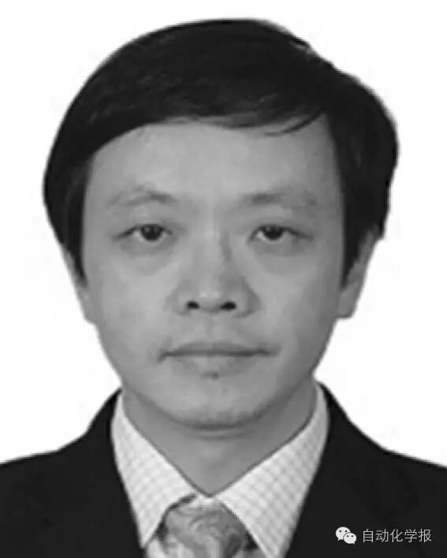
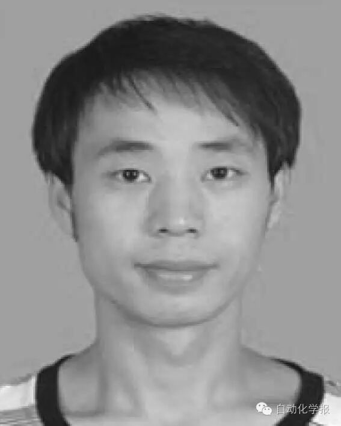
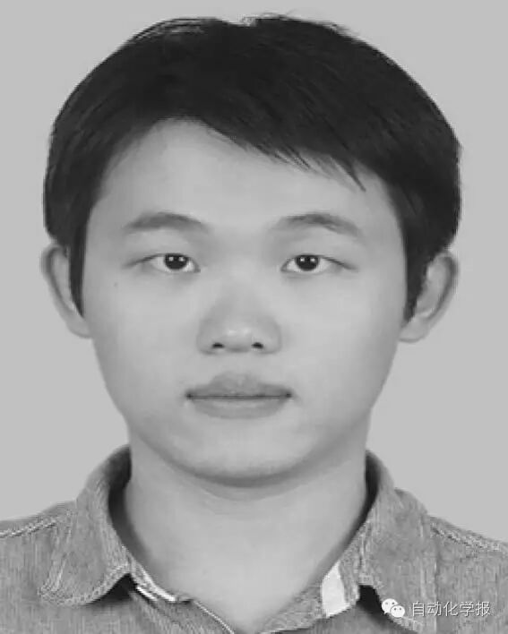
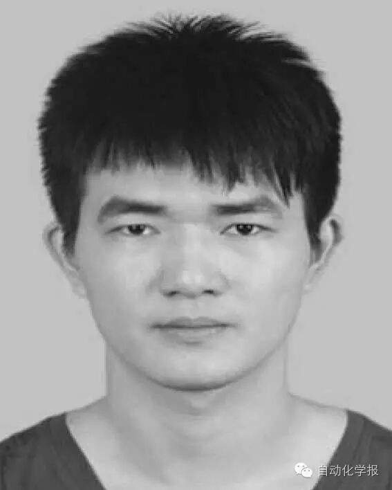

# 深度学习在手写汉字识别中的应用综述

原创 自动化学报 2016-08-30 16:38 北京

> 原文地址: [https://mp.weixin.qq.com/s/4pqPRLMTJ3qyZnunw\_OBxg](https://mp.weixin.qq.com/s/4pqPRLMTJ3qyZnunw_OBxg)

本文综述了深度学习在手写汉字识别领域的研究进展及具体应用。首先介绍了手写汉字识别的研究背景与现状。其次简要概述了深度学习的几种典型结构模型并介绍了一些主流的开源工具,在此基础上详细综述了基于深度学习的联机和脱机手写汉字识别的方法,阐述了相关方法的原理、技术细节、性能指标等现状情况,最后进行了分析与总结, 指出了手写汉字识别领域仍需要解决的问题及未来的研究方向。

近年来,由于智能手机、平板电脑等触屏智能设备以及以Microsoft Surface Pro、iPad Pro、三星Note 等为代表的手写笔交互的移动互联网智能设备的迅猛发展,并逐渐在人们日常生活中占据重要地位。随着触屏智能手机代替传统键盘手机,笔交互设备的第二次复兴,文字输入从原来纯键盘的拼音或五笔输入方式将逐渐变成虚拟键盘、手写和语音等多种输入结合的方式。艾媒咨询2015年中国市场调研数据显示:输入方式的使用比例中,手写输入方式占13.1%,仅次于九宫格拼音(占47.2%)和全键盘拼音输入(占24.8%),并远大于语音输入(占5.8%)和五笔输入(3.6%),手写输入用户连续三年呈现平稳增长态势,手写输入作为一个重要的触屏交互应用也逐渐流行并广受重视,每天将产生大量的各种各样手写样本。因此,中文手写识别技术仍然值得更多的关注和更深入的研究。

图1 几种常用的手写汉字数据增广技术示意图

  

手写体汉字识别经历了四十多年的长足发展,在单字和文本行识别性能上有了很大的提高,特别是以CNN为代表的一系列深度学习模型的出现,手写单字符中文识别问题已经基本上得到了很好解决,无论是联机还是脱机手写中文字符识别,目前基于CNN及其改进模型的方法均取得了接近甚至是超过人眼识别性能的高识别率。然而,在手写汉字识别领域,仍然很多值得研究的问题有待解决,例如:  

1) 手写文本行识别问题：目前基于深度学习模型的联机及脱机手写文本行识别的成功报道还不多,自从ICDAR 2013中文手写文本行竞赛以来,近两年在此方向上仍然没有突破性进展,特别是以整行为单位来评价识别率,行级别的识别率将会很低,仍然有很大的提升空间。 联机及脱机手写文本行识别仍然是未解决的难题。

2) 无约束的手写文字识别问题：其中一个值得关注的研究问题是旋转无关的手写识别问题,根据2010年发布的国家标准“GB/T18790-2010联机手写汉字识别系统技术要求与测试规程”，手写输入软件及设备必须要能识别正负45°的手写样本,然而目前市场上的绝大部分主流输入法产品均无法满足此要求。尽管一些研究人员注意到此问题,此问题仍然远未得到有效解决。相信深度学习新技术的出现,将为解决此问题提供崭新的思路及技术手段。 另外,目前的研究工作绝大部分局限于解决单一的问题, 对于混合手写单字/文本行/重叠以及来自整屏任意无约束书写的手写汉字识别的研究工作仍然鲜有报道,这是一个值得研究的课题。

3) 超大类别手写汉字识别问题：目前手写汉字识别研究报道所能识别的文字类型基本上以国标一级字库3755类汉字为主,针对实际应用场景下要能识别10000个以上类别的实用化手写识别研究的报道还不多,且缺乏公开的超大类别(例如支持GB8010-2000标准的27533类)训练及测试数据集。在如此大类别的情况下, 如何研究一个处理速度快、模型参数足够小的可实用化的基于深度学习的解决方案将变得极具挑战性。 

4) 新的深度学习模型在手写汉字识别中的应用研究：目前在手写汉字识别领域能取得比传统方法明显好的深度学习模型主要是基于CNN及其各种改进方法,其它的深度学习模型如DBN、RNN、LSTM/BLSTM/MDLSTM以及深度强化学习(DRN)模型在大类别手写汉字识别中的研究工作开展得还不多,各种深度学习模型之间的相互联系及融合应用的研究并不深入,我们十分期待其它的深度学习模型以及未来能有更新更好的针对文字识别的深度模型能提出来,并在手写汉字识别领域能取得突破性进展,从而促进此领域的研究及发展。

5) 近年来,随着大量的互联网图片爆炸式增长,自然场景中的文字检测及识别成为文字识别乃至计算机视觉领域一个极其重要和广受关注的研究课题,深度学习理论及技术的出现及发展为解决这一难题提供了很好的解决方案,近年来已经出现了大量研究成果。但与传统的MSER等框架的方法相比,深度学习的方法处理速度慢,模型参数存储量大等也亟待解决。在检测识别精度方面,从ICDAR2015场景文字检测及识别竞赛的结果来看，非受限环境下的自然场景文字(Incidental Scene Text)检测及识别性能还远未得到有效解决,此外,目前绝大多数研究工作是针对英文语言,针对中文的自然场景文字检测及识别的研究报道还不多见,而自然场景图像中的手写汉字检测及识别方面的研究工作开展的还很少,要解决这些问题任重而道远。

图2 手写汉字的路径积分特征图可视化

  

总体而言,深度学习为解决手写汉字识别提供了新的理念及技术,近几年来也在此领域诸多方面取得了大量的研究成果,但仍然有不少研究问题值得进一步研究。本文通过对相关领域的研究进展的回顾及分析讨论,希望能够给该领域的研究人员带来新的信息及研究思路,共同促进手写体汉字识别及相关文档分析与识别领域的进一步发展与繁荣。  

引用格式

金连文, 钟卓耀, 杨钊, 杨维信, 谢泽澄, 孙俊. 深度学习在手写汉字识别中的应用综述. 自动化学报,2016, 42(8):1125-1141

作者简介

金连文 华南理工大学电子与信息学院教授. 1991 年在中国科学技术大学获得学士学位, 1996 年在华南理工大学获得博士学位. 主要研究方向为模式识别, 深度学习, 文字识别, 图像处理, 计算机视觉. 本文通信作者.

E-mail: lianwen.jin@gmail.com

钟卓耀 华南理工大学电子与信息学院博士研究生. 2015 年获得华南理工大学工学学士学位. 主要研究方向为机器学习, 模式识别, 自然场景文字检测与识别.

E-mail: z.zhuoyao@mail.scut.edu.cn

杨钊 广州大学机械与电气工程学院讲师. 2014 年获得华南理工大学信息与通信工程专业博士学位. 主要研究方向为机器学习, 模式识别, 计算机视觉.

E-mail: 15989023646@126.com

杨维信 华南理工大学电子与信息学院博士研究生. 2013 年获得华南理工大学工学学士学位. 主要研究方向为机器学习, 手写分析和识别, 计算机视觉和智能系统. 

E-mail: wxy1290@163.com

谢泽澄 华南理工大学电子与信息学院博士研究生. 2014 年获得华南理工大学工学学士学位. 主要研究方向为机器学习, 文档分析与识别, 计算机视觉和人机交互. 

E-mail: xiezcheng@foxmail.com

孙俊 富士通研究开发中心有限公司信息技术研究部部长. 2002 年获得清华大学模式识别和智能系统博士学位. 主要研究方向为图像处理、机器学习和模式识别. 

E-mail: sunjun@cn.fujitsu.com

欢迎扫描二维码、长按图片识别关注《自动化学报》中文版订阅号aas1963，服务号自动化学报和英文版服务号！

