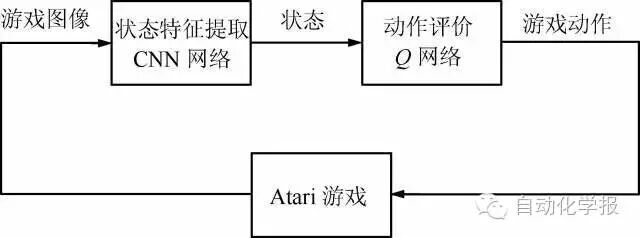
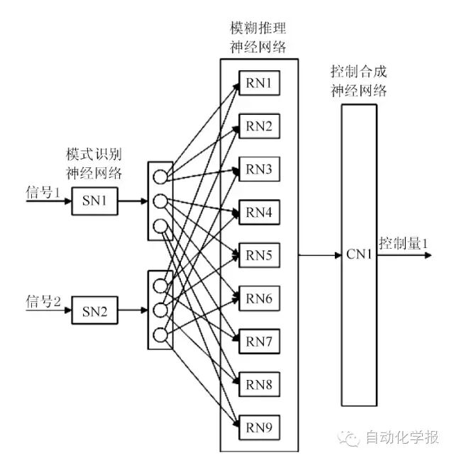
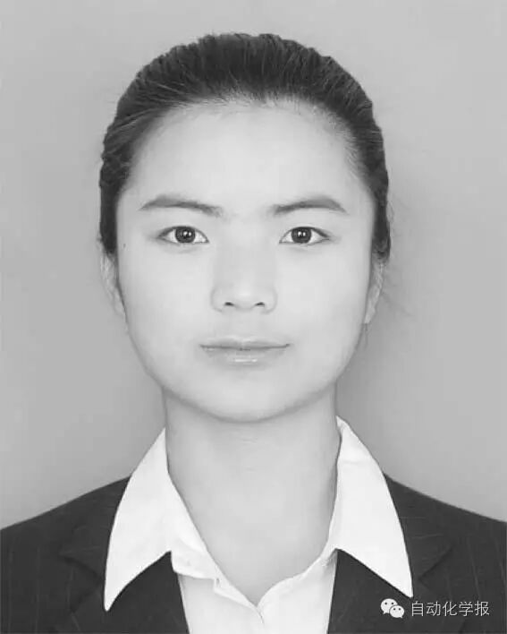
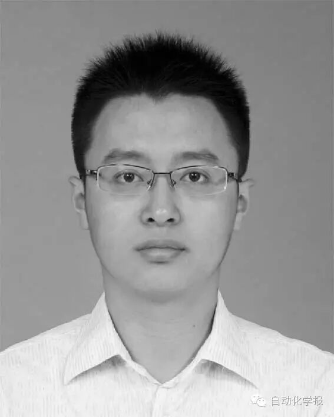
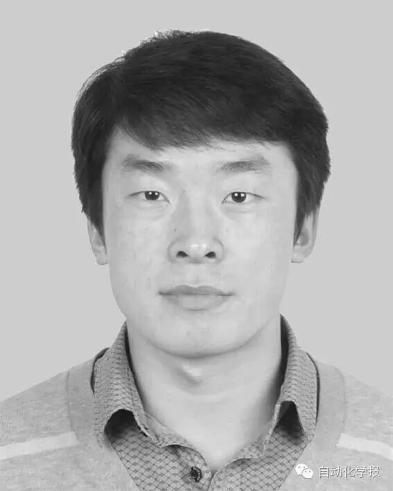
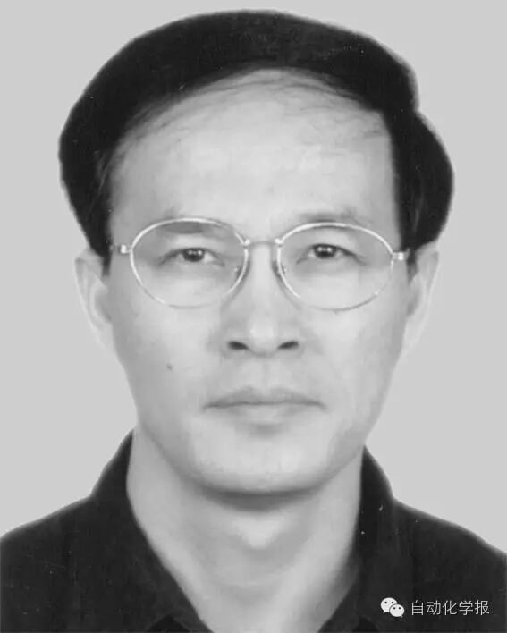

# 深度学习在控制领域的研究现状与展望

原创 自动化学报 2016-05-23 16:22 北京

> 原文地址: [https://mp.weixin.qq.com/s/06doKgzTKf-TpnMYmCJ1kA](https://mp.weixin.qq.com/s/06doKgzTKf-TpnMYmCJ1kA)

摘要

深度学习在特征提取与模型拟合方面显示了其潜力和优势.对于存在高维数据的控制系统, 引入深度学习具有一定的意义. 近年来,已有一些研究关注深度学习在控制领域的应用.本文介绍了深度学习在控制领域的研究方向和现状, 包括控制目标识别、状态特征提取、系统参数辨识和控制策略计算.并对相关的深度控制以及自适应动态规划与平行控制的方法和思想进行了描述.总结了深度学习在控制领域研究中的主要作用和存在的问题,展望了未来值得研究的方向.

  

关键词

深度学习, 控制, 特征, 自适应动态规划

引用格式

段艳杰, 吕宜生, 张杰, 赵学亮, 王飞跃. 深度学习在控制领域的研究现状与展望. 自动化学报, 2016, 42(5): 643-654

图 1. 使用深度学习进行Atari 游戏

图 2. 深度模糊控制网络

作者简介

段艳杰 中国科学院自动化研究所复杂系统管理与控制国家重点实验室博士研究生. 主要研究方向为智能交通系统, 机器学习及应用. 

E-mail: duanyanjie2012@ia.ac.cn

吕宜生 中国科学院自动化研究所复杂系统管理与控制国家重点实验室助理研究员. 主要研究方向为交通数据分析, 动态交通建模, 平行交通管理与控制系统. 

E-mail: yisheng.lv@ia.ac.cn

张杰 中国科学院自动化研究所复杂系统管理与控制国家重点实验室助理研究员. 主要研究方向为拍卖机制, 最优控制与博弈论. 

E-mail: jie.zhang@ia.ac.cn

赵学亮 中国科学院自动化研究所复杂系统管理与控制国家重点实验室博士研究生, 中国自动化学会工程师. 主要研究方向为社会计算, 智能信息处理.

E-mail: xueliang.zhao@ia.ac.cn

王飞跃 中国科学院自动化研究所复杂系统管理与控制国家重点实验室研究员.主要研究方向为智能系统和复杂系统的建模, 分析与控制. 本文通信作者. 

E-mail: feiyue.wang@ia.ac.cn

