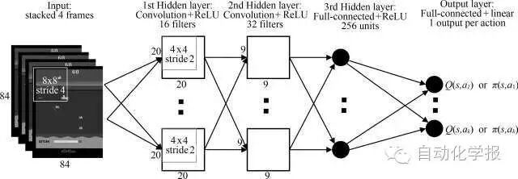

# 深度学习在游戏中的应用

原创 自动化学报 2016-05-23 16:22 北京

> 原文地址: [https://mp.weixin.qq.com/s/FeUQHmxkSe0Az-uAJWYaeg](https://mp.weixin.qq.com/s/FeUQHmxkSe0Az-uAJWYaeg)

摘要

综述了近年来发展迅速的深度学习技术及其在游戏(或博弈) 中的应用. 深度学习通过多层神经网络来构建端对端的从输入到输出的非线性映射, 相比传统的机器学习模型有显见的优势. 最近, 深度学习被成功地用于解决强化学习中的策略评估和策略优化的问题, 并于多种游戏的人工智能取得了突破性的提高. 本文详述了深度学习在常见游戏中的应用.

关键词

深度学习, 博弈, 深度强化学习, 围棋, 人工智能

引用格式

郭潇逍, 李程, 梅俏竹. 深度学习在游戏中的应用. 自动化学报, 2016, 42(5): 676-684

图 1.   卷积神经网络学习从游戏屏幕到游戏策略的映射

作者简介

郭潇 逍密歇根大学电子工程与计算机系博士研究生. 主要研究方向为深度学习和深度强化学习.

E-mail: guoxiao@umich.edu

李程 密歇根大学信息学院博士研究生. 主要研究方向为数据挖掘与信息检索.

 E-mail: lichengz@umich.edu

梅俏竹 密歇根大学信息学院和电子工程与计算机系副教授. 主要研究方向为大规模的数据挖掘, 信息检索和机器学习. 本文通信作者.

E-mail: qmei@umich.edu

  

