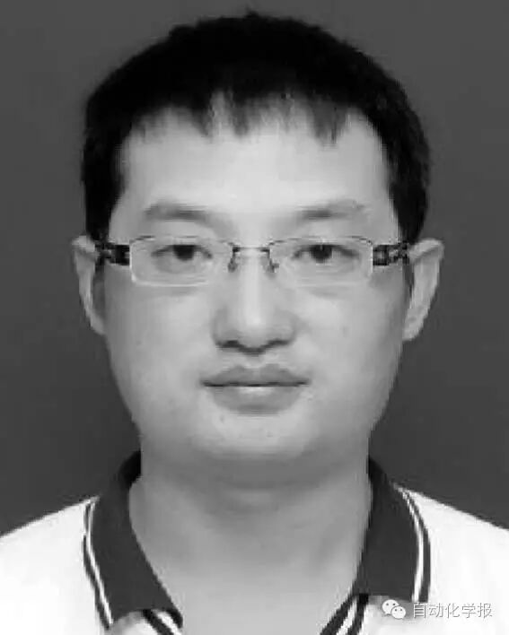

# 深度学习在视频目标跟踪中的应用进展与展望

原创 自动化学报 2016-06-30 09:10 北京

> 原文地址: [https://mp.weixin.qq.com/s/E01oMuv9MtKir797r-dwQw](https://mp.weixin.qq.com/s/E01oMuv9MtKir797r-dwQw)

  
  

深度学习在视频目标跟踪中的应用进展与展望—语音图文信息处理中的深度学习方法进展专刊

视频目标跟踪是计算机视觉的重要研究课题, 在视频监控、机器人等方面具有广泛应用.本文在对基本研究框架进行说明的基础上，介绍了目前发展迅猛的深度学习方法在视频目标跟踪中的最新具体应用情况并进行了深入分析与总结. 对深度学习方法在视频目标跟踪中的未来应用与发展方向进行了展望，对相关研究人员具有较好的参考价值.

第一章介绍了当前视频目标跟踪的研究框架及关键技术，可以使读者快速理解视频目标跟踪自身的特点和当前最主流的研究方法.

第二章介绍了目前最为流行的跟踪算法测试平台与评测方法，使读者快速了解如何来评价一个跟踪算法的好坏.

第三章本文的核心，介绍了目前发展火热的深度学习方法在视频目标跟踪这一特殊的多媒体内容分析领域的应用情况.除了介绍已有的工作进展，作者还对深度学习在跟踪中应用的困难、潜在的解决方案进行了深入总结与分析；对深度学习与浅层学习之间及深度学习中各种方法之间进行了对比分析.相信可以使读者对目前深度学习在跟踪中的应用有非常透彻的认识与理解.

最后对视频目标跟踪研究的发展趋势进行了展望，相信读者可以从中找出适合自己的创新点继而进行深入研究.

引用格式

管皓, 薛向阳, 安志勇. 深度学习在视频目标跟踪中的应用进展与展望. 自动化学报, 2016, 42(6): 834-847

作者简介

管皓 复旦大学计算机科学技术学院博士研究生. 主要研究方向为多媒体内容分析, 深度学习. 本文通信作者.

E-mail: guanh13@fudan.edu.cn

薛向阳 复旦大学计算机科学技术学院教授. 主要研究方向为视频大数据分析,计算机视觉, 深度学习.

E-mail: xyxue@fudan.edu.cn

安志勇 复旦大学计算机科学技术学院博士后. 2008 年获得西安电子科技大学博士学位. 主要研究方向为图像与视频内容分析、检索.

E-mail: azytyut@163.com

